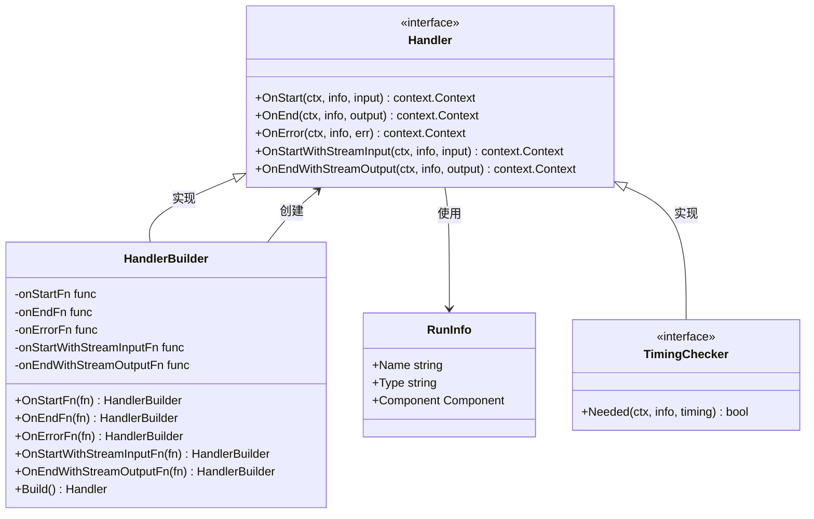
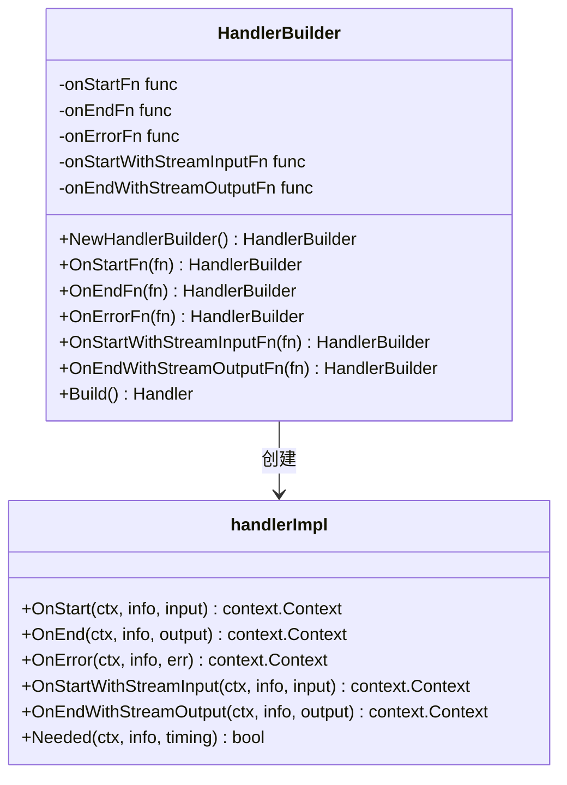
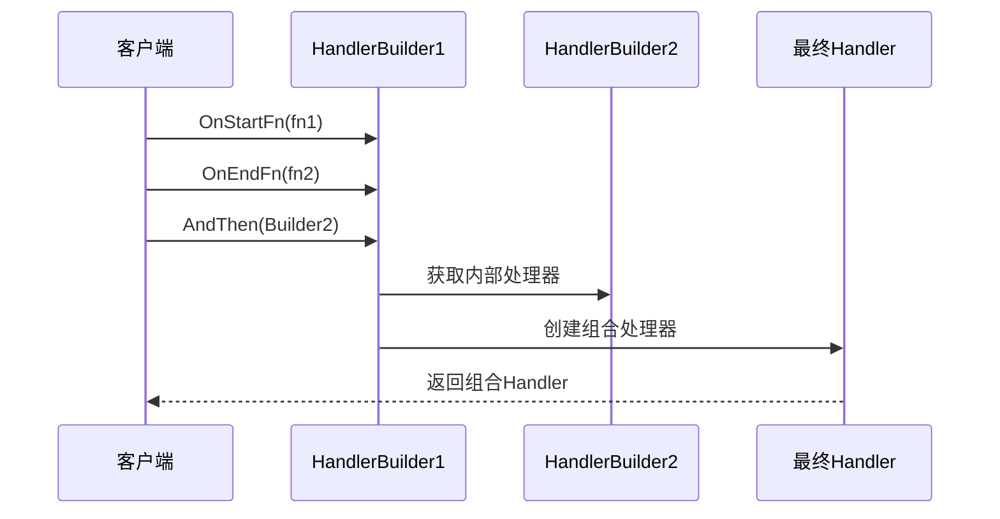
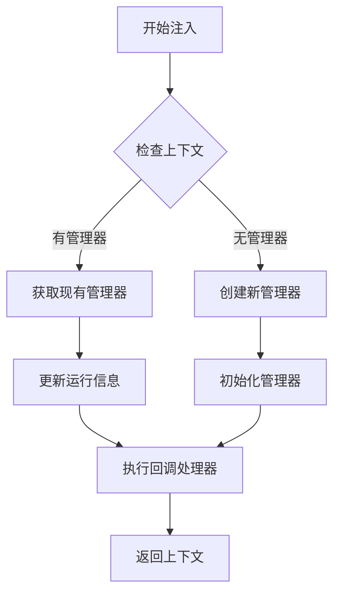
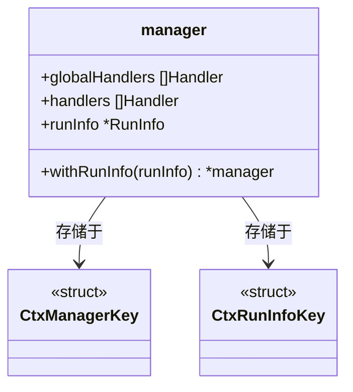
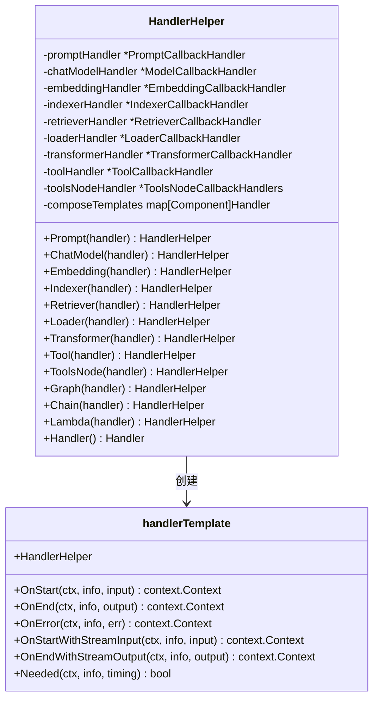
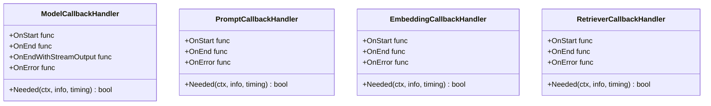
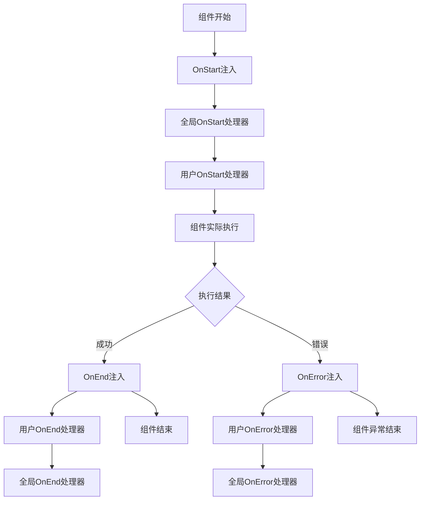
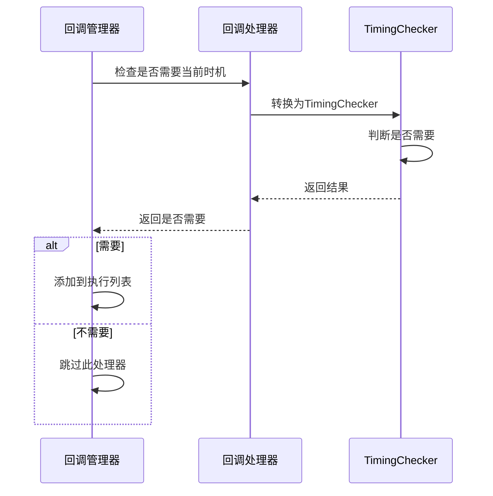

# 回调系统 (Callbacks) API 参考文档

<cite>
**本文档中引用的文件**
- [callbacks/interface.go](file://callbacks/interface.go)
- [callbacks/handler_builder.go](file://callbacks/handler_builder.go)
- [callbacks/aspect_inject.go](file://callbacks/aspect_inject.go)
- [callbacks/doc.go](file://callbacks/doc.go)
- [internal/callbacks/interface.go](file://internal/callbacks/interface.go)
- [internal/callbacks/manager.go](file://internal/callbacks/manager.go)
- [internal/callbacks/inject.go](file://internal/callbacks/inject.go)
- [utils/callbacks/template.go](file://utils/callbacks/template.go)
- [components/embedding/callback_extra.go](file://components/embedding/callback_extra.go)
- [components/model/callback_extra.go](file://components/model/callback_extra.go)
- [compose/graph_call_options.go](file://compose/graph_call_options.go)
</cite>

## 目录
1. [简介](#简介)
2. [核心接口与类型](#核心接口与类型)
3. [Handler接口详解](#handler接口详解)
4. [HandlerBuilder构建器](#handlerbuilder构建器)
5. [注入机制](#注入机制)
6. [HandlerHelper模板](#handlerhelper模板)
7. [回调时机与执行顺序](#回调时机与执行顺序)
8. [实际应用示例](#实际应用示例)
9. [最佳实践](#最佳实践)
10. [故障排除](#故障排除)

## 简介

Eino框架的回调系统提供了一个强大而灵活的机制，用于在组件执行的不同阶段注入自定义逻辑。该系统支持五种核心切面方法，允许开发者实现日志记录、监控、追踪等功能，同时保持代码的清晰性和可维护性。

回调系统的核心优势：
- **非侵入式设计**：无需修改现有组件代码即可添加功能
- **多维度控制**：支持同步和流式输入输出的回调处理
- **灵活组合**：支持多个处理器的链式组合
- **类型安全**：提供强类型的回调输入输出处理

## 核心接口与类型

### 主要接口定义



**图表来源**
- [callbacks/interface.go](file://callbacks/interface.go#L38-L47)
- [callbacks/handler_builder.go](file://callbacks/handler_builder.go#L25-L30)
- [internal/callbacks/interface.go](file://internal/callbacks/interface.go#L26-L32)

### 核心类型定义

| 类型 | 描述 | 用途 |
|------|------|------|
| `RunInfo` | 运行时信息容器 | 包含节点名称、组件类型和组件实例 |
| `CallbackInput` | 回调输入类型 | 组件特定的输入数据，需要类型转换 |
| `CallbackOutput` | 回调输出类型 | 组件特定的输出数据，需要类型转换 |
| `CallbackTiming` | 回调时机枚举 | 定义五个核心回调时机 |

**章节来源**
- [callbacks/interface.go](file://callbacks/interface.go#L23-L48)
- [internal/callbacks/interface.go](file://internal/callbacks/interface.go#L26-L32)

## Handler接口详解

Handler接口是回调系统的核心，定义了五个关键的切面方法，每个方法都有特定的调用时机和参数结构。

### OnStart 方法

**签名**：`OnStart(ctx context.Context, info *RunInfo, input CallbackInput) context.Context`

**参数说明**：
- `ctx`：上下文对象，用于传递请求状态和取消信号
- `info`：运行时信息，包含组件类型、名称和实例
- `input`：回调输入，需要根据具体组件类型进行转换

**调用时机**：组件开始执行前调用，所有全局处理器按添加顺序逆序执行

**典型用途**：
- 记录组件启动时间
- 初始化性能监控指标
- 设置请求跟踪标识
- 验证输入参数

### OnEnd 方法

**签名**：`OnEnd(ctx context.Context, info *RunInfo, output CallbackOutput) context.Context`

**参数说明**：
- `ctx`：上下文对象
- `info`：运行时信息
- `output`：回调输出，需要类型转换

**调用时机**：组件正常结束时调用，所有处理器按添加顺序正序执行

**典型用途**：
- 记录执行时间和结果
- 更新统计数据
- 清理资源
- 发送通知

### OnError 方法

**签名**：`OnError(ctx context.Context, info *RunInfo, err error) context.Context`

**参数说明**：
- `ctx`：上下文对象
- `info`：运行时信息
- `err`：发生的错误

**调用时机**：组件发生错误时调用，所有处理器按添加顺序正序执行

**典型用途**：
- 错误日志记录
- 异常监控告警
- 错误恢复策略
- 调试信息收集

### OnStartWithStreamInput 方法

**签名**：`OnStartWithStreamInput(ctx context.Context, info *RunInfo, input *schema.StreamReader[CallbackInput]) context.Context`

**参数说明**：
- `ctx`：上下文对象
- `info`：运行时信息
- `input`：流式输入读取器

**调用时机**：组件开始处理流式输入前调用，处理器按添加顺序逆序执行

**典型用途**：
- 流式输入的预处理
- 输入验证和过滤
- 流量控制
- 数据转换

### OnEndWithStreamOutput 方法

**签名**：`OnEndWithStreamOutput(ctx context.Context, info *RunInfo, output *schema.StreamReader[CallbackOutput]) context.Context`

**参数说明**：
- `ctx`：上下文对象
- `info`：运行时信息
- `output`：流式输出读取器

**调用时机**：组件完成流式输出后调用，处理器按添加顺序正序执行

**典型用途**：
- 输出流的后处理
- 结果聚合和汇总
- 流式数据的最终化处理
- 性能统计

**章节来源**
- [internal/callbacks/interface.go](file://internal/callbacks/interface.go#L38-L47)
- [callbacks/handler_builder.go](file://callbacks/handler_builder.go#L37-L58)

## HandlerBuilder构建器

HandlerBuilder提供了便捷的方式来创建自定义回调处理器，支持链式调用和多种回调方法的组合。

### 构建器结构



**图表来源**
- [callbacks/handler_builder.go](file://callbacks/handler_builder.go#L25-L30)
- [callbacks/handler_builder.go](file://callbacks/handler_builder.go#L33-L34)

### 构建器方法详解

| 方法 | 签名 | 描述 | 返回值 |
|------|------|------|--------|
| `OnStartFn` | `OnStartFn(fn func) *HandlerBuilder` | 设置开始回调函数 | 返回构建器实例 |
| `OnEndFn` | `OnEndFn(fn func) *HandlerBuilder` | 设置结束回调函数 | 返回构建器实例 |
| `OnErrorFn` | `OnErrorFn(fn func) *HandlerBuilder` | 设置错误回调函数 | 返回构建器实例 |
| `OnStartWithStreamInputFn` | `OnStartWithStreamInputFn(fn func) *HandlerBuilder` | 设置流式输入开始回调 | 返回构建器实例 |
| `OnEndWithStreamOutputFn` | `OnEndWithStreamOutputFn(fn func) *HandlerBuilder` | 设置流式输出结束回调 | 返回构建器实例 |
| `Build` | `Build() Handler` | 构建最终的Handler实例 | 返回Handler接口 |

### AndThen组合机制

HandlerBuilder支持通过`AndThen`方法组合多个处理器，形成处理器链：



**图表来源**
- [callbacks/handler_builder.go](file://callbacks/handler_builder.go#L121-L124)

**章节来源**
- [callbacks/handler_builder.go](file://callbacks/handler_builder.go#L25-L124)

## 注入机制

Eino提供了强大的注入机制，允许开发者在不修改组件代码的情况下注入回调逻辑。

### 核心注入函数



**图表来源**
- [internal/callbacks/inject.go](file://internal/callbacks/inject.go#L74-L104)

### 注入函数详解

| 函数 | 签名 | 功能描述 |
|------|------|----------|
| `OnStart` | `OnStart[T](ctx context.Context, input T) context.Context` | 触发OnStart逻辑，逆序执行处理器 |
| `OnEnd` | `OnEnd[T](ctx context.Context, output T) context.Context` | 触发OnEnd逻辑，正序执行处理器 |
| `OnError` | `OnError(ctx context.Context, err error) context.Context` | 触发OnError逻辑，正序执行处理器 |
| `OnStartWithStreamInput` | `OnStartWithStreamInput[T](ctx context.Context, input *schema.StreamReader[T]) (context.Context, *schema.StreamReader[T])` | 处理流式输入开始 |
| `OnEndWithStreamOutput` | `OnEndWithStreamOutput[T](ctx context.Context, output *schema.StreamReader[T]) (context.Context, *schema.StreamReader[T])` | 处理流式输出结束 |

### 上下文管理

回调系统通过上下文管理器来维护处理器状态：



**图表来源**
- [internal/callbacks/manager.go](file://internal/callbacks/manager.go#L24-L28)

**章节来源**
- [callbacks/aspect_inject.go](file://callbacks/aspect_inject.go#L54-L114)
- [internal/callbacks/inject.go](file://internal/callbacks/inject.go#L27-L187)

## HandlerHelper模板

HandlerHelper提供了针对不同组件类型的专门模板，简化了多组件回调处理器的创建过程。

### 模板处理器结构



**图表来源**
- [utils/callbacks/template.go](file://utils/callbacks/template.go#L56-L65)
- [utils/callbacks/template.go](file://utils/callbacks/template.go#L145-L147)

### 支持的组件类型

| 组件类型 | 对应的回调处理器 | 主要用途 |
|----------|------------------|----------|
| Prompt | `PromptCallbackHandler` | 提示词处理组件 |
| ChatModel | `ModelCallbackHandler` | 对话模型组件 |
| Embedding | `EmbeddingCallbackHandler` | 嵌入向量组件 |
| Indexer | `IndexerCallbackHandler` | 索引器组件 |
| Retriever | `RetrieverCallbackHandler` | 检索器组件 |
| Loader | `LoaderCallbackHandler` | 文档加载器组件 |
| Transformer | `TransformerCallbackHandler` | 文档转换器组件 |
| Tool | `ToolCallbackHandler` | 工具组件 |
| ToolsNode | `ToolsNodeCallbackHandlers` | 工具节点组件 |
| Graph | `Handler` | 图形编排组件 |
| Chain | `Handler` | 链式编排组件 |
| Lambda | `Handler` | Lambda表达式组件 |

### 组件特定回调处理器

每种组件类型都有对应的回调处理器结构：



**图表来源**
- [utils/callbacks/template.go](file://utils/callbacks/template.go#L428-L434)
- [utils/callbacks/template.go](file://utils/callbacks/template.go#L452-L458)
- [utils/callbacks/template.go](file://utils/callbacks/template.go#L386-L391)
- [utils/callbacks/template.go](file://utils/callbacks/template.go#L476-L484)

**章节来源**
- [utils/callbacks/template.go](file://utils/callbacks/template.go#L35-L143)
- [utils/callbacks/template.go](file://utils/callbacks/template.go#L145-L282)

## 回调时机与执行顺序

回调系统定义了五个明确的时机，每个时机都有特定的执行顺序和规则。

### 回调时机枚举

| 时机 | 常量值 | 执行顺序 | 适用场景 |
|------|--------|----------|----------|
| OnStart | `TimingOnStart` | 全局处理器逆序，用户处理器逆序 | 组件开始执行前 |
| OnEnd | `TimingOnEnd` | 用户处理器正序，全局处理器正序 | 组件正常结束时 |
| OnError | `TimingOnError` | 用户处理器正序，全局处理器正序 | 组件发生错误时 |
| OnStartWithStreamInput | `TimingOnStartWithStreamInput` | 全局处理器逆序，用户处理器逆序 | 流式输入开始前 |
| OnEndWithStreamOutput | `TimingOnEndWithStreamOutput` | 用户处理器正序，全局处理器正序 | 流式输出结束后 |

### 执行流程图



**图表来源**
- [internal/callbacks/inject.go](file://internal/callbacks/inject.go#L107-L187)

### TimingChecker机制

为了提高性能，回调系统实现了`TimingChecker`接口，允许处理器声明自己是否需要特定时机的回调：



**图表来源**
- [internal/callbacks/inject.go](file://internal/callbacks/inject.go#L94-L104)

**章节来源**
- [callbacks/interface.go](file://callbacks/interface.go#L71-L84)
- [internal/callbacks/inject.go](file://internal/callbacks/inject.go#L74-L104)

## 实际应用示例

以下展示了如何创建各种类型的回调处理器并将其注入到Eino编排流程中。

### 自定义日志处理器示例

```go
// 创建日志处理器
loggerHandler := callbacks.NewHandlerBuilder().
    OnStartFn(func(ctx context.Context, info *callbacks.RunInfo, input callbacks.CallbackInput) context.Context {
        log.Printf("[START] 组件 %s 开始执行: %s", info.Component, info.Name)
        return ctx
    }).
    OnEndFn(func(ctx context.Context, info *callbacks.RunInfo, output callbacks.CallbackOutput) context.Context {
        log.Printf("[END] 组件 %s 执行完成", info.Component)
        return ctx
    }).
    OnErrorFn(func(ctx context.Context, info *callbacks.RunInfo, err error) context.Context {
        log.Printf("[ERROR] 组件 %s 发生错误: %v", info.Component, err)
        return ctx
    }).
    Build()
```

### 监控指标处理器示例

```go
// 创建监控处理器
metricsHandler := callbacks.NewHandlerBuilder().
    OnStartFn(func(ctx context.Context, info *callbacks.RunInfo, input callbacks.CallbackInput) context.Context {
        startTime := time.Now()
        ctx = context.WithValue(ctx, "start_time", startTime)
        return ctx
    }).
    OnEndFn(func(ctx context.Context, info *callbacks.RunInfo, output callbacks.CallbackOutput) context.Context {
        if startTime, ok := ctx.Value("start_time").(time.Time); ok {
            duration := time.Since(startTime)
            metrics.DurationHistogram.WithLabelValues(string(info.Component)).Observe(duration.Seconds())
        }
        return ctx
    }).
    Build()
```

### 组合多个处理器

```go
// 组合多个处理器
compositeHandler := loggerHandler.AndThen(metricsHandler).AndThen(tracingHandler)

// 将处理器注入到编排流程
runnable.Invoke(ctx, input, compose.WithCallbacks(compositeHandler))
```

### 使用HandlerHelper处理多组件

```go
// 创建多组件处理器
multiComponentHandler := callbacks.NewHandlerHelper().
    ChatModel(&model.ModelCallbackHandler{
        OnStart: func(ctx context.Context, info *callbacks.RunInfo, input *model.CallbackInput) context.Context {
            log.Printf("模型调用开始: %s", input.Config.Model)
            return ctx
        },
        OnEnd: func(ctx context.Context, info *callbacks.RunInfo, output *model.CallbackOutput) context.Context {
            log.Printf("模型调用结束: %d tokens", output.TokenUsage.TotalTokens)
            return ctx
        },
    }).
    Embedding(&embedding.EmbeddingCallbackHandler{
        OnStart: func(ctx context.Context, info *callbacks.RunInfo, input *embedding.CallbackInput) context.Context {
            log.Printf("嵌入向量生成: %d 文本", len(input.Texts))
            return ctx
        },
    }).
    Handler()
```

### 流式处理示例

```go
// 处理流式输出的处理器
streamHandler := callbacks.NewHandlerBuilder().
    OnEndWithStreamOutputFn(func(ctx context.Context, info *callbacks.RunInfo, 
        output *schema.StreamReader[callbacks.CallbackOutput]) context.Context {
        
        // 创建新的流读取器来处理输出
        processedOutput, _ := schema.Pipe[callbacks.CallbackOutput](0)
        
        go func() {
            defer processedOutput.Close()
            
            for {
                item, err := output.Recv()
                if err != nil {
                    if err != io.EOF {
                        log.Printf("流读取错误: %v", err)
                    }
                    break
                }
                
                // 处理每个输出项
                processedItem := processOutputItem(item)
                processedOutput.Send(processedItem, nil)
            }
        }()
        
        return ctx
    }).
    Build()
```

**章节来源**
- [callbacks/doc.go](file://callbacks/doc.go#L24-L97)
- [compose/graph_call_options.go](file://compose/graph_call_options.go#L188-L192)

## 最佳实践

### 处理器设计原则

1. **单一职责**：每个处理器应该只负责一个特定的功能领域
2. **幂等性**：处理器应该能够安全地重复执行而不产生副作用
3. **性能考虑**：避免在回调中执行耗时操作，使用异步处理
4. **错误处理**：确保处理器不会因为自身错误影响主流程

### 全局处理器 vs 用户处理器

```go
// 全局处理器 - 适用于所有组件的基础功能
callbacks.AppendGlobalHandlers(globalLoggingHandler, globalMetricsHandler)

// 用户处理器 - 适用于特定场景的定制功能
specificHandler := callbacks.NewHandlerBuilder().
    OnStartFn(customLogic).
    Build()

runnable.Invoke(ctx, input, compose.WithCallbacks(specificHandler))
```

### 条件执行优化

```go
// 实现TimingChecker接口来优化性能
type OptimizedHandler struct {
    // 处理器字段
}

func (h *OptimizedHandler) Needed(ctx context.Context, info *callbacks.RunInfo, timing callbacks.CallbackTiming) bool {
    // 只在需要时才执行
    switch timing {
    case callbacks.TimingOnStart:
        return h.shouldHandleStart(info)
    case callbacks.TimingOnEnd:
        return h.shouldHandleEnd(info)
    default:
        return false
    }
}
```

### 上下文传递最佳实践

```go
// 正确的上下文传递方式
func (h *MyHandler) OnStart(ctx context.Context, info *callbacks.RunInfo, input callbacks.CallbackInput) context.Context {
    // 保存状态到上下文
    ctx = context.WithValue(ctx, "handler_state", "started")
    
    // 继续执行其他处理器
    return ctx
}
```

## 故障排除

### 常见问题及解决方案

| 问题 | 原因 | 解决方案 |
|------|------|----------|
| 回调未触发 | 处理器未正确注册 | 检查`WithCallbacks`选项是否正确设置 |
| 处理器执行顺序错误 | 全局处理器优先级问题 | 使用`AppendGlobalHandlers`而非`InitCallbackHandlers` |
| 内存泄漏 | 流式处理器未正确关闭 | 确保在流式处理器中正确关闭StreamReader |
| 类型断言失败 | CallbackInput类型转换错误 | 使用ConvCallbackInput进行类型转换 |
| 性能问题 | 回调中执行耗时操作 | 将耗时操作移到异步goroutine中 |

### 调试技巧

```go
// 启用回调调试
debugHandler := callbacks.NewHandlerBuilder().
    OnStartFn(func(ctx context.Context, info *callbacks.RunInfo, input callbacks.CallbackInput) context.Context {
        log.Printf("DEBUG: OnStart - %s.%s", info.Type, info.Name)
        return ctx
    }).
    OnEndFn(func(ctx context.Context, info *callbacks.RunInfo, output callbacks.CallbackOutput) context.Context {
        log.Printf("DEBUG: OnEnd - %s.%s", info.Type, info.Name)
        return ctx
    }).
    Build()
```

### 性能监控

```go
// 性能监控处理器
perfHandler := callbacks.NewHandlerBuilder().
    OnStartFn(func(ctx context.Context, info *callbacks.RunInfo, input callbacks.CallbackInput) context.Context {
        start := time.Now()
        ctx = context.WithValue(ctx, "perf_start", start)
        return ctx
    }).
    OnEndFn(func(ctx context.Context, info *callbacks.RunInfo, output callbacks.CallbackOutput) context.Context {
        if start, ok := ctx.Value("perf_start").(time.Time); ok {
            duration := time.Since(start)
            if duration > 1*time.Second {
                log.Printf("WARNING: 长时间执行: %s.%s took %v", info.Type, info.Name, duration)
            }
        }
        return ctx
    }).
    Build()
```

**章节来源**
- [callbacks/interface.go](file://callbacks/interface.go#L52-L66)
- [internal/callbacks/manager.go](file://internal/callbacks/manager.go#L24-L45)