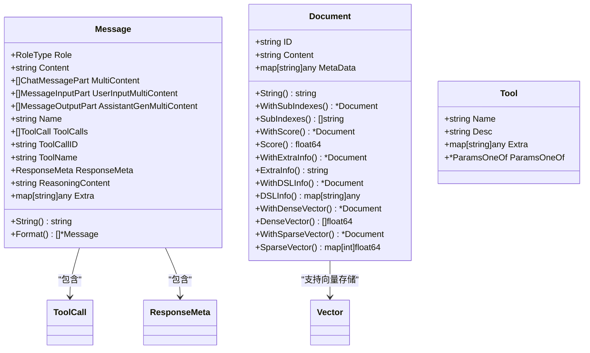
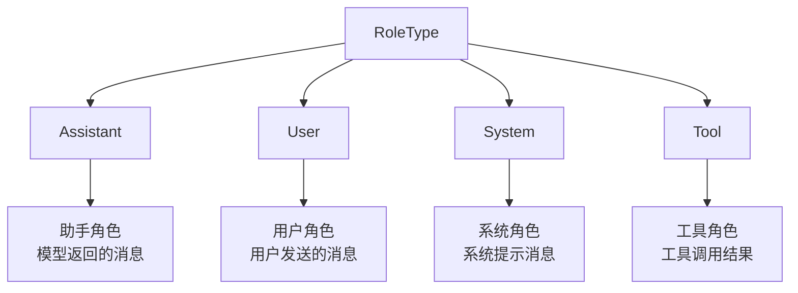
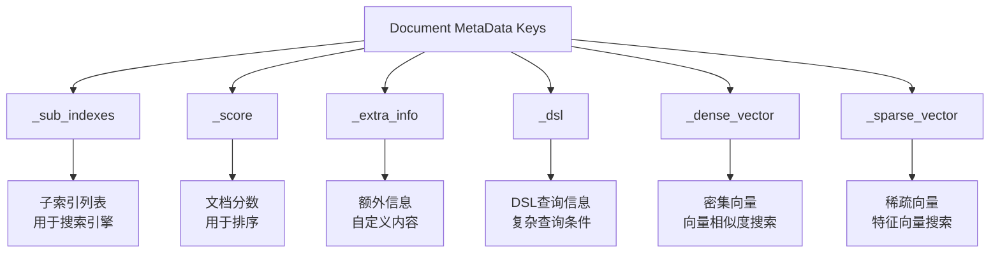
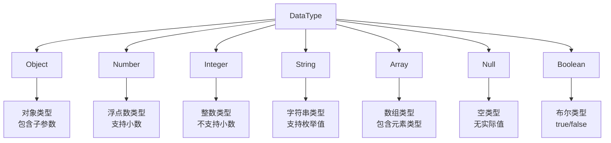
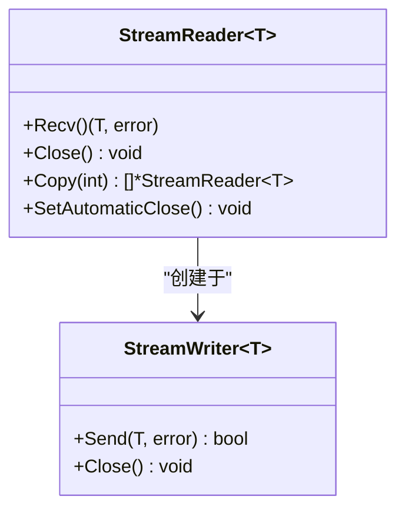
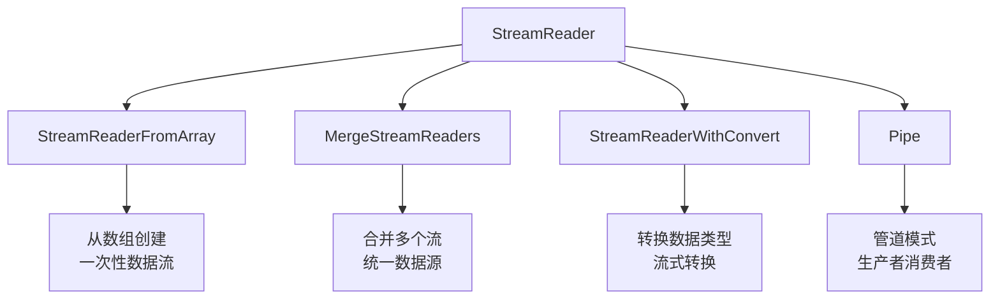
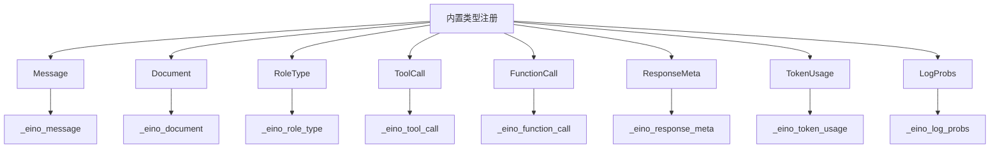

# 数据模型 (Schema) API 参考文档

<cite>
**本文档中引用的文件**
- [schema/doc.go](file://schema/doc.go)
- [schema/message.go](file://schema/message.go)
- [schema/document.go](file://schema/document.go)
- [schema/tool.go](file://schema/tool.go)
- [schema/stream.go](file://schema/stream.go)
- [schema/serialization.go](file://schema/serialization.go)
- [schema/message_parser.go](file://schema/message_parser.go)
- [schema/select.go](file://schema/select.go)
</cite>

## 目录
1. [简介](#简介)
2. [核心数据结构](#核心数据结构)
3. [Message 数据结构](#message-数据结构)
4. [Document 数据结构](#document-数据结构)
5. [Tool 数据结构](#tool-数据结构)
6. [Stream 处理系统](#stream-处理系统)
7. [序列化工具](#序列化工具)
8. [数据模型使用示例](#数据模型使用示例)
9. [最佳实践](#最佳实践)
10. [总结](#总结)

## 简介

Eino框架的`schema`包提供了整个框架的基础数据模型，定义了消息、文档和工具等核心概念的标准结构。这些数据结构不仅用于组件间的数据传递，还支撑着整个框架的架构设计。本文档详细介绍了这三个核心数据结构的字段定义、类型规范和使用方法。

## 核心数据结构

Eino框架的`schema`包包含以下三个核心数据结构：



**图表来源**
- [schema/message.go](file://schema/message.go#L433-L467)
- [schema/document.go](file://schema/document.go#L28-L36)
- [schema/tool.go](file://schema/tool.go#L60-L76)

## Message 数据结构

`Message`是Eino框架中最核心的数据结构，用于表示对话中的消息内容，支持文本和多模态内容。

### 基本字段定义

| 字段名 | 类型 | 描述 | 必需 |
|--------|------|------|------|
| `Role` | `RoleType` | 消息角色，可选值：`assistant`、`user`、`system`、`tool` | 是 |
| `Content` | `string` | 文本内容，用于用户输入和模型输出 | 否 |
| `Name` | `string` | 消息名称，用于标识特定的消息 | 否 |

### 多模态内容字段

| 字段名 | 类型 | 描述 | 使用场景 |
|--------|------|------|----------|
| `MultiContent` | `[]ChatMessagePart` | 已弃用，建议使用新的多模态字段 | 文本+图片混合内容 |
| `UserInputMultiContent` | `[]MessageInputPart` | 用户提供的多模态输入内容 | 用户上传的图片、音频等 |
| `AssistantGenMultiContent` | `[]MessageOutputPart` | 模型生成的多模态输出内容 | 模型生成的图片、音频等 |

### 工具调用相关字段

| 字段名 | 类型 | 描述 | 适用角色 |
|--------|------|------|----------|
| `ToolCalls` | `[]ToolCall` | 工具调用列表，仅适用于`assistant`角色 | 助手消息 |
| `ToolCallID` | `string` | 工具调用ID，仅适用于`tool`角色 | 工具返回消息 |
| `ToolName` | `string` | 工具名称，仅适用于`tool`角色 | 工具返回消息 |

### 元数据和响应信息

| 字段名 | 类型 | 描述 | 用途 |
|--------|------|------|------|
| `ResponseMeta` | `*ResponseMeta` | 响应元信息，包含完成原因、令牌使用等 | 模型响应统计 |
| `ReasoningContent` | `string` | 模型推理过程内容 | 思维链输出 |
| `Extra` | `map[string]any` | 自定义扩展信息 | 框架实现特定信息 |

### RoleType 枚举



**图表来源**
- [schema/message.go](file://schema/message.go#L94-L106)

### Message 结构体详解

#### 角色类型定义
- **`Assistant`**: 助手角色，表示模型返回的消息
- **`User`**: 用户角色，表示用户发送的消息  
- **`System`**: 系统角色，表示系统提示消息
- **`Tool`**: 工具角色，表示工具调用的结果

#### 多模态内容支持
Message结构体支持多种媒体类型的输入和输出：
- **文本内容**: 通过`Content`字段或`UserInputMultiContent`/`AssistantGenMultiContent`
- **图像内容**: 支持URL和Base64编码的图像数据
- **音频内容**: 支持音频文件的URL或Base64编码
- **视频内容**: 支持视频文件的URL或Base64编码
- **文件内容**: 支持各种文件格式的URL或Base64编码

**章节来源**
- [schema/message.go](file://schema/message.go#L433-L467)

## Document 数据结构

`Document`代表带有元数据的文本片段，是Eino框架中处理文档数据的核心结构。

### 基本字段定义

| 字段名 | 类型 | 描述 | 必需 |
|--------|------|------|------|
| `ID` | `string` | 文档的唯一标识符 | 是 |
| `Content` | `string` | 文档的内容 | 是 |
| `MetaData` | `map[string]any` | 文档的元数据，可用于存储额外信息 | 否 |

### 元数据操作方法

Document结构体提供了丰富的元数据操作方法：

#### 索引相关
- **`WithSubIndexes([]string)`**: 设置子索引，用于搜索引擎的子索引查询
- **`SubIndexes() []string`**: 获取子索引列表

#### 分数相关
- **`WithScore(float64)`**: 设置文档分数，用于排序和过滤
- **`Score() float64`**: 获取文档分数

#### 信息相关
- **`WithExtraInfo(string)`**: 设置额外信息
- **`ExtraInfo() string`**: 获取额外信息

#### 查询相关
- **`WithDSLInfo(map[string]any)`**: 设置DSL信息，用于复杂查询
- **`DSLInfo() map[string]any`**: 获取DSL信息

#### 向量相关
- **`WithDenseVector([]float64)`**: 设置密集向量，用于向量搜索
- **`DenseVector() []float64`**: 获取密集向量
- **`WithSparseVector(map[int]float64)`**: 设置稀疏向量
- **`SparseVector() map[int]float64`**: 获取稀疏向量

### 元数据键常量



**图表来源**
- [schema/document.go](file://schema/document.go#L19-L26)

**章节来源**
- [schema/document.go](file://schema/document.go#L28-L204)

## Tool 数据结构

`Tool`定义了工具的基本信息和参数规范，支持多种参数描述方式。

### ToolInfo 结构

| 字段名 | 类型 | 描述 | 必需 |
|--------|------|------|------|
| `Name` | `string` | 工具的唯一名称，清晰表达其用途 | 是 |
| `Desc` | `string` | 工具描述，告诉模型如何/何时/为什么使用该工具 | 是 |
| `Extra` | `map[string]any` | 工具的额外信息 | 否 |
| `ParamsOneOf` | `*ParamsOneOf` | 参数规范，支持多种描述方式 | 否 |

### 参数类型定义



**图表来源**
- [schema/tool.go](file://schema/tool.go#L29-L41)

### 参数信息结构

| 字段名 | 类型 | 描述 | 适用类型 |
|--------|------|------|----------|
| `Type` | `DataType` | 参数类型 | 所有参数 |
| `ElemInfo` | `*ParameterInfo` | 数组元素类型信息 | Array类型 |
| `SubParams` | `map[string]*ParameterInfo` | 对象子参数 | Object类型 |
| `Desc` | `string` | 参数描述 | 所有参数 |
| `Enum` | `[]string` | 枚举值列表 | String类型 |
| `Required` | `bool` | 是否必需 | 所有参数 |

### 参数描述方式

#### 1. 直接参数描述
使用`NewParamsOneOfByParams()`创建参数规范：
```go
params := map[string]*ParameterInfo{
    "name": {
        Type:     String,
        Desc:     "用户姓名",
        Required: true,
    },
    "age": {
        Type:     Integer,
        Desc:     "用户年龄",
        Required: false,
    },
}
```

#### 2. JSON Schema 描述
使用`NewParamsOneOfByJSONSchema()`创建参数规范：
```go
schema := &jsonschema.Schema{
    Type: "object",
    Properties: orderedmap.New[string, *jsonschema.Schema](),
    Required: []string{"name"},
}
```

#### 3. OpenAPI V3 描述
使用`NewParamsOneOfByOpenAPIV3()`创建参数规范：
```go
openAPISchema := &openapi3.Schema{
    Type:       "object",
    Properties: make(map[string]*openapi3.SchemaRef),
    Required:   []string{"name"},
}
```

### 工具选择策略

| 选项 | 类型 | 描述 | 使用场景 |
|------|------|------|----------|
| `ToolChoiceForbidden` | `forbidden` | 模型不应调用任何工具 | 纯对话场景 |
| `ToolChoiceAllowed` | `allowed` | 模型可以选择生成消息或调用工具 | 混合对话场景 |
| `ToolChoiceForced` | `forced` | 模型必须调用一个或多个工具 | 强制工具调用场景 |

**章节来源**
- [schema/tool.go](file://schema/tool.go#L43-L591)

## Stream 处理系统

Eino框架的`stream`包提供了强大的流式处理能力，支持数据的异步传输和处理。

### 核心接口

#### StreamReader 接口


**图表来源**
- [schema/stream.go](file://schema/stream.go#L140-L226)

### 流处理器类型



**图表来源**
- [schema/stream.go](file://schema/stream.go#L228-L308)

### 流处理功能

#### 1. 基础流操作
- **`Pipe[T](cap int)`**: 创建带缓冲容量的流管道
- **`StreamReaderFromArray[T](arr []T)`**: 从数组创建流读取器
- **`MergeStreamReaders[T](readers []*StreamReader[T])`**: 合并多个流读取器

#### 2. 流转换功能
- **`StreamReaderWithConvert[T,D](sr *StreamReader[T], convert func(T) (D, error))`**: 转换流数据类型
- **`StreamReaderWithConvert`**: 支持自定义转换逻辑

#### 3. 流复制功能
- **`Copy(n int)`**: 复制流读取器，支持多个独立消费者
- **`SetAutomaticClose()`**: 设置自动关闭机制

### 错误处理

#### 特殊错误类型
- **`ErrNoValue`**: 用于跳过空值的特殊错误
- **`ErrRecvAfterClosed`**: 在流关闭后尝试接收时返回
- **`SourceEOF`**: 表示特定源流的结束

#### 错误处理模式
```go
for chunk, err := stream.Recv(); err == nil; chunk, err = stream.Recv() {
    if errors.Is(err, io.EOF) {
        break
    }
    if errors.Is(err, ErrNoValue) {
        continue
    }
    // 处理正常数据
}
```

**章节来源**
- [schema/stream.go](file://schema/stream.go#L32-L800)

## 序列化工具

`serialization`包提供了类型注册和序列化功能，确保数据结构在持久化和传输过程中的兼容性。

### 注册机制

#### 类型注册函数

| 函数名 | 描述 | 使用场景 |
|--------|------|----------|
| `RegisterName[T any](name string)` | 使用指定名称注册类型 | 维护向后兼容性 |
| `Register[T any]()` | 自动推导类型名称注册 | 新类型推荐使用 |

#### 注册规则
- **需要注册的类型**: 顶级类型、接口字段的具体类型
- **不需要注册的类型**: 结构体字段的简单类型（如`string`、`int`）
- **序列化限制**: 仅支持导出的结构体字段，函数和通道会被忽略

### 支持的内置类型注册



**图表来源**
- [schema/serialization.go](file://schema/serialization.go#L27-L54)

### 序列化配置

#### gob 包集成
- 使用Go标准库`encoding/gob`进行序列化
- 支持复杂的嵌套结构和接口类型
- 提供高效的二进制序列化格式

#### 类型名称解析
```go
func getTypeName(rt reflect.Type) string {
    name := rt.String()
    // 处理命名类型和指针类型
    if rt.Name() == "" {
        if pt := rt; pt.Kind() == reflect.Pointer {
            star = "*"
            rt = pt.Elem()
        }
    }
    return name
}
```

**章节来源**
- [schema/serialization.go](file://schema/serialization.go#L56-L146)

## 数据模型使用示例

### Message 使用示例

#### 基础文本消息
```go
// 用户消息
userMsg := &schema.Message{
    Role:    schema.User,
    Content: "你好，请介绍一下自己。",
}

// 助手消息
assistantMsg := &schema.Message{
    Role:      schema.Assistant,
    Content:   "我是Eino框架构建的智能助手。",
    ToolCalls: []schema.ToolCall{},
}
```

#### 多模态消息
```go
// 用户上传图片的消息
multimodalMsg := &schema.Message{
    Role: schema.User,
    UserInputMultiContent: []schema.MessageInputPart{
        {
            Type: schema.ChatMessagePartTypeText,
            Text: "这张图片里有什么？",
        },
        {
            Type: schema.ChatMessagePartTypeImageURL,
            Image: &schema.MessageInputImage{
                MessagePartCommon: schema.MessagePartCommon{
                    URL: toPtr("https://example.com/image.jpg"),
                },
                Detail: schema.ImageURLDetailHigh,
            },
        },
    },
}
```

#### 工具调用消息
```go
// 包含工具调用的助手消息
toolMsg := &schema.Message{
    Role: schema.Assistant,
    Content: "",
    ToolCalls: []schema.ToolCall{
        {
            ID:    "call_12345",
            Type:  "function",
            Index: nil,
            Function: schema.FunctionCall{
                Name:      "get_weather",
                Arguments: `{"city": "北京", "date": "2024-01-01"}`,
            },
        },
    },
}
```

### Document 使用示例

#### 基础文档
```go
doc := &schema.Document{
    ID:      "doc_001",
    Content: "这是一篇关于人工智能的文章。",
    MetaData: map[string]any{
        "author": "张三",
        "date":   "2024-01-01",
        "tags":   []string{"AI", "技术"},
    },
}
```

#### 带向量的文档
```go
// 密集向量文档
denseDoc := &schema.Document{
    ID:      "doc_vector_001",
    Content: "机器学习是人工智能的重要分支。",
}.WithDenseVector([]float64{0.1, 0.2, 0.3, 0.4})

// 稀疏向量文档
sparseDoc := &schema.Document{
    ID:      "doc_sparse_001",
    Content: "深度学习在计算机视觉领域表现优异。",
}.WithSparseVector(map[int]float64{
    0: 0.5,
    2: 0.8,
    5: 0.3,
})
```

### Tool 使用示例

#### 基础工具定义
```go
// 简单工具
weatherTool := &schema.ToolInfo{
    Name: "get_weather",
    Desc: "获取指定城市的天气信息",
    ParamsOneOf: schema.NewParamsOneOfByParams(
        map[string]*schema.ParameterInfo{
            "city": {
                Type:     schema.String,
                Desc:     "城市名称",
                Required: true,
            },
            "date": {
                Type:     schema.String,
                Desc:     "日期（格式：YYYY-MM-DD）",
                Required: false,
            },
        },
    ),
}
```

#### 复杂工具定义
```go
// JSON Schema 工具
complexTool := &schema.ToolInfo{
    Name: "analyze_data",
    Desc: "分析数据集并生成报告",
    ParamsOneOf: schema.NewParamsOneOfByJSONSchema(
        &jsonschema.Schema{
            Type: "object",
            Properties: orderedmap.New[string, *jsonschema.Schema](),
            Required: []string{"dataset", "analysis_type"},
        },
    ),
}
```

### Stream 处理示例

#### 基础流处理
```go
// 创建流管道
reader, writer := schema.Pipe[string](10)

// 生产者
go func() {
    defer writer.Close()
    for i := 0; i < 5; i++ {
        writer.Send(fmt.Sprintf("chunk_%d", i), nil)
    }
}()

// 消费者
for chunk, err := reader.Recv(); err == nil; chunk, err = reader.Recv() {
    fmt.Println("Received:", chunk)
}
```

#### 流转换
```go
// 原始字符串流
strReader := schema.StreamReaderFromArray([]string{"1", "2", "3"})

// 转换为整数流
intReader := schema.StreamReaderWithConvert(strReader, 
    func(s string) (int, error) {
        return strconv.Atoi(s)
    })

// 消费转换后的流
for num, err := intReader.Recv(); err == nil; num, err = intReader.Recv() {
    fmt.Println("Converted number:", num)
}
```

### 数据模型传递示例

#### 组件间数据传递
```go
// 文档加载器到嵌入器的传递
func loadAndEmbed(ctx context.Context, loader document.Loader, embedder embedding.Embedder) ([]*schema.Document, error) {
    // 加载文档
    docs, err := loader.Load(ctx, document.Source{URI: "https://example.com"})
    if err != nil {
        return nil, err
    }
    
    // 添加向量信息
    for _, doc := range docs {
        vec, err := embedder.Embed(ctx, doc.Content)
        if err != nil {
            return nil, err
        }
        doc.WithDenseVector(vec)
    }
    
    return docs, nil
}
```

#### 消息处理流水线
```go
// 消息预处理
func preprocessMessages(messages []*schema.Message) []*schema.Message {
    processed := make([]*schema.Message, 0, len(messages))
    
    for _, msg := range messages {
        // 移除敏感信息
        if msg.Role == schema.User {
            msg.Content = sanitizeContent(msg.Content)
        }
        
        // 添加时间戳
        if msg.ResponseMeta == nil {
            msg.ResponseMeta = &schema.ResponseMeta{}
        }
        
        processed = append(processed, msg)
    }
    
    return processed
}
```

## 最佳实践

### Message 设计原则

1. **角色明确**: 每条消息必须明确指定角色
2. **内容完整**: 文本内容应保持完整性和一致性
3. **多模态支持**: 合理使用多模态内容字段
4. **工具调用**: 正确设置工具调用相关的字段

### Document 设计原则

1. **唯一标识**: 确保每个文档的ID唯一
2. **元数据组织**: 合理组织元数据信息
3. **向量利用**: 充分利用向量存储功能
4. **性能优化**: 根据使用场景选择合适的向量类型

### Tool 设计原则

1. **清晰命名**: 工具名称应清晰表达其功能
2. **详细描述**: 提供详细的工具描述和使用示例
3. **参数验证**: 正确设置参数的必需性和类型
4. **版本兼容**: 注意参数结构的向后兼容性

### Stream 处理原则

1. **资源管理**: 及时关闭不再使用的流
2. **错误处理**: 正确处理各种错误情况
3. **并发安全**: 注意流操作的并发安全性
4. **内存控制**: 合理设置流缓冲区大小

### 序列化最佳实践

1. **类型注册**: 新类型及时注册
2. **向后兼容**: 保持序列化格式的向后兼容
3. **性能考虑**: 选择合适的序列化方式
4. **安全性**: 注意序列化的安全性问题

## 总结

Eino框架的`schema`包提供了完整而强大的数据模型体系，涵盖了消息、文档和工具三大核心概念。通过精心设计的结构体和接口，该包实现了：

1. **统一的数据格式**: 为整个框架提供了标准化的数据交换格式
2. **灵活的扩展能力**: 支持多模态内容和自定义扩展
3. **强大的流处理**: 提供高效的异步数据处理能力
4. **完善的序列化**: 确保数据的持久化和传输安全

这些数据结构不仅是框架内部通信的基础，也为开发者提供了构建复杂AI应用的强大工具。掌握这些核心概念和使用方法，是深入理解和使用Eino框架的关键。