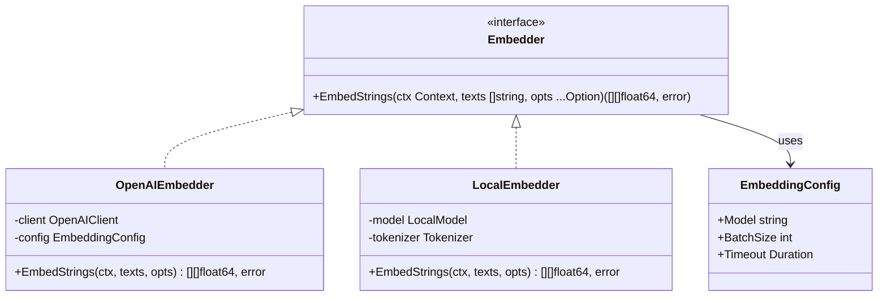
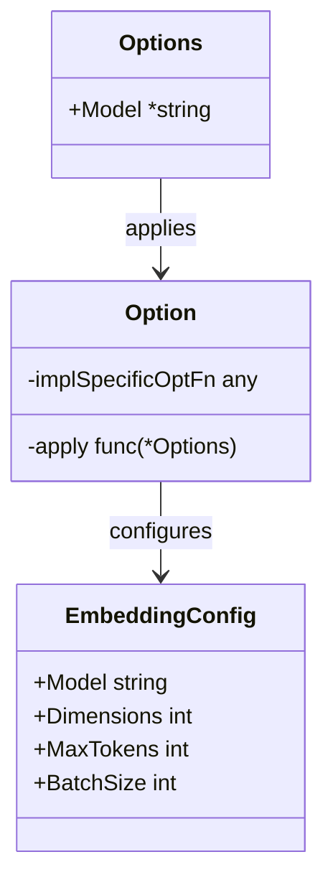
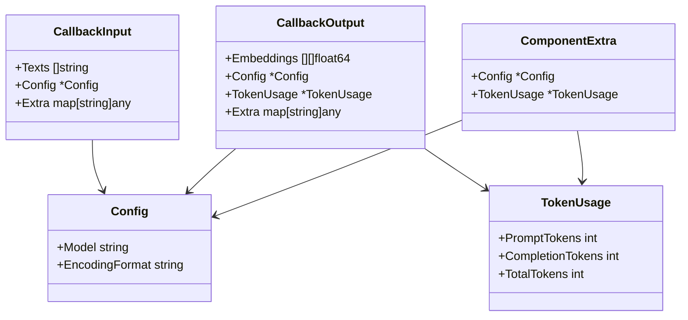
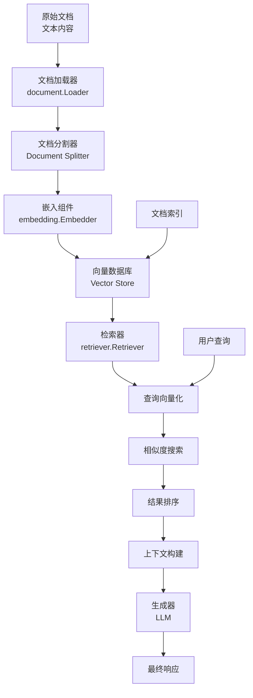

# 嵌入 (Embedding) API 参考文档

<cite>
**本文档中引用的文件**
- [components/embedding/doc.go](file://components/embedding/doc.go)
- [components/embedding/interface.go](file://components/embedding/interface.go)
- [components/embedding/option.go](file://components/embedding/option.go)
- [components/embedding/callback_extra.go](file://components/embedding/callback_extra.go)
- [components/embedding/option_test.go](file://components/embedding/option_test.go)
- [components/embedding/callback_extra_test.go](file://components/embedding/callback_extra_test.go)
- [components/embedding/Embedding_mock.go](file://components/embedding/Embedding_mock.go)
- [components/types.go](file://components/types.go)
- [compose/component_to_graph_node.go](file://compose/component_to_graph_node.go)
- [compose/graph.go](file://compose/graph.go)
- [compose/chain.go](file://compose/chain.go)
- [components/indexer/option.go](file://components/indexer/option.go)
- [components/retriever/option.go](file://components/retriever/option.go)
</cite>

## 目录
1. [简介](#简介)
2. [核心接口](#核心接口)
3. [配置选项](#配置选项)
4. [回调机制](#回调机制)
5. [与RAG系统的集成](#与rag系统的集成)
6. [实现指南](#实现指南)
7. [最佳实践](#最佳实践)
8. [故障排除](#故障排除)

## 简介

Eino框架的`components/embedding`包提供了强大的文本向量化能力，是构建现代AI应用和RAG（检索增强生成）系统的核心组件。该包定义了标准化的嵌入接口，支持将文本转换为高维向量表示，这些向量可用于语义搜索、相似度计算和智能检索等场景。

### 核心特性

- **标准化接口**：统一的`Embedder`接口设计，支持多种嵌入模型
- **灵活配置**：丰富的配置选项，支持模型选择、批处理优化等
- **RAG集成**：深度集成到RAG工作流中，与检索器和索引器无缝协作
- **回调支持**：完善的回调机制，支持监控、日志记录和性能分析
- **类型安全**：强类型的Go语言实现，确保编译时安全性

## 核心接口

### Embedder接口

`Embedder`接口是整个嵌入系统的核心抽象，定义了将文本转换为向量的基本契约。



**图表来源**
- [components/embedding/interface.go](file://components/embedding/interface.go#L22-L24)
- [components/embedding/option.go](file://components/embedding/option.go#L19-L23)

#### 方法签名

```go
EmbedStrings(ctx context.Context, texts []string, opts ...Option) ([][]float64, error)
```

#### 参数说明

| 参数 | 类型 | 描述 |
|------|------|------|
| `ctx` | `context.Context` | 上下文对象，用于控制超时和取消操作 |
| `texts` | `[]string` | 要嵌入的文本数组，每个字符串将被转换为一个向量 |
| `opts` | `...Option` | 可选的配置选项，用于定制嵌入行为 |

#### 返回值

| 返回值 | 类型 | 描述 |
|--------|------|------|
| `embeddings` | `[][]float64` | 文本对应的向量表示，二维浮点数数组 |
| `error` | `error` | 操作过程中发生的错误，如果成功则为nil |

**节来源**
- [components/embedding/interface.go](file://components/embedding/interface.go#L22-L24)

## 配置选项

### 基础配置结构

`Options`结构体定义了嵌入操作的基础配置项：



**图表来源**
- [components/embedding/option.go](file://components/embedding/option.go#L19-L47)

### 模型配置

#### WithModel函数

```go
func WithModel(model string) Option
```

设置要使用的嵌入模型名称。

**参数说明**
- `model`: 字符串形式的模型标识符，例如`"text-embedding-3-small"`或`"sentence-transformers/all-MiniLM-L6-v2"`

**使用示例**
```go
// 创建嵌入器并指定模型
embedder, err := openai.NewEmbedder(ctx, &openai.EmbeddingConfig{
    Model: "text-embedding-3-small",
})

// 使用选项配置模型
opts := embedding.GetCommonOptions(
    &embedding.Options{},
    embedding.WithModel("custom-model-name"),
)
```

**节来源**
- [components/embedding/option.go](file://components/embedding/option.go#L32-L39)

### 高级配置选项

#### 实现特定选项

框架支持为不同实现提供专门的配置选项：

```go
// 包装实现特定的选项函数
func WrapImplSpecificOptFn[T any](optFn func(*T)) Option

// 提取实现特定选项
func GetImplSpecificOptions[T any](base *T, opts ...Option) *T
```

**节来源**
- [components/embedding/option.go](file://components/embedding/option.go#L64-L96)

### 通用选项提取

```go
func GetCommonOptions(base *Options, opts ...Option) *Options
```

该函数用于从多个选项中提取通用配置，支持选项的合并和覆盖。

**节来源**
- [components/embedding/option.go](file://components/embedding/option.go#L42-L62)

## 回调机制

### 回调数据结构

嵌入组件提供了完整的回调机制，支持监控和追踪嵌入操作的执行过程。



**图表来源**
- [components/embedding/callback_extra.go](file://components/embedding/callback_extra.go#L23-L97)

### 数据转换函数

#### ConvCallbackInput

```go
func ConvCallbackInput(src callbacks.CallbackInput) *CallbackInput
```

将原始回调输入转换为嵌入专用的输入格式。

#### ConvCallbackOutput

```go
func ConvCallbackOutput(src callbacks.CallbackOutput) *CallbackOutput
```

将原始回调输出转换为嵌入专用的输出格式。

**节来源**
- [components/embedding/callback_extra.go](file://components/embedding/callback_extra.go#L71-L97)

## 与RAG系统的集成

### 在RAG工作流中的角色

嵌入组件在RAG系统中扮演着关键的数据转换角色，负责将非结构化文本转换为结构化的向量表示。



### 组件间协作

#### 与检索器的集成

```go
// 在检索器中使用嵌入器
retriever, err := vikingdb.NewRetriever(ctx, &vikingdb.RetrieverConfig{
    Collection: "my_collection",
})

// 设置嵌入器
opts := retriever.GetCommonOptions(
    &retriever.Options{},
    retriever.WithEmbedding(embedder),
)
```

**节来源**
- [components/retriever/option.go](file://components/retriever/option.go#L31-L89)

#### 与索引器的集成

```go
// 在索引器中使用嵌入器
indexer, err := volc_vikingdb.NewIndexer(ctx, &volc_vikingdb.IndexerConfig{
    Collection: "my_collection",
})

// 设置嵌入器
opts := indexer.GetCommonOptions(
    &indexer.Options{},
    indexer.WithEmbedding(embedder),
)
```

**节来源**
- [components/indexer/option.go](file://components/indexer/option.go#L1-L46)

### 图形节点转换

框架提供了将嵌入器转换为图形节点的机制：

```go
func toEmbeddingNode(node embedding.Embedder, opts ...GraphAddNodeOpt) (*graphNode, *graphAddNodeOpts)
```

这使得嵌入器可以直接集成到复杂的图执行环境中。

**节来源**
- [compose/component_to_graph_node.go](file://compose/component_to_graph_node.go#L54-L62)

## 实现指南

### 自定义嵌入器实现

#### 基本实现模板

```go
type CustomEmbedder struct {
    config EmbeddingConfig
    client APIClient
}

func NewCustomEmbedder(config *EmbeddingConfig) (*CustomEmbedder, error) {
    // 初始化嵌入器
    return &CustomEmbedder{
        config: *config,
    }, nil
}

func (e *CustomEmbedder) EmbedStrings(
    ctx context.Context, 
    texts []string, 
    opts ...Option,
) ([][]float64, error) {
    // 解析配置选项
    options := GetCommonOptions(&Options{}, opts...)
    
    // 执行嵌入逻辑
    embeddings, err := e.embedTexts(ctx, texts, options)
    if err != nil {
        return nil, err
    }
    
    return embeddings, nil
}
```

#### 集成到工作流

```go
// 创建链式工作流
chain := compose.NewChain[map[string]any, map[string]any]()

// 添加嵌入器节点
chain.AppendEmbedding(embedder)

// 编译并执行
compiled, err := chain.Compile(ctx)
if err != nil {
    log.Fatal(err)
}

result, err := compiled.Invoke(ctx, input)
```

**节来源**
- [compose/chain.go](file://compose/chain.go#L235-L242)

### 最佳实践

#### 错误处理

```go
func (e *CustomEmbedder) EmbedStrings(
    ctx context.Context,
    texts []string,
    opts ...Option,
) ([][]float64, error) {
    // 输入验证
    if len(texts) == 0 {
        return nil, fmt.Errorf("empty text array")
    }
    
    if len(texts) > e.config.MaxBatchSize {
        return nil, fmt.Errorf("batch size exceeds limit: %d > %d", 
            len(texts), e.config.MaxBatchSize)
    }
    
    // 超时控制
    ctx, cancel := context.WithTimeout(ctx, e.config.Timeout)
    defer cancel()
    
    // 执行嵌入
    embeddings, err := e.processEmbedding(ctx, texts)
    if err != nil {
        return nil, fmt.Errorf("embedding failed: %w", err)
    }
    
    return embeddings, nil
}
```

#### 性能优化

```go
// 批处理优化
func (e *CustomEmbedder) embedTexts(ctx context.Context, texts []string, opts *Options) ([][]float64, error) {
    // 分批处理
    batches := e.createBatches(texts, e.config.BatchSize)
    
    var embeddings [][]float64
    for _, batch := range batches {
        batchEmbeddings, err := e.processBatch(ctx, batch)
        if err != nil {
            return nil, err
        }
        
        embeddings = append(embeddings, batchEmbeddings...)
    }
    
    return embeddings, nil
}
```

## 最佳实践

### 模型选择策略

#### 不同场景的模型推荐

| 场景 | 推荐模型 | 特点 |
|------|----------|------|
| 快速原型开发 | text-embedding-3-small | 小尺寸，速度快 |
| 生产环境 | text-embedding-3-large | 平衡性能和质量 |
| 本地部署 | sentence-transformers/all-MiniLM-L6-v2 | 开源，离线可用 |
| 多语言支持 | text-embedding-ada-002 | 支持多种语言 |

### 批处理优化

```go
// 合理设置批处理大小
config := &EmbeddingConfig{
    BatchSize: 100,           // 根据内存和API限制调整
    MaxRetries: 3,            // 错误重试机制
    Timeout: 30 * time.Second, // 请求超时
}
```

### 内存管理

```go
// 大规模文本处理的内存优化
func processLargeTexts(embedder Embedder, texts []string) ([][]float64, error) {
    const chunkSize = 1000
    
    var allEmbeddings [][]float64
    for i := 0; i < len(texts); i += chunkSize {
        end := i + chunkSize
        if end > len(texts) {
            end = len(texts)
        }
        
        chunk := texts[i:end]
        embeddings, err := embedder.EmbedStrings(context.Background(), chunk)
        if err != nil {
            return nil, err
        }
        
        allEmbeddings = append(allEmbeddings, embeddings...)
        
        // 定期清理临时数据
        if i % (chunkSize * 10) == 0 {
            runtime.GC()
        }
    }
    
    return allEmbeddings, nil
}
```

## 故障排除

### 常见问题及解决方案

#### 1. 模型不可用

**症状**: 嵌入失败，返回模型不存在错误

**解决方案**:
```go
// 检查模型是否存在
availableModels, err := embedder.ListAvailableModels(ctx)
if err != nil {
    log.Printf("Failed to list models: %v", err)
}

// 使用默认模型
defaultModel := "text-embedding-3-small"
opts := embedding.GetCommonOptions(
    &embedding.Options{},
    embedding.WithModel(defaultModel),
)
```

#### 2. 批处理大小超限

**症状**: API返回请求过大错误

**解决方案**:
```go
// 动态调整批处理大小
func calculateOptimalBatchSize(texts []string, maxTokens int) int {
    avgTokensPerText := estimateAverageTokens(texts)
    batchSize := maxTokens / avgTokensPerText
    
    // 确保至少有1个文本
    if batchSize < 1 {
        batchSize = 1
    }
    
    return batchSize
}
```

#### 3. 内存不足

**症状**: 嵌入过程中出现OOM错误

**解决方案**:
```go
// 流式处理大量文本
func streamEmbedding(embedder Embedder, texts <-chan string) (<-chan []float64, <-chan error) {
    embeddingsCh := make(chan []float64)
    errCh := make(chan error)
    
    go func() {
        defer close(embeddingsCh)
        defer close(errCh)
        
        var batch []string
        batchSize := 0
        
        for text := range texts {
            batch = append(batch, text)
            batchSize++
            
            if batchSize >= MAX_BATCH_SIZE {
                embeddings, err := embedder.EmbedStrings(context.Background(), batch)
                if err != nil {
                    errCh <- err
                    return
                }
                
                for _, embedding := range embeddings {
                    embeddingsCh <- embedding
                }
                
                batch = nil
                batchSize = 0
            }
        }
        
        // 处理剩余批次
        if len(batch) > 0 {
            embeddings, err := embedder.EmbedStrings(context.Background(), batch)
            if err != nil {
                errCh <- err
                return
            }
            
            for _, embedding := range embeddings {
                embeddingsCh <- embedding
            }
        }
    }()
    
    return embeddingsCh, errCh
}
```

### 监控和调试

#### 嵌入性能监控

```go
type MonitoredEmbedder struct {
    Embedder
    metrics *MetricsCollector
}

func (m *MonitoredEmbedder) EmbedStrings(ctx context.Context, texts []string, opts ...Option) ([][]float64, error) {
    start := time.Now()
    
    embeddings, err := m.Embedder.EmbedStrings(ctx, texts, opts...)
    
    duration := time.Since(start)
    m.metrics.RecordEmbeddingLatency(duration, len(texts))
    
    if err != nil {
        m.metrics.RecordEmbeddingError(err)
    } else {
        m.metrics.RecordEmbeddingSuccess(len(texts), len(embeddings))
    }
    
    return embeddings, err
}
```

**节来源**
- [components/embedding/callback_extra.go](file://components/embedding/callback_extra.go#L23-L42)

## 结论

Eino框架的`components/embedding`包提供了一个强大而灵活的文本向量化解决方案。通过标准化的接口设计、丰富的配置选项和完善的回调机制，它能够很好地集成到各种AI应用场景中，特别是在RAG系统中发挥关键作用。

该包的设计充分考虑了生产环境的需求，提供了错误处理、性能优化和监控支持等功能。开发者可以根据具体需求选择合适的嵌入模型，并通过配置选项进行精细调优，以获得最佳的性能和效果。

随着AI技术的不断发展，嵌入技术将在更多场景中发挥重要作用，而Eino框架的嵌入组件为开发者提供了一个可靠的基础平台。