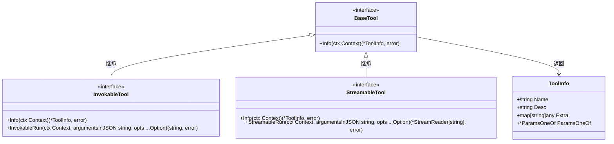
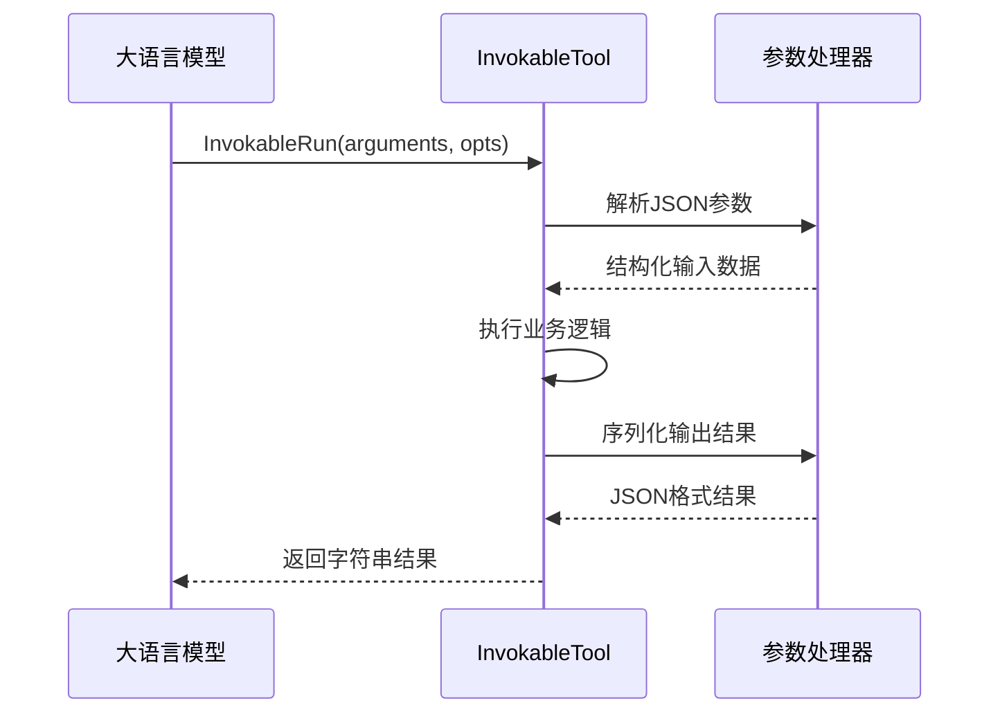
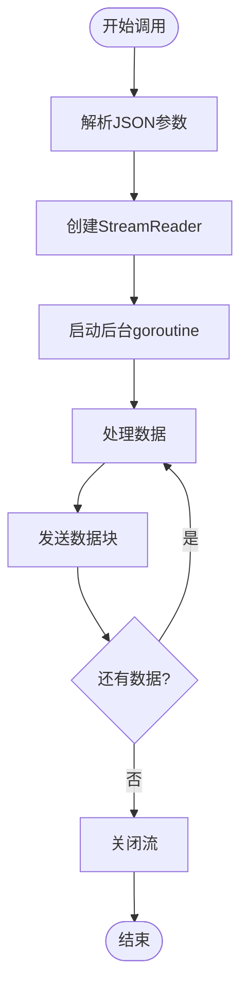
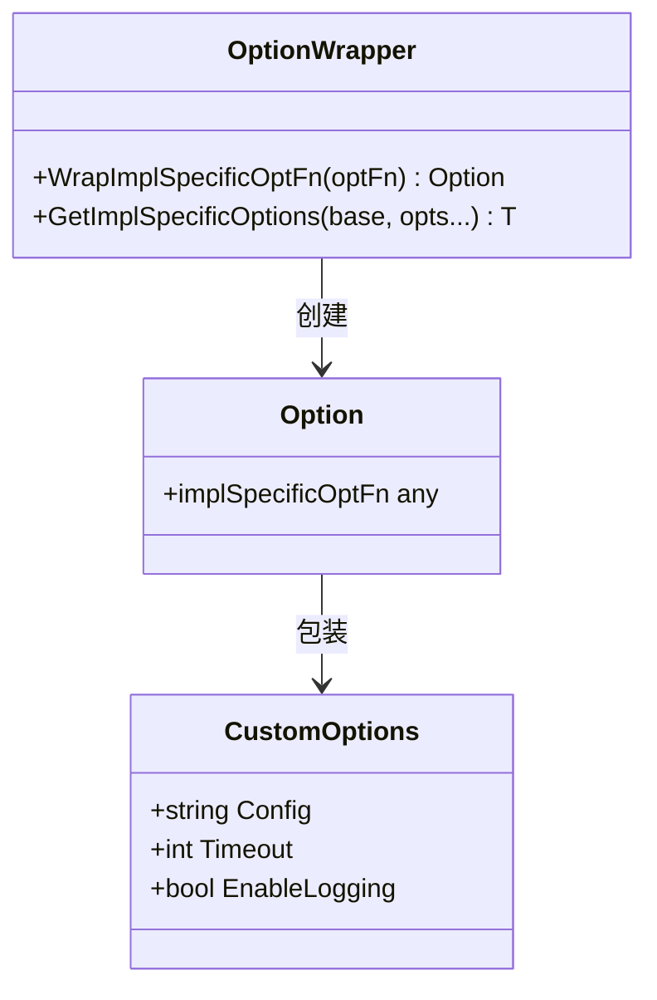
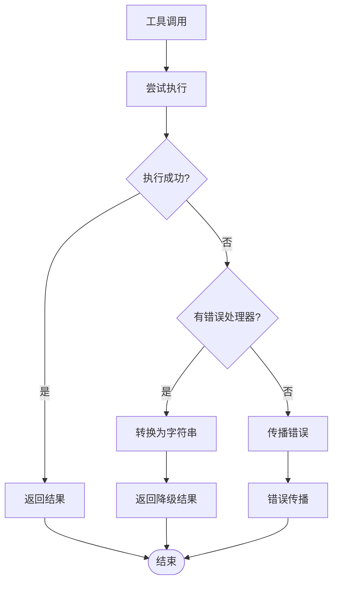

# 工具 (Tool) API

<cite>
**本文档中引用的文件**
- [interface.go](file://components/tool/interface.go)
- [option.go](file://components/tool/option.go)
- [common.go](file://components/tool/utils/common.go)
- [error_handler.go](file://components/tool/utils/error_handler.go)
- [invokable_func.go](file://components/tool/utils/invokable_func.go)
- [streamable_func.go](file://components/tool/utils/streamable_func.go)
- [create_options.go](file://components/tool/utils/create_options.go)
- [tool.go](file://schema/tool.go)
</cite>

## 目录
1. [简介](#简介)
2. [核心接口层次结构](#核心接口层次结构)
3. [BaseTool 接口详解](#basetool-接口详解)
4. [InvokableTool 接口详解](#invokabletool-接口详解)
5. [StreamableTool 接口详解](#streamabletool-接口详解)
6. [选项模式系统](#选项模式系统)
7. [工具实现指南](#工具实现指南)
8. [错误处理最佳实践](#错误处理最佳实践)
9. [完整示例](#完整示例)
10. [总结](#总结)

## 简介

Eino框架的`components/tool`包提供了强大的工具系统，支持同步和异步两种执行模式。该系统通过三个核心接口`BaseTool`、`InvokableTool`和`StreamableTool`构建了清晰的层次结构，为大语言模型提供了灵活的工具调用能力。

## 核心接口层次结构



**图表来源**
- [interface.go](file://components/tool/interface.go#L25-L43)

**章节来源**
- [interface.go](file://components/tool/interface.go#L1-L44)

## BaseTool 接口详解

`BaseTool`是所有工具的基础接口，负责向模型提供工具的元数据信息。

### Info 方法

`Info`方法返回`*schema.ToolInfo`结构体，包含以下关键信息：

| 字段 | 类型 | 描述 |
|------|------|------|
| Name | string | 工具的唯一名称，明确传达其用途 |
| Desc | string | 工具描述，告诉模型何时/如何/为什么使用该工具 |
| ParamsOneOf | *ParamsOneOf | 工具参数规范，可使用多种方式描述 |
| Extra | map[string]any | 工具的额外信息 |

### 参数规范支持

`ParamsOneOf`支持三种参数描述方式：
- **直观方式**: 使用`schema.NewParamsOneOfByParams()`创建
- **JSON Schema**: 使用`schema.NewParamsOneOfByJSONSchema()`创建  
- **OpenAPI V3**: 使用`schema.NewParamsOneOfByOpenAPIV3()`创建（已弃用）

**章节来源**
- [interface.go](file://components/tool/interface.go#L25-L28)
- [tool.go](file://schema/tool.go#L60-L76)

## InvokableTool 接口详解

`InvokableTool`扩展了`BaseTool`，支持同步工具调用，适用于一次性执行的任务。

### InvokableRun 方法

```go
InvokableRun(ctx Context, argumentsInJSON string, opts ...Option) (string, error)
```

#### 方法签名解析

| 参数 | 类型 | 描述 |
|------|------|------|
| ctx | Context | 上下文对象，用于控制执行生命周期 |
| argumentsInJSON | string | JSON格式的参数字符串 |
| opts | ...Option | 可选的工具配置选项 |
| 返回值 | string | 执行结果的JSON字符串 |
| 错误 | error | 执行过程中的错误 |

#### 调用流程



**图表来源**
- [invokable_func.go](file://components/tool/utils/invokable_func.go#L148-L190)

**章节来源**
- [interface.go](file://components/tool/interface.go#L30-L36)
- [invokable_func.go](file://components/tool/utils/invokable_func.go#L148-L190)

## StreamableTool 接口详解

`StreamableTool`扩展了`BaseTool`，支持流式工具输出，适用于长时间运行或需要实时反馈的任务。

### StreamableRun 方法

```go
StreamableRun(ctx Context, argumentsInJSON string, opts ...Option) (*StreamReader[string], error)
```

#### 流式输出特性

- **实时性**: 支持逐步产生输出，无需等待完整结果
- **内存效率**: 适合处理大量数据或长时间运行的任务
- **并发友好**: 可以在任务进行过程中同时处理其他操作

#### 流式调用架构



**图表来源**
- [streamable_func.go](file://components/tool/utils/streamable_func.go#L94-L144)

**章节来源**
- [interface.go](file://components/tool/interface.go#L38-L43)
- [streamable_func.go](file://components/tool/utils/streamable_func.go#L94-L144)

## 选项模式系统

Eino框架采用选项模式（Option Pattern）来配置工具行为，通过统一的`Option`类型包装具体实现的选项函数。

### Option 结构体

```go
type Option struct {
    implSpecificOptFn any
}
```

### 选项函数包装机制



**图表来源**
- [option.go](file://components/tool/option.go#L22-L24)
- [create_options.go](file://components/tool/utils/create_options.go#L37-L42)

### 选项函数实现示例

工具实现者需要定义自己的选项结构体和对应的选项函数：

```go
// 自定义选项结构体
type customOptions struct {
    conf string
    timeout int
}

// 选项函数包装
func WithConf(conf string) Option {
    return WrapImplSpecificOptFn(func(o *customOptions) {
        o.conf = conf
    })
}

func WithTimeout(timeout int) Option {
    return WrapImplSpecificOptFn(func(o *customOptions) {
        o.timeout = timeout
    })
}
```

### 选项提取机制

```go
// 在工具实现中提取选项
func (t *MyTool) InvokableRun(ctx context.Context, args string, opts ...Option) (string, error) {
    // 提取选项，提供默认值
    options := GetImplSpecificOptions(&customOptions{
        conf: "default",
        timeout: 30,
    }, opts...)
    
    // 使用选项
    if options.timeout > 0 {
        // 设置超时
    }
    
    return result, nil
}
```

**章节来源**
- [option.go](file://components/tool/option.go#L19-L79)
- [create_options.go](file://components/tool/utils/create_options.go#L44-L61)

## 工具实现指南

### 同步工具实现

#### 使用函数推断工具

```go
// 定义输入结构体
type GreetInput struct {
    Name string `json:"name" jsonschema:"description=用户姓名"`
    Age  int    `json:"age" jsonschema:"description=用户年龄"`
}

// 定义输出结构体
type GreetOutput struct {
    Message string `json:"message"`
    Greeting string `json:"greeting"`
}

// 实现业务逻辑函数
func greetUser(ctx context.Context, input GreetInput) (GreetOutput, error) {
    return GreetOutput{
        Message: fmt.Sprintf("你好，%s！", input.Name),
        Greeting: fmt.Sprintf("欢迎%d岁的%s", input.Age, input.Name),
    }, nil
}

// 创建工具实例
tool, err := utils.InferTool("greet_user", "向用户问好", greetUser)
```

#### 手动创建工具

```go
type ManualGreetTool struct{}

func (t *ManualGreetTool) Info(ctx context.Context) (*schema.ToolInfo, error) {
    return &schema.ToolInfo{
        Name: "manual_greet",
        Desc: "手动实现的问候工具",
        ParamsOneOf: schema.NewParamsOneOfByParams(
            map[string]*schema.ParameterInfo{
                "name": {
                    Type:     schema.String,
                    Desc:     "用户姓名",
                    Required: true,
                },
            }),
    }, nil
}

func (t *ManualGreetTool) InvokableRun(ctx context.Context, args string, opts ...tool.Option) (string, error) {
    var input struct {
        Name string `json:"name"`
    }
    
    if err := sonic.UnmarshalString(args, &input); err != nil {
        return "", err
    }
    
    result := fmt.Sprintf("Hello, %s!", input.Name)
    return result, nil
}
```

### 流式工具实现

#### 基础流式工具

```go
func streamProcess(ctx context.Context, input StreamInput) (*schema.StreamReader[string], error) {
    sr, sw := schema.Pipe[string](2)
    
    go func() {
        defer sw.Close()
        
        // 模拟分块处理
        chunks := []string{"开始处理", "中间步骤", "完成"}
        
        for _, chunk := range chunks {
            if ctx.Err() != nil {
                return
            }
            
            sw.Send(chunk, nil)
            time.Sleep(100 * time.Millisecond)
        }
    }()
    
    return sr, nil
}

tool, err := utils.InferStreamTool("stream_process", "流式处理工具", streamProcess)
```

#### 高级流式工具

```go
type AdvancedStreamTool struct {
    bufferSize int
}

func (t *AdvancedStreamTool) Info(ctx context.Context) (*schema.ToolInfo, error) {
    return &schema.ToolInfo{
        Name: "advanced_stream",
        Desc: "高级流式处理工具",
        ParamsOneOf: schema.NewParamsOneOfByParams(
            map[string]*schema.ParameterInfo{
                "data": {
                    Type:     schema.String,
                    Desc:     "要处理的数据",
                    Required: true,
                },
            }),
    }, nil
}

func (t *AdvancedStreamTool) StreamableRun(ctx context.Context, args string, opts ...tool.Option) (*schema.StreamReader[string], error) {
    var input struct {
        Data string `json:"data"`
    }
    
    if err := sonic.UnmarshalString(args, &input); err != nil {
        return nil, err
    }
    
    sr, sw := schema.Pipe[string](t.bufferSize)
    
    go func() {
        defer sw.Close()
        
        // 模拟大数据处理
        dataChunks := splitIntoChunks(input.Data, 1024)
        
        for i, chunk := range dataChunks {
            select {
            case <-ctx.Done():
                return
            default:
                processed := processChunk(chunk)
                sw.Send(fmt.Sprintf("[%d/%d] %s", i+1, len(dataChunks), processed), nil)
            }
        }
    }()
    
    return sr, nil
}
```

**章节来源**
- [invokable_func.go](file://components/tool/utils/invokable_func.go#L39-L58)
- [streamable_func.go](file://components/tool/utils/streamable_func.go#L36-L55)

## 错误处理最佳实践

### 内置错误处理机制

Eino框架提供了强大的错误处理包装器，可以自动将错误转换为字符串结果：

```go
// 定义错误处理器
func errorHandler(ctx context.Context, err error) string {
    log.Printf("工具执行失败: %v", err)
    return fmt.Sprintf("操作失败，请稍后重试。详情: %s", err.Error())
}

// 包装工具以添加错误处理
wrappedTool := utils.WrapToolWithErrorHandler(originalTool, errorHandler)
```

### 错误处理策略



**图表来源**
- [error_handler.go](file://components/tool/utils/error_handler.go#L38-L66)

### 错误处理实现

```go
// 同步工具错误处理
func handleSyncError(ctx context.Context, err error) string {
    // 记录错误日志
    logger.Errorf("同步工具执行失败: %v", err)
    
    // 根据错误类型返回不同消息
    switch {
    case errors.Is(err, context.DeadlineExceeded):
        return "请求超时，请检查网络连接"
    case errors.Is(err, context.Canceled):
        return "操作已取消"
    default:
        return "服务器内部错误，请稍后重试"
    }
}

// 流式工具错误处理
func handleStreamError(ctx context.Context, err error) *schema.StreamReader[string] {
    // 创建包含错误信息的流
    sr, sw := schema.Pipe[string](1)
    
    go func() {
        defer sw.Close()
        
        sw.Send(fmt.Sprintf("错误: %s", err.Error()), nil)
    }()
    
    return sr
}
```

**章节来源**
- [error_handler.go](file://components/tool/utils/error_handler.go#L26-L159)

## 完整示例

### 用户信息管理工具

```go
package main

import (
    "context"
    "encoding/json"
    "fmt"
    "time"
    
    "github.com/bytedance/sonic"
    
    "github.com/cloudwego/eino/components/tool"
    "github.com/cloudwego/eino/components/tool/utils"
    "github.com/cloudwego/eino/schema"
)

// 用户信息输入结构体
type UserInfoInput struct {
    UserID    string `json:"user_id" jsonschema:"description=用户ID"`
    Operation string `json:"operation" jsonschema:"description=操作类型,enum=get,set"`
    Data      string `json:"data,omitempty" jsonschema:"description=用户数据"`
}

// 用户信息输出结构体
type UserInfoOutput struct {
    Status  string                 `json:"status"`
    Message string                 `json:"message"`
    Data    map[string]interface{} `json:"data,omitempty"`
}

// 工具选项
type UserInfoOptions struct {
    Timeout time.Duration
    Cache   bool
}

// 获取用户信息工具
type UserInfoTool struct {
    options *UserInfoOptions
}

// 工具信息
func (t *UserInfoTool) Info(ctx context.Context) (*schema.ToolInfo, error) {
    return &schema.ToolInfo{
        Name: "user_info_management",
        Desc: "用户信息管理工具，支持获取和设置用户信息",
        ParamsOneOf: schema.NewParamsOneOfByParams(
            map[string]*schema.ParameterInfo{
                "user_id": {
                    Type:     schema.String,
                    Desc:     "用户唯一标识符",
                    Required: true,
                },
                "operation": {
                    Type:     schema.String,
                    Desc:     "操作类型：get获取，set设置",
                    Enum:     []string{"get", "set"},
                    Required: true,
                },
                "data": {
                    Type:     schema.String,
                    Desc:     "用户数据（JSON格式）",
                },
            }),
    }, nil
}

// 同步执行
func (t *UserInfoTool) InvokableRun(ctx context.Context, args string, opts ...tool.Option) (string, error) {
    // 提取选项
    options := utils.GetImplSpecificOptions(&UserInfoOptions{
        Timeout: 30 * time.Second,
        Cache:   true,
    }, opts...)
    
    // 解析输入
    var input UserInfoInput
    if err := sonic.UnmarshalString(args, &input); err != nil {
        return "", fmt.Errorf("解析输入参数失败: %w", err)
    }
    
    // 设置上下文超时
    if options.Timeout > 0 {
        var cancel context.CancelFunc
        ctx, cancel = context.WithTimeout(ctx, options.Timeout)
        defer cancel()
    }
    
    // 执行业务逻辑
    output, err := t.processOperation(ctx, input)
    if err != nil {
        return "", fmt.Errorf("处理操作失败: %w", err)
    }
    
    // 序列化结果
    result, err := sonic.MarshalString(output)
    if err != nil {
        return "", fmt.Errorf("序列化结果失败: %w", err)
    }
    
    return result, nil
}

// 处理具体操作
func (t *UserInfoTool) processOperation(ctx context.Context, input UserInfoInput) (UserInfoOutput, error) {
    switch input.Operation {
    case "get":
        return t.getUserInfo(ctx, input.UserID)
    case "set":
        return t.setUserInfo(ctx, input.UserID, input.Data)
    default:
        return UserInfoOutput{
            Status:  "error",
            Message: "不支持的操作类型",
        }, nil
    }
}

// 获取用户信息
func (t *UserInfoTool) getUserInfo(ctx context.Context, userID string) (UserInfoOutput, error) {
    // 模拟数据库查询
    userInfo := map[string]interface{}{
        "name":     "张三",
        "age":      25,
        "email":    "zhangsan@example.com",
        "created":  "2023-01-01",
        "modified": time.Now().Format("2006-01-02"),
    }
    
    return UserInfoOutput{
        Status:  "success",
        Message: "获取用户信息成功",
        Data:    userInfo,
    }, nil
}

// 设置用户信息
func (t *UserInfoTool) setUserInfo(ctx context.Context, userID string, data string) (UserInfoOutput, error) {
    // 验证数据格式
    var updateData map[string]interface{}
    if err := json.Unmarshal([]byte(data), &updateData); err != nil {
        return UserInfoOutput{
            Status:  "error",
            Message: "无效的JSON数据",
        }, nil
    }
    
    // 模拟更新操作
    return UserInfoOutput{
        Status:  "success",
        Message: "用户信息更新成功",
        Data:    updateData,
    }, nil
}

// 工具选项函数
func WithUserInfoTimeout(timeout time.Duration) tool.Option {
    return tool.WrapImplSpecificOptFn(func(o *UserInfoOptions) {
        o.Timeout = timeout
    })
}

func WithUserInfoCache(enable bool) tool.Option {
    return tool.WrapImplSpecificOptFn(func(o *UserInfoOptions) {
        o.Cache = enable
    })
}

func main() {
    // 创建工具实例
    tool := &UserInfoTool{}
    
    // 使用工具
    ctx := context.Background()
    
    // 获取用户信息
    getInput := `{"user_id": "12345", "operation": "get"}`
    result, err := tool.InvokableRun(ctx, getInput, WithUserInfoTimeout(10*time.Second))
    if err != nil {
        fmt.Printf("错误: %v\n", err)
    } else {
        fmt.Printf("结果: %s\n", result)
    }
}
```

### 文件处理流式工具

```go
package main

import (
    "bufio"
    "context"
    "fmt"
    "io"
    "os"
    "strings"
    
    "github.com/cloudwego/eino/components/tool"
    "github.com/cloudwego/eino/components/tool/utils"
    "github.com/cloudwego/eino/schema"
)

// 文件处理输入结构体
type FileProcessInput struct {
    FilePath string `json:"file_path" jsonschema:"description=文件路径"`
    Action   string `json:"action" jsonschema:"description=处理动作,enum=count_lines,word_count"`
}

// 文件处理输出结构体
type FileProcessOutput struct {
    Status    string `json:"status"`
    Message   string `json:"message"`
    Count     int    `json:"count,omitempty"`
    Details   string `json:"details,omitempty"`
}

// 文件处理工具
type FileProcessTool struct{}

// 工具信息
func (t *FileProcessTool) Info(ctx context.Context) (*schema.ToolInfo, error) {
    return &schema.ToolInfo{
        Name: "file_processor",
        Desc: "文件处理工具，支持统计行数和单词数量",
        ParamsOneOf: schema.NewParamsOneOfByParams(
            map[string]*schema.ParameterInfo{
                "file_path": {
                    Type:     schema.String,
                    Desc:     "要处理的文件路径",
                    Required: true,
                },
                "action": {
                    Type:     schema.String,
                    Desc:     "处理动作：count_lines统计行数，word_count统计单词数",
                    Enum:     []string{"count_lines", "word_count"},
                    Required: true,
                },
            }),
    }, nil
}

// 流式执行
func (t *FileProcessTool) StreamableRun(ctx context.Context, args string, opts ...tool.Option) (*schema.StreamReader[string], error) {
    // 解析输入
    var input FileProcessInput
    if err := utils.UnmarshalString(args, &input); err != nil {
        return nil, fmt.Errorf("解析输入参数失败: %w", err)
    }
    
    // 验证文件存在
    if _, err := os.Stat(input.FilePath); os.IsNotExist(err) {
        return nil, fmt.Errorf("文件不存在: %s", input.FilePath)
    }
    
    // 创建流
    sr, sw := schema.Pipe[string](2)
    
    go func() {
        defer sw.Close()
        
        // 打开文件
        file, err := os.Open(input.FilePath)
        if err != nil {
            sw.Send(fmt.Sprintf("错误: 无法打开文件 - %v", err), nil)
            return
        }
        defer file.Close()
        
        // 发送开始消息
        sw.Send(fmt.Sprintf("开始处理文件: %s", input.FilePath), nil)
        
        // 根据操作类型处理
        switch input.Action {
        case "count_lines":
            t.processLines(ctx, file, sw)
        case "word_count":
            t.processWords(ctx, file, sw)
        default:
            sw.Send(fmt.Sprintf("错误: 不支持的操作 - %s", input.Action), nil)
        }
    }()
    
    return sr, nil
}

// 行数统计处理
func (t *FileProcessTool) processLines(ctx context.Context, file *os.File, sw *schema.StreamWriter[string]) {
    scanner := bufio.NewScanner(file)
    count := 0
    
    for scanner.Scan() {
        select {
        case <-ctx.Done():
            sw.Send("处理被取消", nil)
            return
        default:
            count++
            if count%1000 == 0 {
                sw.Send(fmt.Sprintf("已处理 %d 行", count), nil)
            }
        }
    }
    
    if err := scanner.Err(); err != nil {
        sw.Send(fmt.Sprintf("错误: 读取文件失败 - %v", err), nil)
        return
    }
    
    sw.Send(fmt.Sprintf("总行数: %d", count), nil)
}

// 单词计数处理
func (t *FileProcessTool) processWords(ctx context.Context, file *os.File, sw *schema.StreamWriter[string]) {
    scanner := bufio.NewScanner(file)
    wordCount := make(map[string]int)
    totalWords := 0
    
    for scanner.Scan() {
        select {
        case <-ctx.Done():
            sw.Send("处理被取消", nil)
            return
        default:
            line := scanner.Text()
            words := strings.Fields(line)
            
            for _, word := range words {
                wordCount[word]++
                totalWords++
                
                if totalWords%10000 == 0 {
                    sw.Send(fmt.Sprintf("已处理 %d 个单词", totalWords), nil)
                }
            }
        }
    }
    
    if err := scanner.Err(); err != nil {
        sw.Send(fmt.Sprintf("错误: 读取文件失败 - %v", err), nil)
        return
    }
    
    // 发送最终结果
    sw.Send(fmt.Sprintf("总单词数: %d", totalWords), nil)
    sw.Send(fmt.Sprintf("唯一单词数: %d", len(wordCount)), nil)
}

func main() {
    tool := &FileProcessTool{}
    
    // 示例：统计行数
    input := `{"file_path": "/path/to/file.txt", "action": "count_lines"}`
    
    ctx := context.Background()
    stream, err := tool.StreamableRun(ctx, input)
    if err != nil {
        fmt.Printf("错误: %v\n", err)
        return
    }
    
    // 读取流式结果
    for {
        msg, err := stream.Recv()
        if err != nil {
            if err == io.EOF {
                break
            }
            fmt.Printf("读取错误: %v\n", err)
            break
        }
        
        fmt.Println(msg)
    }
}
```

**章节来源**
- [invokable_func.go](file://components/tool/utils/invokable_func.go#L39-L221)
- [streamable_func.go](file://components/tool/utils/streamable_func.go#L36-L158)

## 总结

Eino框架的工具系统通过清晰的接口层次和灵活的选项模式，为开发者提供了强大而易用的工具开发能力：

### 核心优势

1. **接口设计清晰**: `BaseTool`、`InvokableTool`、`StreamableTool`形成递进的层次结构
2. **类型安全**: 通过泛型和结构体定义确保参数和返回值的类型安全
3. **灵活配置**: 选项模式支持丰富的工具配置选项
4. **错误处理完善**: 内置错误处理机制和包装器
5. **性能优化**: 支持流式处理，适合大数据量场景

### 最佳实践建议

1. **选择合适的接口**: 根据业务需求选择同步或流式工具
2. **合理使用选项**: 通过选项模式提供灵活的配置能力
3. **完善的错误处理**: 实现健壮的错误处理机制
4. **清晰的文档**: 为工具提供详细的描述和参数说明
5. **测试覆盖**: 编写充分的单元测试和集成测试

通过遵循这些指导原则，开发者可以构建出高质量、高性能的工具组件，充分发挥Eino框架的潜力。