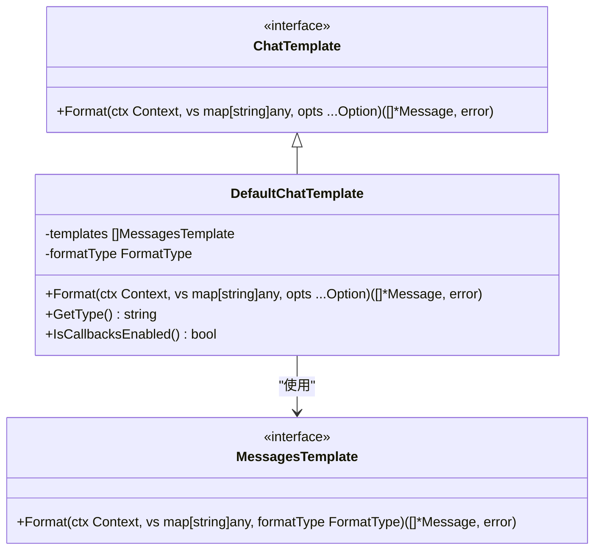
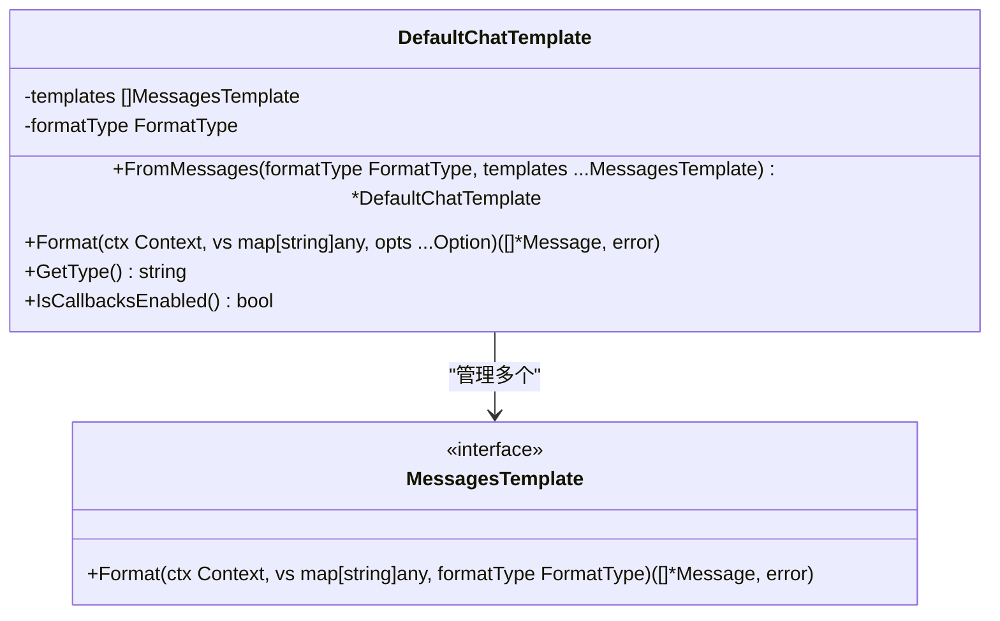
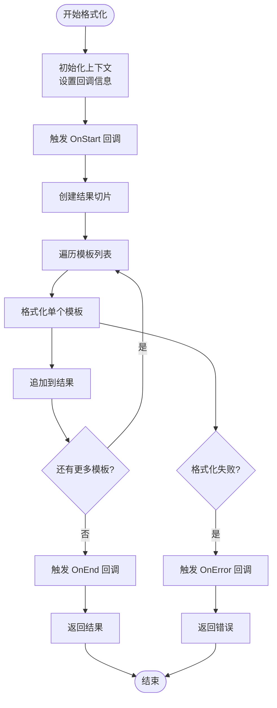
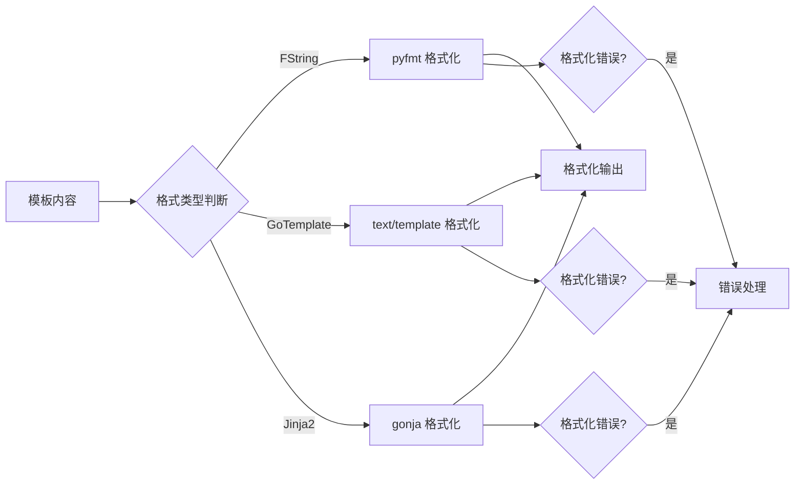
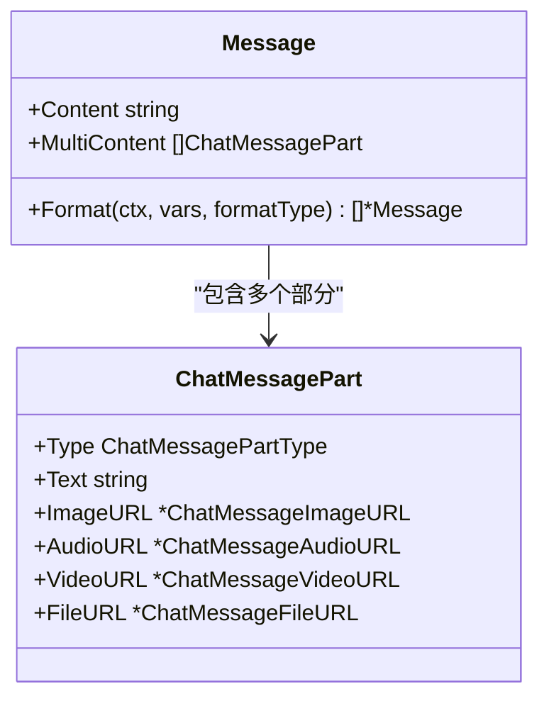
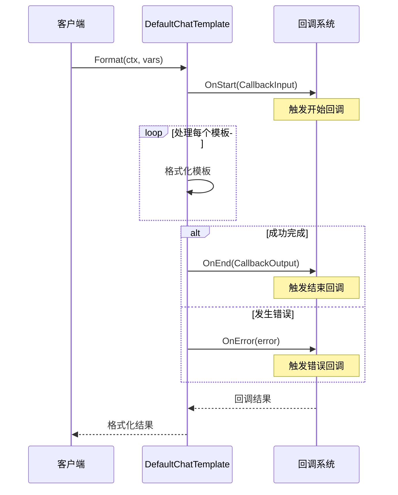
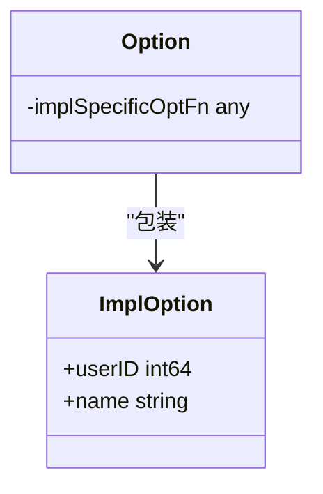
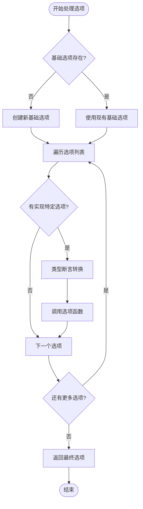

# 提示模板 (Prompt) API 参考文档

<cite>
**本文档中引用的文件**
- [chat_template.go](file://components/prompt/chat_template.go)
- [interface.go](file://components/prompt/interface.go)
- [option.go](file://components/prompt/option.go)
- [callback_extra.go](file://components/prompt/callback_extra.go)
- [chat_template_test.go](file://components/prompt/chat_template_test.go)
- [message.go](file://schema/message.go)
</cite>

## 目录
1. [简介](#简介)
2. [核心接口](#核心接口)
3. [DefaultChatTemplate 实现](#defaultchattemplate-实现)
4. [格式化类型](#格式化类型)
5. [模板变量处理](#模板变量处理)
6. [回调机制](#回调机制)
7. [配置选项](#配置选项)
8. [使用示例](#使用示例)
9. [最佳实践](#最佳实践)
10. [故障排除](#故障排除)

## 简介

Eino框架的`components/prompt`包提供了强大的提示模板功能，专门用于动态生成聊天消息序列。该组件的核心是`ChatTemplate`接口的`Format`方法，它能够将模板变量渲染为`[]*schema.Message`序列，作为大语言模型(LLM)的输入。

### 主要特性

- **多格式支持**：支持FString、GoTemplate和Jinja2三种模板格式
- **灵活的变量绑定**：通过`map[string]any`传递模板变量
- **回调机制**：完整的生命周期回调支持
- **多模态内容**：支持文本、图像、音频、视频等多种媒体类型
- **链式调用**：可与其他组件无缝集成

## 核心接口

### ChatTemplate 接口

`ChatTemplate`是提示模板系统的核心接口，定义了模板格式化的标准契约。



**图表来源**
- [interface.go](file://components/prompt/interface.go#L27-L29)
- [chat_template.go](file://components/prompt/chat_template.go#L28-L33)

**节来源**
- [interface.go](file://components/prompt/interface.go#L25-L30)

### Format 方法详解

`Format`方法是`ChatTemplate`接口的核心方法，负责将模板变量渲染为消息序列。

#### 方法签名

```go
Format(ctx context.Context, vs map[string]any, opts ...Option) ([]*schema.Message, error)
```

#### 参数说明

| 参数 | 类型 | 描述 |
|------|------|------|
| `ctx` | `context.Context` | 上下文对象，用于控制操作生命周期和传递请求标识 |
| `vs` | `map[string]any` | 包含模板变量的映射，键为变量名，值为对应的数据 |
| `opts` | `...Option` | 可选的配置选项，用于定制模板行为 |

#### 返回值

| 类型 | 描述 |
|------|------|
| `[]*schema.Message` | 渲染后的消息序列，作为LLM的输入 |
| `error` | 操作过程中发生的错误 |

**节来源**
- [interface.go](file://components/prompt/interface.go#L28)

## DefaultChatTemplate 实现

### 结构体定义

`DefaultChatTemplate`是`ChatTemplate`接口的主要实现，提供了完整的模板处理功能。



**图表来源**
- [chat_template.go](file://components/prompt/chat_template.go#L28-L33)

### 创建实例

使用`FromMessages`函数创建`DefaultChatTemplate`实例：

```go
// 基本用法
template := prompt.FromMessages(
    schema.FString,
    schema.SystemMessage("你是一个有用的助手"),
    schema.MessagesPlaceholder("chat_history", true),
    schema.UserMessage("问题: {question}"),
)
```

**节来源**
- [chat_template.go](file://components/prompt/chat_template.go#L36-L47)

### 格式化过程

`DefaultChatTemplate`的`Format`方法执行以下步骤：



**图表来源**
- [chat_template.go](file://components/prompt/chat_template.go#L49-L78)

**节来源**
- [chat_template.go](file://components/prompt/chat_template.go#L49-L78)

## 格式化类型

### 支持的格式类型

系统支持三种不同的模板格式化类型：

| 格式类型 | 值 | 库支持 | 语法特点 |
|----------|----|--------|---------|
| `FString` | `0` | `pyfmt` | Python风格的格式化语法 `{variable}` |
| `GoTemplate` | `1` | `text/template` | Go标准库模板语法 `{{.variable}}` |
| `Jinja2` | `2` | `gonja` | Jinja2语法 `{{variable}}` |

### 格式化引擎



**图表来源**
- [message.go](file://schema/message.go#L555-L588)

**节来源**
- [message.go](file://schema/message.go#L82-L92)

## 模板变量处理

### 变量绑定机制

模板变量通过`map[string]any`结构传递，支持任意类型的值：

```go
variables := map[string]any{
    "context":     "这是一个重要的上下文信息",
    "question":    "今天的天气怎么样？",
    "chat_history": []*schema.Message{
        schema.UserMessage("你好"),
        schema.AssistantMessage("很高兴见到你！", nil),
    },
    "timestamp":   time.Now().Unix(),
    "user_info":   map[string]any{"name": "张三", "age": 30},
}
```

### 多模态内容处理

模板支持复杂的多模态内容格式化：



**图表来源**
- [message.go](file://schema/message.go#L433-L467)

**节来源**
- [message.go](file://schema/message.go#L591-L656)

## 回调机制

### 回调输入输出

系统提供了完整的生命周期回调支持：



**图表来源**
- [chat_template.go](file://components/prompt/chat_template.go#L52-L77)
- [callback_extra.go](file://components/prompt/callback_extra.go#L24-L42)

### 回调数据结构

| 结构体 | 字段 | 描述 |
|--------|------|------|
| `CallbackInput` | `Variables` | 输入的模板变量映射 |
| | `Templates` | 使用的模板列表 |
| | `Extra` | 额外的回调信息 |
| `CallbackOutput` | `Result` | 格式化后的消息结果 |
| | `Templates` | 使用的模板列表 |
| | `Extra` | 额外的回调信息 |

**节来源**
- [callback_extra.go](file://components/prompt/callback_extra.go#L24-L42)

## 配置选项

### Option 系统

`Option`系统提供了灵活的配置机制：



**图表来源**
- [option.go](file://components/prompt/option.go#L19-L22)

### 内置选项函数

虽然当前版本主要展示了通用的选项处理机制，但系统设计支持特定的配置选项：

```go
// 示例：用户ID选项（实际实现）
func WithUserID(uid int64) Option {
    return WrapImplSpecificOptFn[implOption](func(i *implOption) {
        i.userID = uid
    })
}

// 示例：名称选项（实际实现）
func WithName(n string) Option {
    return WrapImplSpecificOptFn[implOption](func(i *implOption) {
        i.name = n
    })
}
```

### 选项处理流程



**图表来源**
- [option.go](file://components/prompt/option.go#L31-L48)

**节来源**
- [option.go](file://components/prompt/option.go#L19-L49)

## 使用示例

### 基础模板示例

```go
// 创建简单的FString模板
template := prompt.FromMessages(
    schema.FString,
    schema.SystemMessage("你是一个有用的助手。\n这里是上下文: {context}"),
    schema.MessagesPlaceholder("chat_history", true),
    schema.UserMessage("问题: {question}"),
)

// 使用模板
vars := map[string]any{
    "context": "今天的天气很好",
    "question": "我们应该去哪里旅行？",
    "chat_history": []*schema.Message{
        schema.UserMessage("你喜欢什么类型的旅行？"),
        schema.AssistantMessage("我喜欢自然风光和历史文化", nil),
    },
}

messages, err := template.Format(context.Background(), vars)
```

### Jinja2模板示例

```go
// 创建Jinja2模板
jinjaTemplate := prompt.FromMessages(
    schema.Jinja2,
    schema.SystemMessage("你是一个有用的助手。\n这里是上下文: {{context}}"),
    schema.MessagesPlaceholder("chat_history", true),
    schema.UserMessage("问题: {{question}}"),
)

// 使用Jinja2模板
vars := map[string]any{
    "context": "今天的天气很好",
    "question": "我们应该去哪里旅行？",
    "chat_history": []*schema.Message{
        schema.UserMessage("你喜欢什么类型的旅行？"),
        schema.AssistantMessage("我喜欢自然风光和历史文化", nil),
    },
}

messages, err := jinjaTemplate.Format(context.Background(), vars)
```

### 多模态内容示例

```go
// 创建包含多模态内容的模板
multimodalTemplate := prompt.FromMessages(
    schema.FString,
    schema.SystemMessage("请描述这张图片的内容: {image_description}"),
    schema.UserMessage("图片URL: {image_url}"),
)

// 多模态变量
multimodalVars := map[string]any{
    "image_description": "一只可爱的小猫坐在窗台上",
    "image_url": "https://example.com/cat.jpg",
}

messages, err := multimodalTemplate.Format(context.Background(), multimodalVars)
```

### 文档处理示例

```go
// 处理文档集合的模板
docTemplate := prompt.FromMessages(
    schema.FString,
    schema.SystemMessage("基于以下文档回答问题:\n所有文档: {all_docs}\n单个文档: {single_doc}"),
)

// 文档数据
documents := []*schema.Document{
    {
        ID: "doc1",
        Content: "这是第一篇文档的内容",
        MetaData: map[string]any{"author": "张三"},
    },
    {
        ID: "doc2", 
        Content: "这是第二篇文档的内容",
        MetaData: map[string]any{"author": "李四"},
    },
}

vars := map[string]any{
    "all_docs": documents,
    "single_doc": documents[0],
}

messages, err := docTemplate.Format(context.Background(), vars)
```

**节来源**
- [chat_template_test.go](file://components/prompt/chat_template_test.go#L28-L83)

## 最佳实践

### 模板设计原则

1. **清晰的变量命名**：使用有意义的变量名，避免歧义
2. **适当的占位符**：根据格式类型选择合适的语法
3. **错误处理**：始终检查Format方法的返回错误
4. **上下文完整性**：确保提供足够的上下文信息

### 性能优化建议

1. **模板复用**：创建模板后重复使用，避免重复解析
2. **变量预处理**：在调用Format前验证和准备变量
3. **回调控制**：在性能敏感场景中禁用不必要的回调

### 错误处理策略

```go
// 推荐的错误处理模式
func processTemplate(template ChatTemplate, vars map[string]any) ([]*schema.Message, error) {
    ctx := context.Background()
    
    // 设置超时
    ctx, cancel := context.WithTimeout(ctx, 5*time.Second)
    defer cancel()
    
    // 执行格式化
    messages, err := template.Format(ctx, vars)
    if err != nil {
        // 记录详细错误信息
        log.Printf("模板格式化失败: %v", err)
        return nil, fmt.Errorf("模板格式化错误: %w", err)
    }
    
    return messages, nil
}
```

## 故障排除

### 常见问题及解决方案

| 问题 | 原因 | 解决方案 |
|------|------|----------|
| 变量未替换 | 变量名不匹配或不存在 | 检查变量名拼写，确保提供正确的变量值 |
| 格式化错误 | 模板语法错误 | 验证模板语法符合所选格式类型的要求 |
| 多模态内容问题 | 数据类型不匹配 | 确保MultiContent字段的数据类型正确 |
| 回调异常 | 回调函数内部错误 | 检查回调函数的实现，添加适当的错误处理 |

### 调试技巧

1. **启用日志记录**：使用回调系统记录详细的调试信息
2. **分步验证**：逐步验证模板的各个部分
3. **变量检查**：打印变量内容以确认数据正确性
4. **格式类型测试**：尝试不同的格式类型以确定问题所在

### 性能监控

```go
// 性能监控示例
func monitoredFormat(template ChatTemplate, vars map[string]any) ([]*schema.Message, time.Duration, error) {
    start := time.Now()
    
    messages, err := template.Format(context.Background(), vars)
    
    duration := time.Since(start)
    if duration > 100*time.Millisecond {
        log.Printf("模板格式化耗时过长: %v", duration)
    }
    
    return messages, duration, err
}
```

**节来源**
- [chat_template_test.go](file://components/prompt/chat_template_test.go#L85-L115)

## 总结

Eino框架的`components/prompt`包提供了一个强大而灵活的提示模板系统，通过`ChatTemplate`接口的`Format`方法，能够高效地将模板变量渲染为LLM可用的消息序列。该系统支持多种格式化类型、多模态内容处理和完整的回调机制，是构建动态对话流程的关键组件。

通过合理使用模板变量、选择适当的格式类型，并遵循最佳实践，开发者可以创建出功能丰富且性能优异的AI应用。系统的模块化设计也使得扩展和定制变得简单，为各种复杂的业务场景提供了坚实的基础。