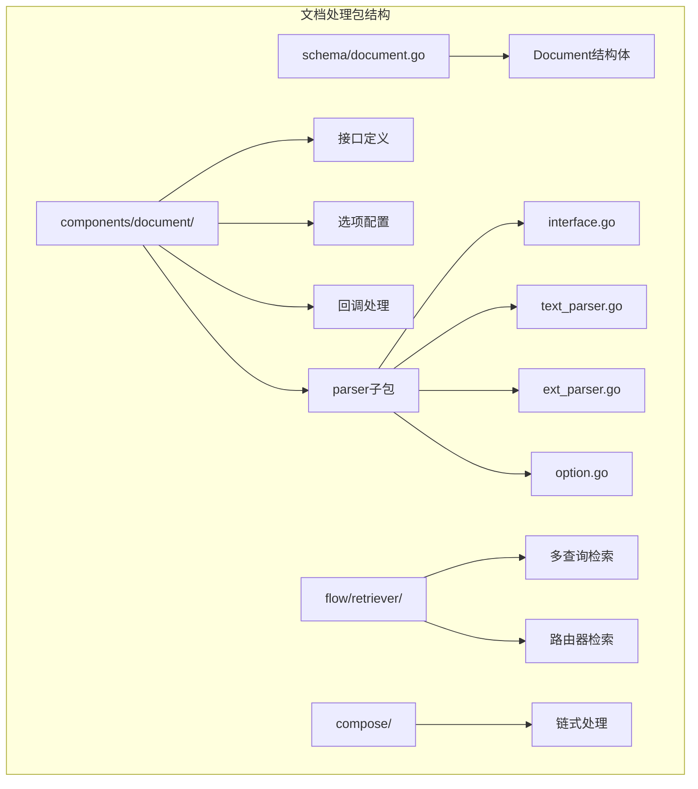
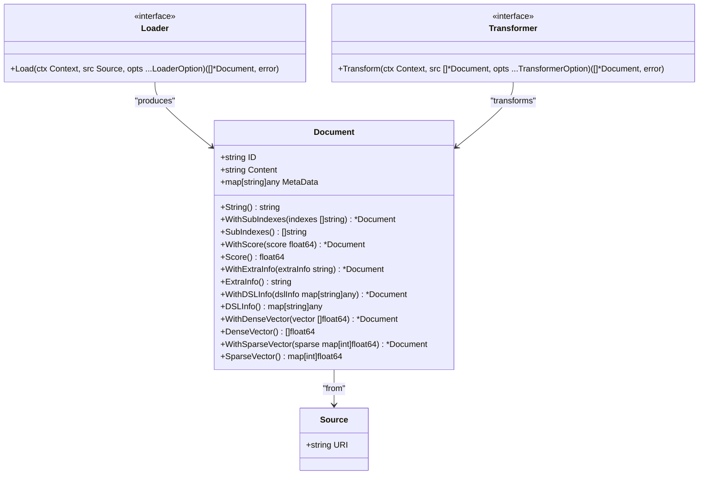
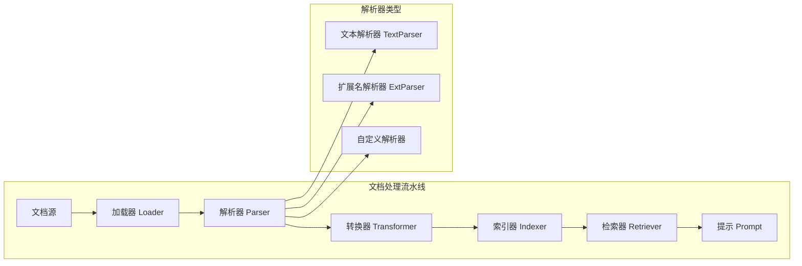
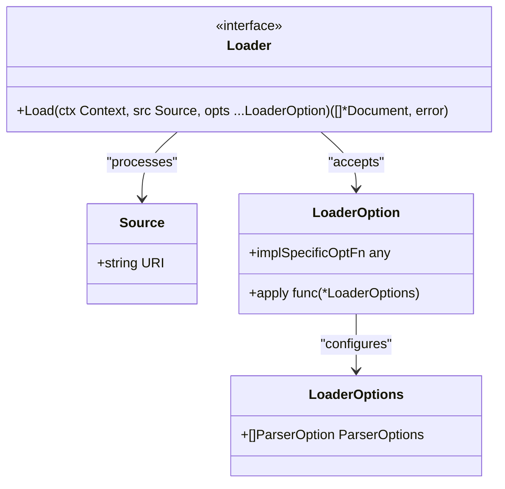
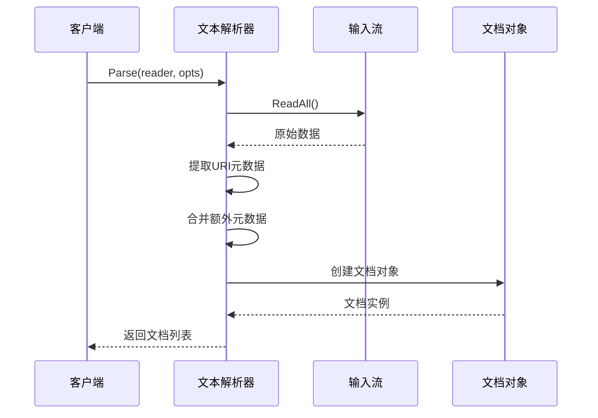
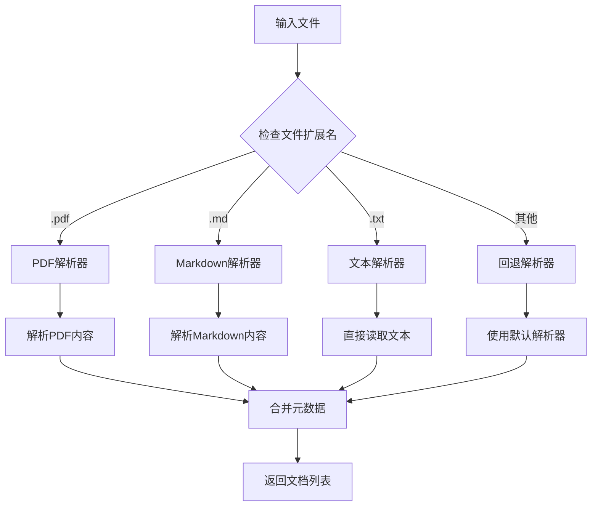
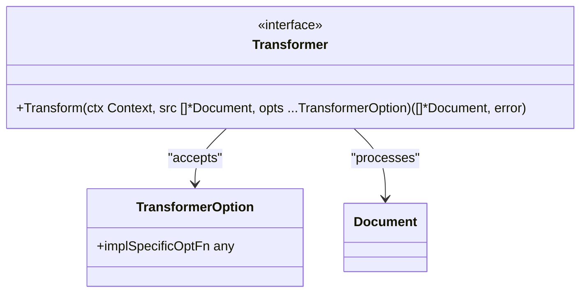
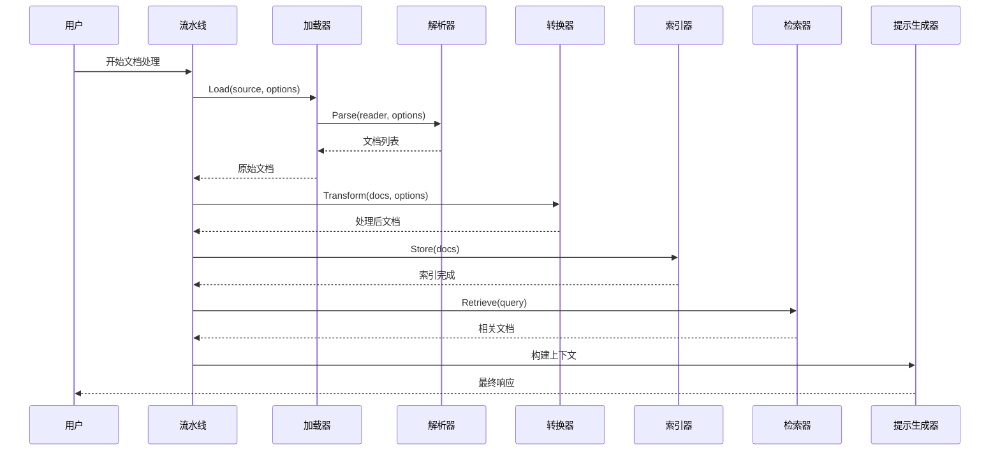
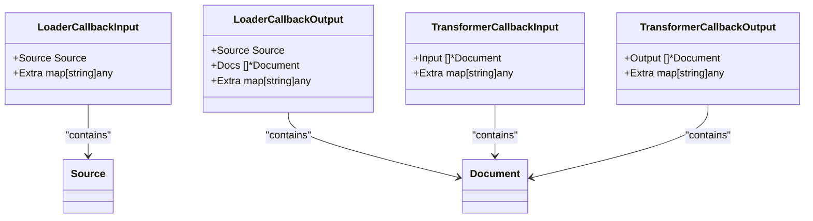
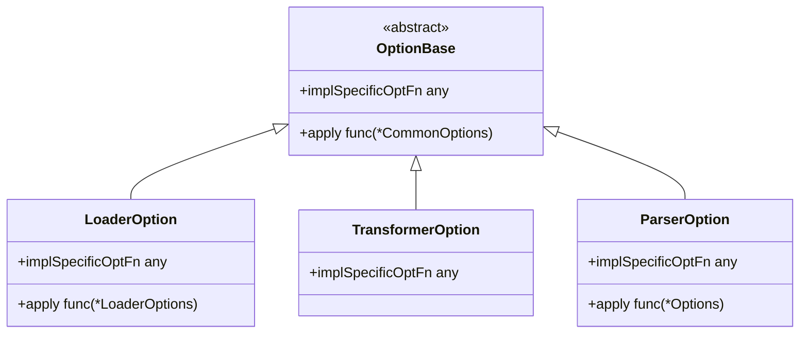

# 文档 (Document) API 参考文档

<cite>
**本文档中引用的文件**
- [schema/document.go](file://schema/document.go)
- [components/document/interface.go](file://components/document/interface.go)
- [components/document/option.go](file://components/document/option.go)
- [components/document/doc.go](file://components/document/doc.go)
- [components/document/callback_extra_loader.go](file://components/document/callback_extra_loader.go)
- [components/document/callback_extra_transformer.go](file://components/document/callback_extra_transformer.go)
- [components/document/parser/interface.go](file://components/document/parser/interface.go)
- [components/document/parser/text_parser.go](file://components/document/parser/text_parser.go)
- [components/document/parser/ext_parser.go](file://components/document/parser/ext_parser.go)
- [components/document/parser/option.go](file://components/document/parser/option.go)
- [components/document/parser/parser_test.go](file://components/document/parser/parser_test.go)
- [components/document/parser/testdata/test.md](file://components/document/parser/testdata/test.md)
- [components/document/option_test.go](file://components/document/option_test.go)
- [components/document/parser/option_test.go](file://components/document/parser/option_test.go)
</cite>

## 目录
1. [简介](#简介)
2. [项目结构](#项目结构)
3. [核心数据结构](#核心数据结构)
4. [架构概览](#架构概览)
5. [详细组件分析](#详细组件分析)
6. [文档处理流程](#文档处理流程)
7. [配置选项系统](#配置选项系统)
8. [实际应用示例](#实际应用示例)
9. [性能考虑](#性能考虑)
10. [故障排除指南](#故障排除指南)
11. [总结](#总结)

## 简介

Eino框架的`components/document`包提供了完整的文档处理解决方案，专门设计用于处理各种格式的文档，包括文本、PDF、Markdown等。该包的核心是`Document`数据结构，它封装了文档的内容、元数据和唯一标识符，同时提供了强大的解析器系统来处理不同格式的文档输入。

该包在整个Eino框架中扮演着关键角色，作为知识库构建的基础组件，负责从各种来源加载文档，将其转换为可检索的格式，并为后续的索引、检索和提示生成提供支持。

## 项目结构



**图表来源**
- [schema/document.go](file://schema/document.go#L28-L36)
- [components/document/interface.go](file://components/document/interface.go#L17-L43)
- [components/document/parser/interface.go](file://components/document/parser/interface.go#L17-L30)

**章节来源**
- [components/document/doc.go](file://components/document/doc.go#L1-L18)
- [schema/document.go](file://schema/document.go#L1-L204)

## 核心数据结构

### Document 结构体

`Document`是整个文档处理系统的核心数据结构，它简洁而功能强大地封装了文档的所有必要信息。



**图表来源**
- [schema/document.go](file://schema/document.go#L28-L36)
- [components/document/interface.go](file://components/document/interface.go#L25-L43)

#### 字段详解

| 字段 | 类型 | 描述 | 必需 |
|------|------|------|------|
| `ID` | `string` | 文档的唯一标识符，用于区分不同的文档 | 是 |
| `Content` | `string` | 文档的实际内容，经过解析后的纯文本 | 是 |
| `MetaData` | `map[string]any` | 文档的元数据，包含额外的属性信息 | 否 |

#### 元数据扩展方法

Document结构体提供了丰富的元数据操作方法：

| 方法 | 功能 | 使用场景 |
|------|------|----------|
| `WithSubIndexes()` | 设置子索引，用于搜索引擎的细粒度搜索 | 分块文档的索引管理 |
| `WithScore()` | 设置相似度分数，用于检索结果排序 | 检索结果的相关性评分 |
| `WithExtraInfo()` | 设置额外信息，存储原始文件名等 | 调试和溯源需求 |
| `WithDSLInfo()` | 设置DSL查询信息，用于复杂查询条件 | 高级查询场景 |
| `WithDenseVector()` | 设置密集向量，用于语义相似度计算 | 向量数据库集成 |
| `WithSparseVector()` | 设置稀疏向量，用于特征提取 | 特征工程和机器学习 |

**章节来源**
- [schema/document.go](file://schema/document.go#L28-L204)

## 架构概览



**图表来源**
- [components/document/interface.go](file://components/document/interface.go#L34-L43)
- [components/document/parser/interface.go](file://components/document/parser/interface.go#L26-L29)

## 详细组件分析

### 加载器 (Loader) 接口

加载器负责从各种来源加载文档，是文档处理流水线的起点。



**图表来源**
- [components/document/interface.go](file://components/document/interface.go#L34-L43)
- [components/document/option.go](file://components/document/option.go#L21-L23)

#### Loader接口方法

Loader接口定义了统一的文档加载标准：

- **参数**：
  - `ctx`: 上下文，用于控制超时和取消
  - `src`: 源信息，包含文档的URI
  - `opts`: 可选的配置选项

- **返回值**：
  - 成功时返回文档切片和nil错误
  - 失败时返回nil和具体的错误信息

**章节来源**
- [components/document/interface.go](file://components/document/interface.go#L34-L43)

### 解析器 (Parser) 系统

解析器系统提供了灵活的文档格式支持，通过接口抽象实现了多种解析策略。

#### 文本解析器 (TextParser)

文本解析器是最基础的解析器，直接读取输入流并创建单个文档。



**图表来源**
- [components/document/parser/text_parser.go](file://components/document/parser/text_parser.go#L37-L59)

#### 扩展名解析器 (ExtParser)

扩展名解析器根据文件扩展名自动选择合适的解析器，提供了最灵活的文档处理能力。



**图表来源**
- [components/document/parser/ext_parser.go](file://components/document/parser/ext_parser.go#L94-L130)

**章节来源**
- [components/document/parser/text_parser.go](file://components/document/parser/text_parser.go#L1-L60)
- [components/document/parser/ext_parser.go](file://components/document/parser/ext_parser.go#L1-L131)

### 转换器 (Transformer) 接口

转换器负责对文档进行进一步的处理，如分块、过滤、格式转换等。



**图表来源**
- [components/document/interface.go](file://components/document/interface.go#L39-L43)

**章节来源**
- [components/document/interface.go](file://components/document/interface.go#L39-L43)

## 文档处理流程

### 完整处理流水线



**图表来源**
- [components/document/interface.go](file://components/document/interface.go#L34-L43)
- [compose/chain.go](file://compose/chain.go#L235-L277)

### 回调系统

文档处理过程中的每个阶段都支持回调机制，便于监控和调试。



**图表来源**
- [components/document/callback_extra_loader.go](file://components/document/callback_extra_loader.go#L24-L42)
- [components/document/callback_extra_transformer.go](file://components/document/callback_extra_transformer.go#L24-L40)

**章节来源**
- [components/document/callback_extra_loader.go](file://components/document/callback_extra_loader.go#L1-L72)
- [components/document/callback_extra_transformer.go](file://components/document/callback_extra_transformer.go#L1-L69)

## 配置选项系统

### 统一选项模式

Eino框架采用统一的选项模式，为所有组件提供一致的配置体验。



**图表来源**
- [components/document/option.go](file://components/document/option.go#L25-L32)
- [components/document/parser/option.go](file://components/document/parser/option.go#L27-L34)

### 选项提取机制

框架提供了强大的选项提取机制，支持通用选项和特定实现选项的分离。

| 函数 | 用途 | 参数类型 | 返回类型 |
|------|------|----------|----------|
| `GetLoaderCommonOptions()` | 提取通用加载器选项 | `*LoaderOptions`, `...LoaderOption` | `*LoaderOptions` |
| `GetLoaderImplSpecificOptions()` | 提取特定实现选项 | `*T`, `...LoaderOption` | `*T` |
| `GetImplSpecificOptions()` | 提取解析器特定选项 | `*T`, `...Option` | `*T` |

**章节来源**
- [components/document/option.go](file://components/document/option.go#L56-L82)
- [components/document/parser/option.go](file://components/document/parser/option.go#L55-L69)

## 实际应用示例

### 基础文档加载示例

以下展示了如何使用ExtParser处理不同格式的文档：

```go
// 创建扩展名解析器配置
conf := &parser.ExtParserConfig{
    Parsers: map[string]parser.Parser{
        ".pdf": pdfParser,      // PDF解析器
        ".md":  markdownParser, // Markdown解析器
        ".txt": textParser,     // 文本解析器
    },
    FallbackParser: textParser, // 默认解析器
}

// 创建解析器
extParser, err := parser.NewExtParser(ctx, conf)
if err != nil {
    log.Fatal(err)
}

// 加载文档
file, err := os.Open("document.pdf")
if err != nil {
    log.Fatal(err)
}
defer file.Close()

docs, err := extParser.Parse(ctx, file, parser.WithURI("document.pdf"))
if err != nil {
    log.Fatal(err)
}
```

### 元数据处理示例

```go
// 创建带有元数据的文档
doc := &schema.Document{
    ID:      "doc-001",
    Content: "这是文档内容",
    MetaData: map[string]any{
        "source":    "manual.pdf",
        "page":      1,
        "author":    "张三",
        "timestamp": time.Now(),
    },
}

// 添加额外的元数据
doc = doc.WithScore(0.95)
doc = doc.WithSubIndexes([]string{"section-1", "paragraph-2"})
```

### 链式处理示例

```go
// 创建文档处理流水线
chain := compose.NewChain[[]byte, []*schema.Document]()

// 添加加载器节点
chain.AppendLoader(fileLoader)

// 添加转换器节点
chain.AppendTransformer(documentSplitter)

// 编译流水线
compiledChain, err := chain.Compile(ctx)
if err != nil {
    log.Fatal(err)
}

// 执行处理
input := []byte("原始文档内容")
documents, err := compiledChain.Invoke(ctx, input)
if err != nil {
    log.Fatal(err)
}
```

**章节来源**
- [components/document/parser/parser_test.go](file://components/document/parser/parser_test.go#L38-L119)
- [components/document/option_test.go](file://components/document/option_test.go#L27-L79)

## 性能考虑

### 内存管理

- **流式处理**：解析器支持流式读取，避免大文件占用过多内存
- **延迟加载**：文档内容按需加载，减少内存占用
- **缓存策略**：支持文档内容和解析结果的缓存

### 并发处理

- **并发解析**：多个文档可以并行解析
- **异步处理**：支持异步的文档加载和处理
- **资源池**：解析器可以复用，减少创建开销

### 优化建议

1. **合理设置缓冲区大小**：根据文档大小调整读取缓冲区
2. **使用适当的解析器**：为不同格式选择最优的解析器
3. **启用元数据缓存**：对于重复使用的元数据启用缓存
4. **监控内存使用**：定期检查内存使用情况，及时释放不需要的资源

## 故障排除指南

### 常见问题及解决方案

| 问题 | 可能原因 | 解决方案 |
|------|----------|----------|
| 文档解析失败 | 文件格式不支持 | 检查解析器配置，添加对应格式的解析器 |
| 元数据丢失 | 解析器未正确处理元数据 | 检查解析器实现，确保元数据被正确保留 |
| 性能问题 | 文档过大或解析器效率低 | 优化解析器配置，考虑分块处理 |
| 内存泄漏 | 文档对象未正确释放 | 检查回调函数和生命周期管理 |

### 调试技巧

1. **启用详细日志**：通过回调系统监控处理过程
2. **检查文档完整性**：验证解析后的文档内容是否完整
3. **监控资源使用**：跟踪内存和CPU使用情况
4. **单元测试**：为自定义解析器编写全面的测试

**章节来源**
- [components/document/parser/option_test.go](file://components/document/parser/option_test.go#L25-L55)

## 总结

Eino框架的`components/document`包提供了一个完整、灵活且高性能的文档处理解决方案。通过统一的接口设计、灵活的解析器系统和强大的配置选项，它能够处理各种格式的文档，并为后续的知识库构建提供坚实的基础。

### 主要特性

- **统一接口**：Loader、Transformer、Parser接口的一致性设计
- **灵活解析**：支持文本、PDF、Markdown等多种格式
- **丰富元数据**：提供多种元数据操作方法
- **强大配置**：统一的选项模式支持复杂配置
- **回调系统**：完整的处理流程监控和调试支持
- **性能优化**：流式处理和并发支持

### 应用场景

- **知识库构建**：从各种来源收集和处理文档
- **智能检索**：基于文档内容和元数据的智能搜索
- **内容管理系统**：文档的统一管理和处理
- **AI助手**：为AI模型提供结构化的文档上下文

该包的设计充分体现了Eino框架的模块化理念，为开发者提供了强大而易用的文档处理能力，是构建现代AI应用的重要基础设施。