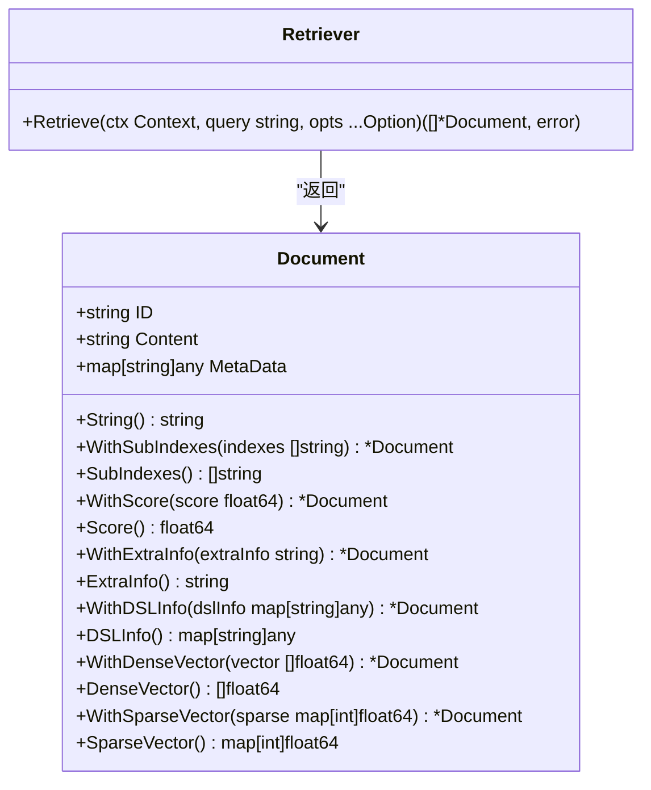
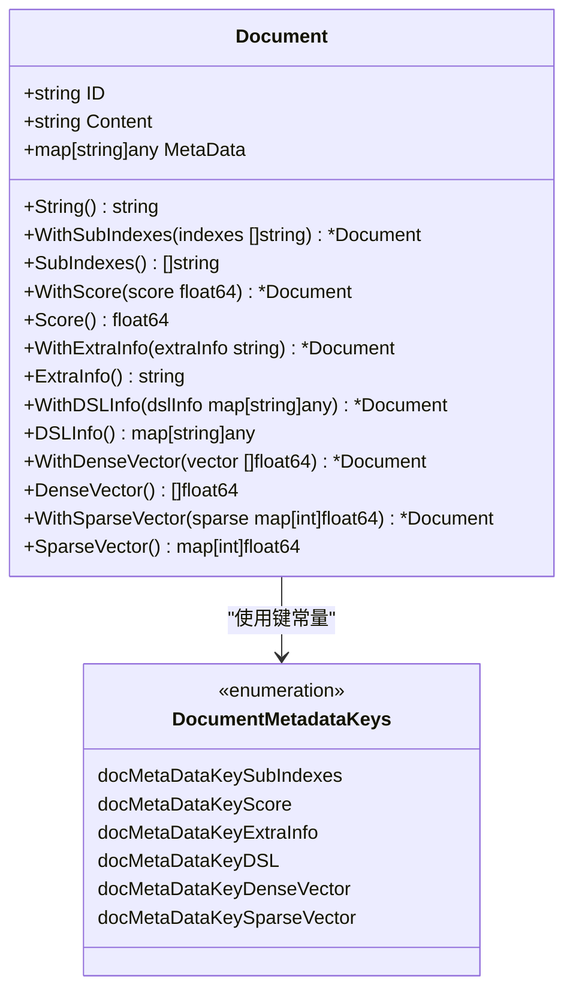
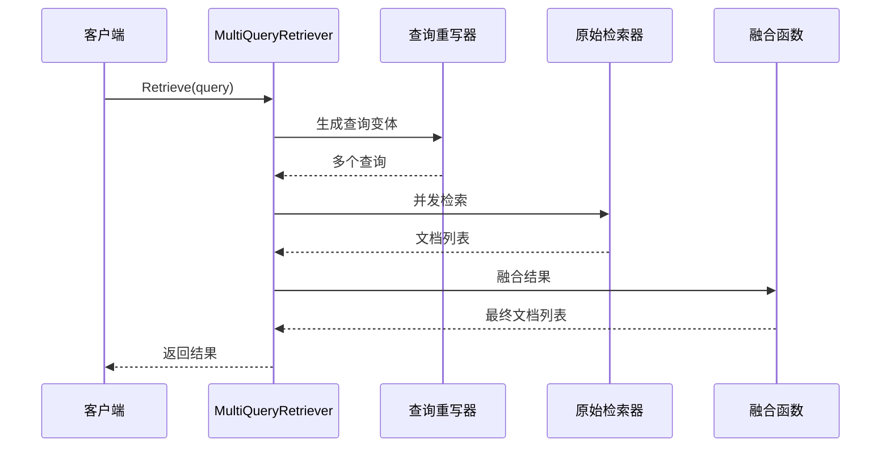
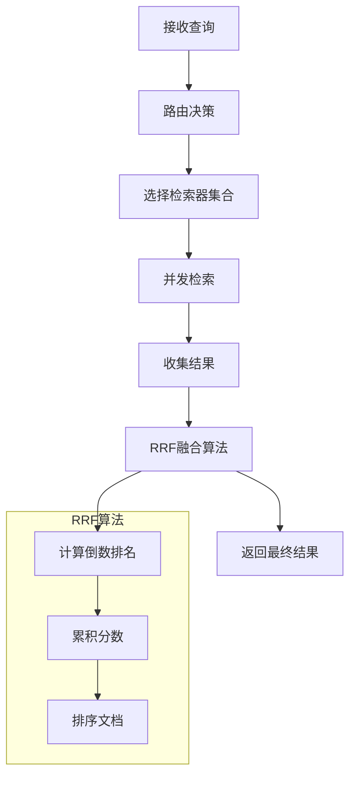
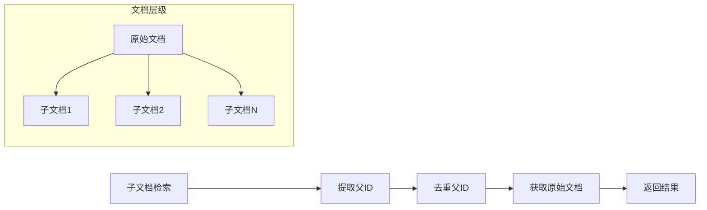
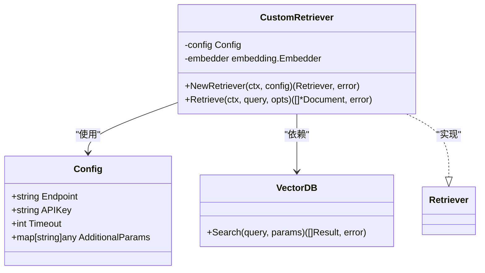
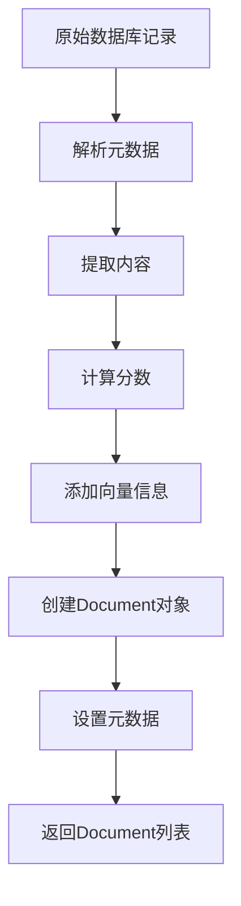
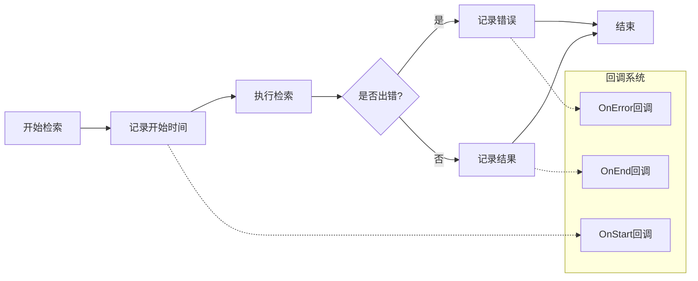

# 检索器 (Retriever) API 参考文档

<cite>
**本文档中引用的文件**
- [interface.go](file://components/retriever/interface.go)
- [option.go](file://components/retriever/option.go)
- [doc.go](file://components/retriever/doc.go)
- [document.go](file://schema/document.go)
- [multi_query.go](file://flow/retriever/multiquery/multi_query.go)
- [router.go](file://flow/retriever/router/router.go)
- [parent.go](file://flow/retriever/parent/parent.go)
- [utils.go](file://flow/retriever/utils/utils.go)
</cite>

## 目录
1. [简介](#简介)
2. [核心接口](#核心接口)
3. [检索选项系统](#检索选项系统)
4. [文档结构](#文档结构)
5. [高级实现示例](#高级实现示例)
6. [自定义检索器指南](#自定义检索器指南)
7. [错误处理与最佳实践](#错误处理与最佳实践)
8. [总结](#总结)

## 简介

Eino框架的`components/retriever`包提供了统一的文档检索接口，支持从各种数据源（如向量数据库、全文搜索引擎）检索相关文档。该包设计遵循接口隔离原则，允许开发者轻松集成不同的检索后端，并提供丰富的配置选项来优化检索效果。

### 核心特性

- **统一接口设计**：所有检索器都实现相同的`Retriever`接口
- **灵活配置系统**：通过选项模式提供细粒度的控制
- **并发优化**：内置并发检索和回调机制
- **类型安全**：使用强类型的文档结构确保数据完整性
- **扩展性强**：支持多种检索策略和融合算法

## 核心接口

### Retriever 接口

`Retriever`接口是整个检索系统的核心抽象，定义了标准的文档检索行为。



**图表来源**
- [interface.go](file://components/retriever/interface.go#L39-L41)
- [document.go](file://schema/document.go#L28-L36)

#### 方法签名详解

```go
func (r Retriever) Retrieve(ctx context.Context, query string, opts ...Option) ([]*schema.Document, error)
```

**参数说明：**

| 参数 | 类型 | 描述 |
|------|------|------|
| `ctx` | `context.Context` | 控制执行上下文，支持超时、取消等操作 |
| `query` | `string` | 检索查询字符串，可以是自然语言问题或关键词 |
| `opts` | `...Option` | 可选的配置选项，用于定制检索行为 |

**返回值：**

| 类型 | 描述 |
|------|------|
| `[]*schema.Document` | 检索到的相关文档列表，按相关性排序 |
| `error` | 操作过程中发生的错误 |

**节来源**
- [interface.go](file://components/retriever/interface.go#L39-L41)

## 检索选项系统

### Options 结构体

检索选项系统通过`Options`结构体管理所有可配置参数，支持索引、子索引、TopK数量、分数阈值等配置。

```mermaid
classDiagram
class Options {
+*string Index
+*string SubIndex
+*int TopK
+*float64 ScoreThreshold
+embedding.Embedder Embedding
+map[string]interface{} DSLInfo
}
class Option {
+func(Options)
+any implSpecificOptFn
}
Options --> Option : "应用"
```

**图表来源**
- [option.go](file://components/retriever/option.go#L22-L36)

### 可用选项函数

| 函数名 | 功能描述 | 参数类型 | 默认值 |
|--------|----------|----------|--------|
| `WithIndex` | 设置检索索引 | `string` | `nil` |
| `WithSubIndex` | 设置子索引 | `string` | `nil` |
| `WithTopK` | 限制返回文档数量 | `int` | `nil` |
| `WithScoreThreshold` | 设置分数阈值 | `float64` | `nil` |
| `WithEmbedding` | 设置嵌入器 | `embedding.Embedder` | `nil` |
| `WithDSLInfo` | 设置DSL查询信息 | `map[string]any` | `nil` |

### 高级选项处理

检索器还支持两种高级选项处理方式：

1. **通用选项提取**：通过`GetCommonOptions`函数提取标准配置
2. **实现特定选项**：通过`GetImplSpecificOptions`函数处理特定实现的配置

**节来源**
- [option.go](file://components/retriever/option.go#L22-L147)

## 文档结构

### Document 对象

`Document`结构体是检索系统中表示单个文档的标准格式，包含内容、元数据和各种辅助功能。



**图表来源**
- [document.go](file://schema/document.go#L19-L26)
- [document.go](file://schema/document.go#L28-L36)

### 元数据字段

| 字段名 | 类型 | 描述 | 常量名 |
|--------|------|------|--------|
| `_sub_indexes` | `[]string` | 子索引列表 | `docMetaDataKeySubIndexes` |
| `_score` | `float64` | 相关性分数 | `docMetaDataKeyScore` |
| `_extra_info` | `string` | 额外信息 | `docMetaDataKeyExtraInfo` |
| `_dsl` | `map[string]any` | DSL查询信息 | `docMetaDataKeyDSL` |
| `_dense_vector` | `[]float64` | 密集向量 | `docMetaDataKeyDenseVector` |
| `_sparse_vector` | `map[int]float64` | 稀疏向量 | `docMetaDataKeySparseVector` |

**节来源**
- [document.go](file://schema/document.go#L28-L204)

## 高级实现示例

### MultiQuery 检索器

MultiQuery检索器通过生成多个查询变体来提高检索效果，特别适用于复杂查询场景。



**图表来源**
- [multi_query.go](file://flow/retriever/multiquery/multi_query.go#L160-L195)

#### 配置选项

| 配置项 | 类型 | 描述 |
|--------|------|------|
| `RewriteLLM` | `model.ChatModel` | 使用大语言模型生成查询变体 |
| `RewriteHandler` | `func(ctx, query) ([]string, error)` | 自定义查询生成逻辑 |
| `MaxQueriesNum` | `int` | 最大查询变体数量，默认5 |
| `OrigRetriever` | `retriever.Retriever` | 原始检索器实例 |
| `FusionFunc` | `func(ctx, docs) ([]*Document, error)` | 文档融合函数 |

**节来源**
- [multi_query.go](file://flow/retriever/multiquery/multi_query.go#L129-L151)

### Router 检索器

Router检索器支持从多个检索器中路由查询，并使用RRF（Reciprocal Rank Fusion）算法融合结果。



**图表来源**
- [router.go](file://flow/retriever/router/router.go#L119-L168)

#### RRF融合算法

RRF（Reciprocal Rank Fusion）算法通过以下公式计算文档得分：

```
score(doc_i) = Σ(1 / (rank_i + k))
```

其中k是一个常数（默认为60），rank_i是文档在各个检索器中的排名。

**节来源**
- [router.go](file://flow/retriever/router/router.go#L31-L63)

### Parent 检索器

Parent检索器专门处理分层文档结构，能够从子文档检索中恢复原始文档。



**图表来源**
- [parent.go](file://flow/retriever/parent/parent.go#L89-L102)

**节来源**
- [parent.go](file://flow/retriever/parent/parent.go#L27-L47)

## 自定义检索器指南

### 实现步骤

1. **定义配置结构体**
2. **实现Retriever接口**
3. **处理选项参数**
4. **转换为Document对象**
5. **添加错误处理**

### 示例架构



### 连接向量数据库

以下是连接向量数据库的基本模式：

```go
// 1. 创建检索器实例
retriever, err := NewRetriever(ctx, &Config{
    Endpoint: "vector-db.example.com",
    APIKey:   "your-api-key",
    Embedding: embeddingInstance,
})

// 2. 执行检索
docs, err := retriever.Retrieve(ctx, "查询文本", 
    WithTopK(10),
    WithScoreThreshold(0.7),
    WithEmbedding(customEmbedding),
)
```

### 文档转换流程



### 错误处理最佳实践

1. **验证输入参数**
2. **处理网络超时**
3. **优雅降级**
4. **记录详细日志**

## 错误处理与最佳实践

### 常见错误类型

| 错误类型 | 原因 | 解决方案 |
|----------|------|----------|
| `context deadline exceeded` | 查询超时 | 增加超时时间或优化查询 |
| `no retriever has been selected` | 路由器未选择检索器 | 检查路由器配置 |
| `router output has not registered` | 检索器未注册 | 确保所有检索器已正确初始化 |
| `retrievers is empty` | 检索器列表为空 | 添加至少一个检索器 |

### 性能优化建议

1. **合理设置TopK值**：避免返回过多无关文档
2. **使用合适的分数阈值**：过滤低质量结果
3. **并发检索**：利用多检索器并行处理
4. **缓存嵌入结果**：减少重复计算

### 监控和调试



**图表来源**
- [utils.go](file://flow/retriever/utils/utils.go#L40-L69)

**节来源**
- [utils.go](file://flow/retriever/utils/utils.go#L30-L84)

## 总结

Eino框架的`components/retriever`包提供了一个强大而灵活的文档检索系统。通过统一的接口设计、丰富的配置选项和多种高级实现，开发者可以轻松构建适应不同需求的检索解决方案。

### 主要优势

- **接口一致性**：所有检索器都遵循相同的接口规范
- **配置灵活性**：通过选项系统提供细粒度控制
- **性能优化**：内置并发处理和回调机制
- **扩展性强**：支持多种检索策略和融合算法
- **类型安全**：使用强类型文档结构确保数据完整性

### 适用场景

- **问答系统**：基于知识库的智能问答
- **推荐系统**：个性化内容推荐
- **语义搜索**：基于语义理解的搜索
- **多模态检索**：结合文本和向量的混合检索

通过合理使用这些组件和模式，开发者可以构建高性能、可扩展的文档检索系统，满足各种复杂的业务需求。