# 模型 (Model) API 参考文档

<cite>
**本文档中引用的文件**
- [interface.go](file://components/model/interface.go)
- [option.go](file://components/model/option.go)
- [doc.go](file://components/model/doc.go)
- [message.go](file://schema/message.go)
- [stream.go](file://schema/stream.go)
- [tool.go](file://schema/tool.go)
- [callback_extra.go](file://components/model/callback_extra.go)
- [chatmodel.go](file://adk/chatmodel.go)
</cite>

## 目录
1. [简介](#简介)
2. [核心接口架构](#核心接口架构)
3. [BaseChatModel 接口详解](#basechatmodel-接口详解)
4. [ChatModel 接口详解](#chatmodel-接口详解)
5. [ToolCallingChatModel 接口详解](#toolcallingchatmodel-接口详解)
6. [配置选项系统](#配置选项系统)
7. [流式处理机制](#流式处理机制)
8. [工具调用功能](#工具调用功能)
9. [实现示例](#实现示例)
10. [最佳实践](#最佳实践)

## 简介

Eino框架的`components/model`包提供了统一的聊天模型抽象接口，支持文本生成、流式输出以及工具调用等功能。该包采用分层设计，从基础的`BaseChatModel`到功能完整的`ToolCallingChatModel`，为开发者提供了灵活且安全的模型集成方案。

## 核心接口架构

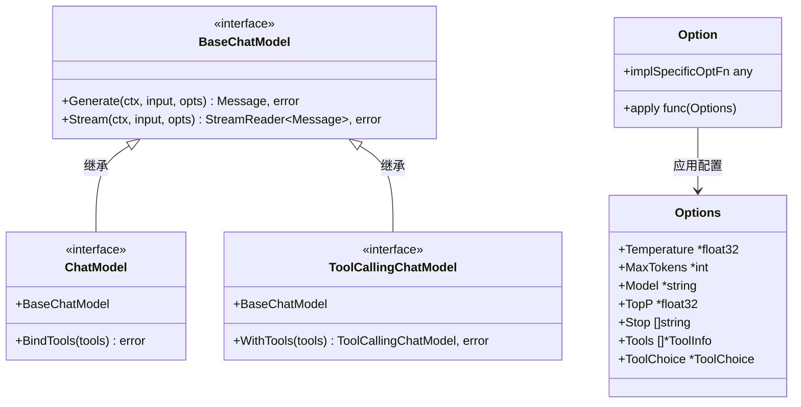

**图表来源**
- [interface.go](file://components/model/interface.go#L30-L56)
- [option.go](file://components/model/option.go#L21-L37)

**章节来源**
- [interface.go](file://components/model/interface.go#L1-L57)
- [option.go](file://components/model/option.go#L1-L160)

## BaseChatModel 接口详解

`BaseChatModel`是所有聊天模型的基础接口，定义了最基本的文本生成和流式输出能力。

### 接口定义

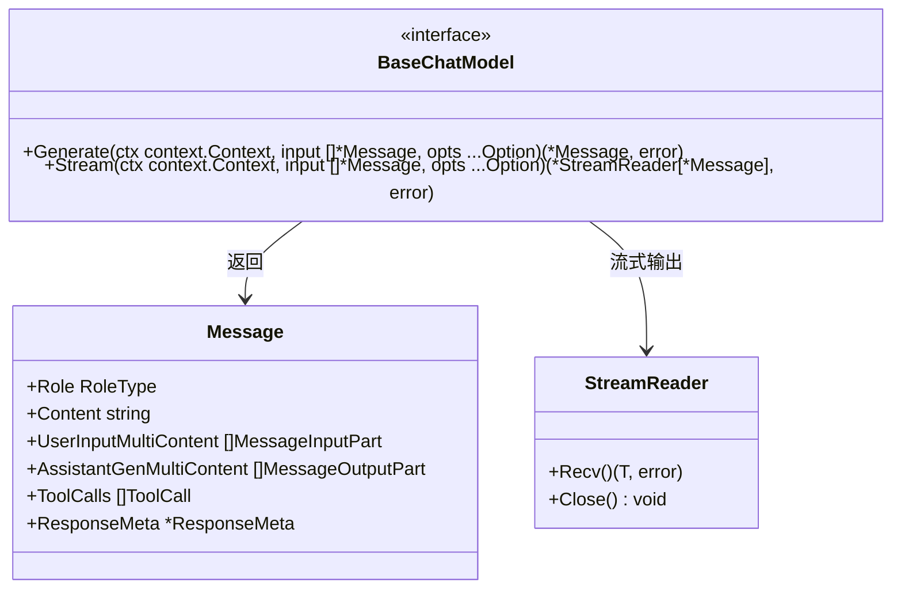

**图表来源**
- [interface.go](file://components/model/interface.go#L30-L34)
- [message.go](file://schema/message.go#L433-L467)
- [stream.go](file://schema/stream.go#L140-L201)

### Generate 方法

`Generate`方法用于同步生成完整的模型响应。

#### 调用方式
```go
func (m *BaseChatModel) Generate(
    ctx context.Context, 
    input []*schema.Message, 
    opts ...Option
) (*schema.Message, error)
```

#### 参数说明

| 参数 | 类型 | 描述 |
|------|------|------|
| `ctx` | `context.Context` | 上下文对象，用于控制请求生命周期和超时 |
| `input` | `[]*schema.Message` | 输入消息列表，包含对话历史和当前输入 |
| `opts` | `...Option` | 可选的配置选项，如温度、最大令牌数等 |

#### 返回值

| 值 | 类型 | 描述 |
|------|------|------|
| `result` | `*schema.Message` | 完整的模型响应消息 |
| `err` | `error` | 错误信息，成功时为`nil` |

### Stream 方法

`Stream`方法提供流式输出能力，支持实时接收模型生成的内容。

#### 调用方式
```go
func (m *BaseChatModel) Stream(
    ctx context.Context, 
    input []*schema.Message, 
    opts ...Option
) (*schema.StreamReader[*schema.Message], error)
```

#### 特殊说明

`Stream`方法返回`*schema.StreamReader[*schema.Message]`类型，这是Eino框架特有的流式读取器，具有以下特点：

1. **类型安全**：泛型设计确保流中数据类型的一致性
2. **资源管理**：自动处理流的关闭和清理
3. **错误处理**：通过`Recv()`方法返回错误而非panic
4. **并发安全**：支持多消费者模式

#### 使用示例流程

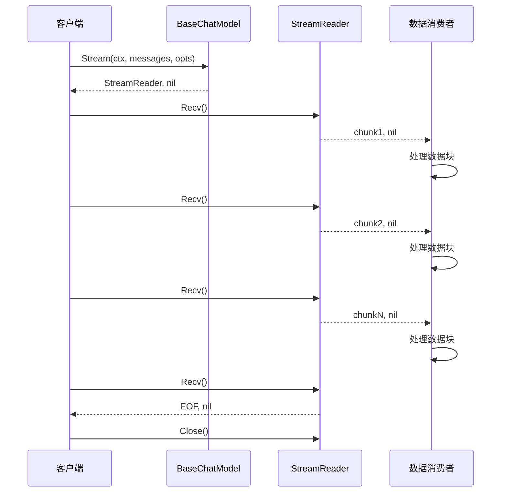

**图表来源**
- [interface.go](file://components/model/interface.go#L32-L34)
- [stream.go](file://schema/stream.go#L171-L226)

**章节来源**
- [interface.go](file://components/model/interface.go#L25-L34)
- [message.go](file://schema/message.go#L1-L800)
- [stream.go](file://schema/stream.go#L1-L919)

## ChatModel 接口详解

`ChatModel`接口继承自`BaseChatModel`，提供了工具绑定功能，但存在并发风险。

### 已弃用状态说明

**重要警告**：`ChatModel`接口已被标记为弃用，请使用`ToolCallingChatModel`接口替代。

```go
// Deprecated: Please use ToolCallingChatModel interface instead, which provides a safer way to bind tools
// without the concurrency issues and tool overwriting problems that may arise from the BindTools method.
type ChatModel interface {
    BaseChatModel
    // BindTools bind tools to the model.
    // BindTools before requesting ChatModel generally.
    // notice the non-atomic problem of BindTools and Generate.
    BindTools(tools []*schema.ToolInfo) error
}
```

### 并发风险分析

`BindTools`方法存在以下非原子性问题：

1. **状态污染**：多个goroutine同时调用可能导致工具列表混乱
2. **竞态条件**：工具绑定和生成操作可能交错执行
3. **不可预测行为**：不同goroutine看到的工具集合不一致

### 迁移建议

从`ChatModel`迁移到`ToolCallingChatModel`的步骤：

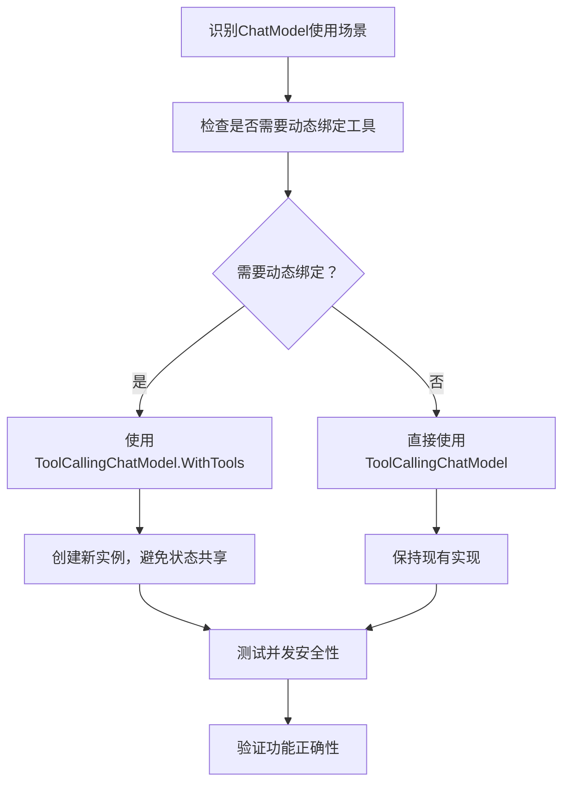

**章节来源**
- [interface.go](file://components/model/interface.go#L36-L45)

## ToolCallingChatModel 接口详解

`ToolCallingChatModel`是推荐使用的接口，通过`WithTools`方法提供安全的工具绑定功能。

### 接口设计原理

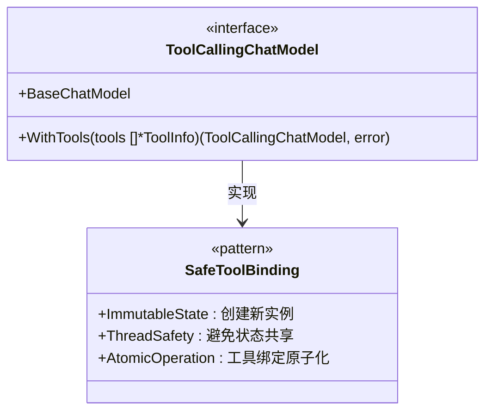

**图表来源**
- [interface.go](file://components/model/interface.go#L47-L56)

### WithTools 方法详解

#### 方法签名
```go
func (m *ToolCallingChatModel) WithTools(
    tools []*schema.ToolInfo
) (ToolCallingChatModel, error)
```

#### 设计优势

1. **不可变性**：不修改原实例，返回新的实例
2. **线程安全**：无需额外锁机制
3. **原子操作**：工具绑定在创建时完成
4. **可组合性**：支持链式调用

#### 使用模式

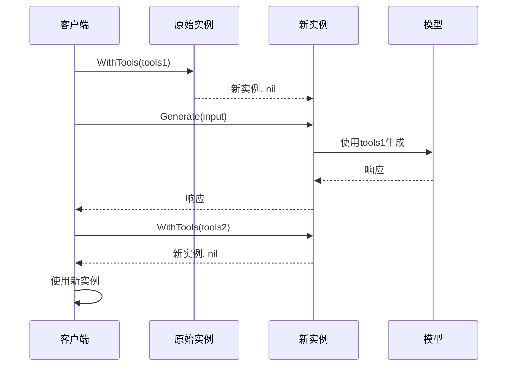

**图表来源**
- [interface.go](file://components/model/interface.go#L53-L56)

### 实现要求

实现`ToolCallingChatModel`接口的模型必须：

1. **保持不可变性**：工具列表一旦设置不应改变
2. **支持空工具列表**：允许无工具的模型实例
3. **错误处理**：验证工具定义的有效性
4. **性能优化**：缓存工具解析结果

**章节来源**
- [interface.go](file://components/model/interface.go#L47-L56)

## 配置选项系统

Eino框架采用选项模式（Option Pattern）提供灵活的配置机制。

### Options 结构体

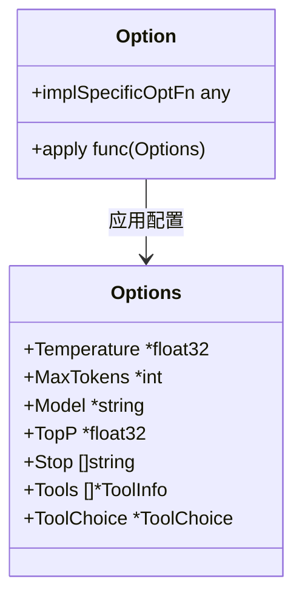

**图表来源**
- [option.go](file://components/model/option.go#L21-L37)

### 配置选项类型

| 选项 | 类型 | 默认值 | 描述 |
|------|------|--------|------|
| `Temperature` | `*float32` | `1.0` | 控制生成随机性的温度参数 |
| `MaxTokens` | `*int` | 无限制 | 最大生成令牌数 |
| `Model` | `*string` | 无默认值 | 指定使用的模型名称 |
| `TopP` | `*float32` | `1.0` | 核采样参数，控制多样性 |
| `Stop` | `[]string` | `nil` | 停止词列表 |
| `Tools` | `[]*ToolInfo` | `nil` | 工具定义列表 |
| `ToolChoice` | `*ToolChoice` | `nil` | 工具选择策略 |

### 内置配置函数

#### 基础配置选项

```go
// 设置温度参数
func WithTemperature(temperature float32) Option

// 设置最大令牌数
func WithMaxTokens(maxTokens int) Option

// 设置模型名称
func WithModel(name string) Option

// 设置TopP参数
func WithTopP(topP float32) Option

// 设置停止词
func WithStop(stop []string) Option
```

#### 工具相关配置

```go
// 设置工具列表
func WithTools(tools []*schema.ToolInfo) Option

// 设置工具选择策略
func WithToolChoice(toolChoice schema.ToolChoice) Option
```

#### 高级配置

```go
// 包装实现特定选项
func WrapImplSpecificOptFn[T any](optFn func(*T)) Option
```

### 选项应用机制

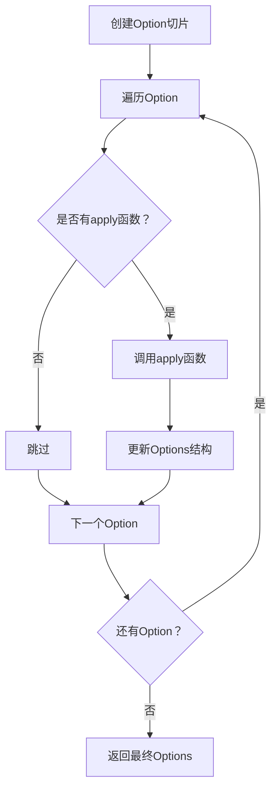

**图表来源**
- [option.go](file://components/model/option.go#L119-L133)

### 获取配置选项

框架提供了两个辅助函数用于提取配置：

```go
// 提取通用配置选项
func GetCommonOptions(base *Options, opts ...Option) *Options

// 提取实现特定配置选项  
func GetImplSpecificOptions[T any](base *T, opts ...Option) *T
```

**章节来源**
- [option.go](file://components/model/option.go#L1-L160)

## 流式处理机制

Eino框架的流式处理基于`schema.StreamReader`实现，提供高效的数据流管理。

### StreamReader 架构

```mermaid
classDiagram
class StreamReader~T~ {
+Recv() (T, error)
+Close() void
+Copy(n int) []*StreamReader~T~
+SetAutomaticClose() void
}
class stream~T~ {
+items chan streamItem~T~
+closed chan struct{}
+automaticClose bool
+closedFlag *uint32
}
class streamItem~T~ {
+chunk T
+err error
}
StreamReader --> stream : 包装
stream --> streamItem : 存储
```

**图表来源**
- [stream.go](file://schema/stream.go#L140-L201)
- [stream.go](file://schema/stream.go#L354-L370)

### 流式处理特性

#### 1. 类型安全
```go
// 泛型设计确保类型安全
var stream *schema.StreamReader[*schema.Message]
```

#### 2. 资源管理
```go
// 自动资源管理
defer stream.Close()
```

#### 3. 错误处理
```go
// 渐进式错误处理
for {
    chunk, err := stream.Recv()
    if err != nil {
        if errors.Is(err, io.EOF) {
            break
        }
        // 处理其他错误
        return err
    }
    // 处理数据块
}
```

#### 4. 并发支持
```go
// 支持多消费者
streams := stream.Copy(3)
```

### 流式数据处理流程

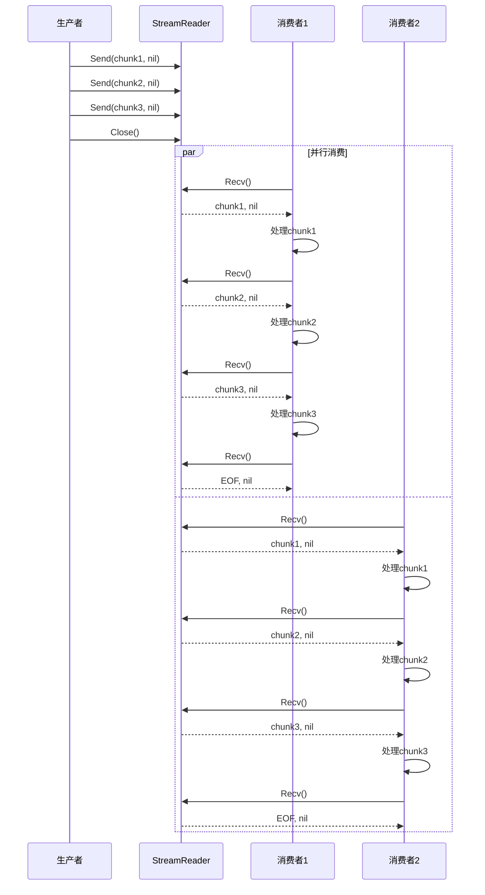

**图表来源**
- [stream.go](file://schema/stream.go#L171-L226)

**章节来源**
- [stream.go](file://schema/stream.go#L1-L919)

## 工具调用功能

Eino框架提供了完整的工具调用支持，包括工具定义、参数验证和调用管理。

### 工具定义结构

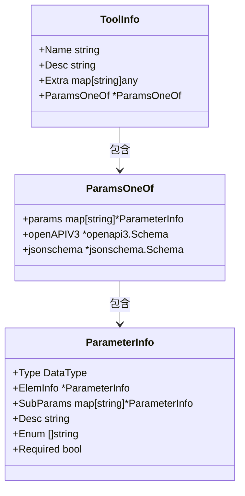

**图表来源**
- [tool.go](file://schema/tool.go#L60-L76)
- [tool.go](file://schema/tool.go#L78-L94)

### 工具选择策略

| 策略 | 类型 | 描述 |
|------|------|------|
| `ToolChoiceForbidden` | `"forbidden"` | 模型不调用任何工具 |
| `ToolChoiceAllowed` | `"allowed"` | 模型自主决定是否调用工具 |
| `ToolChoiceForced` | `"forced"` | 模型必须调用至少一个工具 |

### 工具调用流程

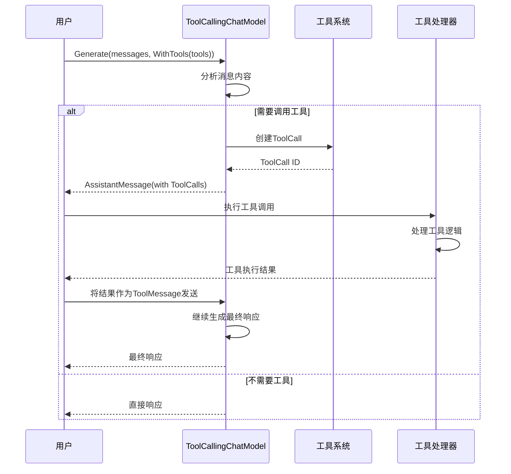

**图表来源**
- [tool.go](file://schema/tool.go#L43-L58)

### 工具参数验证

框架支持多种参数描述格式：

1. **直观参数描述**：使用`NewParamsOneOfByParams`
2. **JSON Schema**：使用`NewParamsOneOfByJSONSchema`
3. **OpenAPI v3**：使用`NewParamsOneOfByOpenAPIV3`

**章节来源**
- [tool.go](file://schema/tool.go#L1-L591)

## 实现示例

以下是实现自定义模型的完整示例：

### 基础模型实现

```go
// 基础模型结构体
type MyChatModel struct {
    client *http.Client
    baseURL string
    apiKey string
}

// 实现BaseChatModel接口
func (m *MyChatModel) Generate(
    ctx context.Context, 
    input []*schema.Message, 
    opts ...model.Option
) (*schema.Message, error) {
    // 1. 解析配置选项
    options := model.GetCommonOptions(nil, opts...)
    
    // 2. 构建请求
    req := m.buildGenerateRequest(input, options)
    
    // 3. 发送HTTP请求
    resp, err := m.client.Do(req.WithContext(ctx))
    if err != nil {
        return nil, fmt.Errorf("请求失败: %w", err)
    }
    defer resp.Body.Close()
    
    // 4. 解析响应
    return m.parseGenerateResponse(resp)
}

func (m *MyChatModel) Stream(
    ctx context.Context, 
    input []*schema.Message, 
    opts ...model.Option
) (*schema.StreamReader[*schema.Message], error) {
    // 1. 解析配置选项
    options := model.GetCommonOptions(nil, opts...)
    
    // 2. 构建流式请求
    req := m.buildStreamRequest(input, options)
    
    // 3. 发送HTTP请求
    resp, err := m.client.Do(req.WithContext(ctx))
    if err != nil {
        return nil, fmt.Errorf("流式请求失败: %w", err)
    }
    
    // 4. 创建StreamReader
    return m.createStreamReader(resp)
}
```

### 工具调用模型实现

```go
// 工具调用模型结构体
type MyToolCallingModel struct {
    BaseChatModel
    tools map[string]*schema.ToolInfo
}

// 实现ToolCallingChatModel接口
func (m *MyToolCallingModel) WithTools(
    tools []*schema.ToolInfo
) (model.ToolCallingChatModel, error) {
    // 1. 验证工具定义
    if err := m.validateTools(tools); err != nil {
        return nil, fmt.Errorf("工具验证失败: %w", err)
    }
    
    // 2. 创建新实例（不可变）
    newModel := &MyToolCallingModel{
        BaseChatModel: m.BaseChatModel,
        tools:         make(map[string]*schema.ToolInfo),
    }
    
    // 3. 复制工具定义
    for _, tool := range tools {
        newModel.tools[tool.Name] = tool
    }
    
    return newModel, nil
}

// 工具验证逻辑
func (m *MyToolCallingModel) validateTools(tools []*schema.ToolInfo) error {
    for _, tool := range tools {
        if tool.Name == "" {
            return fmt.Errorf("工具名称不能为空")
        }
        if tool.Desc == "" {
            return fmt.Errorf("工具描述不能为空")
        }
        // 验证参数定义
        if tool.ParamsOneOf != nil {
            if err := m.validateParameters(tool.ParamsOneOf); err != nil {
                return fmt.Errorf("参数验证失败: %w", err)
            }
        }
    }
    return nil
}
```

### 回调集成示例

```go
// 回调输入转换
func (m *MyChatModel) prepareCallbackInput(
    input []*schema.Message, 
    opts ...model.Option
) *model.CallbackInput {
    options := model.GetCommonOptions(nil, opts...)
    
    return &model.CallbackInput{
        Messages: input,
        Tools:    options.Tools,
        ToolChoice: options.ToolChoice,
        Config: &model.Config{
            Model:       options.Model != nil && *options.Model != "",
            MaxTokens:   options.MaxTokens != nil ? *options.MaxTokens : 0,
            Temperature: options.Temperature != nil ? *options.Temperature : 1.0,
            TopP:        options.TopP != nil ? *options.TopP : 1.0,
            Stop:        options.Stop,
        },
        Extra: make(map[string]any),
    }
}

// 回调输出转换
func (m *MyChatModel) prepareCallbackOutput(
    message *schema.Message,
    usage *model.TokenUsage
) *model.CallbackOutput {
    return &model.CallbackOutput{
        Message: message,
        Config: &model.Config{
            Model:       "custom-model",
            MaxTokens:   4096,
            Temperature: 0.7,
            TopP:        0.9,
        },
        TokenUsage: usage,
        Extra:      make(map[string]any),
    }
}
```

**章节来源**
- [chatmodel.go](file://adk/chatmodel.go#L1-L200)
- [callback_extra.go](file://components/model/callback_extra.go#L1-L108)

## 最佳实践

### 1. 接口选择指南

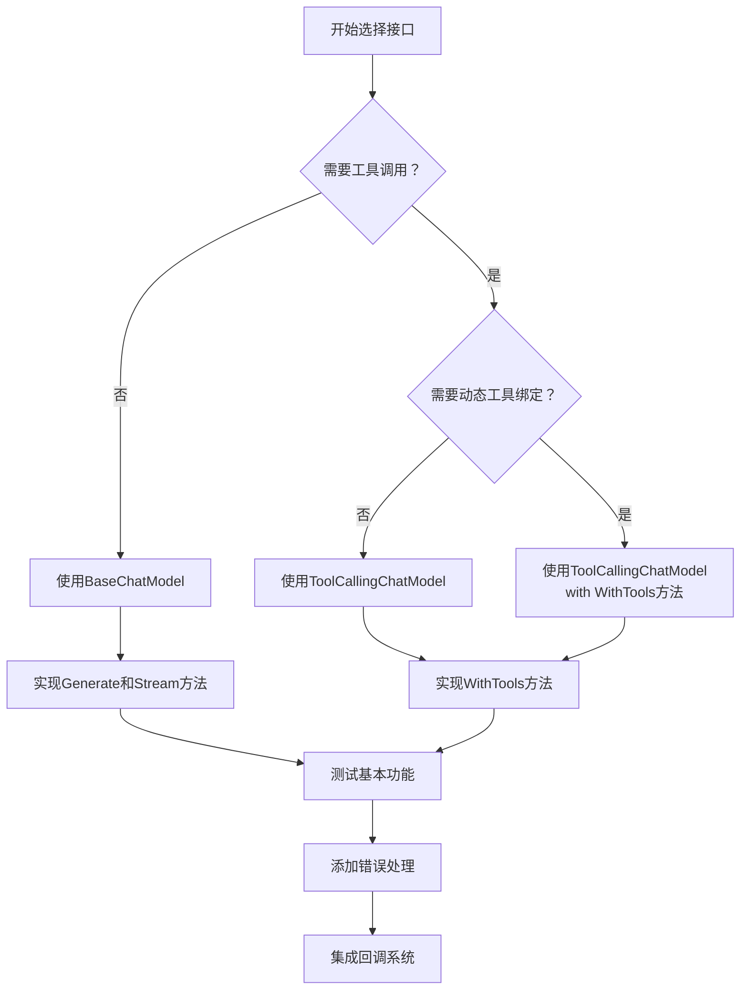

### 2. 错误处理策略

```go
// 推荐的错误处理模式
func (m *MyChatModel) Generate(ctx context.Context, input []*schema.Message, opts ...model.Option) (*schema.Message, error) {
    // 1. 验证输入
    if err := validateInput(input); err != nil {
        return nil, fmt.Errorf("输入验证失败: %w", err)
    }
    
    // 2. 设置超时
    ctx, cancel := context.WithTimeout(ctx, 30*time.Second)
    defer cancel()
    
    // 3. 执行业务逻辑
    result, err := m.executeGeneration(ctx, input, opts...)
    if err != nil {
        return nil, fmt.Errorf("生成失败: %w", err)
    }
    
    // 4. 后处理
    return postProcess(result)
}
```

### 3. 性能优化建议

| 优化项 | 建议 | 说明 |
|--------|------|------|
| 连接池 | 使用HTTP连接池 | 减少连接建立开销 |
| 缓存 | 缓存工具定义 | 避免重复解析 |
| 并发 | 合理使用goroutine | 利用多核CPU |
| 超时 | 设置合理超时时间 | 防止长时间阻塞 |
| 资源管理 | 及时关闭资源 | 避免内存泄漏 |

### 4. 测试策略

```go
// 单元测试示例
func TestMyChatModel_Generate(t *testing.T) {
    model := NewMyChatModel()
    
    // 测试用例
    testCases := []struct {
        name     string
        input    []*schema.Message
        options  []model.Option
        expected *schema.Message
        wantErr  bool
    }{
        {
            name: "正常生成",
            input: []*schema.Message{
                schema.UserMessage("你好"),
            },
            options: []model.Option{
                model.WithTemperature(0.7),
            },
            expected: &schema.Message{
                Role:    schema.Assistant,
                Content: "你好！有什么可以帮助你的吗？",
            },
            wantErr: false,
        },
        // 更多测试用例...
    }
    
    for _, tc := range testCases {
        t.Run(tc.name, func(t *testing.T) {
            result, err := model.Generate(context.Background(), tc.input, tc.options...)
            
            if tc.wantErr {
                assert.Error(t, err)
            } else {
                assert.NoError(t, err)
                assert.Equal(t, tc.expected.Content, result.Content)
            }
        })
    }
}
```

### 5. 文档和注释规范

```go
// MyChatModel 是一个自定义的聊天模型实现
// 
// 功能特性：
// - 支持文本生成和流式输出
// - 具备工具调用能力
// - 提供完整的错误处理
// - 集成回调系统
// 
// 实现要求：
// - 必须实现BaseChatModel接口
// - 可选择性实现ToolCallingChatModel接口
// - 需要提供适当的错误信息
// - 应当遵循上下文取消机制
type MyChatModel struct {
    // 字段定义
}
```

通过遵循这些最佳实践，可以构建出高质量、高性能且易于维护的模型实现。