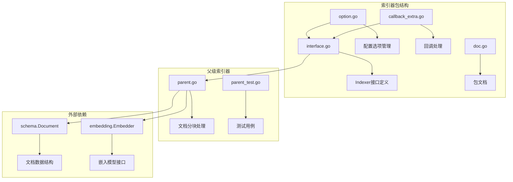
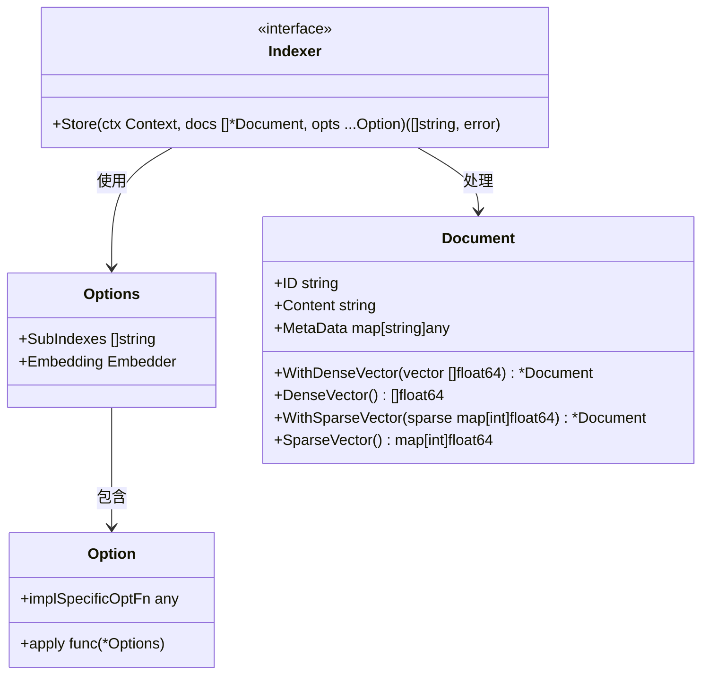
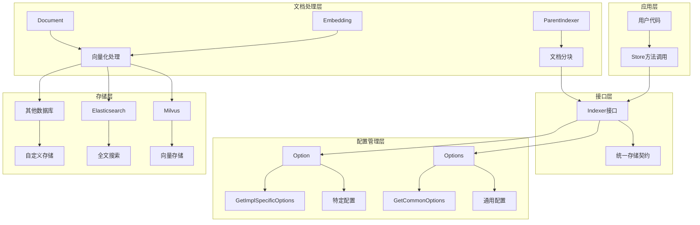
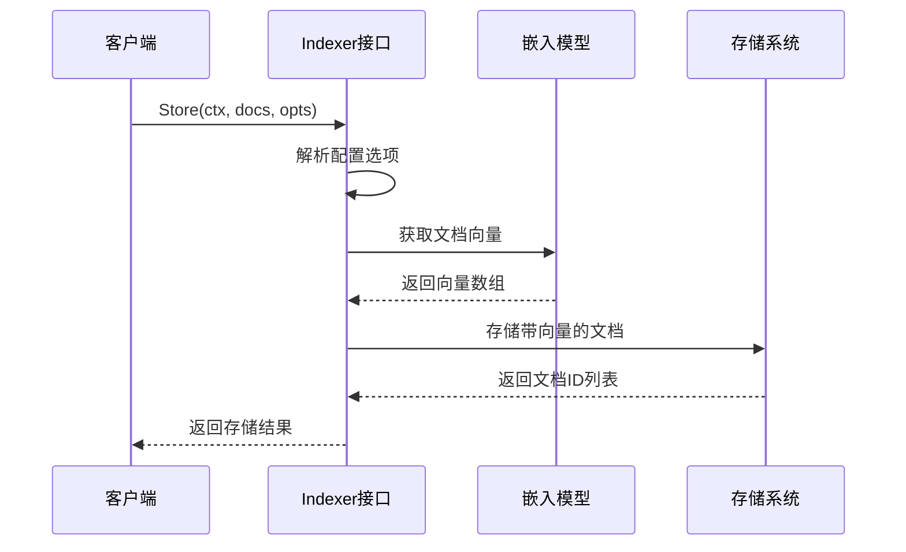
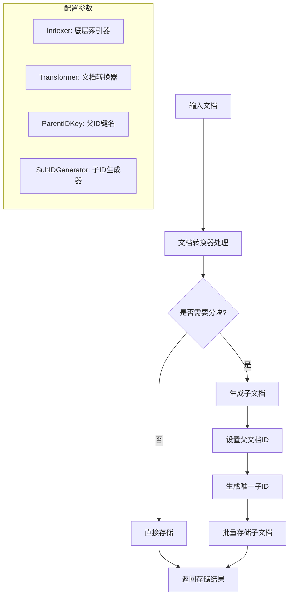
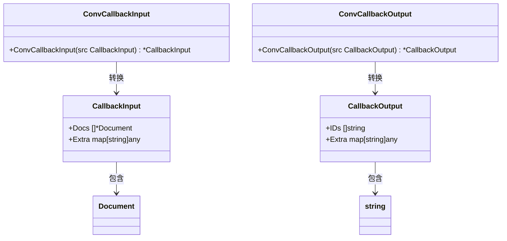
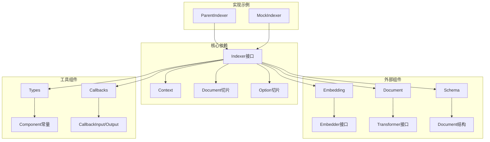
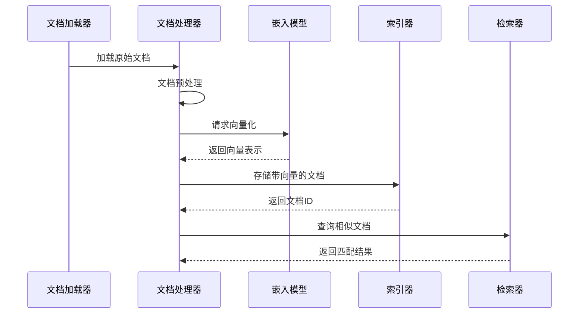

# 索引器 (Indexer) API 参考文档

<cite>
**本文档中引用的文件**
- [components/indexer/doc.go](file://components/indexer/doc.go)
- [components/indexer/interface.go](file://components/indexer/interface.go)
- [components/indexer/option.go](file://components/indexer/option.go)
- [components/indexer/callback_extra.go](file://components/indexer/callback_extra.go)
- [components/indexer/option_test.go](file://components/indexer/option_test.go)
- [flow/indexer/parent/parent.go](file://flow/indexer/parent/parent.go)
- [components/types.go](file://components/types.go)
- [schema/document.go](file://schema/document.go)
- [components/embedding/interface.go](file://components/embedding/interface.go)
- [components/retriever/interface.go](file://components/retriever/interface.go)
- [internal/mock/components/indexer/indexer_mock.go](file://internal/mock/components/indexer/indexer_mock.go)
</cite>

## 目录
1. [简介](#简介)
2. [项目结构](#项目结构)
3. [核心组件](#核心组件)
4. [架构概览](#架构概览)
5. [详细组件分析](#详细组件分析)
6. [依赖关系分析](#依赖关系分析)
7. [性能考虑](#性能考虑)
8. [故障排除指南](#故障排除指南)
9. [结论](#结论)

## 简介

Eino框架的`components/indexer`包提供了强大的文档索引功能，负责将`schema.Document`对象存储到各种索引系统中，特别是向量数据库。该包设计为可扩展的架构，支持多种索引后端，包括Milvus、Elasticsearch等向量数据库。

索引器是Eino知识库系统的核心组件之一，它与`embedding`、`document`和`retriever`组件紧密协作，形成完整的知识库构建和检索闭环。通过统一的接口设计，开发者可以轻松地在不同索引系统之间切换，而无需修改业务逻辑代码。

## 项目结构

**图表来源**
- [components/indexer/interface.go](file://components/indexer/interface.go#L1-L33)
- [components/indexer/option.go](file://components/indexer/option.go#L1-L109)
- [flow/indexer/parent/parent.go](file://flow/indexer/parent/parent.go#L1-L160)

**章节来源**
- [components/indexer/doc.go](file://components/indexer/doc.go#L1-L18)
- [components/indexer/interface.go](file://components/indexer/interface.go#L1-L33)

## 核心组件

### Indexer 接口

`Indexer`接口是整个索引器系统的核心抽象，定义了存储文档的基本契约：

**图表来源**
- [components/indexer/interface.go](file://components/indexer/interface.go#L25-L32)
- [components/indexer/option.go](file://components/indexer/option.go#L21-L27)
- [schema/document.go](file://schema/document.go#L28-L36)

### 配置选项系统

索引器提供了灵活的配置选项系统，支持通用配置和特定实现的配置：

| 选项类型 | 方法名 | 参数 | 描述 |
|---------|--------|------|------|
| 通用选项 | WithSubIndexes | []string | 设置子索引列表，用于多索引场景 |
| 通用选项 | WithEmbedding | Embedder | 设置嵌入模型，用于文档向量化 |
| 特定选项 | WrapImplSpecificOptFn | T | 包装特定实现的配置函数 |

**章节来源**
- [components/indexer/option.go](file://components/indexer/option.go#L29-L45)
- [components/indexer/option.go](file://components/indexer/option.go#L78-L82)

## 架构概览

索引器系统采用分层架构设计，从上到下包括接口层、配置管理层、文档处理层和存储层：

**图表来源**
- [components/indexer/interface.go](file://components/indexer/interface.go#L25-L32)
- [flow/indexer/parent/parent.go](file://flow/indexer/parent/parent.go#L28-L60)
- [components/embedding/interface.go](file://components/embedding/interface.go#L22-L24)

## 详细组件分析

### Store 方法详解

`Store`方法是索引器的核心方法，负责将文档存储到索引系统中：

**图表来源**
- [components/indexer/interface.go](file://components/indexer/interface.go#L30-L31)
- [flow/indexer/parent/parent.go](file://flow/indexer/parent/parent.go#L112-L158)

#### 方法签名和参数

- **ctx**: 上下文对象，用于控制操作生命周期和取消操作
- **docs**: 文档切片，包含要存储的`schema.Document`对象
- **opts**: 可选配置选项，支持多个`Option`参数

#### 返回值

- **[]string**: 存储成功文档的ID列表
- **error**: 操作过程中遇到的错误

### 父级索引器 (ParentIndexer)

父级索引器提供了高级的文档处理功能，支持文档分块和子文档管理：

**图表来源**
- [flow/indexer/parent/parent.go](file://flow/indexer/parent/parent.go#L112-L158)

#### 配置参数详解

| 参数名 | 类型 | 描述 | 示例 |
|--------|------|------|------|
| Indexer | indexer.Indexer | 底层索引器实现 | Milvus、Elasticsearch等 |
| Transformer | document.Transformer | 文档转换器，用于分块处理 | 文本分割器、代码分割器 |
| ParentIDKey | string | 子文档中存储父ID的元数据键 | "source_doc_id" |
| SubIDGenerator | 函数 | 子文档ID生成函数 | 自定义ID生成逻辑 |

**章节来源**
- [flow/indexer/parent/parent.go](file://flow/indexer/parent/parent.go#L28-L60)

### 回调系统

索引器提供了完整的回调系统，支持操作监控和调试：

**图表来源**
- [components/indexer/callback_extra.go](file://components/indexer/callback_extra.go#L24-L38)

**章节来源**
- [components/indexer/callback_extra.go](file://components/indexer/callback_extra.go#L1-L67)

## 依赖关系分析

索引器组件与其他Eino组件形成了复杂的依赖关系网络：

**图表来源**
- [components/indexer/interface.go](file://components/indexer/interface.go#L22-L23)
- [components/indexer/option.go](file://components/indexer/option.go#L19)
- [components/types.go](file://components/types.go#L54-L57)

### 组件间数据流

索引器在整个Eino生态系统中的数据流向如下：

**图表来源**
- [components/indexer/interface.go](file://components/indexer/interface.go#L25-L32)
- [components/embedding/interface.go](file://components/embedding/interface.go#L22-L24)
- [components/retriever/interface.go](file://components/retriever/interface.go#L39-L41)

**章节来源**
- [components/types.go](file://components/types.go#L54-L57)

## 性能考虑

### 向量化处理优化

索引器支持密集向量和稀疏向量两种表示形式，可以根据具体需求选择合适的向量类型：

| 向量类型 | 适用场景 | 存储特点 | 检索效率 |
|----------|----------|----------|----------|
| 密集向量 | 语义相似性检索 | 高维浮点数数组 | 高效，适合大规模 |
| 稀疏向量 | 关键词匹配 | 键值对映射 | 中等，适合精确匹配 |

### 批量处理策略

对于大量文档的索引，建议采用批量处理策略：

1. **分批大小控制**: 根据内存和网络限制调整批次大小
2. **并发处理**: 利用Go的并发特性提高处理速度
3. **错误恢复**: 实现断点续传机制，确保数据完整性

### 索引优化

- **子索引策略**: 使用`SubIndexes`选项支持多维度索引
- **向量维度**: 根据任务需求选择合适的向量维度
- **距离度量**: 根据数据特征选择合适的相似度计算方法

## 故障排除指南

### 常见问题及解决方案

#### 1. 文档向量化失败

**症状**: Store方法返回嵌入相关错误
**原因**: 嵌入模型配置不正确或网络连接问题
**解决方案**: 
- 检查嵌入模型配置
- 验证网络连接
- 确认模型服务可用性

#### 2. 文档ID冲突

**症状**: 存储时出现重复ID错误
**原因**: ID生成策略不当或并发写入冲突
**解决方案**:
- 使用唯一ID生成器
- 实现乐观锁机制
- 采用分布式ID生成方案

#### 3. 内存溢出

**症状**: 处理大文档集合时内存不足
**原因**: 单次处理文档数量过多
**解决方案**:
- 实现流式处理
- 增加批次大小控制
- 使用内存映射文件

**章节来源**
- [flow/indexer/parent/parent.go](file://flow/indexer/parent/parent.go#L112-L158)

### 调试技巧

1. **启用回调日志**: 使用回调系统记录详细的操作信息
2. **监控指标收集**: 收集存储延迟、吞吐量等关键指标
3. **单元测试覆盖**: 编写全面的单元测试确保功能正确性

**章节来源**
- [components/indexer/callback_extra.go](file://components/indexer/callback_extra.go#L40-L67)

## 结论

Eino框架的`components/indexer`包提供了一个强大而灵活的文档索引解决方案。通过统一的接口设计和模块化的架构，它能够很好地适应不同的应用场景和技术栈。

### 主要优势

1. **接口统一**: 提供简洁一致的存储接口
2. **配置灵活**: 支持通用和特定实现的配置选项
3. **扩展性强**: 易于集成新的索引后端
4. **功能完整**: 包含文档分块、向量化、批量处理等完整功能
5. **生态兼容**: 与Eino的其他组件无缝集成

### 最佳实践建议

1. **合理选择索引类型**: 根据具体需求选择合适的向量表示
2. **优化配置参数**: 根据硬件资源和性能要求调整配置
3. **实施监控机制**: 建立完善的监控和告警体系
4. **定期维护更新**: 保持索引系统的健康运行状态

通过遵循这些指导原则，开发者可以充分发挥索引器的强大功能，构建高效的知识库系统。