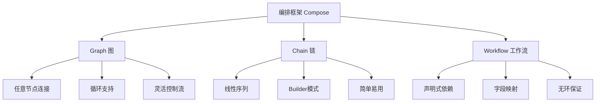
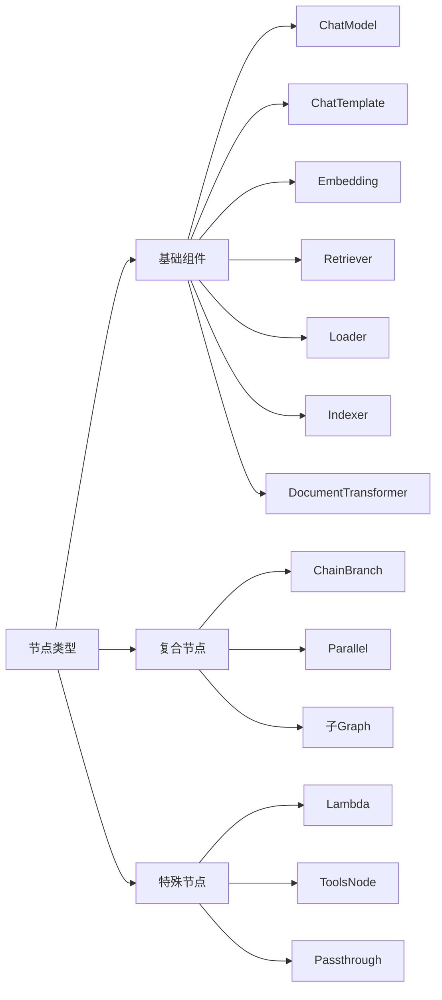

# 编排框架 (Compose) API 参考文档

<cite>
**本文档中引用的文件**
- [compose/doc.go](file://compose/doc.go)
- [compose/graph.go](file://compose/graph.go)
- [compose/chain.go](file://compose/chain.go)
- [compose/workflow.go](file://compose/workflow.go)
- [compose/runnable.go](file://compose/runnable.go)
- [compose/state.go](file://compose/state.go)
- [compose/types.go](file://compose/types.go)
- [compose/graph_call_options.go](file://compose/graph_call_options.go)
- [compose/error.go](file://compose/error.go)
- [compose/types_composable.go](file://compose/types_composable.go)
- [compose/types_lambda.go](file://compose/types_lambda.go)
</cite>

## 目录
1. [简介](#简介)
2. [核心概念](#核心概念)
3. [Graph 图编排](#graph-图编排)
4. [Chain 链式编排](#chain-链式编排)
5. [Workflow 工作流编排](#workflow-工作流编排)
6. [核心接口和类型](#核心接口和类型)
7. [状态管理](#状态管理)
8. [错误处理](#错误处理)
9. [集成与回调](#集成与回调)
10. [最佳实践](#最佳实践)

## 简介

Eino框架的`compose`包提供了强大的编排能力，支持三种核心编排模式：`Graph`（图）、`Chain`（链）和`Workflow`（工作流）。这些编排器允许开发者以类型安全的方式构建复杂的异步流程，支持多种数据流模式和并发执行。

### 主要特性

- **类型安全**：基于泛型的编排系统，确保输入输出类型的正确性
- **多种执行模式**：支持同步、异步、流式等多种数据流模式
- **灵活的编排策略**：支持顺序执行、并行执行、条件分支等复杂控制流
- **状态管理**：内置状态持久化和并发安全的状态访问机制
- **可扩展性**：支持自定义组件和处理器的集成

## 核心概念

### 编排器类型



### 节点类型

编排框架支持多种类型的节点，每种节点对应不同的组件类型：



## Graph 图编排

`Graph`是最灵活的编排器，支持任意节点间的连接，可以包含循环结构，适用于复杂的异步流程编排。

### 构造函数

```go
// NewGraph 创建一个新的图编排器
func NewGraph[I, O any](opts ...NewGraphOption) *Graph[I, O]
```

**参数说明：**
- `I`：输入类型
- `O`：输出类型
- `opts`：可选配置选项

**返回值：**
- 返回一个新创建的`Graph`实例

**使用场景：**
- 复杂的异步流程编排
- 需要循环或条件跳转的场景
- 多入口多出口的流程设计

### 核心方法

#### 添加节点

```go
// AddChatModelNode 添加聊天模型节点
func (g *Graph[I, O]) AddChatModelNode(key string, node model.BaseChatModel, opts ...GraphAddNodeOpt) error

// AddLambdaNode 添加Lambda节点
func (g *Graph[I, O]) AddLambdaNode(key string, node *Lambda, opts ...GraphAddNodeOpt) error

// AddPassthroughNode 添加透传节点
func (g *Graph[I, O]) AddPassthroughNode(key string, opts ...GraphAddNodeOpt) error
```

#### 添加边

```go
// AddEdge 添加节点间的数据流边
func (g *Graph[I, O]) AddEdge(startNode, endNode string, opts ...EdgeOption) error

// AddEdgeWithMappings 添加带字段映射的边
func (g *Graph[I, O]) AddEdgeWithMappings(startNode, endNode string, mappings ...*FieldMapping) error
```

#### 编译和执行

```go
// Compile 编译图以获得可执行对象
func (g *Graph[I, O]) Compile(ctx context.Context, opts ...GraphCompileOption) (Runnable[I, O], error)

// Invoke 同步执行
func (r Runnable[I, O]) Invoke(ctx context.Context, input I, opts ...Option) (O, error)

// Stream 流式执行
func (r Runnable[I, O]) Stream(ctx context.Context, input I, opts ...Option) (*schema.StreamReader[O], error)
```

### 示例代码

```go
// 基本图编排示例
func basicGraphExample() {
    g := NewGraph[map[string]any, *schema.Message]()
    
    // 添加节点
    g.AddChatTemplateNode("prompt", promptTemplate)
    g.AddChatModelNode("model", chatModel)
    
    // 添加边
    g.AddEdge(START, "prompt")
    g.AddEdge("prompt", "model")
    g.AddEdge("model", END)
    
    // 编译执行
    r, _ := g.Compile(context.Background())
    result, _ := r.Invoke(context.Background(), map[string]any{"question": "你好"})
}
```

**节来源**
- [compose/graph.go](file://compose/graph.go#L67-L83)
- [compose/graph.go](file://compose/graph.go#L296-L420)

## Chain 链式编排

`Chain`采用线性序列的方式组织节点，适合构建简单的处理流水线，遵循Builder模式设计。

### 构造函数

```go
// NewChain 创建一个新的链式编排器
func NewChain[I, O any](opts ...NewGraphOption) *Chain[I, O]
```

**特点：**
- 节点按添加顺序线性执行
- 支持分支和并行节点
- 自动处理节点间的连接

### 核心方法

#### 追加节点

```go
// 追加各种类型的节点
func (c *Chain[I, O]) AppendChatModel(node model.BaseChatModel, opts ...GraphAddNodeOpt) *Chain[I, O]
func (c *Chain[I, O]) AppendLambda(node *Lambda, opts ...GraphAddNodeOpt) *Chain[I, O]
func (c *Chain[I, O]) AppendBranch(b *ChainBranch) *Chain[I, O]
func (c *Chain[I, O]) AppendParallel(p *Parallel) *Chain[I, O]
```

#### 编译和执行

```go
// Compile 编译链以获得可执行对象
func (c *Chain[I, O]) Compile(ctx context.Context, opts ...GraphCompileOption) (Runnable[I, O], error)
```

### 使用模式

```go
// 链式编排示例
func chainExample() {
    chain := NewChain[map[string]any, string]()
    
    chain.AppendChatTemplate(promptTemplate).
        AppendChatModel(chatModel).
        AppendLambda(transformLambda).
        AppendBranch(branchCondition)
    
    r, _ := chain.Compile(context.Background())
    result, _ := r.Invoke(context.Background(), input)
}
```

**节来源**
- [compose/chain.go](file://compose/chain.go#L36-L44)
- [compose/chain.go](file://compose/chain.go#L165-L232)

## Workflow 工作流编排

`Workflow`采用声明式的依赖关系定义，通过字段映射自动处理数据流，确保无环的执行图。

### 构造函数

```go
// NewWorkflow 创建一个新的工作流编排器
func NewWorkflow[I, O any](opts ...NewGraphOption) *Workflow[I, O]
```

### 核心概念

#### 依赖类型

```go
type dependencyType int
const (
    normalDependency     // 正常依赖，同时建立数据和执行依赖
    noDirectDependency   // 仅建立数据依赖，不建立直接执行依赖
    branchDependency     // 分支依赖
)
```

#### 字段映射

```go
// 映射特定字段
node.AddInput("fromNode", MapFields("sourceField", "targetField"))

// 使用整个输出
node.AddInput("fromNode")

// 无直接依赖的映射
node.AddInputWithOptions("fromNode", mappings, WithNoDirectDependency())
```

### 核心方法

#### 添加节点

```go
func (wf *Workflow[I, O]) AddChatModelNode(key string, chatModel model.BaseChatModel, opts ...GraphAddNodeOpt) *WorkflowNode
func (wf *Workflow[I, O]) AddLambdaNode(key string, lambda *Lambda, opts ...GraphAddNodeOpt) *WorkflowNode
```

#### 定义依赖

```go
// 添加数据和执行依赖
func (n *WorkflowNode) AddInput(fromNodeKey string, inputs ...*FieldMapping) *WorkflowNode

// 仅添加执行依赖
func (n *WorkflowNode) AddDependency(fromNodeKey string) *WorkflowNode

// 设置静态值
func (n *WorkflowNode) SetStaticValue(path FieldPath, value any) *WorkflowNode
```

### 使用示例

```go
// 工作流编排示例
func workflowExample() {
    wf := NewWorkflow[InputType, OutputType]()
    
    // 添加节点
    nodeA := wf.AddLambdaNode("A", lambdaA)
    nodeB := wf.AddLambdaNode("B", lambdaB)
    nodeC := wf.AddLambdaNode("C", lambdaC)
    
    // 定义依赖关系
    nodeB.AddInput("A", MapFields("result", "input"))
    nodeC.AddInput("B", MapFields("processed", "finalInput"))
    
    // 编译执行
    r, _ := wf.Compile(context.Background())
    result, _ := r.Invoke(context.Background(), input)
}
```

**节来源**
- [compose/workflow.go](file://compose/workflow.go#L60-L78)
- [compose/workflow.go](file://compose/workflow.go#L167-L190)

## 核心接口和类型

### Runnable 接口

所有编排器最终都会编译成`Runnable`接口，提供统一的执行能力：

```go
type Runnable[I, O any] interface {
    Invoke(ctx context.Context, input I, opts ...Option) (output O, err error)
    Stream(ctx context.Context, input I, opts ...Option) (*schema.StreamReader[O], err error)
    Collect(ctx context.Context, input *schema.StreamReader[I], opts ...Option) (output O, err error)
    Transform(ctx context.Context, input *schema.StreamReader[I], opts ...Option) (*schema.StreamReader[O], err error)
}
```

### Lambda 函数

Lambda是自定义逻辑的核心抽象：

```go
// 可调用的Lambda
func InvokableLambda[I, O any](fn func(ctx context.Context, input I) (O, error)) *Lambda

// 可流式的Lambda
func StreamableLambda[I, O any](fn func(ctx context.Context, input I) (*schema.StreamReader[O], error)) *Lambda

// 可收集的Lambda
func CollectableLambda[I, O any](fn func(ctx context.Context, input *schema.StreamReader[I]) (O, error)) *Lambda

// 可变换的Lambda
func TransformableLambda[I, O any](fn func(ctx context.Context, input *schema.StreamReader[I]) (*schema.StreamReader[O], error)) *Lambda
```

### 组件类型

```go
const (
    ComponentOfUnknown     component = "Unknown"
    ComponentOfGraph       component = "Graph"
    ComponentOfWorkflow    component = "Workflow"
    ComponentOfChain       component = "Chain"
    ComponentOfPassthrough component = "Passthrough"
    ComponentOfToolsNode   component = "ToolsNode"
    ComponentOfLambda      component = "Lambda"
)
```

### 执行模式

```go
type NodeTriggerMode string
const (
    AnyPredecessor     NodeTriggerMode = "any_predecessor"  // 任意前驱完成时触发
    AllPredecessor     NodeTriggerMode = "all_predecessor"  // 所有前驱完成时触发
)
```

**节来源**
- [compose/runnable.go](file://compose/runnable.go#L28-L37)
- [compose/types.go](file://compose/types.go#L23-L46)

## 状态管理

### 状态生成器

```go
// GenLocalState 是生成状态的函数
type GenLocalState[S any] func(ctx context.Context) (state S)
```

### 状态处理器

```go
// 前置状态处理器
type StatePreHandler[I, S any] func(ctx context.Context, in I, state S) (I, error)

// 后置状态处理器  
type StatePostHandler[O, S any] func(ctx context.Context, out O, state S) (O, error)

// 流式前置状态处理器
type StreamStatePreHandler[I, S any] func(ctx context.Context, in *schema.StreamReader[I], state S) (*schema.StreamReader[I], error)

// 流式后置状态处理器
type StreamStatePostHandler[O, S any] func(ctx context.Context, out *schema.StreamReader[O], state S) (*schema.StreamReader[O], error)
```

### 状态访问

```go
// ProcessState 以并发安全的方式处理状态
func ProcessState[S any](ctx context.Context, handler func(context.Context, S) error) error
```

### 示例

```go
// 状态管理示例
type AppState struct {
    Counter int
    Mutex   sync.Mutex
}

func stateExample() {
    genState := func(ctx context.Context) *AppState {
        return &AppState{}
    }
    
    workflow := NewWorkflow[InputType, OutputType](WithGenLocalState(genState))
    
    workflow.AddLambdaNode("process", 
        InvokableLambda(func(ctx context.Context, input InputType) (OutputType, error) {
            // 并发安全地访问和修改状态
            err := ProcessState[*AppState](ctx, func(state *AppState) error {
                state.Counter++
                return nil
            })
            return output, err
        }),
        WithStatePreHandler(func(ctx context.Context, input InputType, state *AppState) (InputType, error) {
            // 处理输入前的状态操作
            return input, nil
        }),
        WithStatePostHandler(func(ctx context.Context, output OutputType, state *AppState) (OutputType, error) {
            // 处理输出后的状态操作
            return output, nil
        }))
}
```

**节来源**
- [compose/state.go](file://compose/state.go#L29-L51)
- [compose/state.go](file://compose/state.go#L133-L141)

## 错误处理

### 内置错误类型

```go
// 超出最大步骤数错误
var ErrExceedMaxSteps = errors.New("exceeds max steps")

// 图已编译错误
var ErrGraphCompiled = errors.New("graph has been compiled, cannot be modified")

// 链已编译错误
var ErrChainCompiled = errors.New("chain has been compiled, cannot be modified")
```

### 内部错误结构

```go
type internalError struct {
    typ       internalErrorType
    nodePath  NodePath
    origError error
}

type internalErrorType string
const (
    internalErrorTypeNodeRun  = "NodeRunError"
    internalErrorTypeGraphRun = "GraphRunError"
)
```

### 错误处理最佳实践

```go
// 错误处理示例
func errorHandlingExample() {
    g := NewGraph[InputType, OutputType]()
    
    // 添加节点和边...
    
    r, err := g.Compile(context.Background())
    if err != nil {
        log.Printf("编译失败: %v", err)
        return
    }
    
    result, err := r.Invoke(context.Background(), input)
    if err != nil {
        var internalErr *internalError
        if errors.As(err, &internalErr) {
            log.Printf("节点执行错误: %v", internalErr.Error())
            log.Printf("节点路径: %v", internalErr.nodePath)
        } else if errors.Is(err, ErrExceedMaxSteps) {
            log.Printf("超出最大步骤数限制")
        } else {
            log.Printf("其他错误: %v", err)
        }
        return
    }
    
    // 处理结果...
}
```

**节来源**
- [compose/error.go](file://compose/error.go#L26-L28)
- [compose/error.go](file://compose/error.go#L86-L111)

## 集成与回调

### 回调系统

编排框架与`callbacks`系统深度集成，支持全局回调和节点级回调：

```go
// 设置全局回调
runnable.Invoke(ctx, input, WithCallbacks(&myCallbacks{}))

// 为特定节点设置回调
runnable.Invoke(ctx, input, 
    WithCallbacks(&nodeCallbacks{}).
    DesignateNode("specific_node_key"))
```

### 组件选项

```go
// 为不同组件设置选项
embeddingOption := WithEmbeddingOption(embedding.WithModel("text-embedding-3-small"))
chatModelOption := WithChatModelOption(model.WithTemperature(0.7))
retrieverOption := WithRetrieverOption(retriever.WithTopK(5))
```

### 中断和超时

```go
// 创建中断上下文
ctx, interrupt := WithGraphInterrupt(context.Background())

// 设置超时中断
interrupt(WithGraphInterruptTimeout(30*time.Second))

// 执行并等待中断信号
result, err := runnable.Invoke(ctx, input)
```

**节来源**
- [compose/graph_call_options.go](file://compose/graph_call_options.go#L53-L68)
- [compose/graph_call_options.go](file://compose/graph_call_options.go#L204-L212)

## 最佳实践

### 1. 选择合适的编排器

```go
// 简单线性流程：使用 Chain
chain := NewChain[InputType, OutputType]()
chain.AppendChatModel(model1).AppendChatModel(model2)

// 复杂控制流：使用 Graph
graph := NewGraph[InputType, OutputType]()
graph.AddChatModelNode("m1", model1)
graph.AddChatModelNode("m2", model2)
graph.AddEdge("m1", "m2") // 明确控制流

// 声明式依赖：使用 Workflow
workflow := NewWorkflow[InputType, OutputType]()
node1 := workflow.AddLambdaNode("node1", lambda1)
node2 := workflow.AddLambdaNode("node2", lambda2)
node2.AddInput("node1", MapFields("output", "input")) // 声明依赖
```

### 2. 类型安全的设计

```go
// 使用明确的泛型类型
type Input struct {
    Query    string
    Context  string
    Metadata map[string]any
}

type Output struct {
    Answer   string
    Sources  []string
    Metadata map[string]any
}

// 在编排中保持类型一致性
graph := NewGraph[Input, Output]()
```

### 3. 错误处理策略

```go
// 实现重试机制
func retryableExecution(r Runnable[Input, Output], input Input, maxRetries int) (Output, error) {
    var err error
    var result Output
    
    for i := 0; i < maxRetries; i++ {
        result, err = r.Invoke(context.Background(), input)
        if err == nil {
            return result, nil
        }
        
        // 检查是否需要重试
        if shouldRetry(err) {
            time.Sleep(time.Duration(i+1) * time.Second)
            continue
        }
        
        return result, err
    }
    
    return result, err
}
```

### 4. 性能优化

```go
// 使用并行处理提升性能
chain := NewChain[InputType, OutputType]()
chain.AppendParallel(NewParallel().
    AddChatModel("model1", model1).
    AddChatModel("model2", model2).
    AddChatModel("model3", model3))

// 合理设置最大步骤数
r, _ := chain.Compile(context.Background(), WithMaxRunSteps(100))
```

### 5. 状态管理最佳实践

```go
type SessionState struct {
    Conversation []ConversationTurn
    Metadata     map[string]any
    Mutex        sync.Mutex
}

// 使用状态处理器进行会话管理
workflow := NewWorkflow[UserInput, AssistantResponse](WithGenLocalState(func(ctx context.Context) *SessionState {
    return &SessionState{
        Conversation: make([]ConversationTurn, 0),
        Metadata:     make(map[string]any),
    }
}))

workflow.AddLambdaNode("process", 
    InvokableLambda(processUserInput),
    WithStatePreHandler(func(ctx context.Context, input UserInput, state *SessionState) (UserInput, error) {
        // 更新会话历史
        state.Conversation = append(state.Conversation, ConversationTurn{
            User:    input.Query,
            Context: input.Context,
        })
        return input, nil
    }),
    WithStatePostHandler(func(ctx context.Context, output AssistantResponse, state *SessionState) (AssistantResponse, error) {
        // 记录响应
        turn := &state.Conversation[len(state.Conversation)-1]
        turn.Assistant = output.Answer
        turn.Sources = output.Sources
        return output, nil
    }))
```

通过合理使用`compose`包提供的各种编排器和功能，开发者可以构建出既强大又易于维护的异步处理流程，满足从简单到复杂的各种业务需求。