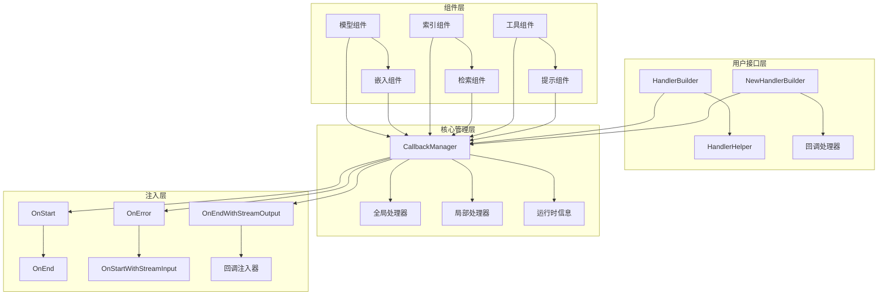
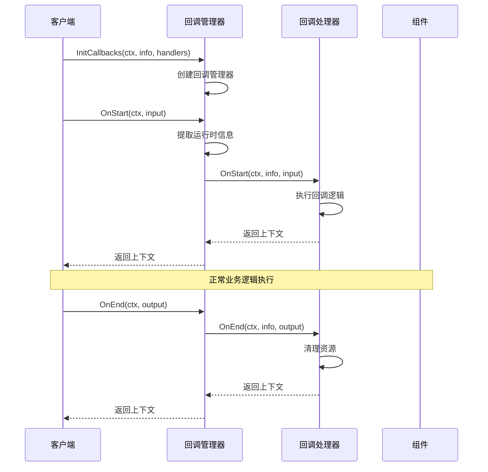
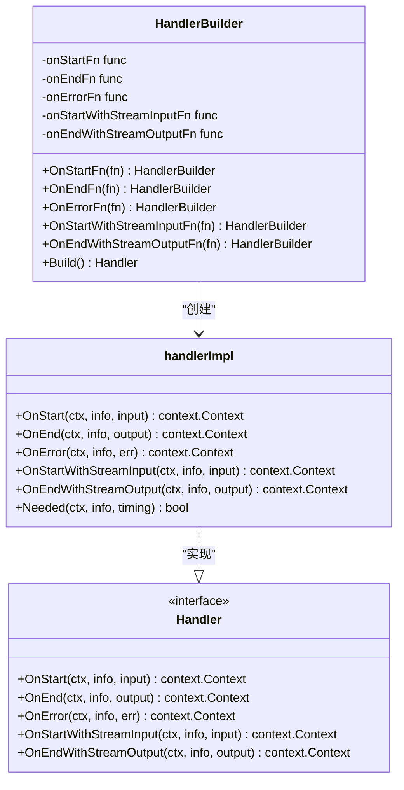
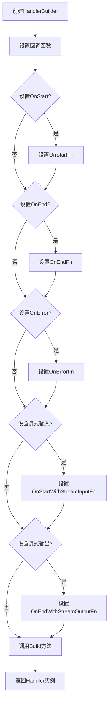
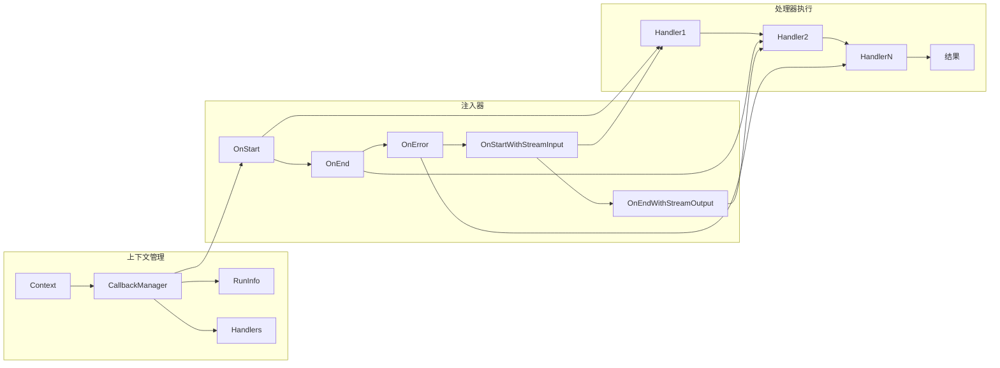

# 回调系统

<cite>
**本文档中引用的文件**
- [callbacks/interface.go](file://callbacks/interface.go)
- [callbacks/aspect_inject.go](file://callbacks/aspect_inject.go)
- [callbacks/handler_builder.go](file://callbacks/handler_builder.go)
- [internal/callbacks/inject.go](file://internal/callbacks/inject.go)
- [internal/callbacks/manager.go](file://internal/callbacks/manager.go)
- [internal/callbacks/interface.go](file://internal/callbacks/interface.go)
- [utils/callbacks/template.go](file://utils/callbacks/template.go)
- [components/model/callback_extra.go](file://components/model/callback_extra.go)
- [components/embedding/callback_extra.go](file://components/embedding/callback_extra.go)
</cite>

## 目录
1. [简介](#简介)
2. [系统架构](#系统架构)
3. [AOP设计原理](#aop设计原理)
4. [切面类型详解](#切面类型详解)
5. [处理器构建器](#处理器构建器)
6. [回调注入机制](#回调注入机制)
7. [实际应用示例](#实际应用示例)
8. [最佳实践](#最佳实践)
9. [总结](#总结)

## 简介

Eino回调系统是一个强大的面向切面编程（AOP）框架，允许开发者在不修改核心业务逻辑的情况下，向系统中注入横切关注点，如日志记录、性能监控、错误追踪等功能。该系统通过定义五种不同的切面类型，提供了灵活且可扩展的回调机制。

回调系统的核心价值在于：
- **非侵入性**：无需修改现有业务代码即可添加功能
- **模块化**：支持按需启用特定的横切功能
- **类型安全**：提供强类型的输入输出参数
- **流式处理**：支持数据流的回调处理

## 系统架构



**图表来源**
- [callbacks/handler_builder.go](file://callbacks/handler_builder.go#L25-L30)
- [internal/callbacks/manager.go](file://internal/callbacks/manager.go#L24-L28)
- [callbacks/aspect_inject.go](file://callbacks/aspect_inject.go#L54-L114)

**章节来源**
- [callbacks/interface.go](file://callbacks/interface.go#L17-L85)
- [internal/callbacks/interface.go](file://internal/callbacks/interface.go#L17-L55)

## AOP设计原理

Eino回调系统基于面向切面编程（AOP）的设计理念，将横切关注点与核心业务逻辑分离。系统通过以下机制实现AOP：

### 核心设计原则

1. **关注点分离**：将日志、监控、错误处理等横切关注点从核心业务逻辑中分离
2. **动态注入**：在运行时动态注入回调处理器，支持按需启用功能
3. **类型安全**：通过泛型和类型转换确保回调参数的类型安全
4. **流式处理**：支持数据流的回调处理，适用于实时数据处理场景

### 实现机制



**图表来源**
- [internal/callbacks/inject.go](file://internal/callbacks/inject.go#L72-L104)
- [internal/callbacks/manager.go](file://internal/callbacks/manager.go#L32-L44)

**章节来源**
- [internal/callbacks/inject.go](file://internal/callbacks/inject.go#L17-L188)
- [internal/callbacks/manager.go](file://internal/callbacks/manager.go#L17-L71)

## 切面类型详解

Eino回调系统定义了五种不同类型的切面，每种切面在不同的时机触发，为开发者提供精确的控制点。

### 切面类型枚举

| 切面类型 | 触发时机 | 参数类型 | 使用场景 |
|---------|---------|---------|---------|
| `TimingOnStart` | 组件开始执行前 | `CallbackInput` | 初始化、预处理、权限检查 |
| `TimingOnEnd` | 组件正常结束时 | `CallbackOutput` | 资源清理、结果处理、状态更新 |
| `TimingOnError` | 组件发生错误时 | `error` | 错误记录、异常处理、告警通知 |
| `TimingOnStartWithStreamInput` | 流式输入开始时 | `StreamReader[CallbackInput]` | 流式数据预处理、缓冲区初始化 |
| `TimingOnEndWithStreamOutput` | 流式输出结束时 | `StreamReader[CallbackOutput]` | 流式数据后处理、结果聚合 |

### 具体切面说明

#### 1. OnStart切面
- **触发时机**：组件开始执行前
- **用途**：初始化操作、预处理逻辑、权限验证
- **执行顺序**：反向执行（与添加顺序相反）

#### 2. OnEnd切面  
- **触发时机**：组件正常完成执行后
- **用途**：资源释放、结果处理、状态更新
- **执行顺序**：正向执行（与添加顺序相同）

#### 3. OnError切面
- **触发时机**：组件执行过程中发生错误时
- **用途**：错误记录、异常处理、恢复策略
- **执行顺序**：正向执行（与添加顺序相同）

#### 4. OnStartWithStreamInput切面
- **触发时机**：接收流式输入数据时
- **用途**：流式数据预处理、缓冲区管理
- **执行顺序**：反向执行（与添加顺序相反）

#### 5. OnEndWithStreamOutput切面
- **触发时机**：产生流式输出数据时
- **用途**：流式数据后处理、结果聚合
- **执行顺序**：正向执行（与添加顺序相同）

**章节来源**
- [callbacks/interface.go](file://callbacks/interface.go#L71-L84)
- [internal/callbacks/inject.go](file://internal/callbacks/inject.go#L107-L187)

## 处理器构建器

### HandlerBuilder架构



**图表来源**
- [callbacks/handler_builder.go](file://callbacks/handler_builder.go#L25-L124)
- [internal/callbacks/interface.go](file://internal/callbacks/interface.go#L38-L47)

### 构建器使用模式

#### 基本构建流程



**图表来源**
- [callbacks/handler_builder.go](file://callbacks/handler_builder.go#L78-L124)

**章节来源**
- [callbacks/handler_builder.go](file://callbacks/handler_builder.go#L17-L125)

## 回调注入机制

### 注入流程架构



**图表来源**
- [internal/callbacks/inject.go](file://internal/callbacks/inject.go#L27-L104)
- [internal/callbacks/manager.go](file://internal/callbacks/manager.go#L24-L28)

### 上下文传递机制

回调系统通过Context对象传递运行时信息和处理器列表，确保每个组件都能访问到相关的回调处理器。

#### 关键函数说明

| 函数名 | 功能描述 | 使用场景 |
|--------|---------|---------|
| `InitCallbacks` | 初始化回调上下文 | 应用启动时设置全局处理器 |
| `EnsureRunInfo` | 确保运行时信息存在 | 组件执行前确保上下文完整性 |
| `ReuseHandlers` | 复用现有处理器 | 子组件继承父组件的处理器配置 |
| `AppendHandlers` | 追加新处理器 | 动态添加临时处理器 |

**章节来源**
- [callbacks/aspect_inject.go](file://callbacks/aspect_inject.go#L17-L115)
- [internal/callbacks/inject.go](file://internal/callbacks/inject.go#L27-L104)

## 实际应用示例

### 日志回调处理器示例

以下是一个完整的日志回调处理器创建和注入示例：

#### 1. 创建日志处理器

```go
// 创建日志处理器构建器
loggerHandler := callbacks.NewHandlerBuilder().
    OnStartFn(func(ctx context.Context, info *callbacks.RunInfo, input callbacks.CallbackInput) context.Context {
        log.Printf("组件开始执行: %s, 类型: %s", info.Name, info.Type)
        return ctx
    }).
    OnEndFn(func(ctx context.Context, info *callbacks.RunInfo, output callbacks.CallbackOutput) context.Context {
        log.Printf("组件执行完成: %s, 类型: %s", info.Name, info.Type)
        return ctx
    }).
    OnErrorFn(func(ctx context.Context, info *callbacks.RunInfo, err error) context.Context {
        log.Printf("组件执行错误: %s, 类型: %s, 错误: %v", info.Name, info.Type, err)
        return ctx
    })
```

#### 2. 注入全局处理器

```go
// 将日志处理器添加到全局处理器列表
callbacks.AppendGlobalHandlers(loggerHandler.Build())
```

#### 3. 组件级别的处理器

```go
// 为特定组件创建专门的处理器
performanceHandler := callbacks.NewHandlerBuilder().
    OnStartFn(func(ctx context.Context, info *callbacks.RunInfo, input callbacks.CallbackInput) context.Context {
        startTime := time.Now()
        ctx = context.WithValue(ctx, "startTime", startTime)
        return ctx
    }).
    OnEndFn(func(ctx context.Context, info *callbacks.RunInfo, output callbacks.CallbackOutput) context.Context {
        if startTime, ok := ctx.Value("startTime").(time.Time); ok {
            duration := time.Since(startTime)
            log.Printf("组件执行时间: %s took %v", info.Name, duration)
        }
        return ctx
    })

// 在组件调用时注入处理器
result, err := component.Invoke(ctx, input, compose.WithCallbacks(performanceHandler.Build()))
```

### 模板处理器示例

对于复杂的多组件场景，可以使用HandlerHelper创建模板处理器：

```go
// 创建组件模板处理器
templateHandler := callbacks.NewHandlerHelper().
    ChatModel(&model.ModelCallbackHandler{
        OnStart: func(ctx context.Context, info *callbacks.RunInfo, input *model.CallbackInput) context.Context {
            log.Printf("聊天模型开始: %s", info.Name)
            return ctx
        },
        OnEnd: func(ctx context.Context, info *callbacks.RunInfo, output *model.CallbackOutput) context.Context {
            log.Printf("聊天模型结束: %s, 令牌使用: %d", info.Name, output.TokenUsage.TotalTokens)
            return ctx
        },
    }).
    Embedding(&embedding.EmbeddingCallbackHandler{
        OnStart: func(ctx context.Context, info *callbacks.RunInfo, input *embedding.CallbackInput) context.Context {
            log.Printf("嵌入开始: %d 文本", len(input.Texts))
            return ctx
        },
    }).
    Handler()
```

**章节来源**
- [utils/callbacks/template.go](file://utils/callbacks/template.go#L35-L70)
- [components/model/callback_extra.go](file://components/model/callback_extra.go#L17-L108)
- [components/embedding/callback_extra.go](file://components/embedding/callback_extra.go#L17-L98)

## 最佳实践

### 1. 处理器设计原则

- **单一职责**：每个处理器专注于一个特定的功能领域
- **幂等性**：确保处理器可以多次执行而不产生副作用
- **错误隔离**：处理器内部的错误不应影响其他处理器的执行
- **性能考虑**：避免在回调中执行耗时操作

### 2. 上下文管理

- 使用Context传递必要的元数据
- 避免在回调中修改原始输入数据
- 合理使用Context Value存储临时状态

### 3. 错误处理

- 在OnError处理器中进行适当的错误记录
- 考虑错误恢复策略
- 避免在错误处理中抛出新的错误

### 4. 性能优化

- 对于高频调用的处理器，考虑异步处理
- 使用缓冲区处理流式数据
- 合理设置处理器的执行顺序

### 5. 调试和测试

- 为每个处理器编写单元测试
- 使用日志记录处理器的执行情况
- 在开发环境中启用详细的调试信息

## 总结

Eino回调系统提供了一个强大而灵活的AOP框架，通过五种不同类型的切面，开发者可以在不修改核心业务逻辑的情况下，轻松地注入各种横切关注点。系统的设计充分考虑了类型安全、性能优化和易用性，为构建可维护和可扩展的应用程序提供了坚实的基础。

主要优势包括：
- **非侵入性设计**：保持核心业务逻辑的纯净
- **类型安全保障**：通过强类型系统防止运行时错误
- **灵活的注入机制**：支持多种注入方式和执行顺序
- **丰富的应用场景**：适用于日志记录、性能监控、错误追踪等多种需求

通过合理使用回调系统，开发者可以构建更加模块化、可维护和可扩展的应用程序，同时保持良好的开发体验。