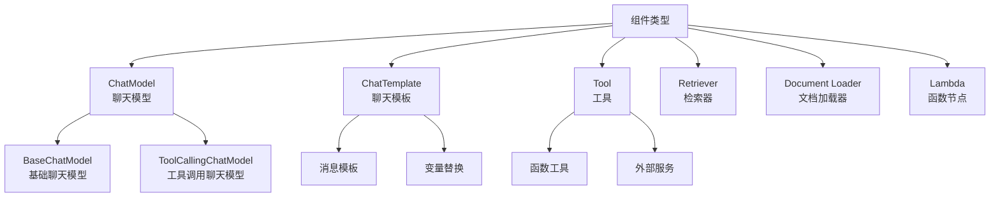
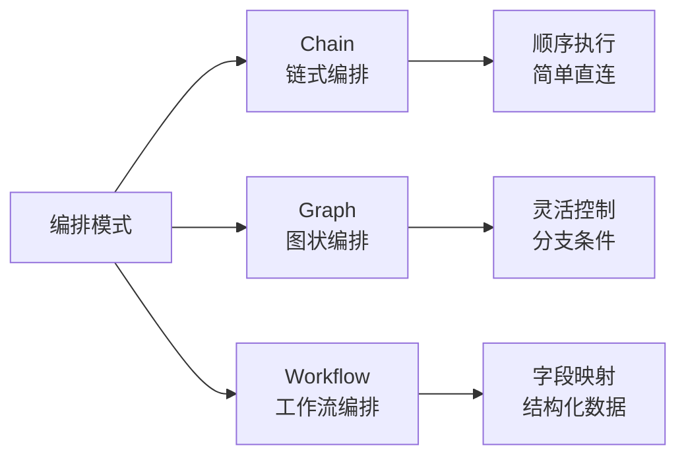

# 快速入门

<cite>
**本文档中引用的文件**
- [README.md](file://README.md)
- [go.mod](file://go.mod)
- [doc.go](file://doc.go)
- [components/model/interface.go](file://components/model/interface.go)
- [components/prompt/chat_template.go](file://components/prompt/chat_template.go)
- [compose/chain.go](file://compose/chain.go)
- [compose/graph.go](file://compose/graph.go)
- [compose/types.go](file://compose/types.go)
- [compose/error.go](file://compose/error.go)
- [compose/chain_test.go](file://compose/chain_test.go)
- [compose/graph_test.go](file://compose/graph_test.go)
</cite>

## 目录
1. [简介](#简介)
2. [环境要求](#环境要求)
3. [安装步骤](#安装步骤)
4. [核心概念](#核心概念)
5. [实践示例](#实践示例)
6. [常见错误及解决方案](#常见错误及解决方案)
7. [总结](#总结)

## 简介

Eino是一个专为Go语言设计的大型语言模型(LLM)应用开发框架，旨在简化AI应用程序的开发过程。它提供了丰富的组件抽象、强大的编排能力、完整的流处理机制以及高度可扩展的方面系统。

### 主要特性
- **丰富的组件**：封装了常见的构建块，如ChatModel、Tool、ChatTemplate等
- **强大的编排**：支持链式、图状和工作流三种编排模式
- **完整的流处理**：自动处理消息流的合并、分发和复制
- **高度可扩展**：支持回调机制处理横切关注点

## 环境要求

### Go版本要求
Eino框架需要Go 1.18或更高版本，因为框架广泛使用了Go 1.18引入的泛型特性。

**验证方法：**
```bash
go version
```

### 依赖项
框架依赖以下核心包：
- `github.com/bytedance/sonic` - 高性能JSON序列化
- `github.com/getkin/kin-openapi` - OpenAPI JSON Schema实现
- `github.com/google/uuid` - UUID生成
- `github.com/nikolalohinski/gonja` - Jinja2模板引擎
- `github.com/slongfield/pyfmt` - Python格式化字符串支持

**检查依赖：**
```bash
go mod tidy
```

## 安装步骤

### 使用go get安装
```bash
go get github.com/cloudwego/eino
```

### 验证安装
创建测试文件验证安装是否成功：

```go
package main

import (
    "fmt"
    "github.com/cloudwego/eino"
)

func main() {
    fmt.Println("Eino框架安装成功！")
}
```

运行测试：
```bash
go run main.go
```

## 核心概念

### 组件类型
Eino框架包含以下核心组件类型：



**图表来源**
- [components/model/interface.go](file://components/model/interface.go#L25-L57)
- [components/prompt/chat_template.go](file://components/prompt/chat_template.go#L27-L33)

### 编排模式
Eino提供三种主要的编排模式：



**图表来源**
- [compose/types.go](file://compose/types.go#L26-L35)

## 实践示例

### 示例1：直接调用ChatModel生成文本回复

这个示例展示了如何直接使用实现了`components/model.ChatModel`接口的模型组件生成文本回复。

#### 代码实现
```go
package main

import (
    "context"
    "fmt"
    "log"
    
    "github.com/cloudwego/eino/components/model"
    "github.com/cloudwego/eino/schema"
)

func main() {
    // 创建上下文
    ctx := context.Background()
    
    // 创建聊天模型实例（这里以模拟实现为例）
    // 在实际项目中，您需要使用具体的服务提供商实现
    chatModel := &mockChatModel{}
    
    // 准备输入消息
    messages := []*schema.Message{
        schema.SystemMessage("你是一个有用的助手。"),
        schema.UserMessage("未来的人工智能应用会是什么样子？"),
    }
    
    // 调用模型生成回复
    response, err := chatModel.Generate(ctx, messages)
    if err != nil {
        log.Fatalf("生成回复失败: %v", err)
    }
    
    // 输出结果
    fmt.Printf("模型回复: %s\n", response.Content)
}
```

#### 关键代码解释
1. **上下文管理**：使用`context.Background()`创建请求上下文
2. **消息准备**：构造系统消息和用户消息的对话历史
3. **模型调用**：通过`Generate`方法获取完整回复
4. **错误处理**：检查并处理可能的错误情况

#### 预期输出
```
模型回复: 未来的AI应用将更加智能化、个性化，并深度集成到日常生活中...
```

**章节来源**
- [components/model/interface.go](file://components/model/interface.go#L30-L34)

### 示例2：使用NewChain串联ChatTemplate和ChatModel

这个示例演示如何使用`compose.NewChain`将ChatTemplate和ChatModel串联起来，构建一个简单的提示-响应链。

#### 代码实现
```go
package main

import (
    "context"
    "fmt"
    "log"
    
    "github.com/cloudwego/eino/compose"
    "github.com/cloudwego/eino/components/model"
    "github.com/cloudwego/eino/components/prompt"
    "github.com/cloudwego/eino/schema"
)

func main() {
    // 创建上下文
    ctx := context.Background()
    
    // 创建聊天模板
    chatTemplate := prompt.FromMessages(
        schema.FString,
        schema.SystemMessage("你是一个有用的助手。"),
        schema.UserMessage("我的问题是: {{query}}"),
    )
    
    // 创建聊天模型（以模拟实现为例）
    chatModel := &mockChatModel{}
    
    // 构建链式编排
    chain := compose.NewChain[map[string]any, *schema.Message]()
    
    // 添加组件到链中
    chain.AppendChatTemplate(chatTemplate)
    chain.AppendChatModel(chatModel)
    
    // 编译链
    runnable, err := chain.Compile(ctx)
    if err != nil {
        log.Fatalf("编译链失败: %v", err)
    }
    
    // 执行链
    input := map[string]any{
        "query": "人工智能如何改变教育行业？",
    }
    
    result, err := runnable.Invoke(ctx, input)
    if err != nil {
        log.Fatalf("执行链失败: %v", err)
    }
    
    // 输出结果
    fmt.Printf("最终回复: %s\n", result.Content)
}
```

#### 关键代码解释
1. **链式构建**：使用`NewChain`创建链实例，指定输入输出类型
2. **组件添加**：通过`AppendChatTemplate`和`AppendChatModel`添加组件
3. **编译优化**：调用`Compile`方法进行类型检查和优化
4. **数据传递**：通过映射结构在组件间传递数据

#### 预期输出
```
最终回复: 人工智能正在通过个性化学习、智能辅导和自动化评估等方式深刻改变教育行业...
```

**章节来源**
- [compose/chain.go](file://compose/chain.go#L36-L45)
- [compose/chain.go](file://compose/chain.go#L165-L175)

### 示例3：使用NewGraph创建基础的有向无环图(DAG)

这个示例展示如何使用`compose.NewGraph`创建一个基础的有向无环图，演示如何添加节点和边来定义执行流程。

#### 代码实现
```go
package main

import (
    "context"
    "fmt"
    "log"
    
    "github.com/cloudwego/eino/compose"
    "github.com/cloudwego/eino/components/model"
    "github.com/cloudwego/eino/components/prompt"
    "github.com/cloudwego/eino/schema"
)

func main() {
    // 创建上下文
    ctx := context.Background()
    
    // 创建聊天模板节点
    chatTemplate := prompt.FromMessages(
        schema.FString,
        schema.SystemMessage("你是一个天气查询助手。"),
        schema.UserMessage("查询{{location}}的天气情况"),
    )
    
    // 创建聊天模型节点
    chatModel := &mockChatModel{}
    
    // 创建图形编排
    graph := compose.NewGraph[map[string]any, *schema.Message]()
    
    // 添加节点
    err := graph.AddChatTemplateNode("weather_prompt", chatTemplate)
    if err != nil {
        log.Fatalf("添加模板节点失败: %v", err)
    }
    
    err = graph.AddChatModelNode("weather_model", chatModel)
    if err != nil {
        log.Fatalf("添加模型节点失败: %v", err)
    }
    
    // 添加连接边
    err = graph.AddEdge(compose.START, "weather_prompt")
    if err != nil {
        log.Fatalf("添加起始边失败: %v", err)
    }
    
    err = graph.AddEdge("weather_prompt", "weather_model")
    if err != nil {
        log.Fatalf("添加模板到模型边失败: %v", err)
    }
    
    // 编译图形
    compiledGraph, err := graph.Compile(ctx)
    if err != nil {
        log.Fatalf("编译图形失败: %v", err)
    }
    
    // 执行图形
    input := map[string]any{
        "location": "北京",
    }
    
    result, err := compiledGraph.Invoke(ctx, input)
    if err != nil {
        log.Fatalf("执行图形失败: %v", err)
    }
    
    // 输出结果
    fmt.Printf("天气查询结果: %s\n", result.Content)
}
```

#### 关键代码解释
1. **节点创建**：使用`AddChatTemplateNode`和`AddChatModelNode`添加节点
2. **边连接**：通过`AddEdge`建立节点间的依赖关系
3. **执行流程**：图形按照预定义的依赖关系顺序执行
4. **灵活性**：相比链式编排，图形可以支持更复杂的执行模式

#### 预期输出
```
天气查询结果: 北京今天晴朗，气温15-25°C，空气质量良好...
```

**章节来源**
- [compose/graph.go](file://compose/graph.go#L36-L41)
- [compose/graph_test.go](file://compose/graph_test.go#L36-L54)

## 常见错误及解决方案

### 错误1：Go版本不兼容
**错误信息：**
```
go: module requires Go 1.18 or later
```

**原因分析：**
Eino框架使用了Go 1.18引入的泛型特性，低于1.18版本的Go无法编译该框架。

**解决方案：**
1. 升级Go版本到1.18或更高
2. 检查当前Go版本：
   ```bash
   go version
   ```
3. 下载并安装最新Go版本：https://golang.org/dl/

### 错误2：依赖未正确安装
**错误信息：**
```
cannot find package "github.com/cloudwego/eino/..."
```

**原因分析：**
可能是网络问题导致依赖下载不完整，或者代理设置有问题。

**解决方案：**
1. 清理模块缓存：
   ```bash
   go clean -modcache
   ```
2. 重新下载依赖：
   ```bash
   go mod download
   ```
3. 使用国内镜像加速（如果需要）：
   ```bash
   export GOPROXY=https://proxy.golang.org,direct
   ```

### 错误3：泛型使用错误
**错误信息：**
```
cannot use generic type without instantiation
```

**原因分析：**
在使用Eino的泛型类型时，没有正确指定类型参数。

**解决方案：**
确保在使用泛型类型时提供具体的类型参数：
```go
// 错误用法
chain := compose.NewChain()

// 正确用法
chain := compose.NewChain[map[string]any, *schema.Message]()
```

### 错误4：编译后修改链/图
**错误信息：**
```
chain has been compiled, cannot be modified
```

**原因分析：**
尝试在编译后修改已经编译的链或图。

**解决方案：**
在调用`Compile`之前完成所有配置：
```go
// 错误：先编译再添加节点
chain.Compile(ctx)
chain.AppendChatModel(model) // 这里会报错

// 正确：先添加所有节点再编译
chain.AppendChatModel(model)
chain.Compile(ctx)
```

### 错误5：类型不匹配
**错误信息：**
```
unexpected input type. expected: map[string]any, got: string
```

**原因分析：**
输入数据类型与组件期望的输入类型不匹配。

**解决方案：**
确保输入数据类型与组件定义一致：
```go
// 如果组件期望map[string]any类型
input := map[string]any{
    "query": "你的问题",
}

// 不要使用其他类型
// input := "你的问题" // 这会导致类型错误
```

### 错误6：缺少必要的节点
**错误信息：**
```
start node not set
```

**原因分析：**
图形编排中没有设置起始节点。

**解决方案：**
确保添加至少一个起始节点：
```go
// 正确：添加起始节点
graph.AddLambdaNode("start_node", lambdaFunc)
graph.AddEdge(compose.START, "start_node")
```

## 总结

本快速入门指南涵盖了Eino框架的核心功能和使用方法：

### 学习要点
1. **环境准备**：确保Go 1.18+环境和正确的依赖配置
2. **基础组件**：理解ChatModel、ChatTemplate等核心组件
3. **编排模式**：掌握Chain、Graph、Workflow三种编排方式
4. **实践应用**：通过三个循序渐进的示例掌握框架使用

### 进阶方向
- 探索更复杂的编排场景
- 学习自定义组件开发
- 深入了解流处理机制
- 掌握回调和中间件系统

### 最佳实践
- 在编译前完成所有配置
- 使用适当的错误处理机制
- 合理选择编排模式
- 注重类型安全和代码可读性

通过本指南的学习，您应该能够快速上手Eino框架，并开始构建自己的AI应用程序。随着实践的深入，您可以探索更多高级特性和最佳实践。