# 回调切面类型

<cite>
**本文档中引用的文件**
- [callbacks/interface.go](file://callbacks/interface.go)
- [internal/callbacks/interface.go](file://internal/callbacks/interface.go)
- [utils/callbacks/template.go](file://utils/callbacks/template.go)
- [adk/chatmodel.go](file://adk/chatmodel.go)
- [adk/interface.go](file://adk/interface.go)
- [components/tool/callback_extra.go](file://components/tool/callback_extra.go)
- [components/model/callback_extra.go](file://components/model/callback_extra.go)
- [internal/callbacks/manager.go](file://internal/callbacks/manager.go)
- [internal/callbacks/inject.go](file://internal/callbacks/inject.go)
- [callbacks/aspect_inject.go](file://callbacks/aspect_inject.go)
- [callbacks/handler_builder.go](file://callbacks/handler_builder.go)
</cite>

## 目录
1. [概述](#概述)
2. [回调系统架构](#回调系统架构)
3. [五种核心切面详解](#五种核心切面详解)
4. [RunInfo结构与执行上下文](#runinfo结构与执行上下文)
5. [切面使用示例](#切面使用示例)
6. [切面执行顺序与生命周期](#切面执行顺序与生命周期)
7. [最佳实践与注意事项](#最佳实践与注意事项)

## 概述

Eino回调系统是一个强大的事件驱动架构，提供了五个核心切面来监控和控制组件的执行过程。这些切面允许开发者在组件生命周期的关键节点插入自定义逻辑，实现日志记录、性能监控、错误处理等功能。

回调系统的核心设计理念是：
- **非侵入性**：通过切面模式实现功能扩展，不改变原有组件代码
- **灵活性**：支持多种切面类型，适应不同的监控需求
- **可组合性**：多个回调处理器可以协同工作
- **类型安全**：提供强类型的输入输出参数

## 回调系统架构

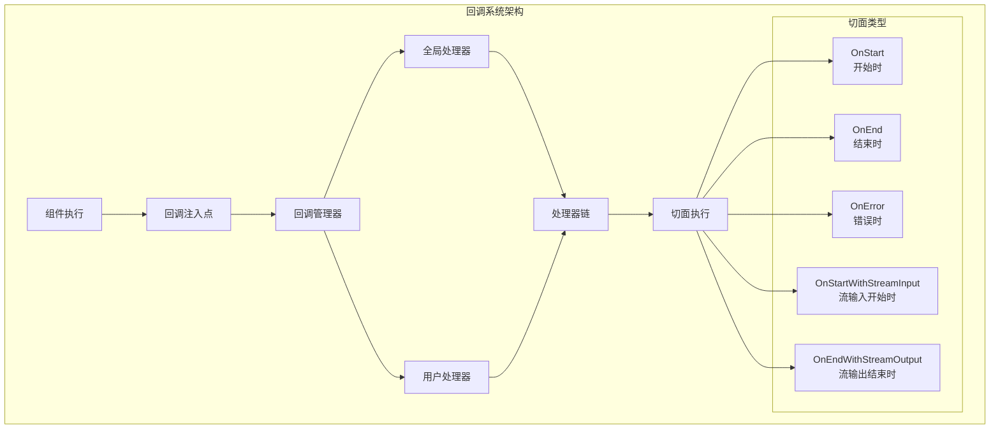

**图表来源**
- [internal/callbacks/interface.go](file://internal/callbacks/interface.go#L38-L48)
- [internal/callbacks/manager.go](file://internal/callbacks/manager.go#L24-L44)

**章节来源**
- [internal/callbacks/interface.go](file://internal/callbacks/interface.go#L38-L48)
- [callbacks/interface.go](file://callbacks/interface.go#L50-L85)

## 五种核心切面详解

### 1. OnStart - 组件开始执行时

**触发时机**：当组件开始执行其主要逻辑之前

**典型应用场景**：
- 记录组件启动时间
- 初始化执行上下文
- 设置环境变量
- 启动性能监控
- 验证输入参数

**函数签名**：
```go
OnStart(ctx context.Context, info *RunInfo, input CallbackInput) context.Context
```

**处理流程**：
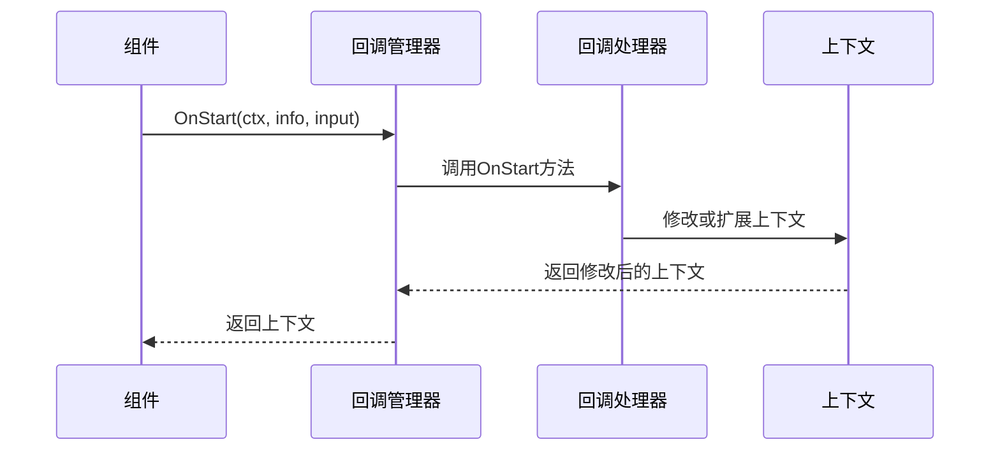

**图表来源**
- [internal/callbacks/inject.go](file://internal/callbacks/inject.go#L44-L94)
- [callbacks/aspect_inject.go](file://callbacks/aspect_inject.go#L42-L77)

### 2. OnEnd - 组件正常结束时

**触发时机**：当组件成功完成其主要逻辑之后

**典型应用场景**：
- 收集执行结果
- 计算性能指标
- 清理资源
- 发送通知
- 更新统计数据

**函数签名**：
```go
OnEnd(ctx context.Context, info *RunInfo, output CallbackOutput) context.Context
```

**处理流程**：
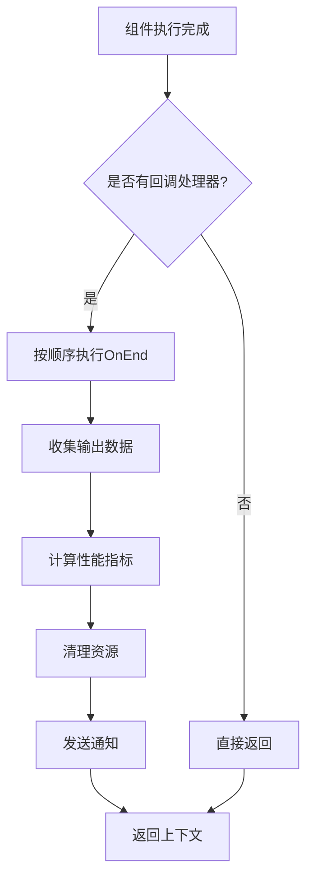

**图表来源**
- [internal/callbacks/inject.go](file://internal/callbacks/inject.go#L44-L94)
- [callbacks/aspect_inject.go](file://callbacks/aspect_inject.go#L42-L77)

### 3. OnError - 组件发生错误时

**触发时机**：当组件执行过程中发生异常或错误时

**典型应用场景**：
- 错误捕获和记录
- 发送告警通知
- 执行错误恢复逻辑
- 清理失败状态
- 错误统计分析

**函数签名**：
```go
OnError(ctx context.Context, info *RunInfo, err error) context.Context
```

**错误处理策略**：
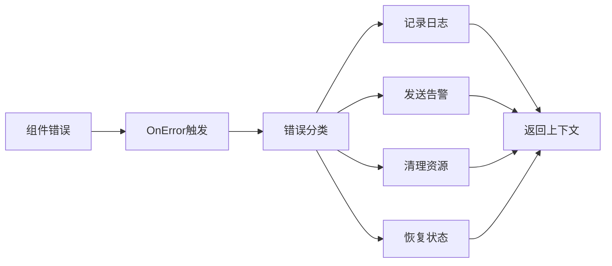

**图表来源**
- [internal/callbacks/inject.go](file://internal/callbacks/inject.go#L44-L94)
- [callbacks/aspect_inject.go](file://callbacks/aspect_inject.go#L42-L77)

### 4. OnStartWithStreamInput - 流式输入开始时

**触发时机**：当组件接收流式输入数据时

**适用组件**：主要用于接收流式输入的组件

**典型应用场景**：
- 监控流式输入进度
- 处理流式数据分块
- 实现流式输入验证
- 记录流式传输统计

**函数签名**：
```go
OnStartWithStreamInput(ctx context.Context, info *RunInfo, 
    input *schema.StreamReader[CallbackInput]) context.Context
```

**流式处理流程**：
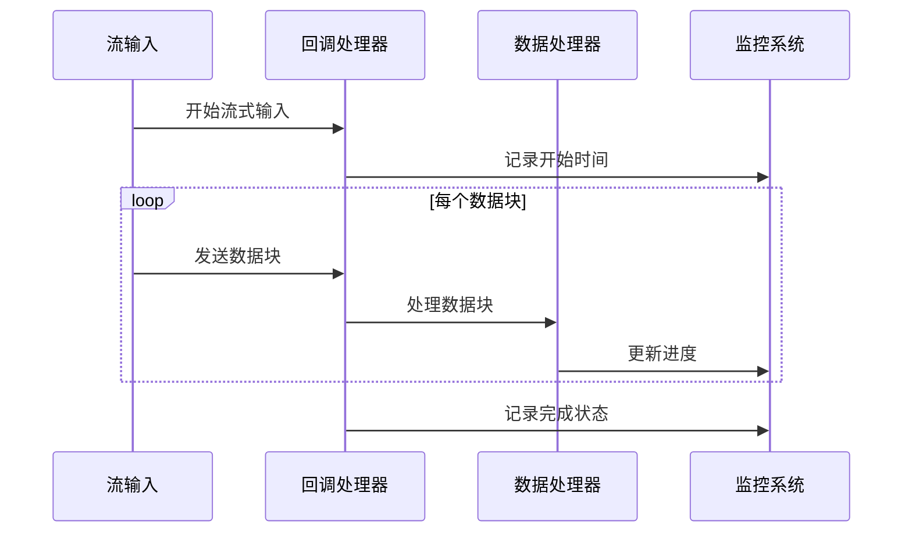

**图表来源**
- [internal/callbacks/inject.go](file://internal/callbacks/inject.go#L139-L187)
- [callbacks/aspect_inject.go](file://callbacks/aspect_inject.go#L76-L103)

### 5. OnEndWithStreamOutput - 流式输出结束时

**触发时机**：当组件产生流式输出数据时

**适用组件**：主要用于产生流式输出的组件

**典型应用场景**：
- 监控流式输出进度
- 处理流式输出分块
- 实现流式输出验证
- 记录流式传输统计

**函数签名**：
```go
OnEndWithStreamOutput(ctx context.Context, info *RunInfo, 
    output *schema.StreamReader[CallbackOutput]) context.Context
```

**流式输出处理**：
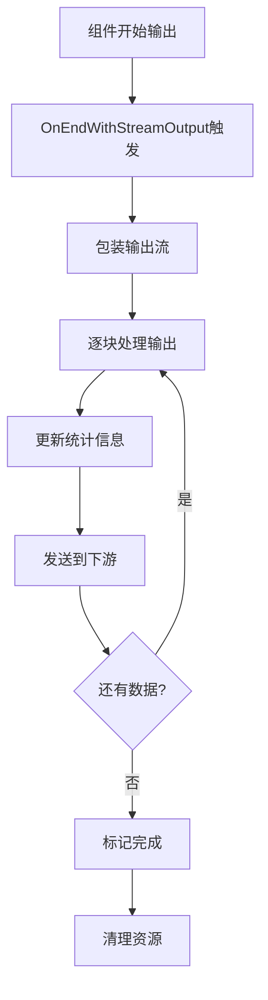

**图表来源**
- [internal/callbacks/inject.go](file://internal/callbacks/inject.go#L139-L187)
- [callbacks/aspect_inject.go](file://callbacks/aspect_inject.go#L76-L103)

**章节来源**
- [internal/callbacks/interface.go](file://internal/callbacks/interface.go#L38-L48)
- [callbacks/interface.go](file://callbacks/interface.go#L71-L85)

## RunInfo结构与执行上下文

### RunInfo结构详解

RunInfo是回调系统中的核心数据结构，包含了组件执行的基本信息：

```go
type RunInfo struct {
    // Name是显示用途的图形节点名称，不是唯一的
    // 由compose.WithNodeName()传递
    Name      string
    Type      string
    Component components.Component
}
```

### 关键字段说明

| 字段 | 类型 | 描述 | 典型值 |
|------|------|------|--------|
| Name | string | 图形节点名称，用于显示和调试 | "chat_model_1", "tool_calculator" |
| Type | string | 组件类型标识符 | "ChatModel", "Tool", "Embedding" |
| Component | Component | 组件类型枚举值 | components.ComponentOfChatModel |

### 执行上下文获取

回调处理器可以通过以下方式获取执行上下文信息：

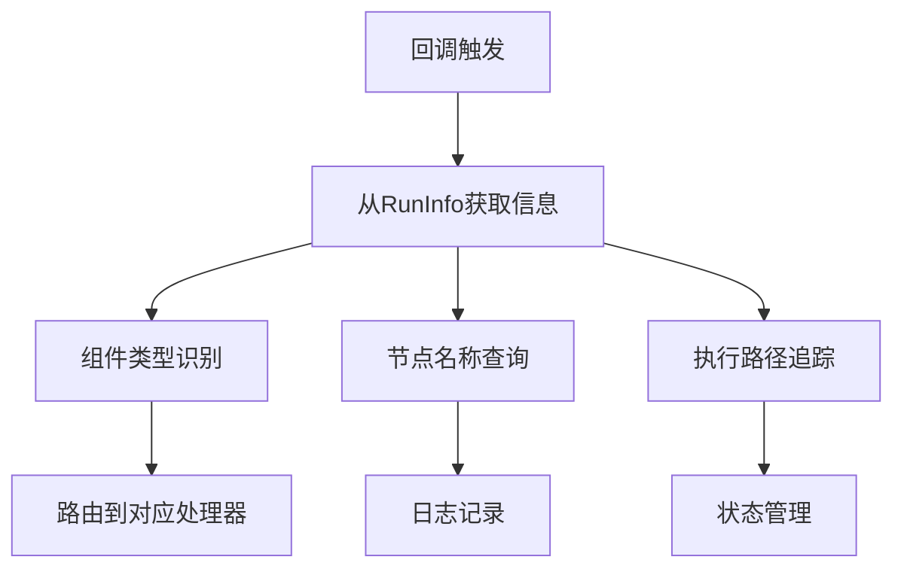

**图表来源**
- [internal/callbacks/interface.go](file://internal/callbacks/interface.go#L26-L32)

### 上下文传递机制

回调系统通过Context对象传递执行上下文：

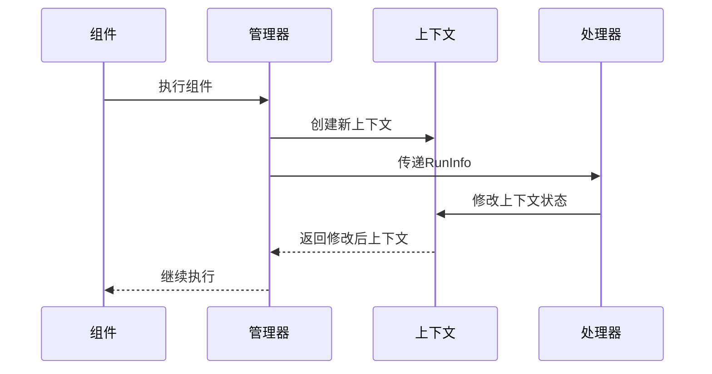

**图表来源**
- [internal/callbacks/manager.go](file://internal/callbacks/manager.go#L47-L71)

**章节来源**
- [internal/callbacks/interface.go](file://internal/callbacks/interface.go#L26-L32)
- [internal/callbacks/manager.go](file://internal/callbacks/manager.go#L24-L71)

## 切面使用示例

### ChatModel组件切面示例

以ChatModel组件为例，展示如何为不同类型的操作添加回调：

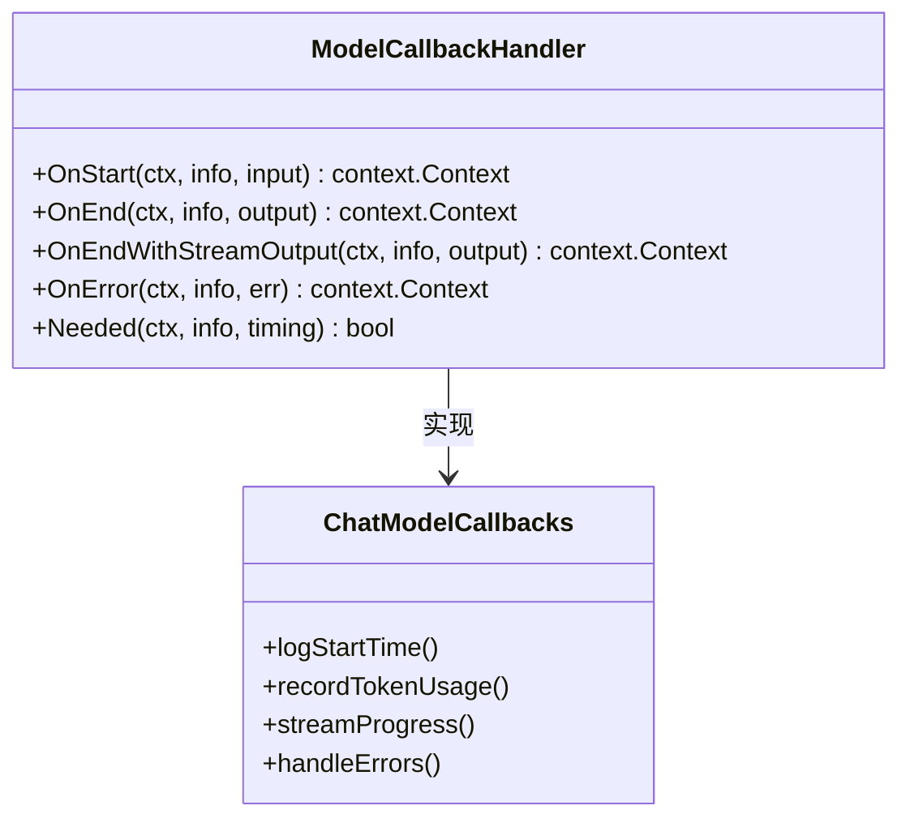

**图表来源**
- [utils/callbacks/template.go](file://utils/callbacks/template.go#L428-L450)
- [adk/chatmodel.go](file://adk/chatmodel.go#L467-L479)

### Tool组件切面示例

Tool组件的回调处理需要考虑同步和异步两种模式：

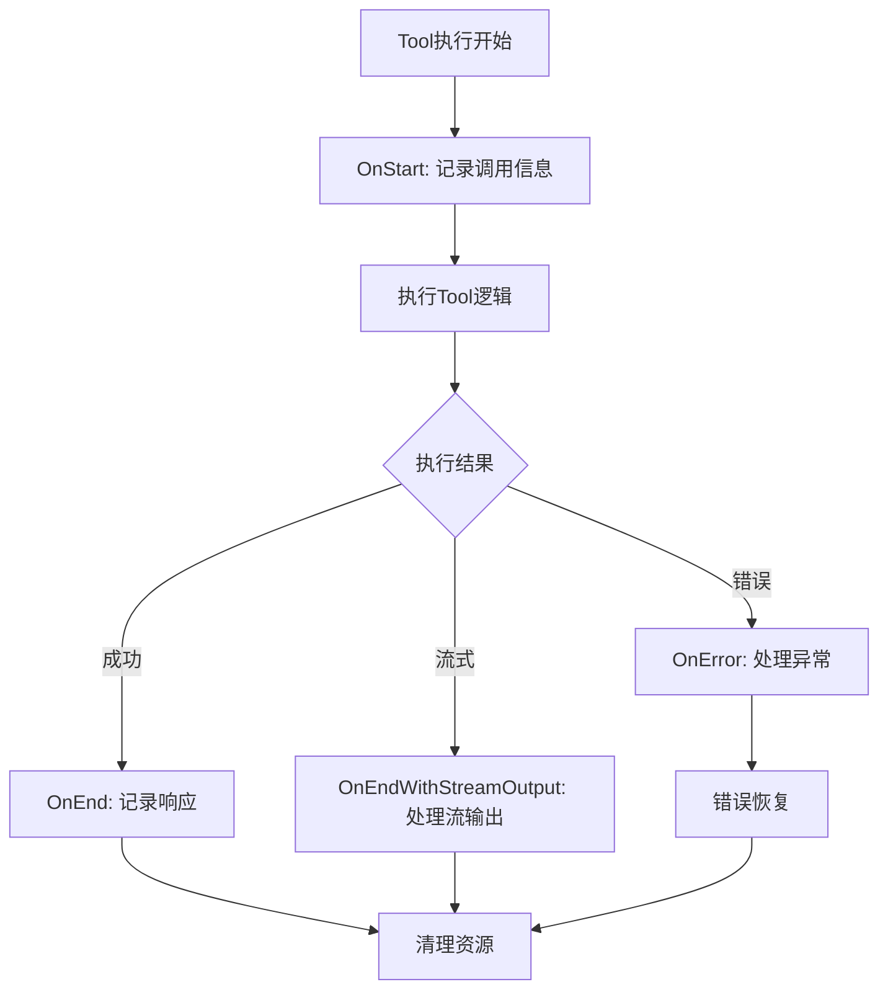

**图表来源**
- [utils/callbacks/template.go](file://utils/callbacks/template.go#L500-L522)
- [components/tool/callback_extra.go](file://components/tool/callback_extra.go#L23-L62)

### 全局处理器配置

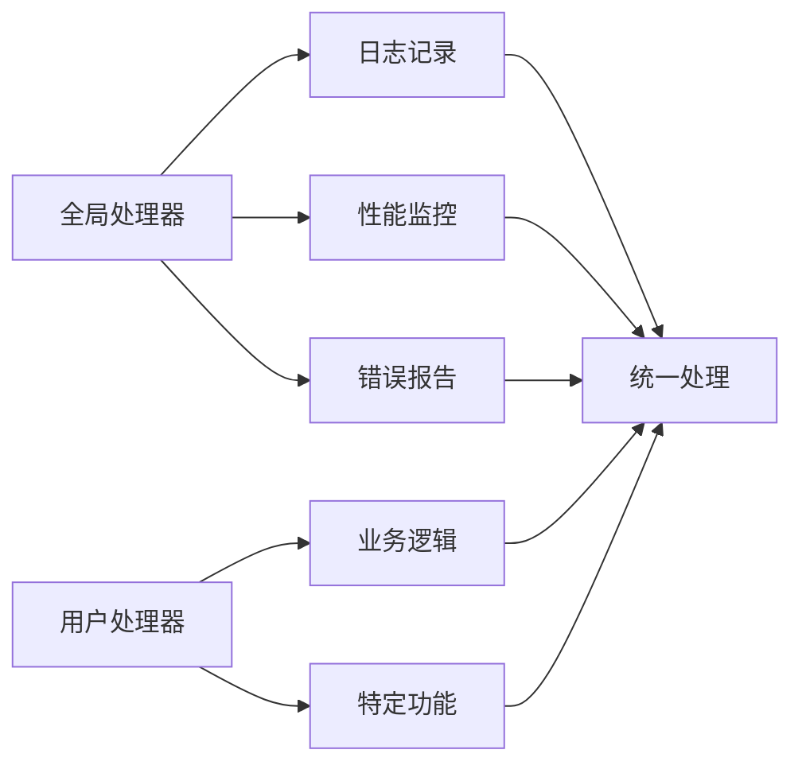

**图表来源**
- [callbacks/interface.go](file://callbacks/interface.go#L56-L85)

**章节来源**
- [adk/chatmodel.go](file://adk/chatmodel.go#L467-L481)
- [utils/callbacks/template.go](file://utils/callbacks/template.go#L428-L522)

## 切面执行顺序与生命周期

### 执行顺序规则

回调系统的执行遵循严格的顺序规则：

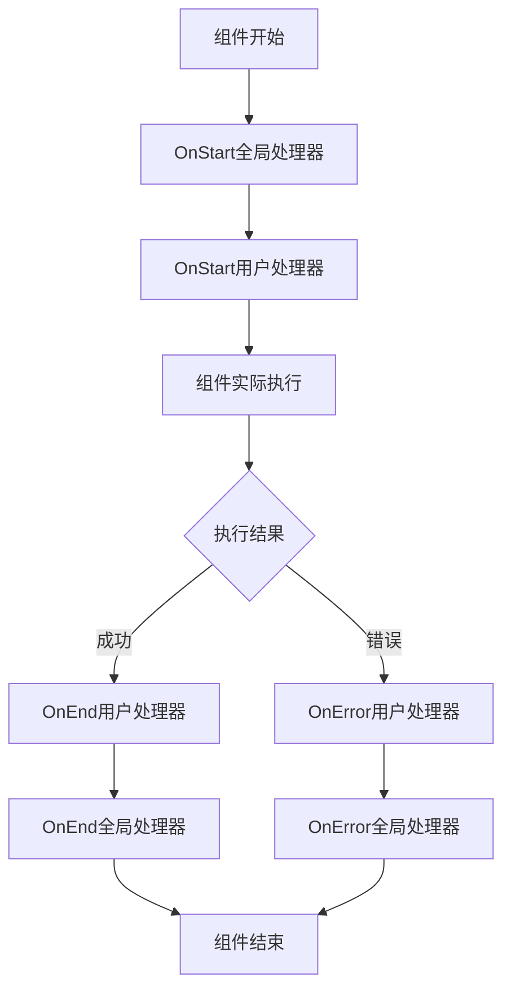

**图表来源**
- [internal/callbacks/inject.go](file://internal/callbacks/inject.go#L44-L94)
- [callbacks/aspect_inject.go](file://callbacks/aspect_inject.go#L42-L103)

### 生命周期管理

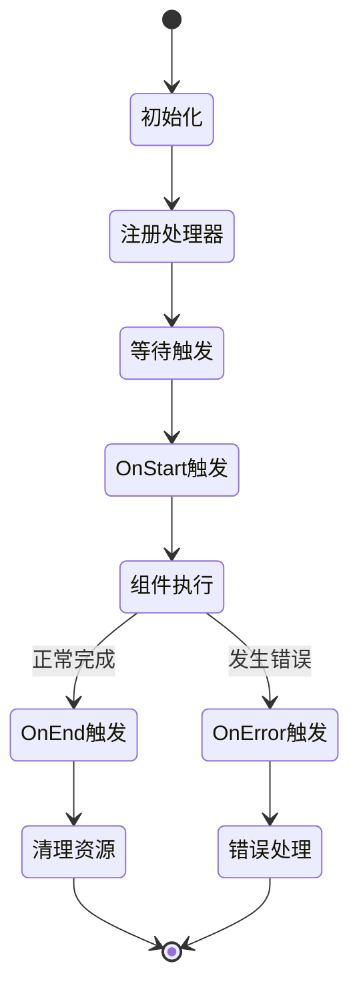

### TimingChecker接口

为了优化性能，回调系统提供了TimingChecker接口来判断是否需要执行特定切面：

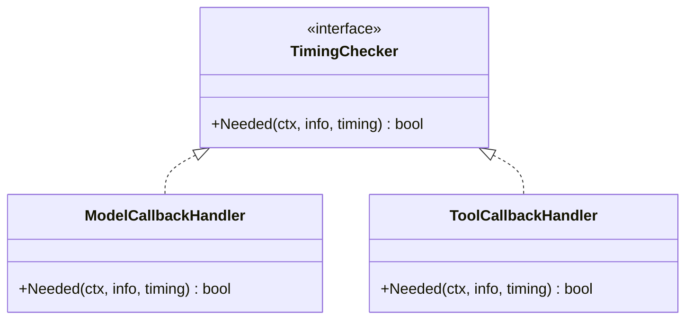

**图表来源**
- [internal/callbacks/interface.go](file://internal/callbacks/interface.go#L52-L55)
- [utils/callbacks/template.go](file://utils/callbacks/template.go#L436-L449)

**章节来源**
- [internal/callbacks/inject.go](file://internal/callbacks/inject.go#L44-L187)
- [callbacks/aspect_inject.go](file://callbacks/aspect_inject.go#L42-L103)

## 最佳实践与注意事项

### 性能优化建议

1. **合理使用TimingChecker**：实现Needed方法来避免不必要的回调执行
2. **及时清理资源**：在OnError中确保资源正确释放
3. **避免阻塞操作**：回调处理器应尽量保持轻量级

### 错误处理策略

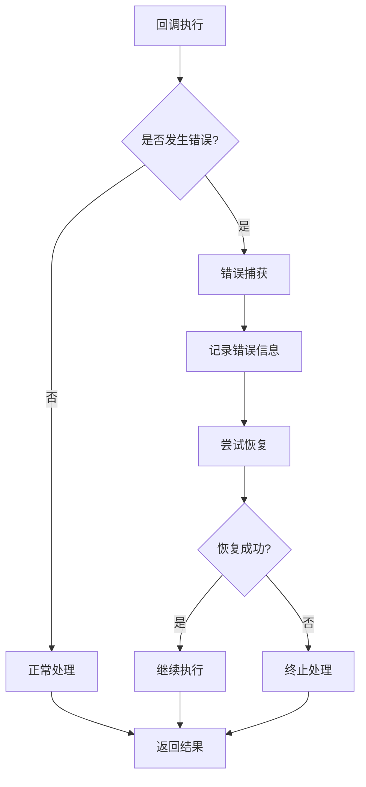

### 并发安全考虑

- 回调处理器应该是并发安全的
- 避免在回调中进行长时间的同步操作
- 使用适当的锁机制保护共享资源

### 调试和监控

推荐的监控指标包括：
- 回调执行时间
- 成功/失败率
- 错误类型分布
- 资源使用情况

通过合理设计回调系统，可以实现对Eino应用的全面监控和控制，提高系统的可观测性和可靠性。