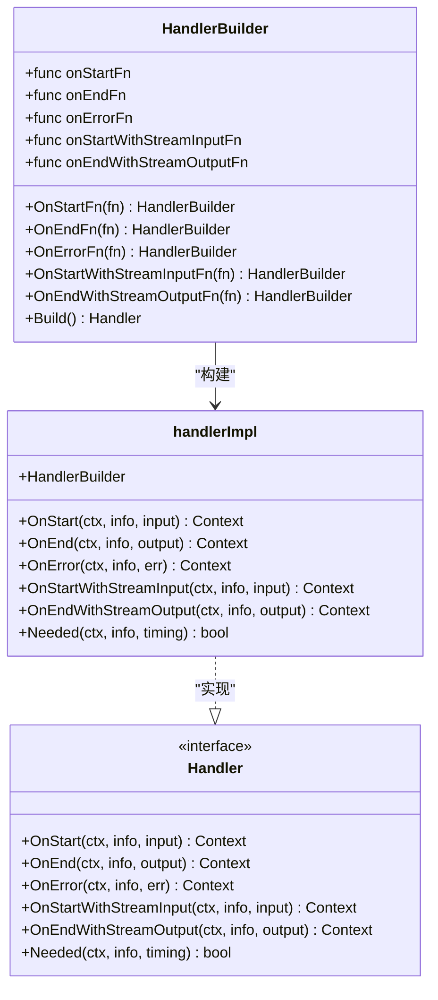
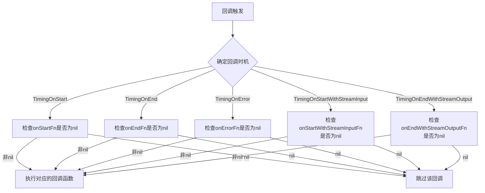
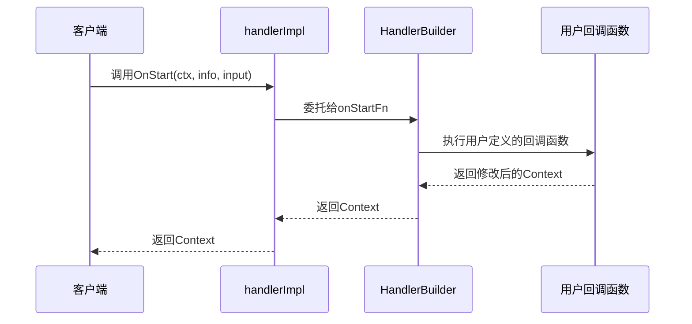
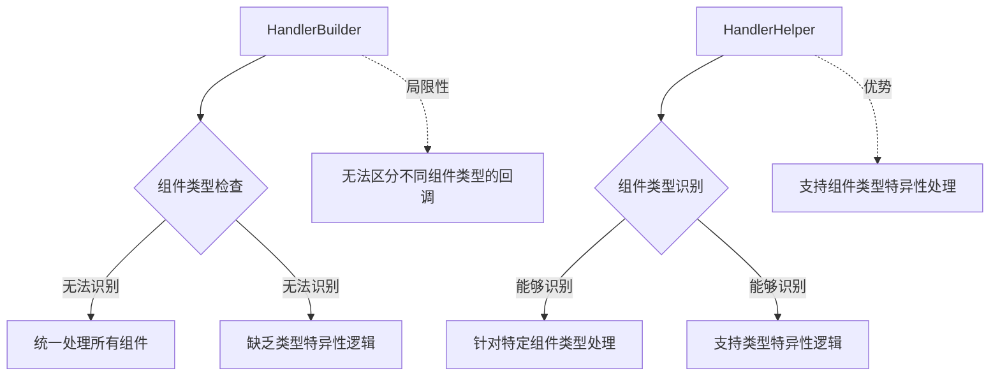

# HandlerBuilder详解

<cite>
**本文档中引用的文件**
- [handler_builder.go](file://callbacks/handler_builder.go)
- [interface.go](file://callbacks/interface.go)
- [manager.go](file://internal/callbacks/manager.go)
- [inject.go](file://internal/callbacks/inject.go)
- [aspect_inject.go](file://callbacks/aspect_inject.go)
- [template.go](file://utils/callbacks/template.go)
- [interface_test.go](file://callbacks/interface_test.go)
</cite>

## 目录
1. [简介](#简介)
2. [核心架构概述](#核心架构概述)
3. [HandlerBuilder结构详解](#handlerbuilder结构详解)
4. [回调切面映射机制](#回调切面映射机制)
5. [handlerImpl实现机制](#handlerimpl实现机制)
6. [链式调用配置模式](#链式调用配置模式)
7. [实际应用场景](#实际应用场景)
8. [最佳实践指南](#最佳实践指南)
9. [局限性分析](#局限性分析)
10. [总结](#总结)

## 简介

HandlerBuilder是Eino框架中用于构建回调处理器的核心工具，它采用建造者模式提供了灵活且可配置的回调函数组合能力。通过HandlerBuilder，开发者可以轻松地为不同的回调时机配置相应的处理函数，从而实现对系统行为的精细化控制。

该构建器支持五种主要的回调切面：OnStart（开始时）、OnEnd（结束时）、OnError（错误时）、OnStartWithStreamInput（流输入开始时）和OnEndWithStreamOutput（流输出结束时），每种切面对应特定的业务场景和处理需求。

## 核心架构概述

HandlerBuilder的设计遵循了清晰的分层架构，主要包含以下核心组件：



**图表来源**
- [handler_builder.go](file://callbacks/handler_builder.go#L25-L31)
- [handler_builder.go](file://callbacks/handler_builder.go#L33-L77)

**章节来源**
- [handler_builder.go](file://callbacks/handler_builder.go#L1-L125)

## HandlerBuilder结构详解

HandlerBuilder结构体是整个回调处理器构建系统的核心，它包含了五个关键的回调函数字段，每个字段都对应着特定的回调时机：

### 内部字段定义

| 字段名称 | 类型 | 描述 | 对应回调时机 |
|---------|------|------|-------------|
| onStartFn | `func(ctx, info, input) context.Context` | 开始时回调函数 | OnStart |
| onEndFn | `func(ctx, info, output) context.Context` | 结束时回调函数 | OnEnd |
| onErrorFn | `func(ctx, info, err) context.Context` | 错误时回调函数 | OnError |
| onStartWithStreamInputFn | `func(ctx, info, input) context.Context` | 流输入开始时回调函数 | OnStartWithStreamInput |
| onEndWithStreamOutputFn | `func(ctx, info, output) context.Context` | 流输出结束时回调函数 | OnEndWithStreamOutput |

### 构造函数设计

HandlerBuilder提供了简洁的构造函数`NewHandlerBuilder()`，它返回一个新的空实例，允许开发者通过链式调用逐步配置各个回调函数。这种设计模式具有以下优势：

- **零配置初始化**：默认情况下所有回调函数都为nil，表示不启用任何回调
- **渐进式配置**：开发者可以根据需要选择性地设置特定的回调函数
- **类型安全**：每个回调函数都有明确的参数类型和返回值要求

**章节来源**
- [handler_builder.go](file://callbacks/handler_builder.go#L25-L31)
- [handler_builder.go](file://callbacks/handler_builder.go#L78-L82)

## 回调切面映射机制

HandlerBuilder通过巧妙的设计实现了五种回调切面与内部字段的精确映射。这种映射不仅保证了功能的完整性，还提供了高效的条件判断机制。

### 映射关系图



**图表来源**
- [handler_builder.go](file://callbacks/handler_builder.go#L61-L77)

### 条件判断逻辑

HandlerBuilder的`Needed`方法实现了智能的条件判断逻辑，它根据当前的回调时机动态决定是否需要执行相应的回调函数。这种设计有以下几个特点：

1. **性能优化**：避免不必要的回调函数调用，减少系统开销
2. **资源节约**：只执行真正需要的回调逻辑
3. **灵活性**：支持按需配置，无需为每个回调时机都提供处理函数

**章节来源**
- [handler_builder.go](file://callbacks/handler_builder.go#L61-L77)

## handlerImpl实现机制

handlerImpl结构体是HandlerBuilder的具体实现，它通过嵌入HandlerBuilder的方式实现了Handler接口的所有方法。这种设计体现了组合优于继承的设计原则。

### 方法实现策略

handlerImpl的方法实现采用了直接委托的策略，即将回调请求直接转发给对应的HandlerBuilder字段：



**图表来源**
- [handler_builder.go](file://callbacks/handler_builder.go#L37-L59)

### 接口实现完整性

handlerImpl完整实现了Handler接口的所有方法，包括：

- **标准回调方法**：OnStart、OnEnd、OnError
- **流式回调方法**：OnStartWithStreamInput、OnEndWithStreamOutput
- **条件判断方法**：Needed

这种完整性确保了handlerImpl可以作为完整的回调处理器被系统使用。

**章节来源**
- [handler_builder.go](file://callbacks/handler_builder.go#L33-L77)

## 链式调用配置模式

HandlerBuilder采用了经典的链式调用模式，使得回调函数的配置过程既直观又高效。每个配置方法都返回自身的指针，支持连续调用。

### 配置流程图

```mermaid
flowchart LR
A[NewHandlerBuilder] --> B[OnStartFn]
B --> C[OnEndFn]
C --> D[OnErrorFn]
D --> E[OnStartWithStreamInputFn]
E --> F[OnEndWithStreamOutputFn]
F --> G[Build]
G --> H[Handler实例]
subgraph "链式调用示例"
I[NewHandlerBuilder()<br/>.OnStartFn(startFunc)<br/>.OnEndFn(endFunc)<br/>.Build()]
end
```

**图表来源**
- [handler_builder.go](file://callbacks/handler_builder.go#L84-L124)

### 配置方法详解

每个配置方法都遵循相同的模式：

1. **接收回调函数**：接受符合特定签名的函数作为参数
2. **赋值存储**：将函数赋值给对应的HandlerBuilder字段
3. **返回自身**：返回HandlerBuilder实例以支持链式调用

这种设计模式的优势包括：

- **语法简洁**：一行代码即可完成多个回调函数的配置
- **语义清晰**：每个方法都有明确的配置意图
- **类型安全**：编译器会检查函数签名的正确性

**章节来源**
- [handler_builder.go](file://callbacks/handler_builder.go#L84-L124)

## 实际应用场景

HandlerBuilder在实际开发中有广泛的应用场景，特别是在需要全局性、通用型回调处理的场景中表现出色。

### 日志记录处理器示例

以下是一个典型的日志记录处理器的实现示例：

```go
// 创建日志记录处理器
loggerHandler := callbacks.NewHandlerBuilder().
    OnStartFn(func(ctx context.Context, info *callbacks.RunInfo, input callbacks.CallbackInput) context.Context {
        // 记录开始时间
        startTime := time.Now()
        log.Printf("组件 %s 开始执行，类型: %s", info.Name, info.Type)
        return context.WithValue(ctx, "startTime", startTime)
    }).
    OnEndFn(func(ctx context.Context, info *callbacks.RunInfo, output callbacks.CallbackOutput) context.Context {
        // 计算执行时间
        if startTime, ok := ctx.Value("startTime").(time.Time); ok {
            duration := time.Since(startTime)
            log.Printf("组件 %s 执行完成，耗时: %v", info.Name, duration)
        }
        return ctx
    }).
    OnErrorFn(func(ctx context.Context, info *callbacks.RunInfo, err error) context.Context {
        // 记录错误信息
        log.Printf("组件 %s 发生错误: %v", info.Name, err)
        return ctx
    }).
    Build()
```

### OpenTelemetry追踪处理器示例

另一个重要的应用场景是集成OpenTelemetry进行分布式追踪：

```go
// 创建OpenTelemetry追踪处理器
otelHandler := callbacks.NewHandlerBuilder().
    OnStartFn(func(ctx context.Context, info *callbacks.RunInfo, input callbacks.CallbackInput) context.Context {
        // 创建span
        ctx, span := otel.Tracer("eino").Start(ctx, info.Name)
        span.SetAttributes(
            attribute.String("component.type", info.Type),
            attribute.String("component.name", info.Name),
        )
        return ctx
    }).
    OnEndFn(func(ctx context.Context, info *callbacks.RunInfo, output callbacks.CallbackOutput) context.Context {
        // 结束span
        if span := trace.SpanFromContext(ctx); span != nil {
            span.SetStatus(codes.Ok, "success")
            span.End()
        }
        return ctx
    }).
    OnErrorFn(func(ctx context.Context, info *callbacks.RunInfo, err error) context.Context {
        // 设置错误状态
        if span := trace.SpanFromContext(ctx); span != nil {
            span.RecordError(err)
            span.SetStatus(codes.Error, err.Error())
            span.End()
        }
        return ctx
    }).
    Build()
```

### 全局处理器注册

HandlerBuilder特别适合用于注册全局性的回调处理器：

```go
// 注册全局日志处理器
callbacks.AppendGlobalHandlers(loggerHandler)

// 注册全局追踪处理器  
callbacks.AppendGlobalHandlers(otelHandler)
```

**章节来源**
- [interface_test.go](file://callbacks/interface_test.go#L25-L56)

## 最佳实践指南

基于HandlerBuilder的设计原理和实际应用经验，以下是推荐的最佳实践：

### 1. 渐进式配置策略

不要一次性配置所有回调函数，而是根据实际需求逐步添加：

```go
// 推荐：按需配置
handler := callbacks.NewHandlerBuilder()
if enableLogging {
    handler = handler.OnStartFn(logStart).OnEndFn(logEnd)
}
if enableTracing {
    handler = handler.OnStartFn(traceStart).OnErrorFn(traceError)
}
finalHandler := handler.Build()
```

### 2. 错误处理最佳实践

在回调函数中妥善处理可能出现的错误：

```go
handler := callbacks.NewHandlerBuilder().
    OnStartFn(func(ctx context.Context, info *callbacks.RunInfo, input callbacks.CallbackInput) context.Context {
        defer func() {
            if r := recover(); r != nil {
                log.Printf("回调函数发生panic: %v", r)
            }
        }()
        // 正常业务逻辑
        return ctx
    }).
    Build()
```

### 3. 上下文传递优化

合理利用上下文传递数据，避免重复计算：

```go
handler := callbacks.NewHandlerBuilder().
    OnStartFn(func(ctx context.Context, info *callbacks.RunInfo, input callbacks.CallbackInput) context.Context {
        // 在开始时计算并缓存结果
        expensiveData := computeExpensiveData(input)
        return context.WithValue(ctx, "expensiveData", expensiveData)
    }).
    OnEndFn(func(ctx context.Context, info *callbacks.RunInfo, output callbacks.CallbackOutput) context.Context {
        // 在结束时访问缓存的数据
        if data := ctx.Value("expensiveData"); data != nil {
            // 使用缓存数据
        }
        return ctx
    }).
    Build()
```

### 4. 性能考虑

对于高频调用的回调，要注意性能优化：

- 避免在回调函数中进行重量级操作
- 合理使用异步处理
- 考虑回调函数的执行顺序对性能的影响

**章节来源**
- [template.go](file://utils/callbacks/template.go#L35-L71)

## 局限性分析

尽管HandlerBuilder提供了强大的回调处理能力，但在某些场景下存在一定的局限性：

### 组件类型特异性处理的不足

HandlerBuilder作为一个通用的回调处理器构建器，在处理组件类型特异性回调时存在局限性：



**图表来源**
- [template.go](file://utils/callbacks/template.go#L45-L71)

### 主要局限性

1. **组件类型感知缺失**：HandlerBuilder无法自动识别回调发生的具体组件类型
2. **类型特异性处理困难**：难以针对不同组件类型提供专门的处理逻辑
3. **运行时类型转换复杂**：需要手动进行类型转换和验证
4. **扩展性限制**：对于新增的组件类型需要额外的适配工作

### 解决方案建议

针对上述局限性，可以考虑使用HandlerHelper配合HandlerBuilder的方式：

```go
// 使用HandlerHelper结合HandlerBuilder
helper := callbacks.NewHandlerHelper().
    ChatModel(chatModelHandler).
    Embedding(embeddingHandler).
    Build()
```

这种方式既保留了HandlerBuilder的灵活性，又获得了HandlerHelper的组件类型感知能力。

**章节来源**
- [template.go](file://utils/callbacks/template.go#L45-L131)

## 总结

HandlerBuilder作为Eino框架中的核心回调处理器构建器，通过精心设计的架构和灵活的配置机制，为开发者提供了强大而易用的回调处理能力。其主要特点包括：

### 核心优势

1. **简洁的API设计**：采用链式调用模式，配置过程直观高效
2. **完整的回调覆盖**：支持五种主要的回调切面，满足各种业务需求
3. **智能的条件判断**：通过Needed方法实现按需执行，提升系统性能
4. **良好的扩展性**：支持全局处理器注册，便于统一管理

### 应用场景

HandlerBuilder特别适用于以下场景：
- 全局性的日志记录和监控
- 分布式追踪和性能分析
- 统一的错误处理和恢复
- 跨组件的通用业务逻辑

### 设计理念

HandlerBuilder体现了现代软件设计中的几个重要理念：
- **单一职责原则**：专注于回调处理器的构建
- **开闭原则**：对扩展开放，对修改封闭
- **组合优于继承**：通过组合实现功能复用
- **接口隔离原则**：提供最小化的接口契约

通过深入理解和合理运用HandlerBuilder，开发者可以构建出更加健壮、可维护和高性能的回调处理系统，为应用程序的可观测性和可靠性提供有力保障。