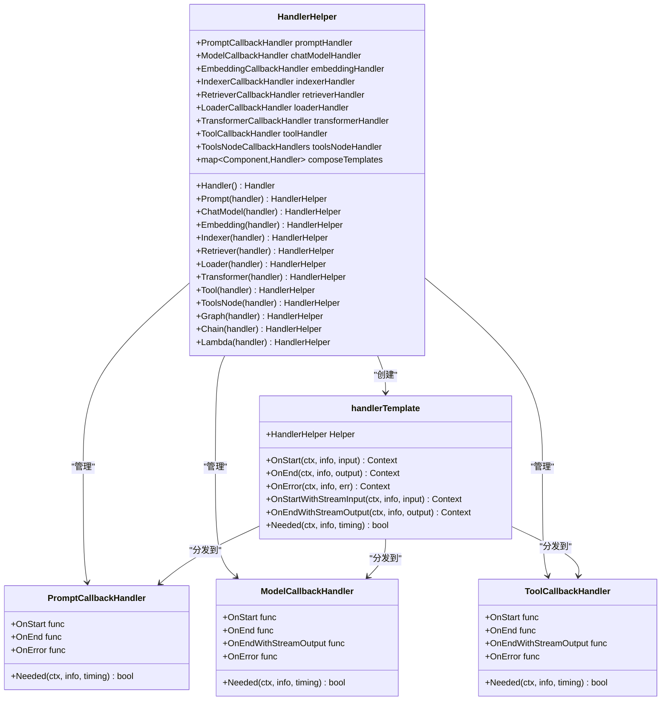
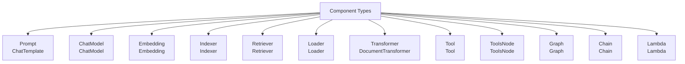
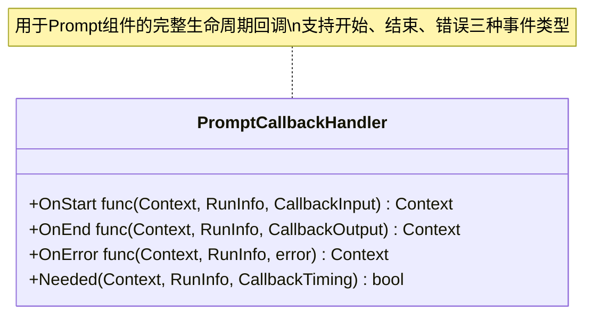
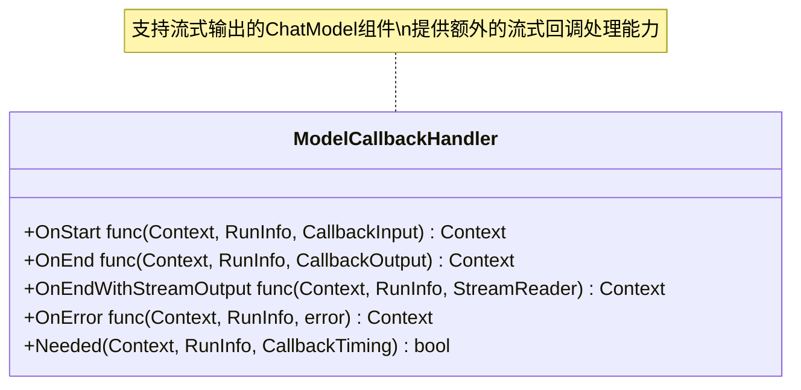
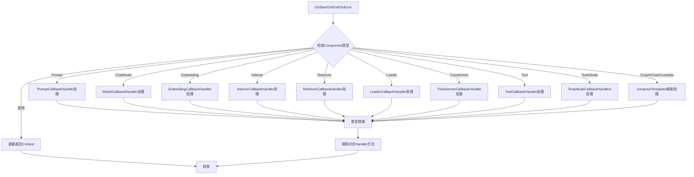
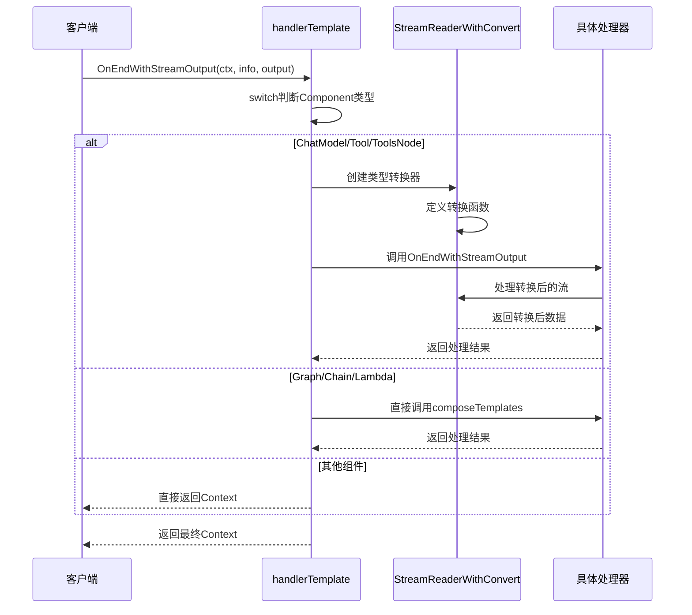
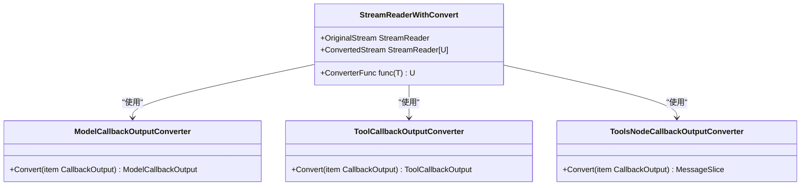
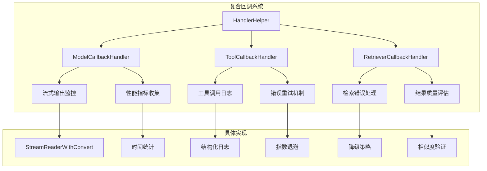
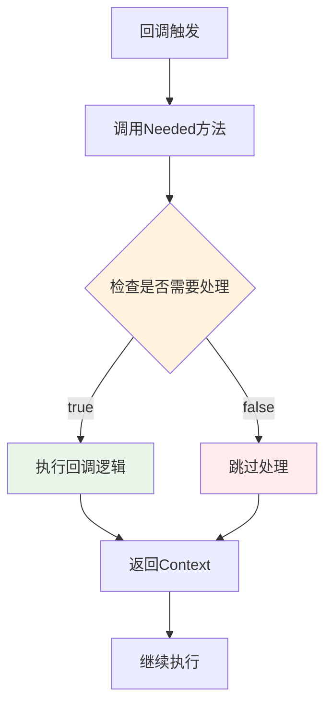

# HandlerHelper详解

<cite>
**本文档中引用的文件**
- [utils/callbacks/template.go](file://utils/callbacks/template.go)
- [utils/callbacks/template_test.go](file://utils/callbacks/template_test.go)
- [callbacks/interface.go](file://callbacks/interface.go)
- [components/types.go](file://components/types.go)
- [schema/stream.go](file://schema/stream.go)
- [components/prompt/callback_extra.go](file://components/prompt/callback_extra.go)
- [components/tool/utils/error_handler.go](file://components/tool/utils/error_handler.go)
</cite>

## 目录
1. [简介](#简介)
2. [核心架构](#核心架构)
3. [HandlerHelper结构体详解](#handlerhelper结构体详解)
4. [组件类型感知机制](#组件类型感知机制)
5. [回调处理器类型](#回调处理器类型)
6. [链式配置方法](#链式配置方法)
7. [Switch-Case分发逻辑](#switch-case分发逻辑)
8. [流式输出处理机制](#流式输出处理机制)
9. [实际应用示例](#实际应用示例)
10. [性能优化与最佳实践](#性能优化与最佳实践)
11. [总结](#总结)

## 简介

HandlerHelper是Eino框架中一个强大的组件类型感知回调构建工具，它为不同类型的组件（Prompt、ChatModel、Tool、Graph等）提供了专门的回调处理器管理机制。通过精心设计的架构，HandlerHelper实现了精细化的组件级回调控制，支持同步和异步操作，以及复杂的流式数据处理。

## 核心架构

HandlerHelper采用分层架构设计，通过HandlerHelper结构体统一管理所有组件类型的回调处理器，并通过handlerTemplate实现运行时的动态分发。



**图表来源**
- [utils/callbacks/template.go](file://utils/callbacks/template.go#L55-L66)
- [utils/callbacks/template.go](file://utils/callbacks/template.go#L145-L147)

## HandlerHelper结构体详解

HandlerHelper结构体是整个回调系统的核心，它包含了所有可能的组件回调处理器字段和编排组件模板映射。

### 主要字段分析

| 字段名 | 类型 | 用途 | 默认值 |
|--------|------|------|--------|
| promptHandler | *PromptCallbackHandler | 处理Prompt组件的回调 | nil |
| chatModelHandler | *ModelCallbackHandler | 处理ChatModel组件的回调 | nil |
| embeddingHandler | *EmbeddingCallbackHandler | 处理Embedding组件的回调 | nil |
| indexerHandler | *IndexerCallbackHandler | 处理Indexer组件的回调 | nil |
| retrieverHandler | *RetrieverCallbackHandler | 处理Retriever组件的回调 | nil |
| loaderHandler | *LoaderCallbackHandler | 处理Loader组件的回调 | nil |
| transformerHandler | *TransformerCallbackHandler | 处理Transformer组件的回调 | nil |
| toolHandler | *ToolCallbackHandler | 处理Tool组件的回调 | nil |
| toolsNodeHandler | *ToolsNodeCallbackHandlers | 处理ToolsNode组件的回调 | nil |
| composeTemplates | map[components.Component]callbacks.Handler | 编排组件回调模板映射 | 空映射 |

**章节来源**
- [utils/callbacks/template.go](file://utils/callbacks/template.go#L55-L66)

## 组件类型感知机制

HandlerHelper通过RunInfo中的Component字段实现精确的组件类型识别和路由分发。系统支持以下组件类型：

### 组件类型枚举



**图表来源**
- [components/types.go](file://components/types.go#L53-L62)

### 类型转换机制

每个组件都有对应的输入输出类型转换函数，确保回调处理器接收到正确的数据类型：

| 组件类型 | 输入转换函数 | 输出转换函数 | 特殊处理 |
|----------|-------------|-------------|----------|
| Prompt | ConvCallbackInput | ConvCallbackOutput | 支持变量映射 |
| ChatModel | ConvCallbackInput | ConvCallbackOutput | 流式输出支持 |
| Tool | ConvCallbackInput | ConvCallbackOutput | 错误处理包装 |
| Retriever | ConvCallbackInput | ConvCallbackOutput | 检索结果处理 |
| Loader | ConvLoaderCallbackInput | ConvLoaderCallbackOutput | 文档加载处理 |
| Transformer | ConvTransformerCallbackInput | ConvTransformerCallbackOutput | 文档转换处理 |

**章节来源**
- [utils/callbacks/template.go](file://utils/callbacks/template.go#L152-L206)
- [components/prompt/callback_extra.go](file://components/prompt/callback_extra.go#L44-L70)

## 回调处理器类型

HandlerHelper为每种组件类型提供了专门的回调处理器结构体，每个处理器都包含完整的生命周期回调方法。

### PromptCallbackHandler



### ModelCallbackHandler



### ToolCallbackHandler

```mermaid
classStreamProcessor
class ToolCallbackHandler {
+OnStart func(Context, RunInfo, CallbackInput) Context
+OnEnd func(Context, RunInfo, CallbackOutput) Context
+OnEndWithStreamOutput func(Context, RunInfo, StreamReader) Context
+OnError func(Context, RunInfo, error) Context
+Needed(Context, RunInfo, CallbackTiming) bool
}
note for ToolCallbackHandler "工具组件的回调处理器\n支持同步和异步执行模式"
```

**章节来源**
- [utils/callbacks/template.go](file://utils/callbacks/template.go#L452-L522)

## 链式配置方法

HandlerHelper提供了流畅的API设计，支持链式调用来配置各种组件的回调处理器。

### 配置方法概览

```mermaid
flowchart TD
A[NewHandlerHelper] --> B[Prompt(handler)]
B --> C[ChatModel(handler)]
C --> D[Embedding(handler)]
D --> E[Indexer(handler)]
E --> F[Retriever(handler)]
F --> G[Tool(handler)]
G --> H[Transformer(handler)]
H --> I[Loader(handler)]
I --> J[Graph(handler)]
J --> K[Chain(handler)]
K --> L[Lambda(handler)]
L --> M[Handler()<br/>返回最终Handler]
style A fill:#e1f5fe
style M fill:#c8e6c9
```

### 方法签名分析

| 方法名 | 参数类型 | 返回类型 | 功能描述 |
|--------|----------|----------|----------|
| Prompt | *PromptCallbackHandler | *HandlerHelper | 设置Prompt组件回调处理器 |
| ChatModel | *ModelCallbackHandler | *HandlerHelper | 设置ChatModel组件回调处理器 |
| Embedding | *EmbeddingCallbackHandler | *HandlerHelper | 设置Embedding组件回调处理器 |
| Indexer | *IndexerCallbackHandler | *HandlerHelper | 设置Indexer组件回调处理器 |
| Retriever | *RetrieverCallbackHandler | *HandlerHelper | 设置Retriever组件回调处理器 |
| Tool | *ToolCallbackHandler | *HandlerHelper | 设置Tool组件回调处理器 |
| Graph | callbacks.Handler | *HandlerHelper | 设置Graph编排组件回调处理器 |
| Chain | callbacks.Handler | *HandlerHelper | 设置Chain编排组件回调处理器 |
| Lambda | callbacks.Handler | *HandlerHelper | 设置Lambda编排组件回调处理器 |

**章节来源**
- [utils/callbacks/template.go](file://utils/callbacks/template.go#L69-L143)

## Switch-Case分发逻辑

HandlerHelper的核心在于handlerTemplate的switch-case分发机制，它根据RunInfo中的Component类型动态调用对应的子处理器。

### 分发流程图



**图表来源**
- [utils/callbacks/template.go](file://utils/callbacks/template.go#L152-L206)

### 分发逻辑实现

handlerTemplate的各个回调方法都采用了相同的分发模式：

1. **类型检查**：通过switch语句匹配Component类型
2. **处理器选择**：从HandlerHelper中获取对应的处理器
3. **类型转换**：使用ConvCallbackInput/ConvCallbackOutput进行类型安全转换
4. **方法调用**：调用具体的处理器方法
5. **上下文传递**：保持context的连续性

**章节来源**
- [utils/callbacks/template.go](file://utils/callbacks/template.go#L149-L206)

## 流式输出处理机制

HandlerHelper特别针对流式输出场景提供了StreamReaderWithConvert功能，这是其高级特性之一。

### 流式处理架构



**图表来源**
- [utils/callbacks/template.go](file://utils/callbacks/template.go#L258-L281)

### StreamReaderWithConvert详解

StreamReaderWithConvert是一个关键的转换器，它允许将不同类型的流数据转换为处理器期望的格式：



**章节来源**
- [utils/callbacks/template.go](file://utils/callbacks/template.go#L261-L274)
- [schema/stream.go](file://schema/stream.go#L1-L50)

## 实际应用示例

以下是一个综合示例，展示如何构建一个同时监控模型流式输出、记录工具调用日志并为检索器添加错误处理的复合回调系统。

### 示例架构



### 代码实现要点

1. **模型流式输出监控**：
   - 使用ModelCallbackHandler的OnEndWithStreamOutput
   - 通过StreamReaderWithConvert进行类型转换
   - 实现自定义的流处理器

2. **工具调用日志记录**：
   - 在ToolCallbackHandler中实现详细的调用跟踪
   - 包含参数、响应时间和错误信息
   - 支持结构化日志输出

3. **检索器错误处理**：
   - 实现RetrieverCallbackHandler的OnError方法
   - 提供降级检索策略
   - 记录检索失败原因和恢复措施

**章节来源**
- [utils/callbacks/template.go](file://utils/callbacks/template.go#L261-L274)
- [components/tool/utils/error_handler.go](file://components/tool/utils/error_handler.go#L1-L159)

## 性能优化与最佳实践

### TimingChecker接口优化

HandlerHelper实现了TimingChecker接口，通过Needed方法进行性能优化：



### 最佳实践建议

1. **处理器选择**：
   - 只为需要的组件类型设置回调处理器
   - 避免不必要的处理器初始化

2. **内存管理**：
   - 及时关闭StreamReader资源
   - 使用适当的缓冲区大小

3. **错误处理**：
   - 在OnError方法中实现优雅降级
   - 记录详细的错误信息但避免敏感信息泄露

4. **性能监控**：
   - 利用TimingChecker减少不必要的回调
   - 监控回调执行时间

**章节来源**
- [utils/callbacks/template.go](file://utils/callbacks/template.go#L284-L342)

## 总结

HandlerHelper作为Eino框架的核心回调构建工具，通过以下特性实现了精细化的组件级回调控制：

1. **类型感知**：通过Component字段实现精确的组件类型识别
2. **分层架构**：HandlerHelper统一管理，handlerTemplate负责运行时分发
3. **灵活配置**：链式API设计支持多种组件的回调处理器配置
4. **流式支持**：StreamReaderWithConvert提供强大的流式数据处理能力
5. **性能优化**：TimingChecker接口减少不必要的回调开销

这种设计不仅提高了系统的可维护性和扩展性，还为开发者提供了强大而灵活的回调控制机制，使得复杂AI应用的监控和调试变得更加简单高效。