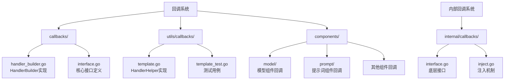
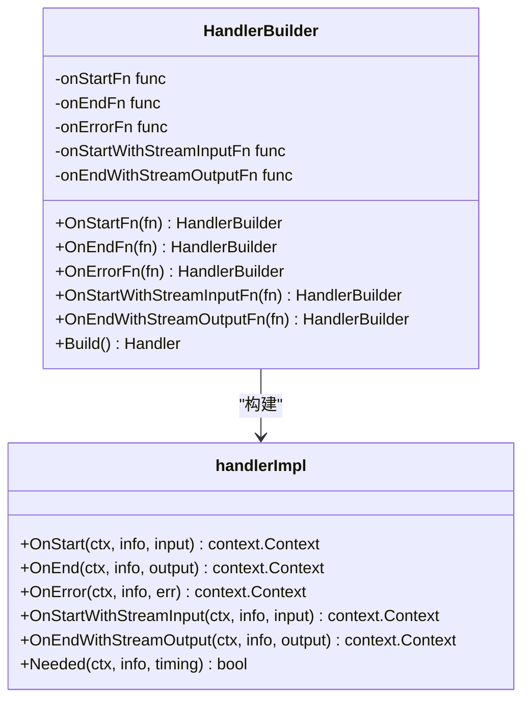
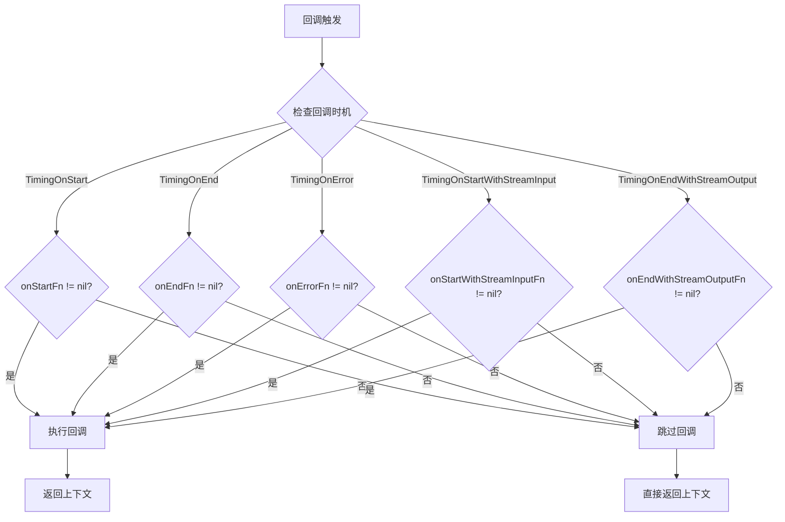
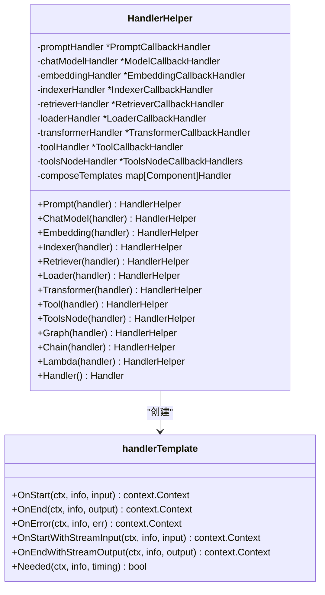
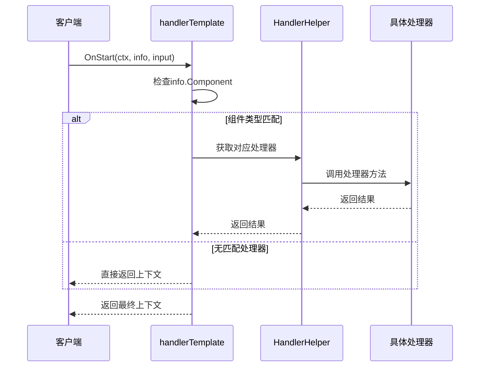
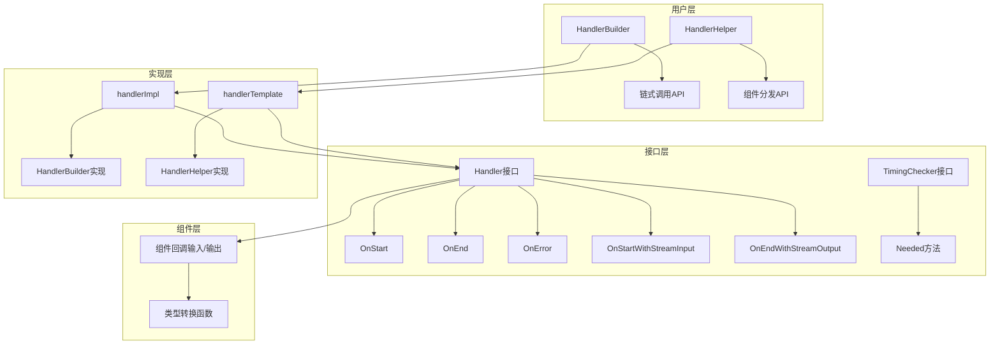
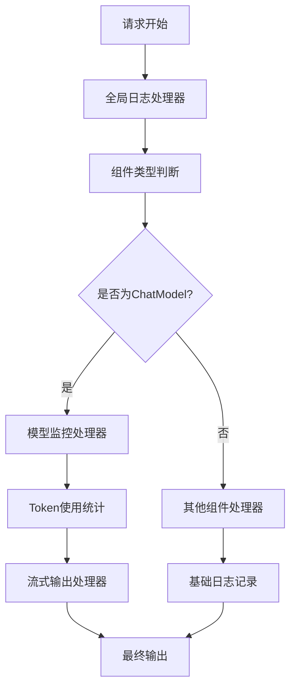

# 回调构建工具

<cite>
**本文档中引用的文件**
- [callbacks/handler_builder.go](file://callbacks/handler_builder.go)
- [utils/callbacks/template.go](file://utils/callbacks/template.go)
- [callbacks/interface.go](file://callbacks/interface.go)
- [components/types.go](file://components/types.go)
- [components/model/callback_extra.go](file://components/model/callback_extra.go)
- [components/prompt/callback_extra.go](file://components/prompt/callback_extra.go)
- [internal/callbacks/interface.go](file://internal/callbacks/interface.go)
- [utils/callbacks/template_test.go](file://utils/callbacks/template_test.go)
</cite>

## 目录
1. [简介](#简介)
2. [项目结构概览](#项目结构概览)
3. [HandlerBuilder详解](#handlerbuilder详解)
4. [HandlerHelper详解](#handlerhelper详解)
5. [核心架构分析](#核心架构分析)
6. [实际应用示例](#实际应用示例)
7. [综合示例：复合回调处理器](#综合示例复合回调处理器)
8. [最佳实践与性能考虑](#最佳实践与性能考虑)
9. [故障排除指南](#故障排除指南)
10. [总结](#总结)

## 简介

Eino提供了两套强大的回调构建工具：`HandlerBuilder`和`HandlerHelper`，用于构建灵活且可扩展的回调处理器。这些工具允许开发者为不同的组件类型配置专门的回调逻辑，实现精细化的事件处理和监控功能。

### 主要特性

- **链式调用接口**：支持流畅的API设计，提高代码可读性
- **类型安全**：针对不同组件提供专门的回调处理器
- **自动分发**：根据组件类型自动选择合适的回调处理器
- **流式支持**：支持输入输出流的回调处理
- **条件执行**：基于回调时机的智能过滤机制

## 项目结构概览

Eino的回调系统主要分布在以下目录结构中：



**图表来源**
- [callbacks/handler_builder.go](file://callbacks/handler_builder.go#L1-L125)
- [utils/callbacks/template.go](file://utils/callbacks/template.go#L1-L563)
- [internal/callbacks/interface.go](file://internal/callbacks/interface.go#L1-L55)

## HandlerBuilder详解

### 核心结构设计

`HandlerBuilder`是一个链式调用的回调处理器构建器，提供了简洁而强大的API来创建自定义的回调处理器。



**图表来源**
- [callbacks/handler_builder.go](file://callbacks/handler_builder.go#L25-L35)
- [callbacks/handler_builder.go](file://callbacks/handler_builder.go#L33-L76)

### 内部实现原理

#### handlerImpl结构

`handlerImpl`是`HandlerBuilder`的具体实现，它实现了`Handler`接口的所有方法：

- **OnStart方法**：处理组件开始执行时的回调
- **OnEnd方法**：处理组件正常结束时的回调  
- **OnError方法**：处理组件发生错误时的回调
- **OnStartWithStreamInput方法**：处理带流式输入的开始回调
- **OnEndWithStreamOutput方法**：处理带流式输出的结束回调

#### Needed方法的自动实现

`Needed`方法实现了智能的回调过滤机制：



**图表来源**
- [callbacks/handler_builder.go](file://callbacks/handler_builder.go#L61-L76)

**章节来源**
- [callbacks/handler_builder.go](file://callbacks/handler_builder.go#L1-L125)

## HandlerHelper详解

### 组件类型分发机制

`HandlerHelper`提供了针对不同类型组件的专用回调处理器，通过组件类型分发机制实现精细化的回调控制。



**图表来源**
- [utils/callbacks/template.go](file://utils/callbacks/template.go#L56-L65)
- [utils/callbacks/template.go](file://utils/callbacks/template.go#L145-L147)

### 组件类型映射表

| 组件类型 | 对应处理器 | 用途 |
|---------|-----------|------|
| ComponentOfPrompt | PromptCallbackHandler | 提示词模板处理 |
| ComponentOfChatModel | ModelCallbackHandler | 聊天模型交互 |
| ComponentOfEmbedding | EmbeddingCallbackHandler | 向量嵌入处理 |
| ComponentOfIndexer | IndexerCallbackHandler | 文档索引管理 |
| ComponentOfRetriever | RetrieverCallbackHandler | 检索器操作 |
| ComponentOfLoader | LoaderCallbackHandler | 文档加载处理 |
| ComponentOfTransformer | TransformerCallbackHandler | 文档转换处理 |
| ComponentOfTool | ToolCallbackHandler | 工具函数调用 |
| ComponentOfToolsNode | ToolsNodeCallbackHandlers | 工具节点处理 |

### 分发机制实现

`handlerTemplate`通过组件类型进行智能分发：



**图表来源**
- [utils/callbacks/template.go](file://utils/callbacks/template.go#L149-L178)

**章节来源**
- [utils/callbacks/template.go](file://utils/callbacks/template.go#L1-L563)

## 核心架构分析

### 回调系统整体架构



**图表来源**
- [internal/callbacks/interface.go](file://internal/callbacks/interface.go#L38-L48)
- [callbacks/handler_builder.go](file://callbacks/handler_builder.go#L33-L76)
- [utils/callbacks/template.go](file://utils/callbacks/template.go#L145-L282)

### 类型安全保证

系统通过以下机制确保类型安全：

1. **泛型输入输出**：`CallbackInput`和`CallbackOutput`作为通用类型
2. **类型转换函数**：每个组件提供专门的转换函数（如`ConvCallbackInput`）
3. **运行时类型检查**：在处理器内部验证输入类型
4. **编译时接口约束**：所有处理器都实现必要的接口

**章节来源**
- [callbacks/interface.go](file://callbacks/interface.go#L1-L85)
- [components/model/callback_extra.go](file://components/model/callback_extra.go#L81-L107)
- [components/prompt/callback_extra.go](file://components/prompt/callback_extra.go#L44-L70)

## 实际应用示例

### 基础HandlerBuilder使用

以下展示了如何使用`HandlerBuilder`创建简单的回调处理器：

```go
// 创建HandlerBuilder实例
builder := callbacks.NewHandlerBuilder()

// 配置回调函数
handler := builder.
    OnStartFn(func(ctx context.Context, info *callbacks.RunInfo, input callbacks.CallbackInput) context.Context {
        log.Printf("组件 %s 开始执行: %v", info.Component, input)
        return ctx
    }).
    OnEndFn(func(ctx context.Context, info *callbacks.RunInfo, output callbacks.CallbackOutput) context.Context {
        log.Printf("组件 %s 结束执行: %v", info.Component, output)
        return ctx
    }).
    OnErrorFn(func(ctx context.Context, info *callbacks.RunInfo, err error) context.Context {
        log.Printf("组件 %s 发生错误: %v", info.Component, err)
        return ctx
    }).
    Build()
```

### HandlerHelper高级用法

以下是HandlerHelper的典型使用模式：

```go
// 创建HandlerHelper实例
helper := callbacks.NewHandlerHelper()

// 为不同组件设置专用处理器
handler := helper.
    ChatModel(&model.ModelCallbackHandler{
        OnStart: func(ctx context.Context, info *callbacks.RunInfo, input *model.CallbackInput) context.Context {
            // 模型调用开始处理
            return ctx
        },
        OnEnd: func(ctx context.Context, info *callbacks.RunInfo, output *model.CallbackOutput) context.Context {
            // 模型调用结束处理
            return ctx
        },
    }).
    Prompt(&prompt.PromptCallbackHandler{
        OnStart: func(ctx context.Context, info *callbacks.RunInfo, input *prompt.CallbackInput) context.Context {
            // 提示词处理开始
            return ctx
        },
        OnEnd: func(ctx context.Context, info *callbacks.RunInfo, output *prompt.CallbackOutput) context.Context {
            // 提示词处理结束
            return ctx
        },
    }).
    Handler()
```

**章节来源**
- [utils/callbacks/template_test.go](file://utils/callbacks/template_test.go#L39-L144)

## 综合示例：复合回调处理器

### 需求分析

假设我们需要构建一个支持以下功能的复合回调处理器：
- **全局日志记录**：记录所有组件的执行情况
- **特定模型监控**：监控特定模型的Token使用情况
- **流式输出处理**：处理流式输出的实时数据

### 实现方案



### 代码实现

以下是完整的复合回调处理器实现：

```go
// 创建全局日志处理器
globalLogger := callbacks.NewHandlerBuilder().
    OnStartFn(func(ctx context.Context, info *callbacks.RunInfo, input callbacks.CallbackInput) context.Context {
        log.Printf("[全局日志] 组件 %s 开始执行", info.Component)
        return ctx
    }).
    OnEndFn(func(ctx context.Context, info *callbacks.RunInfo, output callbacks.CallbackOutput) context.Context {
        log.Printf("[全局日志] 组件 %s 执行完成", info.Component)
        return ctx
    }).
    Build()

// 创建模型监控处理器
modelMonitor := &model.ModelCallbackHandler{
    OnStart: func(ctx context.Context, info *callbacks.RunInfo, input *model.CallbackInput) context.Context {
        log.Printf("[模型监控] 开始调用模型: %s", input.Config.Model)
        return ctx
    },
    OnEnd: func(ctx context.Context, info *callbacks.RunInfo, output *model.CallbackOutput) context.Context {
        if output.TokenUsage != nil {
            log.Printf("[模型监控] Token使用统计 - 总计: %d, 提示: %d, 补充: %d",
                output.TokenUsage.TotalTokens,
                output.TokenUsage.PromptTokens,
                output.TokenUsage.CompletionTokens)
        }
        return ctx
    },
    OnEndWithStreamOutput: func(ctx context.Context, info *callbacks.RunInfo, output *schema.StreamReader[*model.CallbackOutput]) context.Context {
        go func() {
            defer output.Close()
            for {
                item, err := output.Receive()
                if err != nil {
                    break
                }
                if item != nil && item.Message != nil {
                    log.Printf("[流式输出] 接收到消息: %s", item.Message.Content)
                }
            }
        }()
        return ctx
    },
}

// 创建HandlerHelper并组合处理器
compositeHandler := callbacks.NewHandlerHelper().
    ChatModel(modelMonitor).
    Handler()

// 将全局处理器添加到复合处理器
callbacks.AppendGlobalHandlers(globalLogger)
```

### 使用方式

```go
// 在组件调用时使用复合处理器
ctx := context.Background()
result, err := component.Invoke(ctx, input, compose.WithCallbacks(compositeHandler))
```

**章节来源**
- [utils/callbacks/template_test.go](file://utils/callbacks/template_test.go#L39-L144)

## 最佳实践与性能考虑

### 性能优化建议

1. **回调时机选择**：合理使用`Needed`方法避免不必要的回调执行
2. **异步处理**：对于耗时的回调操作，考虑使用goroutine
3. **资源管理**：及时关闭流式处理器，避免内存泄漏
4. **错误处理**：确保回调函数中的错误不会影响主流程

### 设计原则

1. **单一职责**：每个回调处理器专注于特定的功能
2. **松耦合**：回调处理器之间尽量减少依赖
3. **可测试性**：设计易于单元测试的回调逻辑
4. **可扩展性**：预留扩展点以适应未来需求

### 错误处理策略

```go
// 示例：健壮的回调处理器实现
handler := callbacks.NewHandlerBuilder().
    OnStartFn(func(ctx context.Context, info *callbacks.RunInfo, input callbacks.CallbackInput) context.Context {
        defer func() {
            if r := recover(); r != nil {
                log.Printf("回调处理器发生异常: %v", r)
            }
        }()
        // 回调逻辑
        return ctx
    }).
    Build()
```

## 故障排除指南

### 常见问题及解决方案

| 问题描述 | 可能原因 | 解决方案 |
|---------|---------|---------|
| 回调不执行 | 处理器未正确注册 | 检查HandlerBuilder或HandlerHelper的配置 |
| 类型转换失败 | 输入输出类型不匹配 | 使用对应的ConvCallback函数进行转换 |
| 流式处理异常 | 流未正确关闭 | 确保在回调中调用Close()方法 |
| 性能问题 | 回调逻辑过于复杂 | 优化回调逻辑或使用异步处理 |

### 调试技巧

1. **启用详细日志**：在回调中添加详细的调试信息
2. **使用断点调试**：在关键回调位置设置断点
3. **监控回调频率**：统计回调执行次数以识别异常
4. **验证组件类型**：确保回调处理器与组件类型匹配

**章节来源**
- [utils/callbacks/template_test.go](file://utils/callbacks/template_test.go#L170-L200)

## 总结

Eino的回调构建工具提供了强大而灵活的事件处理能力：

### 主要优势

1. **双工具设计**：HandlerBuilder适合简单场景，HandlerHelper适合复杂场景
2. **类型安全**：完善的类型系统确保开发时的类型安全
3. **自动分发**：智能的组件类型分发机制简化了开发工作
4. **性能优化**：基于`Needed`方法的条件执行机制提高了性能

### 应用场景

- **监控系统**：实时监控组件执行状态
- **日志记录**：统一的日志收集和处理
- **性能分析**：分析组件执行时间和资源使用
- **调试工具**：辅助开发过程中的问题诊断

通过合理使用这两套工具，开发者可以构建出既高效又易维护的回调处理系统，为应用程序提供强大的可观测性和可调试性支持。