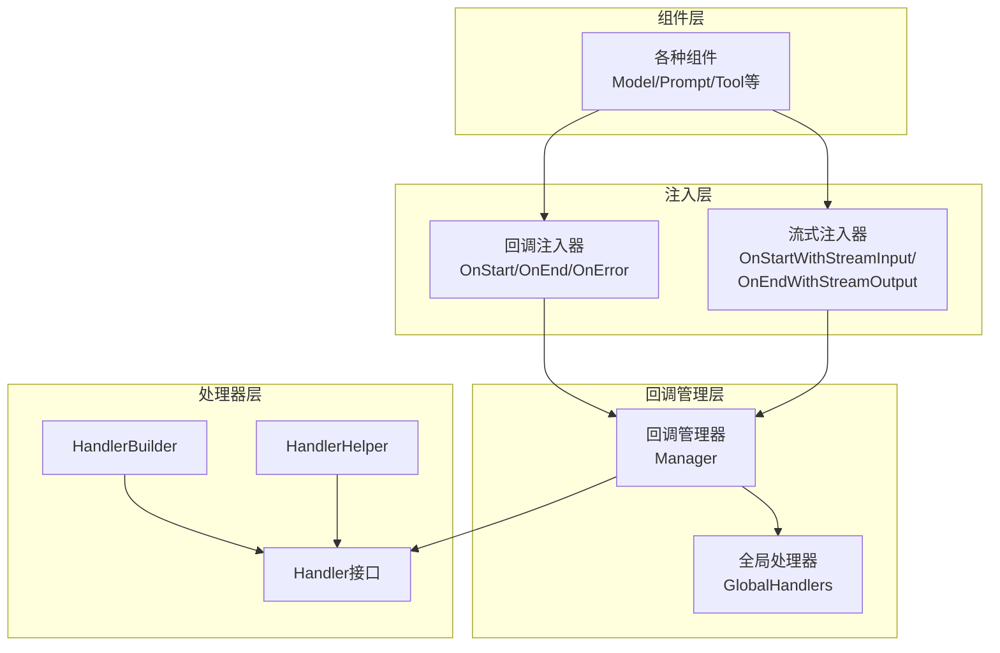
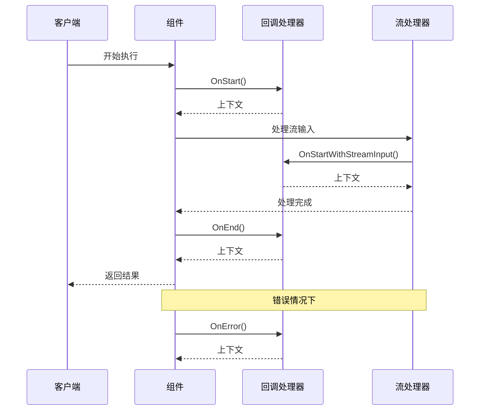
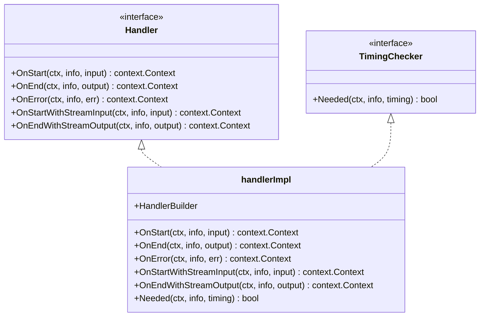
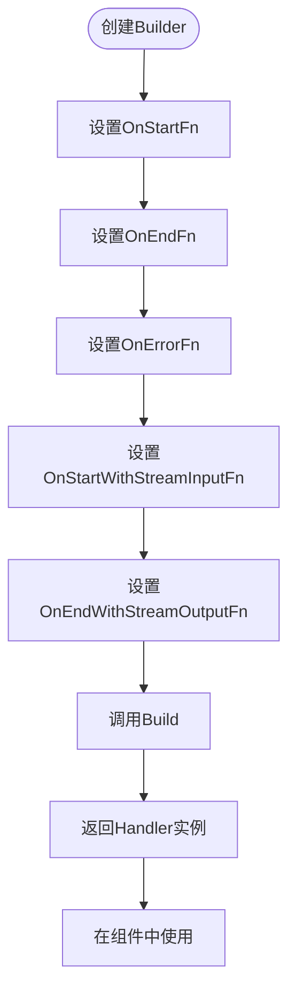
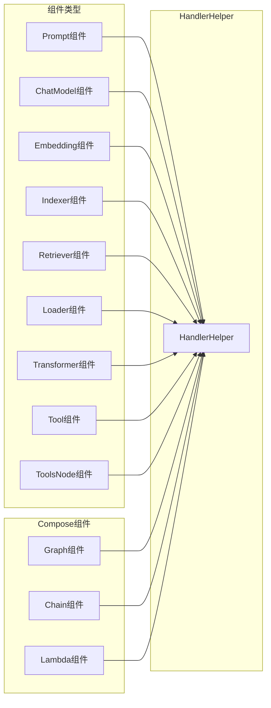
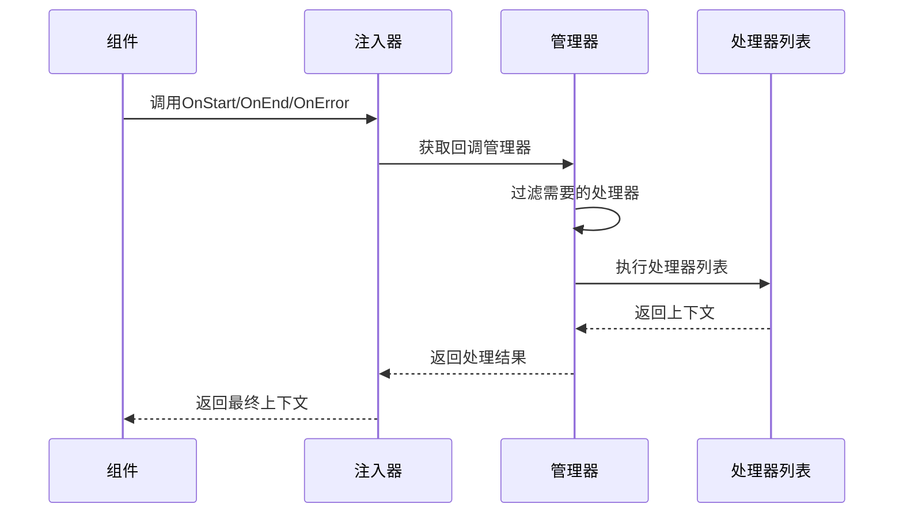
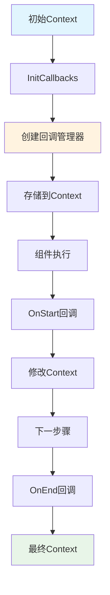
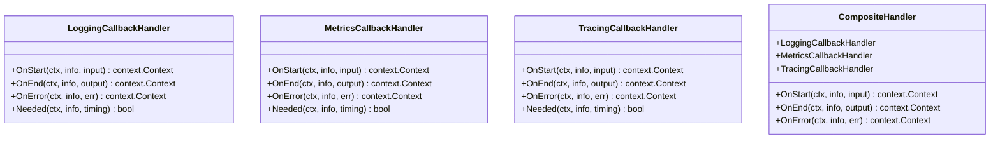

# 回调（Callbacks）

<cite>
**本文档中引用的文件**
- [callbacks/interface.go](file://callbacks/interface.go)
- [callbacks/handler_builder.go](file://callbacks/handler_builder.go)
- [utils/callbacks/template.go](file://utils/callbacks/template.go)
- [internal/callbacks/inject.go](file://internal/callbacks/inject.go)
- [internal/callbacks/manager.go](file://internal/callbacks/manager.go)
- [callbacks/interface_test.go](file://callbacks/interface_test.go)
- [compose/graph_test.go](file://compose/graph_test.go)
- [compose/utils.go](file://compose/utils.go)
- [callbacks/doc.go](file://callbacks/doc.go)
</cite>

## 目录
1. [简介](#简介)
2. [核心架构](#核心架构)
3. [五种核心切面](#五种核心切面)
4. [Handler接口与实现](#handler接口与实现)
5. [HandlerBuilder声明式API](#handlerbuilder声明式api)
6. [HandlerHelper模板系统](#handlerhelper模板系统)
7. [回调注入机制](#回调注入机制)
8. [上下文传递与状态管理](#上下文传递与状态管理)
9. [实际应用示例](#实际应用示例)
10. [最佳实践](#最佳实践)

## 简介

Eino的回调机制是一个强大的切面编程（AOP）框架，允许开发者在组件执行的关键时刻插入自定义逻辑。该机制提供了五个核心切面，支持同步和异步处理，并通过声明式API简化了复杂回调逻辑的构建。

回调机制的核心价值在于：
- **非侵入性**：无需修改业务逻辑即可添加监控、日志等功能
- **灵活性**：支持多种触发时机和处理模式
- **可组合性**：多个回调处理器可以协同工作
- **类型安全**：强类型的输入输出参数确保运行时安全

## 核心架构

**图表来源**
- [internal/callbacks/manager.go](file://internal/callbacks/manager.go#L24-L45)
- [callbacks/handler_builder.go](file://callbacks/handler_builder.go#L25-L35)
- [utils/callbacks/template.go](file://utils/callbacks/template.go#L45-L65)

**章节来源**
- [internal/callbacks/manager.go](file://internal/callbacks/manager.go#L1-L71)
- [callbacks/interface.go](file://callbacks/interface.go#L1-L85)

## 五种核心切面

Eino回调机制定义了五个核心切面，每个切面对应组件生命周期的不同阶段：

### TimingOnStart（开始时）
- **触发时机**：组件开始执行前
- **用途**：初始化准备工作、参数验证、权限检查
- **典型场景**：日志记录开始时间、设置初始状态、资源预分配

### TimingOnEnd（结束时）
- **触发时机**：组件成功执行完成后
- **用途**：清理资源、结果后处理、状态更新
- **典型场景**：记录执行时间、发送通知、持久化结果

### TimingOnError（错误时）
- **触发时机**：组件执行过程中发生错误时
- **用途**：错误处理、异常恢复、告警通知
- **典型场景**：错误日志记录、重试机制、错误上报

### TimingOnStartWithStreamInput（流输入开始时）
- **触发时机**：接收流式输入数据时
- **用途**：流式数据处理、实时监控、动态配置
- **典型场景**：实时日志、进度跟踪、动态调整

### TimingOnEndWithStreamOutput（流输出结束时）
- **触发时机**：产生流式输出数据时
- **用途**：流式结果处理、实时反馈、数据聚合
- **典型场景**：实时响应、流式日志、增量计算

**图表来源**
- [internal/callbacks/inject.go](file://internal/callbacks/inject.go#L72-L104)
- [callbacks/handler_builder.go](file://callbacks/handler_builder.go#L37-L58)

**章节来源**
- [callbacks/interface.go](file://callbacks/interface.go#L71-L77)

## Handler接口与实现

### Handler接口定义

Handler是回调机制的核心接口，定义了五个方法来处理不同类型的回调事件：

**图表来源**
- [callbacks/handler_builder.go](file://callbacks/handler_builder.go#L33-L77)
- [callbacks/interface.go](file://callbacks/interface.go#L50-L85)

### 实现自定义回调处理器

开发者可以通过以下方式实现自定义回调处理器：

1. **直接实现Handler接口**：适用于简单场景
2. **使用HandlerBuilder**：推荐方式，支持声明式配置
3. **使用HandlerHelper**：针对特定组件类型优化

**章节来源**
- [callbacks/handler_builder.go](file://callbacks/handler_builder.go#L1-L125)
- [callbacks/interface.go](file://callbacks/interface.go#L50-L85)

## HandlerBuilder声明式API

HandlerBuilder提供了流畅的API来构建回调处理器，支持链式调用和类型安全的函数设置。

### 基本使用模式

**图表来源**
- [callbacks/handler_builder.go](file://callbacks/handler_builder.go#L80-L124)

### 关键特性

1. **类型安全**：每个回调函数都有明确的类型签名
2. **条件执行**：实现了TimingChecker接口，自动跳过未设置的回调
3. **链式调用**：支持流畅的API设计
4. **灵活配置**：可选择性地设置任意数量的回调函数

**章节来源**
- [callbacks/handler_builder.go](file://callbacks/handler_builder.go#L80-L124)

## HandlerHelper模板系统

HandlerHelper是一个高级工具，专门用于为不同类型的组件创建统一的回调模板。

### 支持的组件类型

**图表来源**
- [utils/callbacks/template.go](file://utils/callbacks/template.go#L56-L132)

### 模板使用示例

HandlerHelper允许为每种组件类型设置专门的处理器，实现更精细的控制：

1. **组件特定处理**：为不同组件类型提供专门的回调逻辑
2. **类型转换**：自动处理不同组件的输入输出类型转换
3. **统一接口**：提供一致的回调接口给上层应用

**章节来源**
- [utils/callbacks/template.go](file://utils/callbacks/template.go#L35-L132)

## 回调注入机制

回调注入机制负责在组件执行过程中正确触发回调处理器，确保切面逻辑的无缝集成。

### 注入流程

**图表来源**
- [internal/callbacks/inject.go](file://internal/callbacks/inject.go#L72-L104)

### 全局处理器机制

全局处理器在所有节点执行前自动生效，提供基础的横切关注点：

1. **全局注册**：通过`AppendGlobalHandlers`注册
2. **优先级**：全局处理器先于用户指定的处理器执行
3. **线程安全**：仅在初始化时调用，避免并发问题

**章节来源**
- [internal/callbacks/inject.go](file://internal/callbacks/inject.go#L1-L188)
- [callbacks/interface.go](file://callbacks/interface.go#L52-L66)

## 上下文传递与状态管理

### 上下文传播机制

回调系统通过Context对象在各个处理器之间传递状态信息：

**图表来源**
- [internal/callbacks/manager.go](file://internal/callbacks/manager.go#L47-L69)

### 状态共享策略

1. **Context Value**：通过Context.Value传递状态
2. **RunInfo**：通过RunInfo传递组件相关信息
3. **流式数据**：通过StreamReader传递流式状态
4. **全局变量**：在适当场景下使用全局状态

**章节来源**
- [internal/callbacks/manager.go](file://internal/callbacks/manager.go#L21-L23)

## 实际应用示例

### 基础回调处理器实现

以下是实现自定义回调处理器的典型模式：

### Graph执行中的回调注入

在Graph执行过程中，回调可以通过多种方式注入：

1. **全局回调**：对所有节点生效
2. **节点级回调**：针对特定节点
3. **边级回调**：在节点间传输时生效

**章节来源**
- [compose/graph_test.go](file://compose/graph_test.go#L2023-L2066)
- [compose/utils.go](file://compose/utils.go#L149-L205)

## 最佳实践

### 性能考虑

1. **处理器选择性执行**：实现TimingChecker接口避免不必要的处理
2. **轻量级处理**：回调函数应保持轻量，避免阻塞操作
3. **异步处理**：对于耗时操作，考虑使用异步处理

### 错误处理

1. **优雅降级**：回调失败不应影响主流程
2. **错误隔离**：确保单个处理器的错误不会影响其他处理器
3. **日志记录**：在回调中记录足够的调试信息

### 可维护性

1. **单一职责**：每个回调处理器专注于单一功能
2. **配置分离**：将回调配置与业务逻辑分离
3. **测试覆盖**：为回调处理器编写充分的单元测试

### 安全考虑

1. **权限检查**：在回调中进行必要的权限验证
2. **数据过滤**：对敏感数据进行适当的过滤和脱敏
3. **审计日志**：记录关键操作的审计信息

通过合理使用Eino的回调机制，开发者可以构建出既强大又灵活的应用程序，同时保持代码的清晰性和可维护性。这个切面编程框架为现代应用程序开发提供了强有力的基础设施支持。