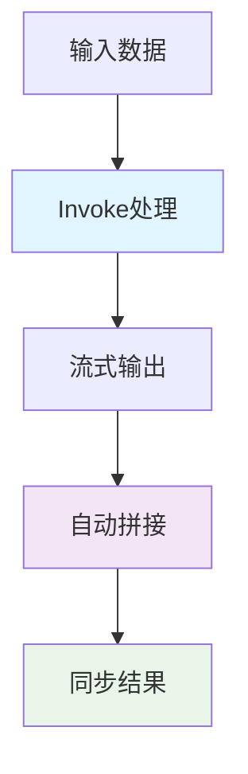
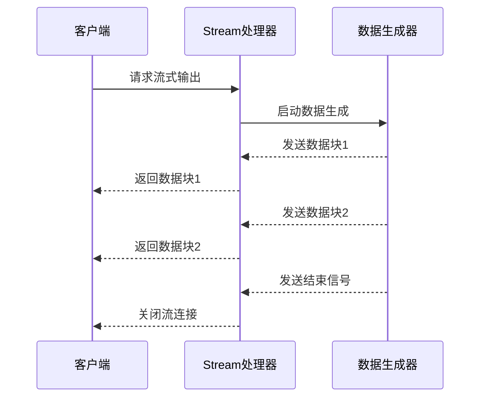
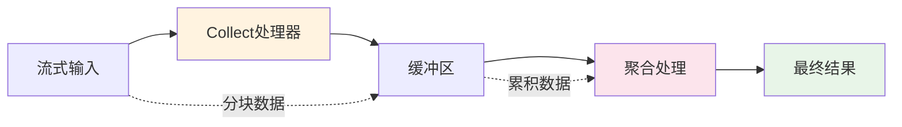
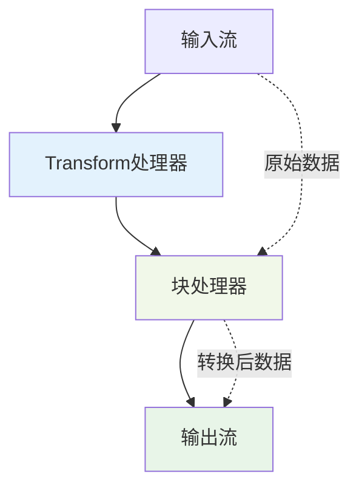
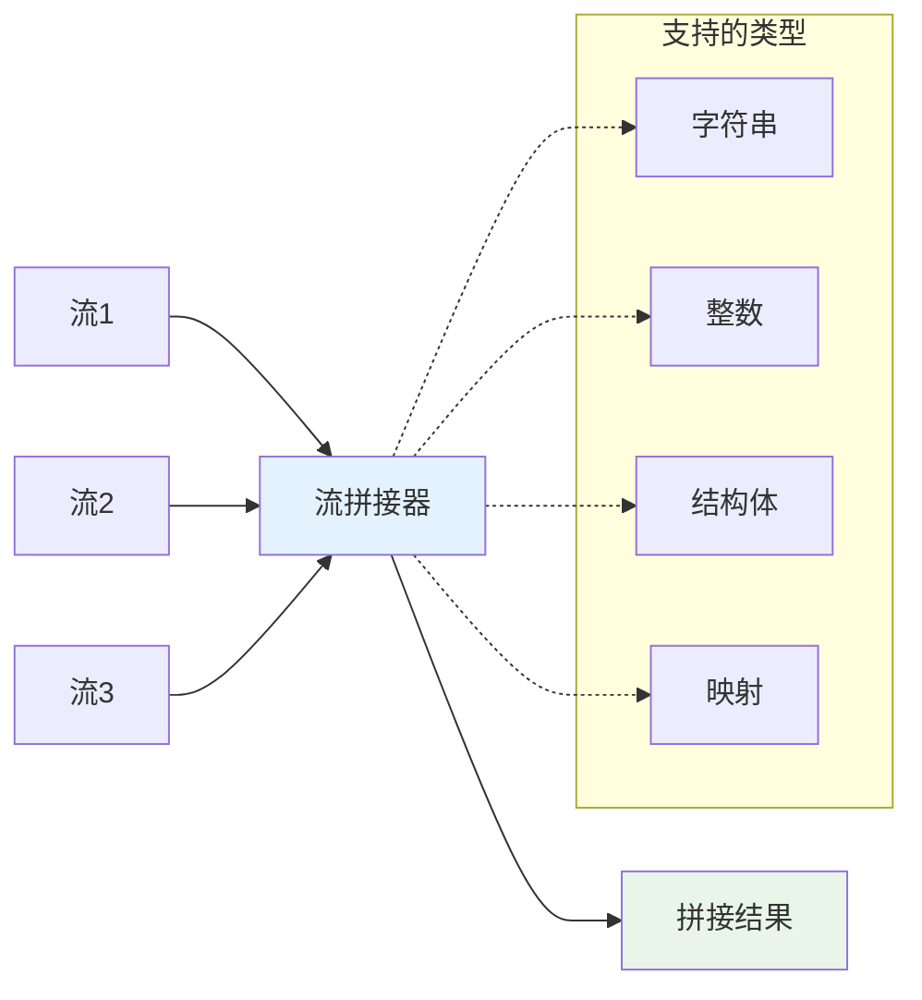
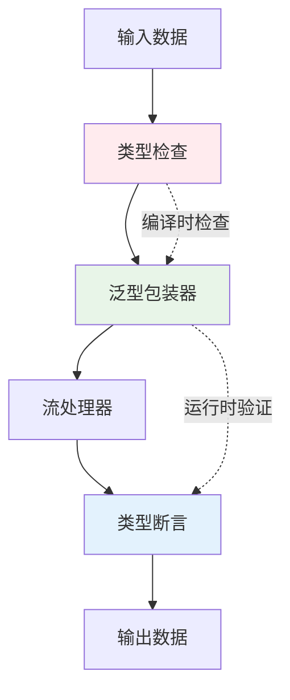
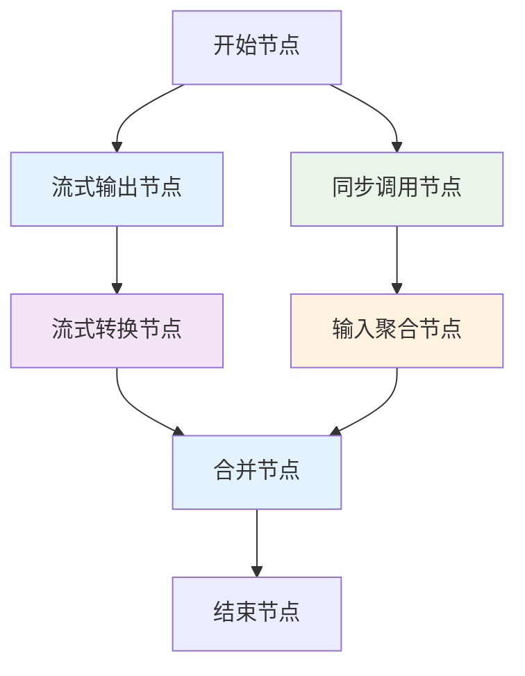
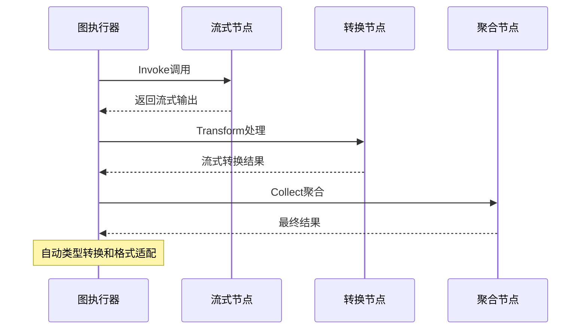
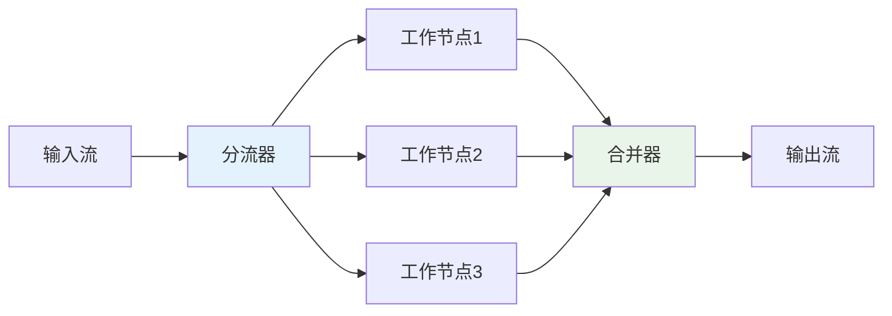

# 流式处理（Stream Processing）

<cite>
**本文档中引用的文件**
- [runnable.go](file://compose/runnable.go)
- [stream_reader.go](file://compose/stream_reader.go)
- [stream.go](file://schema/stream.go)
- [stream_concat.go](file://compose/stream_concat.go)
- [values_merge.go](file://compose/values_merge.go)
- [graph.go](file://compose/graph.go)
- [types.go](file://compose/types.go)
- [workflow.go](file://compose/workflow.go)
- [utils.go](file://compose/utils.go)
- [stream_reader_test.go](file://compose/stream_reader_test.go)
- [stream_concat_test.go](file://compose/stream_concat_test.go)
</cite>

## 目录
1. [引言](#引言)
2. [流式处理的重要性](#流式处理的重要性)
3. [四种流式范式](#四种流式范式)
4. [自动流式处理机制](#自动流式处理机制)
5. [底层流实现](#底层流实现)
6. [混合使用示例](#混合使用示例)
7. [性能考虑](#性能考虑)
8. [故障排除指南](#故障排除指南)
9. [总结](#总结)

## 引言

Eino的自动流式处理能力是其核心优势之一，为LLM应用提供了强大的实时响应生成支持。该框架通过智能的流式抽象，使得开发者能够以统一的方式处理同步和异步数据流，而无需手动管理复杂的流生命周期。

流式处理在现代AI应用中扮演着至关重要的角色，特别是在需要实时响应、大文件处理或长时间运行的任务场景中。Eino通过其创新的架构设计，实现了无缝的流式数据转换和处理，大大简化了开发复杂度。

## 流式处理的重要性

### 实时响应生成场景

在LLM应用中，实时响应是用户体验的关键指标。传统的批处理方式会导致明显的延迟，而流式处理能够：
- 提供即时的用户反馈
- 支持渐进式内容生成
- 减少感知延迟
- 改善交互体验

### 资源效率优化

流式处理相比传统批处理具有显著的资源效率优势：
- 内存使用更加高效
- 网络带宽利用更合理
- 计算资源分配更灵活
- 可扩展性更好

### 大数据处理能力

对于大规模数据处理任务，流式处理能够：
- 处理超出内存限制的数据集
- 支持持续数据摄入
- 实现增量计算
- 提供更好的容错能力

## 四种流式范式

Eino定义了四种核心的流式处理范式，每种范式都有其特定的应用场景和优势。

### Invoke（同步调用）

Invoke模式是最基础的流式处理范式，它将流式输出自动转换为同步结果。



**图表来源**
- [runnable.go](file://compose/runnable.go#L158-L161)
- [runnable.go](file://compose/runnable.go#L182-L192)

**Invoke方法签名**：
- 输入：任意类型I
- 输出：任意类型O
- 特点：自动处理流拼接

**应用场景**：
- 简单的文本生成任务
- 小规模数据处理
- 需要最终结果的场景

**节来源**
- [runnable.go](file://compose/runnable.go#L158-L161)
- [runnable.go](file://compose/runnable.go#L182-L192)

### Stream（流式输出）

Stream模式直接返回流式输出，适用于需要实时处理的场景。



**图表来源**
- [runnable.go](file://compose/runnable.go#L164-L168)
- [stream.go](file://schema/stream.go#L171-L196)

**Stream方法签名**：
- 输入：任意类型I
- 输出：*schema.StreamReader[O]
- 特点：直接返回流读取器

**应用场景**：
- 实时聊天机器人
- 流媒体处理
- 渐进式内容生成

**节来源**
- [runnable.go](file://compose/runnable.go#L164-L168)
- [stream.go](file://schema/stream.go#L171-L196)

### Collect（流式输入聚合）

Collect模式将流式输入聚合为单个结果，适用于需要完整数据集的处理场景。



**图表来源**
- [runnable.go](file://compose/runnable.go#L171-L174)
- [stream_concat.go](file://compose/stream_concat.go#L50-L89)

**Collect方法签名**：
- 输入：*schema.StreamReader[I]
- 输出：任意类型O
- 特点：自动处理流聚合

**应用场景**：
- 文档总结
- 数据分析
- 批量处理

**节来源**
- [runnable.go](file://compose/runnable.go#L171-L174)
- [stream_concat.go](file://compose/stream_concat.go#L50-L89)

### Transform（流式转换）

Transform模式在保持流式特性的基础上进行数据转换，是最灵活的流式处理范式。



**图表来源**
- [runnable.go](file://compose/runnable.go#L177-L179)
- [stream_reader.go](file://compose/stream_reader.go#L37-L40)

**Transform方法签名**：
- 输入：*schema.StreamReader[I]
- 输出：*schema.StreamReader[O]
- 特点：保持流式特性

**应用场景**：
- 数据预处理
- 格式转换
- 流式过滤

**节来源**
- [runnable.go](file://compose/runnable.go#L177-L179)
- [stream_reader.go](file://compose/stream_reader.go#L37-L40)

## 自动流式处理机制

Eino的核心优势在于其自动化的流式处理机制，该机制能够智能地在不同流式范式之间进行转换，无需开发者手动管理转换逻辑。

### 方法签名映射

框架通过智能的方法签名映射，实现了四种流式范式之间的无缝转换：

```mermaid
graph TD
Invoke["Invoke<br/>同步调用"] < --> Stream["Stream<br/>流式输出"]
Invoke < --> Collect["Collect<br/>输入聚合"]
Invoke < --> Transform["Transform<br/>流式转换"]
Stream < --> Collect
Stream < --> Transform
Collect < --> Transform
style Invoke fill:#e8f5e8
style Stream fill:#e3f2fd
style Collect fill:#fff3e0
style Transform fill:#f3e5f5
```

**图表来源**
- [runnable.go](file://compose/runnable.go#L336-L399)

### 自动转换策略

框架采用以下策略实现自动转换：

1. **Invoke到其他范式的转换**：
   - InvokeByStream：将流式输出转换为同步结果
   - InvokeByCollect：将输入包装为流再处理
   - InvokeByTransform：通过流包装进行转换

2. **Stream到其他范式的转换**：
   - StreamByTransform：将输入包装为流
   - StreamByInvoke：直接返回流
   - StreamByCollect：先聚合再处理

3. **Collect到其他范式的转换**：
   - CollectByTransform：先转换再聚合
   - CollectByInvoke：先聚合再调用
   - CollectByStream：先聚合再流化

**节来源**
- [runnable.go](file://compose/runnable.go#L184-L335)

### 流拼接机制

框架提供了强大的流拼接功能，能够自动处理不同类型数据的合并：



**图表来源**
- [stream_concat.go](file://compose/stream_concat.go#L50-L89)

**节来源**
- [stream_concat.go](file://compose/stream_concat.go#L50-L89)

## 底层流实现

Eino的流式处理建立在精心设计的底层架构之上，提供了高效、可靠的流处理能力。

### StreamReader架构

框架定义了统一的StreamReader接口，支持多种流读取器类型：

```mermaid
classDiagram
class StreamReader {
<<interface>>
+Recv() T, error
+Close() void
+Copy(n int) []*StreamReader
+SetAutomaticClose() void
}
class StreamReaderPacker {
-sr *schema.StreamReader[T]
+copy(n int) []streamReader
+merge(streams []streamReader) streamReader
+withKey(key string) streamReader
+close() void
}
class Stream {
-items chan streamItem[T]
-closed chan struct{}
+send(chunk T, err error) bool
+recv() T, error
+closeSend() void
+closeRecv() void
}
StreamReader <|-- StreamReaderPacker
StreamReaderPacker --> Stream
note for StreamReader "统一的流读取接口"
note for Stream "底层通道实现"
```

**图表来源**
- [stream_reader.go](file://compose/stream_reader.go#L26-L35)
- [stream_reader.go](file://compose/stream_reader.go#L37-L40)
- [stream.go](file://schema/stream.go#L354-L375)

### 流复制与合并

框架提供了强大的流复制和合并功能：

1. **流复制（Copy）**：
   - 创建多个独立的流读取器
   - 支持并发访问
   - 维护数据一致性

2. **流合并（Merge）**：
   - 多流合并为单一流
   - 支持有序和无序合并
   - 自动处理流关闭

**节来源**
- [stream_reader.go](file://compose/stream_reader.go#L45-L54)
- [stream_reader.go](file://compose/stream_reader.go#L79-L85)

### 类型安全的流处理

框架通过泛型和类型系统确保流处理的类型安全性：



**图表来源**
- [runnable.go](file://compose/runnable.go#L111-L149)

**节来源**
- [runnable.go](file://compose/runnable.go#L111-L149)

## 混合使用示例

在实际应用中，经常需要在一个Graph中混合使用不同的流式组件。Eino的框架能够透明地处理这些混合场景。

### Graph中的流式组件混合



**图表来源**
- [graph.go](file://compose/graph.go#L57-L90)
- [workflow.go](file://compose/workflow.go#L38-L84)

### 数据格式转换透明处理

框架能够自动处理不同流式组件之间的数据格式转换：



**图表来源**
- [utils.go](file://compose/utils.go#L107-L149)

### 实际应用场景

典型的混合使用场景包括：

1. **多阶段文本处理**：
   - 第一阶段：流式输入处理
   - 第二阶段：实时转换
   - 第三阶段：最终聚合

2. **并行数据处理**：
   - 多个流式输入并行处理
   - 中间转换和过滤
   - 结果合并和排序

3. **渐进式内容生成**：
   - 初始快速响应
   - 后续内容补充
   - 最终内容整合

**节来源**
- [utils.go](file://compose/utils.go#L107-L149)

## 性能考虑

### 内存管理优化

Eino的流式处理在内存管理方面采用了多项优化策略：

1. **流式消费**：避免一次性加载所有数据到内存
2. **自动垃圾回收**：支持流的自动清理
3. **缓冲区管理**：智能的缓冲区大小控制

### 并发处理能力

框架支持高效的并发流处理：



### 性能监控指标

建议关注以下性能指标：
- 流处理吞吐量
- 内存使用峰值
- 延迟分布
- 错误率统计

## 故障排除指南

### 常见问题及解决方案

1. **流阻塞问题**：
   - 检查流读取器是否正确关闭
   - 验证缓冲区配置是否合适
   - 确保有足够的goroutine处理

2. **类型转换错误**：
   - 验证输入输出类型的兼容性
   - 检查泛型约束设置
   - 确认类型断言的正确性

3. **内存泄漏**：
   - 确保所有流读取器都正确关闭
   - 使用SetAutomaticClose功能
   - 监控流的数量和生命周期

### 调试技巧

1. **启用详细日志**：跟踪流处理的每个步骤
2. **使用测试工具**：验证流处理的正确性
3. **监控资源使用**：及时发现性能瓶颈

**节来源**
- [stream_reader_test.go](file://compose/stream_reader_test.go#L28-L103)
- [stream_concat_test.go](file://compose/stream_concat_test.go#L49-L218)

## 总结

Eino的自动流式处理能力为LLM应用开发提供了强大而灵活的解决方案。通过四种核心流式范式和智能的自动转换机制，开发者可以轻松构建高性能的实时应用。

### 主要优势

1. **统一的抽象**：四种范式提供一致的编程模型
2. **自动转换**：无缝的范式间转换
3. **类型安全**：编译时和运行时的类型保障
4. **高性能**：优化的内存管理和并发处理
5. **易于使用**：简洁的API设计和丰富的工具

### 最佳实践建议

1. **选择合适的范式**：根据具体需求选择最适合的流式处理范式
2. **合理设计流管道**：避免过深的嵌套和复杂的依赖关系
3. **监控性能指标**：持续监控和优化流处理性能
4. **充分利用自动功能**：善用框架提供的自动转换和管理功能

Eino的流式处理能力不仅简化了开发复杂度，更重要的是为构建高质量的实时AI应用奠定了坚实的基础。随着AI应用对实时性和效率要求的不断提高，这种创新的流式处理架构将成为未来发展的关键驱动力。