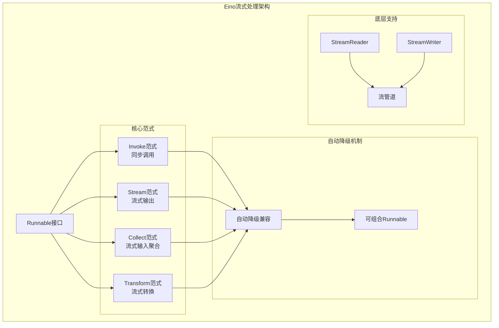
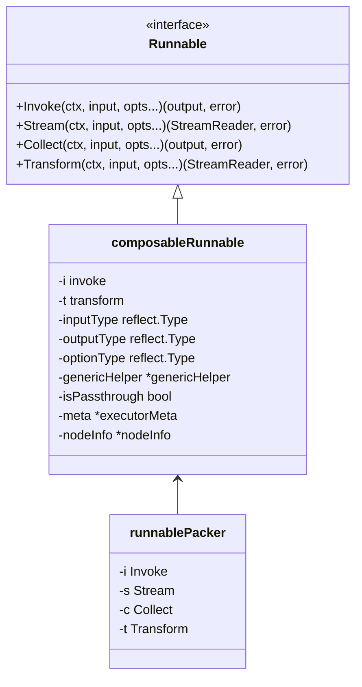
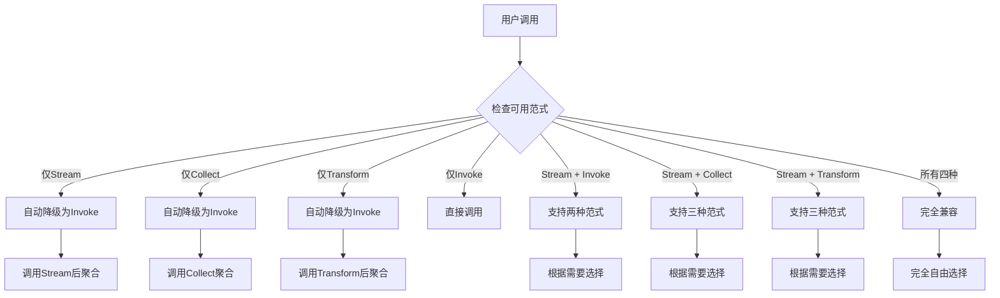

# 流式范式详解

<cite>
**本文档中引用的文件**
- [compose/runnable.go](file://compose/runnable.go)
- [compose/types.go](file://compose/types.go)
- [schema/stream.go](file://schema/stream.go)
- [components/tool/utils/streamable_func.go](file://components/tool/utils/streamable_func.go)
- [components/tool/utils/invokable_func.go](file://components/tool/utils/invokable_func.go)
- [components/tool/option.go](file://components/tool/option.go)
- [components/tool/utils/error_handler.go](file://components/tool/utils/error_handler.go)
</cite>

## 目录
1. [引言](#引言)
2. [核心架构概述](#核心架构概述)
3. [四种流式处理范式](#四种流式处理范式)
4. [Runnable接口详解](#runnable接口详解)
5. [范式间的自动降级机制](#范式间的自动降级机制)
6. [实际应用示例](#实际应用示例)
7. [最佳实践与性能考虑](#最佳实践与性能考虑)
8. [总结](#总结)

## 引言

Eino框架提供了一套统一而强大的流式处理范式，支持四种核心的数据处理模式：Invoke（同步调用）、Stream（流式输出）、Collect（流式输入聚合）和Transform（流式转换）。这些范式不仅各自独立，而且可以相互组合和自动降级，为开发者提供了极大的灵活性和便利性。

## 核心架构概述

Eino的流式处理架构基于`Runnable`接口构建，该接口定义了四种核心方法，每种方法对应不同的数据处理范式：



**图表来源**
- [compose/runnable.go](file://compose/runnable.go#L32-L36)
- [schema/stream.go](file://schema/stream.go#L77-L99)

## 四种流式处理范式

### Invoke范式（同步调用）

Invoke范式是最传统的同步处理方式，适用于一次性处理完整数据的情况。

#### 方法签名
```go
Invoke(ctx context.Context, input I, opts ...Option) (output O, err error)
```

#### 输入输出类型
- **输入类型**: `I` - 任意输入类型
- **输出类型**: `O` - 任意输出类型
- **返回值**: 处理完成后的完整输出结果

#### 适用场景
- 非流式数据处理
- 批量数据处理
- 需要完整输入才能开始处理的场景
- 简单的请求-响应模式

#### 实现特点
- 接收完整输入后立即返回结果
- 不支持增量处理
- 适合计算密集型任务

### Stream范式（流式输出）

Stream范式专门用于生成增量式输出，支持逐步产生结果。

#### 方法签名
```go
Stream(ctx context.Context, input I, opts ...Option) (output *schema.StreamReader[O], err error)
```

#### 输入输出类型
- **输入类型**: `I` - 任意输入类型
- **输出类型**: `*schema.StreamReader[O]` - 流式输出读取器
- **返回值**: 流式输出的StreamReader实例

#### 适用场景
- 增量式数据生成
- 实时数据处理
- 大数据流处理
- 需要逐步显示结果的场景

#### 实现特点
- 返回StreamReader，支持逐步读取
- 支持并发生产数据
- 内存友好，适合大数据处理
- 可以中断和恢复处理

### Collect范式（流式输入聚合）

Collect范式将流式输入聚合为单一输出，是流式处理的重要环节。

#### 方法签名
```go
Collect(ctx context.Context, input *schema.StreamReader[I], opts ...Option) (output O, err error)
```

#### 输入输出类型
- **输入类型**: `*schema.StreamReader[I]` - 流式输入读取器
- **输出类型**: `O` - 聚合后的输出类型
- **返回值**: 最终聚合结果

#### 适用场景
- 流式数据的最终聚合
- 分布式处理结果汇总
- 流式数据的批处理
- 需要等待所有流数据到达后才能处理的场景

#### 实现特点
- 接收流式输入并等待所有数据到达
- 进行数据聚合和处理
- 返回单一结果
- 支持错误处理和超时控制

### Transform范式（流式转换）

Transform范式对流进行逐块处理，支持流式转换操作。

#### 方法签名
```go
Transform(ctx context.Context, input *schema.StreamReader[I], opts ...Option) (output *schema.StreamReader[O], err error)
```

#### 输入输出类型
- **输入类型**: `*schema.StreamReader[I]` - 源流式输入读取器
- **输出类型**: `*schema.StreamReader[O]` - 转换后的流式输出读取器
- **返回值**: 转换后的StreamReader实例

#### 适用场景
- 流式数据转换
- 数据过滤和映射
- 流式数据的串联处理
- 需要保持流式特性的转换操作

#### 实现特点
- 对流进行逐块处理
- 保持流式特性
- 支持复杂的数据转换逻辑
- 可以与其他Transform组合

**章节来源**
- [compose/runnable.go](file://compose/runnable.go#L32-L36)
- [schema/stream.go](file://schema/stream.go#L140-L226)

## Runnable接口详解

Runnable接口是Eino框架的核心抽象，定义了四种流式处理范式的方法签名：



**图表来源**
- [compose/runnable.go](file://compose/runnable.go#L32-L36)
- [compose/runnable.go](file://compose/runnable.go#L46-L63)
- [compose/runnable.go](file://compose/runnable.go#L72-L79)

### 接口方法详解

#### Invoke方法
- **用途**: 同步执行，处理完整输入并返回结果
- **特点**: 一次性处理，适合简单场景
- **错误处理**: 直接返回错误，不支持流式错误传播

#### Stream方法
- **用途**: 生成流式输出，支持增量处理
- **特点**: 返回StreamReader，支持逐步读取
- **资源管理**: 需要正确关闭StreamReader

#### Collect方法
- **用途**: 聚合流式输入，生成单一输出
- **特点**: 等待所有输入到达后处理
- **性能优化**: 支持背压控制和内存管理

#### Transform方法
- **用途**: 对流进行转换处理
- **特点**: 保持流式特性，支持链式处理
- **组合能力**: 可与其他Transform组合使用

**章节来源**
- [compose/runnable.go](file://compose/runnable.go#L32-L36)
- [compose/runnable.go](file://compose/runnable.go#L46-L63)

## 范式间的自动降级机制

Eino框架最强大的特性之一是其自动降级兼容能力，允许不同范式的组件之间无缝互操作：



**图表来源**
- [compose/runnable.go](file://compose/runnable.go#L359-L397)

### 自动降级实现原理

框架通过`newRunnablePacker`函数实现自动降级：

#### Invoke降级策略
- **Stream → Invoke**: 使用`defaultImplConcatStreamReader`聚合流式输出
- **Collect → Invoke**: 将输入流转换为数组后调用Collect
- **Transform → Invoke**: 先调用Transform再聚合输出

#### Stream降级策略
- **Invoke → Stream**: 将输出包装为单元素流
- **Collect → Stream**: 先调用Collect再包装为流
- **Transform → Stream**: 先调用Transform生成流

#### Collect降级策略
- **Stream → Collect**: 先聚合输入流再调用Collect
- **Invoke → Collect**: 将输入包装为流后调用Collect
- **Transform → Collect**: 先调用Transform再聚合输出

#### Transform降级策略
- **Stream → Transform**: 先聚合输入流再调用Transform
- **Invoke → Transform**: 将输入包装为流后调用Transform
- **Collect → Transform**: 先调用Collect再包装为流

**章节来源**
- [compose/runnable.go](file://compose/runnable.go#L182-L397)

## 实际应用示例

### 同时支持Stream和Invoke的组件实现

以下是一个同时支持Stream和Invoke范式的组件实现示例：

```go
// 定义组件结构体
type MyStreamingComponent struct {
    // 组件配置和状态
}

// 实现Stream方法 - 流式输出
func (c *MyStreamingComponent) Stream(ctx context.Context, input InputType, opts ...Option) (*schema.StreamReader[OutputType], error) {
    // 创建流管道
    sr, sw := schema.Pipe[OutputType](3)
    
    // 在单独的goroutine中生成数据
    go func() {
        defer sw.Close()
        
        // 模拟数据生成过程
        for i := 0; i < 10; i++ {
            if ctx.Err() != nil {
                return // 上下文取消，停止生成
            }
            
            // 生成数据项
            output := generateOutput(input, i)
            
            // 发送数据到流
            closed := sw.Send(output, nil)
            if closed {
                return // 流已关闭，停止发送
            }
            
            // 模拟延迟
            time.Sleep(100 * time.Millisecond)
        }
    }()
    
    return sr, nil
}

// 实现Invoke方法 - 同步调用
func (c *MyStreamingComponent) Invoke(ctx context.Context, input InputType, opts ...Option) (OutputType, error) {
    // 使用Stream方法生成数据，然后聚合
    sr, err := c.Stream(ctx, input, opts...)
    if err != nil {
        return nil, err
    }
    defer sr.Close()
    
    // 聚合所有流式输出
    var results []OutputType
    for {
        output, err := sr.Recv()
        if err != nil {
            if errors.Is(err, io.EOF) {
                break
            }
            return nil, err
        }
        results = append(results, output)
    }
    
    // 聚合逻辑（这里简化为返回第一个）
    if len(results) > 0 {
        return results[0], nil
    }
    
    return nil, nil
}
```

### 工具函数的流式实现

以下是基于Eino框架的工具函数实现示例：

```go
// 流式工具实现
type StreamingTool struct {
    // 工具配置
}

// 实现StreamableTool接口
func (t *StreamingTool) StreamableRun(ctx context.Context, argumentsInJSON string, opts ...tool.Option) (*schema.StreamReader[string], error) {
    // 解析输入参数
    var input InputStruct
    if err := sonic.UnmarshalString(argumentsInJSON, &input); err != nil {
        return nil, fmt.Errorf("failed to parse input: %w", err)
    }
    
    // 创建流式输出
    sr, sw := schema.Pipe[string](5)
    
    // 并发处理
    go func() {
        defer sw.Close()
        
        // 流式处理逻辑
        for i := 0; i < input.Count; i++ {
            select {
            case <-ctx.Done():
                return // 上下文取消
            default:
                // 生成输出
                output := fmt.Sprintf("result-%d-%s", i, input.Prefix)
                
                // 发送到流
                if sw.Send(output, nil) {
                    return // 流已关闭
                }
                
                // 模拟处理时间
                time.Sleep(time.Duration(input.DelayMs) * time.Millisecond)
            }
        }
    }()
    
    return sr, nil
}

// 同时支持Invoke的工具
func (t *StreamingTool) InvokableRun(ctx context.Context, argumentsInJSON string, opts ...tool.Option) (string, error) {
    // 使用Stream方法，然后聚合结果
    sr, err := t.StreamableRun(ctx, argumentsInJSON, opts...)
    if err != nil {
        return "", err
    }
    defer sr.Close()
    
    // 聚合所有结果
    var results []string
    for {
        result, err := sr.Recv()
        if err != nil {
            if errors.Is(err, io.EOF) {
                break
            }
            return "", err
        }
        results = append(results, result)
    }
    
    // 返回聚合结果
    return strings.Join(results, ","), nil
}
```

**章节来源**
- [components/tool/utils/streamable_func.go](file://components/tool/utils/streamable_func.go#L80-L158)
- [components/tool/utils/invokable_func.go](file://components/tool/utils/invokable_func.go#L136-L221)

## 最佳实践与性能考虑

### 性能优化策略

#### 1. 流水线设计
```go
// 示例：多阶段流式处理
func PipelineExample(input *schema.StreamReader[InputType]) *schema.StreamReader[OutputType] {
    // 第一阶段：数据预处理
    stage1 := schema.StreamReaderWithConvert(input, preprocess)
    
    // 第二阶段：并行处理
    stage2 := schema.MergeStreamReaders([]schema.StreamReader[IntermediateType]{
        parallelProcess1(stage1),
        parallelProcess2(stage1),
    })
    
    // 第三阶段：结果聚合
    return schema.StreamReaderWithConvert(stage2, postprocess)
}
```

#### 2. 资源管理
- 正确关闭StreamReader
- 使用上下文控制生命周期
- 实现背压机制
- 合理设置缓冲区大小

#### 3. 错误处理
```go
// 错误处理最佳实践
func robustStreamProcessor(input *schema.StreamReader[InputType]) *schema.StreamReader[OutputType] {
    sr, sw := schema.Pipe[OutputType](3)
    
    go func() {
        defer func() {
            if r := recover(); r != nil {
                sw.Send(nil, fmt.Errorf("panic recovered: %v", r))
            }
            sw.Close()
        }()
        
        for {
            inputChunk, err := input.Recv()
            if err != nil {
                if errors.Is(err, io.EOF) {
                    break
                }
                sw.Send(nil, fmt.Errorf("input error: %w", err))
                break
            }
            
            outputChunk, err := processChunk(inputChunk)
            if err != nil {
                sw.Send(nil, fmt.Errorf("processing error: %w", err))
                continue
            }
            
            if sw.Send(outputChunk, nil) {
                break
            }
        }
    }()
    
    return sr
}
```

### 内存管理

#### 1. 缓冲区优化
```go
// 合理设置缓冲区大小
func optimizedStreamSetup(capacity int) (*schema.StreamReader[DataType], *schema.StreamWriter[DataType]) {
    // 根据数据特征调整缓冲区
    if capacity < 10 {
        capacity = 10 // 最小缓冲区
    } else if capacity > 1000 {
        capacity = 1000 // 最大缓冲区
    }
    
    return schema.Pipe[DataType](capacity)
}
```

#### 2. 自动清理
```go
// 启用自动清理
func setupAutoCleanup(sr *schema.StreamReader[DataType]) {
    sr.SetAutomaticClose()
    // Go的垃圾回收会自动处理
}
```

### 并发控制

#### 1. 限制并发度
```go
// 信号量控制并发
var semaphore = make(chan struct{}, 10) // 最大10个并发

func controlledParallelProcessing(input *schema.StreamReader[InputType]) *schema.StreamReader[OutputType] {
    sr, sw := schema.Pipe[OutputType](5)
    
    go func() {
        defer sw.Close()
        
        for {
            inputChunk, err := input.Recv()
            if err != nil {
                break
            }
            
            semaphore <- struct{}{} // 获取许可
            go func(chunk InputType) {
                defer func() { <-semaphore }() // 释放许可
                
                result := processAsync(chunk)
                sw.Send(result, nil)
            }(inputChunk)
        }
    }()
    
    return sr
}
```

**章节来源**
- [schema/stream.go](file://schema/stream.go#L259-L292)
- [components/tool/utils/error_handler.go](file://components/tool/utils/error_handler.go#L33-L78)

## 总结

Eino框架的流式处理范式提供了一个统一而强大的数据处理模型。通过Invoke、Stream、Collect和Transform四种范式，开发者可以根据具体需求选择最适合的处理方式：

1. **Invoke范式**适合简单的同步处理场景
2. **Stream范式**适合需要增量输出的实时处理
3. **Collect范式**适合流式数据的最终聚合
4. **Transform范式**适合流式数据的转换处理

框架的自动降级机制使得不同范式的组件可以无缝互操作，大大提高了开发效率和系统的灵活性。通过合理运用这些范式和最佳实践，开发者可以构建出高性能、可扩展的流式处理系统。

这种设计不仅简化了复杂的流式处理逻辑，还为未来的功能扩展提供了良好的基础。无论是简单的数据处理还是复杂的大数据流处理，Eino的流式范式都能提供合适的解决方案。