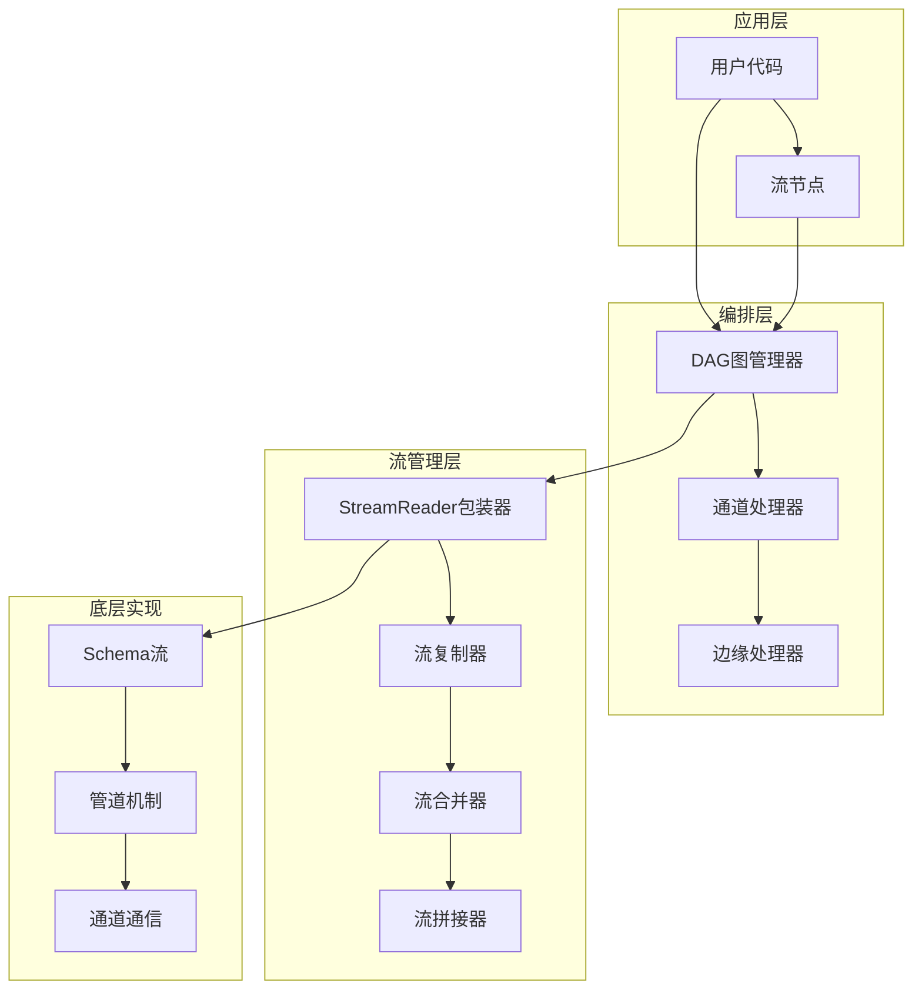
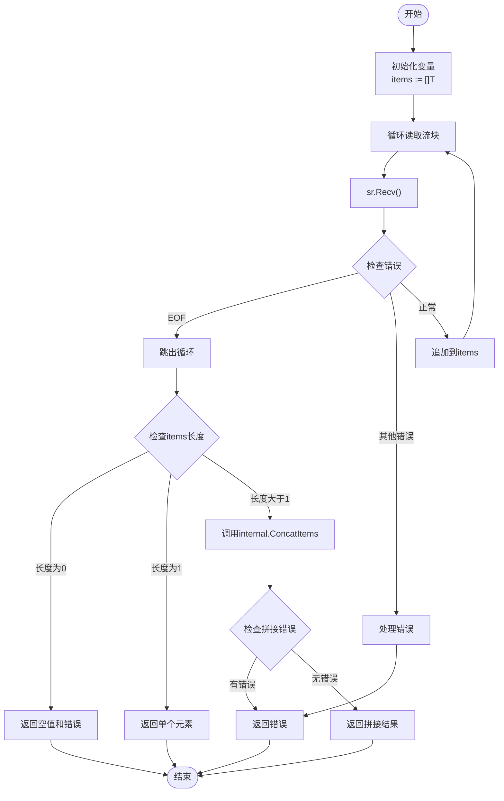
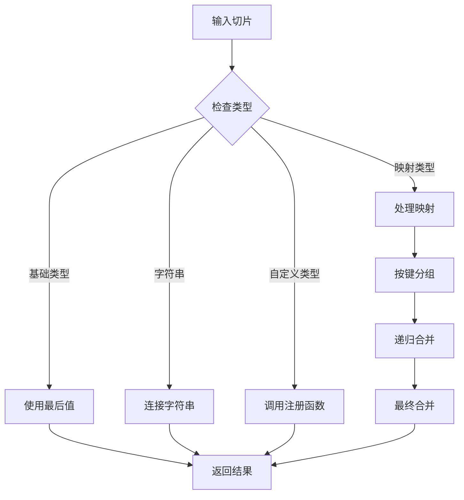
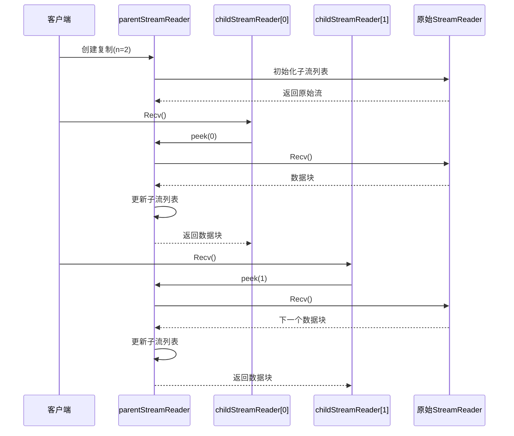
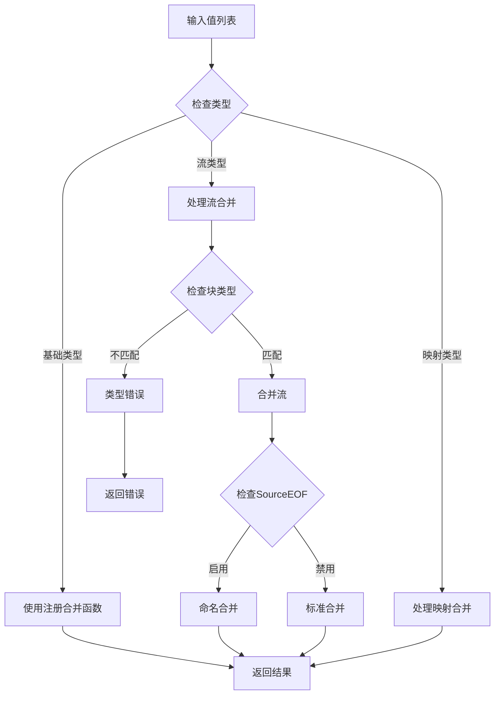
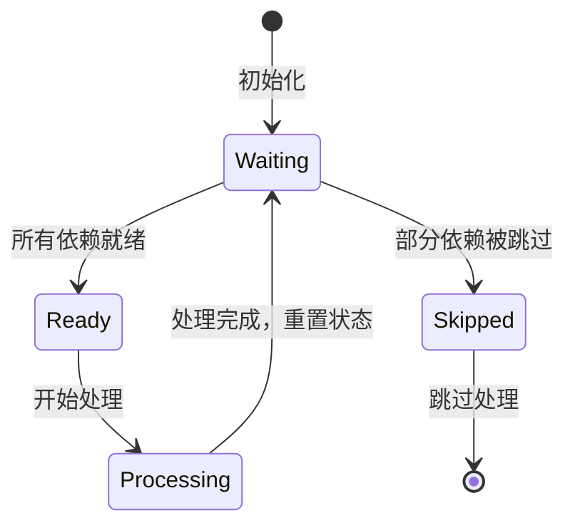
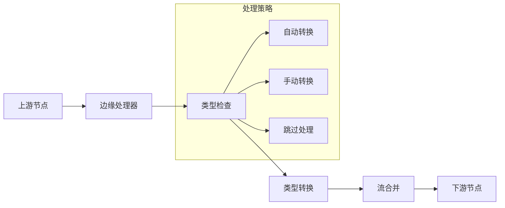
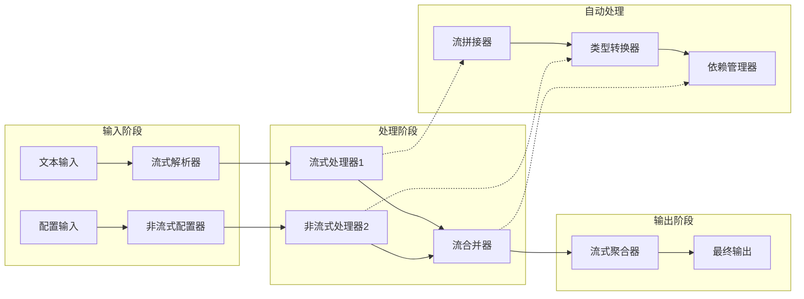

# Eino框架自动流处理机制深度解析

<cite>
**本文档引用的文件**
- [compose/stream_concat.go](file://compose/stream_concat.go)
- [compose/stream_reader.go](file://compose/stream_reader.go)
- [schema/stream.go](file://schema/stream.go)
- [compose/dag.go](file://compose/dag.go)
- [compose/values_merge.go](file://compose/values_merge.go)
- [internal/concat.go](file://internal/concat.go)
- [internal/merge.go](file://internal/merge.go)
- [compose/graph_run.go](file://compose/graph_run.go)
- [compose/graph_manager.go](file://compose/graph_manager.go)
</cite>

## 目录
1. [引言](#引言)
2. [系统架构概览](#系统架构概览)
3. [核心组件分析](#核心组件分析)
4. [流拼接机制详解](#流拼接机制详解)
5. [流复制与合并机制](#流复制与合并机制)
6. [DAG图中的流处理](#dag图中的流处理)
7. [复杂示例分析](#复杂示例分析)
8. [性能优化考虑](#性能优化考虑)
9. [故障排除指南](#故障排除指南)
10. [总结](#总结)

## 引言

Eino框架是一个强大的流式处理框架，其核心优势在于能够自动处理流式数据与非流式数据之间的转换，为开发者提供透明的流管理体验。本文档深入解析框架的自动流处理底层机制，重点关注`compose/stream_concat.go`中的`concatStreamReader`函数实现的流拼接（Concatenate）机制，以及`compose/stream_reader.go`中`streamReaderPacker`和`packStreamReader`等结构如何管理流的复制（Copy）和合并（Merge）。

## 系统架构概览

Eino框架的流处理系统采用分层架构设计，主要包含以下核心层次：



**图表来源**
- [compose/dag.go](file://compose/dag.go#L23-L40)
- [compose/stream_reader.go](file://compose/stream_reader.go#L26-L35)
- [schema/stream.go](file://schema/stream.go#L354-L370)

## 核心组件分析

### StreamReader接口体系

框架定义了完整的StreamReader接口体系，支持多种流类型的统一处理：

```mermaid
classDiagram
class StreamReader {
+Recv() T, error
+Close() void
+Copy(n int) []*StreamReader
+SetAutomaticClose() void
}
class streamReaderPacker {
-sr *StreamReader[T]
+copy(n int) []streamReader
+merge(readers []streamReader) streamReader
+withKey(key string) streamReader
+toAnyStreamReader() *StreamReader[any]
}
class stream {
-items chan streamItem[T]
-closed chan struct{}
-automaticClose bool
+send(chunk T, err error) bool
+recv() T, error
+closeSend() void
+closeRecv() void
}
class parentStreamReader {
-sr *StreamReader[T]
-subStreamList []*cpStreamElement[T]
-closedNum uint32
+peek(idx int) T, error
+close(idx int) void
}
StreamReader --> streamReaderPacker : "包装"
streamReaderPacker --> stream : "管理"
stream --> parentStreamReader : "复制"
```

**图表来源**
- [schema/stream.go](file://schema/stream.go#L158-L170)
- [compose/stream_reader.go](file://compose/stream_reader.go#L37-L40)
- [schema/stream.go](file://schema/stream.go#L357-L364)

**章节来源**
- [schema/stream.go](file://schema/stream.go#L158-L290)
- [compose/stream_reader.go](file://compose/stream_reader.go#L26-L130)

### 流包装器机制

`streamReaderPacker`是框架中负责流包装的核心组件，它实现了`streamReader`接口，提供了类型安全的流操作能力：

- **类型封装**：通过泛型参数[T]确保类型安全
- **多态支持**：实现统一的流操作接口
- **转换能力**：支持流类型转换和键值映射

**章节来源**
- [compose/stream_reader.go](file://compose/stream_reader.go#L37-L130)

## 流拼接机制详解

### concatStreamReader函数实现

`concatStreamReader`函数是框架自动流处理的核心，负责将流式输出转换为非流式输入：



**图表来源**
- [compose/stream_concat.go](file://compose/stream_concat.go#L50-L88)

该函数的关键特性：

1. **错误处理策略**：智能跳过源错误，只在无法处理时返回
2. **空流检测**：防止对空流进行不必要的拼接操作
3. **单元素优化**：当只有一个元素时直接返回，避免额外开销
4. **类型安全**：通过泛型确保类型一致性

**章节来源**
- [compose/stream_concat.go](file://compose/stream_concat.go#L50-L88)

### 内部拼接机制

框架内部的拼接机制支持多种数据类型的智能合并：



**图表来源**
- [internal/concat.go](file://internal/concat.go#L90-L111)

**章节来源**
- [internal/concat.go](file://internal/concat.go#L28-L225)

## 流复制与合并机制

### 复制机制实现

框架通过`parentStreamReader`和`childStreamReader`实现高效的流复制：



**图表来源**
- [schema/stream.go](file://schema/stream.go#L681-L790)

**章节来源**
- [schema/stream.go](file://schema/stream.go#L681-L790)

### 合并机制

流合并通过`mergeValues`函数实现，支持多种合并策略：



**图表来源**
- [compose/values_merge.go](file://compose/values_merge.go#L39-L82)

**章节来源**
- [compose/values_merge.go](file://compose/values_merge.go#L39-L82)

## DAG图中的流处理

### 通道管理系统

DAG图中的流处理通过`dagChannel`实现复杂的依赖管理和流合并：



**图表来源**
- [compose/dag.go](file://compose/dag.go#L42-L48)

**章节来源**
- [compose/dag.go](file://compose/dag.go#L23-L196)

### 边缘处理器

边缘处理器负责在流从上游节点流向下游节点时进行必要的转换和合并：



**图表来源**
- [compose/graph_manager.go](file://compose/graph_manager.go#L40-L50)

**章节来源**
- [compose/graph_manager.go](file://compose/graph_manager.go#L1-L50)

## 复杂示例分析

### 混合流处理示例

以下是一个展示框架如何透明处理混合流式与非流式组件的复杂示例：



在这个示例中：
1. **流式输入**：文本输入通过流式解析器产生流式数据
2. **非流式输入**：配置输入作为普通数据传递
3. **自动转换**：框架自动将流式输出转换为非流式输入
4. **透明处理**：开发者无需关心底层的流管理细节

### 实际应用场景

框架的自动流处理机制特别适用于以下场景：

- **实时数据处理**：如日志分析、监控数据流处理
- **批量数据转换**：将流式数据转换为批处理格式
- **微服务通信**：在服务间传输流式数据
- **AI推理管道**：处理模型推理的流式输出

## 性能优化考虑

### 内存管理

框架采用了多种内存优化策略：

1. **自动关闭机制**：通过`SetAutomaticClose()`实现垃圾回收友好的资源管理
2. **引用计数**：在流复制过程中维护正确的引用关系
3. **缓冲区优化**：合理设置流缓冲区大小以平衡延迟和吞吐量

### 并发控制

- **无锁设计**：在可能的情况下使用原子操作避免锁竞争
- **goroutine池**：复用goroutine减少创建销毁开销
- **背压处理**：通过通道阻塞机制实现自然的背压控制

## 故障排除指南

### 常见问题及解决方案

1. **流泄漏问题**
   - 症状：内存持续增长，goroutine数量异常
   - 解决：确保所有StreamReader都正确调用Close()

2. **死锁问题**
   - 症状：程序挂起，无法继续执行
   - 解决：检查流的读写顺序，避免循环依赖

3. **类型转换错误**
   - 症状：运行时类型断言失败
   - 解决：使用适当的类型转换函数或注册自定义转换器

### 调试技巧

- 使用`SetAutomaticClose()`简化资源管理
- 在关键位置添加日志记录流的状态变化
- 利用框架提供的错误源信息定位问题

## 总结

Eino框架的自动流处理机制通过精心设计的分层架构，实现了流式数据与非流式数据之间的无缝转换。核心特性包括：

1. **智能拼接**：`concatStreamReader`函数自动处理流的拼接操作
2. **透明复制**：`streamReaderPacker`提供类型安全的流复制机制
3. **灵活合并**：支持多种合并策略适应不同业务需求
4. **高效管理**：通过DAG图和通道系统实现复杂的依赖管理

这种设计不仅简化了开发者的编程复杂度，还保证了系统的高性能和可靠性。框架的自动流处理能力使得开发者可以专注于业务逻辑，而无需担心底层的流管理细节。