# 组件（Component）

<cite>
**本文档引用的文件**
- [components/types.go](file://components/types.go)
- [schema/message.go](file://schema/message.go)
- [adk/chatmodel.go](file://adk/chatmodel.go)
- [compose/component_to_graph_node.go](file://compose/component_to_graph_node.go)
- [components/model/interface.go](file://components/model/interface.go)
- [components/tool/interface.go](file://components/tool/interface.go)
- [components/retriever/interface.go](file://components/retriever/interface.go)
- [compose/graph.go](file://compose/graph.go)
- [adk/react.go](file://adk/react.go)
- [callbacks/interface.go](file://callbacks/interface.go)
- [components/model/option.go](file://components/model/option.go)
- [flow/agent/react/react.go](file://flow/agent/react/react.go)
</cite>

## 目录
1. [简介](#简介)
2. [组件核心概念](#组件核心概念)
3. [组件类型系统](#组件类型系统)
4. [接口抽象与解耦](#接口抽象与解耦)
5. [标准化消息通信](#标准化消息通信)
6. [组件编排集成](#组件编排集成)
7. [回调系统集成](#回调系统集成)
8. [选项模式配置](#选项模式配置)
9. [组件嵌套能力](#组件嵌套能力)
10. [实际应用示例](#实际应用示例)
11. [总结](#总结)

## 简介

Eino框架的组件系统是其核心架构的基础，提供了高度模块化和可扩展的解决方案。组件作为功能的原子单元，如ChatModel、Tool、Retriever等，每个组件都实现了统一的接口并支持流式处理范式。这种设计使得不同实现可以无缝替换，同时保持系统的稳定性和一致性。

## 组件核心概念

### 组件的定义

在Eino框架中，组件是具有特定功能和职责的独立模块。每个组件都遵循统一的接口规范，确保了系统的可组合性和可维护性。

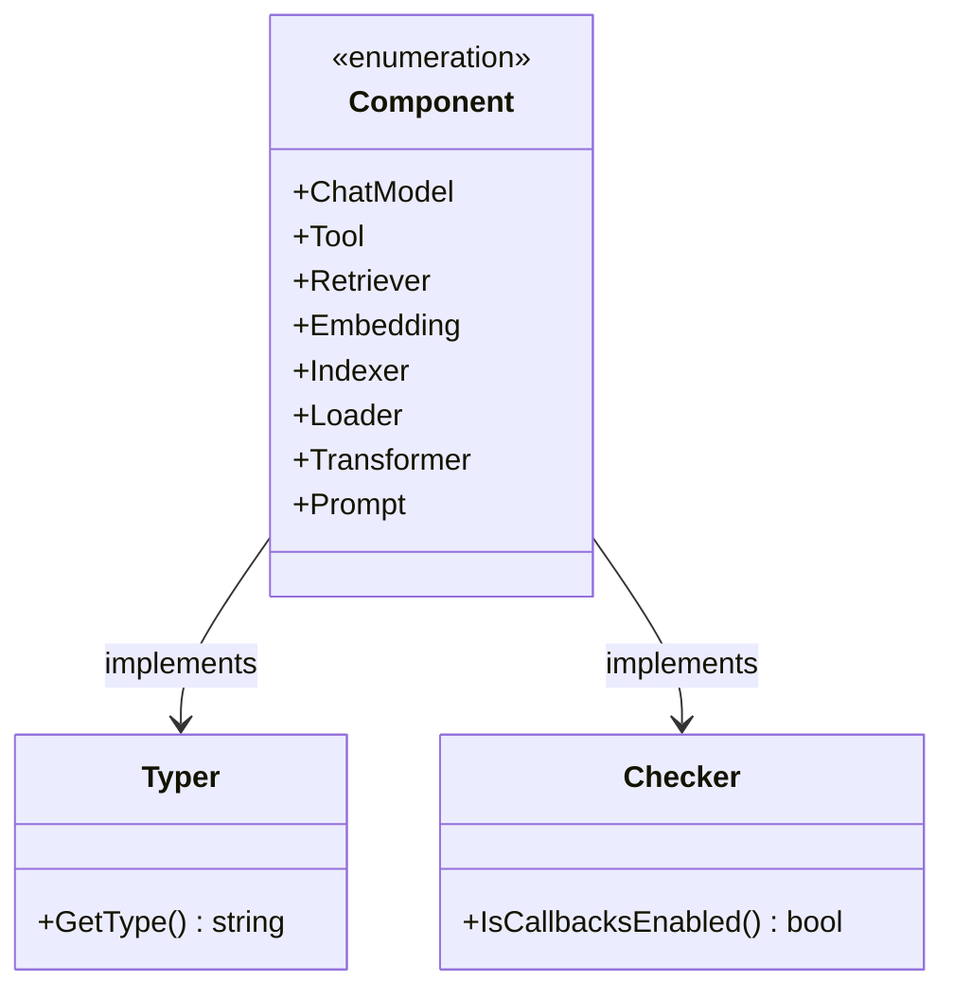

**图表来源**
- [components/types.go](file://components/types.go#L50-L62)

### 组件的生命周期

组件具有明确的生命周期管理机制，包括初始化、配置、执行和清理阶段。这种生命周期管理确保了资源的有效利用和系统的稳定性。

**章节来源**
- [components/types.go](file://components/types.go#L21-L48)

## 组件类型系统

### 核心组件类型

Eino框架定义了多种核心组件类型，每种类型都有其特定的用途和接口规范：

| 组件类型 | 描述 | 主要接口 |
|---------|------|----------|
| ChatModel | 对话模型组件 | BaseChatModel, ToolCallingChatModel |
| Tool | 工具组件 | BaseTool, InvokableTool, StreamableTool |
| Retriever | 检索组件 | Retriever |
| Embedding | 嵌入组件 | Embedder |
| Indexer | 索引组件 | Indexer |
| Loader | 加载器组件 | Loader |
| Transformer | 转换器组件 | Transformer |
| Prompt | 提示模板组件 | ChatTemplate |

### 组件标识系统

每个组件都有唯一的类型标识符，用于框架内部的识别和管理：

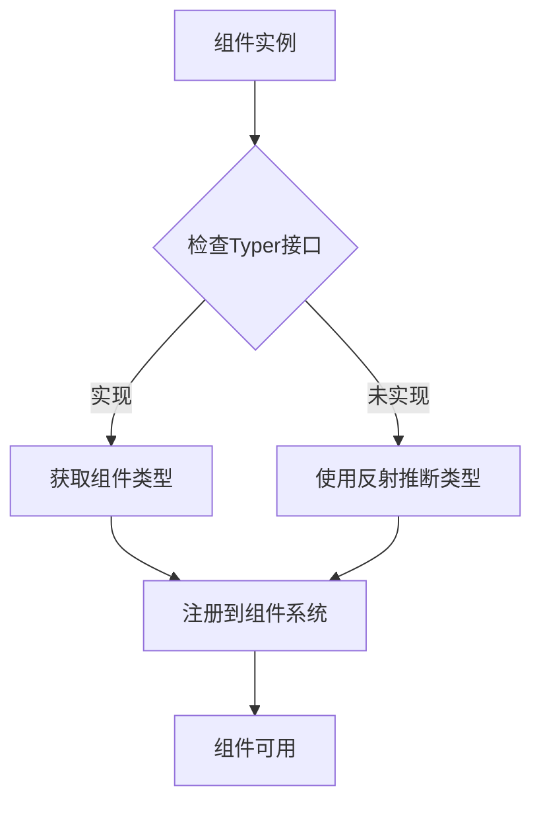

**图表来源**
- [components/types.go](file://components/types.go#L27-L33)

**章节来源**
- [components/types.go](file://components/types.go#L53-L62)

## 接口抽象与解耦

### 统一接口设计

Eino框架通过统一的接口设计实现了组件间的解耦。每个组件类型都定义了清晰的输入输出规范，使得不同实现可以互换而不影响上层逻辑。

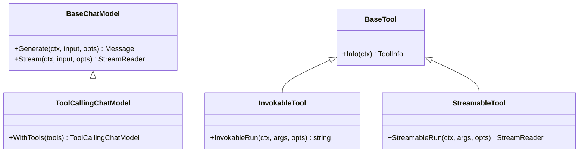

**图表来源**
- [components/model/interface.go](file://components/model/interface.go#L30-L56)
- [components/tool/interface.go](file://components/tool/interface.go#L25-L43)

### 流式处理范式

所有组件都支持流式处理，这使得系统能够高效地处理大量数据和实时交互：

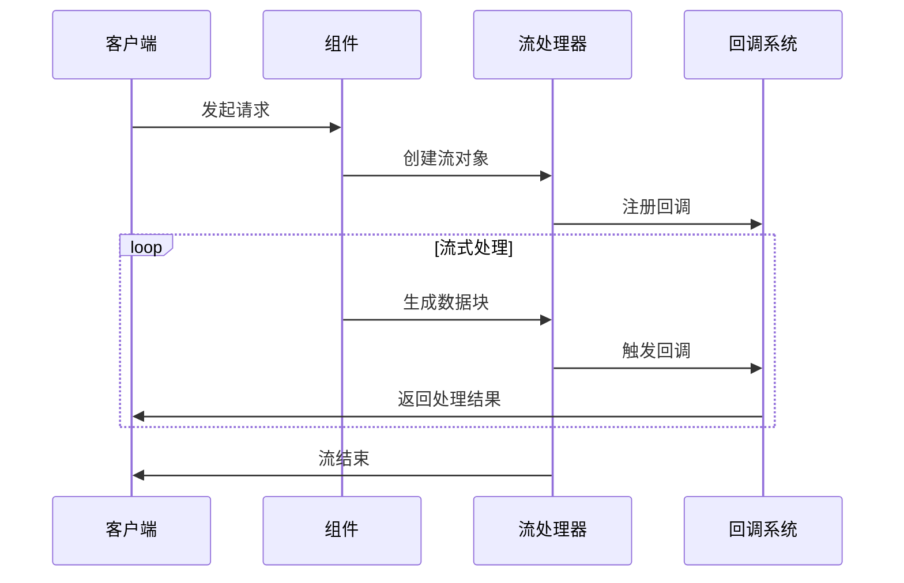

**图表来源**
- [components/model/interface.go](file://components/model/interface.go#L31-L33)

**章节来源**
- [components/model/interface.go](file://components/model/interface.go#L25-L56)
- [components/tool/interface.go](file://components/tool/interface.go#L25-L43)

## 标准化消息通信

### Message数据结构

Eino框架使用标准化的Message结构作为组件间通信的基础。这个结构支持多种消息类型和多媒体内容：

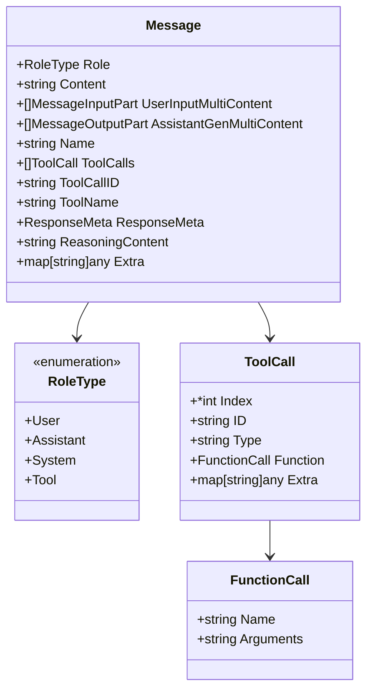

**图表来源**
- [schema/message.go](file://schema/message.go#L433-L467)

### 多模态内容支持

Message结构支持文本、图像、音频、视频等多种媒体类型的混合内容：

| 内容类型 | 输入格式 | 输出格式 | 使用场景 |
|---------|----------|----------|----------|
| 文本 | Content字段 | Content字段 | 基础文本交流 |
| 图像 | UserInputMultiContent | AssistantGenMultiContent | 图像描述、分析 |
| 音频 | UserInputMultiContent | AssistantGenMultiContent | 语音识别、合成 |
| 视频 | UserInputMultiContent | AssistantGenMultiContent | 视频内容分析 |
| 文件 | UserInputMultiContent | AssistantGenMultiContent | 文档处理、分析 |

**章节来源**
- [schema/message.go](file://schema/message.go#L433-L467)

## 组件编排集成

### Graph编排系统

Eino框架通过Graph编排系统将各个组件连接起来，形成复杂的应用流程：

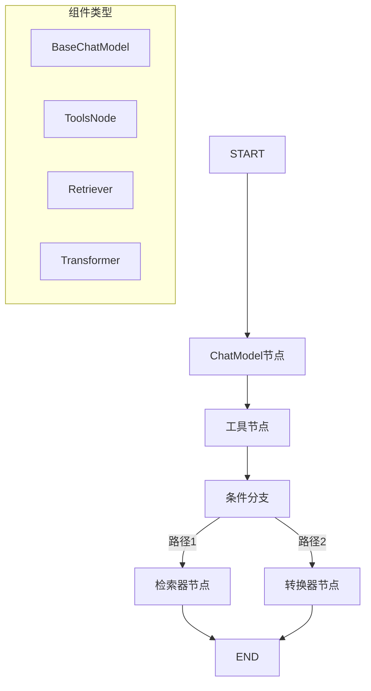

**图表来源**
- [compose/graph.go](file://compose/graph.go#L58-L89)

### 组件注入机制

框架提供了多种方式将组件注入到Graph编排中：

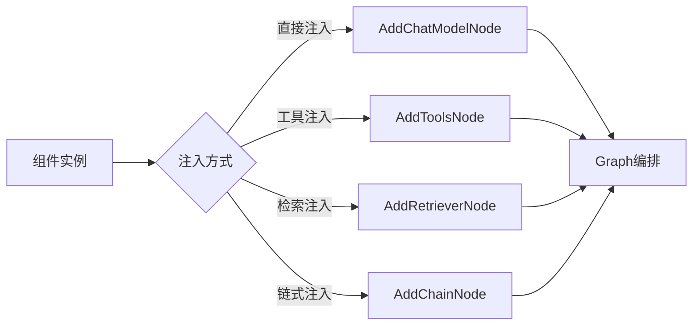

**图表来源**
- [compose/component_to_graph_node.go](file://compose/component_to_graph_node.go#L29-L101)

**章节来源**
- [compose/graph.go](file://compose/graph.go#L296-L401)
- [compose/component_to_graph_node.go](file://compose/component_to_graph_node.go#L49-L101)

## 回调系统集成

### 回调机制概述

Eino框架的回调系统为组件提供了强大的扩展能力，允许在组件执行的不同阶段插入自定义逻辑：

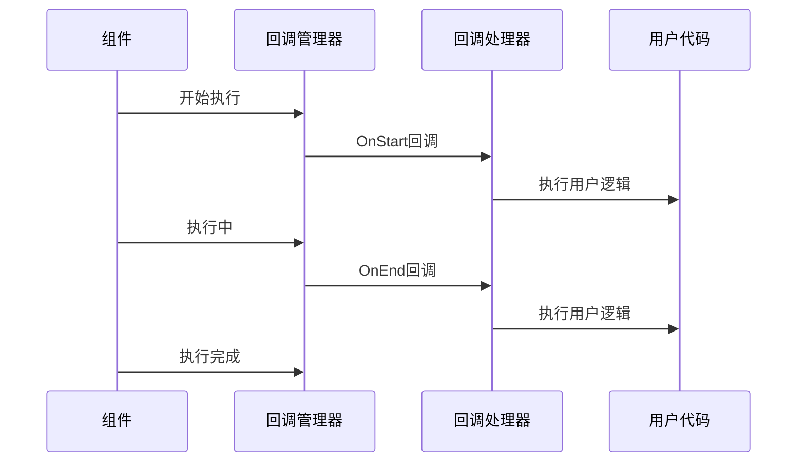

**图表来源**
- [callbacks/interface.go](file://callbacks/interface.go#L71-L77)

### 回调时机控制

框架支持多种回调时机，确保精确的控制点：

| 回调时机 | 触发条件 | 使用场景 |
|---------|----------|----------|
| TimingOnStart | 组件开始执行前 | 初始化、预处理 |
| TimingOnEnd | 组件执行完成后 | 清理、后处理 |
| TimingOnError | 组件执行出错时 | 错误处理、日志记录 |
| TimingOnStartWithStreamInput | 流式输入开始时 | 流式处理初始化 |
| TimingOnEndWithStreamOutput | 流式输出结束时 | 流式处理完成处理 |

**章节来源**
- [callbacks/interface.go](file://callbacks/interface.go#L69-L84)

## 选项模式配置

### 选项系统设计

Eino框架采用选项模式（Option Pattern）来配置组件行为，这种方式提供了灵活且类型安全的配置方式：

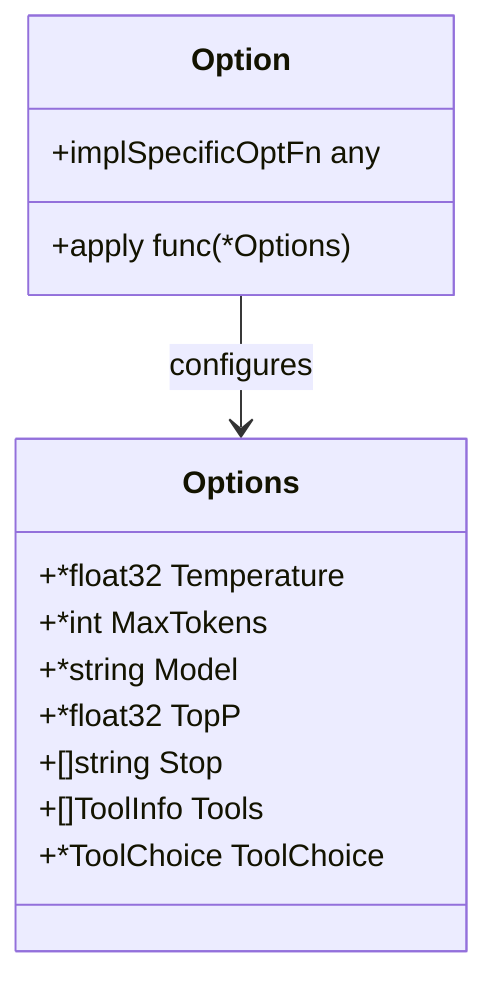

**图表来源**
- [components/model/option.go](file://components/model/option.go#L39-L42)

### 常用配置选项

框架提供了丰富的配置选项来满足不同的使用需求：

| 选项类型 | 功能描述 | 示例用法 |
|---------|----------|----------|
| WithTemperature | 设置温度参数 | WithTemperature(0.7) |
| WithMaxTokens | 设置最大令牌数 | WithMaxTokens(1000) |
| WithModel | 设置模型名称 | WithModel("gpt-4") |
| WithTopP | 设置Top-P采样 | WithTopP(0.9) |
| WithStop | 设置停止词 | WithStop([]string{"\n"}) |
| WithTools | 设置工具列表 | WithTools(toolList) |
| WithToolChoice | 设置工具选择策略 | WithToolChoice("auto") |

**章节来源**
- [components/model/option.go](file://components/model/option.go#L46-L110)

## 组件嵌套能力

### 嵌套组件架构

Eino框架支持组件的嵌套，允许复杂的业务逻辑封装在单一组件中：

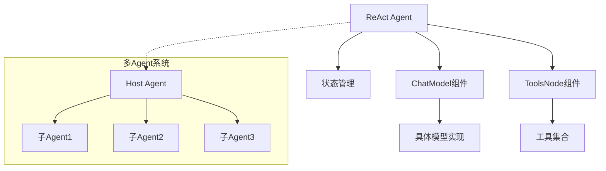

**图表来源**
- [adk/chatmodel.go](file://adk/chatmodel.go#L148-L169)
- [flow/agent/react/react.go](file://flow/agent/react/react.go#L164-L192)

### ReAct Agent示例

ReAct Agent是一个典型的嵌套组件示例，它内部包含了多个子组件：

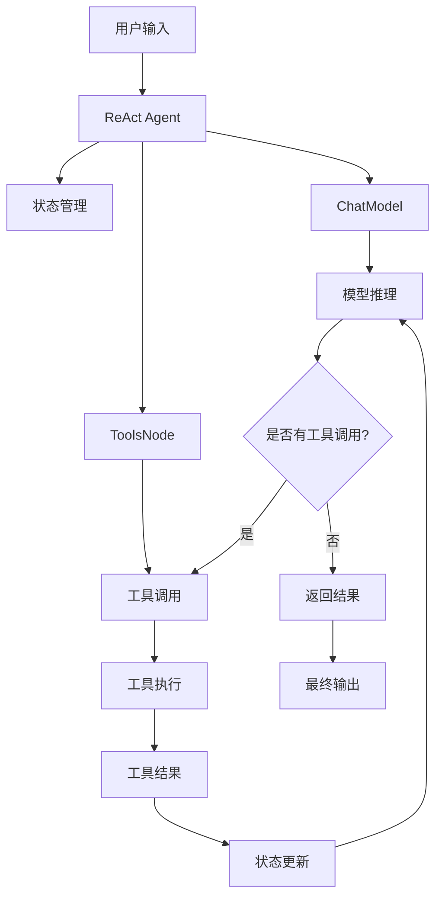

**图表来源**
- [adk/react.go](file://adk/react.go#L121-L150)

### 嵌套组件的优势

1. **封装复杂逻辑**：将复杂的业务逻辑封装在单一组件中
2. **保持接口简洁**：外部使用者无需了解内部实现细节
3. **提高复用性**：复杂的组件可以在多个场景中复用
4. **简化编排**：在Graph编排中可以像普通组件一样使用

**章节来源**
- [adk/chatmodel.go](file://adk/chatmodel.go#L587-L629)
- [adk/react.go](file://adk/react.go#L121-L150)

## 实际应用示例

### 使用ChatModel接口调用LLM

以下展示了如何使用ChatModel接口调用大型语言模型：

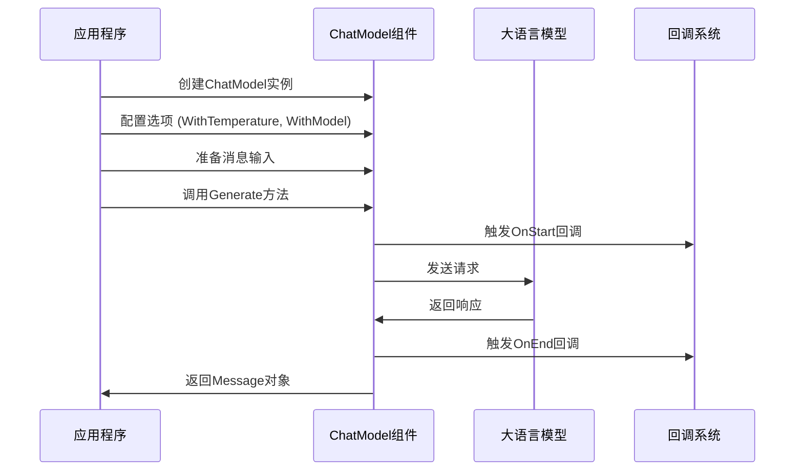

**图表来源**
- [components/model/interface.go](file://components/model/interface.go#L31-L33)

### 自定义组件注入到Graph编排

展示如何将自定义组件注入到Graph编排中：

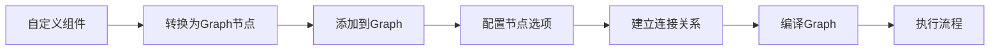

**图表来源**
- [compose/component_to_graph_node.go](file://compose/component_to_graph_node.go#L29-L47)

### 选项模式在组件配置中的应用

演示选项模式在组件配置中的实际应用：

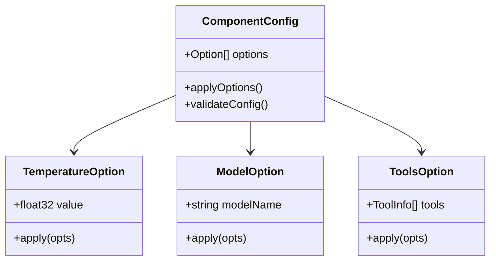

**图表来源**
- [components/model/option.go](file://components/model/option.go#L112-L159)

**章节来源**
- [adk/chatmodel.go](file://adk/chatmodel.go#L177-L203)
- [components/model/interface.go](file://components/model/interface.go#L30-L56)

## 总结

Eino框架的组件系统通过以下核心特性实现了高度的模块化和可扩展性：

1. **统一的接口抽象**：所有组件都遵循相同的接口规范，实现了真正的解耦
2. **标准化的消息通信**：通过Message结构支持多种内容类型和流式处理
3. **灵活的编排集成**：通过Graph编排系统实现组件间的无缝连接
4. **强大的回调系统**：提供精确的执行时机控制和扩展能力
5. **类型安全的配置**：通过选项模式实现灵活且安全的组件配置
6. **嵌套能力**：支持复杂业务逻辑的封装和复用

这种设计使得开发者能够快速构建复杂的AI应用，同时保持代码的可维护性和扩展性。组件系统不仅简化了开发过程，还为未来的功能扩展奠定了坚实的基础。