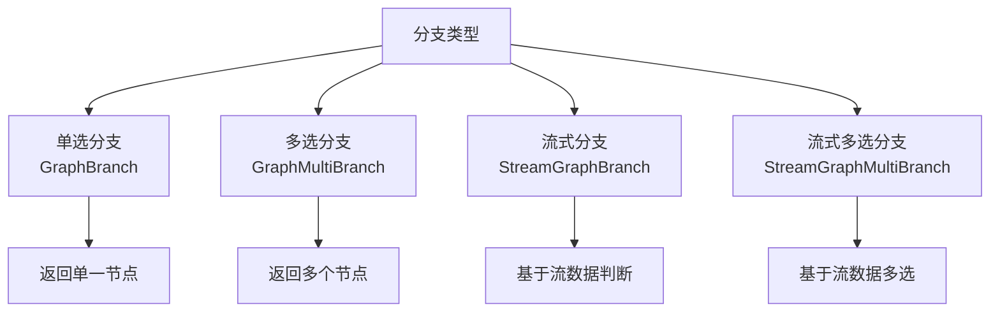
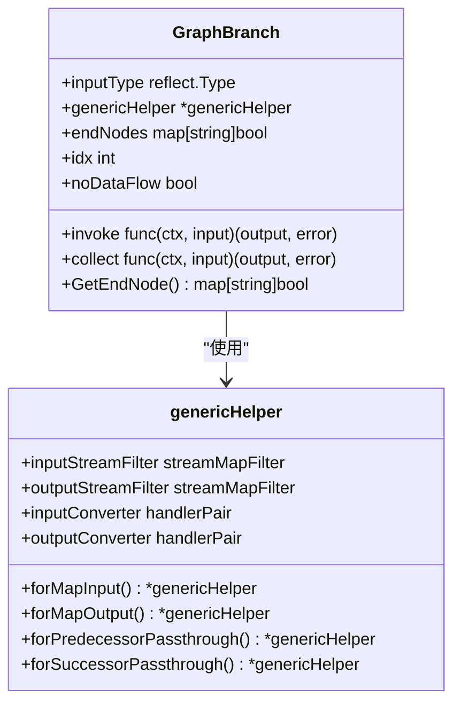
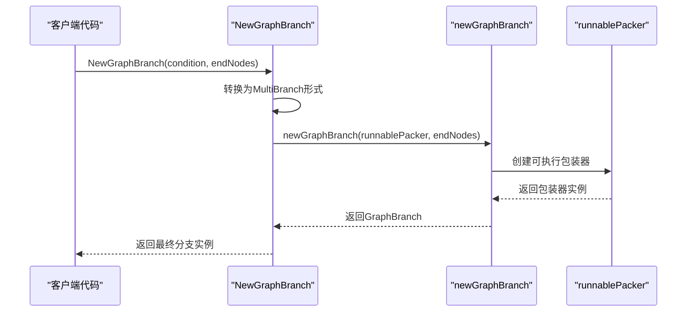
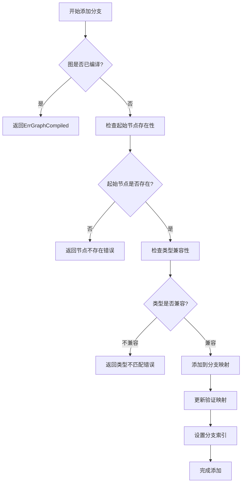
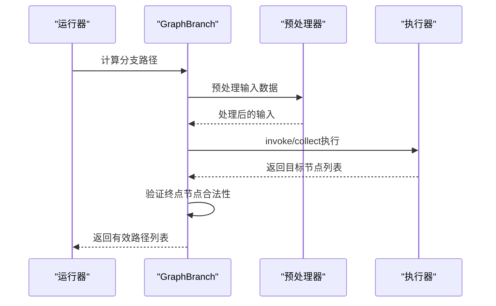
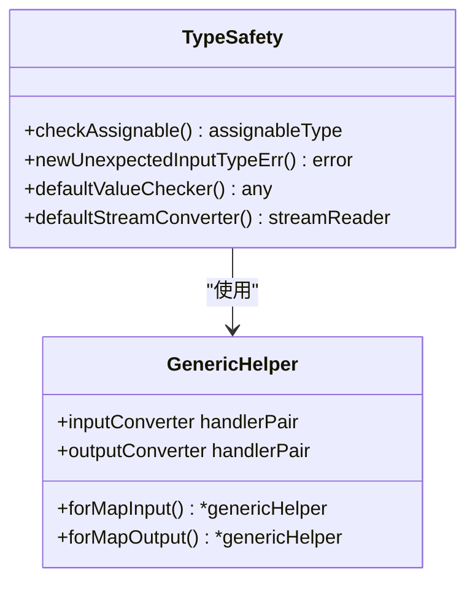
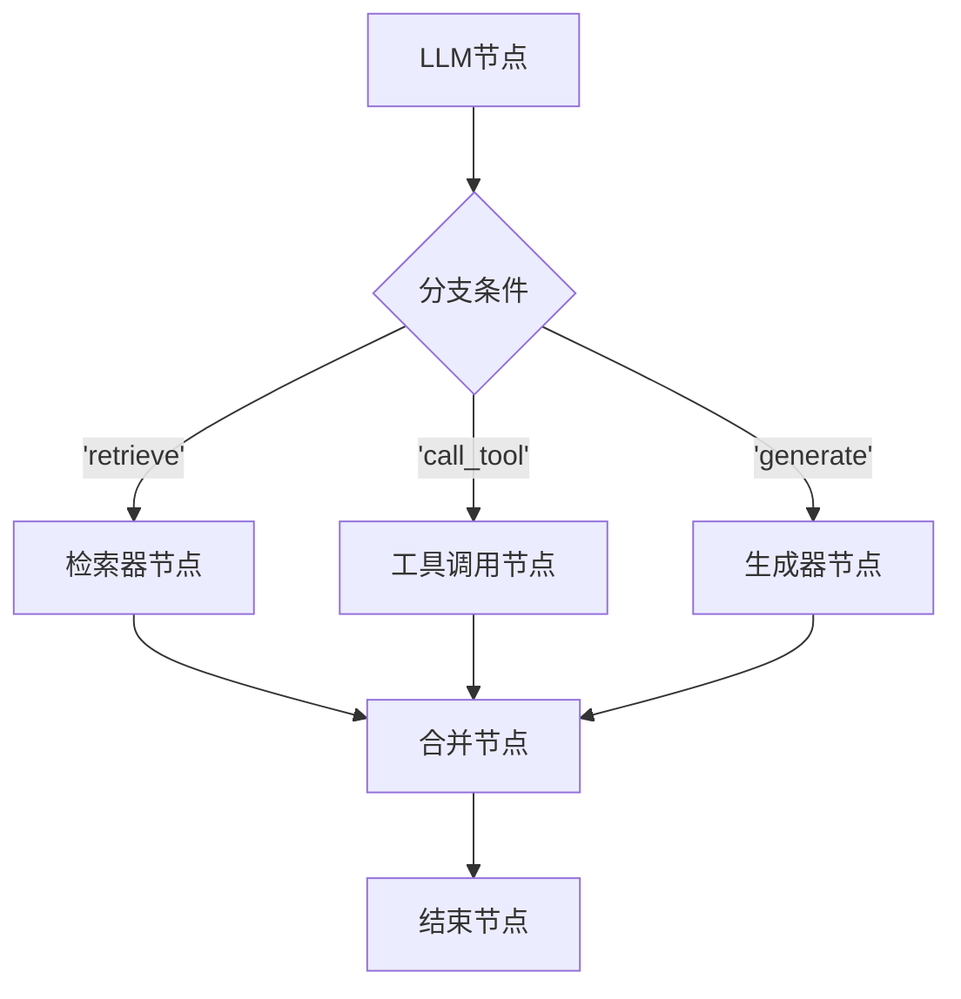
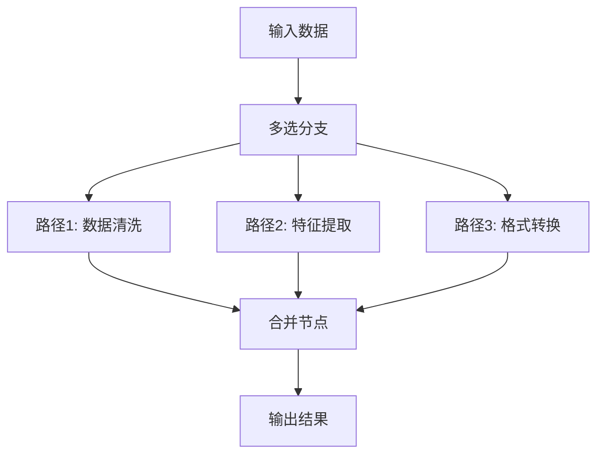

# 分支（Branch）

<cite>
**本文档引用的文件**
- [branch.go](file://compose/branch.go)
- [branch_test.go](file://compose/branch_test.go)
- [types.go](file://compose/types.go)
- [stream_reader.go](file://compose/stream_reader.go)
- [graph.go](file://compose/graph.go)
- [runnable.go](file://compose/runnable.go)
- [generic_helper.go](file://compose/generic_helper.go)
- [error.go](file://compose/error.go)
- [chain_branch.go](file://compose/chain_branch.go)
</cite>

## 目录
1. [简介](#简介)
2. [核心概念](#核心概念)
3. [GraphBranch结构体设计](#graphbranch结构体设计)
4. [分支条件函数](#分支条件函数)
5. [构造函数详解](#构造函数详解)
6. [分支添加机制](#分支添加机制)
7. [运行时执行流程](#运行时执行流程)
8. [类型安全与流式处理](#类型安全与流式处理)
9. [多选分支与链式分支](#多选分支与链式分支)
10. [常见配置错误与解决方案](#常见配置错误与解决方案)
11. [实际应用示例](#实际应用示例)
12. [总结](#总结)

## 简介

Eino框架的分支（Branch）机制是一种实现运行时动态决策的核心功能，允许根据前驱节点的输出结果动态选择后续执行路径。这种机制为复杂的业务逻辑提供了灵活的控制流管理能力，特别是在需要基于条件进行不同处理场景的应用中。

分支系统通过`GraphBranch`结构体实现，支持同步和异步两种执行模式，能够处理不同类型的数据输入，并提供完善的类型安全保证和错误处理机制。

## 核心概念

### 分支的基本组成

分支系统由以下核心组件构成：

1. **条件函数**：根据输入数据决定执行路径的判断逻辑
2. **终点映射**：定义合法的结束节点集合
3. **执行器**：负责实际的分支逻辑执行
4. **类型处理器**：确保类型安全和转换

### 分支类型分类



## GraphBranch结构体设计

`GraphBranch`是分支系统的核心数据结构，负责封装分支的所有相关信息和执行逻辑。

### 结构体字段详解



**图表来源**
- [branch.go](file://compose/branch.go#L40-L50)
- [generic_helper.go](file://compose/generic_helper.go#L57-L69)

### 关键字段说明

| 字段 | 类型 | 描述 |
|------|------|------|
| `invoke` | `func(ctx, input) (output, error)` | 同步执行分支逻辑的主要入口 |
| `collect` | `func(ctx, input) (output, error)` | 异步流式执行分支逻辑的入口 |
| `inputType` | `reflect.Type` | 分支条件函数的输入类型 |
| `genericHelper` | `*genericHelper` | 泛型辅助处理器，提供类型转换功能 |
| `endNodes` | `map[string]bool` | 定义合法的终点节点集合 |
| `idx` | `int` | 并行分支索引，用于区分同一节点的多个分支 |
| `noDataFlow` | `bool` | 标记是否跳过数据流处理 |

**节来源**
- [branch.go](file://compose/branch.go#L40-L50)

## 分支条件函数

分支系统定义了多种类型的条件函数，每种都针对不同的使用场景进行了优化。

### 条件函数类型定义

```mermaid
graph LR
A[分支条件函数] --> B[GraphBranchCondition]
A --> C[StreamGraphBranchCondition]
A --> D[GraphMultiBranchCondition]
A --> E[StreamGraphMultiBranchCondition]
B --> F[T] --> G[string]
C --> H[*StreamReader[T]] --> I[string]
D --> J[T] --> K[map[string]bool]
E --> L[*StreamReader[T]] --> M[map[string]bool]
```

**图表来源**
- [branch.go](file://compose/branch.go#L28-L38)

### 条件函数接口说明

| 函数类型 | 输入参数 | 返回值 | 使用场景 |
|----------|----------|--------|----------|
| `GraphBranchCondition` | `ctx context.Context, in T` | `string, error` | 单一路径选择 |
| `StreamGraphBranchCondition` | `ctx context.Context, in *StreamReader[T]` | `string, error` | 流式数据路径选择 |
| `GraphMultiBranchCondition` | `ctx context.Context, in T` | `map[string]bool, error` | 多路径选择 |
| `StreamGraphMultiBranchCondition` | `ctx context.Context, in *StreamReader[T]` | `map[string]bool, error` | 流式多路径选择 |

**节来源**
- [branch.go](file://compose/branch.go#L28-L38)

## 构造函数详解

Eino框架提供了多个构造函数来创建不同类型的分支实例。

### 基础分支构造

#### NewGraphBranch



**图表来源**
- [branch.go](file://compose/branch.go#L141-L149)

#### NewStreamGraphBranch

流式分支专门处理流式数据输入，能够在数据流传输过程中做出决策。

**节来源**
- [branch.go](file://compose/branch.go#L141-L172)

### 多选分支构造

#### NewGraphMultiBranch

多选分支允许同时选择多个执行路径，适用于需要并行处理的场景。

#### NewStreamGraphMultiBranch

流式多选分支结合了流式处理和多路径选择的优势。

**节来源**
- [branch.go](file://compose/branch.go#L87-L127)

## 分支添加机制

分支通过`AddBranch`方法添加到图中，该过程涉及类型验证和依赖关系建立。

### 添加流程图



**图表来源**
- [graph.go](file://compose/graph.go#L431-L515)

### 类型验证机制

分支添加过程包含严格的类型验证，确保条件函数的输入类型与起始节点的输出类型兼容。

**节来源**
- [graph.go](file://compose/graph.go#L431-L515)

## 运行时执行流程

分支在运行时的执行遵循特定的流程，确保正确的路径选择和数据传递。

### 执行序列图



**图表来源**
- [graph_run.go](file://compose/graph_run.go#L763-L810)

### 路径选择算法

分支执行的核心算法包括以下几个步骤：

1. **输入预处理**：应用类型转换和验证
2. **条件评估**：执行分支条件函数
3. **路径过滤**：确保只返回合法的终点节点
4. **冲突解决**：处理多个分支选择相同节点的情况

**节来源**
- [graph_run.go](file://compose/graph_run.go#L763-L810)

## 类型安全与流式处理

分支系统提供了完善的类型安全保障和流式数据处理能力。

### 类型安全机制



**图表来源**
- [generic_helper.go](file://compose/generic_helper.go#L57-L69)
- [error.go](file://compose/error.go#L29-L31)

### 流式数据处理

流式分支通过`StreamReader`接口处理数据流，在数据传输过程中做出实时决策。

**节来源**
- [stream_reader.go](file://compose/stream_reader.go#L26-L35)

## 多选分支与链式分支

### 多选分支特性

多选分支允许同时选择多个执行路径，适用于需要并行处理的复杂业务逻辑。

### 链式分支系统

链式分支是专门为链式结构设计的分支实现，提供了特殊的节点映射和路径转换功能。

**节来源**
- [chain_branch.go](file://compose/chain_branch.go#L37-L107)

## 常见配置错误与解决方案

### 类型不匹配错误

**错误描述**：分支条件函数的输入类型与起始节点的输出类型不兼容。

**解决方案**：
- 检查起始节点的输出类型定义
- 确保分支条件函数的输入类型正确
- 使用适当的类型转换函数

### 终点节点未定义错误

**错误描述**：分支返回的终点节点不在预定义的合法节点集合中。

**解决方案**：
- 在创建分支时正确指定`endNodes`映射
- 确保所有预期的终点节点都已添加到图中
- 使用`map[string]bool`明确标识合法终点

### 分支索引冲突

**错误描述**：多个分支在同一起始节点上产生索引冲突。

**解决方案**：
- 理解`idx`字段的作用机制
- 避免在同一节点上重复添加相似的分支
- 使用有意义的分支命名策略

**节来源**
- [branch.go](file://compose/branch.go#L65-L80)
- [error.go](file://compose/error.go#L29-L31)

## 实际应用示例

### LLM决策分支示例

考虑一个基于大型语言模型的决策系统，其中LLM节点输出决策指令，分支逻辑根据指令内容决定后续处理路径：



在这个示例中，分支系统根据LLM的输出指令动态选择不同的处理路径，实现了灵活的业务逻辑控制。

### 多路径并行处理

对于需要并行处理多个任务的场景，可以使用多选分支：



## 总结

Eino框架的分支（Branch）机制提供了一套完整而强大的运行时动态决策解决方案。通过`GraphBranch`结构体的设计，结合多种类型的条件函数和完善的类型安全机制，开发者可以构建出灵活、可维护的复杂业务逻辑。

### 主要优势

1. **类型安全**：编译时和运行时的双重类型检查
2. **灵活性**：支持单选、多选、同步和异步等多种执行模式
3. **可扩展性**：易于添加新的分支类型和条件函数
4. **性能优化**：针对不同场景的专门优化实现

### 最佳实践建议

1. **合理设计分支条件**：确保条件函数的逻辑清晰且高效
2. **正确管理终点节点**：避免出现未定义的终点节点
3. **注意类型转换**：充分利用泛型辅助处理器的功能
4. **监控分支性能**：在高并发场景下关注分支执行的性能影响

分支机制作为Eino框架的核心功能之一，为构建复杂的AI工作流和业务逻辑提供了坚实的基础，是实现智能化决策系统的重要工具。