# 图式编排（Graph）

<cite>
**本文档引用的文件**
- [compose/graph.go](file://compose/graph.go)
- [compose/generic_graph.go](file://compose/generic_graph.go)
- [compose/dag.go](file://compose/dag.go)
- [compose/pregel.go](file://compose/pregel.go)
- [compose/graph_node.go](file://compose/graph_node.go)
- [compose/branch.go](file://compose/branch.go)
- [compose/graph_run.go](file://compose/graph_run.go)
- [compose/types.go](file://compose/types.go)
- [compose/state.go](file://compose/state.go)
- [compose/types_composable.go](file://compose/types_composable.go)
- [adk/react.go](file://adk/react.go)
- [flow/agent/multiagent/host/compose.go](file://flow/agent/multiagent/host/compose.go)
- [flow/agent/react/react.go](file://flow/agent/react/react.go)
</cite>

## 目录
1. [简介](#简介)
2. [核心架构](#核心架构)
3. [Graph结构体详解](#graph结构体详解)
4. [节点管理](#节点管理)
5. [边连接机制](#边连接机制)
6. [分支控制](#分支控制)
7. [运行模式](#运行模式)
8. [状态管理](#状态管理)
9. [复杂决策流程示例](#复杂决策流程示例)
10. [性能特性](#性能特性)
11. [与Chain模式对比](#与chain模式对比)
12. [最佳实践](#最佳实践)

## 简介

Eino框架的Graph编排模式是一种基于有向无环图（DAG）的高级流程控制机制，它提供了比传统链式模式更强大和灵活的工作流编排能力。Graph模式支持复杂的控制流和数据流，能够实现基于条件的运行时分支决策、全局状态管理和并发执行。

Graph编排模式的核心优势在于：
- **灵活性**：支持复杂的控制流和数据流
- **可扩展性**：易于添加新的节点和分支
- **并发性**：支持并行执行多个独立路径
- **状态共享**：提供全局状态管理机制
- **类型安全**：编译时类型检查和验证

## 核心架构

Graph编排模式采用分层架构设计，主要包含以下核心组件：

```mermaid
graph TB
subgraph "Graph编排架构"
Graph[Graph[I, O]] --> GraphStruct[graph结构体]
GraphStruct --> Nodes[nodes映射]
GraphStruct --> ControlEdges[controlEdges映射]
GraphStruct --> DataEdges[dataEdges映射]
GraphStruct --> Branches[branches映射]
Nodes --> GraphNode[graphNode]
GraphNode --> ComposableRunnable[composableRunnable]
ControlEdges --> EdgeConnection[边连接]
DataEdges --> DataFlow[数据流]
Branches --> GraphBranch[GraphBranch]
GraphStruct --> StateManagement[状态管理]
StateManagement --> GlobalState[全局状态]
StateManagement --> LocalState[局部状态]
end
```

**图表来源**
- [compose/graph.go](file://compose/graph.go#L57-L90)
- [compose/graph_node.go](file://compose/graph_node.go#L60-L70)

**章节来源**
- [compose/graph.go](file://compose/graph.go#L57-L90)
- [compose/generic_graph.go](file://compose/generic_graph.go#L89-L91)

## Graph结构体详解

`Graph[I, O]`结构体是整个编排系统的核心，它管理着所有节点、边和分支的关系：

### 内部结构组成

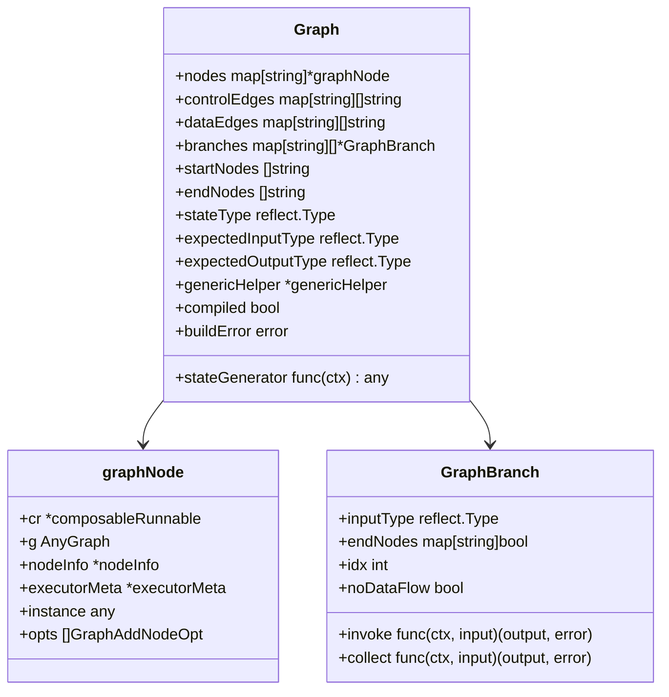

**图表来源**
- [compose/graph.go](file://compose/graph.go#L57-L90)
- [compose/graph_node.go](file://compose/graph_node.go#L60-L70)
- [compose/branch.go](file://compose/branch.go#L40-L50)

### 关键字段说明

| 字段 | 类型 | 描述 |
|------|------|------|
| `nodes` | `map[string]*graphNode` | 存储所有节点及其配置信息 |
| `controlEdges` | `map[string][]string` | 控制依赖关系，决定执行顺序 |
| `dataEdges` | `map[string][]string` | 数据流连接，传递计算结果 |
| `branches` | `map[string][]*GraphBranch` | 条件分支定义 |
| `startNodes` | `[]string` | 起始节点列表 |
| `endNodes` | `[]string` | 结束节点列表 |
| `stateType` | `reflect.Type` | 全局状态类型 |
| `stateGenerator` | `func(ctx) any` | 状态生成函数 |

**章节来源**
- [compose/graph.go](file://compose/graph.go#L57-L90)

## 节点管理

Graph提供了丰富的节点管理功能，支持多种类型的组件作为节点：

### 节点类型分类

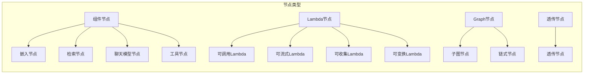

**图表来源**
- [compose/graph.go](file://compose/graph.go#L296-L420)

### 节点添加方法

Graph提供了专门的方法来添加不同类型的节点：

| 方法 | 用途 | 示例 |
|------|------|------|
| `AddEmbeddingNode()` | 添加嵌入组件节点 | 文本向量化 |
| `AddRetrieverNode()` | 添加检索组件节点 | 文档检索 |
| `AddChatModelNode()` | 添加聊天模型节点 | 大语言模型调用 |
| `AddToolsNode()` | 添加工具节点 | 工具调用 |
| `AddLambdaNode()` | 添加Lambda函数节点 | 自定义逻辑处理 |
| `AddGraphNode()` | 添加子图或链式节点 | 复杂工作流 |
| `AddPassthroughNode()` | 添加透传节点 | 数据传递 |

**章节来源**
- [compose/graph.go](file://compose/graph.go#L296-L420)

## 边连接机制

边连接是Graph编排模式的核心机制，负责建立节点间的控制依赖和数据流关系：

### 边的类型

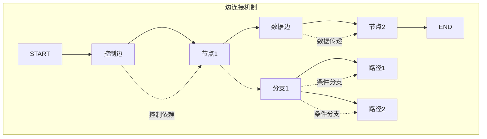

**图表来源**
- [compose/graph.go](file://compose/graph.go#L232-L294)

### AddEdge方法详解

`AddEdge`方法用于建立节点间的连接：

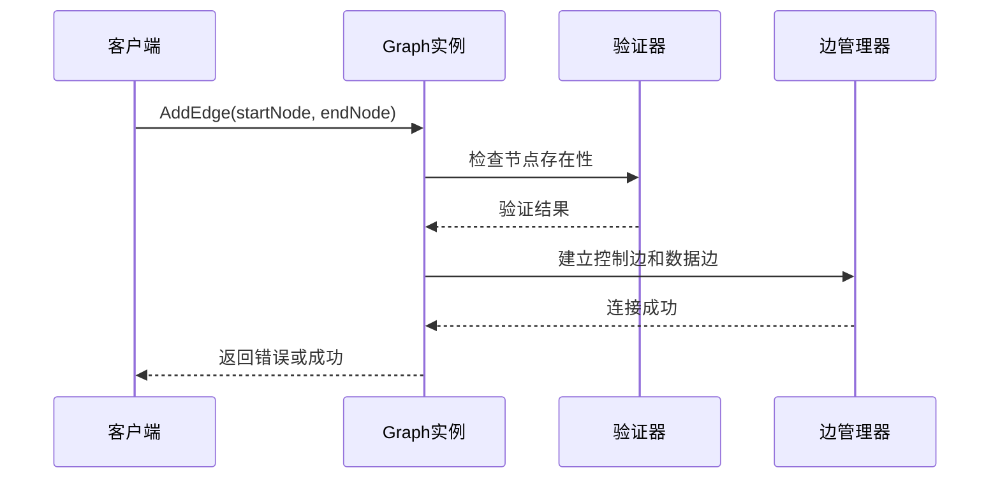

**图表来源**
- [compose/graph.go](file://compose/graph.go#L232-L294)

### 边验证规则

| 规则 | 描述 | 错误处理 |
|------|------|----------|
| 节点存在性 | 起始和结束节点必须已添加 | 抛出节点不存在错误 |
| 循环检测 | 不允许形成循环依赖 | 检测并阻止循环 |
| 类型匹配 | 输入输出类型必须兼容 | 类型转换或报错 |
| 控制依赖 | 控制边不能同时为数据边 | 报告冲突错误 |

**章节来源**
- [compose/graph.go](file://compose/graph.go#L232-L294)

## 分支控制

Graph编排模式提供了强大的分支控制机制，支持基于条件的运行时决策：

### GraphBranch结构

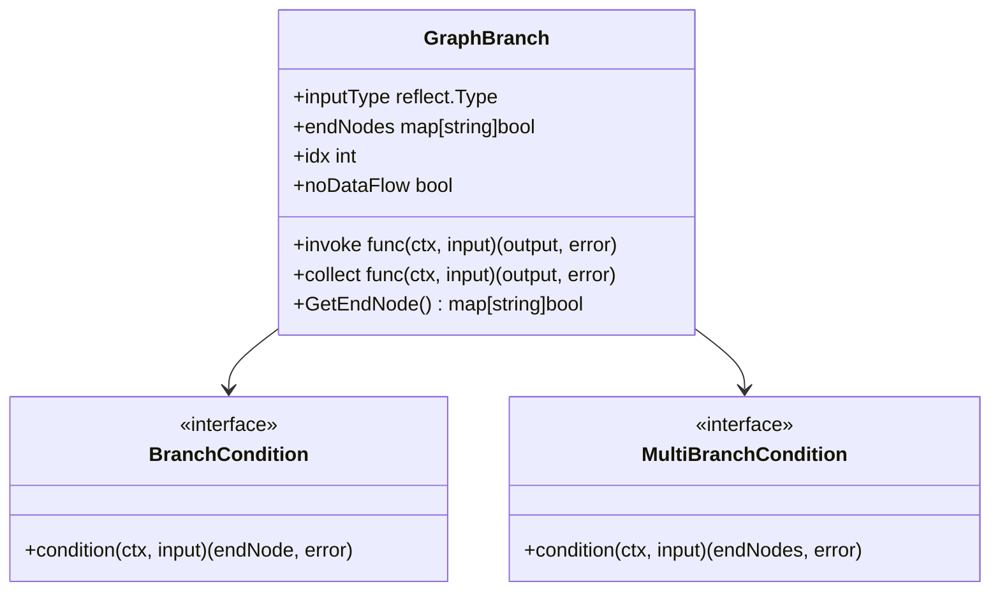

**图表来源**
- [compose/branch.go](file://compose/branch.go#L40-L50)

### 分支类型

| 分支类型 | 条件函数 | 用途 | 示例场景 |
|----------|----------|------|----------|
| 单一分支 | `GraphBranchCondition[T]` | 单一条件判断 | 检查输入内容类型 |
| 多分支 | `GraphMultiBranchCondition[T]` | 多个条件选择 | 复杂业务逻辑分支 |
| 流式分支 | `StreamGraphBranchCondition[T]` | 流式输入条件 | 实时内容分析 |
| 流式多分支 | `StreamGraphMultiBranchCondition[T]` | 流式多条件 | 并行内容处理 |

### 分支决策流程

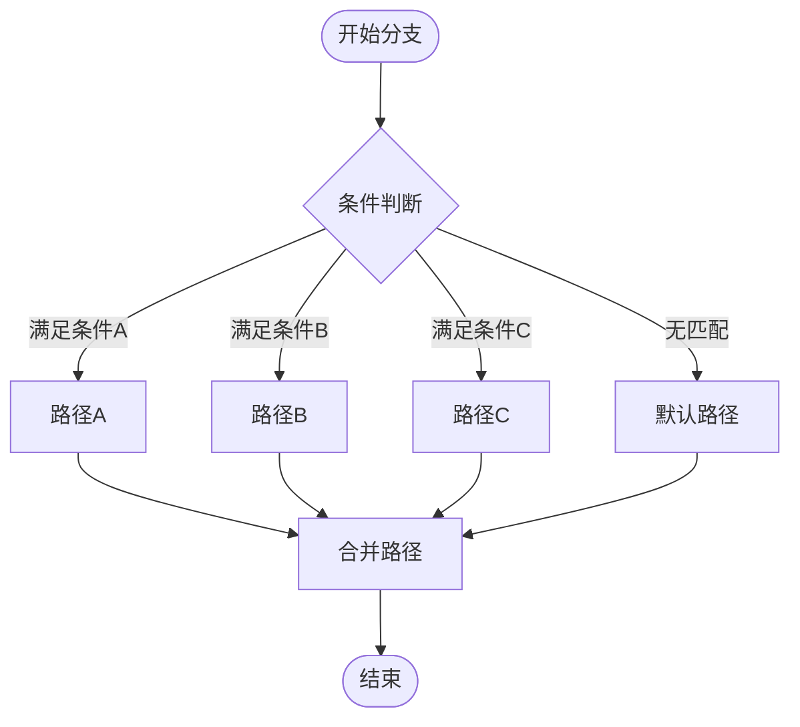

**图表来源**
- [compose/branch.go](file://compose/branch.go#L142-L172)

**章节来源**
- [compose/branch.go](file://compose/branch.go#L40-L50)

## 运行模式

Graph编排模式支持两种主要的运行模式，每种模式适用于不同的应用场景：

### runTypePregel模式

Pregel模式适用于大规模图处理任务，支持循环图和任意前驱触发：

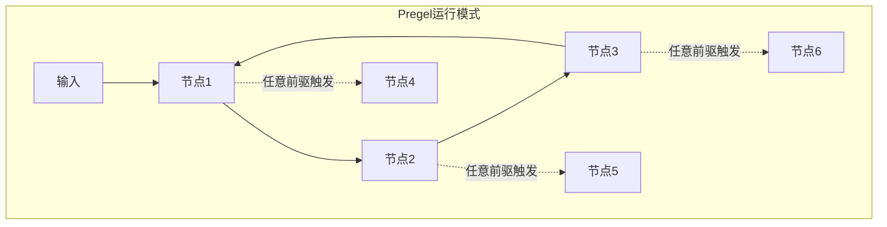

**图表来源**
- [compose/pregel.go](file://compose/pregel.go#L21-L23)

### runTypeDAG模式

DAG模式代表严格的有向无环图，适用于任务表示为有向无环图的场景：

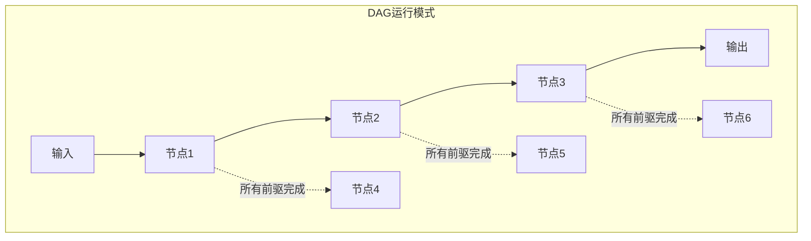

**图表来源**
- [compose/dag.go](file://compose/dag.go#L23-L40)

### 运行模式对比

| 特性 | Pregel模式 | DAG模式 |
|------|------------|---------|
| 循环支持 | ✅ 支持 | ❌ 不支持 |
| 触发模式 | 任意前驱触发 | 所有前驱完成触发 |
| 性能特点 | 更灵活但可能较慢 | 更高效但受限 |
| 应用场景 | 复杂图处理 | 严格线性流程 |
| 类型检查 | 编译时检查 | 运行时检查 |

**章节来源**
- [compose/graph.go](file://compose/graph.go#L639-L681)
- [compose/dag.go](file://compose/dag.go#L23-L40)
- [compose/pregel.go](file://compose/pregel.go#L21-L23)

## 状态管理

Graph编排模式提供了强大的全局状态管理机制，支持节点间的数据共享：

### WithState选项

通过`WithGenLocalState`选项可以启用全局状态管理：

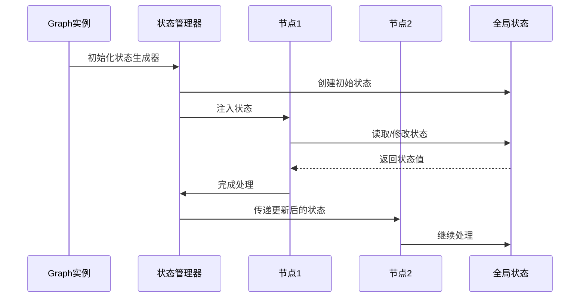

**图表来源**
- [compose/generic_graph.go](file://compose/generic_graph.go#L33-L40)
- [compose/state.go](file://compose/state.go#L34-L37)

### 状态处理器

| 处理器类型 | 触发时机 | 用途 | 示例 |
|------------|----------|------|------|
| `StatePreHandler` | 节点执行前 | 状态预处理 | 记录访问日志 |
| `StatePostHandler` | 节点执行后 | 状态后处理 | 更新统计信息 |
| `StreamStatePreHandler` | 流式处理前 | 流式状态处理 | 实时状态监控 |
| `StreamStatePostHandler` | 流式处理后 | 流式状态处理 | 流式统计汇总 |

### 状态并发安全

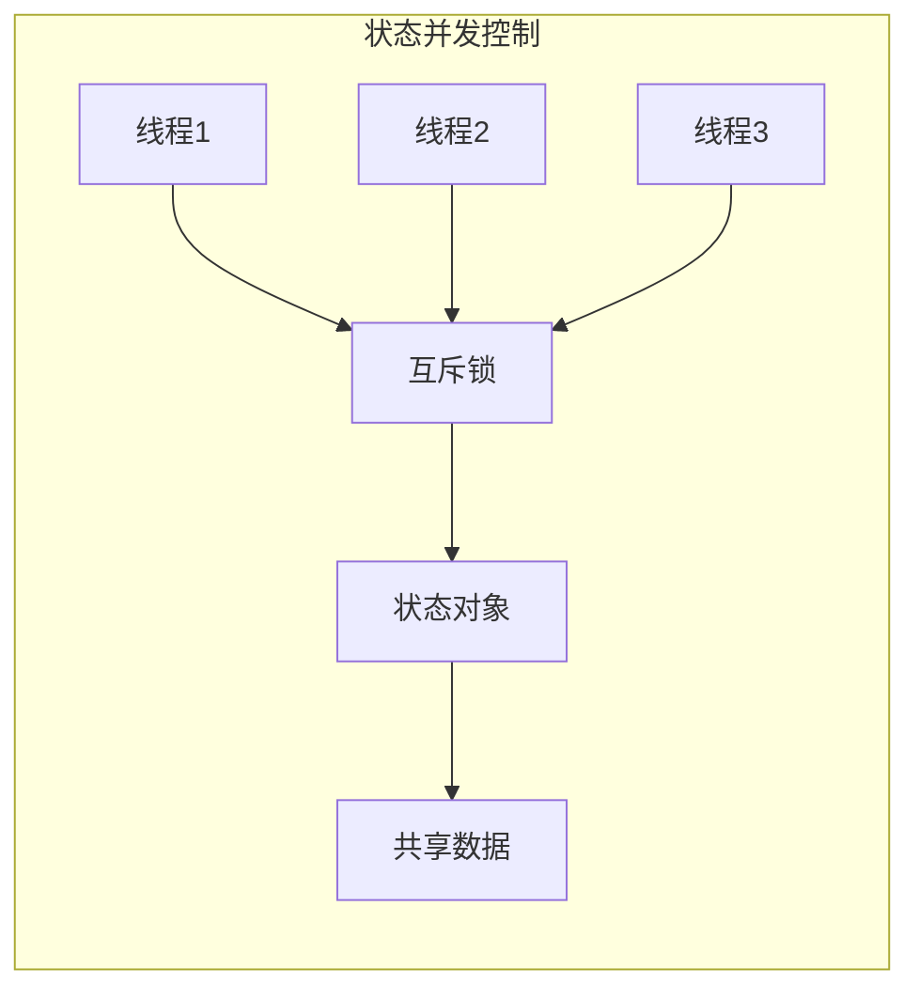

**图表来源**
- [compose/state.go](file://compose/state.go#L34-L37)

**章节来源**
- [compose/generic_graph.go](file://compose/generic_graph.go#L33-L40)
- [compose/state.go](file://compose/state.go#L34-L37)

## 复杂决策流程示例

以下是一个基于Graph编排模式的复杂决策流程示例，展示了一个智能Agent如何根据LLM输出决定是检索文档还是调用外部工具：

### Agent决策流程

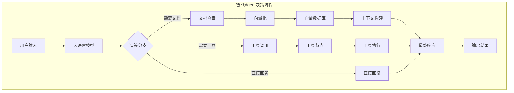

**图表来源**
- [adk/react.go](file://adk/react.go#L104-L154)
- [flow/agent/multiagent/host/compose.go](file://flow/agent/multiagent/host/compose.go#L189-L222)

### 实现代码结构

这个复杂流程的实现涉及多个关键组件：

| 组件 | 功能 | 实现方式 |
|------|------|----------|
| 主机代理 | 接收用户输入并做出决策 | `addHostAgent()` |
| 专家代理 | 专门处理特定领域的任务 | `addSpecialistAgent()` |
| 分支逻辑 | 基于工具调用判断的分支 | `addDirectAnswerBranch()` |
| 多专家分支 | 处理多个专家的协作 | `addMultiSpecialistsBranch()` |
| 汇总节点 | 合并多个专家的回答 | `addMultiIntentsSummarizeNode()` |

### 流程控制机制

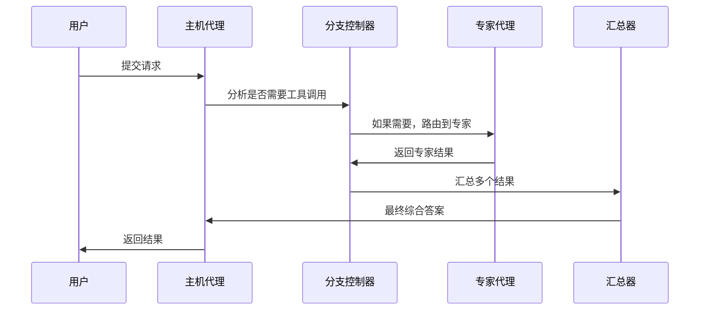

**图表来源**
- [flow/agent/react/react.go](file://flow/agent/react/react.go#L267-L303)

**章节来源**
- [adk/react.go](file://adk/react.go#L104-L154)
- [flow/agent/multiagent/host/compose.go](file://flow/agent/multiagent/host/compose.go#L189-L222)
- [flow/agent/react/react.go](file://flow/agent/react/react.go#L267-L303)

## 性能特性

Graph编排模式在性能方面具有显著优势：

### 类型检查优化

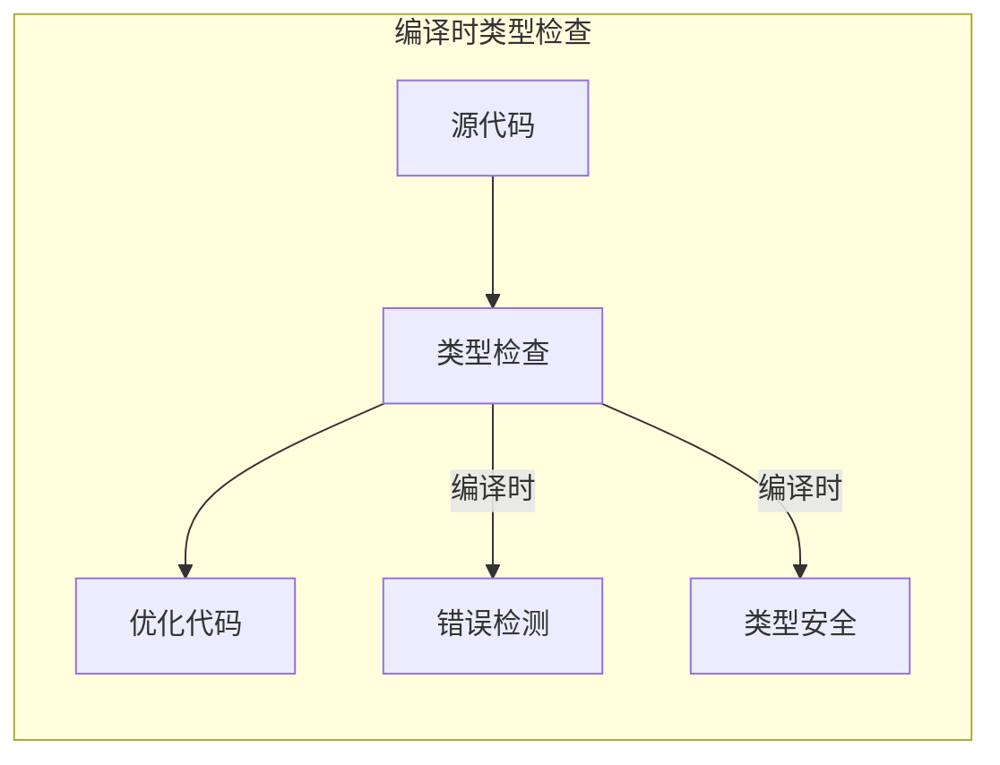

### 并发执行能力

| 特性 | 描述 | 性能影响 |
|------|------|----------|
| 并行节点 | 多个独立节点可并行执行 | 显著提升吞吐量 |
| 流式处理 | 支持流式数据处理 | 减少内存占用 |
| 异步操作 | 非阻塞I/O操作 | 提高响应速度 |
| 状态缓存 | 全局状态本地化缓存 | 减少状态访问开销 |

### 流式数据传递

Graph编排模式支持高效的流式数据传递机制：

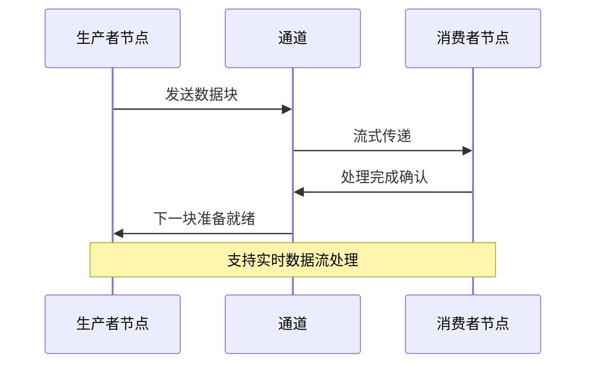

**章节来源**
- [compose/graph_run.go](file://compose/graph_run.go#L810-L853)

## 与Chain模式对比

Graph编排模式与传统的Chain模式在多个方面存在显著差异：

### 架构对比

| 方面 | Chain模式 | Graph模式 |
|------|-----------|-----------|
| 流程结构 | 线性序列 | 有向无环图 |
| 分支能力 | 有限分支 | 强大分支控制 |
| 并发性 | 串行执行 | 并行执行 |
| 状态管理 | 局部状态 | 全局状态 |
| 复杂度 | 简单直观 | 复杂灵活 |

### 使用场景对比

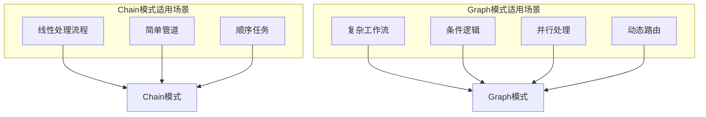

### 性能对比

| 指标 | Chain模式 | Graph模式 |
|------|-----------|-----------|
| 执行效率 | 高（线性） | 中等（图遍历） |
| 内存使用 | 低 | 中等 |
| 开发复杂度 | 低 | 高 |
| 调试难度 | 低 | 中等 |
| 扩展性 | 有限 | 优秀 |

**章节来源**
- [compose/types.go](file://compose/types.go#L28-L46)

## 最佳实践

基于对Eino框架Graph编排模式的深入分析，以下是推荐的最佳实践：

### 设计原则

1. **单一职责**：每个节点应该只负责一个明确的功能
2. **类型安全**：充分利用泛型和类型检查机制
3. **状态最小化**：尽量减少全局状态的使用
4. **错误处理**：完善的错误传播和恢复机制

### 性能优化建议

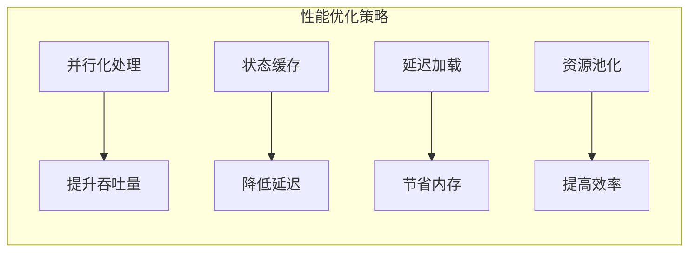

### 常见陷阱避免

| 陷阱 | 描述 | 解决方案 |
|------|------|----------|
| 循环依赖 | 节点间形成循环引用 | 使用DAG验证 |
| 状态竞争 | 多线程状态访问冲突 | 使用互斥锁 |
| 内存泄漏 | 未正确释放资源 | 实现资源清理 |
| 类型不匹配 | 输入输出类型不兼容 | 编译时检查 |

### 调试和监控

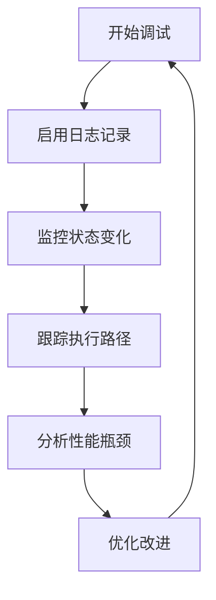

通过遵循这些最佳实践，可以充分发挥Graph编排模式的强大功能，构建高效、可靠的应用程序。