# 状态管理（State）

<cite>
**本文档中引用的文件**
- [state.go](file://compose/state.go)
- [state_test.go](file://compose/state_test.go)
- [graph_add_node_options.go](file://compose/graph_add_node_options.go)
- [generic_graph.go](file://compose/generic_graph.go)
- [graph.go](file://compose/graph.go)
- [chain.go](file://compose/chain.go)
- [workflow.go](file://compose/workflow.go)
</cite>

## 目录
1. [简介](#简介)
2. [核心概念](#核心概念)
3. [状态初始化](#状态初始化)
4. [状态处理器](#状态处理器)
5. [并发安全机制](#并发安全机制)
6. [状态访问模式](#状态访问模式)
7. [实际应用示例](#实际应用示例)
8. [架构设计](#架构设计)
9. [最佳实践](#最佳实践)
10. [总结](#总结)

## 简介

Eino框架的状态管理功能为图式编排提供了一套完整的可变状态维护和共享机制。该系统允许在图的执行过程中安全地维护和修改状态数据，支持复杂的多节点协作场景，如多轮对话、累积聚合等应用场景。

状态管理系统的核心优势包括：
- **线程安全的状态访问**：通过互斥锁确保并发安全性
- **灵活的状态处理器**：支持节点执行前后的状态修改
- **类型安全的状态管理**：编译时类型检查确保状态一致性
- **无缝的集成体验**：与现有图式编排系统深度集成

## 核心概念

### 状态类型定义

状态管理的基础是定义具体的状态结构体，这些结构体包含了需要在节点间共享的数据：

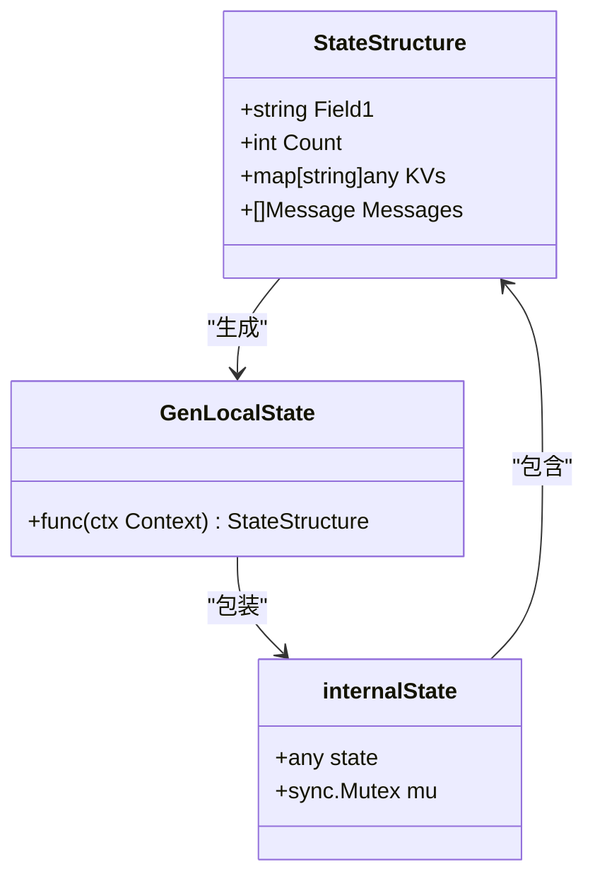

**图表来源**
- [state.go](file://compose/state.go#L29-L37)

### 状态键值系统

框架使用专门的状态键（stateKey）来在上下文中标识和检索状态实例：

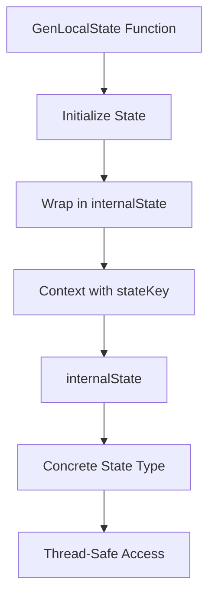

**图表来源**
- [state.go](file://compose/state.go#L32-L37)

**节来源**
- [state.go](file://compose/state.go#L29-L37)

## 状态初始化

### GenLocalState函数

`GenLocalState`函数是状态初始化的核心组件，负责在图执行开始时创建状态实例：

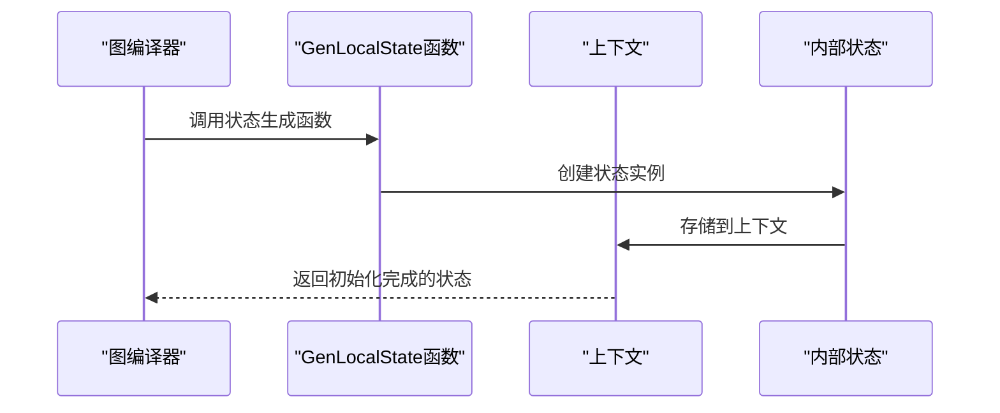

**图表来源**
- [state.go](file://compose/state.go#L29)
- [generic_graph.go](file://compose/generic_graph.go#L33-L39)

### WithGenLocalState选项

通过`WithGenLocalState`选项可以将状态初始化函数注册到图配置中：

| 配置项 | 类型 | 描述 | 必需 |
|--------|------|------|------|
| GenLocalState | GenLocalState[S] | 状态生成函数 | 是 |
| stateType | reflect.Type | 状态类型反射信息 | 自动推导 |

**节来源**
- [generic_graph.go](file://compose/generic_graph.go#L33-L39)
- [graph_add_node_options.go](file://compose/graph_add_node_options.go#L83-L110)

## 状态处理器

### StatePreHandler处理器

`StatePreHandler`在节点执行前被调用，允许基于当前状态修改输入数据：

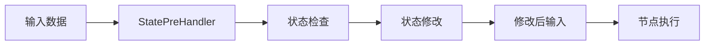

**图表来源**
- [state.go](file://compose/state.go#L39-L41)
- [graph_add_node_options.go](file://compose/graph_add_node_options.go#L96-L101)

### StatePostHandler处理器

`StatePostHandler`在节点执行后被调用，允许基于输出数据更新状态：

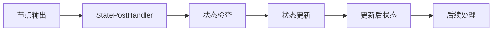

**图表来源**
- [state.go](file://compose/state.go#L43-L45)
- [graph_add_node_options.go](file://compose/graph_add_node_options.go#L109-L113)

### 流式状态处理器

框架还提供了专门的流式状态处理器，用于处理流式数据的场景：

| 处理器类型 | 输入类型 | 输出类型 | 使用场景 |
|------------|----------|----------|----------|
| StreamStatePreHandler | *StreamReader[I] | *StreamReader[I] | 流式输入预处理 |
| StreamStatePostHandler | *StreamReader[O] | *StreamReader[O] | 流式输出后处理 |

**节来源**
- [state.go](file://compose/state.go#L47-L51)
- [graph_add_node_options.go](file://compose/graph_add_node_options.go#L117-L142)

## 并发安全机制

### 内部状态结构

`internalState`结构体是状态管理并发安全的核心实现：

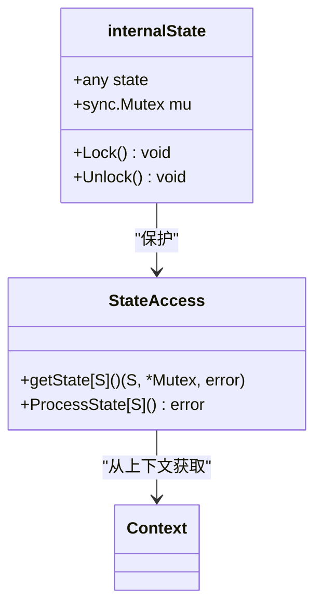

**图表来源**
- [state.go](file://compose/state.go#L34-L37)

### 互斥锁保护

所有状态访问都通过互斥锁确保线程安全：

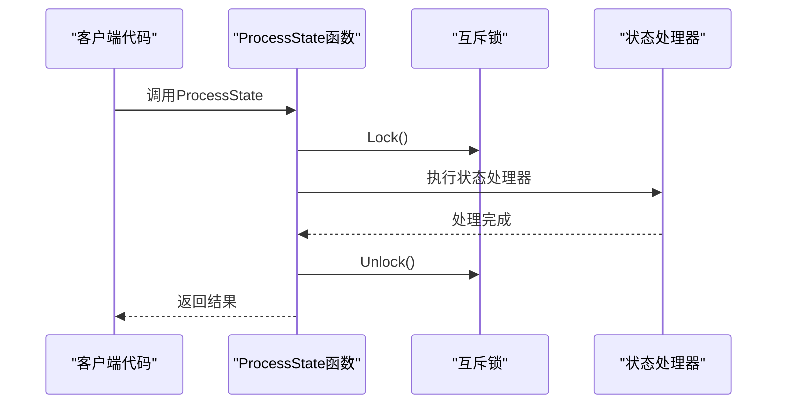

**图表来源**
- [state.go](file://compose/state.go#L133-L140)

**节来源**
- [state.go](file://compose/state.go#L34-L37)
- [state.go](file://compose/state.go#L133-L140)

## 状态访问模式

### ProcessState函数

`ProcessState`是推荐的状态访问模式，提供了线程安全的状态操作接口：

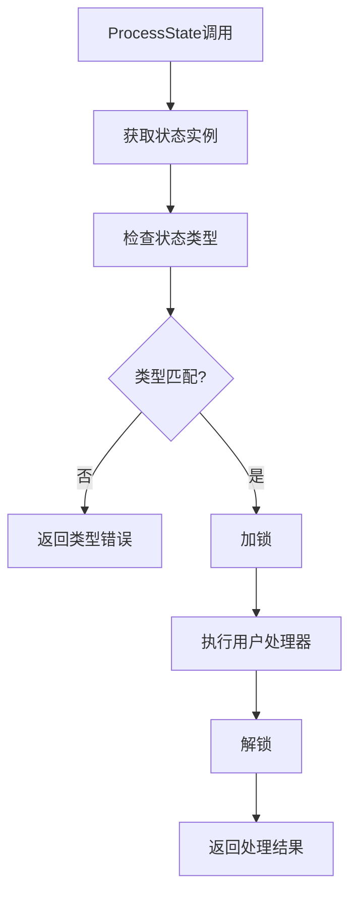

**图表来源**
- [state.go](file://compose/state.go#L133-L140)

### 类型安全检查

框架在运行时进行严格的类型检查，确保状态类型的正确性：

| 检查项目 | 错误类型 | 处理方式 |
|----------|----------|----------|
| 状态是否存在 | "have not set state" | 返回初始化错误 |
| 类型是否匹配 | "unexpected state type" | 返回类型转换错误 |
| 上下文键值 | "stateKey not found" | 返回上下文缺失错误 |

**节来源**
- [state.go](file://compose/state.go#L143-L161)

## 实际应用示例

### 计数器示例

以下展示了如何使用状态管理实现简单的计数器功能：

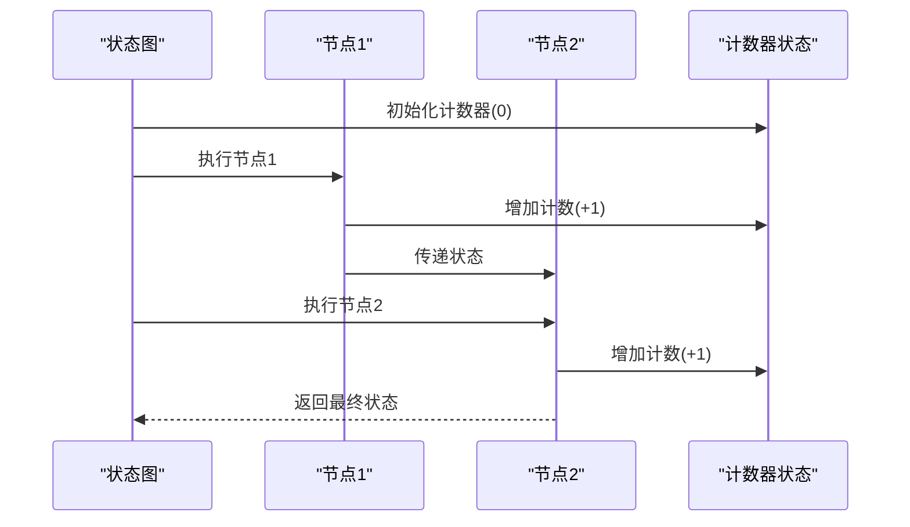

**图表来源**
- [state_test.go](file://compose/state_test.go#L224-L262)

### 会话记忆示例

状态管理在实现多轮对话和会话记忆中发挥重要作用：

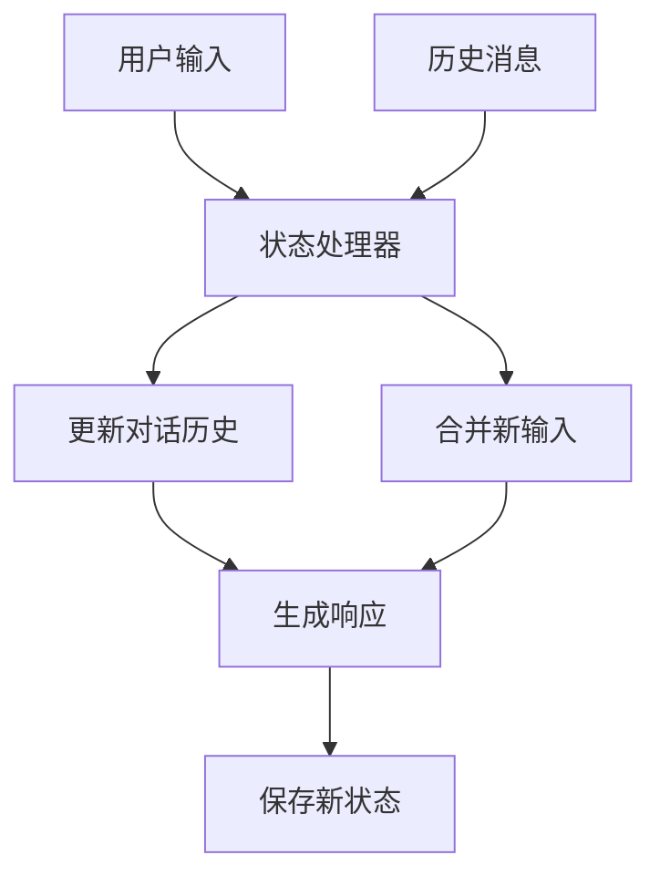

**图表来源**
- [state_test.go](file://compose/state_test.go#L33-L169)

**节来源**
- [state_test.go](file://compose/state_test.go#L224-L262)
- [state_test.go](file://compose/state_test.go#L33-L169)

## 架构设计

### 系统架构概览

状态管理系统采用分层架构设计，确保各组件职责清晰：

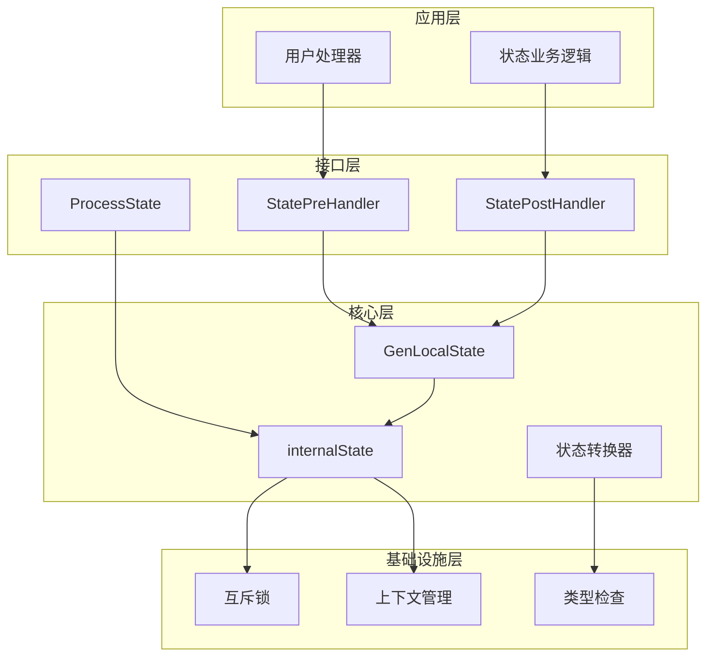

**图表来源**
- [state.go](file://compose/state.go#L1-L162)
- [graph.go](file://compose/graph.go#L57-L89)

### 组件关系图

各组件之间的依赖关系体现了系统的模块化设计：

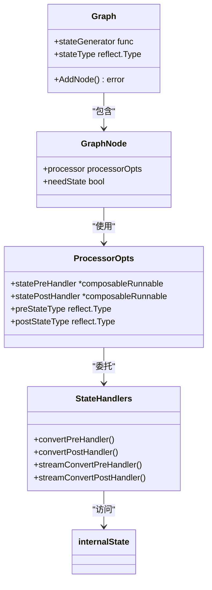

**图表来源**
- [graph.go](file://compose/graph.go#L57-L89)
- [graph_add_node_options.go](file://compose/graph_add_node_options.go#L144-L149)

**节来源**
- [state.go](file://compose/state.go#L1-L162)
- [graph.go](file://compose/graph.go#L57-L89)
- [graph_add_node_options.go](file://compose/graph_add_node_options.go#L144-L149)

## 最佳实践

### 状态设计原则

1. **单一职责**：每个状态结构体应专注于特定领域的数据管理
2. **不可变性优先**：尽可能使用不可变数据结构，仅在必要时修改状态
3. **最小化状态范围**：只存储必要的状态信息，避免过度设计
4. **类型安全**：始终使用强类型定义，避免使用interface{}

### 性能优化建议

1. **状态缓存**：对于频繁访问的状态字段，考虑在本地缓存
2. **批量操作**：尽量减少状态访问次数，合并多个状态修改操作
3. **异步处理**：对于耗时的状态操作，考虑使用异步处理模式

### 错误处理策略

1. **类型检查**：始终验证状态类型的一致性
2. **空值检查**：在访问状态前检查状态是否已初始化
3. **异常恢复**：实现状态损坏时的恢复机制

### 并发控制

1. **细粒度锁定**：对于大型状态结构，考虑使用更细粒度的锁定策略
2. **读写分离**：区分读操作和写操作，优化并发性能
3. **死锁预防**：确保状态访问的顺序一致性

## 总结

Eino框架的状态管理功能提供了一套完整、安全、高效的状态维护解决方案。通过`GenLocalState`函数初始化状态，结合`StatePreHandler`和`StatePostHandler`处理器，开发者可以在复杂的图式编排场景中轻松实现状态共享和持久化。

系统的核心优势在于：
- **类型安全**：编译时和运行时的双重类型检查
- **并发安全**：内置的互斥锁保护机制
- **灵活扩展**：支持多种状态处理器和访问模式
- **无缝集成**：与现有图式编排系统的深度集成

这种设计使得状态管理既简单易用，又具备强大的表达能力，能够满足从简单计数器到复杂多轮对话等各种应用场景的需求。通过遵循最佳实践和设计原则，开发者可以构建出高性能、高可靠性的状态管理解决方案。