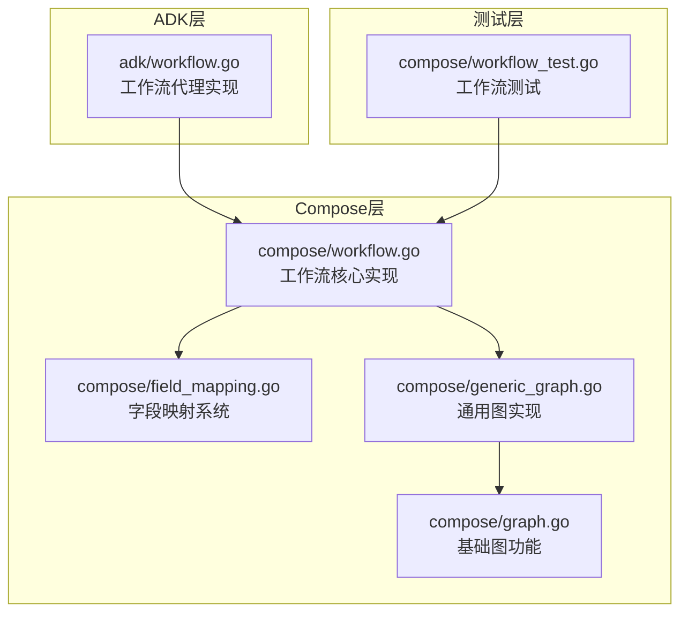
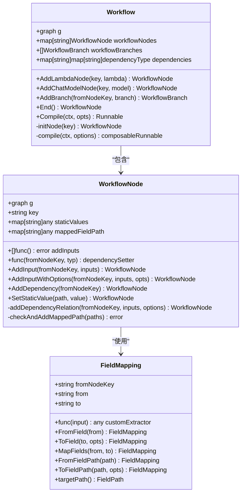
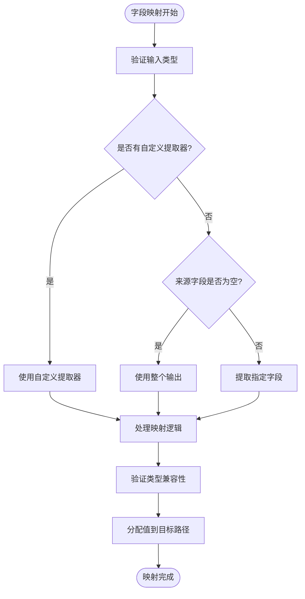
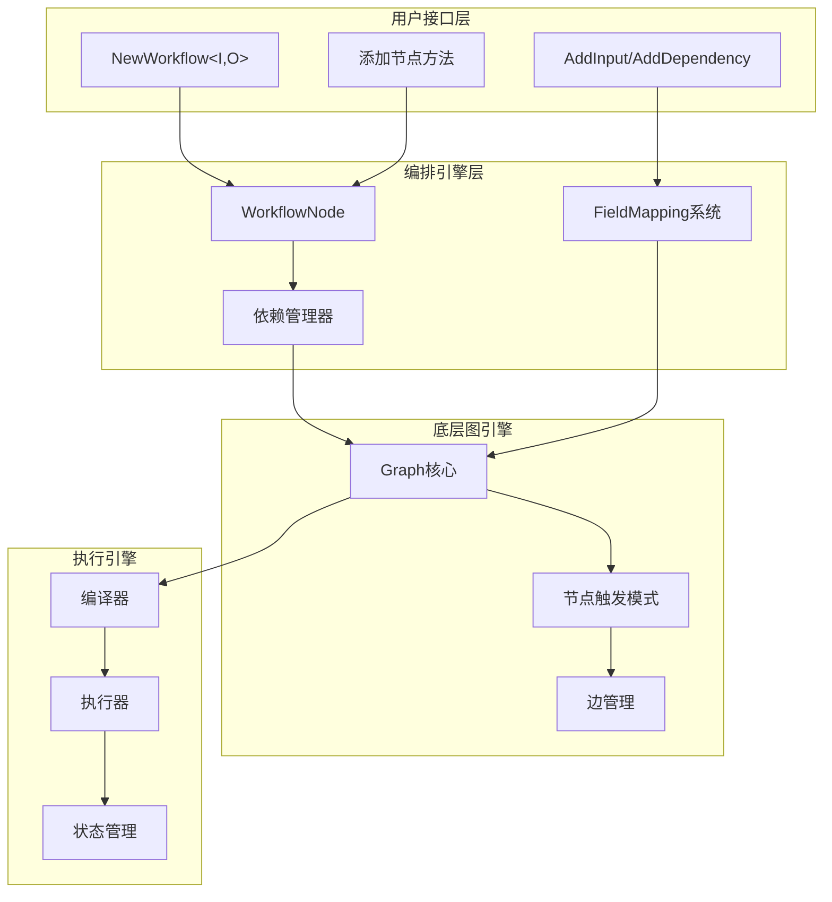
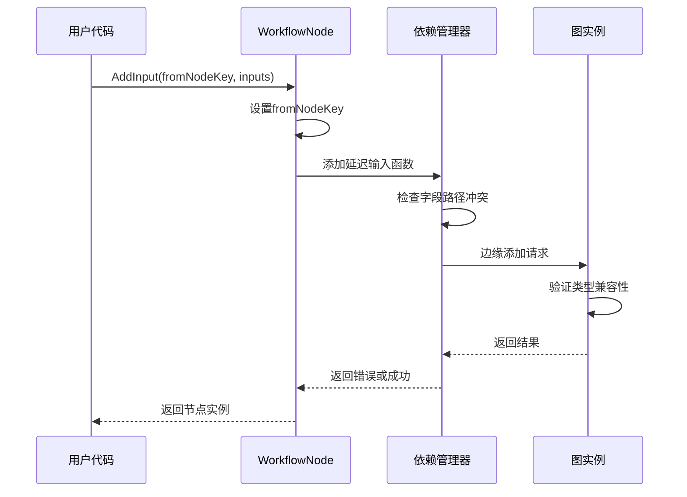
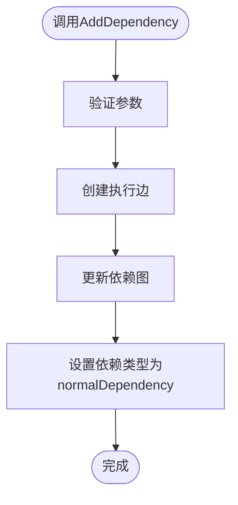
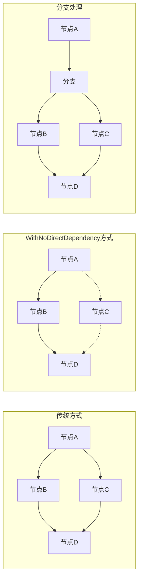
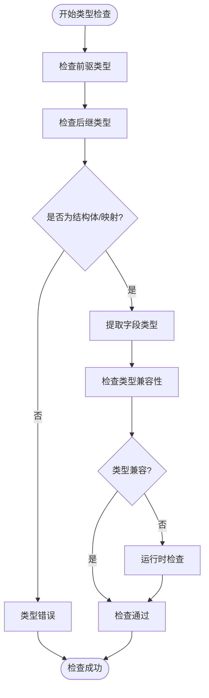
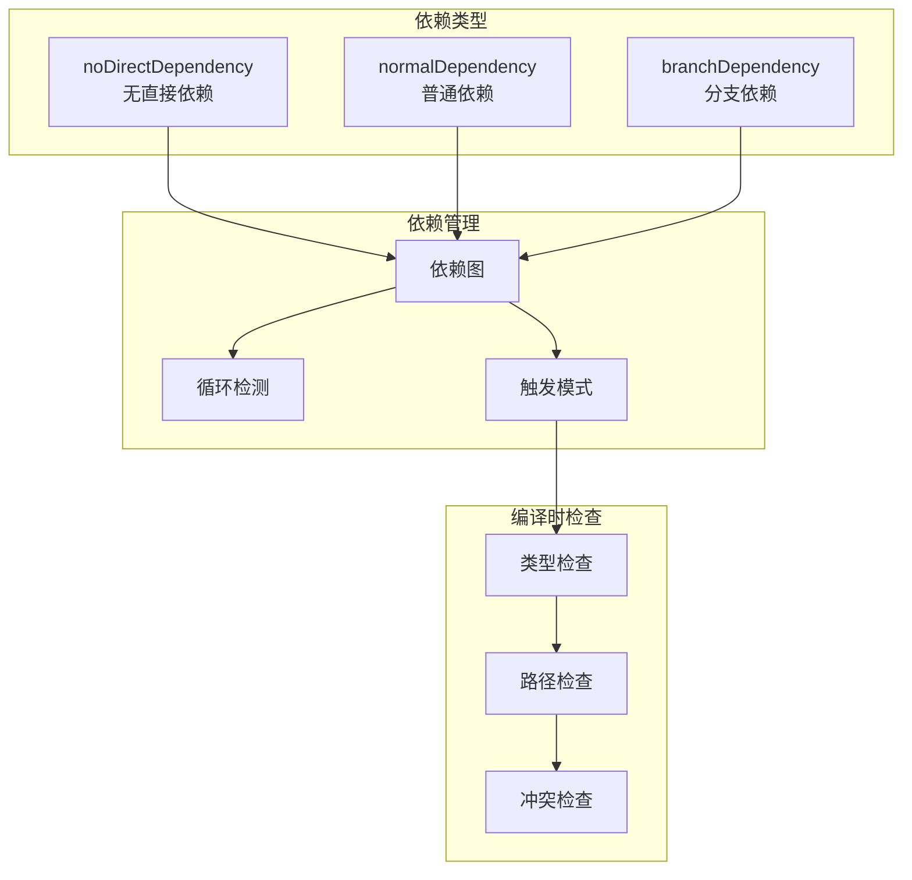

# 工作流编排（Workflow）

<cite>
**本文档引用的文件**
- [adk/workflow.go](file://adk/workflow.go)
- [compose/workflow.go](file://compose/workflow.go)
- [compose/field_mapping.go](file://compose/field_mapping.go)
- [compose/generic_graph.go](file://compose/generic_graph.go)
- [compose/graph.go](file://compose/graph.go)
- [compose/workflow_test.go](file://compose/workflow_test.go)
- [compose/types.go](file://compose/types.go)
</cite>

## 目录
1. [简介](#简介)
2. [项目结构](#项目结构)
3. [核心组件](#核心组件)
4. [架构概览](#架构概览)
5. [详细组件分析](#详细组件分析)
6. [依赖关系分析](#依赖关系分析)
7. [性能考虑](#性能考虑)
8. [故障排除指南](#故障排除指南)
9. [结论](#结论)

## 简介

Eino框架中的Workflow编排模式是一种处于Alpha阶段的高级编排方式，专注于字段级数据映射和声明式依赖管理。该模式作为传统Graph的封装，将传统的`AddEdge`操作替换为声明式的`AddInput`和`AddDependency`方法，从而实现更清晰、更灵活的数据流定义。

Workflow编排模式的核心特点包括：
- **字段级数据映射**：支持将一个节点输出的特定字段精确映射到另一个节点的输入字段
- **声明式依赖管理**：通过`AddInput`和`AddDependency`实现声明式的依赖关系定义
- **AllPredecessor触发模式**：确保确定性的执行顺序
- **细粒度控制**：支持静态值设置、自定义提取器等高级功能

## 项目结构

Workflow编排模式主要分布在以下模块中：



**图表来源**
- [adk/workflow.go](file://adk/workflow.go#L1-L507)
- [compose/workflow.go](file://compose/workflow.go#L1-L512)
- [compose/field_mapping.go](file://compose/field_mapping.go#L1-L775)

**章节来源**
- [adk/workflow.go](file://adk/workflow.go#L1-L507)
- [compose/workflow.go](file://compose/workflow.go#L1-L512)

## 核心组件

### WorkflowNode - 工作流节点

WorkflowNode是Workflow编排模式的基本单元，负责管理单个节点的所有配置和行为：



**图表来源**
- [compose/workflow.go](file://compose/workflow.go#L33-L42)
- [compose/workflow.go](file://compose/workflow.go#L43-L51)
- [compose/field_mapping.go](file://compose/field_mapping.go#L31-L37)

### FieldMapping - 字段映射系统

FieldMapping提供了强大的字段级数据映射能力，支持复杂的嵌套结构访问：



**图表来源**
- [compose/field_mapping.go](file://compose/field_mapping.go#L484-L566)

**章节来源**
- [compose/workflow.go](file://compose/workflow.go#L33-L512)
- [compose/field_mapping.go](file://compose/field_mapping.go#L31-L775)

## 架构概览

Workflow编排模式的整体架构基于Graph的扩展，通过声明式的方式定义节点间的依赖关系和数据流：



**图表来源**
- [compose/workflow.go](file://compose/workflow.go#L60-L80)
- [compose/generic_graph.go](file://compose/generic_graph.go#L68-L84)

## 详细组件分析

### 声明式依赖管理

Workflow编排模式的核心创新在于将传统的显式边连接转换为声明式的依赖关系：

#### AddInput方法详解



**图表来源**
- [compose/workflow.go](file://compose/workflow.go#L167-L169)
- [compose/workflow.go](file://compose/workflow.go#L285-L335)

#### AddDependency方法

AddDependency方法专门用于建立仅执行顺序的依赖关系，而不传递数据：



**图表来源**
- [compose/workflow.go](file://compose/workflow.go#L269-L272)

### WithNoDirectDependency高级选项

`WithNoDirectDependency`是一个重要的高级选项，用于处理跨分支数据访问场景：

#### 使用场景分析



**图表来源**
- [compose/workflow.go](file://compose/workflow.go#L206-L226)

#### 关键特性

1. **间接执行路径**：允许节点通过其他节点的执行路径间接访问数据
2. **分支兼容性**：在分支场景中必须使用此选项以避免错误依赖
3. **执行保证**：前驱节点仍然会在当前节点执行前完成

**章节来源**
- [compose/workflow.go](file://compose/workflow.go#L167-L272)
- [compose/workflow.go](file://compose/workflow.go#L206-L226)

### 字段映射系统深度解析

FieldMapping系统支持复杂的嵌套结构访问和类型安全的数据映射：

#### 支持的映射类型

| 映射类型 | 描述 | 示例 |
|---------|------|------|
| FromField | 从结构体字段映射到整个输入 | `FromField("name")` |
| ToField | 从整个输入映射到结构体字段 | `ToField("displayName")` |
| MapFields | 字段到字段映射 | `MapFields("user.name", "displayName")` |
| FromFieldPath | 从嵌套路径映射 | `FromFieldPath(FieldPath{"user", "profile", "name"})` |
| ToFieldPath | 到嵌套路径映射 | `ToFieldPath(FieldPath{"response", "data", "userName"})` |

#### 类型检查机制



**图表来源**
- [compose/field_mapping.go](file://compose/field_mapping.go#L645-L775)

**章节来源**
- [compose/field_mapping.go](file://compose/field_mapping.go#L31-L775)

### AllPredecessor触发模式

Workflow编排模式默认使用`AllPredecessor`触发模式，这带来了确定性的执行顺序但限制了循环的使用：

#### 触发模式对比

| 触发模式 | 执行条件 | 适用场景 | 循环支持 |
|---------|----------|----------|----------|
| AllPredecessor | 所有前驱节点完成 | 数据驱动的流水线 | 不支持 |
| AnyPredecessor | 任意前驱节点完成 | 并行处理场景 | 支持 |

#### 确定性执行优势

1. **可预测性**：每个节点的执行都有明确的前置条件
2. **状态一致性**：确保数据在正确的时间点可用
3. **调试友好**：执行路径清晰，便于问题定位

**章节来源**
- [compose/types.go](file://compose/types.go#L35-L46)
- [compose/workflow.go](file://compose/workflow.go#L43-L44)

### 复杂工作流示例分析

以下是一个需要整合多个数据源的复杂工作流示例：

```mermaid
graph TD
Start([开始]) --> UserInfo[用户信息节点]
Start --> History[历史记录节点]
Start --> RealTime[实时数据节点]
UserInfo --> Merge[数据合并节点]
History --> Merge
RealTime --> Merge
Merge --> Process[处理节点]
Process --> Response[响应生成节点]
Response --> End([结束])
subgraph "字段映射"
UserInfo -.->|MapFields("name", "userName")| Merge
History -.->|MapFields("history", "userHistory")| Merge
RealTime -.->|MapFields("status", "userStatus")| Merge
end
```

**图表来源**
- [compose/workflow_test.go](file://compose/workflow_test.go#L36-L243)

这个示例展示了：
- 多个数据源的并行获取
- 字段级别的精确映射
- 确定性的执行顺序
- 最终响应的统一生成

**章节来源**
- [compose/workflow_test.go](file://compose/workflow_test.go#L36-L243)

## 依赖关系分析

Workflow编排模式的依赖关系管理是其核心功能之一：



**图表来源**
- [compose/workflow.go](file://compose/workflow.go#L52-L58)
- [compose/workflow.go](file://compose/workflow.go#L48-L51)

**章节来源**
- [compose/workflow.go](file://compose/workflow.go#L48-L51)

## 性能考虑

Workflow编排模式在设计时充分考虑了性能优化：

### 编译时优化

1. **类型检查缓存**：编译时进行完整的类型检查，避免运行时开销
2. **依赖图优化**：构建高效的依赖关系图，减少查找时间
3. **字段路径预计算**：预先计算字段访问路径，提高运行时效率

### 运行时优化

1. **延迟执行**：所有依赖关系在编译阶段建立，运行时只需执行
2. **内存复用**：通过对象池和内存复用减少GC压力
3. **并发安全**：设计时考虑并发安全性，避免锁竞争

## 故障排除指南

### 常见问题及解决方案

#### 1. 循环依赖错误

**问题描述**：尝试创建循环依赖关系

**解决方案**：
- 使用`WithNoDirectDependency`打破循环
- 重新设计工作流结构
- 考虑使用分支或其他控制结构

#### 2. 类型不匹配错误

**问题描述**：字段映射中的类型不兼容

**解决方案**：
- 检查前后节点的输入输出类型
- 使用自定义提取器处理复杂类型转换
- 确保字段名称拼写正确

#### 3. 字段路径冲突

**问题描述**：多个映射试图写入同一个字段路径

**解决方案**：
- 检查字段路径的唯一性
- 使用不同的目标字段
- 重构数据结构设计

**章节来源**
- [compose/workflow_test.go](file://compose/workflow_test.go#L658-L770)

## 结论

Eino框架的Workflow编排模式代表了现代工作流管理系统的重要发展方向。通过将传统的显式边连接转换为声明式的依赖关系和字段映射，它提供了：

### 主要优势

1. **更高的表达力**：字段级映射支持更精细的数据流控制
2. **更好的可读性**：声明式语法使工作流意图更加清晰
3. **更强的类型安全**：编译时类型检查减少了运行时错误
4. **灵活的控制**：支持多种依赖关系和执行模式

### Alpha阶段特性

作为Alpha阶段的功能，Workflow编排模式具有以下特点：

1. **实验性质**：新特性和API可能在未来版本中调整
2. **文档完善**：提供详细的使用指南和最佳实践
3. **社区反馈**：欢迎用户反馈和改进建议
4. **持续演进**：根据实际使用情况不断优化

### 未来发展方向

1. **性能优化**：进一步提升编译和执行效率
2. **功能扩展**：支持更多高级工作流模式
3. **工具增强**：提供更好的可视化和调试工具
4. **生态建设**：与更多组件和服务集成

Workflow编排模式为开发者提供了一种强大而灵活的方式来构建复杂的数据处理流水线，其声明式的编程模型使得工作流的设计和维护变得更加直观和可靠。随着Alpha阶段的推进，我们期待看到这一功能在实际应用中的不断完善和发展。