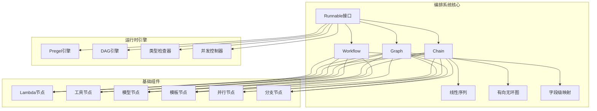
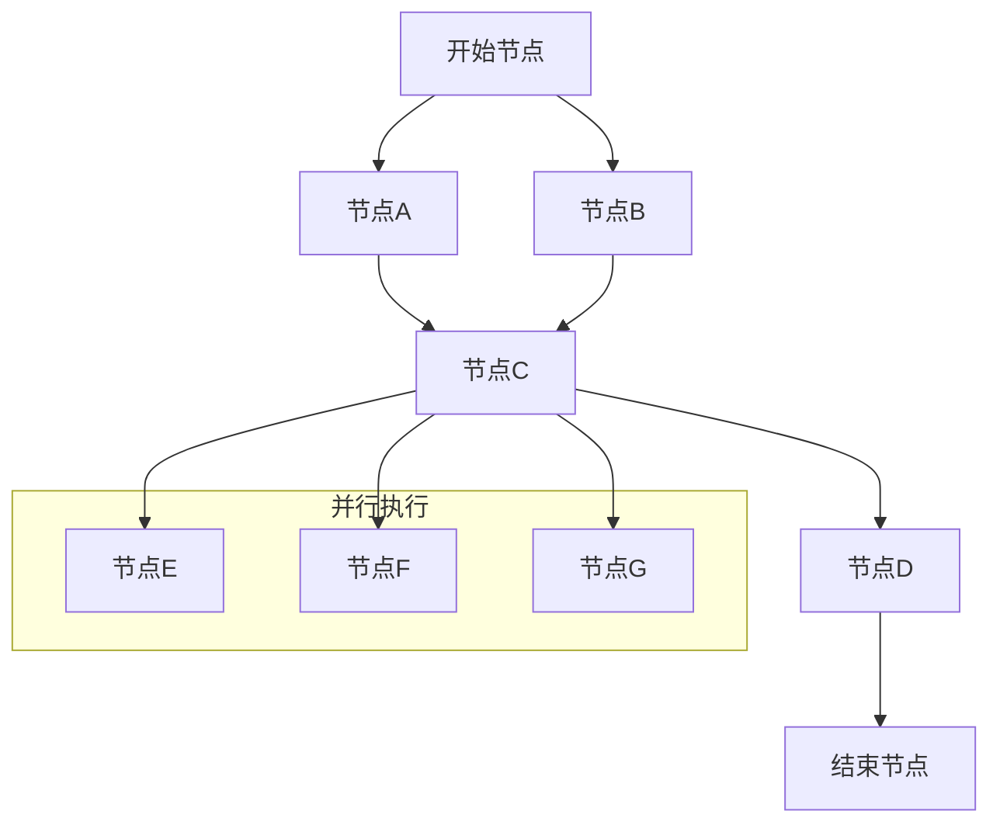
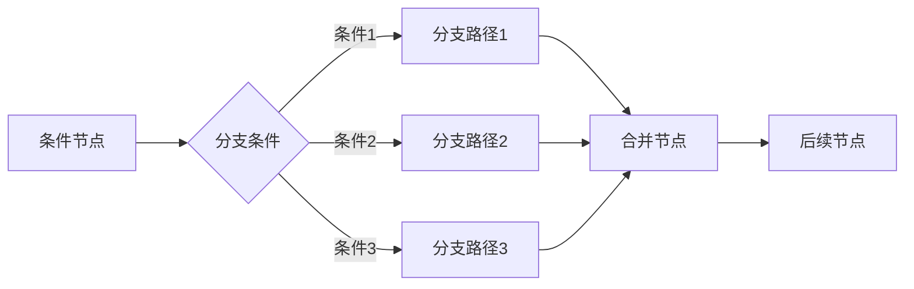
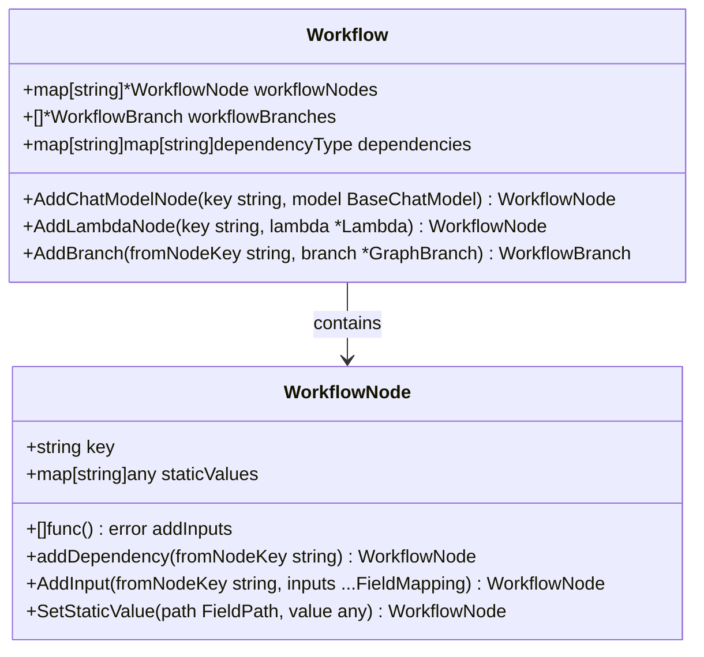
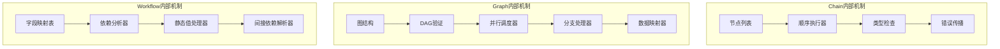
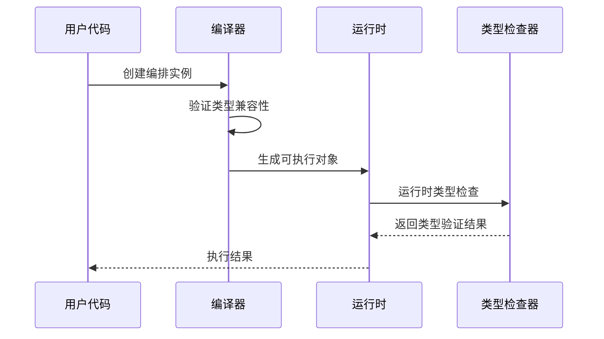
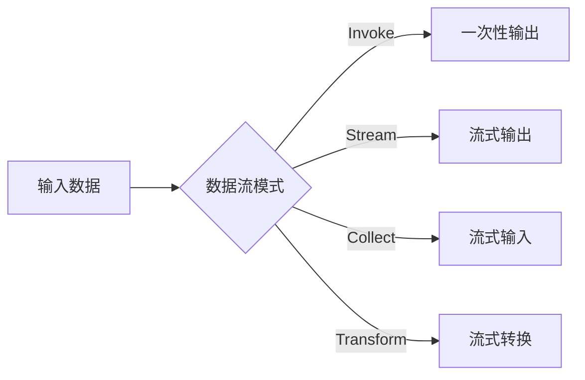
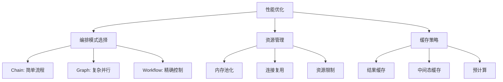
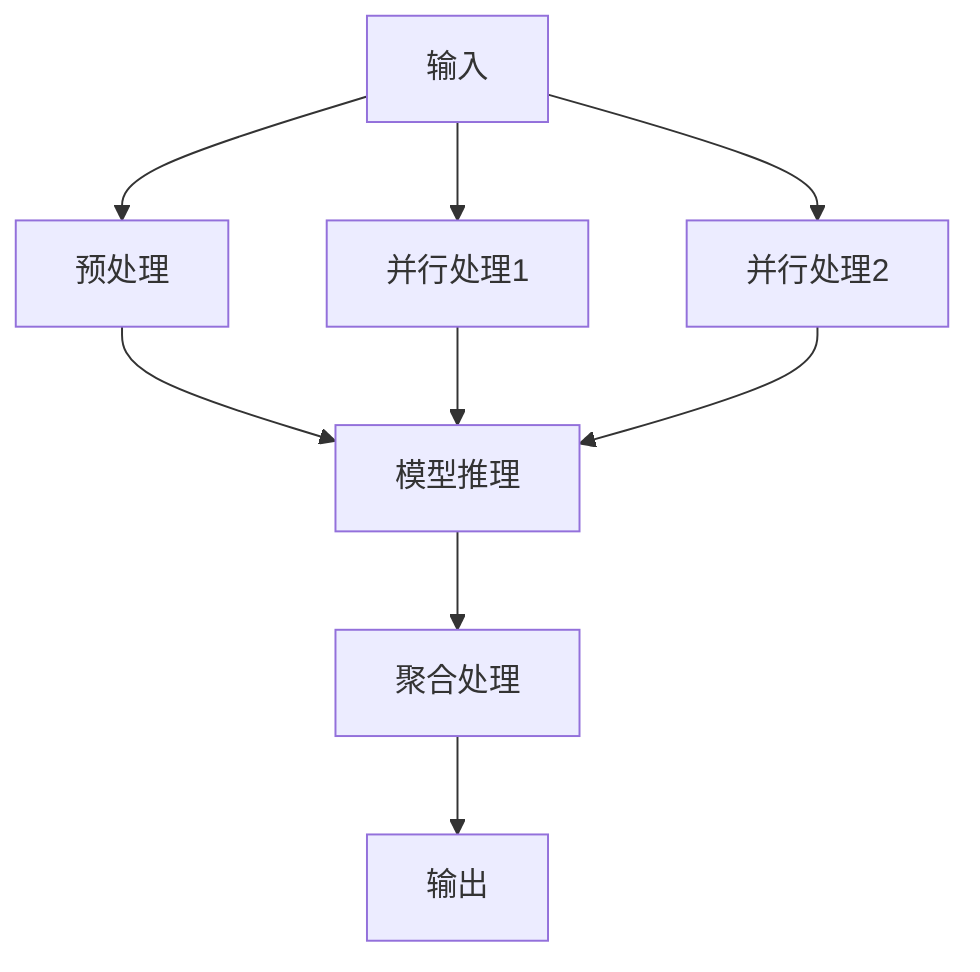
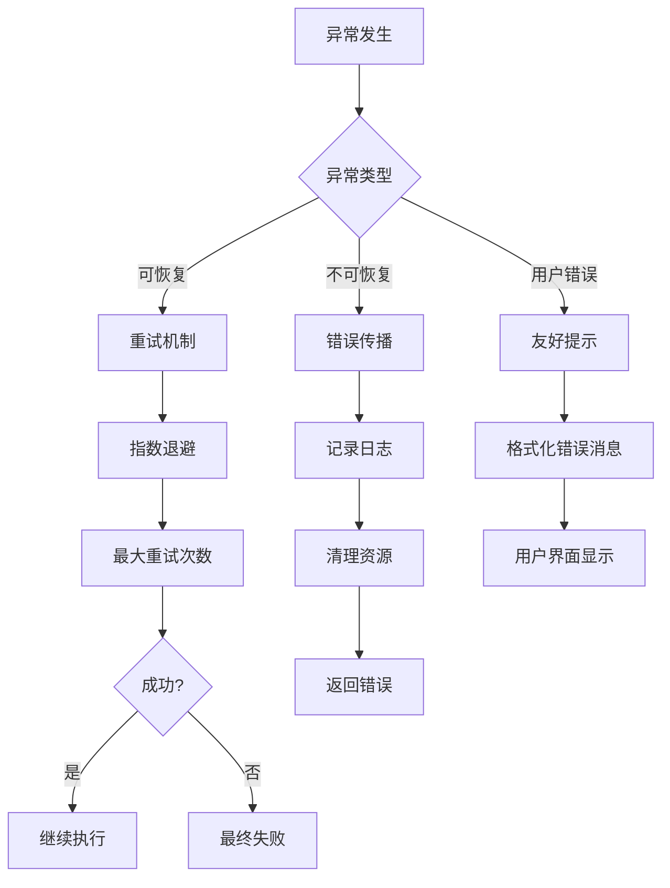

# 编排（Orchestration）

<cite>
**本文档中引用的文件**
- [compose/doc.go](file://compose/doc.go)
- [compose/chain.go](file://compose/chain.go)
- [compose/graph.go](file://compose/graph.go)
- [compose/workflow.go](file://compose/workflow.go)
- [compose/types.go](file://compose/types.go)
- [compose/branch.go](file://compose/branch.go)
- [compose/chain_branch.go](file://compose/chain_branch.go)
- [compose/chain_parallel.go](file://compose/chain_parallel.go)
- [compose/generic_graph.go](file://compose/generic_graph.go)
- [compose/runnable.go](file://compose/runnable.go)
- [compose/chain_test.go](file://compose/chain_test.go)
- [compose/graph_test.go](file://compose/graph_test.go)
</cite>

## 目录
1. [简介](#简介)
2. [编排系统架构概览](#编排系统架构概览)
3. [Chain：线性流程编排](#chain线性流程编排)
4. [Graph：有向无环图编排](#graph有向无环图编排)
5. [Workflow：字段级数据映射编排](#workflow字段级数据映射编排)
6. [核心组件对比分析](#核心组件对比分析)
7. [类型安全与并发处理](#类型安全与并发处理)
8. [性能特征与适用场景](#性能特征与适用场景)
9. [迁移指南](#迁移指南)
10. [最佳实践](#最佳实践)

## 简介

Eino的编排系统提供了三种强大的工作流编排模式：Chain（链式）、Graph（图）和Workflow（工作流）。这些模式各自针对不同的业务场景和复杂度需求，提供了从简单线性流程到复杂有向无环图的完整解决方案。

编排系统的核心设计理念是：
- **类型安全**：通过泛型确保输入输出类型的正确性
- **灵活组合**：支持多种组件和子编排的嵌套组合
- **自动处理**：自动处理类型转换、并发执行和流式数据传递
- **可扩展性**：支持自定义Lambda节点和回调机制

## 编排系统架构概览

**图表来源**
- [compose/runnable.go](file://compose/runnable.go#L28-L37)
- [compose/types.go](file://compose/types.go#L23-L46)

**章节来源**
- [compose/doc.go](file://compose/doc.go#L1-L18)
- [compose/types.go](file://compose/types.go#L1-L47)

## Chain：线性流程编排

### 基本概念

Chain是最简单的编排模式，用于构建线性执行流程。它按照添加顺序依次执行各个节点，每个节点的输出作为下一个节点的输入。

### 核心特性

- **线性执行**：节点按顺序依次执行
- **简单易用**：适合简单的数据处理流水线
- **内置优化**：自动处理类型转换和错误传播
- **灵活组合**：支持并行和分支节点

### 使用模式

**图表来源**
- [compose/chain.go](file://compose/chain.go#L52-L62)

### 主要方法

Chain提供了丰富的节点添加方法：

| 方法 | 描述 | 用途 |
|------|------|------|
| `AppendChatModel` | 添加聊天模型节点 | 处理对话请求 |
| `AppendChatTemplate` | 添加聊天模板节点 | 消息格式化 |
| `AppendLambda` | 添加自定义逻辑节点 | 自定义处理逻辑 |
| `AppendBranch` | 添加条件分支节点 | 条件路由 |
| `AppendParallel` | 添加并行执行节点 | 同时执行多个任务 |
| `AppendGraph` | 添加子编排节点 | 嵌套编排结构 |

### 局限性

Chain的主要局限性在于：
- **缺乏灵活性**：只能按顺序执行，无法实现复杂的控制流
- **单路径执行**：不支持多路径并行或条件跳转
- **有限的错误处理**：错误会直接传播到下游节点

**章节来源**
- [compose/chain.go](file://compose/chain.go#L1-L563)

## Graph：有向无环图编排

### 基本概念

Graph是最强大的编排模式，基于有向无环图（DAG）实现复杂的控制流。它允许节点之间建立任意的连接关系，支持并行执行、条件分支和循环处理。

### 核心特性

- **有向无环图**：支持复杂的拓扑结构
- **并行执行**：多个节点可以同时执行
- **条件分支**：基于条件动态选择执行路径
- **灵活的数据流**：支持复杂的数据映射和转换

### 图结构组成

**图表来源**
- [compose/graph.go](file://compose/graph.go#L57-L64)

### 边缘类型

Graph支持两种类型的边缘：

| 边缘类型 | 描述 | 用途 |
|----------|------|------|
| 数据边缘 | 连接节点间的数据流 | 控制数据传递 |
| 控制边缘 | 定义节点间的执行顺序 | 控制执行时机 |

### 分支处理

Graph支持多种分支模式：

**图表来源**
- [compose/branch.go](file://compose/branch.go#L40-L50)

**章节来源**
- [compose/graph.go](file://compose/graph.go#L1-L800)

## Workflow：字段级数据映射编排

### 基本概念

Workflow是当前处于alpha阶段的高级编排模式，专注于字段级别的数据映射和复杂工作流设计。它提供了比Graph更精细的控制能力，特别适用于需要精确数据流控制的场景。

### 核心特性

- **字段级映射**：精确控制数据字段的流向
- **依赖声明**：显式声明节点间的依赖关系
- **静态值设置**：支持编译时确定的静态数据
- **间接依赖**：支持通过其他节点建立间接依赖关系

### 工作流节点

**图表来源**
- [compose/workflow.go](file://compose/workflow.go#L33-L41)

### 依赖类型

Workflow支持三种依赖类型：

| 依赖类型 | 描述 | 使用场景 |
|----------|------|----------|
| 正常依赖 | 创建数据和执行依赖 | 标准的数据流传递 |
| 无直接依赖 | 仅创建数据映射，无执行依赖 | 跨分支数据访问 |
| 分支依赖 | 特殊的分支执行依赖 | 分支节点间的协调 |

**章节来源**
- [compose/workflow.go](file://compose/workflow.go#L1-L512)

## 核心组件对比分析

### 功能对比表

| 特性 | Chain | Graph | Workflow |
|------|-------|-------|----------|
| 执行模式 | 线性 | DAG | 字段级映射 |
| 并行支持 | 有限 | 完全支持 | 中等 |
| 条件分支 | 支持 | 完全支持 | 部分支持 |
| 数据映射 | 简单 | 复杂 | 精确控制 |
| 错误处理 | 顺序传播 | 并行隔离 | 细粒度控制 |
| 性能开销 | 最低 | 中等 | 最高 |
| 学习成本 | 最低 | 中等 | 最高 |

### 内部机制对比

**图表来源**
- [compose/chain.go](file://compose/chain.go#L72-L82)
- [compose/graph.go](file://compose/graph.go#L57-L64)
- [compose/workflow.go](file://compose/workflow.go#L46-L49)

**章节来源**
- [compose/types.go](file://compose/types.go#L23-L46)

## 类型安全与并发处理

### 类型安全机制

编排系统通过泛型和运行时类型检查确保类型安全：

**图表来源**
- [compose/runnable.go](file://compose/runnable.go#L111-L122)

### 并发处理策略

| 编排模式 | 并发策略 | 实现方式 |
|----------|----------|----------|
| Chain | 串行执行 | 单线程顺序执行 |
| Graph | 并行调度 | 基于DAG的并行调度 |
| Workflow | 受控并发 | 基于依赖关系的并发控制 |

### 流式数据传递

编排系统支持四种数据流模式：

**图表来源**
- [compose/runnable.go](file://compose/runnable.go#L28-L37)

**章节来源**
- [compose/runnable.go](file://compose/runnable.go#L1-L531)

## 性能特征与适用场景

### 性能特征分析

| 编排模式 | 启动时间 | 内存占用 | CPU开销 | 并发能力 |
|----------|----------|----------|---------|----------|
| Chain | 极快 | 最低 | 最低 | 无 |
| Graph | 快 | 中等 | 中等 | 高 |
| Workflow | 慢 | 最高 | 最高 | 中等 |

### 适用场景推荐

#### Chain适用场景
- **简单数据处理**：如文本预处理、格式转换
- **线性业务流程**：如订单处理、审批流程
- **原型开发**：快速验证业务逻辑

#### Graph适用场景
- **复杂业务流程**：如多步骤的AI工作流
- **并行计算**：需要同时执行多个独立任务
- **条件路由**：基于业务规则的动态流程

#### Workflow适用场景
- **精确数据控制**：需要严格控制字段流向
- **企业级应用**：需要细粒度的权限和审计
- **复杂集成**：需要与其他系统进行精确的数据交换

### 性能优化建议

## 迁移指南

### 从Chain到Graph的迁移

#### 迁移前的Chain示例

#### 迁移后的Graph示例

### 迁移步骤

1. **评估现有流程**：识别可以并行化的部分
2. **重构节点关系**：将线性连接改为图结构
3. **添加并行节点**：引入Parallel节点处理并行任务
4. **配置分支逻辑**：添加条件分支处理不同路径
5. **测试验证**：确保功能和性能符合预期

### 迁移注意事项

- **数据一致性**：确保并行执行不会产生数据竞争
- **错误处理**：考虑并行执行中的错误传播
- **性能权衡**：评估并行带来的性能提升是否值得额外复杂度

**章节来源**
- [compose/chain.go](file://compose/chain.go#L295-L408)
- [compose/graph.go](file://compose/graph.go#L421-L514)

## 最佳实践

### 设计原则

1. **单一职责**：每个节点只负责一个明确的功能
2. **最小耦合**：节点间通过明确定义的接口通信
3. **最大内聚**：相关的功能放在同一个节点中
4. **可测试性**：确保每个节点都可以独立测试

### 命名规范

| 组件类型 | 命名规范 | 示例 |
|----------|----------|------|
| 节点名称 | 小写字母加下划线 | `text_preprocessing` |
| 分支条件 | 动词短语 | `is_valid_input` |
| 并行任务 | 数字序号 | `task_01`, `task_02` |
| 输入输出键 | 明确描述 | `user_input`, `processed_result` |

### 错误处理策略

### 监控和调试

1. **日志记录**：在关键节点添加详细的日志
2. **指标收集**：监控执行时间和成功率
3. **链路追踪**：跟踪请求在整个编排中的流转
4. **性能分析**：定期分析瓶颈节点

### 安全考虑

- **输入验证**：在每个节点验证输入数据
- **权限控制**：确保只有授权的组件可以访问敏感数据
- **数据脱敏**：在日志中隐藏敏感信息
- **资源限制**：防止编排系统被恶意利用

通过合理选择和使用这三种编排模式，开发者可以根据具体需求构建高效、可靠的工作流系统。每种模式都有其独特的优势和适用场景，关键在于根据实际业务需求做出正确的选择。