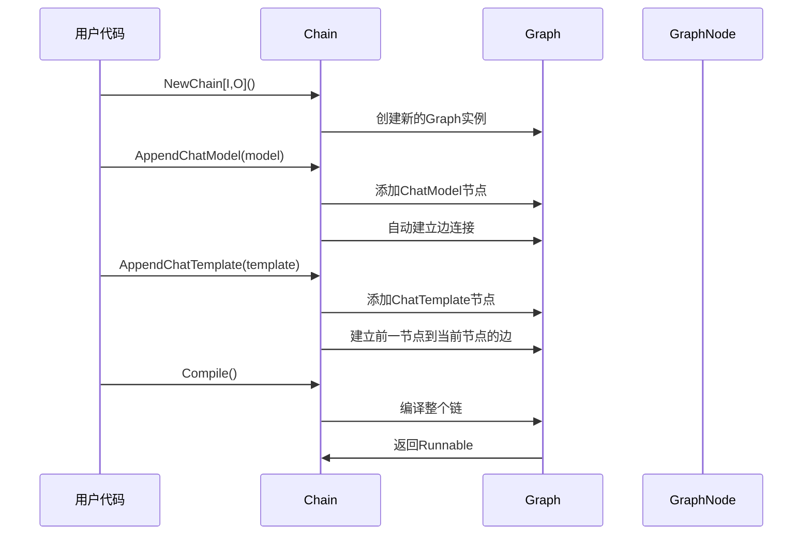
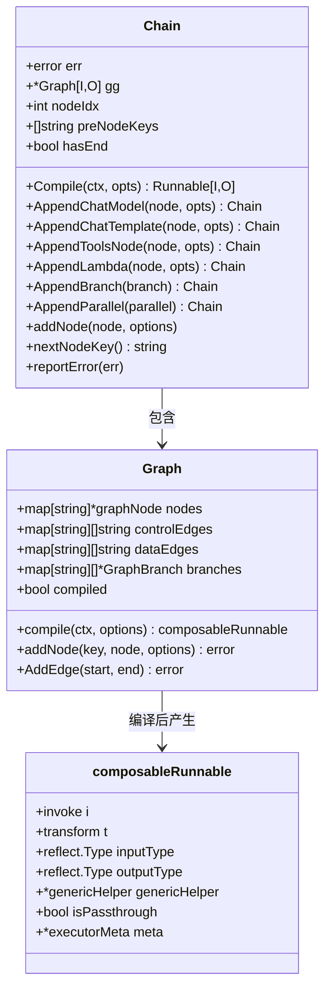
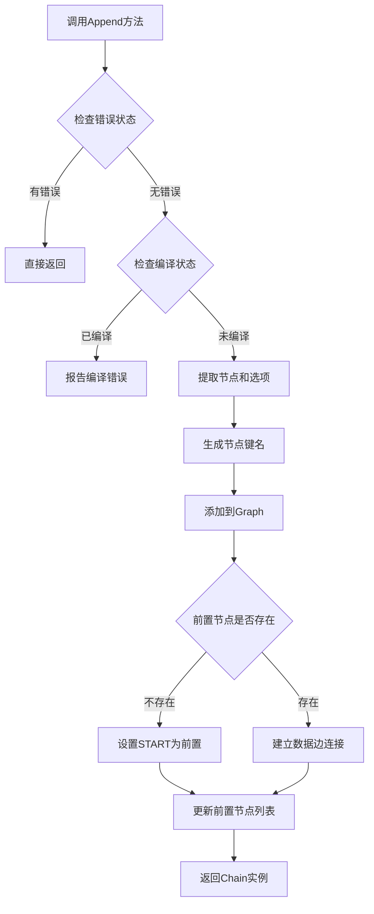
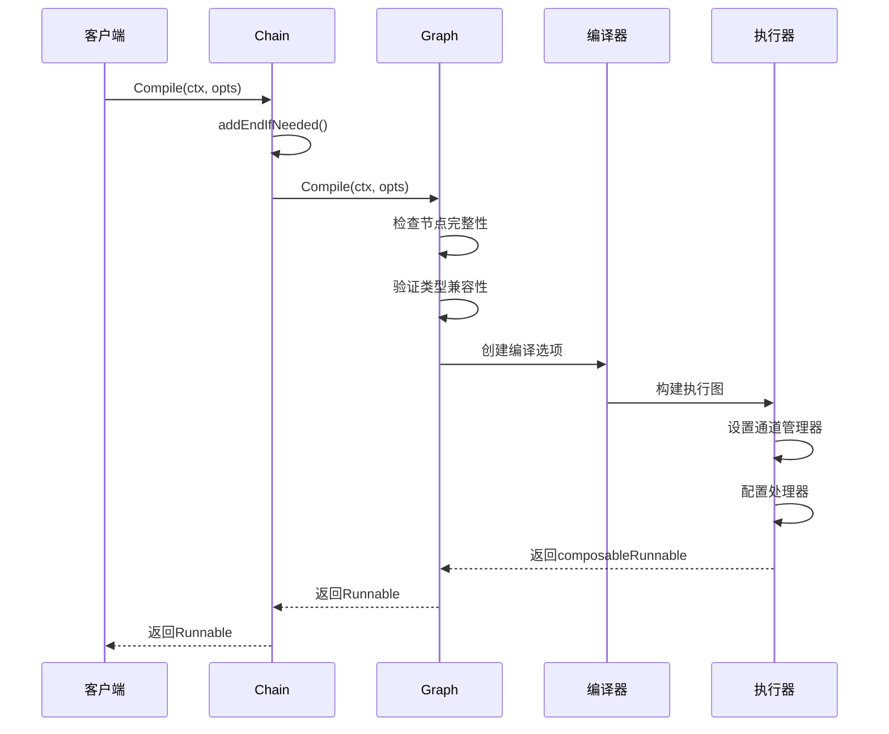
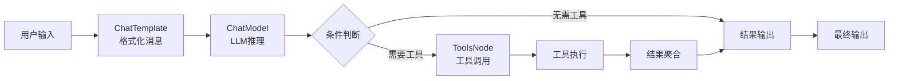
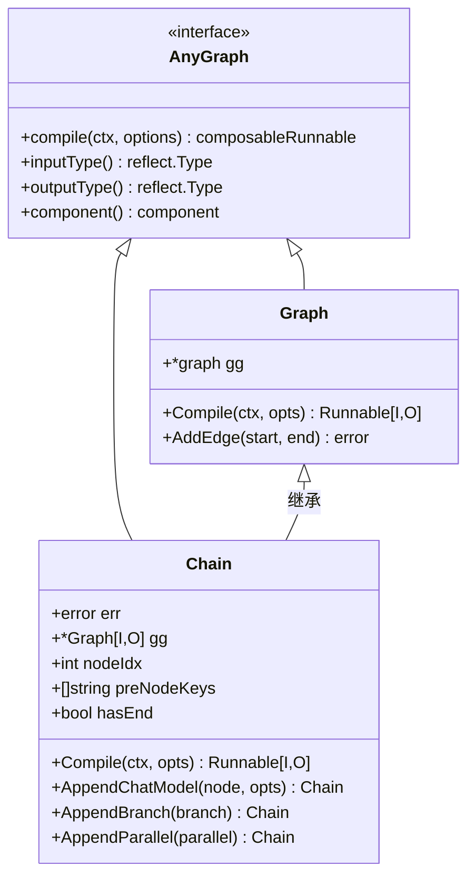
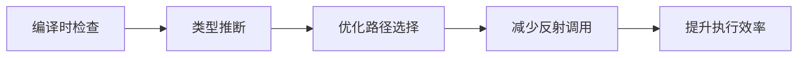

# 链式编排（Chain）

<cite>
**本文档引用的文件**
- [chain.go](file://compose/chain.go)
- [graph.go](file://compose/graph.go)
- [runnable.go](file://compose/runnable.go)
- [types.go](file://compose/types.go)
- [chain_test.go](file://compose/chain_test.go)
- [graph_node.go](file://compose/graph_node.go)
- [generic_graph.go](file://compose/generic_graph.go)
- [chain_branch.go](file://compose/chain_branch.go)
- [chain_parallel.go](file://compose/chain_parallel.go)
</cite>

## 目录
1. [简介](#简介)
2. [核心架构](#核心架构)
3. [构建器模式设计](#构建器模式设计)
4. [核心结构体分析](#核心结构体分析)
5. [节点添加机制](#节点添加机制)
6. [编译过程详解](#编译过程详解)
7. [完整使用示例](#完整使用示例)
8. [与Graph的关系](#与graph的关系)
9. [性能特征分析](#性能特征分析)
10. [局限性讨论](#局限性讨论)
11. [总结](#总结)

## 简介

Chain编排模式是Eino框架中一种线性、顺序执行的流程控制机制，它通过构建器模式（Builder Pattern）将多个组件（如ChatModel、ChatTemplate、Tool等）串联成一个执行链。Chain的核心设计理念是提供流畅的API调用方式，使开发者能够以声明式的方式构建复杂的业务流程。

Chain继承自Graph[I, O]，封装了Graph的复杂性，为用户提供了一个更加简洁易用的接口。它支持多种类型的组件添加，包括ChatModel、ChatTemplate、ToolsNode、Lambda等，同时提供了条件分支（Branch）和并行执行（Parallel）的能力。

## 核心架构

Chain编排模式采用了分层架构设计，主要包含以下几个层次：

```mermaid
graph TB
subgraph "用户接口层"
A[Chain[I,O]] --> B[Fluent API]
B --> C[Builder Methods]
end
subgraph "核心管理层"
D[Graph[I,O]] --> E[Node Management]
E --> F[Edge Management]
F --> G[Compilation]
end
subgraph "执行层"
H[Runnable[I,O]] --> I[Execution Engine]
I --> J[Component Runtime]
end
A --> D
D --> H
```

**图表来源**
- [chain.go](file://compose/chain.go#L72-L82)
- [graph.go](file://compose/graph.go#L57-L89)

**章节来源**
- [chain.go](file://compose/chain.go#L47-L82)
- [graph.go](file://compose/graph.go#L57-L89)

## 构建器模式设计

Chain采用经典的构建器模式，提供了流畅的API链式调用。每个节点添加方法都返回Chain实例本身，支持连续调用：



**图表来源**
- [chain.go](file://compose/chain.go#L165-L231)
- [chain.go](file://compose/chain.go#L522-L562)

这种设计模式的优势在于：
- **类型安全**：通过泛型确保输入输出类型的正确性
- **流畅API**：支持链式调用，代码可读性强
- **错误累积**：早期发现配置错误，避免运行时问题

**章节来源**
- [chain.go](file://compose/chain.go#L165-L231)
- [chain.go](file://compose/chain.go#L522-L562)

## 核心结构体分析

Chain的核心结构体包含了执行链所需的所有状态信息：



**图表来源**
- [chain.go](file://compose/chain.go#L72-L82)
- [graph.go](file://compose/graph.go#L57-L89)
- [runnable.go](file://compose/runnable.go#L46-L63)

### 关键字段说明

| 字段 | 类型 | 作用 |
|------|------|------|
| `gg` | `*Graph[I, O]` | 内部封装的Graph实例，负责实际的节点管理和编译 |
| `nodeIdx` | `int` | 节点索引计数器，用于生成唯一的节点键名 |
| `preNodeKeys` | `[]string` | 前置节点的键名列表，用于建立边连接 |
| `hasEnd` | `bool` | 标记是否已经添加了结束节点 |

**章节来源**
- [chain.go](file://compose/chain.go#L72-L82)

## 节点添加机制

Chain的节点添加机制是其核心功能之一，通过统一的接口支持多种类型的组件：



**图表来源**
- [chain.go](file://compose/chain.go#L522-L562)

### 节点类型支持

Chain支持以下类型的节点添加：

| 方法 | 支持的组件类型 | 用途 |
|------|----------------|------|
| `AppendChatModel` | `model.BaseChatModel` | 添加聊天模型节点 |
| `AppendChatTemplate` | `prompt.ChatTemplate` | 添加聊天模板节点 |
| `AppendToolsNode` | `*ToolsNode` | 添加工具节点 |
| `AppendLambda` | `*Lambda` | 添加自定义逻辑节点 |
| `AppendEmbedding` | `embedding.Embedder` | 添加嵌入节点 |
| `AppendRetriever` | `retriever.Retriever` | 添加检索节点 |
| `AppendLoader` | `document.Loader` | 添加加载器节点 |
| `AppendIndexer` | `indexer.Indexer` | 添加索引器节点 |

**章节来源**
- [chain.go](file://compose/chain.go#L165-L231)

## 编译过程详解

Chain的编译过程是一个复杂但有序的步骤，最终将链转换为可执行的Runnable：



**图表来源**
- [chain.go](file://compose/chain.go#L157-L163)
- [graph.go](file://compose/graph.go#L639-L800)

### 编译阶段详解

1. **结束节点添加**：自动添加END节点并建立连接
2. **类型验证**：检查所有节点的输入输出类型兼容性
3. **边连接验证**：确保数据流向正确
4. **执行图构建**：创建可执行的图结构
5. **通道配置**：设置数据流和控制流通道

**章节来源**
- [chain.go](file://compose/chain.go#L88-L121)
- [graph.go](file://compose/graph.go#L639-L800)

## 完整使用示例

以下是一个完整的Chain使用示例，展示了从用户输入到LLM生成再到工具调用的完整流程：



**图表来源**
- [chain_test.go](file://compose/chain_test.go#L76-L100)

这个示例展示了典型的Chain使用模式：
1. **预处理阶段**：使用ChatTemplate格式化用户输入
2. **核心处理**：通过ChatModel进行LLM推理
3. **条件分支**：根据LLM输出决定是否需要工具调用
4. **工具执行**：如果需要，调用相应的工具
5. **结果整合**：将所有结果整合为最终输出

**章节来源**
- [chain_test.go](file://compose/chain_test.go#L76-L100)

## 与Graph的关系

Chain与Graph之间存在密切的关系，Chain可以看作是Graph的一个特化版本：



**图表来源**
- [types.go](file://compose/types.go#L23-L47)
- [graph.go](file://compose/generic_graph.go#L89-L91)
- [chain.go](file://compose/chain.go#L72-L82)

### 主要区别

| 特性 | Chain | Graph |
|------|-------|-------|
| 节点添加 | 流畅的Builder API | 显式的AddNode方法 |
| 边连接 | 自动管理 | 手动管理 |
| 类型安全 | 泛型强类型 | 运行时类型检查 |
| 使用场景 | 简单线性流程 | 复杂有向无环图 |

**章节来源**
- [types.go](file://compose/types.go#L23-L47)
- [graph.go](file://compose/generic_graph.go#L89-L91)

## 性能特征分析

Chain编排模式在性能方面具有以下特征：

### 类型安全优势

Chain通过泛型提供了编译时类型检查，避免了运行时类型转换开销：



**图表来源**
- [runnable.go](file://compose/runnable.go#L100-L150)

### 流式处理能力

Chain支持多种数据流模式：
- **Invoke**：一次性输入输出
- **Stream**：流式输入输出
- **Collect**：流式输入一次性输出  
- **Transform**：流式输入流式输出

### 回调系统集成

Chain与Eino的回调系统深度集成，支持：
- **全局回调**：在整个执行链上生效
- **节点级回调**：针对特定节点
- **条件回调**：基于执行上下文的动态回调

**章节来源**
- [runnable.go](file://compose/runnable.go#L38-L63)

## 局限性讨论

尽管Chain提供了强大的编排能力，但也存在一些局限性：

### 条件分支限制

Chain的条件分支功能相对简单，不支持复杂的条件逻辑：
- 只能基于单一条件进行二选一分支
- 不支持多条件组合判断
- 无法实现循环或递归逻辑

### 并行执行限制

虽然支持并行节点，但并行能力有限：
- 并行节点间缺乏直接通信机制
- 无法实现复杂的并行同步模式
- 错误处理较为简单

### 复杂度管理

对于过于复杂的业务流程：
- Chain可能会变得难以维护
- 需要频繁使用Graph作为补充
- 类型推断可能变得困难

### 性能考虑

在某些场景下可能存在性能瓶颈：
- 多层嵌套的Chain可能导致栈深度过大
- 大量节点的链式调用可能影响启动性能
- 内存占用随着节点数量增加而增长

## 总结

Chain编排模式是Eino框架中一个精心设计的流程控制机制，它通过构建器模式提供了简洁易用的API，同时保持了强大的功能性和类型安全性。Chain特别适合于构建线性、顺序执行的业务流程，如传统的RAG应用、对话系统等场景。

Chain的核心优势在于：
- **流畅的API设计**：链式调用提高了代码可读性
- **类型安全保障**：泛型确保编译时类型正确性
- **自动化的边管理**：简化了节点间的连接配置
- **丰富的组件支持**：涵盖了常见的AI应用组件

然而，在面对更复杂的业务需求时，开发者应该考虑结合Graph的灵活性，或者在适当场景下使用其他编排模式。Chain与Graph的协同使用，能够充分发挥各自的优势，构建出既高效又灵活的应用系统。