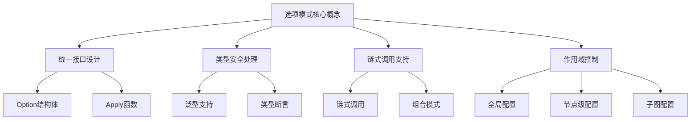
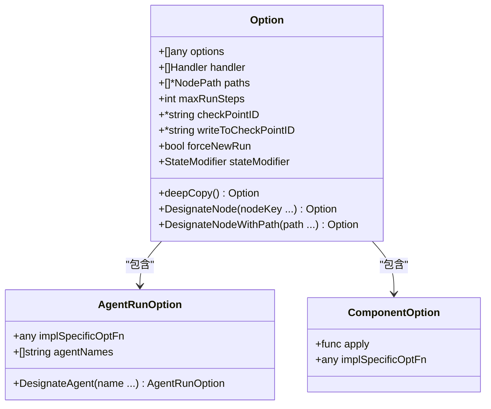
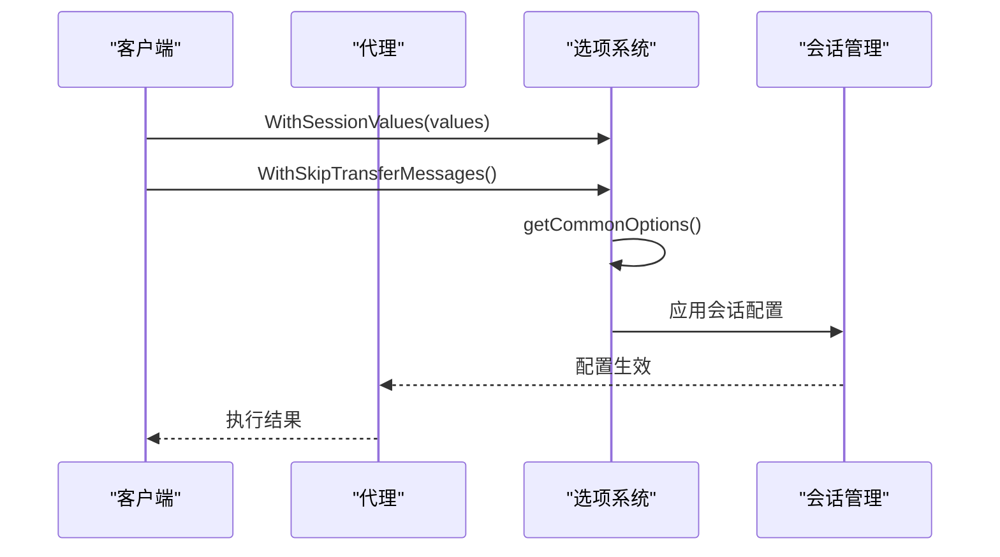
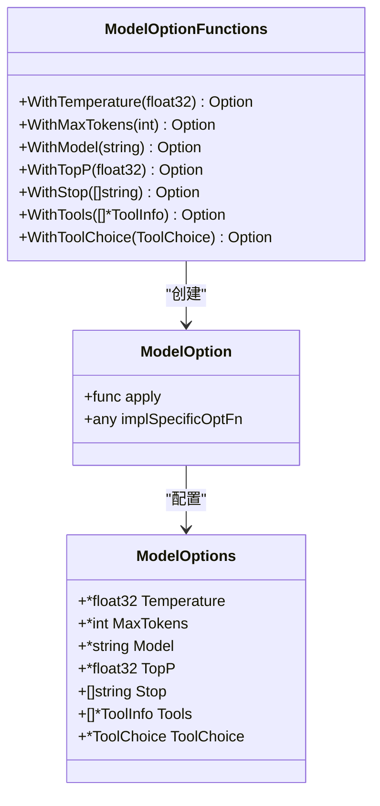
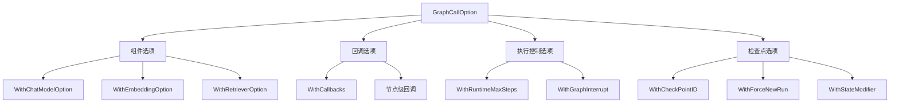
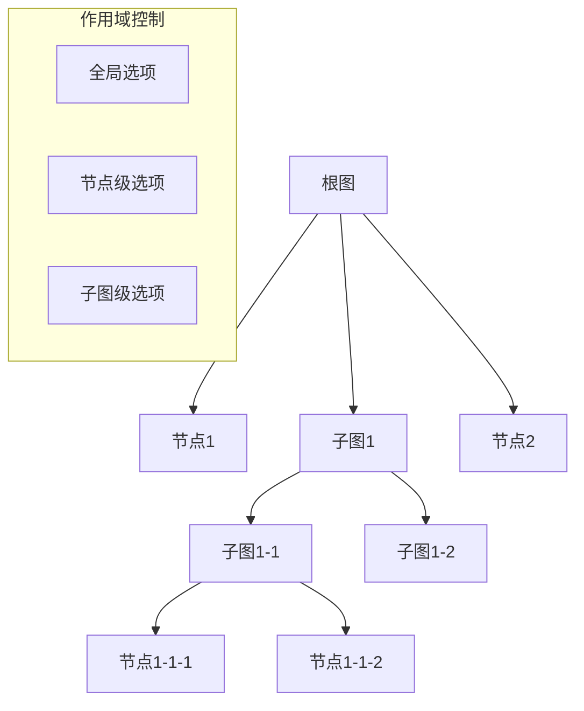
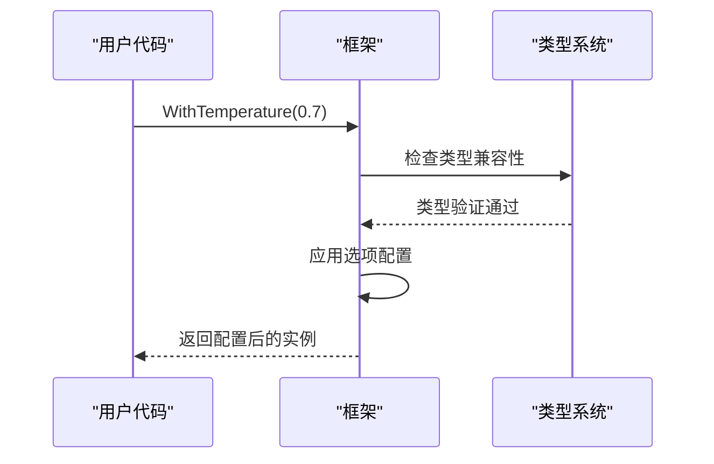
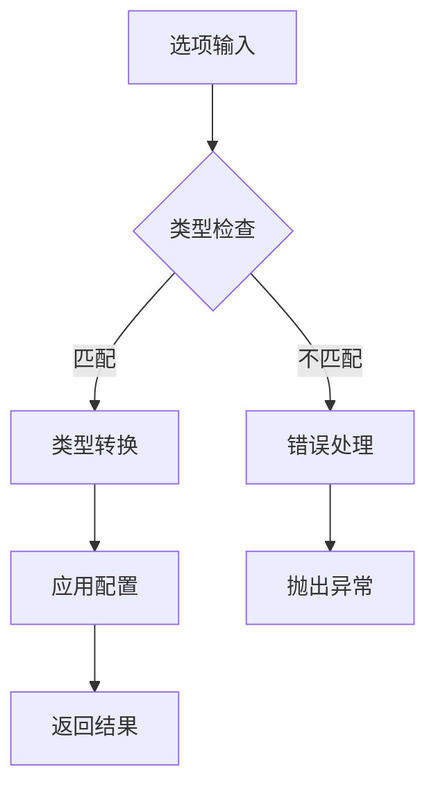
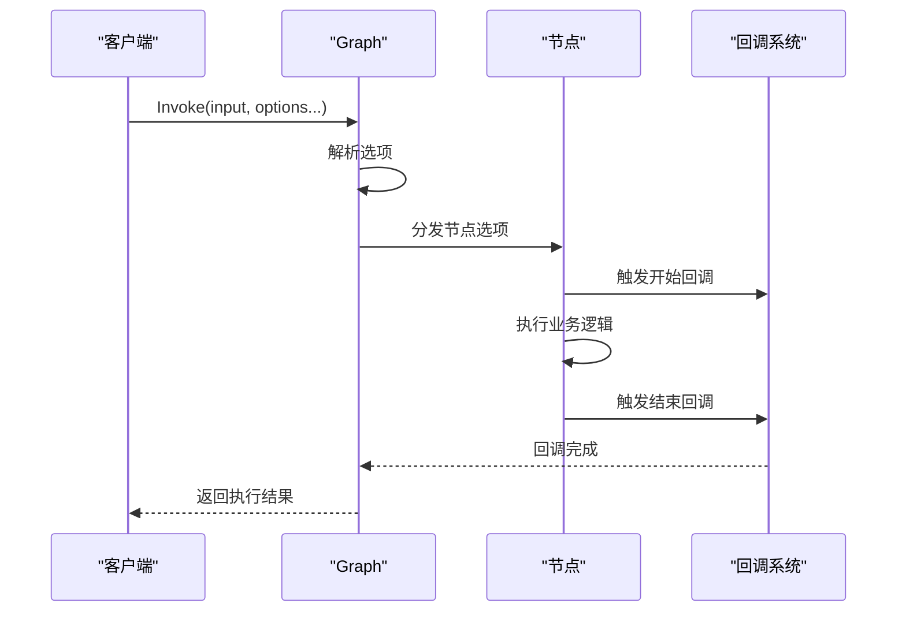
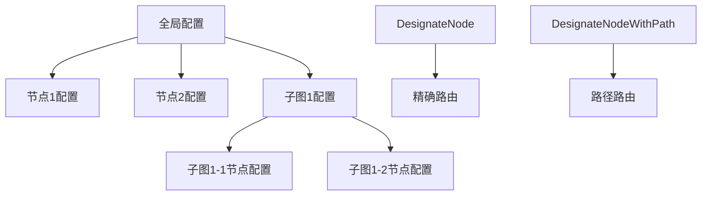

# 选项（Options）

<cite>
**本文档中引用的文件**
- [adk/call_option.go](file://adk/call_option.go)
- [components/model/option.go](file://components/model/option.go)
- [compose/graph_call_options.go](file://compose/graph_call_options.go)
- [components/document/option.go](file://components/document/option.go)
- [components/embedding/option.go](file://components/embedding/option.go)
- [compose/graph_call_options_test.go](file://compose/graph_call_options_test.go)
- [components/model/option_test.go](file://components/model/option_test.go)
- [components/document/option_test.go](file://components/document/option_test.go)
- [compose/checkpoint.go](file://compose/checkpoint.go)
- [adk/call_option_test.go](file://adk/call_option_test.go)
- [compose/utils.go](file://compose/utils.go)
- [compose/types.go](file://compose/types.go)
</cite>

## 目录
1. [简介](#简介)
2. [选项模式概述](#选项模式概述)
3. [核心架构设计](#核心架构设计)
4. [分层选项实现](#分层选项实现)
5. [节点路径与作用域控制](#节点路径与作用域控制)
6. [类型安全的选项处理](#类型安全的选项处理)
7. [综合使用示例](#综合使用示例)
8. [性能考虑](#性能考虑)
9. [最佳实践](#最佳实践)
10. [总结](#总结)

## 简介

Eino框架采用统一的选项（Option）模式来提供灵活、可扩展的配置机制。该设计模式有效解决了传统构造函数参数膨胀的问题，通过函数式编程的方式为组件和调用设置参数，支持链式调用和类型安全的配置管理。

选项模式在Eino框架中贯穿整个架构，从底层的组件配置到顶层的编排执行，都采用了统一的设计理念。这种一致性不仅提高了代码的可维护性，还为用户提供了统一的配置体验。

## 选项模式概述

选项模式是一种设计模式，通过将配置参数封装为独立的选项函数，允许开发者以链式调用的方式组合多个配置项。在Eino框架中，这一模式被广泛应用于各个层次：

**图表来源**
- [adk/call_option.go](file://adk/call_option.go#L19-L30)
- [components/model/option.go](file://components/model/option.go#L39-L45)

## 核心架构设计

### 基础选项结构

Eino框架的核心选项结构体现了统一的设计原则：

**图表来源**
- [adk/call_option.go](file://adk/call_option.go#L19-L30)
- [components/model/option.go](file://components/model/option.go#L39-L45)
- [compose/graph_call_options.go](file://compose/graph_call_options.go#L79-L91)

### 选项提取机制

框架提供了两种主要的选项提取机制：

1. **通用选项提取**：适用于标准配置
2. **实现特定选项提取**：适用于组件级别的自定义配置

**章节来源**
- [adk/call_option.go](file://adk/call_option.go#L38-L44)
- [components/model/option.go](file://components/model/option.go#L119-L133)

## 分层选项实现

### ADK层选项（AgentRunOption）

ADK层的选项主要用于代理运行时的配置，支持会话值管理和消息传输控制：

**图表来源**
- [adk/call_option.go](file://adk/call_option.go#L46-L56)

### 组件层选项

每个组件都有自己的选项定义，遵循统一的接口规范：

**图表来源**
- [components/model/option.go](file://components/model/option.go#L22-L37)
- [components/model/option.go](file://components/model/option.go#L46-L109)

### 编排层选项（GraphCallOption）

编排层的选项最为复杂，支持多种类型的配置：

**图表来源**
- [compose/graph_call_options.go](file://compose/graph_call_options.go#L136-L208)
- [compose/checkpoint.go](file://compose/checkpoint.go#L88-L108)

**章节来源**
- [adk/call_option.go](file://adk/call_option.go#L1-L111)
- [components/model/option.go](file://components/model/option.go#L1-L160)
- [compose/graph_call_options.go](file://compose/graph_call_options.go#L1-L249)

## 节点路径与作用域控制

### 路径设计

Eino框架通过节点路径实现了精细的作用域控制：

**图表来源**
- [compose/graph_call_options.go](file://compose/graph_call_options.go#L111-L134)
- [compose/utils.go](file://compose/utils.go#L256-L324)

### 选项传播机制

选项在编排执行过程中的传播遵循以下规则：

1. **全局选项**：应用到所有节点
2. **节点级选项**：仅影响指定节点
3. **子图级选项**：影响子图内的所有节点

**章节来源**
- [compose/graph_call_options_test.go](file://compose/graph_call_options_test.go#L304-L496)
- [compose/utils.go](file://compose/utils.go#L256-L324)

## 类型安全的选项处理

### 泛型支持

Eino框架充分利用Go语言的泛型特性实现类型安全的选项处理：

**图表来源**
- [components/model/option.go](file://components/model/option.go#L112-L159)
- [compose/graph_call_options.go](file://compose/graph_call_options.go#L235-L249)

### 类型转换与验证

框架提供了完善的类型转换和验证机制：

**图表来源**
- [compose/graph_call_options.go](file://compose/graph_call_options.go#L235-L249)

**章节来源**
- [components/model/option.go](file://components/model/option.go#L112-L159)
- [compose/graph_call_options.go](file://compose/graph_call_options.go#L235-L249)

## 综合使用示例

### 基本链式调用示例

以下展示了如何使用选项模式配置Graph的执行行为：

**图表来源**
- [compose/graph_call_options_test.go](file://compose/graph_call_options_test.go#L135-L158)

### 复杂配置场景

在实际应用中，可以组合多种选项来实现复杂的配置需求：

**图表来源**
- [compose/graph_call_options_test.go](file://compose/graph_call_options_test.go#L135-L158)

### 节点级配置示例

选项模式支持精确的节点级配置控制：

**图表来源**
- [compose/graph_call_options_test.go](file://compose/graph_call_options_test.go#L489-L496)

**章节来源**
- [compose/graph_call_options_test.go](file://compose/graph_call_options_test.go#L1-L497)
- [components/model/option_test.go](file://components/model/option_test.go#L1-L111)

## 性能考虑

### 内存优化

选项模式在设计时充分考虑了内存效率：

1. **延迟初始化**：只有在需要时才创建选项实例
2. **共享引用**：相同配置的选项可以共享实例
3. **深度复制**：在必要时进行安全的深度复制

### 执行效率

选项处理的执行效率通过以下方式优化：

1. **类型缓存**：缓存类型信息减少反射开销
2. **批量处理**：一次性处理多个选项
3. **短路求值**：在条件不满足时提前退出

**章节来源**
- [compose/graph_call_options.go](file://compose/graph_call_options.go#L93-L109)
- [compose/utils.go](file://compose/utils.go#L256-L324)

## 最佳实践

### 选项设计原则

1. **单一职责**：每个选项函数只负责一个配置项
2. **命名规范**：使用清晰的函数命名表示配置意图
3. **默认值处理**：提供合理的默认配置
4. **类型安全**：确保编译时类型检查

### 使用建议

1. **链式调用**：充分利用链式调用提高代码可读性
2. **作用域控制**：合理使用节点级配置避免全局污染
3. **组合使用**：根据需要组合不同的选项类型
4. **错误处理**：妥善处理选项配置过程中的错误

### 调试技巧

1. **选项验证**：在开发阶段验证选项配置的正确性
2. **日志记录**：记录选项应用的过程便于调试
3. **单元测试**：为选项相关的功能编写专门的测试

**章节来源**
- [components/model/option_test.go](file://components/model/option_test.go#L26-L111)
- [components/document/option_test.go](file://components/document/option_test.go#L27-L79)

## 总结

Eino框架的选项（Option）模式是一个精心设计的配置管理系统，它成功地解决了传统构造函数参数膨胀的问题，同时保持了高度的灵活性和类型安全性。

### 主要优势

1. **统一接口**：在整个框架中提供一致的配置体验
2. **类型安全**：利用Go语言的泛型特性确保编译时类型检查
3. **灵活配置**：支持链式调用和组合配置
4. **作用域控制**：提供精确的配置作用域管理
5. **扩展性强**：易于添加新的选项类型和配置项

### 设计亮点

- **分层架构**：从ADK到组件再到编排的完整覆盖
- **类型推导**：自动推导选项类型，简化用户使用
- **错误处理**：完善的错误处理和类型验证机制
- **性能优化**：内存和执行效率的双重优化

选项模式在Eino框架中的成功应用，为其他大型系统的配置管理提供了宝贵的参考经验。它不仅提高了代码的可维护性和可扩展性，还为用户提供了直观易用的配置接口。