# 流式处理

<cite>
**本文档引用的文件**
- [compose/stream_reader.go](file://compose/stream_reader.go)
- [compose/stream_concat.go](file://compose/stream_concat.go)
- [schema/stream.go](file://schema/stream.go)
- [compose/runnable.go](file://compose/runnable.go)
- [compose/types.go](file://compose/types.go)
- [compose/graph.go](file://compose/graph.go)
- [compose/chain.go](file://compose/chain.go)
- [compose/values_merge.go](file://compose/values_merge.go)
- [compose/types_lambda.go](file://compose/types_lambda.go)
- [adk/prebuilt/planexecute/plan_execute.go](file://adk/prebuilt/planexecute/plan_execute.go)
- [adk/chatmodel.go](file://adk/chatmodel.go)
</cite>

## 目录
1. [简介](#简介)
2. [流式处理的重要性](#流式处理的重要性)
3. [四种流式范式](#四种流式范式)
4. [核心架构设计](#核心架构设计)
5. [流式组件的自动管理](#流式组件的自动管理)
6. [在Chain和Graph中使用流式组件](#在chain和graph中使用流式组件)
7. [流类型定义](#流类型定义)
8. [实际应用场景](#实际应用场景)
9. [性能考虑](#性能考虑)
10. [总结](#总结)

## 简介

Eino的流式处理能力是其核心特性之一，专门为现代AI应用中的实时数据处理需求而设计。该框架提供了完整的流式处理解决方案，能够高效地处理大型语言模型(LLM)的流式输出，支持逐字生成、实时响应等场景。

流式处理的核心价值在于：
- **实时性**：无需等待完整输出即可开始处理部分数据
- **内存效率**：避免一次性加载大量数据到内存
- **用户体验**：提供即时反馈，提升交互体验
- **可扩展性**：支持大规模并发流处理

## 流式处理的重要性

在现代AI应用中，特别是涉及大型语言模型的应用，流式处理具有至关重要的作用：

### LLM流式输出的优势

1. **用户体验优化**：用户可以立即看到部分生成内容，而不是等待整个回答完成
2. **资源利用效率**：减少内存占用，提高系统吞吐量
3. **错误处理改进**：可以在生成过程中及时发现和处理问题
4. **网络传输优化**：减少延迟，提高响应速度

### 应用场景

- **聊天机器人**：实时对话生成
- **文本生成**：文章、代码等的逐步生成
- **数据分析**：流式数据处理和分析
- **实时翻译**：逐字翻译和显示

## 四种流式范式

Eino框架提供了四种主要的流式处理范式，每种都针对不同的使用场景进行了优化：

### 1. Invoke（同步调用）

Invoke模式提供传统的同步接口，但内部支持流式处理能力。

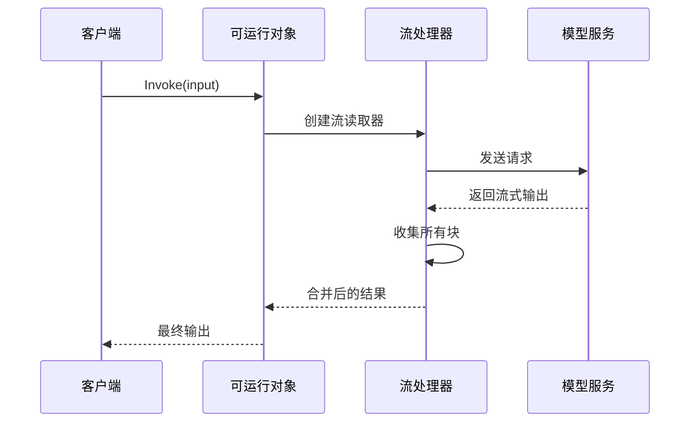

**图表来源**
- [compose/runnable.go](file://compose/runnable.go#L158-L168)

### 2. Stream（流式输出）

Stream模式直接返回流式读取器，支持实时数据消费。

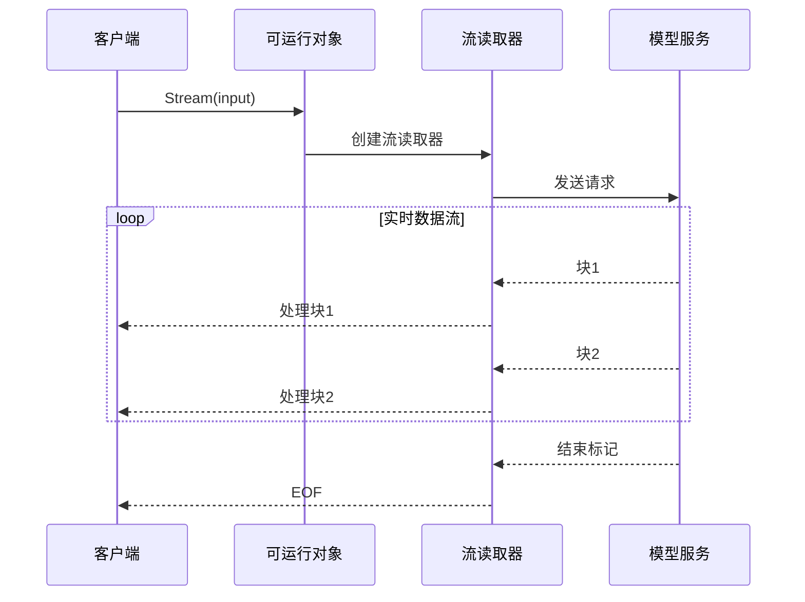

**图表来源**
- [compose/runnable.go](file://compose/runnable.go#L164-L168)

### 3. Collect（收集流）

Collect模式允许从流中收集所有数据，然后进行批量处理。

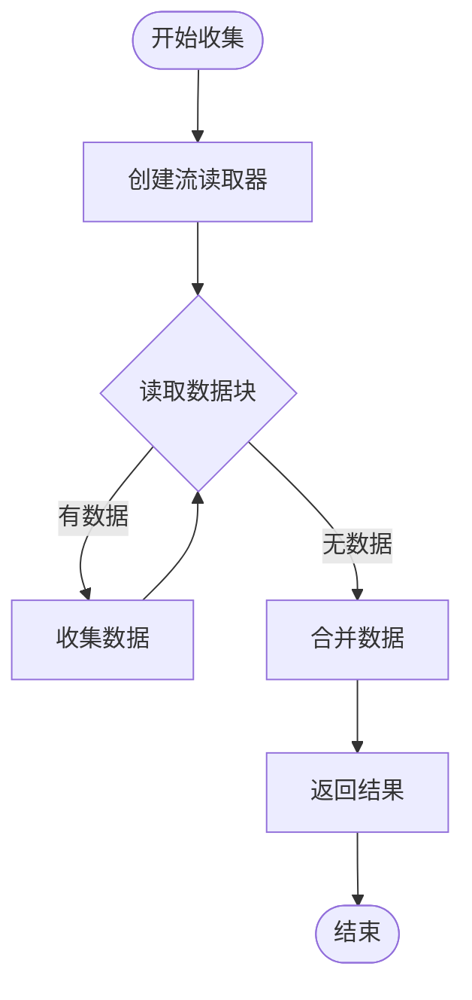

**图表来源**
- [compose/stream_concat.go](file://compose/stream_concat.go#L50-L88)

### 4. Transform（转换流）

Transform模式支持对输入流进行转换后输出新的流。

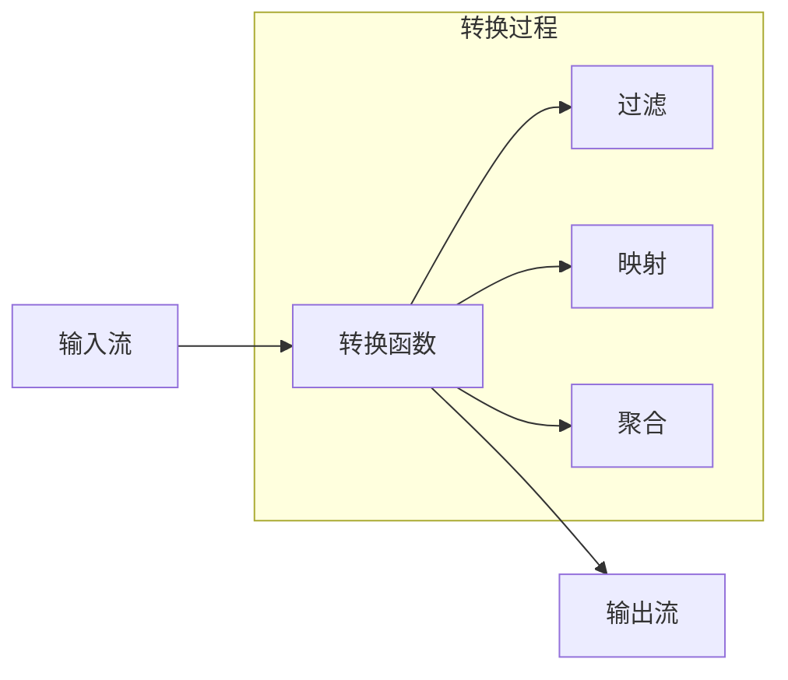

**图表来源**
- [compose/runnable.go](file://compose/runnable.go#L177-L180)

**章节来源**
- [compose/runnable.go](file://compose/runnable.go#L28-L37)

## 核心架构设计

Eino的流式处理架构基于分层设计，确保了灵活性和可扩展性：

### 架构层次

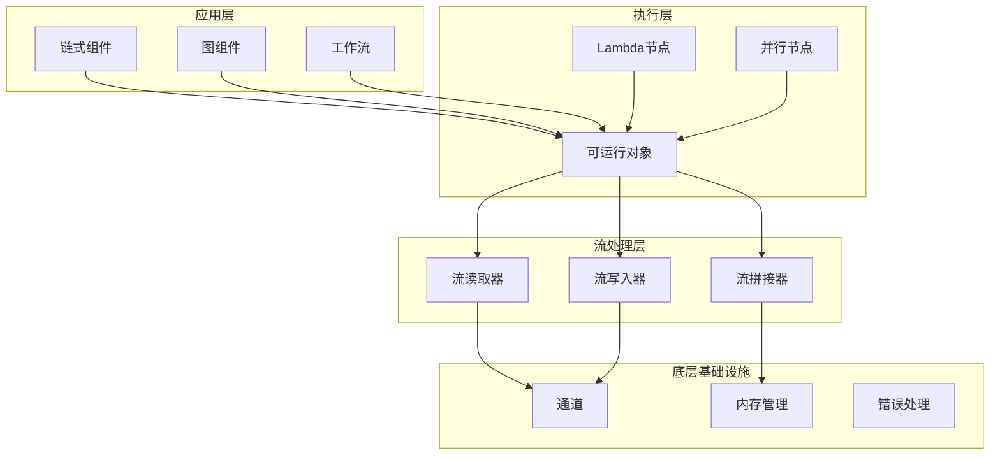

**图表来源**
- [compose/graph.go](file://compose/graph.go#L57-L90)
- [compose/chain.go](file://compose/chain.go#L72-L83)

### 关键组件

1. **StreamReader**：负责从流中读取数据
2. **StreamWriter**：负责向流中写入数据  
3. **StreamConcat**：负责合并多个流
4. **Lambda**：提供自定义流处理逻辑

**章节来源**
- [schema/stream.go](file://schema/stream.go#L101-L139)
- [schema/stream.go](file://schema/stream.go#L140-L179)

## 流式组件的自动管理

Eino框架通过智能的流管理机制，为开发者提供了透明化的流处理体验：

### 自动流拼接

框架自动处理多个流的拼接操作，无需开发者手动干预：

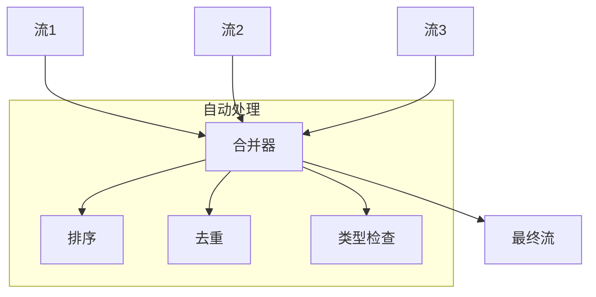

**图表来源**
- [compose/stream_reader.go](file://compose/stream_reader.go#L79-L93)

### 流复制机制

框架支持流的多路复制，确保每个消费者都能独立消费流数据：

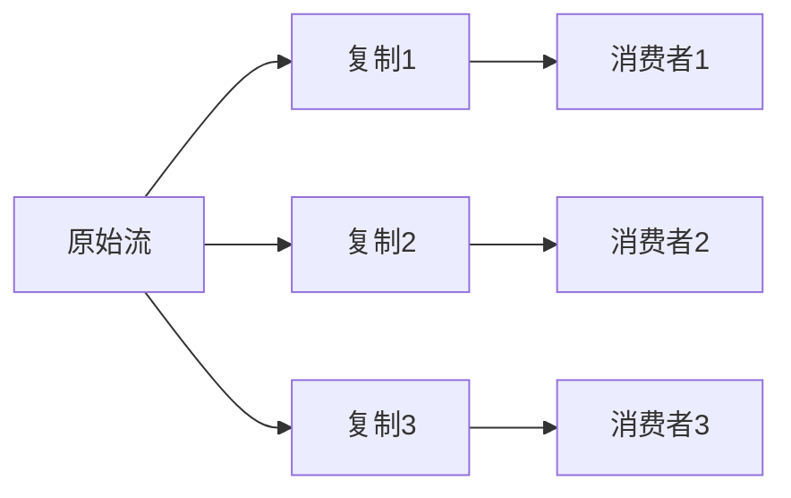

**图表来源**
- [compose/stream_reader.go](file://compose/stream_reader.go#L45-L54)

### 内存管理

框架实现了智能的内存管理策略：

1. **自动关闭**：流使用完毕后自动释放资源
2. **垃圾回收**：通过finalizer机制确保资源清理
3. **背压控制**：防止内存溢出

**章节来源**
- [schema/stream.go](file://schema/stream.go#L259-L292)
- [compose/stream_reader.go](file://compose/stream_reader.go#L41-L43)

## 在Chain和Graph中使用流式组件

Eino框架在Chain和Graph中无缝集成流式处理能力，提供了灵活的组合方式：

### Chain中的流式处理

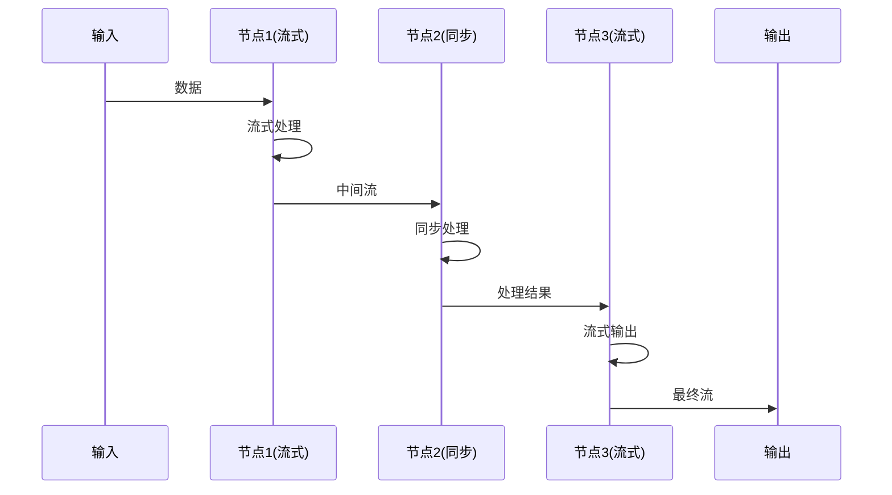

**图表来源**
- [compose/chain.go](file://compose/chain.go#L166-L204)

### Graph中的复杂流控制

Graph提供了更复杂的流控制能力，支持分支、并行和条件流：

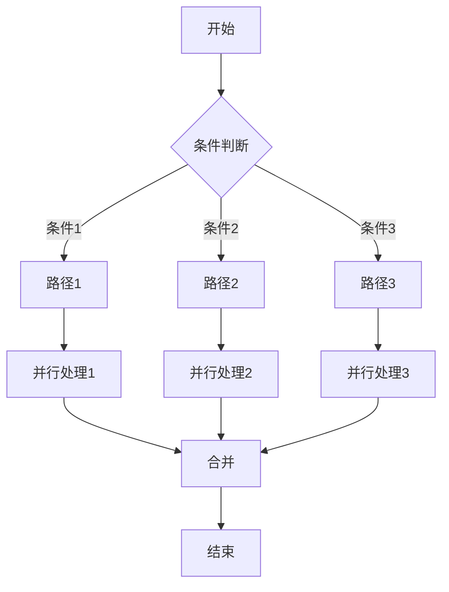

**图表来源**
- [compose/graph.go](file://compose/graph.go#L421-L431)

### Lambda节点的流式支持

Lambda节点提供了最灵活的流式处理方式：

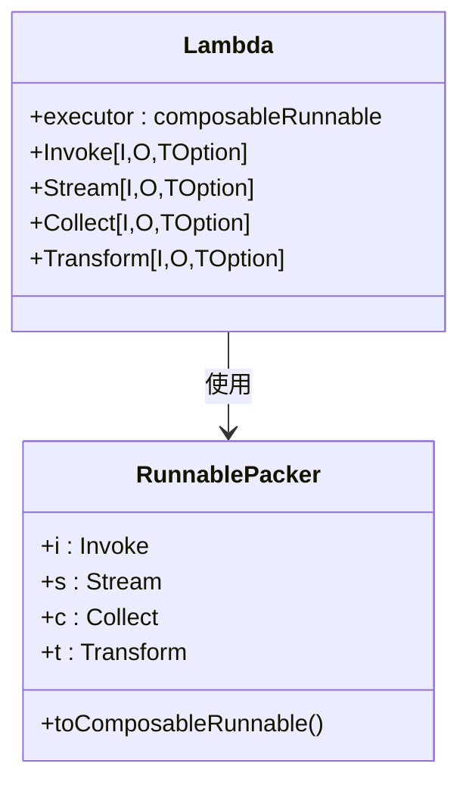

**图表来源**
- [compose/types_lambda.go](file://compose/types_lambda.go#L56-L67)
- [compose/runnable.go](file://compose/runnable.go#L72-L89)

**章节来源**
- [compose/chain.go](file://compose/chain.go#L165-L232)
- [compose/graph.go](file://compose/graph.go#L296-L419)

## 流类型定义

Eino在`schema/stream.go`中定义了完整的流类型体系，为各种流式操作提供了类型安全保障：

### 核心流类型

| 类型 | 描述 | 用途 |
|------|------|------|
| `StreamReader[T]` | 流读取器 | 从流中读取数据块 |
| `StreamWriter[T]` | 流写入器 | 向流中写入数据块 |
| `Pipe[T]` | 流管道 | 创建读写分离的流 |
| `streamReaderPacker[T]` | 流读取器包装器 | 提供类型安全的流操作 |

### 流处理接口

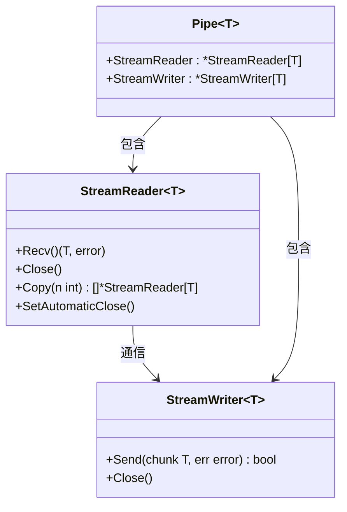

**图表来源**
- [schema/stream.go](file://schema/stream.go#L140-L179)
- [schema/stream.go](file://schema/stream.go#L101-L139)

### 流状态管理

框架提供了完善的流状态管理机制：

1. **打开状态**：流正在活跃使用
2. **关闭状态**：流已关闭，不再接受新数据
3. **错误状态**：流发生错误，需要特殊处理
4. **自动关闭**：通过垃圾回收机制自动清理

**章节来源**
- [schema/stream.go](file://schema/stream.go#L171-L226)
- [schema/stream.go](file://schema/stream.go#L354-L426)

## 实际应用场景

### LLM流式输出处理

以下是一个典型的LLM流式输出处理示例：

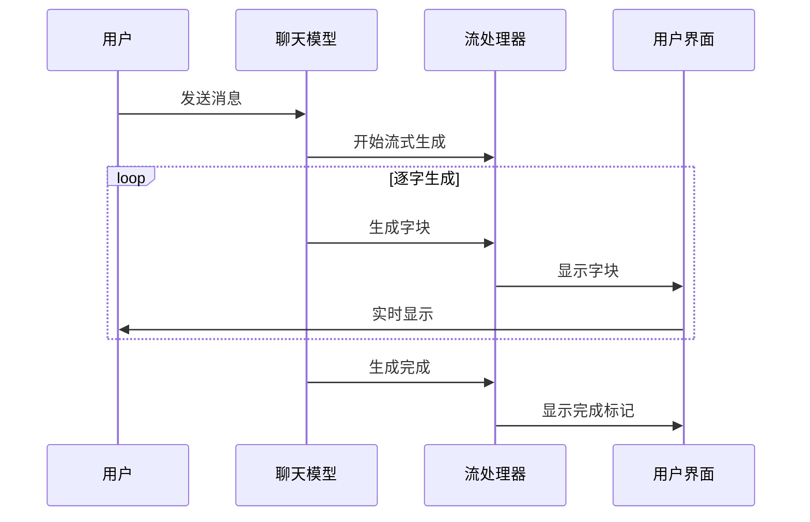

**图表来源**
- [adk/chatmodel.go](file://adk/chatmodel.go#L542-L590)

### 并行流处理

框架支持多个流的并行处理和合并：

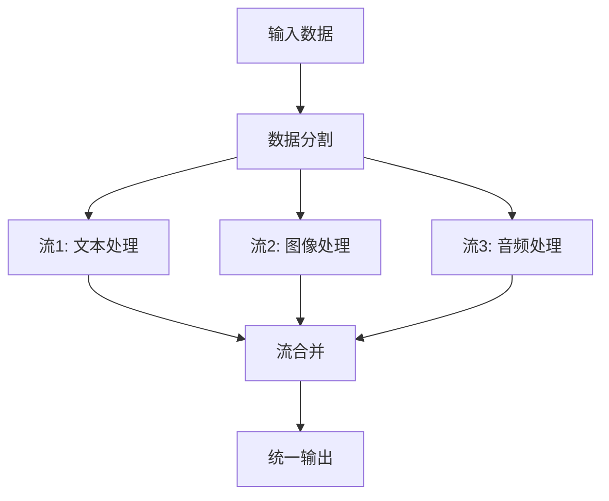

### 错误处理和恢复

框架提供了完善的错误处理机制：

1. **源EOF错误**：标识特定流的结束
2. **类型转换错误**：处理数据类型不匹配
3. **资源泄漏防护**：确保流正确关闭

**章节来源**
- [adk/prebuilt/planexecute/plan_execute.go](file://adk/prebuilt/planexecute/plan_execute.go#L346-L397)
- [adk/prebuilt/planexecute/plan_execute.go](file://adk/prebuilt/planexecute/plan_execute.go#L703-L759)

## 性能考虑

### 内存优化策略

1. **背压控制**：防止生产者过快导致内存溢出
2. **流缓冲**：合理设置缓冲区大小
3. **及时清理**：自动释放不再使用的流资源

### 并发处理

框架支持高效的并发流处理：

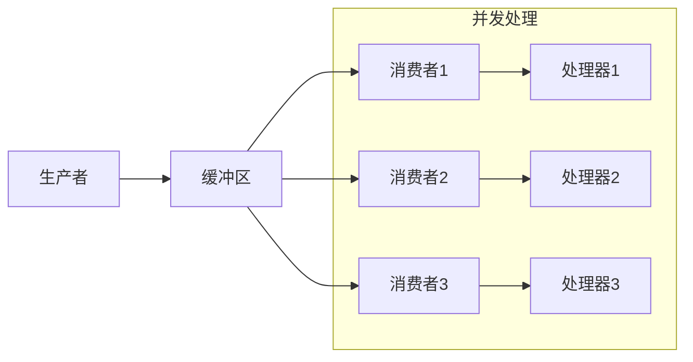

### 扩展性设计

1. **水平扩展**：支持多实例部署
2. **垂直扩展**：优化单实例性能
3. **弹性伸缩**：根据负载动态调整资源

## 总结

Eino的流式处理能力为现代AI应用提供了强大而灵活的解决方案。通过四种核心范式、智能的自动管理和丰富的组件支持，开发者可以轻松构建高性能的流式应用。

### 主要优势

1. **统一接口**：四种范式提供一致的编程模型
2. **自动管理**：透明的资源管理和错误处理
3. **高度可组合**：支持复杂的流式工作流
4. **性能优化**：内置的内存管理和并发控制

### 应用前景

随着AI技术的发展，流式处理将在以下领域发挥更大作用：

- **实时AI助手**：提供即时响应的对话系统
- **边缘计算**：在资源受限环境中高效处理数据
- **物联网**：处理来自各种传感器的实时数据流
- **大数据分析**：实时处理和分析海量数据

Eino的流式处理框架为这些应用场景提供了坚实的技术基础，使开发者能够专注于业务逻辑的实现，而不必担心底层的复杂性。