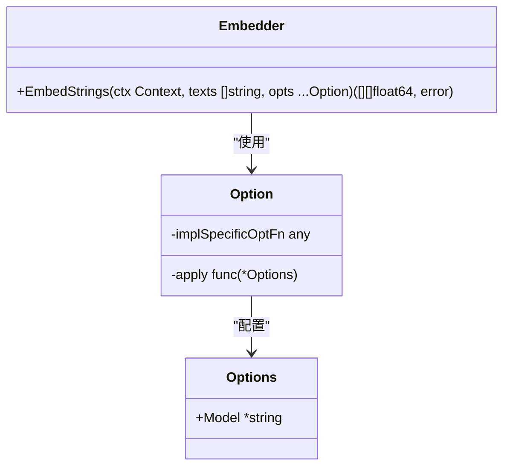
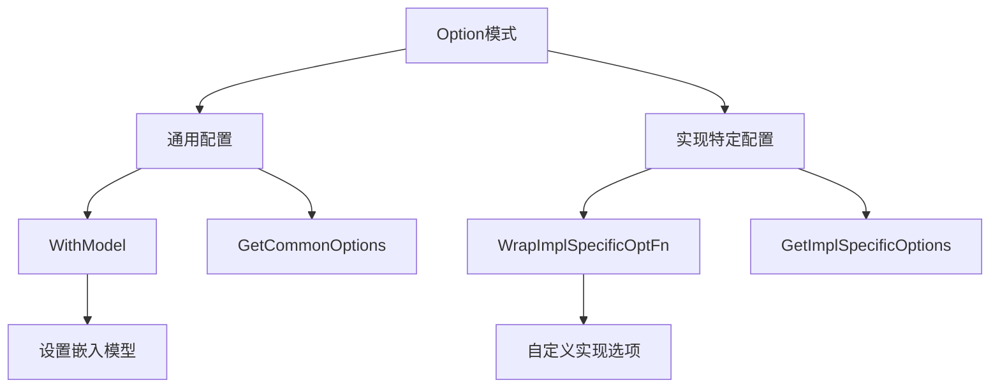
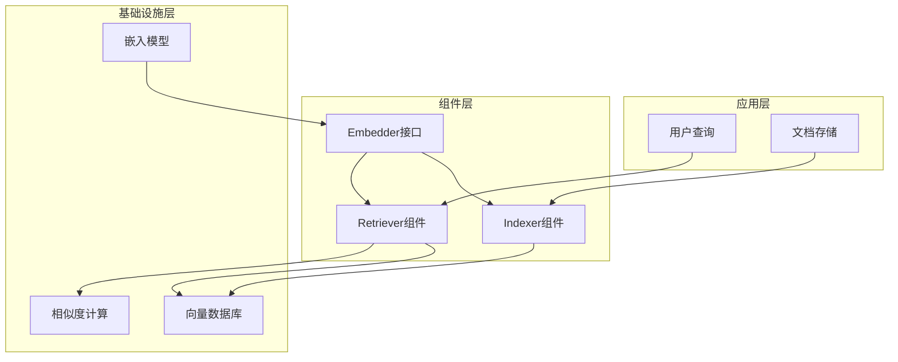
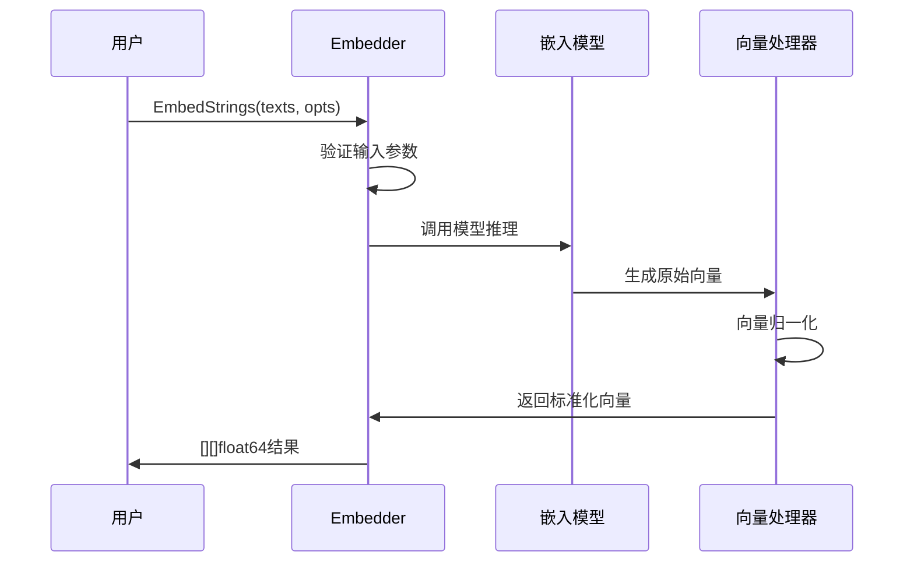
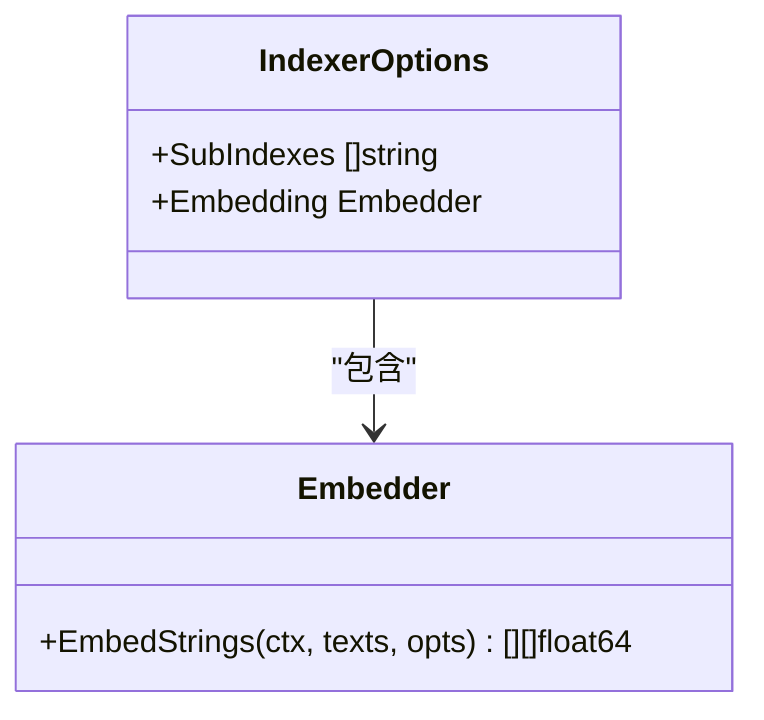
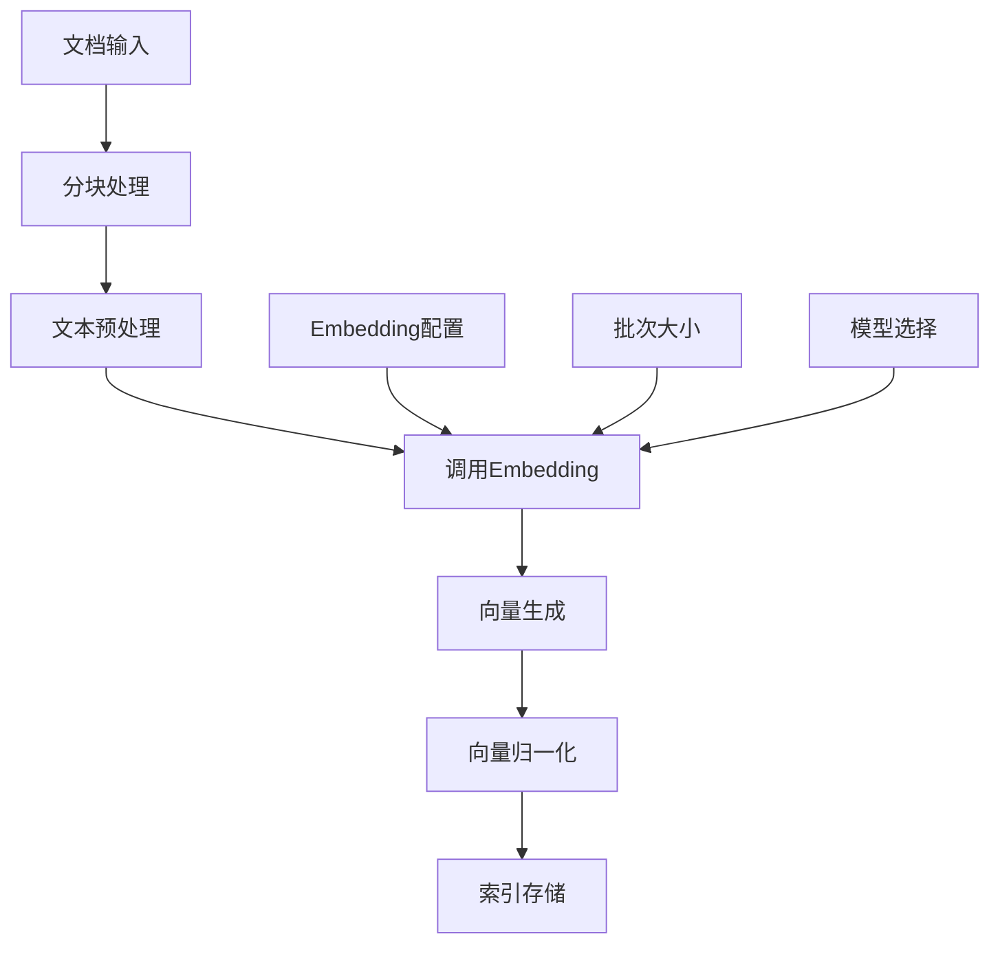
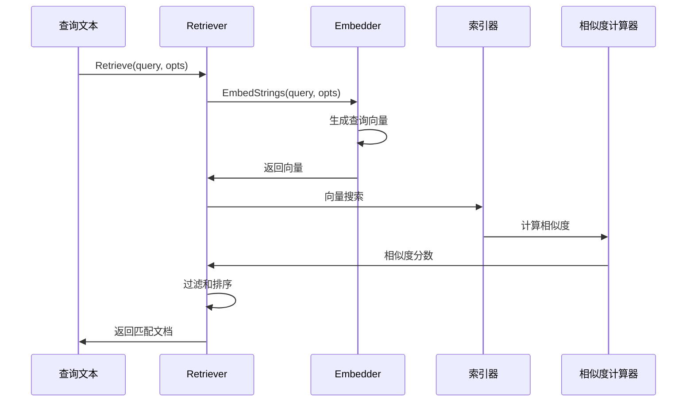
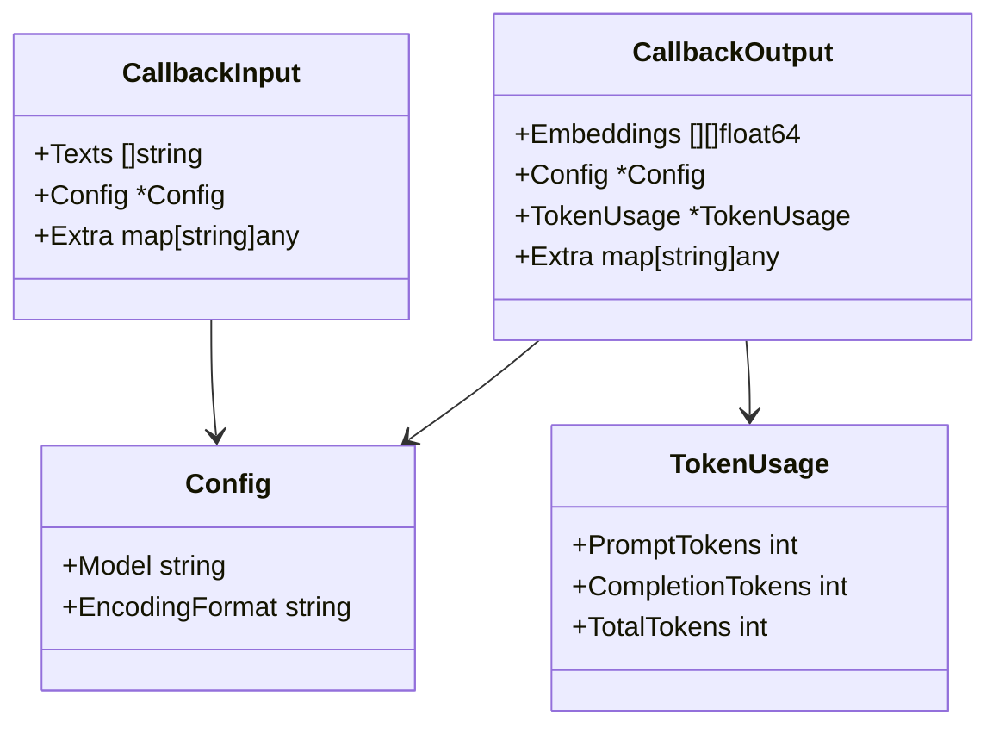
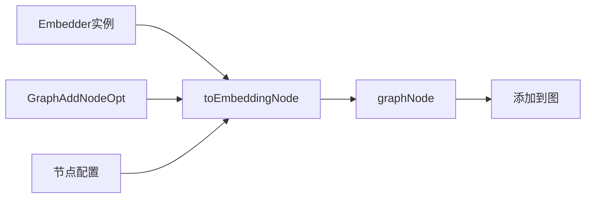

# 嵌入 (Embedding)

<cite>
**本文档中引用的文件**
- [components/embedding/interface.go](file://components/embedding/interface.go)
- [components/embedding/doc.go](file://components/embedding/doc.go)
- [components/embedding/option.go](file://components/embedding/option.go)
- [components/embedding/callback_extra.go](file://components/embedding/callback_extra.go)
- [components/embedding/callback_extra_test.go](file://components/embedding/callback_extra_test.go)
- [components/embedding/option_test.go](file://components/embedding/option_test.go)
- [components/indexer/interface.go](file://components/indexer/interface.go)
- [components/indexer/option.go](file://components/indexer/option.go)
- [components/retriever/interface.go](file://components/retriever/interface.go)
- [components/retriever/option.go](file://components/retriever/option.go)
- [compose/component_to_graph_node.go](file://compose/component_to_graph_node.go)
- [compose/graph.go](file://compose/graph.go)
</cite>

## 目录
1. [简介](#简介)
2. [核心接口设计](#核心接口设计)
3. [选项模式配置](#选项模式配置)
4. [嵌入组件架构](#嵌入组件架构)
5. [与索引器的协作](#与索引器的协作)
6. [与检索器的协作](#与检索器的协作)
7. [回调机制](#回调机制)
8. [组合图集成](#组合图集成)
9. [最佳实践](#最佳实践)
10. [总结](#总结)

## 简介

嵌入组件（Embedding）是语义搜索系统的核心组件，负责将文本或文档转换为高维向量表示。这种向量表示能够捕捉文本的语义含义，使得相似内容在向量空间中具有相近的距离。嵌入组件通过`Embedder`接口提供统一的文本向量化能力，支持多种嵌入模型和配置选项。

嵌入组件在整个EINO框架中扮演着关键角色，它不仅为文档索引提供向量化基础，还为查询检索提供语义匹配能力。通过与索引器（Indexer）和检索器（Retriever）的紧密协作，构建了一个完整的语义搜索解决方案。

## 核心接口设计

### Embedder接口

`Embedder`接口是嵌入组件的核心抽象，定义了将文本转换为向量的基本方法：



**图表来源**
- [components/embedding/interface.go](file://components/embedding/interface.go#L22-L24)
- [components/embedding/option.go](file://components/embedding/option.go#L25-L30)

接口方法签名说明：
- **输入参数**：`texts []string` - 待向量化的文本数组
- **返回值**：`[][]float64` - 文本对应的向量表示数组
- **错误处理**：`error` - 操作过程中可能发生的错误

### 向量表示格式

嵌入组件产生的向量表示具有以下特征：
- **数据类型**：`[]float64` - 双精度浮点数数组
- **维度**：由具体嵌入模型决定，通常为几百到几千维
- **归一化**：向量通常经过L2归一化处理，便于余弦相似度计算
- **批量处理**：支持一次性处理多个文本，提高效率

**章节来源**
- [components/embedding/interface.go](file://components/embedding/interface.go#L22-L24)

## 选项模式配置

### Option模式概述

嵌入组件采用Option模式进行配置，提供了灵活且可扩展的配置机制：



**图表来源**
- [components/embedding/option.go](file://components/embedding/option.go#L25-L96)

### 常用配置选项

#### 模型配置

`WithModel`函数用于指定使用的嵌入模型：

```go
// 示例：设置OpenAI的文本嵌入模型
modelOption := WithModel("text-embedding-3-small")
embedder.EmbedStrings(ctx, []string{"文本内容"}, modelOption)
```

#### 通用选项提取

`GetCommonOptions`函数从Option列表中提取通用配置：

```go
// 使用默认配置和用户选项
defaultOptions := &Options{Model: &defaultModel}
finalOptions := GetCommonOptions(defaultOptions, userOptions...)
```

#### 实现特定选项

`WrapImplSpecificOptFn`和`GetImplSpecificOptions`支持实现特定的配置需求：

```go
// 自定义实现选项包装
customOpt := WrapImplSpecificOptFn(func(opt *CustomOptions) {
    opt.BatchSize = 32
})

// 提取实现特定选项
finalCustomOpt := GetImplSpecificOptions(&CustomOptions{}, customOpt)
```

**章节来源**
- [components/embedding/option.go](file://components/embedding/option.go#L32-L96)

## 嵌入组件架构

### 组件层次结构

嵌入组件在EINO框架中的位置和职责：



### 数据流处理

嵌入组件的数据处理流程：



**图表来源**
- [components/embedding/interface.go](file://components/embedding/interface.go#L22-L24)

## 与索引器的协作

### 索引器配置

索引器通过`WithEmbedding`选项配置嵌入组件：



**图表来源**
- [components/indexer/option.go](file://components/indexer/option.go#L22-L26)

### 文档向量化流程

索引器使用嵌入组件将文档转换为向量并存储：



**图表来源**
- [components/indexer/option.go](file://components/indexer/option.go#L38-L44)

### 索引器选项配置

索引器支持的完整配置选项：

| 选项名称 | 类型 | 描述 | 默认值 |
|---------|------|------|--------|
| SubIndexes | []string | 子索引列表 | [] |
| Embedding | Embedder | 嵌入组件实例 | 必需 |

**章节来源**
- [components/indexer/option.go](file://components/indexer/option.go#L22-L44)

## 与检索器的协作

### 检索器配置

检索器同样通过`WithEmbedding`选项配置嵌入组件：

```mermaid
classDiagram
class RetrieverOptions {
+Index *string
+SubIndex *string
+TopK *int
+ScoreThreshold *float64
+Embedding Embedder
+DSLInfo map[string]interface{}
}
class Embedder {
+EmbedStrings(ctx, texts, opts) [][]float64
}
RetrieverOptions --> Embedding : "使用"
```

**图表来源**
- [components/retriever/option.go](file://components/retriever/option.go#L22-L32)

### 查询向量化流程

检索器在查询时使用嵌入组件进行语义匹配：



**图表来源**
- [components/retriever/interface.go](file://components/retriever/interface.go#L40-L41)

### 检索器选项配置

检索器的完整配置选项：

| 选项名称 | 类型 | 描述 | 默认值 |
|---------|------|------|--------|
| Index | *string | 主索引名称 | - |
| SubIndex | *string | 子索引名称 | - |
| TopK | *int | 返回文档数量 | 5 |
| ScoreThreshold | *float64 | 相似度阈值 | 0.0 |
| Embedding | Embedder | 嵌入组件实例 | 必需 |
| DSLInfo | map[string]interface{} | DSL查询信息 | {} |

**章节来源**
- [components/retriever/option.go](file://components/retriever/option.go#L22-L81)

## 回调机制

### 回调输入输出结构

嵌入组件提供了完整的回调机制，支持监控和调试：



**图表来源**
- [components/embedding/callback_extra.go](file://components/embedding/callback_extra.go#L49-L97)

### 回调转换函数

嵌入组件提供了回调输入输出的自动转换功能：

```go
// 输入转换
input := ConvCallbackInput([]string{"文本1", "文本2"})
// 输出转换  
output := ConvCallbackOutput([][]float64{{0.1, 0.2}, {0.3, 0.4}})
```

### 组件额外信息

`ComponentExtra`结构体包含了嵌入操作的元信息：

- **配置信息**：模型名称、编码格式等
- **令牌使用情况**：提示令牌、完成令牌、总令牌数
- **执行统计**：性能指标、错误信息等

**章节来源**
- [components/embedding/callback_extra.go](file://components/embedding/callback_extra.go#L41-L97)

## 组合图集成

### 节点创建机制

EINO框架通过`toEmbeddingNode`函数将嵌入组件转换为图节点：



**图表来源**
- [compose/component_to_graph_node.go](file://compose/component_to_graph_node.go#L54-L60)

### 图节点配置

组合图中的嵌入节点支持以下配置：

```go
// 创建嵌入节点
embeddingNode, err := openai.NewEmbedder(ctx, &openai.EmbeddingConfig{
    Model: "text-embedding-3-small",
})

// 添加到图中
graph.AddEmbeddingNode("embedding_node_key", embeddingNode)
```

### 功能性选项

组合图提供了专门的功能性选项：

```go
// 嵌入组件选项
embeddingOption := compose.WithEmbeddingOption(
    embedding.WithModel("text-embedding-3-small")
)

// 应用到特定节点
runnable.Invoke(ctx, input, embeddingOption.DesignateNode("node_key"))
```

**章节来源**
- [compose/graph.go](file://compose/graph.go#L287-L300)
- [compose/graph_call_options.go](file://compose/graph_call_options.go#L135-L142)

## 最佳实践

### 性能优化建议

1. **批量处理**：充分利用嵌入模型的批量处理能力
2. **缓存策略**：对重复文本进行缓存，避免重复计算
3. **模型选择**：根据精度要求和性能需求选择合适的模型
4. **内存管理**：合理控制向量数量，避免内存溢出

### 错误处理

```go
// 健壮的嵌入调用
embeddings, err := embedder.EmbedStrings(ctx, texts, modelOption)
if err != nil {
    // 处理错误：重试、降级、记录日志
    return nil, fmt.Errorf("嵌入失败: %w", err)
}
```

### 配置管理

```go
// 配置验证
func validateEmbeddingConfig(config *embedding.Options) error {
    if config.Model == nil || *config.Model == "" {
        return errors.New("模型配置不能为空")
    }
    return nil
}
```

### 监控指标

- **处理时间**：单次嵌入耗时
- **吞吐量**：每秒处理的文本数量
- **错误率**：嵌入失败的比例
- **资源使用**：CPU、内存、GPU使用情况

## 总结

嵌入组件作为EINO框架的核心组件，通过`Embedder`接口提供了统一的文本向量化能力。其采用的Option模式配置机制确保了灵活性和可扩展性，支持多种嵌入模型和自定义配置。

嵌入组件与索引器和检索器的紧密协作，构成了完整的语义搜索解决方案。通过向量化技术，系统能够理解文本的语义含义，实现基于语义的相关性检索。

回调机制的引入使得系统具备了可观测性和可调试性，为生产环境的部署和维护提供了有力支持。组合图的集成为复杂工作流的构建提供了便利，使得嵌入组件能够无缝融入各种应用场景。

总的来说，嵌入组件的设计体现了现代AI系统架构的最佳实践，既保证了功能的完整性，又兼顾了性能和可维护性，为构建高质量的语义搜索应用奠定了坚实基础。