# 工具 (Tool)

<cite>
**本文档中引用的文件**
- [components/tool/interface.go](file://components/tool/interface.go)
- [components/tool/utils/common.go](file://components/tool/utils/common.go)
- [components/tool/utils/create_options.go](file://components/tool/utils/create_options.go)
- [components/tool/utils/invokable_func.go](file://components/tool/utils/invokable_func.go)
- [components/tool/utils/streamable_func.go](file://components/tool/utils/streamable_func.go)
- [components/tool/utils/error_handler.go](file://components/tool/utils/error_handler.go)
- [compose/tool_node.go](file://compose/tool_node.go)
- [schema/tool.go](file://schema/tool.go)
- [components/tool/utils/invokable_func_test.go](file://components/tool/utils/invokable_func_test.go)
- [components/tool/utils/streamable_func_test.go](file://components/tool/utils/streamable_func_test.go)
</cite>

## 目录
1. [简介](#简介)
2. [项目结构](#项目结构)
3. [核心接口层次](#核心接口层次)
4. [工具元信息管理](#工具元信息管理)
5. [工具执行机制](#工具执行机制)
6. [函数型工具创建](#函数型工具创建)
7. [选项模式与自定义行为](#选项模式与自定义行为)
8. [错误处理机制](#错误处理机制)
9. [编排流程中的工具调用](#编排流程中的工具调用)
10. [最佳实践与使用示例](#最佳实践与使用示例)
11. [总结](#总结)

## 简介

Eino工具组件（Tool）是Eino框架中的核心功能模块，为大语言模型（LLM）提供了与外部系统交互的能力。该组件通过定义清晰的接口层次和丰富的工具类型，支持同步和流式两种执行模式，同时提供了灵活的配置选项和强大的错误处理机制。

工具组件的设计理念基于以下核心原则：
- **接口分离**：通过不同的接口类型区分工具的功能特性
- **类型安全**：利用Go泛型确保参数和返回值的类型安全
- **可扩展性**：支持通过选项模式添加自定义行为
- **错误恢复**：提供完善的错误处理和恢复机制

## 项目结构

工具组件的文件组织结构体现了清晰的职责分离：

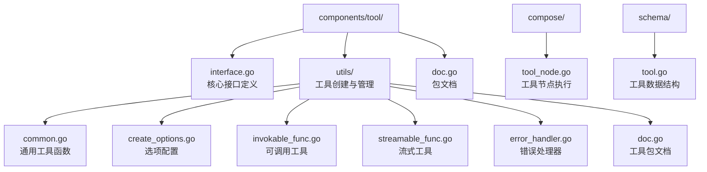

**图表来源**
- [components/tool/interface.go](file://components/tool/interface.go#L1-L44)
- [components/tool/utils/common.go](file://components/tool/utils/common.go#L1-L29)
- [compose/tool_node.go](file://compose/tool_node.go#L1-L537)
- [schema/tool.go](file://schema/tool.go#L1-L591)

**章节来源**
- [components/tool/interface.go](file://components/tool/interface.go#L1-L44)
- [components/tool/utils/doc.go](file://components/tool/utils/doc.go#L1-L18)

## 核心接口层次

Eino工具组件定义了三个核心接口，形成了清晰的继承层次结构：

### BaseTool 接口

`BaseTool`是最基础的接口，负责提供工具的元信息，使LLM能够识别和选择合适的工具：

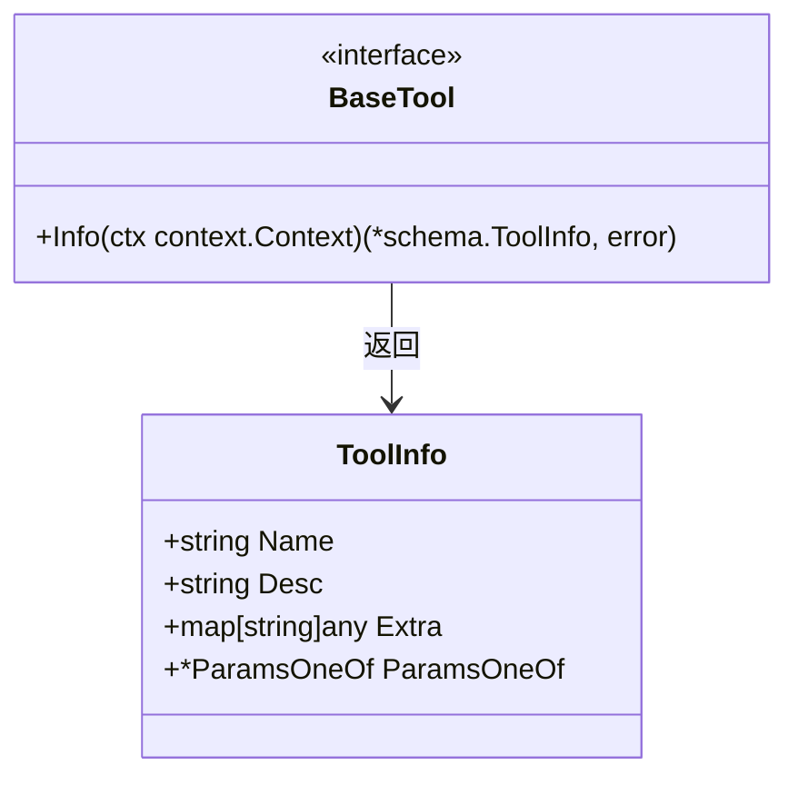

**图表来源**
- [components/tool/interface.go](file://components/tool/interface.go#L25-L28)
- [schema/tool.go](file://schema/tool.go#L60-L76)

### InvokableTool 接口

`InvokableTool`扩展了`BaseTool`，增加了同步执行能力：

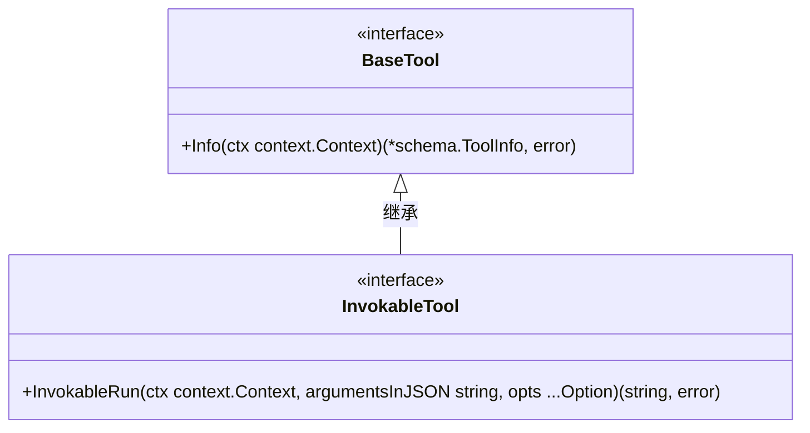

**图表来源**
- [components/tool/interface.go](file://components/tool/interface.go#L30-L36)

### StreamableTool 接口

`StreamableTool`同样扩展了`BaseTool`，但专注于流式执行：

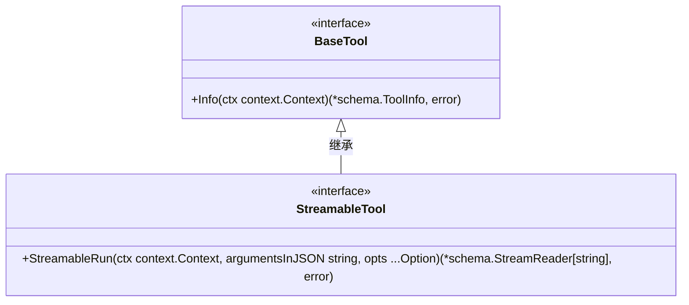

**图表来源**
- [components/tool/interface.go](file://components/tool/interface.go#L38-L43)

### 接口层次关系

三种接口之间的关系体现了工具功能的递进式设计：

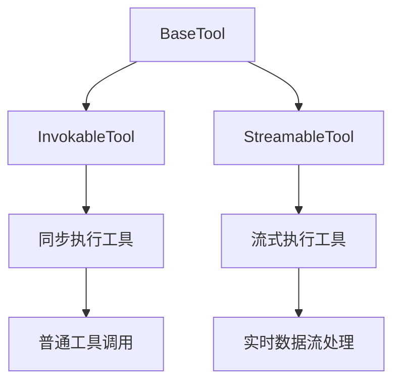

**图表来源**
- [components/tool/interface.go](file://components/tool/interface.go#L25-L43)

**章节来源**
- [components/tool/interface.go](file://components/tool/interface.go#L25-L43)

## 工具元信息管理

### Info 方法的作用

`Info`方法是所有工具的核心方法，负责返回工具的元信息（`ToolInfo`），这是LLM识别和选择工具的关键依据：

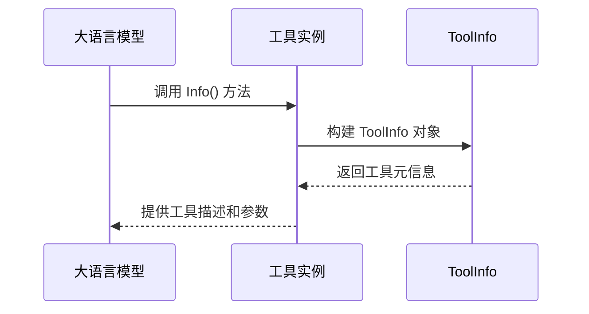

**图表来源**
- [components/tool/interface.go](file://components/tool/interface.go#L27-L28)

### ToolInfo 结构详解

`ToolInfo`包含了工具的所有基本信息：

| 字段 | 类型 | 描述 | 必需性 |
|------|------|------|--------|
| Name | string | 工具的唯一名称，明确传达其用途 | 必需 |
| Desc | string | 工具的描述信息，告诉模型何时/如何使用工具 | 必需 |
| ParamsOneOf | *ParamsOneOf | 工具接受的参数描述，可以使用多种格式 | 可选 |
| Extra | map[string]any | 工具的额外信息 | 可选 |

### 参数描述格式

工具参数可以通过三种方式描述：

1. **直观参数法**：使用`NewParamsOneOfByParams()`构建
2. **OpenAPI V3 法**：使用`NewParamsOneOfByOpenAPIV3()`构建
3. **JSON Schema 法**：使用`NewParamsOneOfByJSONSchema()`构建

**章节来源**
- [components/tool/interface.go](file://components/tool/interface.go#L25-L43)
- [schema/tool.go](file://schema/tool.go#L60-L76)

## 工具执行机制

### 同步执行（InvokableRun）

同步执行适用于一次性完成的任务，工具会等待整个操作完成后返回结果：

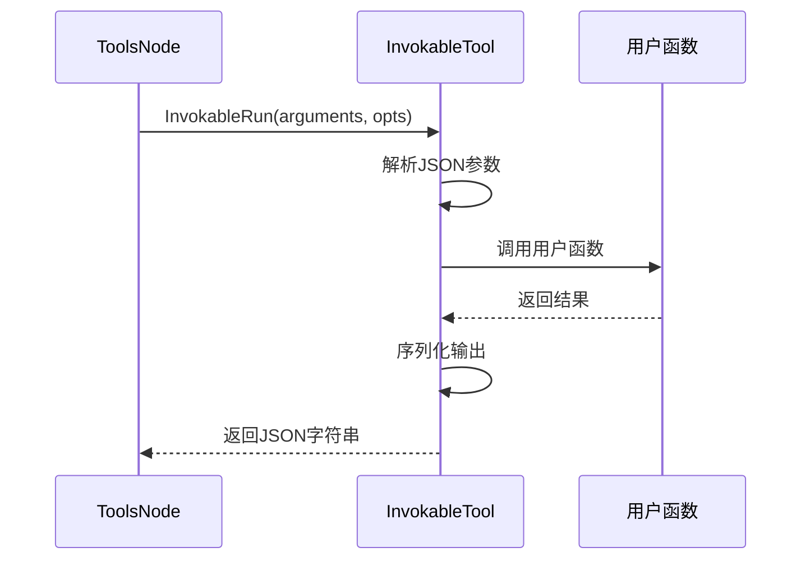

**图表来源**
- [components/tool/utils/invokable_func.go](file://components/tool/utils/invokable_func.go#L149-L191)

### 流式执行（StreamableRun）

流式执行适用于需要实时反馈或大数据量处理的场景：

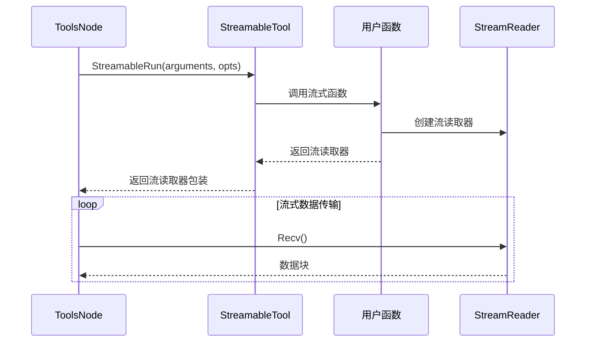

**图表来源**
- [components/tool/utils/streamable_func.go](file://components/tool/utils/streamable_func.go#L94-L144)

### 执行差异对比

| 特性 | 同步执行 | 流式执行 |
|------|----------|----------|
| 执行时机 | 等待完整结果 | 实时接收数据 |
| 内存占用 | 高（需要缓存完整结果） | 低（逐块处理） |
| 响应时间 | 较长（等待完成） | 较短（实时反馈） |
| 适用场景 | 计算密集型任务 | I/O密集型任务 |

**章节来源**
- [components/tool/utils/invokable_func.go](file://components/tool/utils/invokable_func.go#L149-L191)
- [components/tool/utils/streamable_func.go](file://components/tool/utils/streamable_func.go#L94-L144)

## 函数型工具创建

### InferTool 和 InferOptionableTool

工具组件提供了两种主要的函数型工具创建方式：

#### 基础函数工具（InferTool）

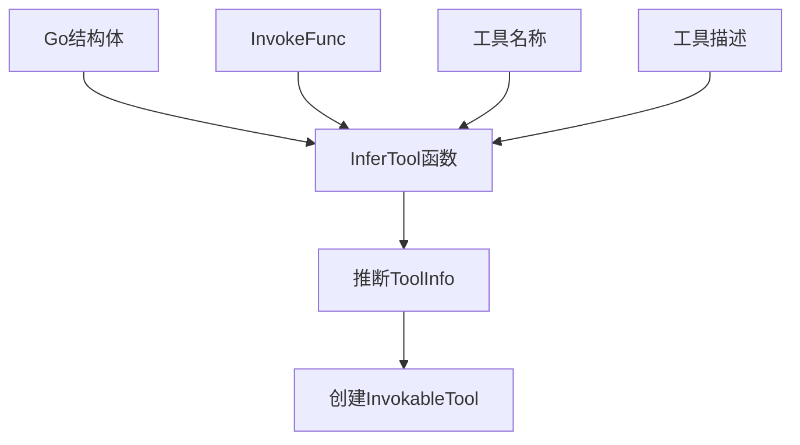

**图表来源**
- [components/tool/utils/invokable_func.go](file://components/tool/utils/invokable_func.go#L39-L48)

#### 选项感知函数工具（InferOptionableTool）

支持通过选项参数自定义工具行为：

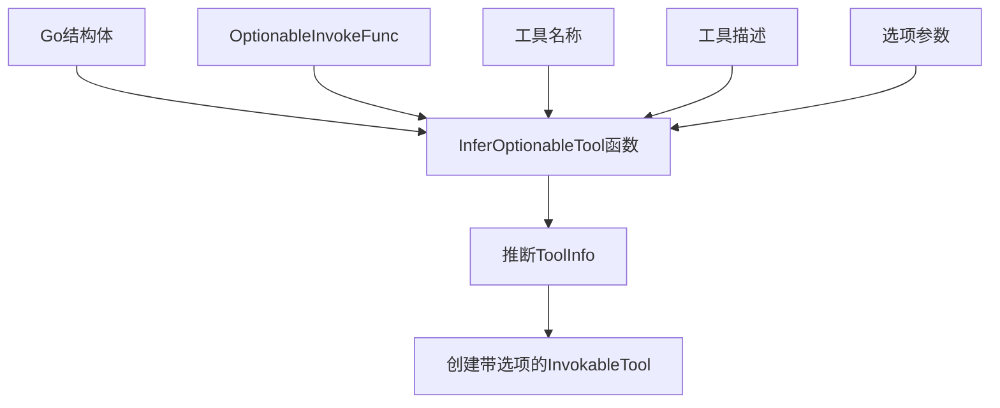

**图表来源**
- [components/tool/utils/invokable_func.go](file://components/tool/utils/invokable_func.go#L50-L58)

### NewTool 和 NewOptionableTool

对于已经定义好的函数，可以直接使用这些工厂函数：

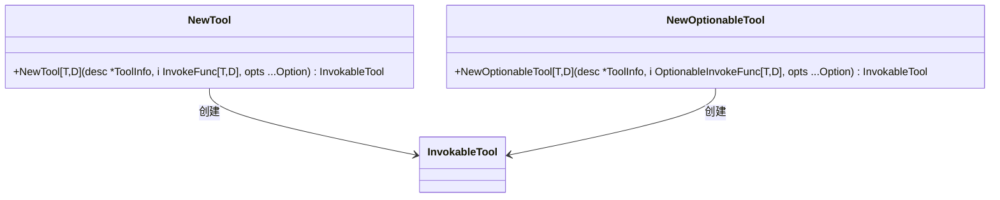

**图表来源**
- [components/tool/utils/invokable_func.go](file://components/tool/utils/invokable_func.go#L118-L123)
- [components/tool/utils/invokable_func.go](file://components/tool/utils/invokable_func.go#L125-L134)

### InferStreamTool 和 NewStreamTool

流式工具的创建方式类似：

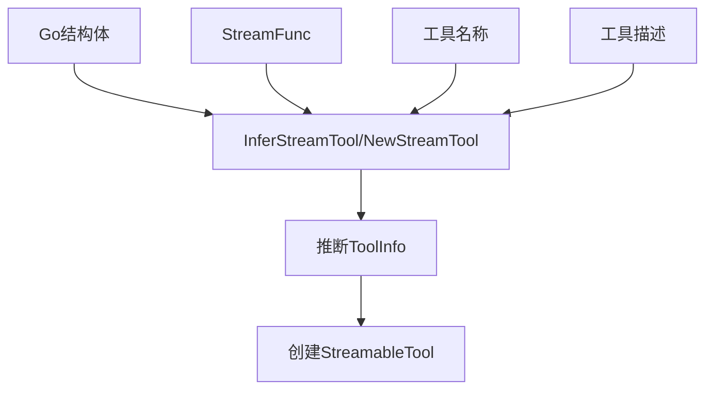

**图表来源**
- [components/tool/utils/streamable_func.go](file://components/tool/utils/streamable_func.go#L36-L45)
- [components/tool/utils/streamable_func.go](file://components/tool/utils/streamable_func.go#L57-L65)

**章节来源**
- [components/tool/utils/invokable_func.go](file://components/tool/utils/invokable_func.go#L39-L65)
- [components/tool/utils/streamable_func.go](file://components/tool/utils/streamable_func.go#L36-L65)

## 选项模式与自定义行为

### Option 模式概述

工具组件采用选项模式（Option Pattern）为工具添加自定义行为，这种设计提供了极大的灵活性：

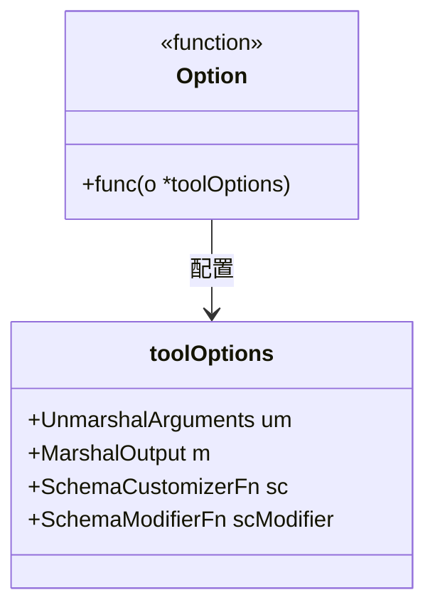

**图表来源**
- [components/tool/utils/create_options.go](file://components/tool/utils/create_options.go#L44-L46)
- [components/tool/utils/create_options.go](file://components/tool/utils/create_options.go#L37-L42)

### 核心选项类型

#### 自定义参数解析（WithUnmarshalArguments）

允许开发者自定义参数解析逻辑：

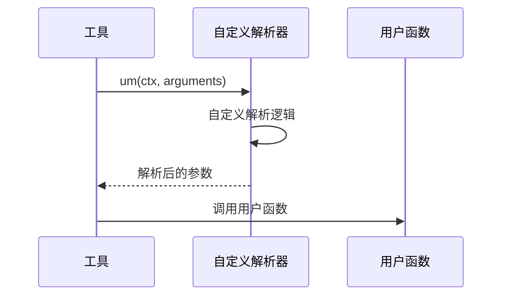

**图表来源**
- [components/tool/utils/create_options.go](file://components/tool/utils/create_options.go#L47-L57)

#### 自定义输出序列化（WithMarshalOutput）

允许开发者控制输出的序列化方式：

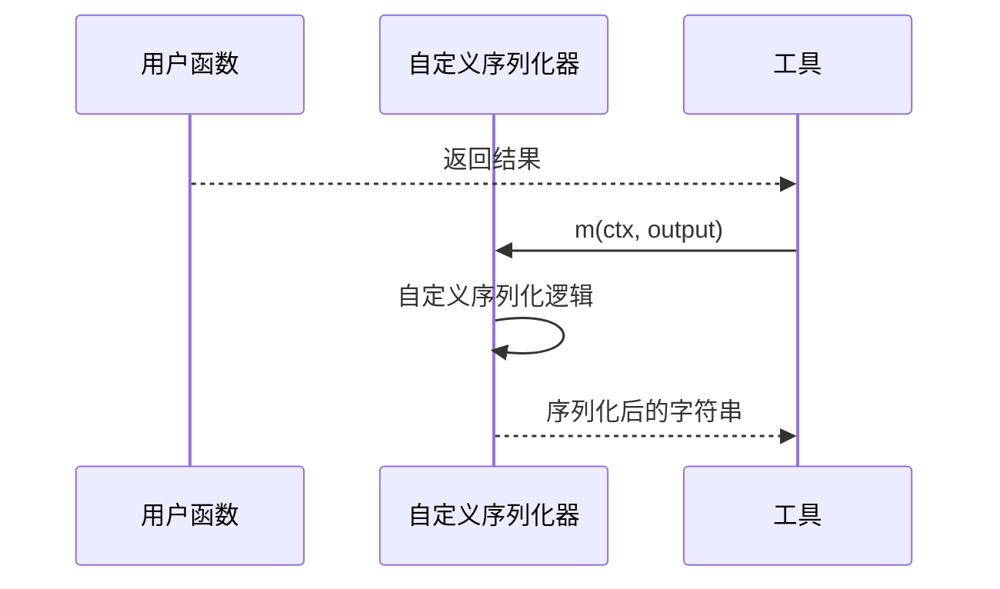

**图表来源**
- [components/tool/utils/create_options.go](file://components/tool/utils/create_options.go#L56-L61)

#### Schema 自定义（WithSchemaModifier）

通过反射自动推断工具参数的高级定制：

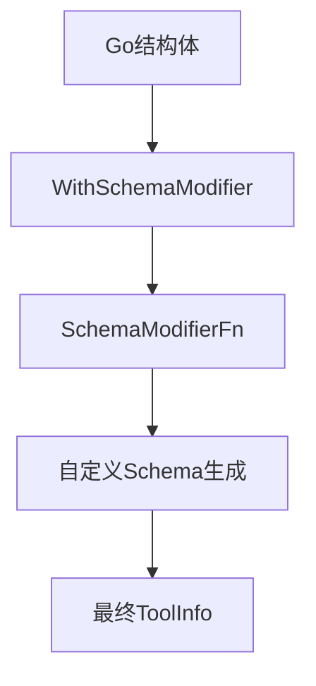

**图表来源**
- [components/tool/utils/create_options.go](file://components/tool/utils/create_options.go#L73-L81)
- [components/tool/utils/create_options.go](file://components/tool/utils/create_options.go#L91-L96)

### 选项组合使用

多个选项可以组合使用，形成复杂的工具行为：

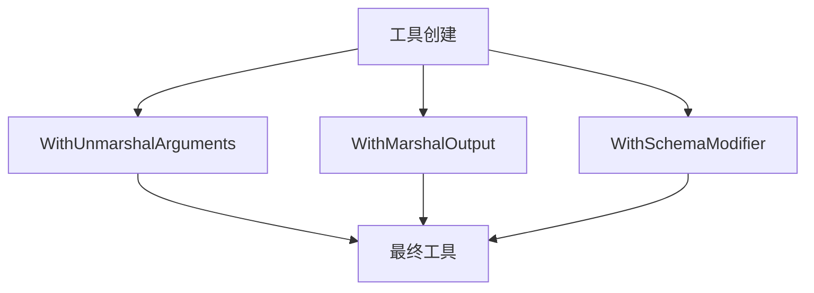

**章节来源**
- [components/tool/utils/create_options.go](file://components/tool/utils/create_options.go#L44-L226)

## 错误处理机制

### WrapToolWithErrorHandler

工具组件提供了强大的错误处理机制，通过`WrapToolWithErrorHandler`函数可以为任何工具添加自定义错误处理：

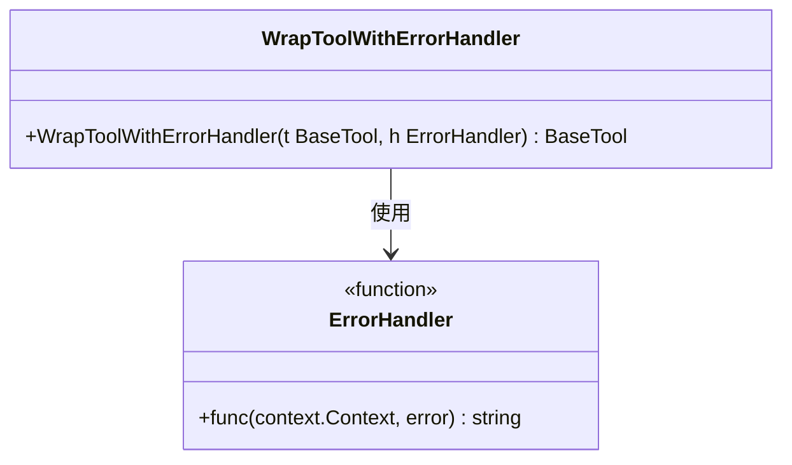

**图表来源**
- [components/tool/utils/error_handler.go](file://components/tool/utils/error_handler.go#L26-L40)

### 错误处理策略

#### InvokableTool 错误处理

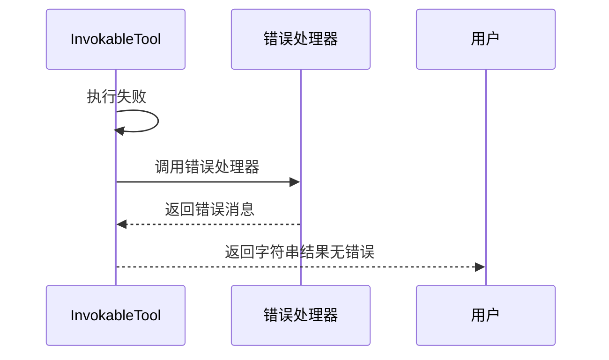

**图表来源**
- [components/tool/utils/error_handler.go](file://components/tool/utils/error_handler.go#L69-L87)

#### StreamableTool 错误处理

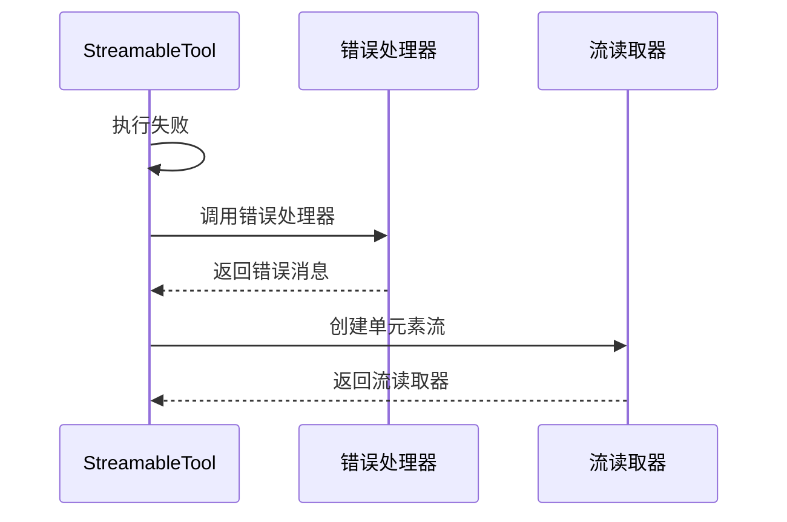

**图表来源**
- [components/tool/utils/error_handler.go](file://components/tool/utils/error_handler.go#L89-L108)

### 错误处理类型

| 工具类型 | 错误处理方式 | 结果形式 |
|----------|--------------|----------|
| InvokableTool | 返回错误消息字符串 | 单一结果 |
| StreamableTool | 返回包含错误消息的流 | 单元素流 |
| CombinedTool | 根据具体实现决定 | 混合形式 |

**章节来源**
- [components/tool/utils/error_handler.go](file://components/tool/utils/error_handler.go#L26-L159)

## 编排流程中的工具调用

### ToolsNode 的执行机制

`ToolsNode`是工具在编排流程中的核心执行组件，负责协调多个工具的调用：

```mermaid
graph TD
A[ToolsNode] --> B[工具索引建立]
A --> C[工具调用任务生成]
A --> D[并发/串行执行]
B --> E[工具名称映射]
C --> F[参数解析]
D --> G[并行执行]
D --> H[串行执行]
```

**图表来源**
- [compose/tool_node.go](file://compose/tool_node.go#L144-L196)

### 工具调用生命周期

```mermaid
sequenceDiagram
participant GN as 图节点
participant TN as ToolsNode
participant Tuple as 工具元组
participant Tool as 具体工具
GN->>TN : Invoke/Stream 输入消息
TN->>Tuple : 生成工具调用任务
Tuple->>Tool : Info() 获取元信息
Tool-->>Tuple : 返回ToolInfo
TN->>Tool : InvokableRun/StreamableRun
Tool-->>TN : 返回结果/流读取器
TN-->>GN : 返回处理结果
```

**图表来源**
- [compose/tool_node.go](file://compose/tool_node.go#L150-L198)

### 并发与串行执行

#### 并行执行模式

```mermaid
flowchart TD
A[工具调用任务列表] --> B[主goroutine执行第一个任务]
A --> C[启动goroutines执行其他任务]
B --> D[等待所有任务完成]
C --> D
D --> E[收集结果]
```

**图表来源**
- [compose/tool_node.go](file://compose/tool_node.go#L328-L356)

#### 串行执行模式

```mermaid
flowchart TD
A[工具调用任务列表] --> B[按顺序执行每个任务]
B --> C[等待当前任务完成]
C --> D[执行下一个任务]
D --> E[直到所有任务完成]
```

**图表来源**
- [compose/tool_node.go](file://compose/tool_node.go#L316-L326)

### 工具状态管理

ToolsNode维护工具执行状态，支持重试和中断恢复：

```mermaid
classDiagram
class ToolsInterruptAndRerunExtra {
+[]ToolCall ToolCalls
+map[string]string ExecutedTools
+[]string RerunTools
+map[string]any RerunExtraMap
}
class ToolsNode {
+map[string]string executedTools
+bool executeSequentially
+func unknownToolHandler
+func toolArgumentsHandler
}
ToolsNode --> ToolsInterruptAndRerunExtra : 创建
```

**图表来源**
- [compose/tool_node.go](file://compose/tool_node.go#L133-L138)
- [compose/tool_node.go](file://compose/tool_node.go#L70-L75)

**章节来源**
- [compose/tool_node.go](file://compose/tool_node.go#L62-L537)

## 最佳实践与使用示例

### 工具设计原则

1. **单一职责**：每个工具应该只负责一个特定的功能
2. **类型安全**：使用Go泛型确保参数和返回值的类型安全
3. **错误处理**：提供有意义的错误信息和适当的错误处理策略
4. **性能考虑**：根据使用场景选择同步或流式执行

### 常见使用模式

#### 简单查询工具

```mermaid
flowchart TD
A[用户输入] --> B[InferTool创建工具]
B --> C[定义输入结构体]
C --> D[实现查询函数]
D --> E[注册到ToolsNode]
```

#### 流式数据处理工具

```mermaid
flowchart TD
A[大数据输入] --> B[InferStreamTool创建工具]
B --> C[实现流式处理函数]
C --> D[分块处理数据]
D --> E[实时输出结果]
```

### 性能优化建议

1. **合理选择执行模式**：I/O密集型任务优先使用流式执行
2. **并发控制**：在ToolsNode中合理设置并发度
3. **内存管理**：注意大型数据结构的内存使用
4. **错误恢复**：实现适当的重试和降级策略

### 调试和监控

工具组件提供了丰富的上下文信息用于调试：

```mermaid
classDiagram
class ToolCallInfo {
+string toolCallID
}
class Context {
+WithValue(key, value)
+Value(key) any
}
Context --> ToolCallInfo : 包含
```

**图表来源**
- [compose/tool_node.go](file://compose/tool_node.go#L514-L536)

**章节来源**
- [components/tool/utils/invokable_func_test.go](file://components/tool/utils/invokable_func_test.go#L1-L200)
- [components/tool/utils/streamable_func_test.go](file://components/tool/utils/streamable_func_test.go#L1-L166)

## 总结

Eino工具组件通过精心设计的接口层次和丰富的功能特性，为大语言模型提供了强大而灵活的外部系统交互能力。其核心特点包括：

### 技术优势

1. **清晰的接口设计**：BaseTool、InvokableTool、StreamableTool形成了层次分明的接口体系
2. **类型安全保障**：利用Go泛型确保参数和返回值的类型安全
3. **灵活的配置选项**：通过选项模式支持各种自定义需求
4. **完善的错误处理**：提供多层次的错误处理和恢复机制
5. **高效的执行机制**：支持同步和流式两种执行模式，适应不同场景需求

### 应用价值

- **提升LLM实用性**：使大语言模型能够访问外部数据源和执行实际任务
- **增强系统集成能力**：为复杂业务系统的集成提供了标准化接口
- **提高开发效率**：通过函数型工具创建简化了工具开发流程
- **保证系统稳定性**：完善的错误处理机制确保了系统的健壮性

### 发展方向

工具组件的设计为未来的扩展预留了充足的空间，包括但不限于：
- 更多的工具类型支持
- 更丰富的配置选项
- 更智能的工具选择和路由
- 更完善的监控和调试功能

通过深入理解和正确使用Eino工具组件，开发者可以构建出功能强大、稳定可靠的AI应用系统。