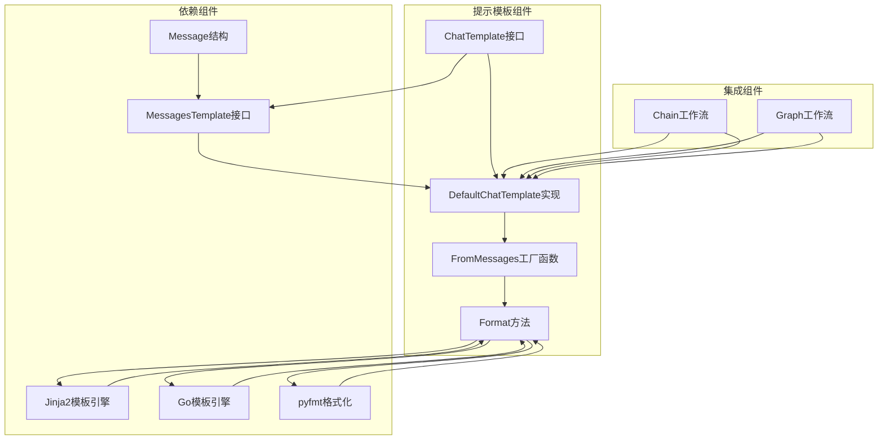
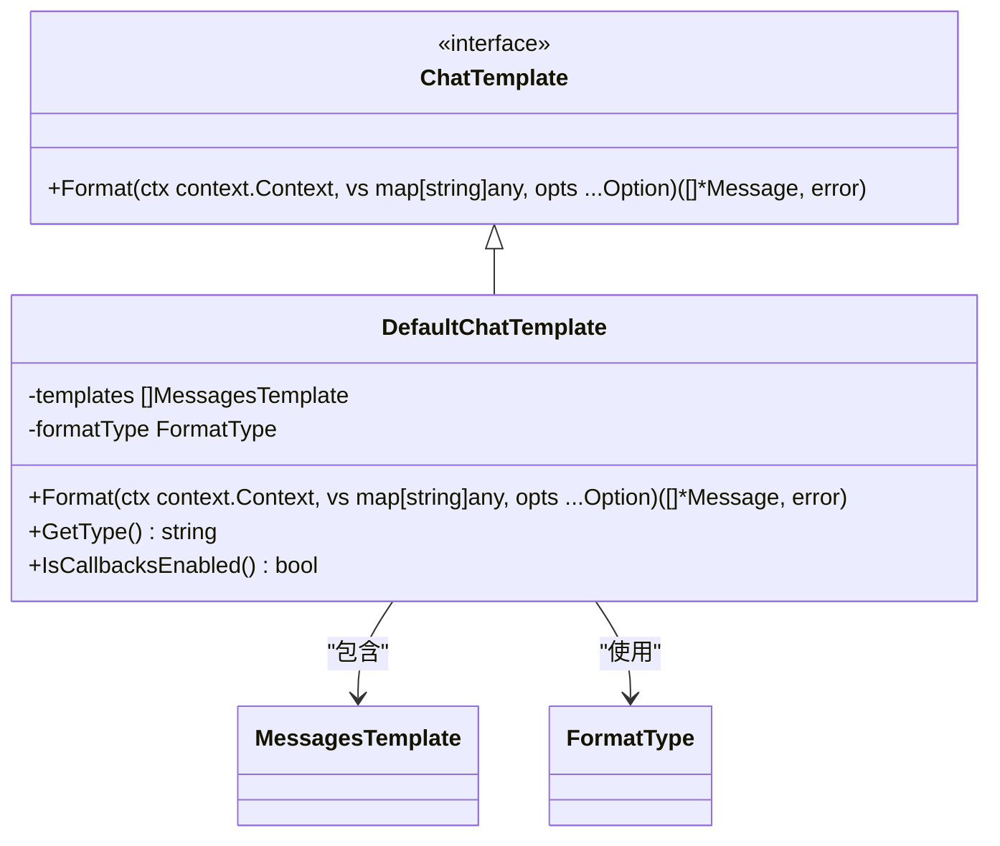
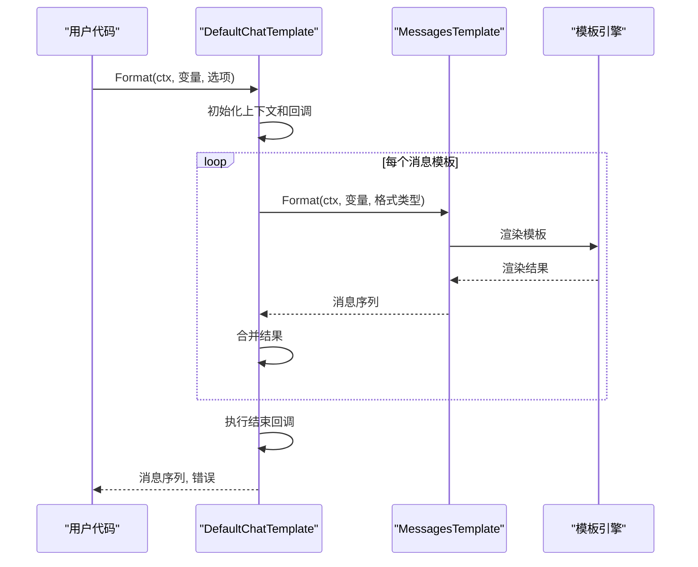
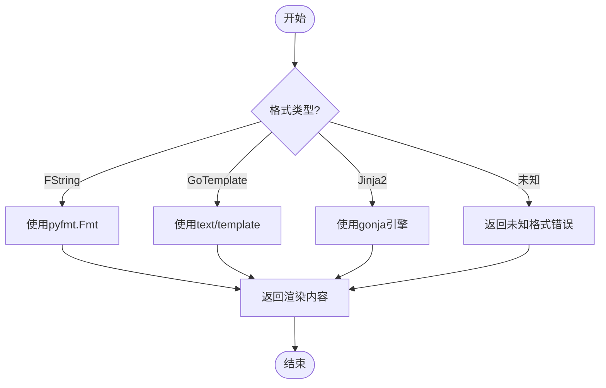
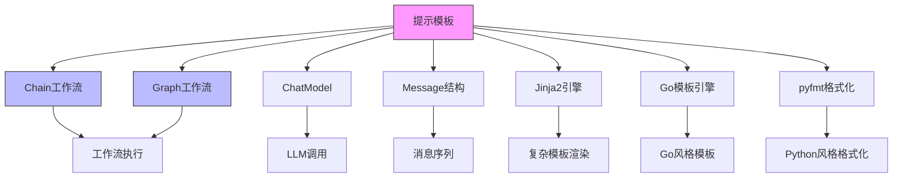

# 提示模板 (Prompt)

<cite>
**本文档中引用的文件**   
- [chat_template.go](file://components/prompt/chat_template.go)
- [interface.go](file://components/prompt/interface.go)
- [option.go](file://components/prompt/option.go)
- [message.go](file://schema/message.go)
- [chain.go](file://compose/chain.go)
- [chat_template_test.go](file://components/prompt/chat_template_test.go)
</cite>

## 目录
1. [简介](#简介)
2. [核心组件](#核心组件)
3. [架构概述](#架构概述)
4. [详细组件分析](#详细组件分析)
5. [依赖分析](#依赖分析)
6. [性能考虑](#性能考虑)
7. [故障排除指南](#故障排除指南)
8. [结论](#结论)

## 简介
提示模板组件（Prompt）是Eino框架中的关键预处理模块，负责将上下文变量动态渲染为符合LLM要求的消息序列。该组件通过`ChatTemplate`接口的`Format`方法实现，支持多种模板格式（FString、GoTemplate、Jinja2），并能与`Chain`和`Graph`工作流无缝集成。

## 核心组件

提示模板组件的核心是`ChatTemplate`接口和`DefaultChatTemplate`实现，它们共同提供了将上下文变量转换为LLM可理解的消息序列的能力。`FromMessages`函数是创建提示模板的主要方式，它接受格式类型和模板消息作为参数。

**Section sources**
- [chat_template.go](file://components/prompt/chat_template.go#L27-L47)
- [interface.go](file://components/prompt/interface.go#L27-L29)

## 架构概述

提示模板组件的架构设计遵循了清晰的分层模式，从接口定义到具体实现，再到与工作流的集成，形成了完整的功能链条。

**Diagram sources **
- [chat_template.go](file://components/prompt/chat_template.go#L27-L89)
- [interface.go](file://components/prompt/interface.go#L27-L29)
- [message.go](file://schema/message.go#L82-L92)

## 详细组件分析

### ChatTemplate接口分析
`ChatTemplate`接口定义了提示模板的核心行为，即通过`Format`方法将上下文变量转换为消息序列。该接口是提示模板组件的契约，所有具体实现都必须遵守。

**Diagram sources **
- [interface.go](file://components/prompt/interface.go#L27-L29)
- [chat_template.go](file://components/prompt/chat_template.go#L27-L89)

### DefaultChatTemplate实现分析
`DefaultChatTemplate`是`ChatTemplate`接口的具体实现，它通过组合多个`MessagesTemplate`来构建复杂的消息序列。其`Format`方法实现了核心的模板渲染逻辑，支持多种格式化类型。

**Diagram sources **
- [chat_template.go](file://components/prompt/chat_template.go#L49-L79)
- [message.go](file://schema/message.go#L597-L657)

### 模板格式化机制分析
提示模板支持三种不同的格式化类型：FString、GoTemplate和Jinja2。每种格式化类型都有其特定的语法和使用场景，通过`formatContent`函数统一处理。

**Diagram sources **
- [message.go](file://schema/message.go#L555-L588)
- [chat_template.go](file://components/prompt/chat_template.go#L50-L79)

## 依赖分析

提示模板组件与其他核心组件有着紧密的依赖关系，这些关系构成了Eino框架的工作流基础。

**Diagram sources **
- [chain.go](file://compose/chain.go#L176-L189)
- [chat_template.go](file://components/prompt/chat_template.go#L27-L89)

## 性能考虑
提示模板组件在设计时考虑了性能因素，通过以下方式优化了模板渲染的效率：
- 使用缓存的Jinja2环境实例，避免重复初始化开销
- 支持可选的消息占位符，减少不必要的错误处理
- 提供多种格式化选项，允许开发者根据需求选择最适合的格式化方式
- 通过回调机制监控模板渲染过程，便于性能分析和问题排查

## 故障排除指南
在使用提示模板组件时，可能会遇到以下常见问题：

**Section sources**
- [chat_template_test.go](file://components/prompt/chat_template_test.go#L28-L84)
- [chat_template.go](file://components/prompt/chat_template.go#L49-L79)

### 模板变量未找到
当模板中引用的变量在上下文中不存在时，会返回错误。确保所有模板变量都在上下文变量映射中提供。

### Jinja2关键字被禁用
为了安全考虑，某些Jinja2关键字（如include、extends、from、import）被禁用。避免在模板中使用这些关键字。

### 格式化类型不匹配
确保选择的格式化类型与模板语法匹配。例如，使用`{{variable}}`语法时应选择`Jinja2`格式类型，而不是`FString`。

### 消息占位符类型错误
消息占位符期望的值是`[]*Message`类型。如果提供其他类型的值，会返回类型错误。

## 结论
提示模板组件是Eino框架中不可或缺的一部分，它通过灵活的模板机制将上下文变量转换为LLM可理解的消息序列。该组件的设计充分考虑了易用性、灵活性和安全性，支持多种模板格式，并能与工作流组件无缝集成。通过深入理解`ChatTemplate`接口和`DefaultChatTemplate`实现，开发者可以充分利用提示模板的强大功能，构建高效、可靠的LLM应用。