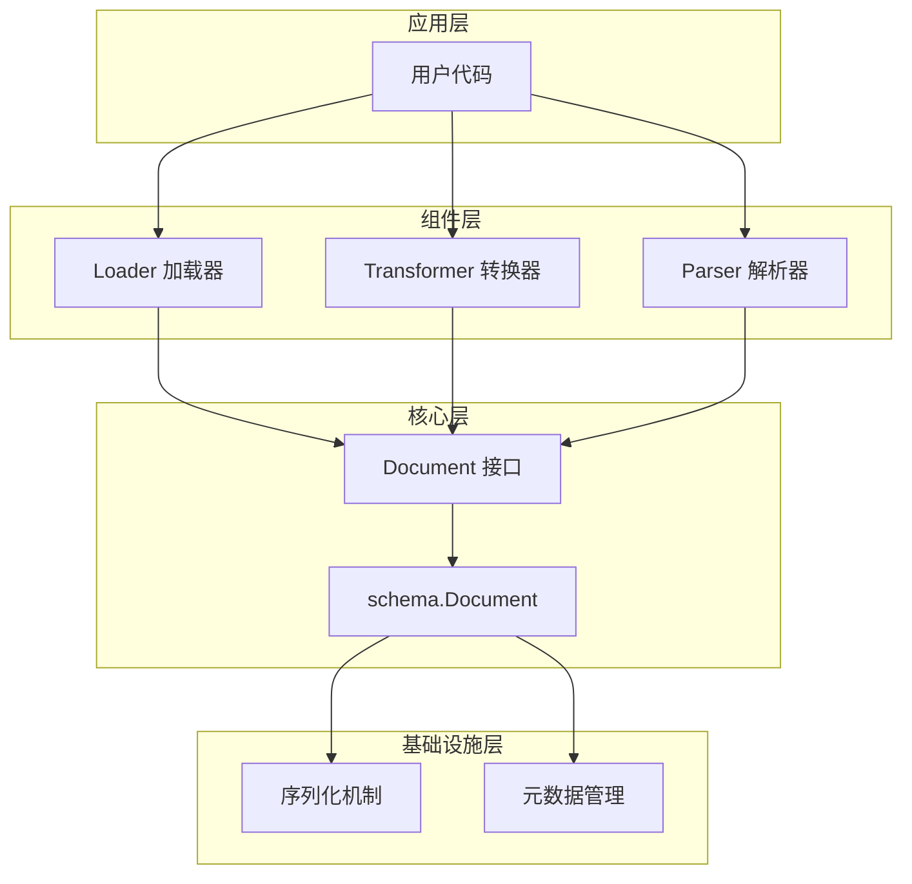
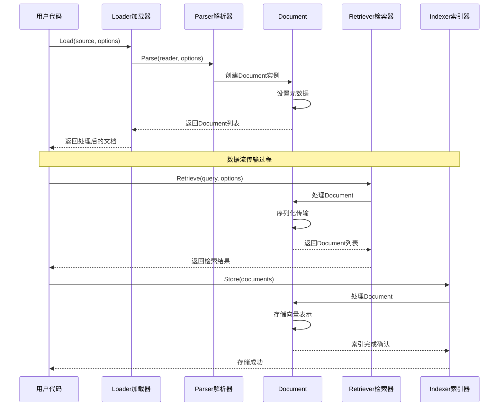
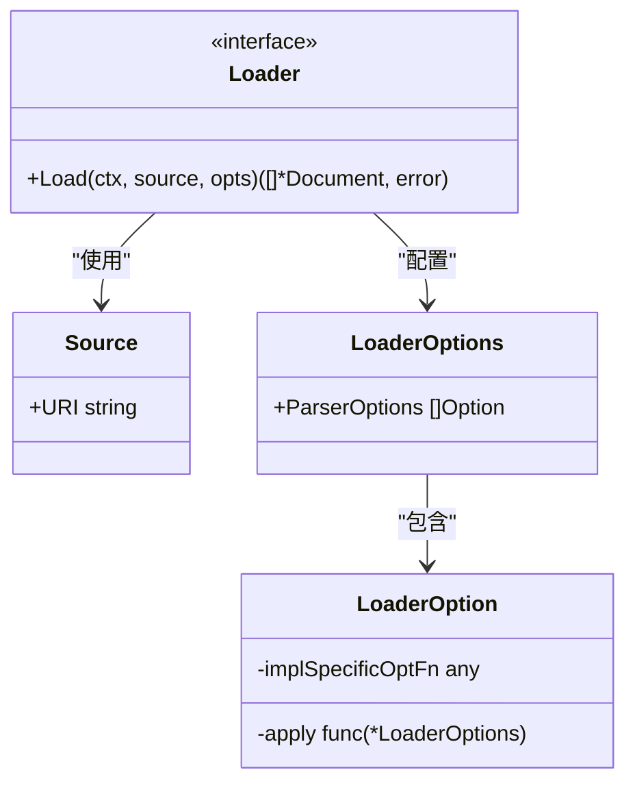
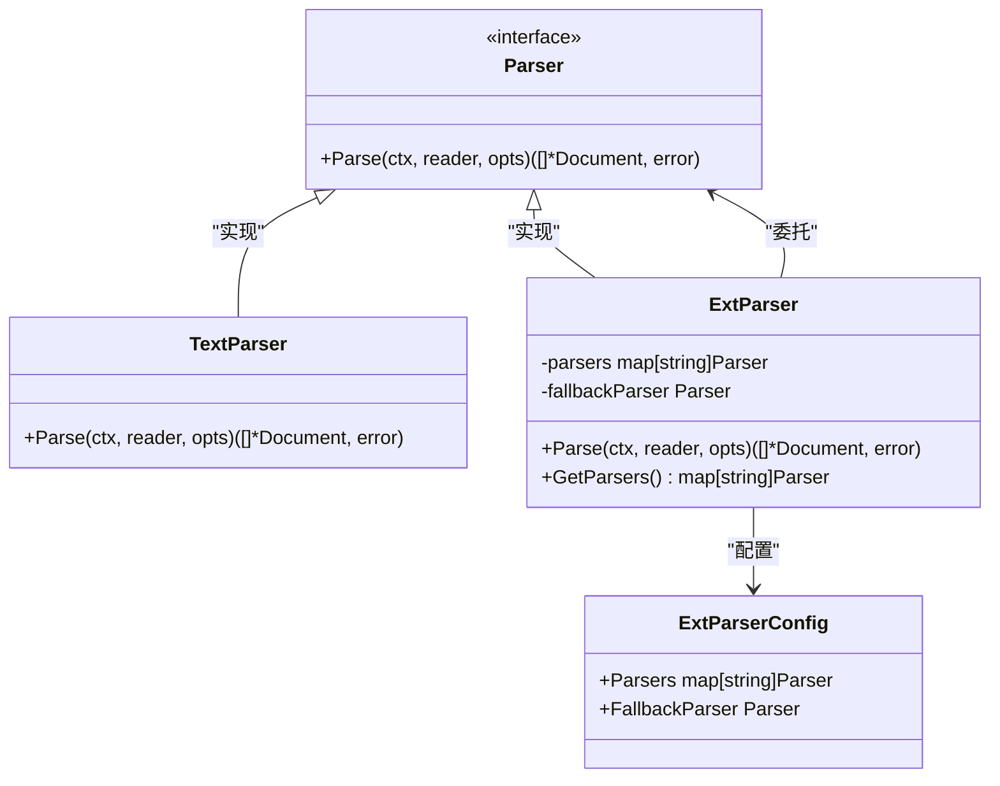
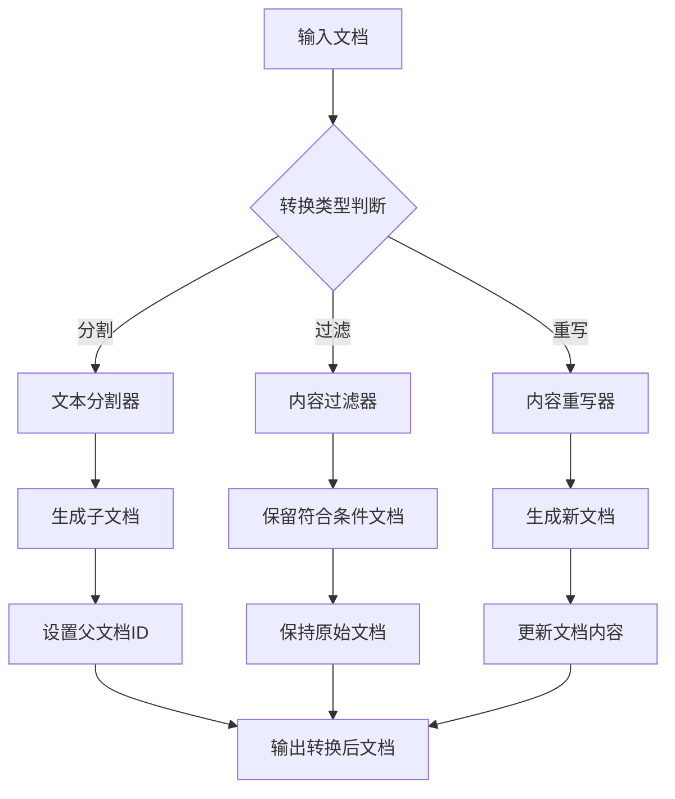
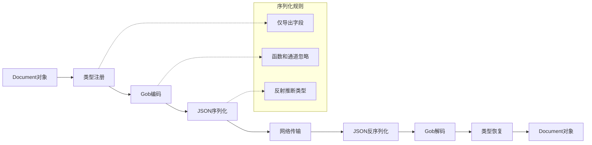
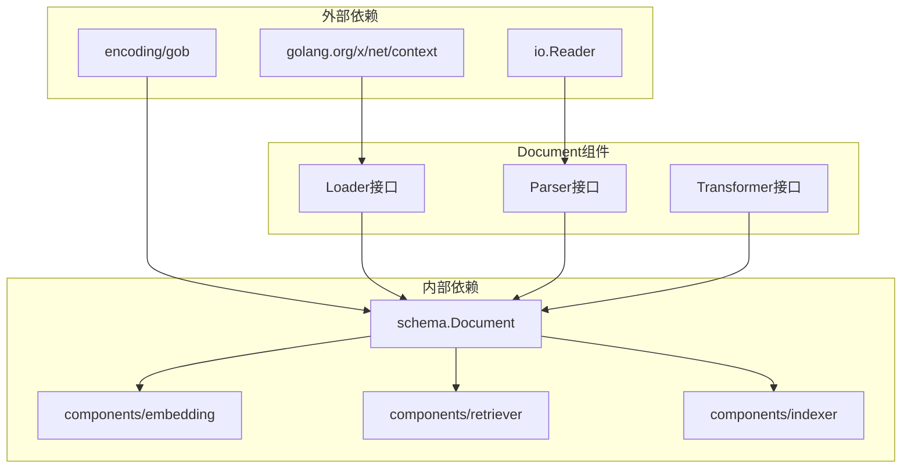

# 文档 (Document)

<cite>
**本文档中引用的文件**
- [components/document/doc.go](file://components/document/doc.go)
- [components/document/interface.go](file://components/document/interface.go)
- [components/document/option.go](file://components/document/option.go)
- [components/document/parser/interface.go](file://components/document/parser/interface.go)
- [components/document/parser/text_parser.go](file://components/document/parser/text_parser.go)
- [components/document/parser/ext_parser.go](file://components/document/parser/ext_parser.go)
- [components/document/parser/option.go](file://components/document/parser/option.go)
- [schema/document.go](file://schema/document.go)
- [schema/serialization.go](file://schema/serialization.go)
- [components/retriever/interface.go](file://components/retriever/interface.go)
- [components/indexer/interface.go](file://components/indexer/interface.go)
- [flow/retriever/parent/parent.go](file://flow/retriever/parent/parent.go)
- [flow/indexer/parent/parent.go](file://flow/indexer/parent/parent.go)
</cite>

## 目录
1. [简介](#简介)
2. [项目结构](#项目结构)
3. [核心组件](#核心组件)
4. [架构概览](#架构概览)
5. [详细组件分析](#详细组件分析)
6. [依赖关系分析](#依赖关系分析)
7. [性能考虑](#性能考虑)
8. [故障排除指南](#故障排除指南)
9. [结论](#结论)

## 简介

Document（文档）是Eino框架中的核心数据结构，不仅承载着内容信息，更是整个框架内信息传递的关键枢纽。它通过统一的接口设计，为文档加载、解析、转换和检索提供了标准化的数据格式。

Document组件的设计理念体现了现代软件架构中的几个重要原则：
- **单一职责原则**：每个组件专注于特定的功能领域
- **开放封闭原则**：对扩展开放，对修改封闭
- **依赖倒置原则**：高层模块不依赖低层模块的具体实现

## 项目结构

Document组件采用分层架构设计，主要分为以下几个层次：

**图表来源**
- [components/document/interface.go](file://components/document/interface.go#L25-L43)
- [schema/document.go](file://schema/document.go#L28-L36)

**章节来源**
- [components/document/doc.go](file://components/document/doc.go#L1-L18)
- [components/document/interface.go](file://components/document/interface.go#L1-L43)

## 核心组件

### Document 数据结构

Document是整个系统的核心数据结构，包含三个关键字段：

| 字段 | 类型 | 描述 | 默认值 |
|------|------|------|--------|
| ID | string | 文档的唯一标识符 | "" |
| Content | string | 文档的内容主体 | "" |
| MetaData | map[string]any | 文档的元数据信息 | nil |

### 元数据扩展方法

Document提供了丰富的元数据扩展方法，支持多种类型的附加信息：

| 方法 | 功能 | 使用场景 |
|------|------|----------|
| WithSubIndexes() | 设置子索引 | 搜索引擎的细粒度索引 |
| WithScore() | 设置相关性分数 | 检索结果排序 |
| WithExtraInfo() | 设置额外信息 | 自定义业务数据 |
| WithDSLInfo() | 设置DSL信息 | 查询条件描述 |
| WithDenseVector() | 设置稠密向量 | 向量相似度计算 |
| WithSparseVector() | 设置稀疏向量 | 高维特征表示 |

**章节来源**
- [schema/document.go](file://schema/document.go#L28-L204)

## 架构概览

Document组件在整个Eino框架中扮演着数据流转的核心角色：

**图表来源**
- [components/document/interface.go](file://components/document/interface.go#L34-L42)
- [components/retriever/interface.go](file://components/retriever/interface.go#L25-L32)
- [components/indexer/interface.go](file://components/indexer/interface.go#L25-L32)

## 详细组件分析

### Loader 加载器

Loader负责从各种数据源加载原始文档内容：

**图表来源**
- [components/document/interface.go](file://components/document/interface.go#L25-L43)
- [components/document/option.go](file://components/document/option.go#L19-L23)

### Parser 解析器

Parser提供文档解析功能，支持多种文件格式：

**图表来源**
- [components/document/parser/interface.go](file://components/document/parser/interface.go#L26-L30)
- [components/document/parser/text_parser.go](file://components/document/parser/text_parser.go#L30-L60)
- [components/document/parser/ext_parser.go](file://components/document/parser/ext_parser.go#L52-L131)

### Transformer 转换器

Transformer负责对文档进行分割、过滤等转换操作：

**图表来源**
- [components/document/interface.go](file://components/document/interface.go#L39-L42)

### 序列化机制

Document支持高效的序列化和反序列化：

**图表来源**
- [schema/serialization.go](file://schema/serialization.go#L27-L41)
- [schema/serialization.go](file://schema/serialization.go#L72-L78)

**章节来源**
- [components/document/interface.go](file://components/document/interface.go#L1-L43)
- [components/document/parser/interface.go](file://components/document/parser/interface.go#L1-L30)
- [schema/serialization.go](file://schema/serialization.go#L1-L146)

## 依赖关系分析

Document组件与其他核心组件的依赖关系：

**图表来源**
- [components/document/interface.go](file://components/document/interface.go#L19-L23)
- [schema/serialization.go](file://schema/serialization.go#L19-L25)

**章节来源**
- [components/document/interface.go](file://components/document/interface.go#L19-L23)
- [schema/serialization.go](file://schema/serialization.go#L19-L25)

## 性能考虑

### 内存优化策略

1. **延迟初始化**：元数据map仅在需要时创建
2. **值传递优化**：Document结构体适合值传递
3. **序列化缓存**：Gob编码支持类型缓存

### 并发安全

- Document结构体本身不是并发安全的
- 建议在并发环境中使用副本或同步机制
- 序列化操作是线程安全的

### 扩展性设计

- 支持自定义元数据键值对
- 可插拔的解析器架构
- 灵活的选项模式

## 故障排除指南

### 常见问题及解决方案

| 问题 | 原因 | 解决方案 |
|------|------|----------|
| 文档ID重复 | ID生成策略不当 | 实现唯一ID生成器 |
| 元数据丢失 | 序列化配置错误 | 检查类型注册 |
| 解析失败 | 文件格式不支持 | 添加对应解析器 |
| 内存泄漏 | 循环引用未处理 | 使用弱引用或及时清理 |

### 调试技巧

1. **启用日志记录**：监控Document生命周期
2. **验证序列化**：检查JSON输出格式
3. **测试边界条件**：空文档、大文档处理
4. **性能分析**：测量解析和序列化时间

**章节来源**
- [schema/serialization.go](file://schema/serialization.go#L72-L78)

## 结论

Document组件作为Eino框架的核心数据结构，展现了优秀的软件架构设计：

### 主要优势

1. **统一接口**：为不同类型的文档处理提供一致的API
2. **灵活扩展**：支持自定义解析器和转换器
3. **高效传输**：内置序列化机制确保数据完整性
4. **丰富功能**：元数据扩展支持复杂的业务需求

### 最佳实践建议

1. **合理使用元数据**：避免过度使用，保持简洁
2. **选择合适的解析器**：根据文件类型选择最优解析器
3. **注意内存管理**：大型文档需要特殊处理
4. **实施错误处理**：完善的错误处理机制

Document组件的成功设计为整个Eino框架奠定了坚实的基础，其设计理念和实现方式值得在类似项目中借鉴和应用。