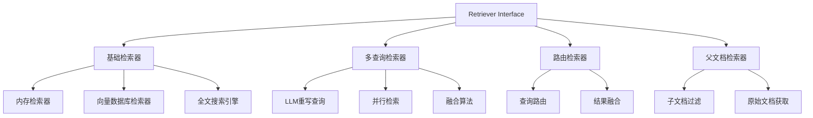
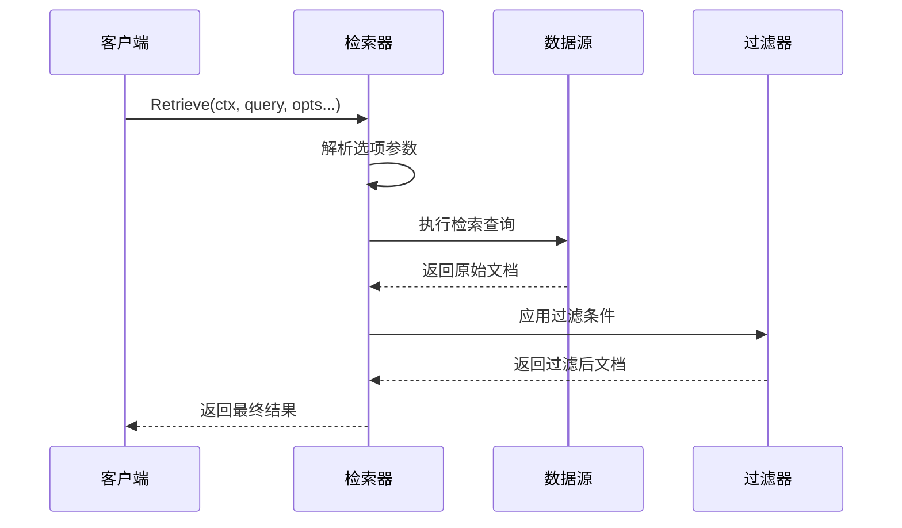
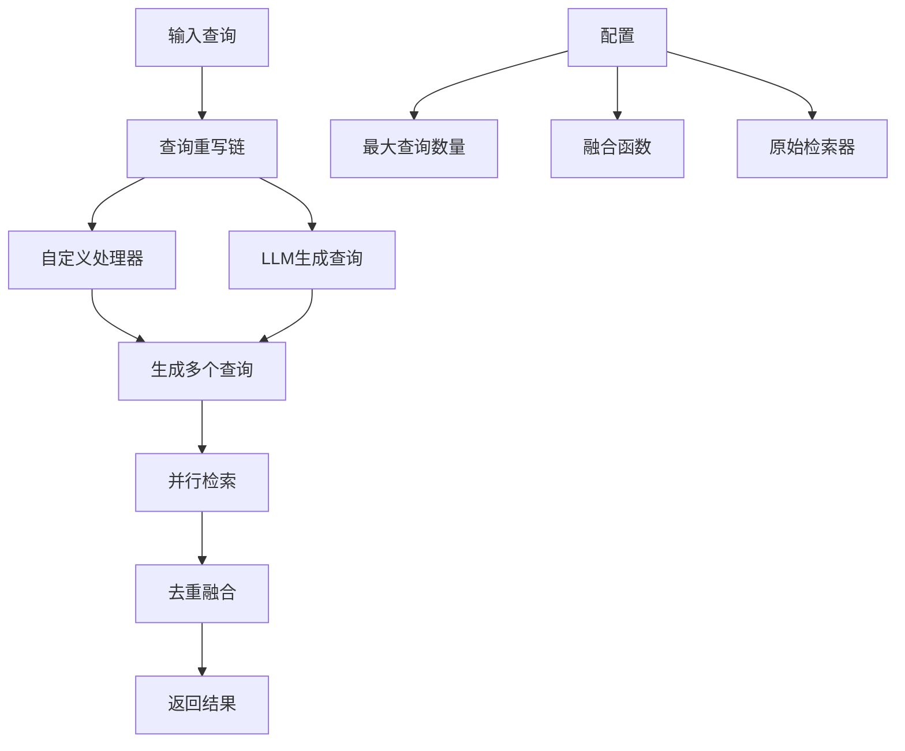
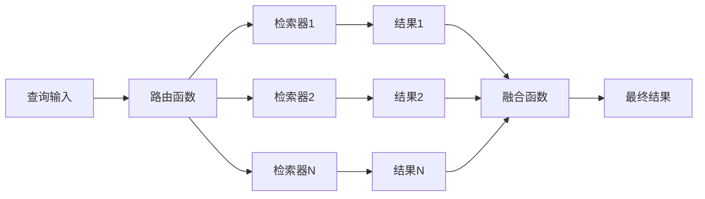
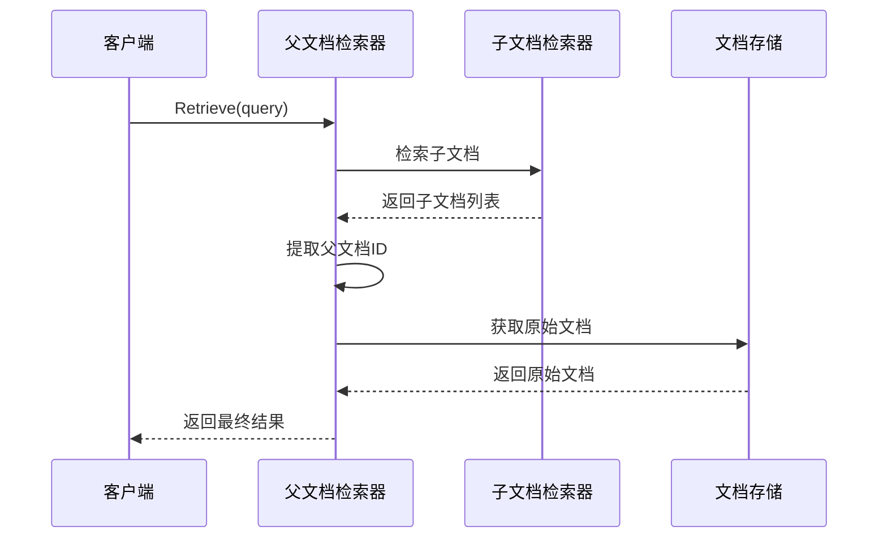
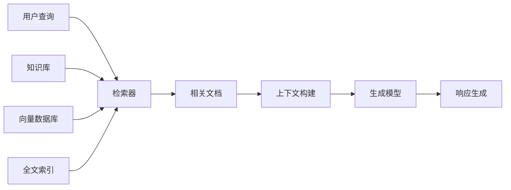
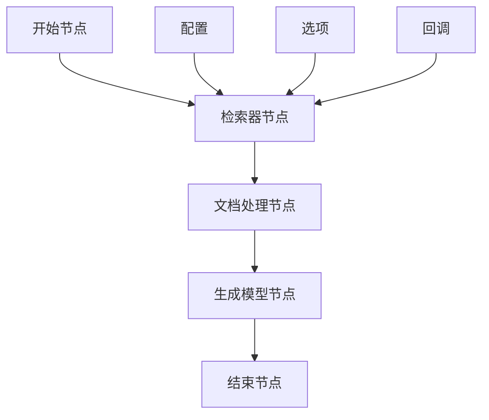
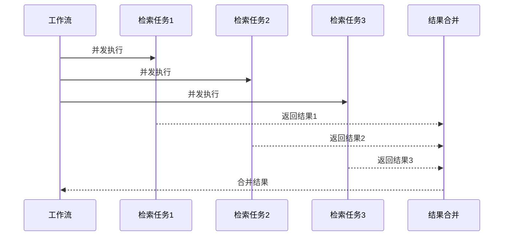
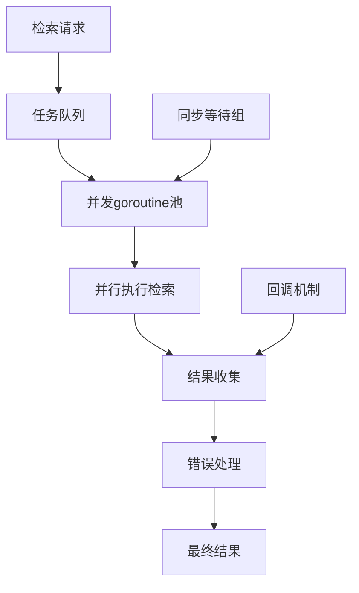

# 检索器 (Retriever)

<cite>
**本文档中引用的文件**
- [flow/retriever/multiquery/multi_query.go](file://flow/retriever/multiquery/multi_query.go)
- [flow/retriever/router/router.go](file://flow/retriever/router/router.go)
- [flow/retriever/utils/utils.go](file://flow/retriever/utils/utils.go)
- [flow/retriever/parent/parent.go](file://flow/retriever/parent/parent.go)
- [components/retriever/interface.go](file://components/retriever/interface.go)
- [components/retriever/option.go](file://components/retriever/option.go)
- [components/retriever/doc.go](file://components/retriever/doc.go)
- [flow/retriever/multiquery/multi_query_test.go](file://flow/retriever/multiquery/multi_query_test.go)
- [flow/retriever/router/router_test.go](file://flow/retriever/router/router_test.go)
- [compose/graph.go](file://compose/graph.go)
- [compose/component_to_graph_node.go](file://compose/component_to_graph_node.go)
</cite>

## 目录
1. [简介](#简介)
2. [核心接口与架构](#核心接口与架构)
3. [基础检索器功能](#基础检索器功能)
4. [高级检索模式](#高级检索模式)
5. [选项配置系统](#选项配置系统)
6. [内存检索器实现示例](#内存检索器实现示例)
7. [RAG流程中的角色](#rag流程中的角色)
8. [图集成与工作流](#图集成与工作流)
9. [性能优化与并发处理](#性能优化与并发处理)
10. [故障排除指南](#故障排除指南)
11. [总结](#总结)

## 简介

检索器（Retriever）是Eino框架中的核心组件之一，专门负责从各种数据源中检索相关信息文档。它在检索增强生成（RAG）流程中扮演着关键角色，为后续的自然语言处理任务提供上下文信息。

检索器组件的设计遵循接口隔离原则，提供了统一的`Retrieve`方法来执行文档检索操作。通过灵活的选项系统和多种高级检索模式，检索器能够适应不同的应用场景和需求。

## 核心接口与架构

### 基础接口设计

检索器的核心接口定义简洁而强大：

```mermaid
classDiagram
class Retriever {
<<interface>>
+Retrieve(ctx Context, query string, opts ...Option) ([]*Document, error)
}
class Option {
+apply func(*Options)
+implSpecificOptFn any
}
class Options {
+Index *string
+SubIndex *string
+TopK *int
+ScoreThreshold *float64
+Embedding Embedder
+DSLInfo map[string]interface{}
}
Retriever --> Option : 使用
Option --> Options : 配置
```

**图表来源**
- [components/retriever/interface.go](file://components/retriever/interface.go#L39-L41)
- [components/retriever/option.go](file://components/retriever/option.go#L93-L100)

### 组件层次结构

检索器组件采用分层架构设计，支持多种实现方式：



**节来源**
- [components/retriever/interface.go](file://components/retriever/interface.go#L27-L41)
- [flow/retriever/multiquery/multi_query.go](file://flow/retriever/multiquery/multi_query.go#L153-L158)
- [flow/retriever/router/router.go](file://flow/retriever/router/router.go#L113-L117)

## 基础检索器功能

### Retrieve方法详解

`Retrieve`方法是检索器的核心功能，负责根据查询字符串返回相关的文档列表：



**图表来源**
- [flow/retriever/utils/utils.go](file://flow/retriever/utils/utils.go#L40-L69)

### 检索流程分析

检索过程包含以下关键步骤：

1. **参数解析**：处理上下文、查询字符串和可选配置
2. **数据源访问**：连接到相应的数据存储系统
3. **相似度计算**：基于嵌入向量或关键词匹配进行排序
4. **结果过滤**：应用TopK、阈值等限制条件
5. **结果返回**：格式化并返回文档列表

**节来源**
- [flow/retriever/utils/utils.go](file://flow/retriever/utils/utils.go#L19-L39)

## 高级检索模式

### 多查询检索器（MultiQueryRetriever）

多查询检索器通过生成多个变体查询来提升召回率，是RAG系统中的重要优化手段。

#### 工作原理



**图表来源**
- [flow/retriever/multiquery/multi_query.go](file://flow/retriever/multiquery/multi_query.go#L160-L194)

#### 核心特性

| 特性 | 描述 | 默认值 |
|------|------|--------|
| 查询生成 | 支持自定义处理器或LLM生成 | LLM生成 |
| 最大查询数 | 控制生成的查询数量上限 | 5 |
| 融合算法 | 合并多个检索结果的策略 | 去重融合 |
| 并发处理 | 同时执行多个检索任务 | 是 |

**节来源**
- [flow/retriever/multiquery/multi_query.go](file://flow/retriever/multiquery/multi_query.go#L130-L151)

### 路由检索器（RouterRetriever）

路由检索器允许将查询分发到多个不同的检索器，并对结果进行智能融合。

#### 路由机制



**图表来源**
- [flow/retriever/router/router.go](file://flow/retriever/router/router.go#L119-L168)

#### 融合策略

默认采用Reciprocal Rank Fusion (RRF)算法：

```mermaid
flowchart TD
A[多个检索器结果] --> B[计算倒数排名分数]
B --> C[合并所有文档]
C --> D[按分数排序]
D --> E[返回排序结果]
F[公式] --> G[分数 = 1/(rank + 60)]
```

**图表来源**
- [flow/retriever/router/router.go](file://flow/retriever/router/router.go#L31-L63)

### 父文档检索器（ParentRetriever）

父文档检索器专门处理层次化文档结构，先检索子文档再获取对应的原始文档。

#### 工作流程



**图表来源**
- [flow/retriever/parent/parent.go](file://flow/retriever/parent/parent.go#L89-L103)

**节来源**
- [flow/retriever/parent/parent.go](file://flow/retriever/parent/parent.go#L27-L47)

## 选项配置系统

### 核心选项类型

检索器提供了丰富的配置选项来控制检索行为：

| 选项 | 类型 | 功能 | 示例 |
|------|------|------|------|
| `WithTopK` | `int` | 限制返回的文档数量 | `WithTopK(5)` |
| `WithScoreThreshold` | `float64` | 设置相似度阈值 | `WithScoreThreshold(0.7)` |
| `WithIndex` | `string` | 指定索引名称 | `WithIndex("documents")` |
| `WithSubIndex` | `string` | 指定子索引 | `WithSubIndex("sections")` |
| `WithEmbedding` | `Embedder` | 自定义嵌入器 | `WithEmbedding(embedder)` |

### 选项应用机制

```mermaid
classDiagram
class Option {
+apply func(*Options)
+implSpecificOptFn any
}
class Options {
+Index *string
+SubIndex *string
+TopK *int
+ScoreThreshold *float64
+Embedding Embedder
+DSLInfo map[string]interface{}
}
class OptionProcessor {
+GetCommonOptions(base *Options, opts ...Option) *Options
+GetImplSpecificOptions[T any](base *T, opts ...Option) *T
+WrapImplSpecificOptFn[T any](optFn func(*T)) Option
}
Option --> Options : 配置
OptionProcessor --> Option : 处理
OptionProcessor --> Options : 创建
```

**图表来源**
- [components/retriever/option.go](file://components/retriever/option.go#L22-L37)
- [components/retriever/option.go](file://components/retriever/option.go#L93-L147)

**节来源**
- [components/retriever/option.go](file://components/retriever/option.go#L39-L147)

## 内存检索器实现示例

虽然项目中没有直接的内存检索器实现，但我们可以基于现有接口设计一个简单的内存检索器：

### 实现要点

```mermaid
classDiagram
class MemoryRetriever {
-documents map[string]*Document
-embeddings map[string][]float64
-embeddingModel Embedder
+NewMemoryRetriever() MemoryRetriever
+AddDocument(doc *Document) error
+Retrieve(ctx Context, query string, opts ...Option) ([]*Document, error)
-calculateSimilarity(vec1, vec2 []float64) float64
}
class Document {
+ID string
+Content string
+MetaData map[string]interface{}
}
MemoryRetriever --> Document : 管理
```

### 关键实现步骤

1. **文档存储**：维护内存中的文档集合
2. **嵌入缓存**：预计算文档的向量表示
3. **相似度计算**：使用余弦相似度或其他度量
4. **结果排序**：按相似度分数排序返回

## RAG流程中的角色

### 检索器在RAG中的位置



### 上下文传递机制

检索器通过以下方式为生成模型提供上下文：

1. **文档内容**：直接包含相关文档的文本内容
2. **元数据信息**：提供文档的来源、时间戳等信息
3. **相似度分数**：帮助模型理解每个文档的相关程度

## 图集成与工作流

### 在Graph中的集成

检索器可以作为独立节点添加到Eino的工作流图中：



**图表来源**
- [compose/graph.go](file://compose/graph.go#L310-L315)
- [compose/component_to_graph_node.go](file://compose/component_to_graph_node.go#L58-L65)

### 工作流节点类型

| 节点类型 | 方法 | 用途 |
|----------|------|------|
| `AddRetrieverNode` | `AddRetrieverNode` | 添加检索器节点 |
| `AppendRetriever` | `AppendRetriever` | 链式添加检索器 |

**节来源**
- [compose/graph.go](file://compose/graph.go#L310-L315)
- [compose/workflow.go](file://compose/workflow.go#L95-L97)

### 并发处理能力

检索器支持在工作流中并发执行多个检索任务：



**图表来源**
- [flow/retriever/utils/utils.go](file://flow/retriever/utils/utils.go#L40-L69)

## 性能优化与并发处理

### 并发检索机制

检索器采用了高效的并发处理策略：



**图表来源**
- [flow/retriever/utils/utils.go](file://flow/retriever/utils/utils.go#L40-L69)

### 性能优化策略

| 策略 | 实现方式 | 效果 |
|------|----------|------|
| 并发检索 | Goroutine池 | 提升吞吐量 |
| 错误恢复 | Panic捕获 | 增强稳定性 |
| 回调支持 | 中间件模式 | 提供监控能力 |
| 资源管理 | WaitGroup | 避免资源泄漏 |

### 内存管理

检索器在处理大量文档时采用以下内存优化：

1. **流式处理**：避免一次性加载所有文档
2. **结果缓存**：缓存常用的检索结果
3. **垃圾回收友好**：及时释放不需要的对象

**节来源**
- [flow/retriever/utils/utils.go](file://flow/retriever/utils/utils.go#L40-L84)

## 故障排除指南

### 常见问题与解决方案

| 问题 | 可能原因 | 解决方案 |
|------|----------|----------|
| 检索结果为空 | 查询过于具体或数据不足 | 调整查询或增加数据源 |
| 性能下降 | 并发过多或数据量过大 | 优化TopK设置或分批处理 |
| 内存溢出 | 结果集过大 | 减少TopK或启用流式处理 |
| 超时错误 | 网络延迟或数据源响应慢 | 增加超时时间或使用本地缓存 |

### 调试技巧

1. **启用回调**：使用回调机制监控检索过程
2. **日志记录**：添加详细的日志输出
3. **性能分析**：使用pprof分析性能瓶颈
4. **单元测试**：编写针对不同场景的测试用例

### 监控指标

建议监控以下关键指标：

- 检索响应时间
- 返回文档数量
- 相似度分数分布
- 并发请求数量
- 错误率统计

## 总结

Eino的检索器组件提供了一个功能丰富且高度可扩展的文档检索解决方案。通过统一的接口设计、灵活的配置选项和多种高级检索模式，它能够满足从简单文档搜索到复杂RAG系统的各种需求。

### 主要优势

1. **接口一致性**：统一的`Retrieve`方法简化了使用
2. **配置灵活性**：丰富的选项系统支持精细化控制
3. **高级模式**：多查询、路由、父文档等模式提升效果
4. **性能优化**：并发处理和错误恢复确保稳定运行
5. **集成便利**：无缝集成到工作流和图系统中

### 最佳实践建议

1. **合理设置TopK**：根据应用场景平衡质量和性能
2. **选择合适的融合算法**：根据数据特点选择最优策略
3. **监控性能指标**：持续优化检索效果
4. **充分利用并发**：在工作流中发挥并发优势
5. **错误处理优先**：确保系统的健壮性

检索器组件作为RAG系统的核心，为构建智能问答、文档理解和知识管理应用奠定了坚实的基础。通过深入理解其设计原理和使用方法，开发者可以更好地利用这一强大工具来解决实际问题。