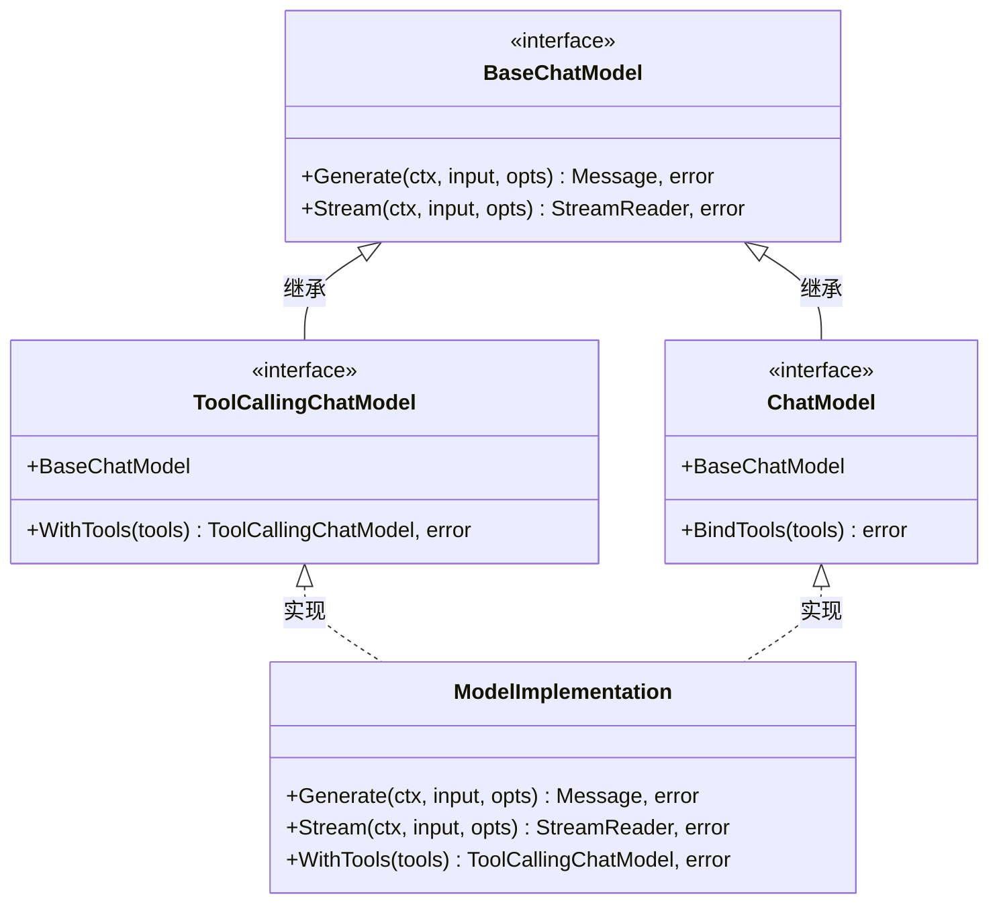
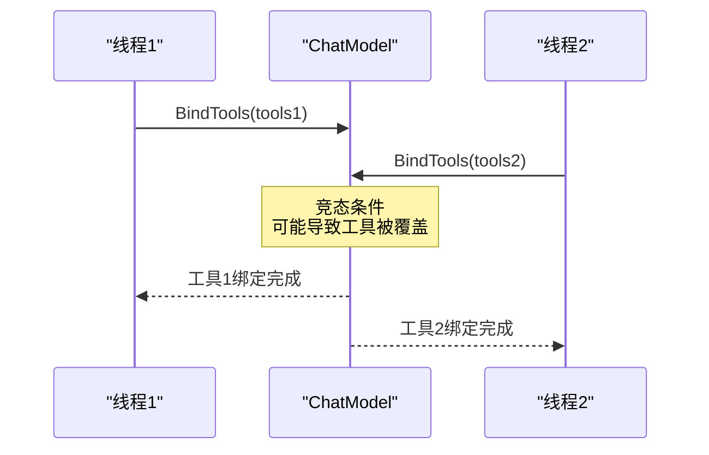
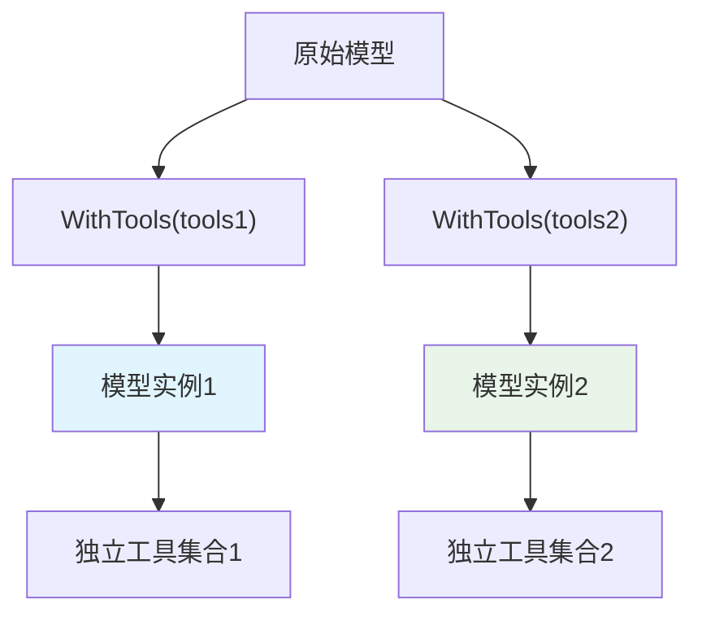
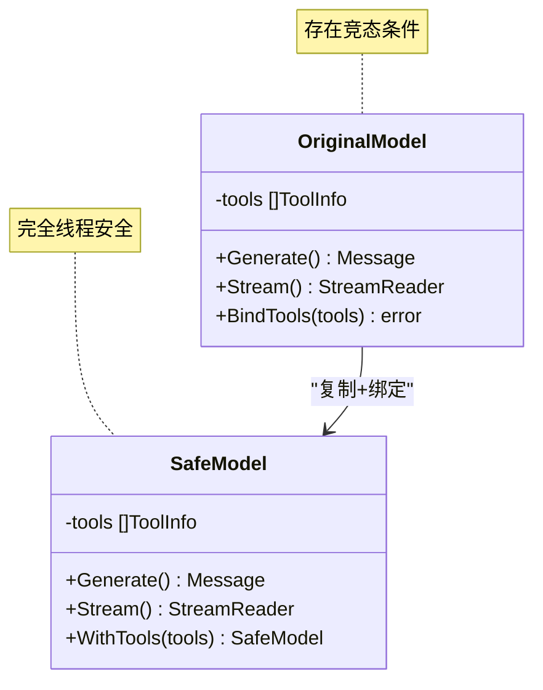
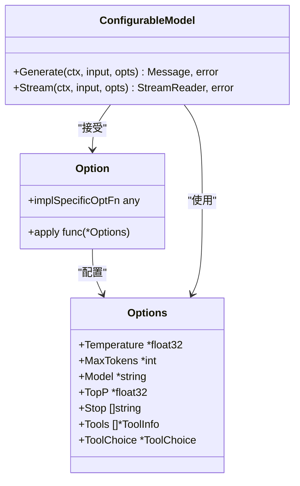
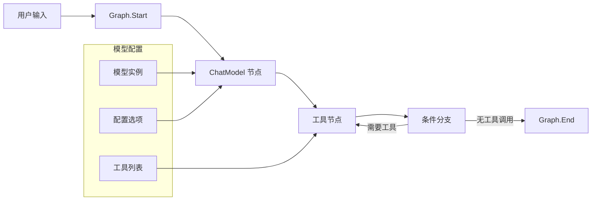
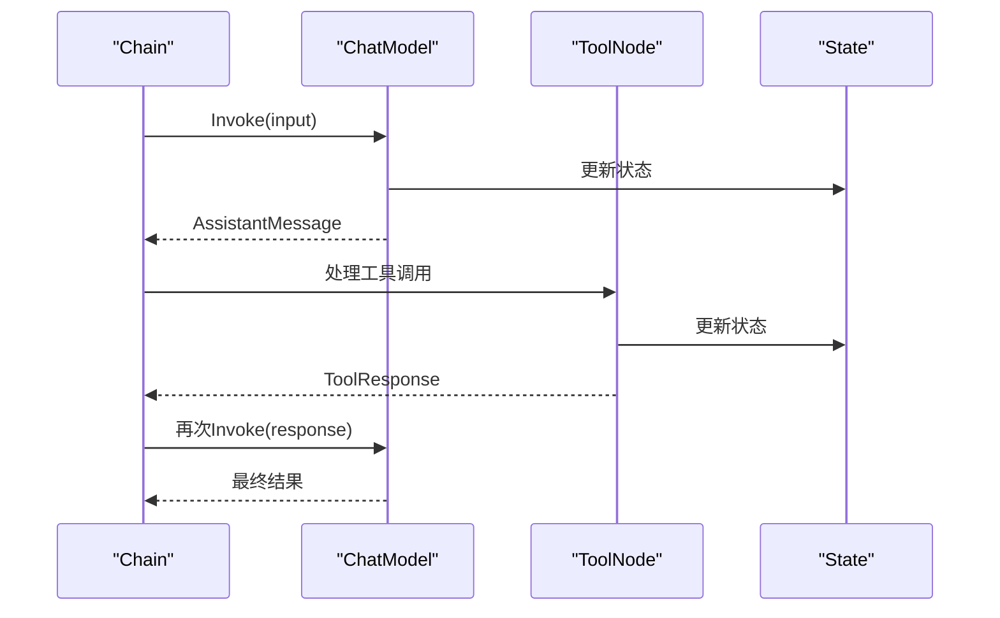
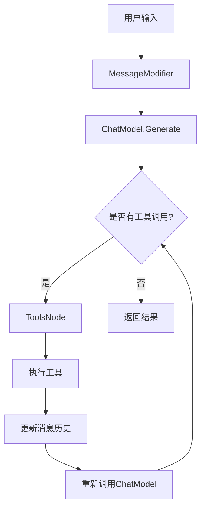

# 模型 (Model)

<cite>
**本文档中引用的文件**
- [adk/chatmodel.go](file://adk/chatmodel.go)
- [adk/interface.go](file://adk/interface.go)
- [adk/call_option.go](file://adk/call_option.go)
- [components/model/interface.go](file://components/model/interface.go)
- [components/model/option.go](file://components/model/option.go)
- [flow/agent/react/react.go](file://flow/agent/react/react.go)
- [flow/agent/utils.go](file://flow/agent/utils.go)
- [compose/graph.go](file://compose/graph.go)
- [internal/mock/components/model/ChatModel_mock.go](file://internal/mock/components/model/ChatModel_mock.go)
</cite>

## 目录
1. [简介](#简介)
2. [核心接口架构](#核心接口架构)
3. [BaseChatModel 接口详解](#basechatmodel-接口详解)
4. [ChatModel 接口详解](#chatmodel-接口详解)
5. [ToolCallingChatModel 接口详解](#toolcallingchatmodel-接口详解)
6. [WithTools 方法的安全性优势](#withtools-方法的安全性优势)
7. [Option 模式配置](#option-模式配置)
8. [模型在 Graph/Chain 中的集成](#模型在-graphchain-中的集成)
9. [实际应用示例](#实际应用示例)
10. [最佳实践与注意事项](#最佳实践与注意事项)

## 简介

Eino 框架提供了完整的模型组件体系，支持三种主要的模型接口：`BaseChatModel`、`ChatModel` 和 `ToolCallingChatModel`。这些接口设计遵循了从基础到高级的功能演进路径，特别强调了并发安全性和工具调用能力的重要性。

## 核心接口架构



**图表来源**
- [components/model/interface.go](file://components/model/interface.go#L30-L56)

**章节来源**
- [components/model/interface.go](file://components/model/interface.go#L25-L56)

## BaseChatModel 接口详解

`BaseChatModel` 是所有聊天模型的基础接口，定义了最基本的交互能力。

### 核心方法

#### Generate 方法
- **用途**: 同步生成完整的响应消息
- **签名**: `Generate(ctx context.Context, input []*schema.Message, opts ...Option) (*schema.Message, error)`
- **特点**: 
  - 返回完整的 `schema.Message` 对象
  - 支持流式和非流式的配置选项
  - 提供统一的消息格式处理

#### Stream 方法  
- **用途**: 异步生成流式响应
- **签名**: `Stream(ctx context.Context, input []*schema.Message, opts ...Option) (*schema.StreamReader[*schema.Message], error)`
- **特点**:
  - 返回 `schema.StreamReader` 流处理器
  - 支持实时数据传输
  - 可用于构建实时对话界面

### 使用场景对比

| 方法 | 适用场景 | 性能特点 | 实时性 |
|------|----------|----------|--------|
| Generate | 批处理、批量请求 | 高吞吐量 | 延迟较高 |
| Stream | 实时对话、流式输出 | 低延迟 | 实时性强 |

**章节来源**
- [components/model/interface.go](file://components/model/interface.go#L30-L34)

## ChatModel 接口详解

`ChatModel` 接口扩展了 `BaseChatModel`，增加了工具绑定功能，但存在并发安全问题。

### BindTools 方法

- **功能**: 将工具列表绑定到模型实例
- **签名**: `BindTools(tools []*schema.ToolInfo) error`
- **问题**: 存在原子性问题和工具覆盖风险

### 并发安全问题



**图表来源**
- [components/model/interface.go](file://components/model/interface.go#L41-L45)

### 废弃原因

`ChatModel` 接口已被标记为废弃，主要原因包括：
- **并发安全问题**: `BindTools` 方法不是原子操作
- **状态管理问题**: 修改模型内部状态
- **工具覆盖风险**: 多次调用可能覆盖之前的工具设置

**章节来源**
- [components/model/interface.go](file://components/model/interface.go#L36-L46)

## ToolCallingChatModel 接口详解

`ToolCallingChatModel` 是推荐使用的高级接口，解决了 `ChatModel` 的并发安全问题。

### WithTools 方法

- **功能**: 返回带有指定工具的新模型实例
- **签名**: `WithTools(tools []*schema.ToolInfo) (ToolCallingChatModel, error)`
- **特点**:
  - 不修改当前实例，返回新实例
  - 完全线程安全
  - 支持链式调用

### 设计优势



**图表来源**
- [components/model/interface.go](file://components/model/interface.go#L53-L55)

### 实现要求

实现 `ToolCallingChatModel` 接口的模型必须：
1. 实现 `BaseChatModel` 的所有方法
2. 提供线程安全的 `WithTools` 实现
3. 正确处理工具信息的传递和存储

**章节来源**
- [components/model/interface.go](file://components/model/interface.go#L47-L56)

## WithTools 方法的安全性优势

### 并发安全保障

`WithTools` 方法通过以下机制确保并发安全：



### 具体优势对比

| 特性 | BindTools | WithTools |
|------|-----------|-----------|
| 原子性 | ❌ 非原子操作 | ✅ 原子操作 |
| 状态修改 | ❌ 修改原实例 | ✅ 创建新实例 |
| 并发安全 | ❌ 不安全 | ✅ 安全 |
| 工具隔离 | ❌ 共享状态 | ✅ 独立状态 |
| 错误恢复 | ❌ 可能损坏状态 | ✅ 可安全回滚 |

**章节来源**
- [flow/agent/utils.go](file://flow/agent/utils.go#L25-L50)

## Option 模式配置

Eino 框架采用 Option 模式进行模型参数配置，提供了灵活且类型安全的配置方式。

### 基础配置选项

#### 温度控制
- **功能**: 控制生成结果的随机性
- **范围**: 0.0 (确定性) 到 1.0 (高随机性)
- **使用**: `WithTemperature(0.7)`

#### 最大令牌数
- **功能**: 限制生成的最大长度
- **用途**: 防止过长的输出
- **使用**: `WithMaxTokens(1000)`

#### 模型名称
- **功能**: 指定使用的具体模型
- **用途**: 多模型环境下的选择
- **使用**: `WithModel("gpt-4")`

### 高级配置选项

#### Top-P 采样
- **功能**: 核采样策略，平衡质量和多样性
- **范围**: 0.0 到 1.0
- **使用**: `WithTopP(0.9)`

#### 停止词
- **功能**: 指定生成过程中的停止条件
- **用途**: 控制生成的结束时机
- **使用**: `WithStop([]string{"[END]", "[STOP]"})`

#### 工具配置
- **功能**: 配置可用的工具信息
- **用途**: 支持工具调用功能
- **使用**: `WithTools(toolInfos)`

### Option 模式实现原理



**图表来源**
- [components/model/option.go](file://components/model/option.go#L22-L37)

**章节来源**
- [components/model/option.go](file://components/model/option.go#L46-L110)

## 模型在 Graph/Chain 中的集成

### Graph 编排中的模型使用

在 Eino 的 Graph 编排系统中，模型作为核心节点参与复杂的流程控制。

#### 基本集成模式



**图表来源**
- [compose/graph.go](file://compose/graph.go#L36-L41)

#### 配置方式

在 Graph 中配置模型有多种方式：

1. **直接添加模型节点**
   ```go
   graph.AddChatModelNode("model", chatModel, options...)
   ```

2. **使用工具节点组合**
   ```go
   toolsNode, _ := compose.NewToolNode(ctx, &ToolsNodeConfig{Tools: tools})
   graph.AddToolsNode("tools", toolsNode)
   ```

3. **流式处理配置**
   ```go
   graph.AddChatModelNode("model", chatModel, 
       compose.WithStatePreHandler(preHandler),
       compose.WithNodeName("custom_model"))
   ```

### Chain 集成模式

在 Chain 模式下，模型可以与其他组件无缝协作：



**章节来源**
- [compose/graph.go](file://compose/graph.go#L162-L200)

## 实际应用示例

### ChatModelAgent 中的模型使用

在 `ChatModelAgent` 中，模型通过多种方式参与 Agent 决策：

#### 基本配置示例

```go
// 创建工具配置
toolsConfig := model.ToolsConfig{
    Tools: []tool.BaseTool{calculator, webSearch},
    ReturnDirectly: map[string]bool{
        "calculator": true,
    },
}

// 配置 Agent
config := &ChatModelAgentConfig{
    Name:        "mathAgent",
    Description: "数学计算助手",
    Instruction: "你是一个专业的数学助手。",
    Model:       toolCallingModel,
    ToolsConfig: toolsConfig,
    MaxIterations: 5,
}

agent, err := NewChatModelAgent(ctx, config)
```

#### ReAct Agent 中的模型使用



**图表来源**
- [flow/agent/react/react.go](file://flow/agent/react/react.go#L171-L183)

### 工具调用流程

在实际的 Agent 流程中，模型参与以下关键步骤：

1. **消息生成**: 模型根据上下文生成回复
2. **工具识别**: 模型决定是否需要调用工具
3. **工具调用**: 将工具调用信息传递给工具节点
4. **结果整合**: 将工具结果整合到后续的对话中

**章节来源**
- [adk/chatmodel.go](file://adk/chatmodel.go#L536-L582)
- [flow/agent/react/react.go](file://flow/agent/react/react.go#L384-L398)

## 最佳实践与注意事项

### 推荐使用模式

1. **优先使用 ToolCallingChatModel**
   - 避免并发安全问题
   - 支持更灵活的工具管理
   - 更好的可测试性

2. **合理配置 Option 参数**
   - 根据具体任务调整温度值
   - 设置合适的最大令牌数
   - 使用停止词防止无限生成

3. **工具设计原则**
   - 工具功能单一明确
   - 参数验证严格
   - 错误处理完善

### 常见陷阱

1. **并发访问问题**
   - 避免多个 goroutine 同时调用 `BindTools`
   - 使用 `WithTools` 替代 `BindTools`

2. **工具状态管理**
   - 不要在工具中维护全局状态
   - 使用会话上下文传递状态

3. **性能优化**
   - 合理设置缓存策略
   - 避免频繁的模型实例创建

### 监控与调试

建议在生产环境中实施以下监控措施：

- **响应时间监控**: 跟踪模型调用的延迟
- **错误率统计**: 监控工具调用失败率
- **资源使用**: 监控内存和 CPU 使用情况
- **工具使用频率**: 分析工具的使用模式

通过遵循这些最佳实践，可以充分发挥 Eino 框架模型组件的强大功能，构建高效、可靠的 AI 应用系统。