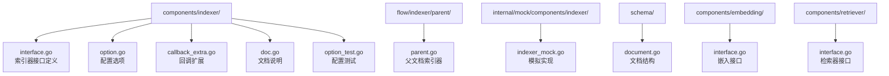
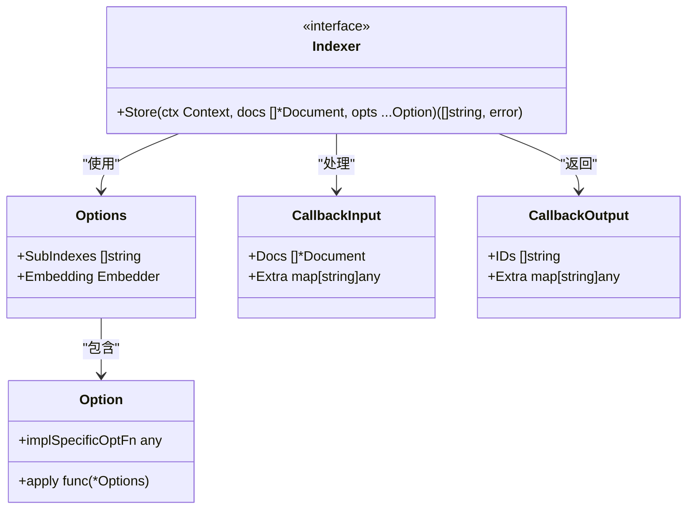
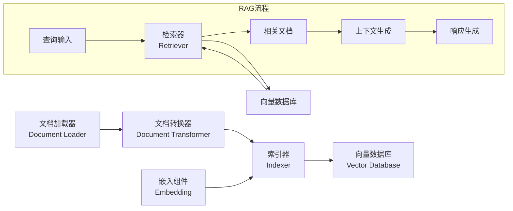
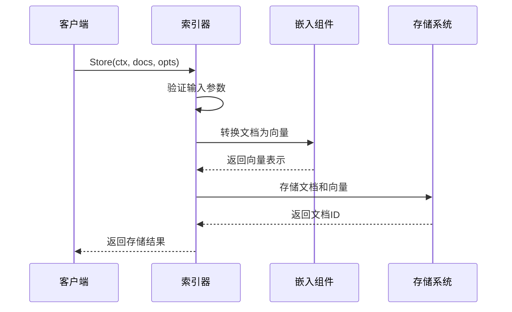
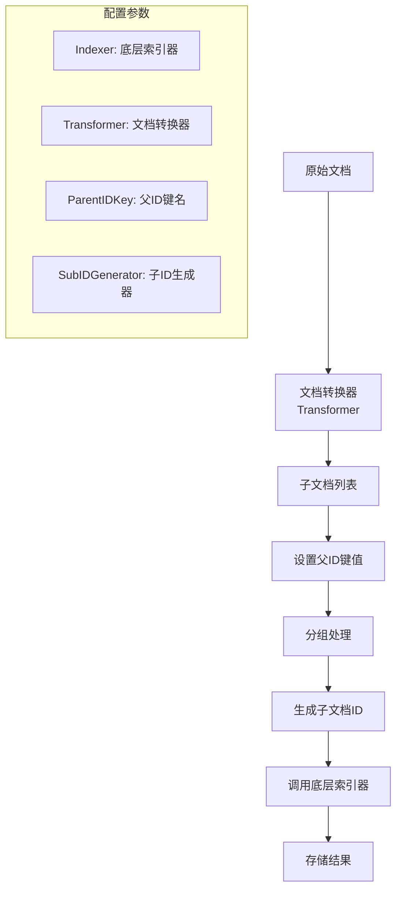
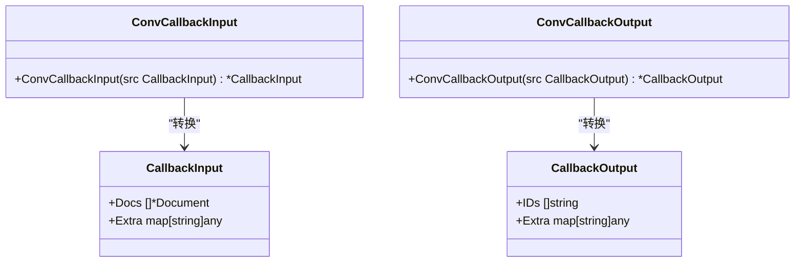
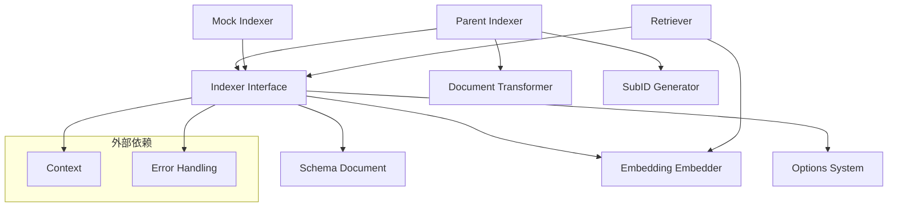
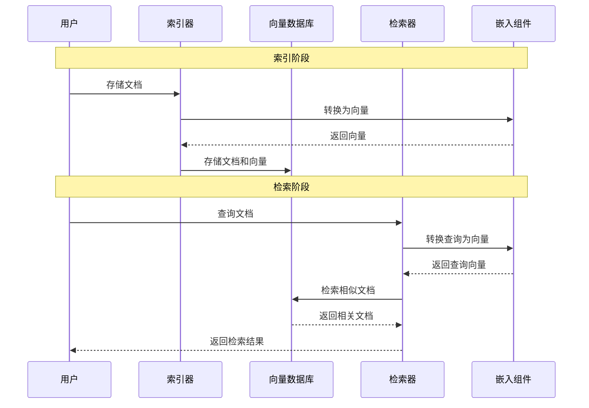

# 索引器 (Indexer)

<cite>
**本文档中引用的文件**
- [components/indexer/interface.go](file://components/indexer/interface.go)
- [components/indexer/doc.go](file://components/indexer/doc.go)
- [components/indexer/option.go](file://components/indexer/option.go)
- [components/indexer/callback_extra.go](file://components/indexer/callback_extra.go)
- [components/indexer/option_test.go](file://components/indexer/option_test.go)
- [flow/indexer/parent/parent.go](file://flow/indexer/parent/parent.go)
- [components/embedding/interface.go](file://components/embedding/interface.go)
- [components/retriever/interface.go](file://components/retriever/interface.go)
- [schema/document.go](file://schema/document.go)
- [internal/mock/components/indexer/indexer_mock.go](file://internal/mock/components/indexer/indexer_mock.go)
</cite>

## 目录
1. [简介](#简介)
2. [项目结构](#项目结构)
3. [核心组件](#核心组件)
4. [架构概览](#架构概览)
5. [详细组件分析](#详细组件分析)
6. [依赖关系分析](#依赖关系分析)
7. [性能考虑](#性能考虑)
8. [故障排除指南](#故障排除指南)
9. [结论](#结论)

## 简介

索引器（Indexer）是Eino框架中的核心组件之一，负责将文档存储到特定的索引结构中，如向量数据库或其他存储系统。索引器在RAG（检索增强生成）系统中扮演着关键角色，为后续的文档检索提供基础。

索引器的主要职责包括：
- 接收文档列表并将其存储到索引结构中
- 与嵌入（Embedding）组件协作，实现文档的向量化处理
- 支持多种索引策略，包括父文档索引和子文档管理
- 提供灵活的配置选项，支持不同的索引需求

## 项目结构

索引器组件在Eino框架中的组织结构如下：

**图表来源**
- [components/indexer/interface.go](file://components/indexer/interface.go#L1-L33)
- [flow/indexer/parent/parent.go](file://flow/indexer/parent/parent.go#L1-L160)

**章节来源**
- [components/indexer/interface.go](file://components/indexer/interface.go#L1-L33)
- [flow/indexer/parent/parent.go](file://flow/indexer/parent/parent.go#L1-L160)

## 核心组件

### Indexer接口

Indexer接口是索引器组件的核心抽象，定义了文档存储的基本操作：

**图表来源**
- [components/indexer/interface.go](file://components/indexer/interface.go#L25-L32)
- [components/indexer/option.go](file://components/indexer/option.go#L21-L27)
- [components/indexer/callback_extra.go](file://components/indexer/callback_extra.go#L24-L38)

### 配置选项系统

索引器采用Option模式来配置各种参数，提供了灵活的配置机制：

| 选项类型 | 功能描述 | 使用场景 |
|---------|----------|----------|
| WithSubIndexes | 设置子索引列表 | 多索引环境下的文档分类存储 |
| WithEmbedding | 设置嵌入组件 | 文档向量化处理前的准备 |
| WrapImplSpecificOptFn | 包装特定实现选项 | 不同索引器实现的特殊配置 |

**章节来源**
- [components/indexer/option.go](file://components/indexer/option.go#L21-L109)

## 架构概览

索引器在Eino框架的整体架构中处于数据处理的关键位置：

**图表来源**
- [flow/indexer/parent/parent.go](file://flow/indexer/parent/parent.go#L28-L60)
- [components/embedding/interface.go](file://components/embedding/interface.go#L22-L24)

## 详细组件分析

### 基础索引器接口

Indexer接口定义了文档存储的核心方法：

**图表来源**
- [components/indexer/interface.go](file://components/indexer/interface.go#L30-L31)
- [components/embedding/interface.go](file://components/embedding/interface.go#L23)

### 父文档索引器

父文档索引器（Parent Indexer）是索引器的一种高级实现，专门处理文档分割和子文档管理：

**图表来源**
- [flow/indexer/parent/parent.go](file://flow/indexer/parent/parent.go#L112-L158)

#### 父文档索引器的工作流程

1. **文档转换**：使用文档转换器将原始文档分割成更小的子文档
2. **元数据设置**：为每个子文档设置父文档ID的元数据
3. **分组处理**：按父文档ID对子文档进行分组
4. **ID生成**：为每组子文档生成唯一的子文档ID
5. **存储调用**：调用底层索引器执行实际的存储操作

**章节来源**
- [flow/indexer/parent/parent.go](file://flow/indexer/parent/parent.go#L112-L158)

### 回调系统

索引器提供了完整的回调系统，用于监控和扩展索引过程：

**图表来源**
- [components/indexer/callback_extra.go](file://components/indexer/callback_extra.go#L24-L66)

**章节来源**
- [components/indexer/callback_extra.go](file://components/indexer/callback_extra.go#L1-L67)

## 依赖关系分析

索引器组件与其他组件之间的依赖关系：

**图表来源**
- [components/indexer/interface.go](file://components/indexer/interface.go#L22-L23)
- [flow/indexer/parent/parent.go](file://flow/indexer/parent/parent.go#L23-L25)

### 与嵌入组件的关系

索引器与嵌入组件之间存在密切的协作关系：

1. **数据流**：嵌入组件负责将文本转换为向量表示
2. **配置传递**：通过Option模式将嵌入组件传递给索引器
3. **预处理**：索引器在存储前可能需要先进行向量化处理

**章节来源**
- [components/indexer/option.go](file://components/indexer/option.go#L19-L27)
- [components/embedding/interface.go](file://components/embedding/interface.go#L22-L24)

### 与检索器的配合

索引器和检索器形成完整的RAG解决方案：

**图表来源**
- [components/retriever/interface.go](file://components/retriever/interface.go#L39-L41)
- [components/embedding/interface.go](file://components/embedding/interface.go#L23)

**章节来源**
- [components/retriever/interface.go](file://components/retriever/interface.go#L1-L42)

## 性能考虑

### 并发处理

索引器设计时考虑了并发处理能力：

- **Context支持**：所有操作都接受Context参数，支持取消和超时控制
- **批量操作**：Store方法支持批量文档处理，提高效率
- **异步处理**：底层存储系统可以异步处理索引请求

### 内存管理

- **流式处理**：对于大文档集合，可以采用流式处理避免内存溢出
- **分批处理**：支持分批处理大型文档集
- **缓存策略**：可以集成缓存机制减少重复计算

### 扩展性

- **插件化设计**：通过接口抽象支持不同类型的存储后端
- **配置驱动**：通过Option模式支持灵活的配置
- **可扩展的回调系统**：支持自定义回调逻辑

## 故障排除指南

### 常见问题及解决方案

| 问题类型 | 可能原因 | 解决方案 |
|---------|----------|----------|
| 存储失败 | 文档格式不正确 | 验证文档结构和必需字段 |
| 向量化错误 | 嵌入组件配置错误 | 检查嵌入组件的初始化和配置 |
| 性能问题 | 批处理大小不当 | 调整批量大小和并发度 |
| 内存溢出 | 文档过大或数量过多 | 实施流式处理或分批处理 |

### 调试技巧

1. **启用日志记录**：通过回调系统记录详细的处理信息
2. **监控指标**：跟踪索引速度、成功率等关键指标
3. **单元测试**：使用Mock组件进行单元测试
4. **压力测试**：验证在高负载下的表现

**章节来源**
- [components/indexer/option_test.go](file://components/indexer/option_test.go#L27-L45)

## 结论

索引器组件是Eino框架中不可或缺的核心组件，它不仅提供了基本的文档存储功能，还通过灵活的配置系统和高级特性支持复杂的索引需求。

### 主要优势

1. **接口简洁**：清晰的Indexer接口定义了标准的存储契约
2. **配置灵活**：Option模式提供了丰富的配置选项
3. **扩展性强**：支持多种索引策略和存储后端
4. **集成良好**：与嵌入组件和检索器无缝协作
5. **易于测试**：提供了完整的Mock实现

### 最佳实践建议

1. **合理选择索引策略**：根据应用场景选择合适的索引器实现
2. **优化配置参数**：根据数据特点调整子索引和嵌入配置
3. **监控性能指标**：建立完善的监控体系
4. **实施容错机制**：处理网络异常和存储故障
5. **定期维护索引**：保持索引的完整性和性能

索引器组件的设计体现了Eino框架对现代AI应用需求的深刻理解，为构建高质量的RAG系统奠定了坚实的基础。