# Eino组件系统

<cite>
**本文档中引用的文件**
- [adk/chatmodel.go](file://adk/chatmodel.go)
- [components/tool/interface.go](file://components/tool/interface.go)
- [components/tool/option.go](file://components/tool/option.go)
- [components/prompt/interface.go](file://components/prompt/interface.go)
- [components/prompt/option.go](file://components/prompt/option.go)
- [components/retriever/interface.go](file://components/retriever/interface.go)
- [components/document/interface.go](file://components/document/interface.go)
- [components/embedding/interface.go](file://components/embedding/interface.go)
- [components/indexer/interface.go](file://components/indexer/interface.go)
- [components/model/interface.go](file://components/model/interface.go)
- [components/tool/utils/common.go](file://components/tool/utils/common.go)
- [components/types.go](file://components/types.go)
</cite>

## 目录
1. [简介](#简介)
2. [设计理念](#设计理念)
3. [核心组件架构](#核心组件架构)
4. [ChatModel组件](#chatmodel组件)
5. [Tool组件](#tool组件)
6. [ChatTemplate组件](#chattemplate组件)
7. [Retriever组件](#retriever组件)
8. [Document组件](#document组件)
9. [Embedding组件](#embedding组件)
10. [Indexer组件](#indexer组件)
11. [统一接口规范](#统一接口规范)
12. [配置选项模式](#配置选项模式)
13. [组件集成与使用](#组件集成与使用)
14. [总结](#总结)

## 简介

Eino是一个强大的AI应用开发框架，采用可复用、可插拔的功能模块设计。该框架通过精心设计的组件系统，为开发者提供了构建复杂AI应用所需的基础设施。每个组件都遵循统一的接口规范和选项模式，确保了框架的一致性和扩展性。

## 设计理念

Eino组件系统的核心设计理念包括：

### 可复用性
每个组件都可以在不同的场景中重复使用，无需重新开发基础功能。

### 可插拔性
组件之间松耦合设计，可以灵活组合和替换，支持动态配置和运行时调整。

### 统一规范
所有组件都遵循相同的接口规范和配置模式，降低学习成本和维护难度。

### 扩展性
清晰的抽象层次和标准化的扩展点，支持第三方组件的无缝集成。

## 核心组件架构

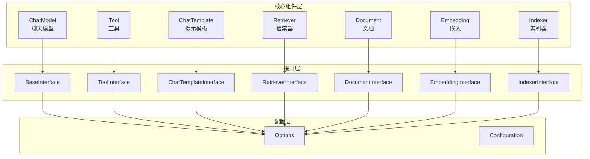

**图表来源**
- [components/model/interface.go](file://components/model/interface.go#L25-L56)
- [components/tool/interface.go](file://components/tool/interface.go#L25-L43)
- [components/prompt/interface.go](file://components/prompt/interface.go#L25-L29)

## ChatModel组件

ChatModel是Eino框架中负责与大型语言模型(LLM)交互的核心组件。

### 接口定义

ChatModel组件定义了两个主要接口：

#### BaseChatModel接口
提供基础的聊天模型能力：
- `Generate`: 同步生成消息
- `Stream`: 流式生成消息

#### ToolCallingChatModel接口  
扩展基础功能，支持工具调用：
- `WithTools`: 返回绑定工具的新实例

### 核心特性

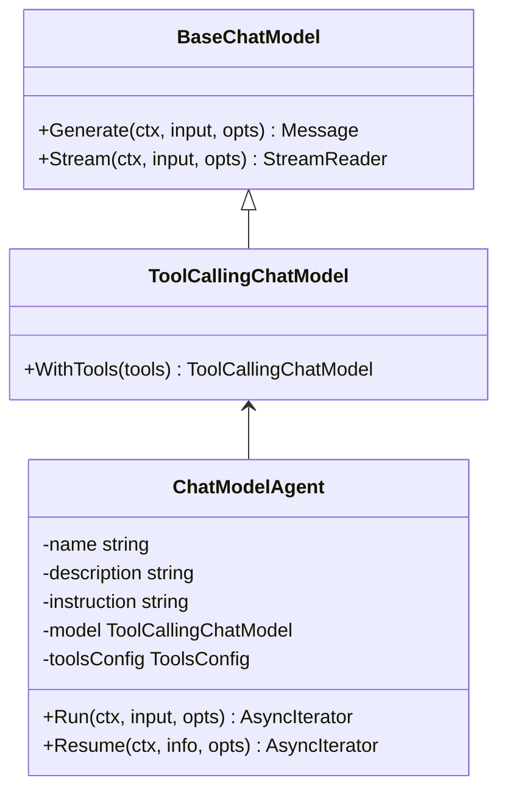

**图表来源**
- [components/model/interface.go](file://components/model/interface.go#L25-L56)
- [adk/chatmodel.go](file://adk/chatmodel.go#L149-L173)

### 配置选项

ChatModel支持丰富的配置选项，包括：
- 模型参数设置
- 工具绑定配置
- 输出格式控制
- 流式处理选项

**章节来源**
- [adk/chatmodel.go](file://adk/chatmodel.go#L42-L74)
- [components/model/interface.go](file://components/model/interface.go#L25-L56)

## Tool组件

Tool组件代表外部功能调用，是连接LLM和外部服务的桥梁。

### 接口层次结构

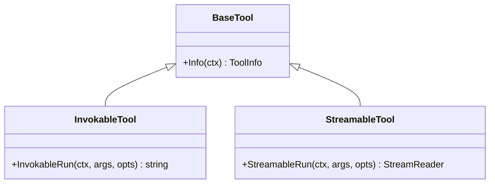

**图表来源**
- [components/tool/interface.go](file://components/tool/interface.go#L25-L43)

### 实现模式

Tool组件支持两种执行模式：

#### 可调用工具 (InvokableTool)
适用于同步操作，返回字符串结果。

#### 可流式工具 (StreamableTool)
适用于异步或长时间运行的操作，返回流式结果。

### 配置选项系统

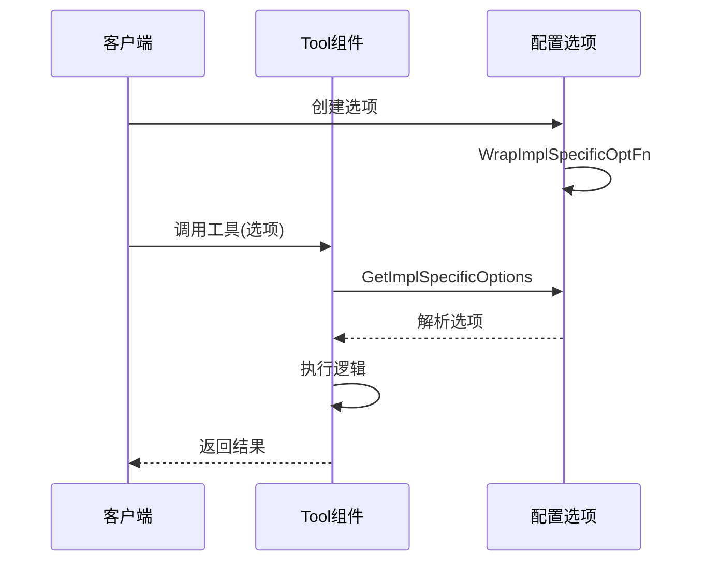

**图表来源**
- [components/tool/option.go](file://components/tool/option.go#L26-L78)

**章节来源**
- [components/tool/interface.go](file://components/tool/interface.go#L25-L43)
- [components/tool/option.go](file://components/tool/option.go#L19-L78)

## ChatTemplate组件

ChatTemplate组件负责管理和格式化提示词模板。

### 核心接口

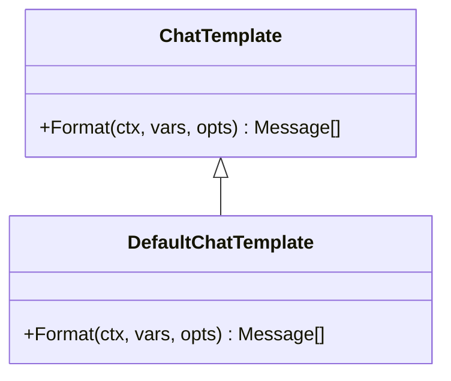

**图表来源**
- [components/prompt/interface.go](file://components/prompt/interface.go#L25-L29)

### 功能特性

- **变量替换**: 支持在模板中使用占位符
- **条件格式化**: 基于上下文的动态格式化
- **多语言支持**: 支持不同语言的模板格式

### 配置选项

ChatTemplate同样采用统一的选项模式，支持：
- 用户ID设置
- 名称定制
- 自定义格式化规则

**章节来源**
- [components/prompt/interface.go](file://components/prompt/interface.go#L25-L29)
- [components/prompt/option.go](file://components/prompt/option.go#L19-L48)

## Retriever组件

Retriever组件负责从各种数据源检索相关信息。

### 接口定义

```mermaid
classDiagram
class Retriever {
+Retrieve(ctx, query, opts) Document[]
}
class Options {
+TopK int
+Filters map[string]interface{}
}
Retriever --> Options : 使用
```

**图表来源**
- [components/retriever/interface.go](file://components/retriever/interface.go#L39-L41)

### 核心功能

- **多源检索**: 支持从不同数据源检索
- **相似度匹配**: 基于向量相似度检索
- **过滤机制**: 支持基于条件的文档过滤
- **排序策略**: 多种排序和评分算法

### 应用场景

- 文档问答系统
- 智能搜索
- 内容推荐
- 知识图谱查询

**章节来源**
- [components/retriever/interface.go](file://components/retriever/interface.go#L25-L41)

## Document组件

Document组件处理文档的加载、转换和存储。

### 接口层次

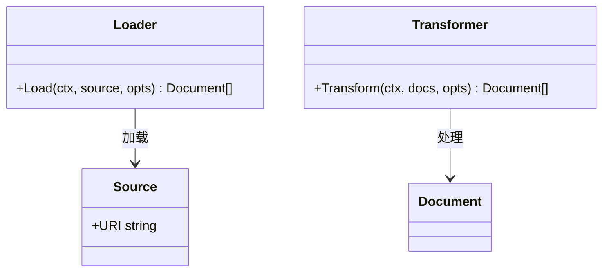

**图表来源**
- [components/document/interface.go](file://components/document/interface.go#L34-L42)

### 核心流程

1. **加载阶段**: 从各种源加载原始文档
2. **转换阶段**: 对文档进行分割、清洗等处理
3. **存储阶段**: 将处理后的文档存储到索引系统

### 支持的文档类型

- 文本文件 (.txt, .md)
- 结构化文档 (.docx, .pdf)
- 网页内容
- 数据库记录

**章节来源**
- [components/document/interface.go](file://components/document/interface.go#L25-L42)

## Embedding组件

Embedding组件负责将文本转换为向量表示。

### 核心接口

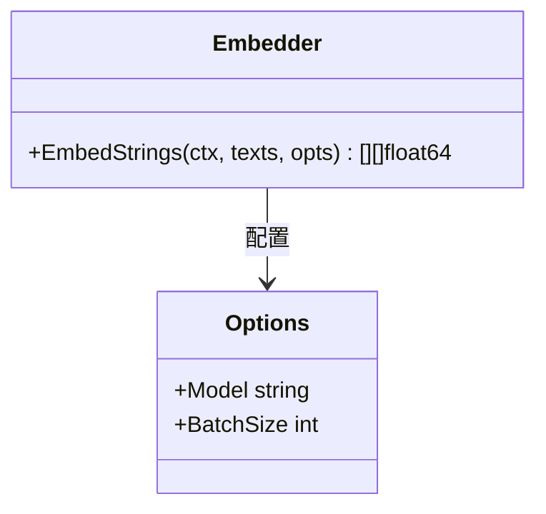

**图表来源**
- [components/embedding/interface.go](file://components/embedding/interface.go#L21-L24)

### 主要特性

- **批量处理**: 支持批量文本嵌入以提高效率
- **模型选择**: 支持多种预训练模型
- **维度控制**: 可配置输出向量维度
- **缓存机制**: 内置嵌入结果缓存

### 应用场景

- 文档相似度计算
- 搜索相关性评分
- 聚类分析
- 推荐系统

**章节来源**
- [components/embedding/interface.go](file://components/embedding/interface.go#L21-L24)

## Indexer组件

Indexer组件负责管理和维护文档索引。

### 接口定义

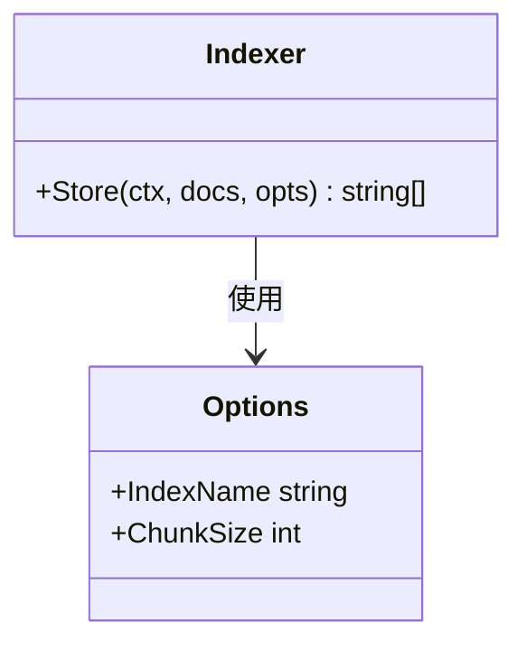

**图表来源**
- [components/indexer/interface.go](file://components/indexer/interface.go#L25-L32)

### 核心功能

- **文档存储**: 将文档存储到索引系统
- **索引管理**: 维护高效的检索索引
- **版本控制**: 支持索引的版本管理和更新
- **并发安全**: 确保多线程环境下的数据一致性

### 技术特点

- **分布式支持**: 支持分布式索引部署
- **增量更新**: 支持增量索引更新
- **压缩优化**: 内置索引压缩和优化
- **监控指标**: 提供详细的性能监控

**章节来源**
- [components/indexer/interface.go](file://components/indexer/interface.go#L25-L32)

## 统一接口规范

Eino框架的所有组件都遵循统一的接口规范，确保了系统的整体性和一致性。

### 标准接口模式

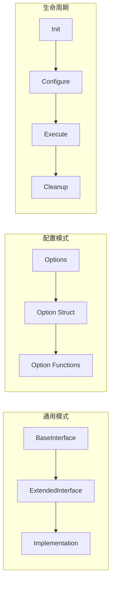

### 接口设计原则

1. **最小化接口**: 每个接口只包含必要的方法
2. **职责单一**: 每个组件专注于特定功能领域
3. **可扩展性**: 接口设计预留扩展空间
4. **向后兼容**: 新版本保持对旧版本的兼容性

### 类型系统

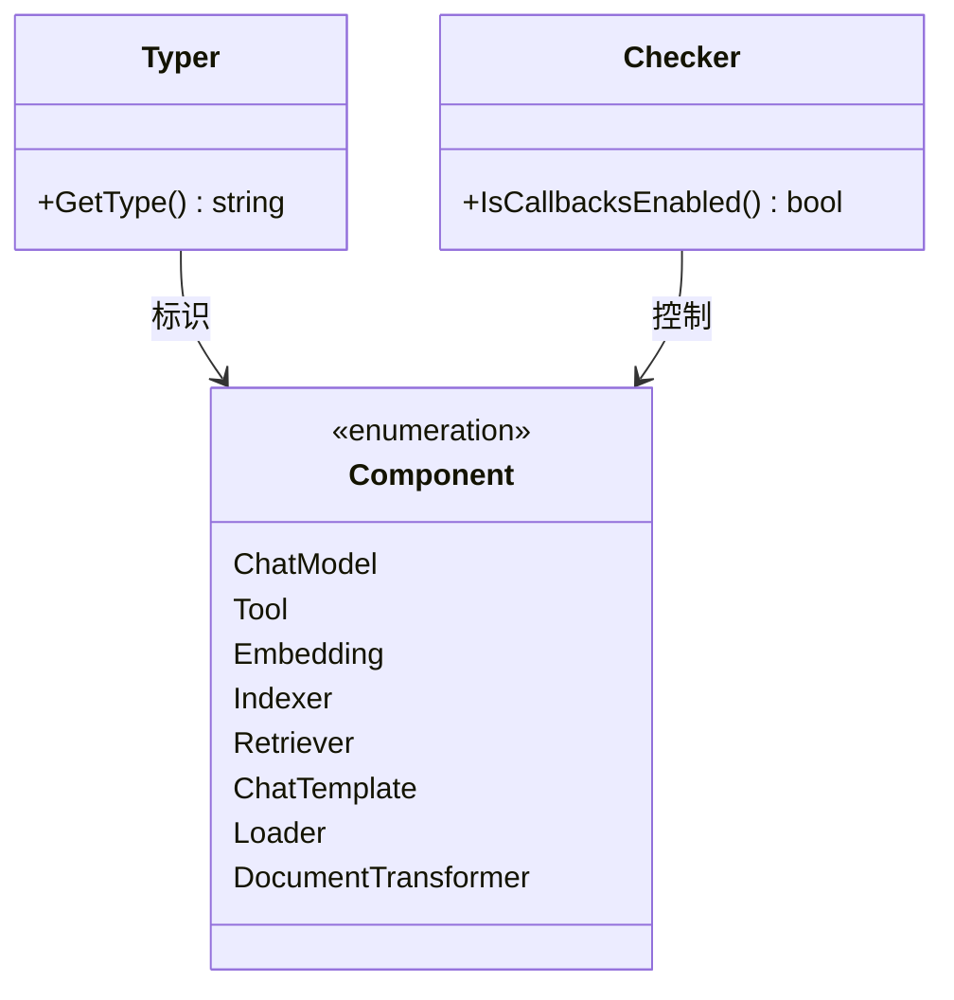

**图表来源**
- [components/types.go](file://components/types.go#L20-L62)

**章节来源**
- [components/types.go](file://components/types.go#L20-L62)

## 配置选项模式

Eino框架采用统一的配置选项模式，为所有组件提供一致的配置体验。

### 选项系统架构

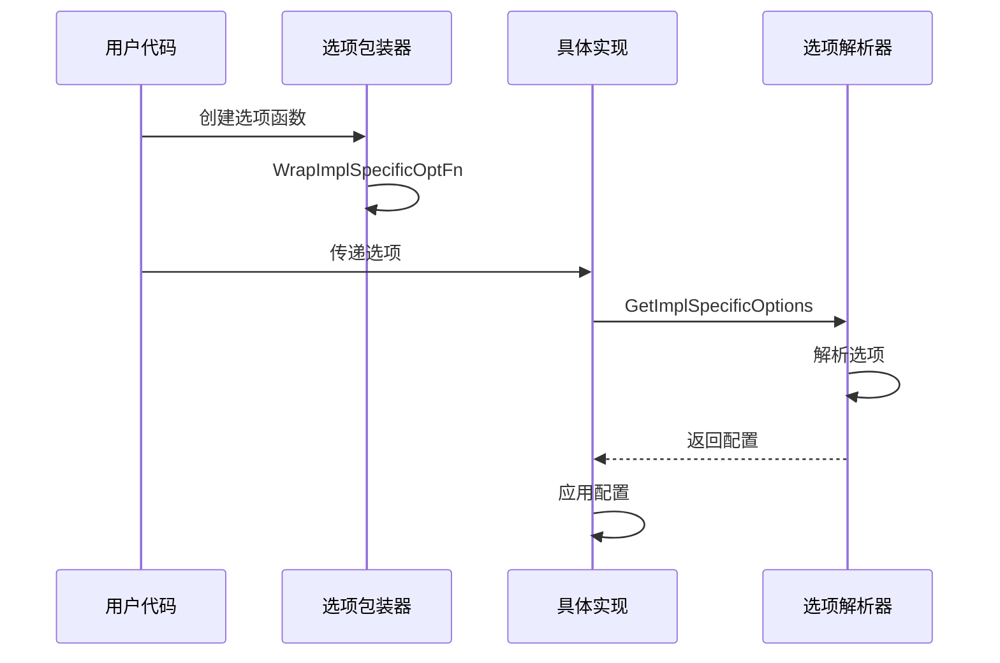

**图表来源**
- [components/tool/option.go](file://components/tool/option.go#L26-L78)

### 选项模式的优势

1. **类型安全**: 编译时检查选项类型
2. **默认值支持**: 可以为选项提供默认值
3. **链式调用**: 支持多个选项的链式组合
4. **向后兼容**: 新增选项不影响现有代码

### 实现示例

每个组件都遵循相同的选项模式：

```go
// 选项结构定义
type MyOptions struct {
    Param1 string
    Param2 int
}

// 选项函数
func WithParam1(value string) Option {
    return WrapImplSpecificOptFn(func(opts *MyOptions) {
        opts.Param1 = value
    })
}

// 选项解析
func GetMyOptions(base *MyOptions, opts ...Option) *MyOptions {
    return GetImplSpecificOptions(base, opts...)
}
```

**章节来源**
- [components/tool/option.go](file://components/tool/option.go#L19-L78)
- [components/prompt/option.go](file://components/prompt/option.go#L19-L48)

## 组件集成与使用

Eino框架提供了多种方式来集成和使用这些组件。

### 图形化编排

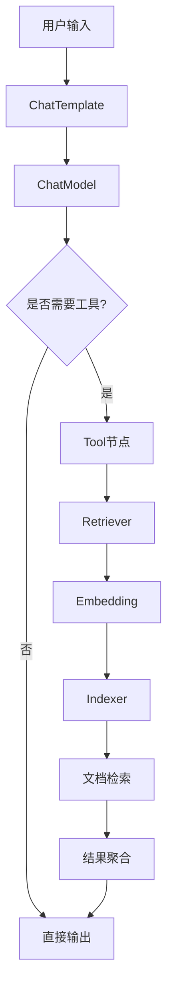

### 组件组合模式

1. **串行组合**: 一个组件的输出作为下一个组件的输入
2. **并行组合**: 多个组件同时处理相同输入
3. **分支组合**: 根据条件选择不同的处理路径
4. **循环组合**: 支持迭代和递归处理

### 最佳实践

- **单一职责**: 每个组件只负责一个明确的功能
- **错误处理**: 统一的错误处理和恢复机制
- **性能监控**: 内置性能指标和监控
- **配置管理**: 集中化的配置管理和热更新

## 总结

Eino组件系统通过以下核心特性实现了高度的可复用性和可插拔性：

### 关键优势

1. **统一规范**: 所有组件遵循相同的接口和配置模式
2. **模块化设计**: 组件之间松耦合，易于替换和扩展
3. **类型安全**: 强类型的接口设计和选项系统
4. **性能优化**: 内置缓存、批处理和并发支持
5. **开发友好**: 清晰的API设计和丰富的配置选项

### 应用价值

- **快速原型**: 快速构建和测试AI应用原型
- **生产就绪**: 稳定可靠的生产环境部署
- **生态丰富**: 支持第三方组件的无缝集成
- **维护简便**: 统一的架构设计降低维护成本

Eino组件系统为AI应用开发提供了一个强大而灵活的基础平台，使开发者能够专注于业务逻辑的实现，而不必担心底层技术细节。通过这种模块化的设计，Eino成功地将复杂的AI应用开发过程简化为可组合的组件装配过程，大大提高了开发效率和系统的可维护性。