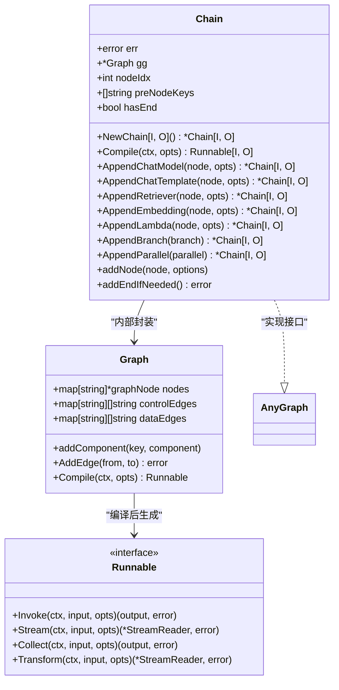
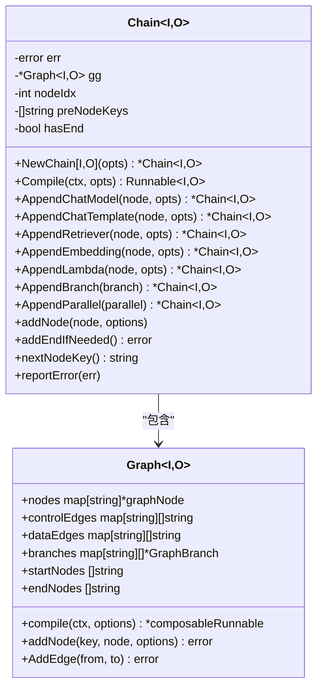
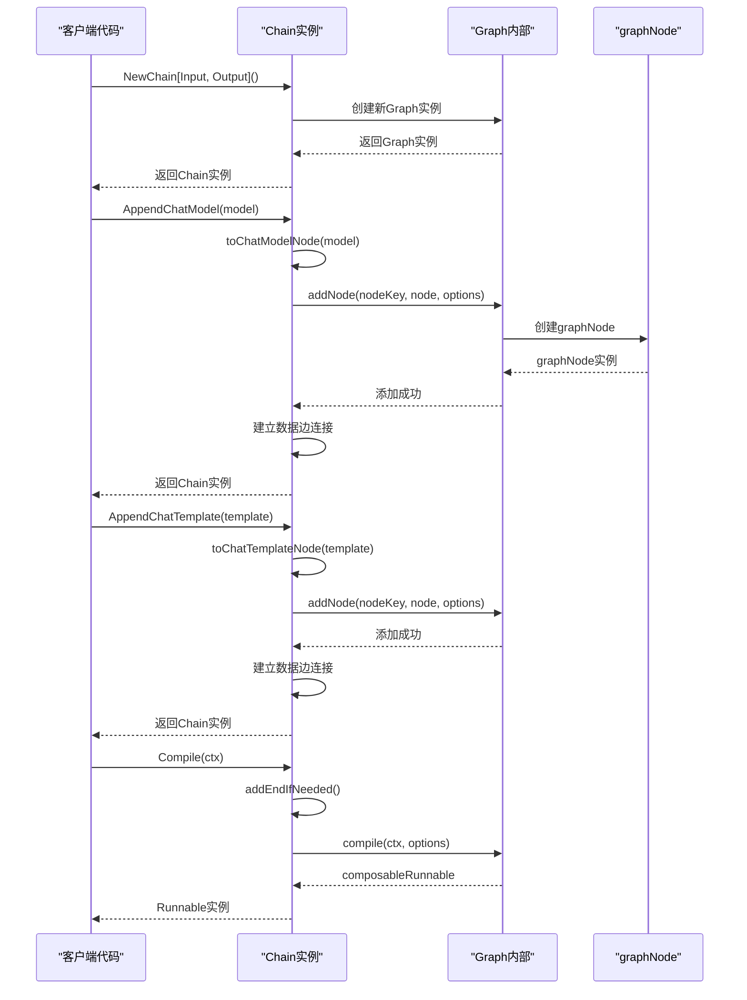
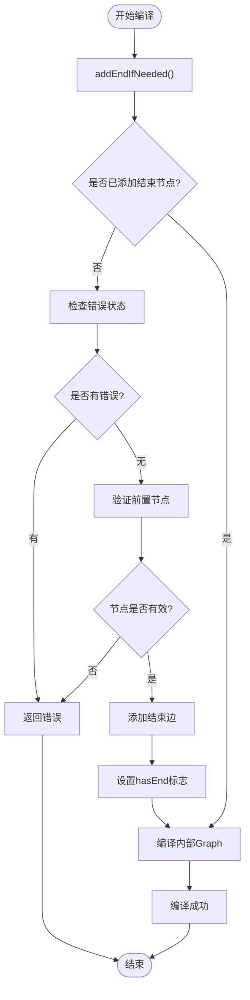
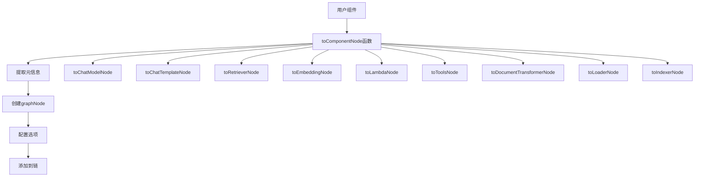
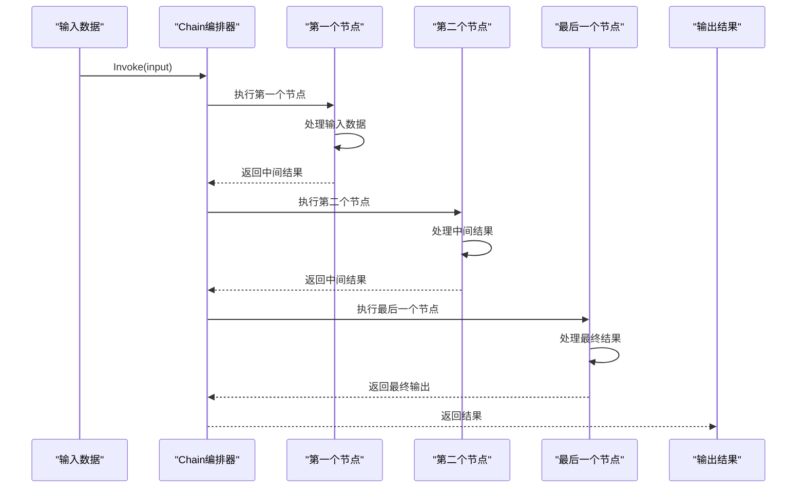
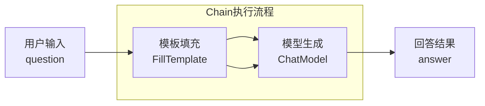
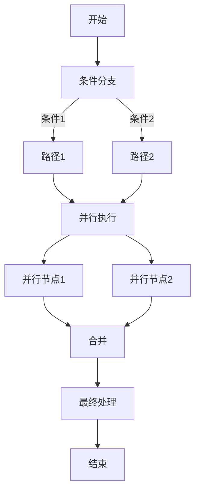

# Chain编排模式详解

<cite>
**本文档引用的文件**
- [chain.go](file://compose/chain.go)
- [graph.go](file://compose/graph.go)
- [types.go](file://compose/types.go)
- [runnable.go](file://compose/runnable.go)
- [component_to_graph_node.go](file://compose/component_to_graph_node.go)
- [chain_test.go](file://compose/chain_test.go)
</cite>

## 目录
1. [简介](#简介)
2. [核心架构](#核心架构)
3. [Chain结构体设计](#chain结构体设计)
4. [构建器模式实现](#构建器模式实现)
5. [组件添加方法](#组件添加方法)
6. [执行流程与数据流](#执行流程与数据流)
7. [完整使用示例](#完整使用示例)
8. [适用场景分析](#适用场景分析)
9. [局限性说明](#局限性说明)
10. [最佳实践建议](#最佳实践建议)

## 简介

Chain编排模式是Eino框架中一种线性、链式执行的简化编排方式，专为构建顺序执行的简单流程而设计。它通过内部封装Graph结构，提供了流畅的构建器（Builder）模式API，使开发者能够以直观的方式组合不同的组件来构建复杂的工作流程。

Chain模式的核心特点包括：
- **线性执行**：组件按添加顺序依次执行
- **简化配置**：自动建立组件间的连接关系
- **类型安全**：泛型支持确保输入输出类型的正确性
- **灵活扩展**：支持多种类型的组件添加

## 核心架构

Chain编排模式的整体架构如下图所示：



**图表来源**
- [chain.go](file://compose/chain.go#L68-L82)
- [graph.go](file://compose/graph.go#L57-L89)
- [runnable.go](file://compose/runnable.go#L28-L37)

## Chain结构体设计

Chain结构体是整个编排模式的核心载体，其设计体现了简洁性和功能性的平衡：



**图表来源**
- [chain.go](file://compose/chain.go#L68-L82)
- [graph.go](file://compose/graph.go#L57-L89)

**章节来源**
- [chain.go](file://compose/chain.go#L68-L82)

### 关键字段解析

1. **err**: 错误状态记录器，一旦出现错误就不再接受新的修改
2. **gg**: 内部封装的Graph实例，负责实际的图结构管理和编译
3. **nodeIdx**: 节点索引计数器，用于生成唯一的节点标识符
4. **preNodeKeys**: 前置节点键列表，维护当前链的状态
5. **hasEnd**: 结束标记，确保每个链都有明确的终点

## 构建器模式实现

Chain采用流畅的构建器模式，支持链式调用，提供了优雅的API设计：



**图表来源**
- [chain.go](file://compose/chain.go#L36-L45)
- [chain.go](file://compose/chain.go#L157-L163)
- [chain.go](file://compose/chain.go#L522-L562)

**章节来源**
- [chain.go](file://compose/chain.go#L36-L45)
- [chain.go](file://compose/chain.go#L157-L163)

### 编译过程

Chain的编译过程是一个关键步骤，它将链式的配置转换为可执行的Runnable对象：



**图表来源**
- [chain.go](file://compose/chain.go#L88-L94)
- [chain.go](file://compose/chain.go#L96-L121)

## 组件添加方法

Chain提供了丰富的组件添加方法，每种方法都针对特定类型的组件进行了优化：

### 核心组件添加方法

| 方法名 | 功能描述 | 支持的组件类型 | 自动建立的关系 |
|--------|----------|----------------|----------------|
| `AppendChatModel` | 添加聊天模型节点 | `model.BaseChatModel` | 输入到模型，模型到输出 |
| `AppendChatTemplate` | 添加聊天模板节点 | `prompt.ChatTemplate` | 输入到模板，模板到消息数组 |
| `AppendRetriever` | 添加检索器节点 | `retriever.Retriever` | 输入到检索器，检索器到文档列表 |
| `AppendEmbedding` | 添加嵌入节点 | `embedding.Embedder` | 文本到向量 |
| `AppendLambda` | 添加自定义Lambda节点 | `*Lambda` | 自定义逻辑处理 |
| `AppendToolsNode` | 添加工具节点 | `*ToolsNode` | 工具调用处理 |
| `AppendDocumentTransformer` | 添加文档转换器 | `document.Transformer` | 文档到文档 |
| `AppendLoader` | 添加加载器 | `document.Loader` | 文件到文档 |
| `AppendIndexer` | 添加索引器 | `indexer.Indexer` | 文档到索引 |

### 分支和并行组件

| 方法名 | 功能描述 | 特殊处理 |
|--------|----------|----------|
| `AppendBranch` | 添加条件分支 | 多个分支路径，条件判断 |
| `AppendParallel` | 添加并发节点 | 多个节点同时执行 |
| `AppendGraph` | 添加子图节点 | 嵌套复合节点 |
| `AppendPassthrough` | 添加透传节点 | 数据直接传递 |

**章节来源**
- [chain.go](file://compose/chain.go#L165-L500)

### 组件转换机制

Chain通过统一的组件转换机制将各种组件包装为graphNode：



**图表来源**
- [component_to_graph_node.go](file://compose/component_to_graph_node.go#L88-L145)

**章节来源**
- [component_to_graph_node.go](file://compose/component_to_graph_node.go#L88-L145)

## 执行流程与数据流

Chain的执行遵循严格的线性顺序，每个组件的输出作为下一个组件的输入：



**图表来源**
- [chain.go](file://compose/chain.go#L522-L562)

### 数据流向控制

Chain通过以下机制确保数据流的正确性：

1. **节点连接管理**: 每个节点自动连接到前一个节点
2. **类型检查**: 编译时验证输入输出类型兼容性
3. **错误传播**: 错误状态在链中传播
4. **状态维护**: 保持节点执行状态的一致性

**章节来源**
- [chain.go](file://compose/chain.go#L522-L562)

## 完整使用示例

以下是一个完整的Chain使用示例，展示从创建到执行的全过程：

### 示例场景：问答系统构建



**图表来源**
- [chain_test.go](file://compose/chain_test.go#L76-L79)

### 代码实现步骤

1. **创建Chain实例**
   ```go
   // 创建带输入输出类型的Chain
   chain := NewChain[map[string]any, string]()
   ```

2. **添加组件**
   ```go
   // 添加聊天模板组件
   chain.AppendChatTemplate(chatTemplate)
   
   // 添加聊天模型组件
   chain.AppendChatModel(chatModel)
   ```

3. **编译执行**
   ```go
   // 编译为可执行的Runnable
   runnable, err := chain.Compile(context.Background())
   if err != nil {
       log.Fatal(err)
   }
   
   // 执行链式操作
   result, err := runnable.Invoke(context.Background(), input)
   ```

### 复杂场景示例

对于更复杂的场景，Chain支持嵌套和分支：



**图表来源**
- [chain_test.go](file://compose/chain_test.go#L76-L100)

**章节来源**
- [chain_test.go](file://compose/chain_test.go#L76-L100)

## 适用场景分析

Chain编排模式特别适合以下应用场景：

### 1. 简单工作流程
- **文档处理流水线**: 从加载、解析、转换到存储
- **问答系统**: 模板填充 → 模型生成 → 后处理
- **数据预处理**: 数据清洗 → 特征提取 → 标准化

### 2. 顺序依赖任务
- **多阶段推理**: 分步计算、逐步细化
- **批处理作业**: 串行化的数据处理任务
- **API调用链**: 依赖前一阶段结果的连续API调用

### 3. 快速原型开发
- **概念验证**: 快速搭建原型系统
- **实验性流程**: 验证不同组件组合的效果
- **教学演示**: 展示工作流程的各个步骤

## 局限性说明

尽管Chain模式具有诸多优势，但也存在明显的局限性：

### 1. 不支持复杂分支逻辑
- **单一分支**: 只能进行简单的二选一分支
- **缺乏循环**: 无法实现循环执行或递归调用
- **条件限制**: 分支条件必须是布尔值或枚举

### 2. 执行模式单一
- **线性执行**: 所有组件必须按顺序执行
- **无并行**: 无法实现真正的并行处理
- **固定路径**: 无法动态调整执行路径

### 3. 错误处理有限
- **传播机制**: 错误会沿着链传播但无法恢复
- **缺乏重试**: 内置重试机制有限
- **调试困难**: 复杂链的调试相对困难

### 4. 性能考虑
- **串行瓶颈**: 线性执行可能导致性能瓶颈
- **资源浪费**: 某些组件可能等待其他组件完成
- **扩展性限制**: 难以适应大规模并发需求

## 最佳实践建议

为了充分发挥Chain模式的优势并规避其局限性，建议遵循以下最佳实践：

### 1. 设计原则

1. **单一职责**: 每个组件只负责一个明确的功能
2. **类型安全**: 充分利用泛型确保类型安全
3. **错误处理**: 在每个组件中妥善处理错误情况
4. **文档注释**: 为复杂的链添加清晰的文档说明

### 2. 性能优化

1. **组件选择**: 选择高性能的组件实现
2. **内存管理**: 注意大型数据结构的内存使用
3. **并发考虑**: 对于CPU密集型任务，考虑使用并行模式
4. **缓存策略**: 对重复计算的结果进行缓存

### 3. 开发建议

1. **渐进式构建**: 从简单开始，逐步增加复杂度
2. **单元测试**: 为每个组件编写独立的测试
3. **集成测试**: 测试整个链的端到端功能
4. **监控指标**: 添加适当的日志和监控

### 4. 架构设计

1. **模块化**: 将常用链封装为可复用的模块
2. **配置化**: 使用配置文件管理链的参数
3. **版本控制**: 对链的变更进行版本管理
4. **回滚机制**: 提供链的快速回滚能力

通过合理运用Chain编排模式，开发者可以快速构建出功能强大且易于维护的应用程序，特别是在需要线性处理流程的场景中。然而，在面对更复杂的业务需求时，应该考虑结合其他编排模式来实现更灵活的解决方案。