# Eino框架Graph编排模式深度解析

<cite>
**本文档引用的文件**
- [graph.go](file://compose/graph.go)
- [dag.go](file://compose/dag.go)
- [pregel.go](file://compose/pregel.go)
- [graph_node.go](file://compose/graph_node.go)
- [branch.go](file://compose/branch.go)
- [types.go](file://compose/types.go)
- [graph_run.go](file://compose/graph_run.go)
- [generic_graph.go](file://compose/generic_graph.go)
- [react.go](file://adk/react.go)
</cite>

## 目录
1. [概述](#概述)
2. [Graph核心结构](#graph核心结构)
3. [运行模式与架构](#运行模式与架构)
4. [节点管理机制](#节点管理机制)
5. [边与分支系统](#边与分支系统)
6. [通道与执行引擎](#通道与执行引擎)
7. [ReAct Agent实现案例](#react-agent实现案例)
8. [性能优化与并发处理](#性能优化与并发处理)
9. [总结](#总结)

## 概述

Eino框架的Graph编排模式是一个基于有向无环图（DAG）或支持循环的Pregel模型的强大工作流管理系统。它通过`compose/graph.go`中的`Graph`结构体实现了复杂的决策和执行流程编排，为构建智能代理和自动化工作流提供了坚实的基础。

Graph编排模式的核心优势包括：
- **类型安全**：编译时类型检查确保节点间的数据流正确性
- **灵活的执行模式**：支持DAG和Pregel两种运行模式
- **条件分支**：强大的分支系统支持复杂的决策逻辑
- **状态管理**：内置状态共享和持久化机制
- **流式处理**：支持消息流的高效处理和合并

## Graph核心结构

### 基础数据结构

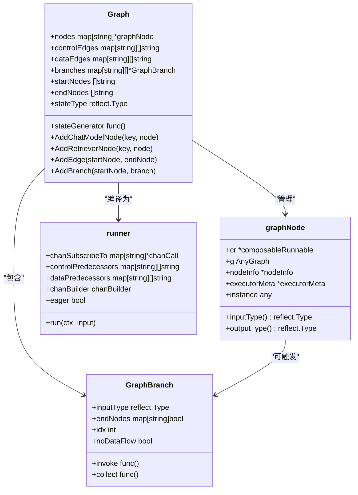

**图表来源**
- [graph.go](file://compose/graph.go#L57-L89)
- [graph_node.go](file://compose/graph_node.go#L60-L70)
- [branch.go](file://compose/branch.go#L40-L49)
- [graph_run.go](file://compose/graph_run.go#L41-L82)

### 核心字段详解

Graph结构体包含了以下关键字段：

| 字段 | 类型 | 描述 |
|------|------|------|
| `nodes` | `map[string]*graphNode` | 存储所有节点及其元信息 |
| `controlEdges` | `map[string][]string` | 控制流边，决定节点执行顺序 |
| `dataEdges` | `map[string][]string` | 数据流边，连接节点间的数据传递 |
| `branches` | `map[string][]*GraphBranch` | 条件分支系统，支持动态路由 |
| `startNodes` | `[]string` | 起始节点列表 |
| `endNodes` | `[]string` | 结束节点列表 |
| `stateType` | `reflect.Type` | 共享状态的类型信息 |
| `stateGenerator` | `func()` | 状态初始化函数 |

**章节来源**
- [graph.go](file://compose/graph.go#L57-L89)

## 运行模式与架构

### 两种运行模式

Eino Graph支持两种主要的运行模式：

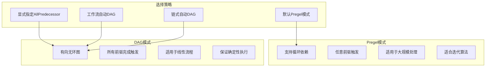

**图表来源**
- [graph.go](file://compose/graph.go#L45-L49)
- [graph_run.go](file://compose/graph_run.go#L639-L664)

### 模式切换机制

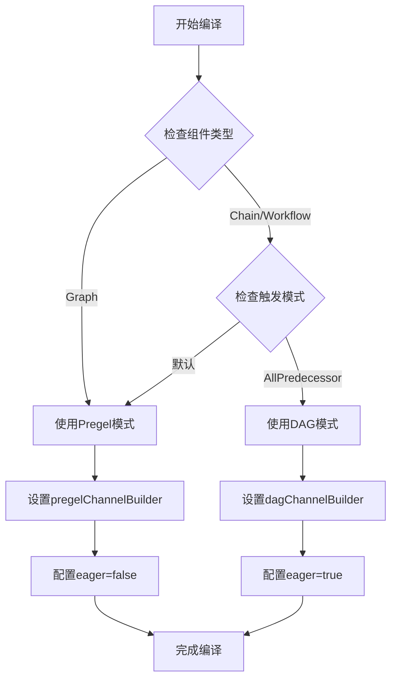

**图表来源**
- [graph.go](file://compose/graph.go#L639-L664)

**章节来源**
- [graph.go](file://compose/graph.go#L639-L664)
- [dag.go](file://compose/dag.go#L23-L40)
- [pregel.go](file://compose/pregel.go#L21-L23)

## 节点管理机制

### 节点添加流程

Graph提供了丰富的节点添加方法，每种方法对应不同的组件类型：

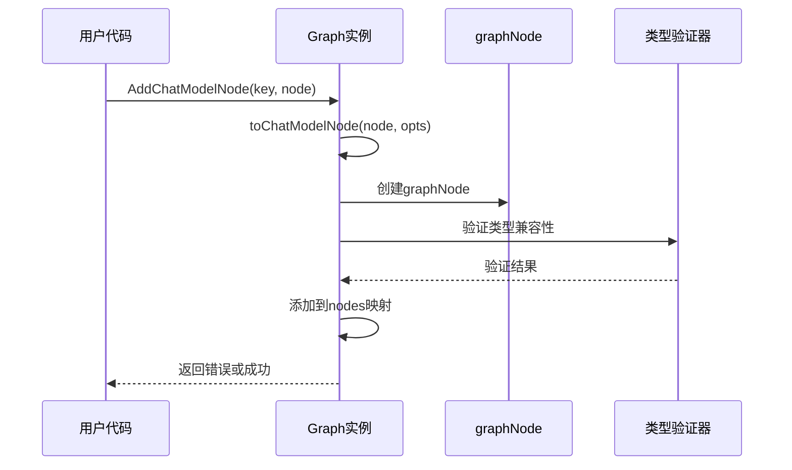

**图表来源**
- [graph.go](file://compose/graph.go#L342-L352)

### 支持的节点类型

| 方法 | 组件类型 | 用途 |
|------|----------|------|
| `AddChatModelNode` | `model.BaseChatModel` | 对话模型节点 |
| `AddRetrieverNode` | `retriever.Retriever` | 文档检索节点 |
| `AddEmbeddingNode` | `embedding.Embedder` | 向量嵌入节点 |
| `AddIndexerNode` | `indexer.Indexer` | 索引构建节点 |
| `AddLoaderNode` | `document.Loader` | 文档加载节点 |
| `AddLambdaNode` | `*Lambda` | 自定义函数节点 |
| `AddPassthroughNode` | 内置 | 数据透传节点 |

### 节点验证机制

Graph在添加节点时会进行严格的类型验证：

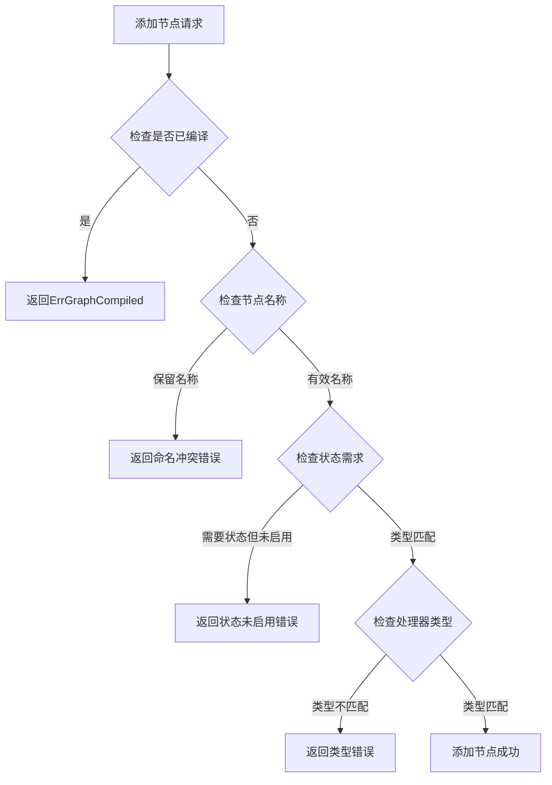

**图表来源**
- [graph.go](file://compose/graph.go#L162-L229)

**章节来源**
- [graph.go](file://compose/graph.go#L296-L418)
- [graph_node.go](file://compose/graph_node.go#L60-L70)

## 边与分支系统

### 边的类型与功能

Graph支持两种类型的边：

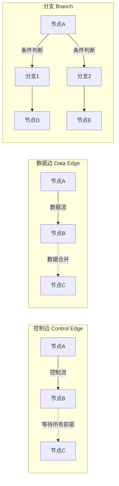

**图表来源**
- [graph.go](file://compose/graph.go#L232-L294)
- [branch.go](file://compose/branch.go#L40-L49)

### 分支系统设计

Graph的分支系统提供了强大的条件路由能力：

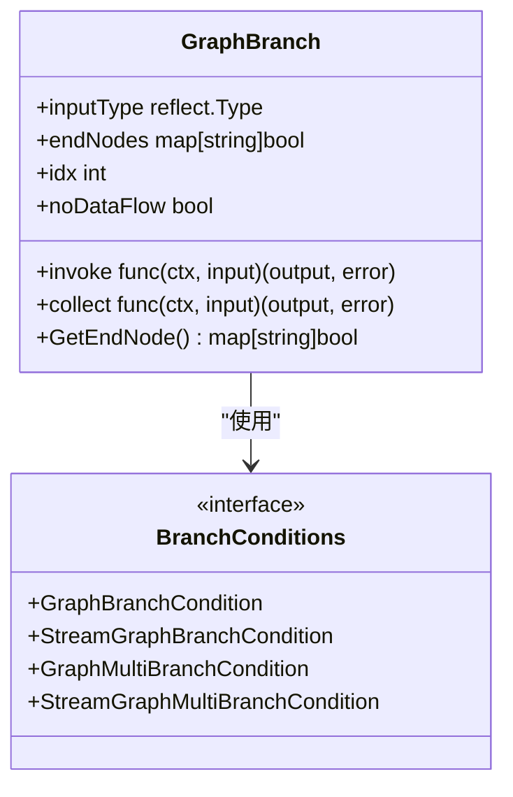

**图表来源**
- [branch.go](file://compose/branch.go#L28-L49)

### 分支创建与验证

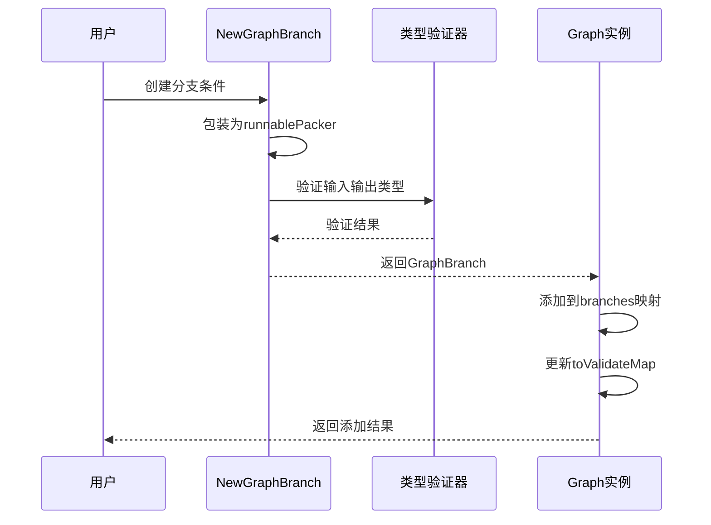

**图表来源**
- [branch.go](file://compose/branch.go#L57-L85)

**章节来源**
- [graph.go](file://compose/graph.go#L232-L294)
- [branch.go](file://compose/branch.go#L28-L173)

## 通道与执行引擎

### 通道构建器模式

Eino使用通道构建器模式来支持不同的执行策略：

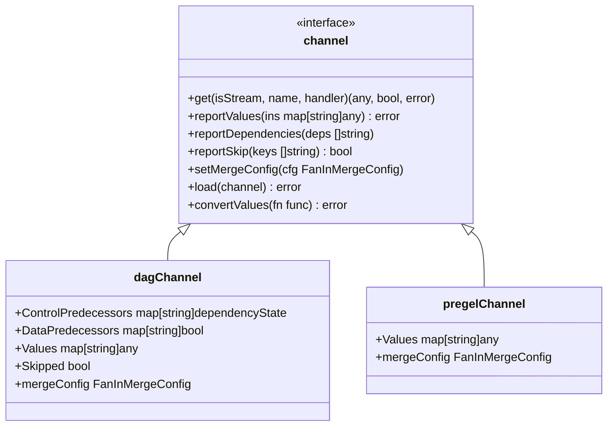

**图表来源**
- [dag.go](file://compose/dag.go#L50-L60)
- [pregel.go](file://compose/pregel.go#L25-L30)

### DAG通道的工作机制

DAG通道实现了严格的依赖等待机制：

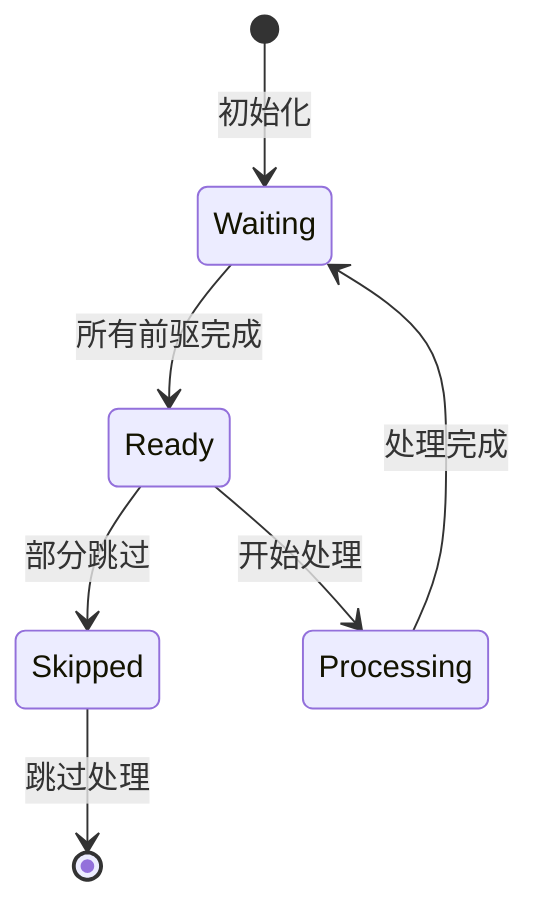

**图表来源**
- [dag.go](file://compose/dag.go#L42-L48)

### 执行引擎架构

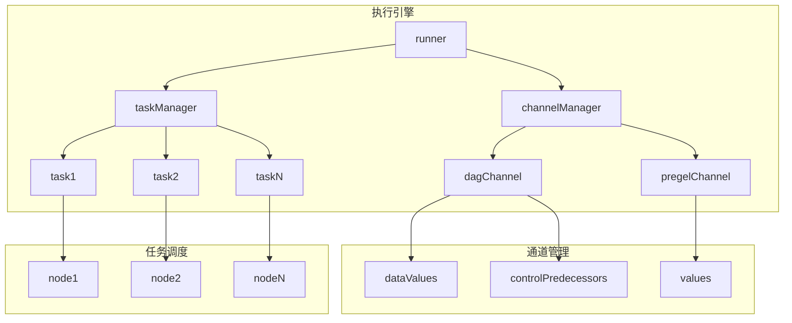

**图表来源**
- [graph_run.go](file://compose/graph_run.go#L41-L82)

**章节来源**
- [dag.go](file://compose/dag.go#L23-L196)
- [pregel.go](file://compose/pregel.go#L21-L96)
- [graph_run.go](file://compose/graph_run.go#L41-L82)

## ReAct Agent实现案例

### ReAct Agent架构

ReAct Agent是Eino框架中典型的高级模式应用，展示了Graph编排的强大能力：

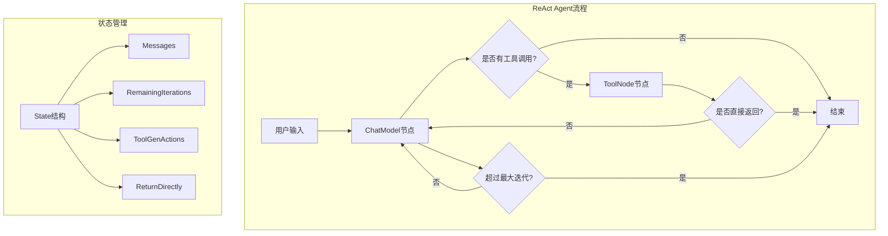

**图表来源**
- [react.go](file://adk/react.go#L121-L200)

### Graph编排实现

ReAct Agent的Graph编排展示了复杂的交互模式：

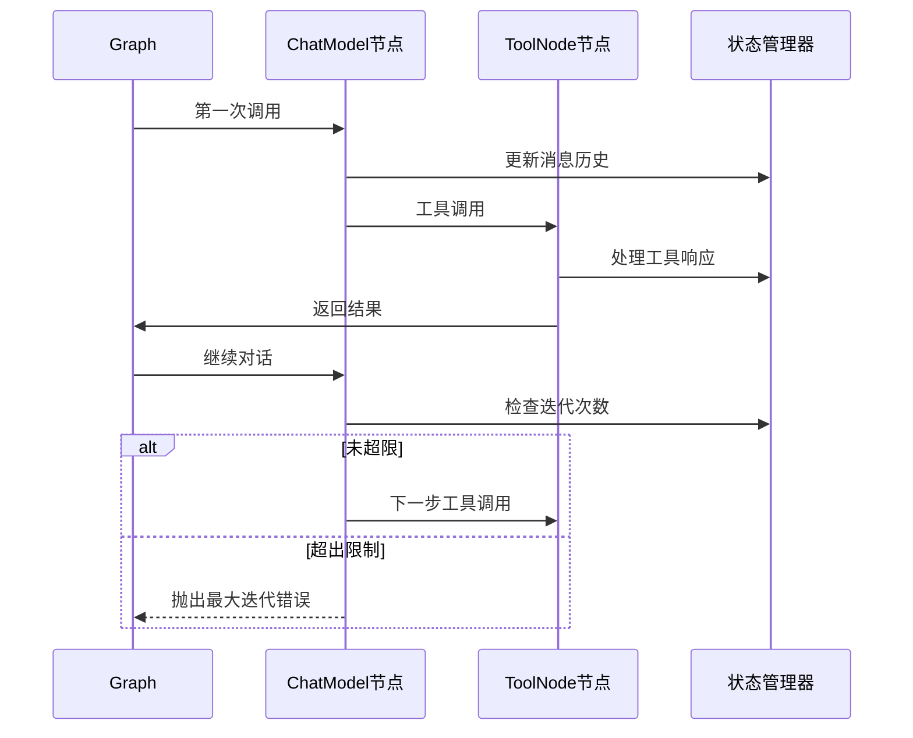

**图表来源**
- [react.go](file://adk/react.go#L158-L190)

### 关键特性实现

ReAct Agent利用Graph的多个特性：

| 特性 | 实现方式 | 作用 |
|------|----------|------|
| 状态共享 | `WithGenLocalState` | 在节点间共享对话历史 |
| 条件分支 | 动态工具调用检测 | 根据输出决定下一步 |
| 流式处理 | 消息流合并 | 实时处理工具响应 |
| 中断处理 | 最大迭代限制 | 防止无限循环 |
| 回调注入 | 状态预处理器 | 自动更新对话状态 |

**章节来源**
- [react.go](file://adk/react.go#L121-L200)
- [graph.go](file://compose/graph.go#L46-L51)

## 性能优化与并发处理

### 并发执行策略

Graph编排模式支持多种并发优化：

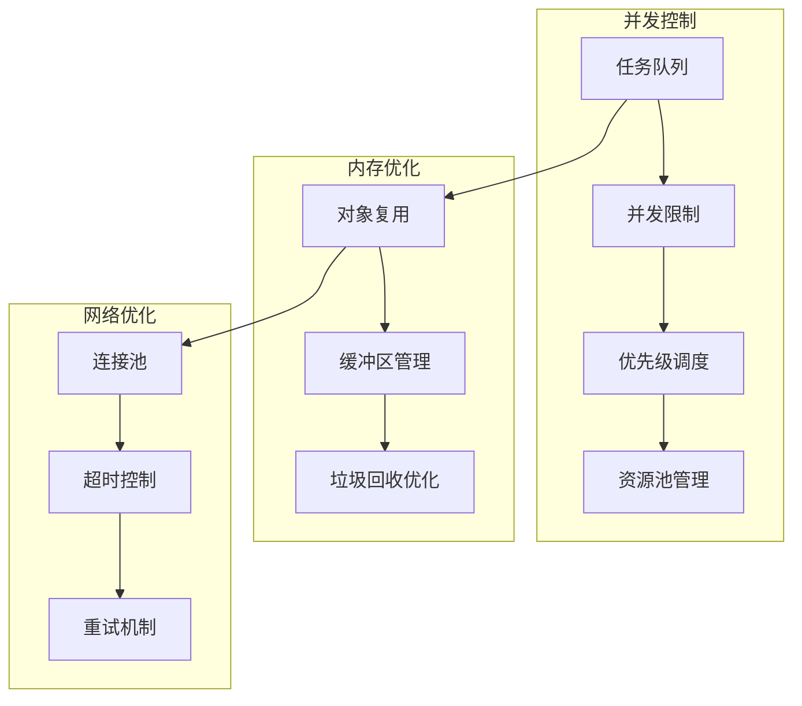

### 状态安全性

Graph通过以下机制确保状态的安全访问：

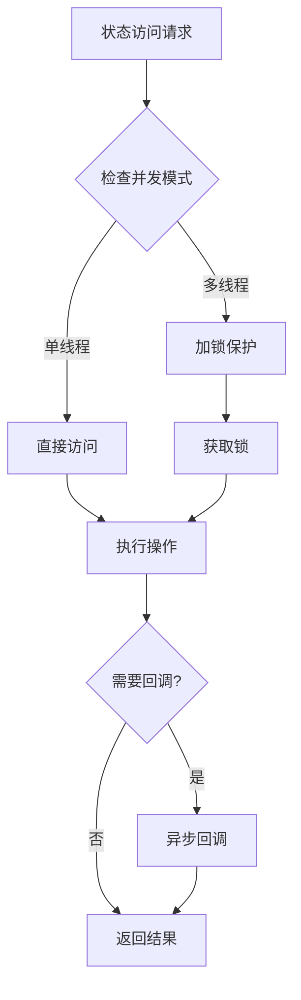

### 性能监控指标

| 指标 | 描述 | 优化目标 |
|------|------|----------|
| 节点吞吐量 | 每秒处理的节点数量 | 提高并发度 |
| 内存使用率 | 图执行过程中的内存占用 | 优化内存管理 |
| 延迟分布 | 节点执行时间统计 | 减少热点节点 |
| 错误率 | 执行失败的比例 | 提高稳定性 |

## 总结

Eino框架的Graph编排模式通过精心设计的架构，为复杂的决策和执行流程提供了强大而灵活的解决方案。其核心优势体现在：

### 技术创新点

1. **双模式支持**：同时支持DAG和Pregel两种执行模式，适应不同场景需求
2. **类型安全**：编译时类型检查确保数据流的正确性
3. **条件分支**：强大的分支系统支持复杂的决策逻辑
4. **状态管理**：内置的状态共享和持久化机制
5. **流式处理**：高效的流式数据处理能力

### 应用价值

Graph编排模式特别适用于：
- **智能代理系统**：如ReAct Agent等复杂交互场景
- **工作流自动化**：需要多步骤协调的业务流程
- **AI应用编排**：多模型协作的复杂AI应用
- **实时数据处理**：需要低延迟响应的流式处理

### 发展前景

随着AI技术的发展，Graph编排模式将在以下方面继续演进：
- 更智能的调度算法
- 更精细的资源管理
- 更完善的监控体系
- 更广泛的生态系统集成

通过深入理解和掌握Graph编排模式，开发者可以构建出更加智能、高效和可靠的AI应用系统。