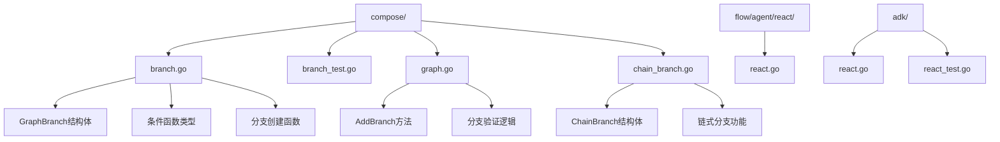
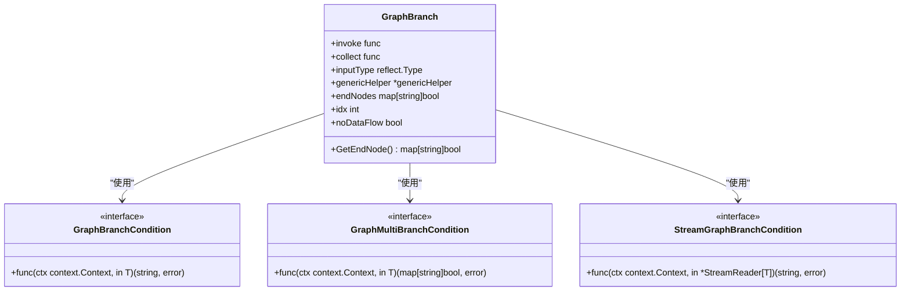
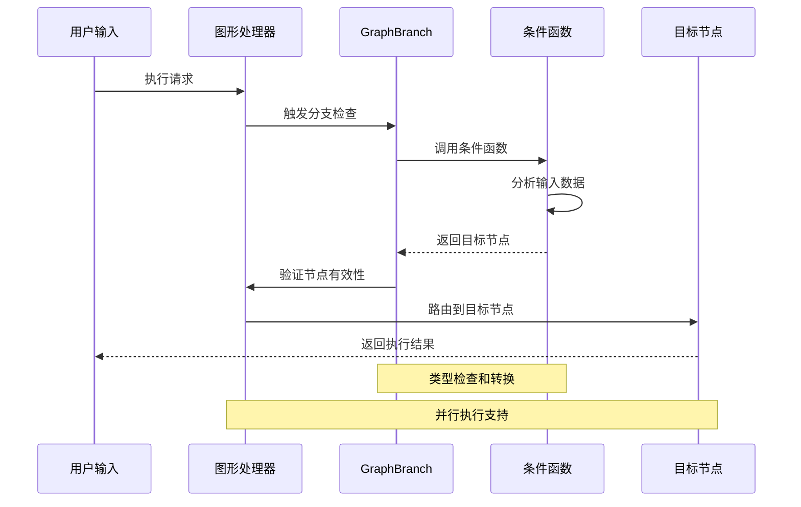
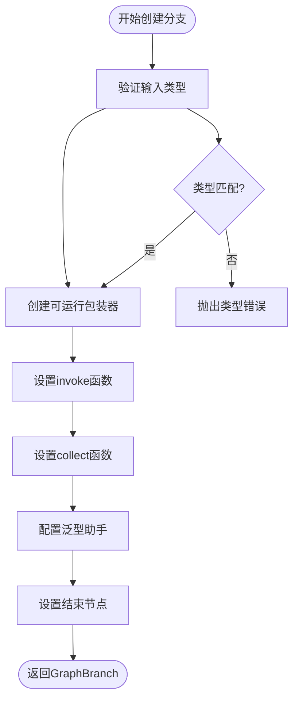
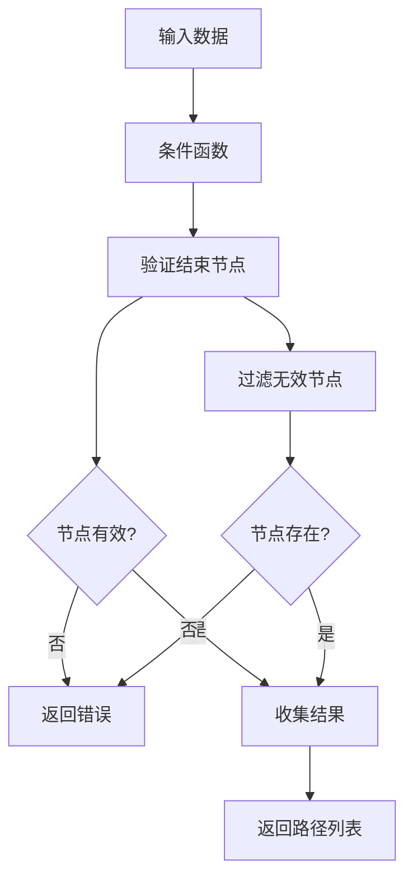
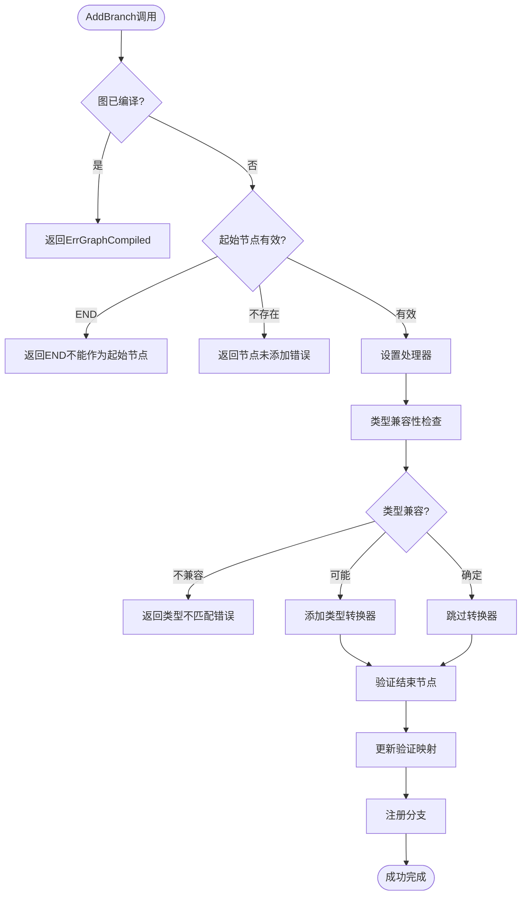
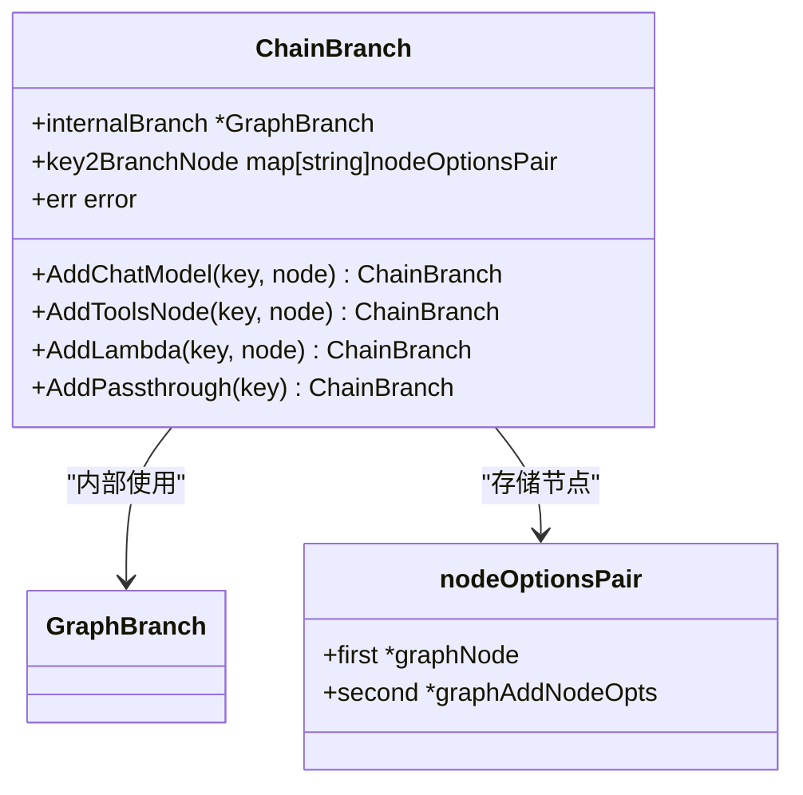
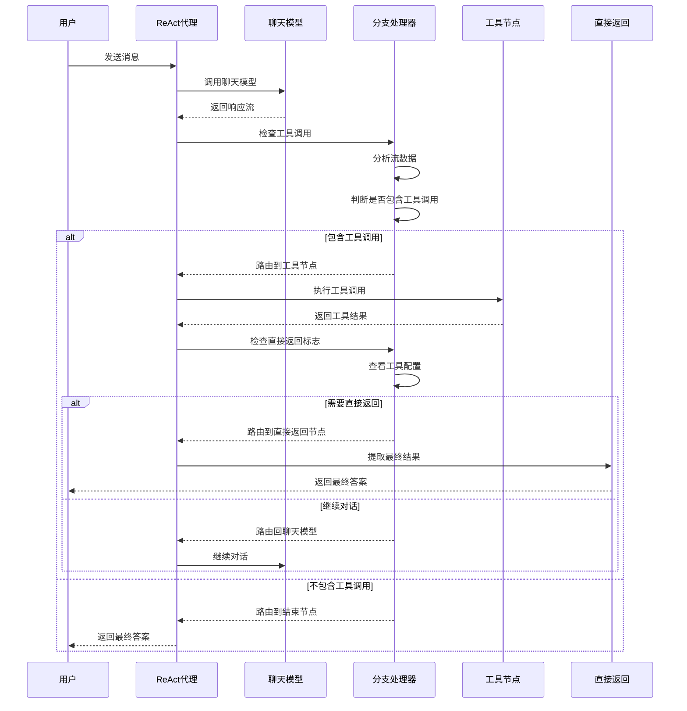
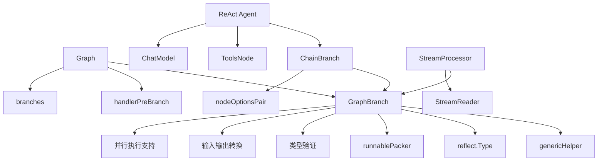

# 分支（Branch）

<cite>
**本文档中引用的文件**
- [compose/branch.go](file://compose/branch.go)
- [compose/branch_test.go](file://compose/branch_test.go)
- [compose/graph.go](file://compose/graph.go)
- [compose/chain_branch.go](file://compose/chain_branch.go)
- [flow/agent/react/react.go](file://flow/agent/react/react.go)
- [adk/react.go](file://adk/react.go)
</cite>

## 目录
1. [简介](#简介)
2. [项目结构](#项目结构)
3. [核心组件](#核心组件)
4. [架构概览](#架构概览)
5. [详细组件分析](#详细组件分析)
6. [依赖关系分析](#依赖关系分析)
7. [性能考虑](#性能考虑)
8. [故障排除指南](#故障排除指南)
9. [结论](#结论)

## 简介

Eino框架中的分支（Branch）功能是一个强大的条件路由机制，允许开发者根据运行时条件动态决定执行路径。`GraphBranch`结构体是这一功能的核心实现，它通过条件函数（condition function）来判断应该执行哪条分支路径，从而实现类似`if-else`或`switch`式的逻辑控制。

分支功能在构建需要动态决策的AI应用中扮演着关键角色，特别是在ReAct Agent等复杂工作流中，能够根据用户输入、工具调用结果或其他运行时数据做出智能路由决策。

## 项目结构

Eino框架的分支功能主要分布在以下模块中：

**图表来源**
- [compose/branch.go](file://compose/branch.go#L1-L173)
- [compose/graph.go](file://compose/graph.go#L416-L520)
- [compose/chain_branch.go](file://compose/chain_branch.go#L1-L296)

**章节来源**
- [compose/branch.go](file://compose/branch.go#L1-L173)
- [compose/graph.go](file://compose/graph.go#L416-L520)

## 核心组件

### GraphBranch结构体

`GraphBranch`是分支功能的核心数据结构，负责封装条件逻辑和目标节点映射：

**图表来源**
- [compose/branch.go](file://compose/branch.go#L40-L50)
- [compose/branch.go](file://compose/branch.go#L28-L38)

### 条件函数类型

框架提供了多种条件函数类型以适应不同的使用场景：

| 类型 | 描述 | 使用场景 |
|------|------|----------|
| `GraphBranchCondition[T]` | 单一分支条件函数 | 基本的if-else逻辑 |
| `GraphMultiBranchCondition[T]` | 多分支条件函数 | switch-case或多路径选择 |
| `StreamGraphBranchCondition[T]` | 流式分支条件函数 | 基于流数据的实时决策 |
| `StreamGraphMultiBranchCondition[T]` | 流式多分支条件函数 | 复杂的流式多路径决策 |

**章节来源**
- [compose/branch.go](file://compose/branch.go#L28-L38)

## 架构概览

分支功能的整体架构展示了从条件定义到执行路径选择的完整流程：

**图表来源**
- [compose/graph.go](file://compose/graph.go#L435-L515)
- [compose/branch.go](file://compose/branch.go#L57-L85)

## 详细组件分析

### GraphBranch的创建和配置

#### 基本分支创建

`NewGraphBranch`函数用于创建基本的单分支条件：

**图表来源**
- [compose/branch.go](file://compose/branch.go#L57-L85)
- [compose/branch.go](file://compose/branch.go#L141-L148)

#### 多分支条件处理

`NewGraphMultiBranch`支持更复杂的多路径决策：

**图表来源**
- [compose/branch.go](file://compose/branch.go#L87-L104)
- [compose/branch.go](file://compose/branch.go#L65-L72)

**章节来源**
- [compose/branch.go](file://compose/branch.go#L87-L173)

### 分支添加到图中的过程

`AddBranch`方法负责将分支逻辑集成到图形处理器中：

**图表来源**
- [compose/graph.go](file://compose/graph.go#L435-L515)

**章节来源**
- [compose/graph.go](file://compose/graph.go#L435-L515)

### ChainBranch扩展功能

`ChainBranch`提供了链式分支功能，允许在一个分支内包含多个子节点：

**图表来源**
- [compose/chain_branch.go](file://compose/chain_branch.go#L35-L42)
- [compose/chain_branch.go](file://compose/chain_branch.go#L33)

**章节来源**
- [compose/chain_branch.go](file://compose/chain_branch.go#L35-L296)

### ReAct Agent中的分支应用

在ReAct Agent中，分支功能被用来实现智能的工具调用决策：

**图表来源**
- [flow/agent/react/react.go](file://flow/agent/react/react.go#L274-L285)
- [flow/agent/react/react.go](file://flow/agent/react/react.go#L333-L348)

**章节来源**
- [flow/agent/react/react.go](file://flow/agent/react/react.go#L274-L354)
- [adk/react.go](file://adk/react.go#L195-L257)

## 依赖关系分析

分支功能的依赖关系展现了其在整个框架中的位置和与其他组件的交互：

**图表来源**
- [compose/branch.go](file://compose/branch.go#L40-L50)
- [compose/graph.go](file://compose/graph.go#L459-L493)
- [compose/chain_branch.go](file://compose/chain_branch.go#L35-L42)

**章节来源**
- [compose/branch.go](file://compose/branch.go#L1-L173)
- [compose/graph.go](file://compose/graph.go#L416-L520)
- [compose/chain_branch.go](file://compose/chain_branch.go#L1-L296)

## 性能考虑

分支功能在设计时充分考虑了性能优化：

### 类型安全和缓存

- **泛型类型缓存**：使用`generic.TypeOf[T]()`避免重复反射操作
- **类型转换优化**：预编译类型转换器减少运行时开销
- **输入输出类型检查**：在编译时验证类型兼容性

### 并行执行支持

- **分支索引**：每个分支都有唯一索引支持并行处理
- **无数据流模式**：特殊标记支持高效的并行分支处理
- **流式处理优化**：针对流数据的专门优化路径

### 内存管理

- **零分配策略**：尽可能重用对象避免垃圾回收压力
- **延迟初始化**：按需创建分支处理器避免不必要的内存占用
- **资源清理**：自动清理不再使用的分支资源

## 故障排除指南

### 常见问题和解决方案

#### 类型不匹配错误

**问题描述**：分支条件函数的输入类型与起始节点的输出类型不兼容

**解决方案**：
1. 检查起始节点的输出类型定义
2. 确保条件函数的泛型参数与输出类型匹配
3. 使用类型断言或转换函数进行类型适配

#### 分支节点未添加错误

**问题描述**：尝试添加的分支节点尚未在图中定义

**解决方案**：
1. 先使用`AddLambdaNode`等方法添加目标节点
2. 确保节点名称正确且唯一
3. 按正确的顺序添加节点和分支

#### 条件函数返回无效节点

**问题描述**：条件函数返回的节点不在预定义的结束节点集合中

**解决方案**：
1. 检查`endNodes`映射的完整性
2. 确保所有可能的返回路径都已正确注册
3. 添加适当的默认处理逻辑

**章节来源**
- [compose/graph.go](file://compose/graph.go#L470-L477)
- [compose/branch.go](file://compose/branch.go#L89-L97)

## 结论

Eino框架的分支功能提供了一个强大而灵活的条件路由机制，通过`GraphBranch`结构体和相关的条件函数类型，开发者可以轻松实现复杂的动态决策逻辑。该功能在ReAct Agent等AI应用中发挥了关键作用，使得系统能够根据运行时数据做出智能的执行路径选择。

分支功能的主要优势包括：

1. **类型安全**：编译时类型检查确保运行时安全性
2. **灵活性**：支持单分支、多分支和流式分支等多种模式
3. **性能优化**：内置缓存和优化策略提升执行效率
4. **易于使用**：简洁的API设计降低学习成本
5. **扩展性强**：支持链式分支和复杂的工作流组合

通过合理使用分支功能，开发者可以构建出更加智能和响应式的AI应用，为用户提供更好的交互体验。