# 状态管理（State）

<cite>
**本文档引用的文件**
- [compose/state.go](file://compose/state.go)
- [compose/graph.go](file://compose/graph.go)
- [compose/generic_graph.go](file://compose/generic_graph.go)
- [compose/graph_add_node_options.go](file://compose/graph_add_node_options.go)
- [compose/state_test.go](file://compose/state_test.go)
- [adk/react.go](file://adk/react.go)
- [flow/agent/react/react.go](file://flow/agent/react/react.go)
</cite>

## 目录
1. [简介](#简介)
2. [核心概念](#核心概念)
3. [全局状态启用机制](#全局状态启用机制)
4. [状态生成器与类型系统](#状态生成器与类型系统)
5. [节点状态需求标记](#节点状态需求标记)
6. [预处理器与后处理器](#预处理器与后处理器)
7. [并发安全的状态访问](#并发安全的状态访问)
8. [实际应用案例](#实际应用案例)
9. [架构设计分析](#架构设计分析)
10. [最佳实践与性能考虑](#最佳实践与性能考虑)

## 简介

Eino框架的状态管理系统是一个强大而灵活的机制，允许在图的执行过程中维护和共享状态信息。该系统通过`NewGraphOption`启用全局状态，利用`stateGenerator`函数为每次执行创建独立的状态实例，并通过节点选项中的`needState`标志确保类型安全的状态访问。

状态管理的核心价值在于支持有状态的工作流程，如多轮对话中的用户上下文维护、ReAct Agent中的思考步骤跟踪等复杂应用场景。

## 核心概念

### 状态接口定义

Eino框架定义了完整的状态管理接口体系：

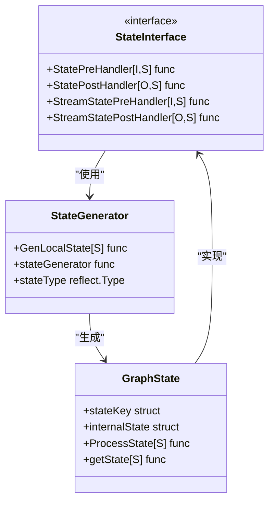
```mermaid
classDiagram
class StateInterface {
<<interface>>
+StatePreHandler[I,S] func
+StatePostHandler[O,S] func
+StreamStatePreHandler[I,S] func
+StreamStatePostHandler[O,S] func
}
class StateGenerator {
+GenLocalState[S] func
+stateGenerator func
+stateType reflect.Type
}
class GraphState {
+stateKey struct
+internalState struct
+ProcessState[S] func
+getState[S] func
}
StateInterface --> StateGenerator : "使用"
StateGenerator --> GraphState : "生成"
GraphState --> StateInterface : "实现"
```

**图表来源**
- [compose/state.go](file://compose/state.go#L29-L51)
- [compose/generic_graph.go](file://compose/generic_graph.go#L26-L29)

### 内部状态结构

框架内部使用`internalState`结构来封装状态数据和同步控制：

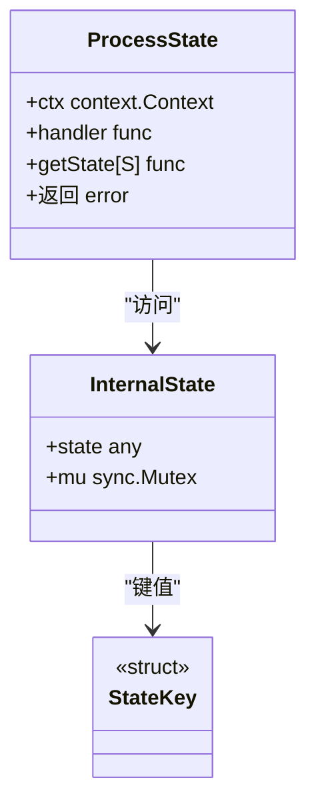
```mermaid
classDiagram
class InternalState {
+state any
+mu sync.Mutex
}
class StateKey {
<<struct>>
}
class ProcessState {
+ctx context.Context
+handler func
+getState[S] func
+返回 error
}
InternalState --> StateKey : "键值"
ProcessState --> InternalState : "访问"
```

**图表来源**
- [compose/state.go](file://compose/state.go#L34-L37)
- [compose/state.go](file://compose/state.go#L133-L140)

**章节来源**
- [compose/state.go](file://compose/state.go#L29-L162)

## 全局状态启用机制

### NewGraphOption配置

通过`NewGraphOption`可以启用全局状态功能：

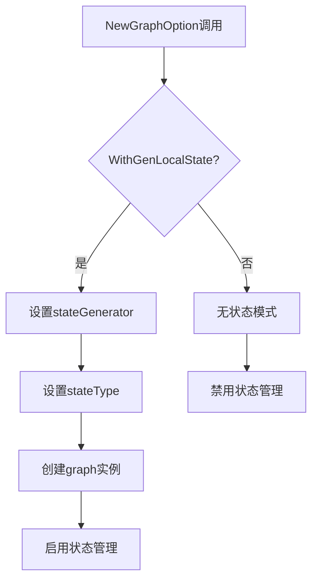
```mermaid
flowchart TD
A[NewGraphOption调用] --> B{WithGenLocalState?}
B --> |是| C[设置stateGenerator]
B --> |否| D[无状态模式]
C --> E[设置stateType]
E --> F[创建graph实例]
F --> G[启用状态管理]
D --> H[禁用状态管理]
```

**图表来源**
- [compose/generic_graph.go](file://compose/generic_graph.go#L33-L40)
- [compose/generic_graph.go](file://compose/generic_graph.go#L69-L84)

### 状态生成器函数

状态生成器负责为每次执行创建新的状态实例：

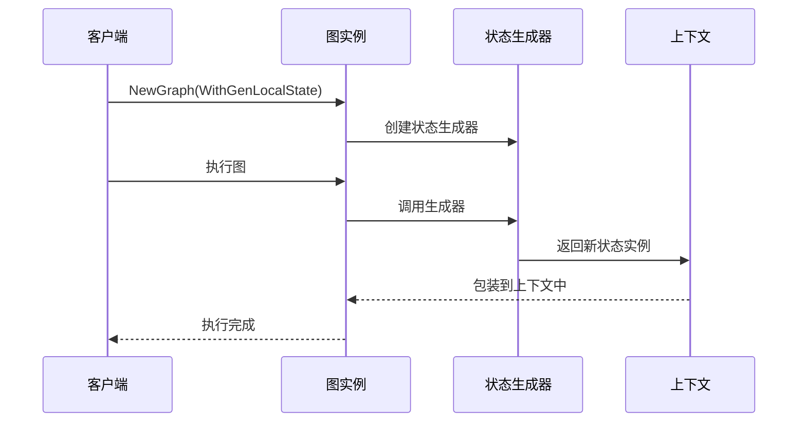
```mermaid
sequenceDiagram
participant Client as 客户端
participant Graph as 图实例
participant Generator as 状态生成器
participant Context as 上下文
Client->>Graph : NewGraph(WithGenLocalState)
Graph->>Generator : 创建状态生成器
Client->>Graph : 执行图
Graph->>Generator : 调用生成器
Generator->>Context : 返回新状态实例
Context-->>Graph : 包装到上下文中
Graph-->>Client : 执行完成
```

**图表来源**
- [compose/generic_graph.go](file://compose/generic_graph.go#L44-L67)
- [compose/graph.go](file://compose/graph.go#L100-L114)

**章节来源**
- [compose/generic_graph.go](file://compose/generic_graph.go#L33-L92)

## 状态生成器与类型系统

### 类型安全的状态访问

Eino框架通过泛型和反射实现了类型安全的状态访问机制：

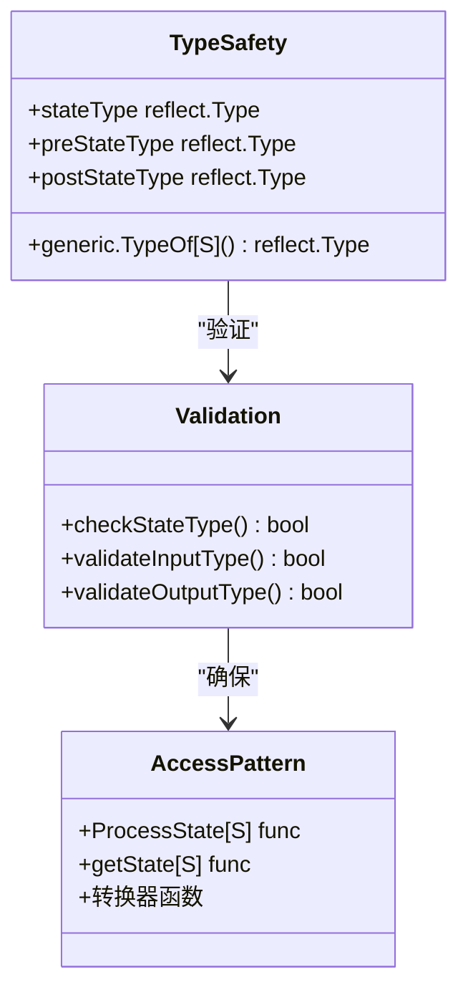
```mermaid
classDiagram
class TypeSafety {
+generic.TypeOf[S]() reflect.Type
+stateType reflect.Type
+preStateType reflect.Type
+postStateType reflect.Type
}
class Validation {
+checkStateType() bool
+validateInputType() bool
+validateOutputType() bool
}
class AccessPattern {
+ProcessState[S] func
+getState[S] func
+转换器函数
}
TypeSafety --> Validation : "验证"
Validation --> AccessPattern : "确保"
```

**图表来源**
- [compose/graph.go](file://compose/graph.go#L202-L224)
- [compose/state.go](file://compose/state.go#L143-L161)

### 状态类型检查机制

框架在编译时和运行时都进行严格的状态类型检查：

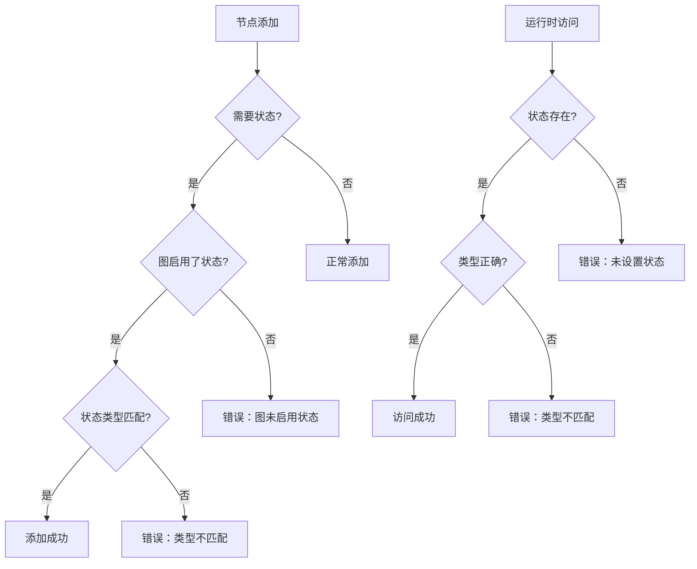
```mermaid
flowchart TD
A[节点添加] --> B{需要状态?}
B --> |是| C{图启用了状态?}
B --> |否| D[正常添加]
C --> |是| E{状态类型匹配?}
C --> |否| F[错误：图未启用状态]
E --> |是| G[添加成功]
E --> |否| H[错误：类型不匹配]
I[运行时访问] --> J{状态存在?}
J --> |是| K{类型正确?}
J --> |否| L[错误：未设置状态]
K --> |是| M[访问成功]
K --> |否| N[错误：类型不匹配]
```

**图表来源**
- [compose/graph.go](file://compose/graph.go#L186-L212)
- [compose/state.go](file://compose/state.go#L143-L161)

**章节来源**
- [compose/graph.go](file://compose/graph.go#L174-L224)
- [compose/state.go](file://compose/state.go#L143-L161)

## 节点状态需求标记

### needState标志系统

每个节点都有`needState`标志来指示是否需要状态支持：

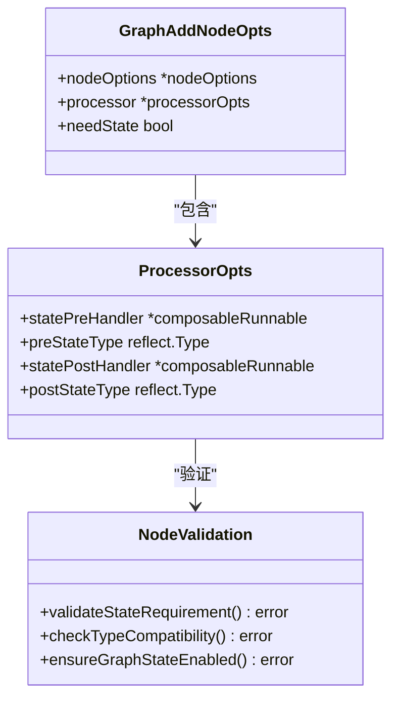
```mermaid
classDiagram
class GraphAddNodeOpts {
+nodeOptions *nodeOptions
+processor *processorOpts
+needState bool
}
class ProcessorOpts {
+statePreHandler *composableRunnable
+preStateType reflect.Type
+statePostHandler *composableRunnable
+postStateType reflect.Type
}
class NodeValidation {
+validateStateRequirement() error
+checkTypeCompatibility() error
+ensureGraphStateEnabled() error
}
GraphAddNodeOpts --> ProcessorOpts : "包含"
ProcessorOpts --> NodeValidation : "验证"
```

**图表来源**
- [compose/graph_add_node_options.go](file://compose/graph_add_node_options.go#L25-L30)
- [compose/graph_add_node_options.go](file://compose/graph_add_node_options.go#L144-L149)

### 处理器类型验证

框架对预处理器和后处理器的类型进行严格验证：

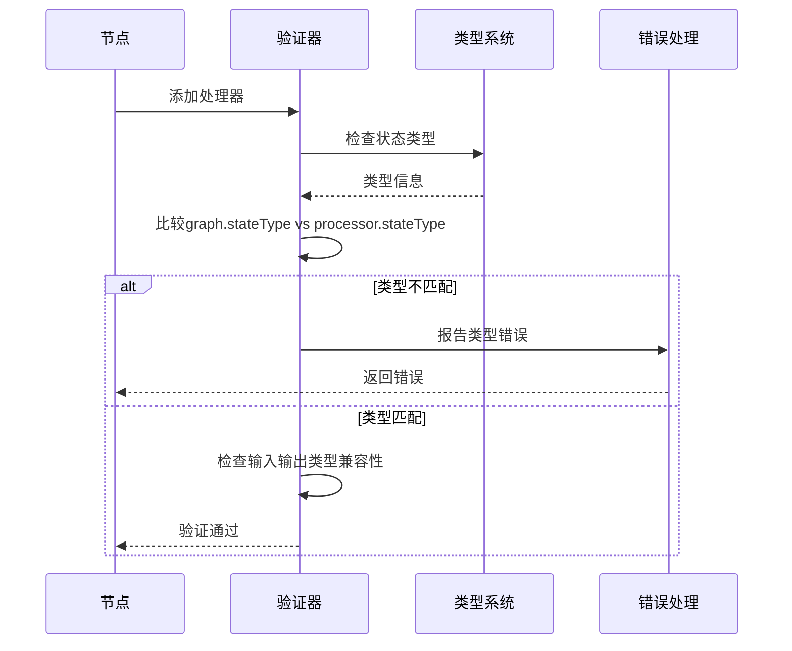
```mermaid
sequenceDiagram
participant Node as 节点
participant Validator as 验证器
participant TypeSystem as 类型系统
participant ErrorHandler as 错误处理
Node->>Validator : 添加处理器
Validator->>TypeSystem : 检查状态类型
TypeSystem-->>Validator : 类型信息
Validator->>Validator : 比较graph.stateType vs processor.stateType
alt 类型不匹配
Validator->>ErrorHandler : 报告类型错误
ErrorHandler-->>Node : 返回错误
else 类型匹配
Validator->>Validator : 检查输入输出类型兼容性
Validator-->>Node : 验证通过
end
```

**图表来源**
- [compose/graph.go](file://compose/graph.go#L202-L224)
- [compose/graph_add_node_options.go](file://compose/graph_add_node_options.go#L96-L141)

**章节来源**
- [compose/graph_add_node_options.go](file://compose/graph_add_node_options.go#L25-L169)
- [compose/graph.go](file://compose/graph.go#L174-L224)

## 预处理器与后处理器

### 状态处理器类型

Eino框架提供了多种状态处理器类型以适应不同的使用场景：

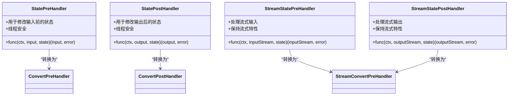
```mermaid
classDiagram
class StatePreHandler {
+func(ctx, input, state) (input, error)
+用于修改输入前的状态
+线程安全
}
class StatePostHandler {
+func(ctx, output, state) (output, error)
+用于修改输出后的状态
+线程安全
}
class StreamStatePreHandler {
+func(ctx, inputStream, state) (inputStream, error)
+处理流式输入
+保持流式特性
}
class StreamStatePostHandler {
+func(ctx, outputStream, state) (outputStream, error)
+处理流式输出
+保持流式特性
}
StatePreHandler --> ConvertPreHandler : "转换为"
StatePostHandler --> ConvertPostHandler : "转换为"
StreamStatePreHandler --> StreamConvertPreHandler : "转换为"
StreamStatePostHandler --> StreamConvertPreHandler : "转换为"
```

**图表来源**
- [compose/state.go](file://compose/state.go#L39-L51)
- [compose/state.go](file://compose/state.go#L53-L111)

### 处理器转换机制

框架内部将各种处理器转换为统一的可组合运行器：

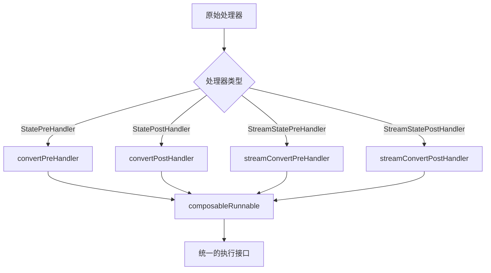
```mermaid
flowchart TD
A[原始处理器] --> B{处理器类型}
B --> |StatePreHandler| C[convertPreHandler]
B --> |StatePostHandler| D[convertPostHandler]
B --> |StreamStatePreHandler| E[streamConvertPreHandler]
B --> |StreamStatePostHandler| F[streamConvertPostHandler]
C --> G[composableRunnable]
D --> G
E --> G
F --> G
G --> H[统一的执行接口]
```

**图表来源**
- [compose/state.go](file://compose/state.go#L53-L111)

### 状态访问模式

状态处理器遵循特定的访问模式以确保一致性：

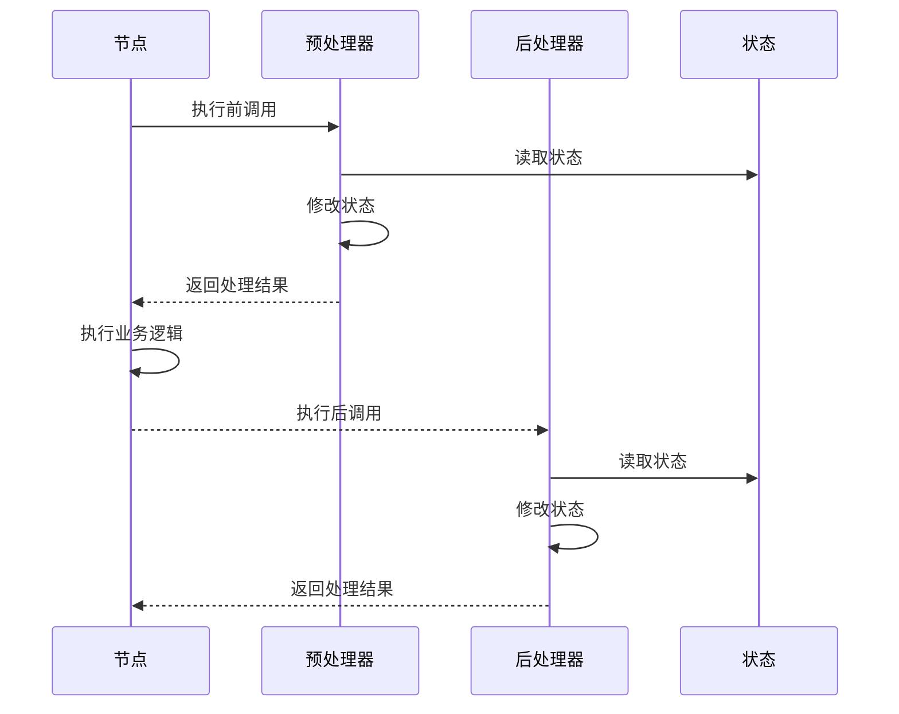
```mermaid
sequenceDiagram
participant Node as 节点
participant PreHandler as 预处理器
participant PostHandler as 后处理器
participant State as 状态
Node->>PreHandler : 执行前调用
PreHandler->>State : 读取状态
PreHandler->>PreHandler : 修改状态
PreHandler-->>Node : 返回处理结果
Node->>Node : 执行业务逻辑
Node-->>PostHandler : 执行后调用
PostHandler->>State : 读取状态
PostHandler->>PostHandler : 修改状态
PostHandler-->>Node : 返回处理结果
```

**图表来源**
- [compose/state.go](file://compose/state.go#L53-L111)

**章节来源**
- [compose/state.go](file://compose/state.go#L39-L111)
- [compose/graph_add_node_options.go](file://compose/graph_add_node_options.go#L96-L141)

## 并发安全的状态访问

### 互斥锁保护机制

Eino框架通过内置的互斥锁确保状态访问的并发安全性：

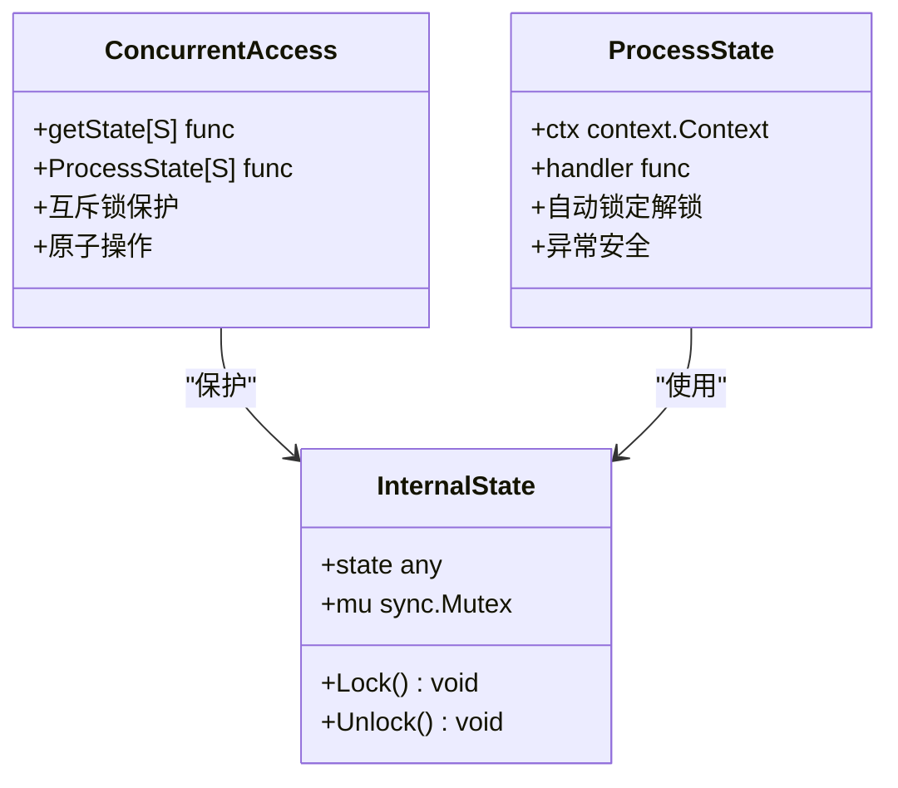
```mermaid
classDiagram
class ConcurrentAccess {
+getState[S] func
+ProcessState[S] func
+互斥锁保护
+原子操作
}
class InternalState {
+state any
+mu sync.Mutex
+Lock() void
+Unlock() void
}
class ProcessState {
+ctx context.Context
+handler func
+自动锁定解锁
+异常安全
}
ConcurrentAccess --> InternalState : "保护"
ProcessState --> InternalState : "使用"
```

**图表来源**
- [compose/state.go](file://compose/state.go#L34-L37)
- [compose/state.go](file://compose/state.go#L133-L140)

### 线程安全保证

框架提供了多种线程安全的状态访问方式：

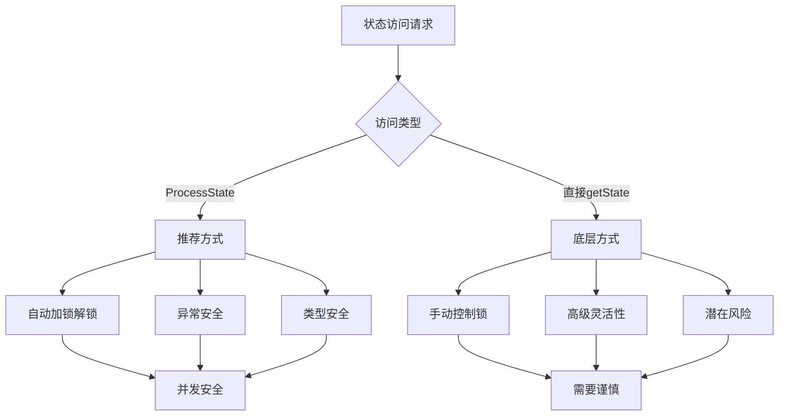
```mermaid
flowchart TD
A[状态访问请求] --> B{访问类型}
B --> |ProcessState| C[推荐方式]
B --> |直接getState| D[底层方式]
C --> E[自动加锁解锁]
C --> F[异常安全]
C --> G[类型安全]
D --> H[手动控制锁]
D --> I[高级灵活性]
D --> J[潜在风险]
E --> K[并发安全]
F --> K
G --> K
H --> L[需要谨慎]
I --> L
J --> L
```

**图表来源**
- [compose/state.go](file://compose/state.go#L113-L140)

### 错误处理与恢复

框架提供了完善的错误处理机制：

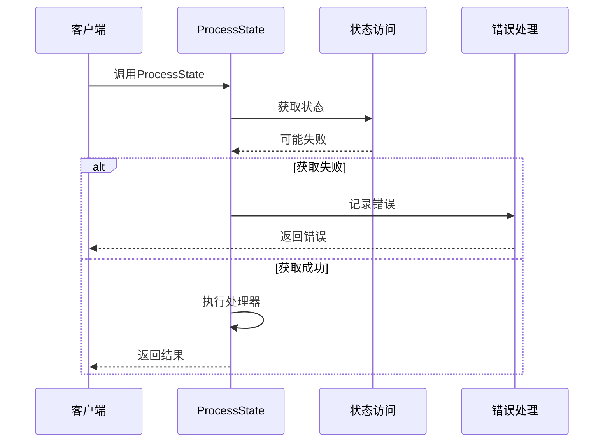
```mermaid
sequenceDiagram
participant Client as 客户端
participant ProcessState as ProcessState
participant StateAccess as 状态访问
participant ErrorHandler as 错误处理
Client->>ProcessState : 调用ProcessState
ProcessState->>StateAccess : 获取状态
StateAccess-->>ProcessState : 可能失败
alt 获取失败
ProcessState->>ErrorHandler : 记录错误
ErrorHandler-->>Client : 返回错误
else 获取成功
ProcessState->>ProcessState : 执行处理器
ProcessState-->>Client : 返回结果
end
```

**图表来源**
- [compose/state.go](file://compose/state.go#L133-L140)

**章节来源**
- [compose/state.go](file://compose/state.go#L113-L161)

## 实际应用案例

### ReAct Agent中的思考步骤跟踪

ReAct Agent是状态管理的一个典型应用场景，展示了如何在多轮对话中维护思考过程：

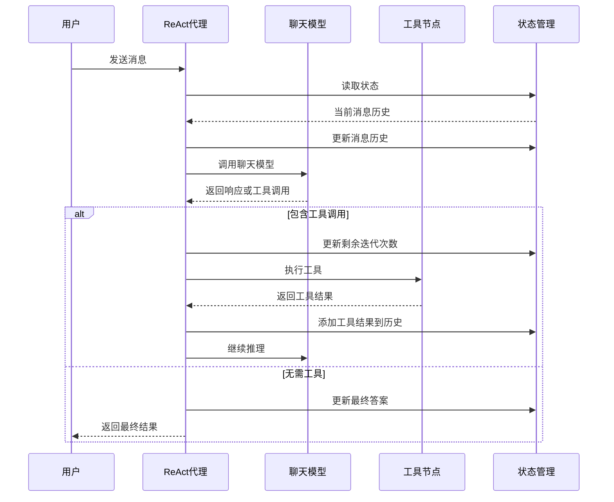
```mermaid
sequenceDiagram
participant User as 用户
participant Agent as ReAct代理
participant Model as 聊天模型
participant Tools as 工具节点
participant State as 状态管理
User->>Agent : 发送消息
Agent->>State : 读取状态
State-->>Agent : 当前消息历史
Agent->>State : 更新消息历史
Agent->>Model : 调用聊天模型
Model-->>Agent : 返回响应或工具调用
alt 包含工具调用
Agent->>State : 更新剩余迭代次数
Agent->>Tools : 执行工具
Tools-->>Agent : 返回工具结果
Agent->>State : 添加工具结果到历史
Agent->>Model : 继续推理
else 无需工具
Agent->>State : 更新最终答案
Agent-->>User : 返回最终结果
end
```

**图表来源**
- [adk/react.go](file://adk/react.go#L158-L260)
- [flow/agent/react/react.go](file://flow/agent/react/react.go#L238-L239)

### 多轮对话中的用户上下文维护

在多轮对话场景中，状态管理用于维护用户的上下文信息：

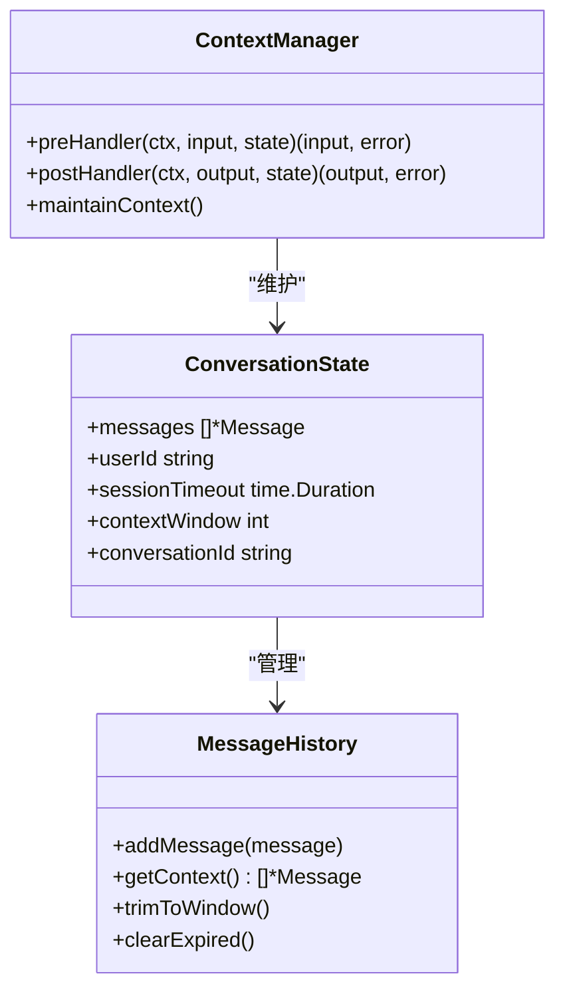
```mermaid
classDiagram
class ConversationState {
+messages []*Message
+userId string
+sessionTimeout time.Duration
+contextWindow int
+conversationId string
}
class MessageHistory {
+addMessage(message)
+getContext() []*Message
+trimToWindow()
+clearExpired()
}
class ContextManager {
+preHandler(ctx, input, state) (input, error)
+postHandler(ctx, output, state) (output, error)
+maintainContext()
}
ConversationState --> MessageHistory : "管理"
ContextManager --> ConversationState : "维护"
```

**图表来源**
- [adk/react.go](file://adk/react.go#L158-L166)
- [flow/agent/react/react.go](file://flow/agent/react/react.go#L238-L239)

### 状态管理在复杂工作流中的应用

状态管理支持复杂的有状态工作流程：

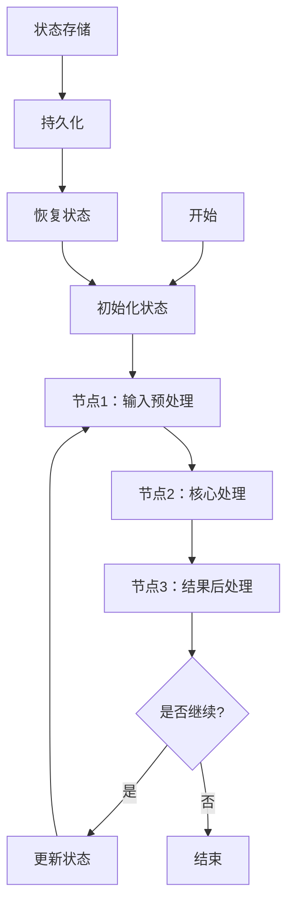
```mermaid
flowchart TD
A[开始] --> B[初始化状态]
B --> C[节点1：输入预处理]
C --> D[节点2：核心处理]
D --> E[节点3：结果后处理]
E --> F{是否继续?}
F --> |是| G[更新状态]
F --> |否| H[结束]
G --> C
I[状态存储] --> J[持久化]
J --> K[恢复状态]
K --> B
```

**章节来源**
- [adk/react.go](file://adk/react.go#L107-L260)
- [flow/agent/react/react.go](file://flow/agent/react/react.go#L165-L239)
- [compose/state_test.go](file://compose/state_test.go#L33-L168)

## 架构设计分析

### 整体架构概览

Eino框架的状态管理系统采用分层架构设计：

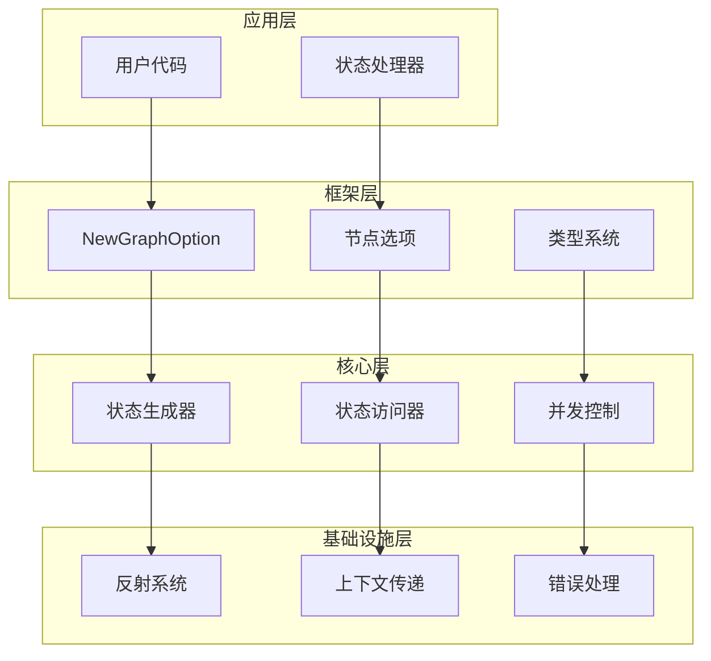
```mermaid
graph TB
subgraph "应用层"
A1[用户代码]
A2[状态处理器]
end
subgraph "框架层"
B1[NewGraphOption]
B2[节点选项]
B3[类型系统]
end
subgraph "核心层"
C1[状态生成器]
C2[状态访问器]
C3[并发控制]
end
subgraph "基础设施层"
D1[反射系统]
D2[上下文传递]
D3[错误处理]
end
A1 --> B1
A2 --> B2
B1 --> C1
B2 --> C2
B3 --> C3
C1 --> D1
C2 --> D2
C3 --> D3
```

**图表来源**
- [compose/generic_graph.go](file://compose/generic_graph.go#L26-L40)
- [compose/state.go](file://compose/state.go#L29-L51)

### 数据流设计

状态管理的数据流遵循严格的单向传播原则：

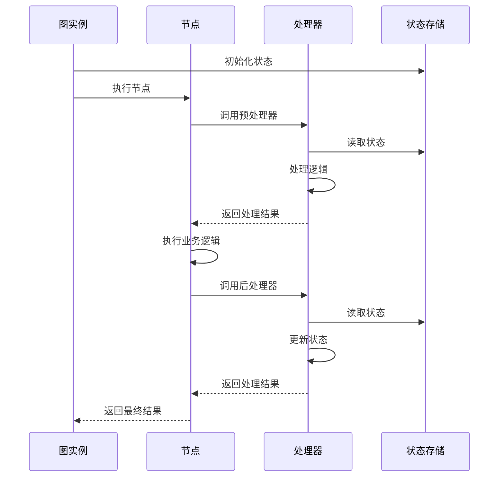
```mermaid
sequenceDiagram
participant Graph as 图实例
participant Node as 节点
participant Handler as 处理器
participant State as 状态存储
Graph->>State : 初始化状态
Graph->>Node : 执行节点
Node->>Handler : 调用预处理器
Handler->>State : 读取状态
Handler->>Handler : 处理逻辑
Handler-->>Node : 返回处理结果
Node->>Node : 执行业务逻辑
Node->>Handler : 调用后处理器
Handler->>State : 读取状态
Handler->>Handler : 更新状态
Handler-->>Node : 返回处理结果
Node-->>Graph : 返回最终结果
```

**图表来源**
- [compose/state.go](file://compose/state.go#L53-L111)
- [compose/graph.go](file://compose/graph.go#L174-L224)

### 类型系统集成

框架的类型系统与状态管理深度集成：

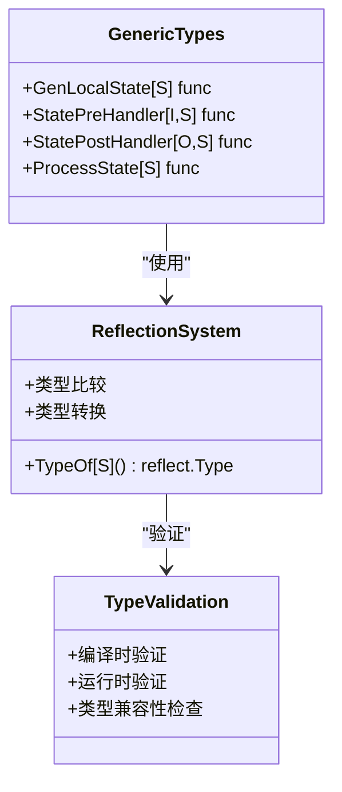
```mermaid
classDiagram
class GenericTypes {
+GenLocalState[S] func
+StatePreHandler[I,S] func
+StatePostHandler[O,S] func
+ProcessState[S] func
}
class ReflectionSystem {
+TypeOf[S]() reflect.Type
+类型比较
+类型转换
}
class TypeValidation {
+编译时验证
+运行时验证
+类型兼容性检查
}
GenericTypes --> ReflectionSystem : "使用"
ReflectionSystem --> TypeValidation : "验证"
```

**图表来源**
- [compose/state.go](file://compose/state.go#L29-L51)
- [compose/generic_graph.go](file://compose/generic_graph.go#L26-L29)

**章节来源**
- [compose/generic_graph.go](file://compose/generic_graph.go#L26-L92)
- [compose/state.go](file://compose/state.go#L29-L162)

## 最佳实践与性能考虑

### 性能优化策略

状态管理系统的性能优化主要体现在以下几个方面：

1. **延迟初始化**：状态只在需要时才创建
2. **内存池化**：重用状态对象减少GC压力
3. **批量操作**：合并多个状态更新操作
4. **缓存机制**：缓存频繁访问的状态数据

### 内存管理

框架采用了多种内存管理策略来优化性能：

```mermaid
flowchart TD
A[状态创建] --> B{复用现有状态?}
B --> |是| C[从池中获取]
B --> |否| D[创建新状态]
C --> E[初始化状态]
D --> E
E --> F[使用状态]
F --> G[清理状态]
G --> H{状态池已满?}
H --> |是| I[丢弃状态]
H --> |否| J[放回池中]
```

### 错误处理最佳实践

在使用状态管理时应遵循以下最佳实践：

1. **类型安全**：始终使用正确的状态类型
2. **错误检查**：检查ProcessState的返回错误
3. **资源释放**：确保在异常情况下正确释放资源
4. **并发控制**：避免在处理器中进行长时间阻塞操作

### 调试与监控

框架提供了丰富的调试和监控功能：

```mermaid
classDiagram
class DebugSupport {
+状态类型检查
+访问路径追踪
+并发冲突检测
+性能指标收集
}
class Monitoring {
+状态访问统计
+错误率监控
+性能瓶颈识别
+资源使用分析
}
class Diagnostics {
+状态快照
+执行轨迹记录
+问题诊断工具
+修复建议
}
DebugSupport --> Monitoring : "支持"
Monitoring --> Diagnostics : "驱动"
```

### 扩展性设计

状态管理系统具有良好的扩展性：

1. **自定义处理器**：支持用户定义状态处理器
2. **插件架构**：可插入不同类型的状态存储
3. **协议抽象**：支持多种状态序列化协议
4. **版本兼容**：向后兼容的状态格式

**章节来源**
- [compose/state.go](file://compose/state.go#L113-L161)
- [compose/state_test.go](file://compose/state_test.go#L171-L200)

## 结论

Eino框架的状态管理系统是一个设计精良、功能完备的状态管理解决方案。它通过类型安全的设计、并发安全保障、灵活的处理器机制和强大的扩展能力，为构建复杂的有状态工作流程提供了坚实的基础。

该系统的核心优势包括：
- **类型安全**：通过泛型和反射确保类型安全的状态访问
- **并发安全**：内置互斥锁保护机制
- **灵活配置**：支持多种状态处理器类型
- **性能优化**：采用多种优化策略提升性能
- **易于使用**：提供简洁的API和丰富的示例

对于开发者而言，理解和掌握这个状态管理系统将有助于构建更加复杂和智能的应用程序，特别是在需要维护上下文信息的多轮对话、ReAct Agent等场景中。