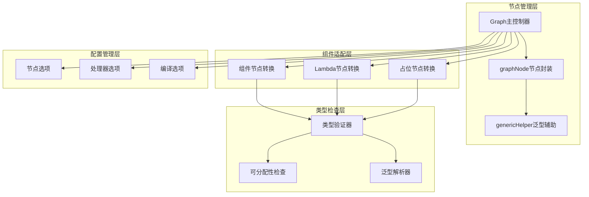
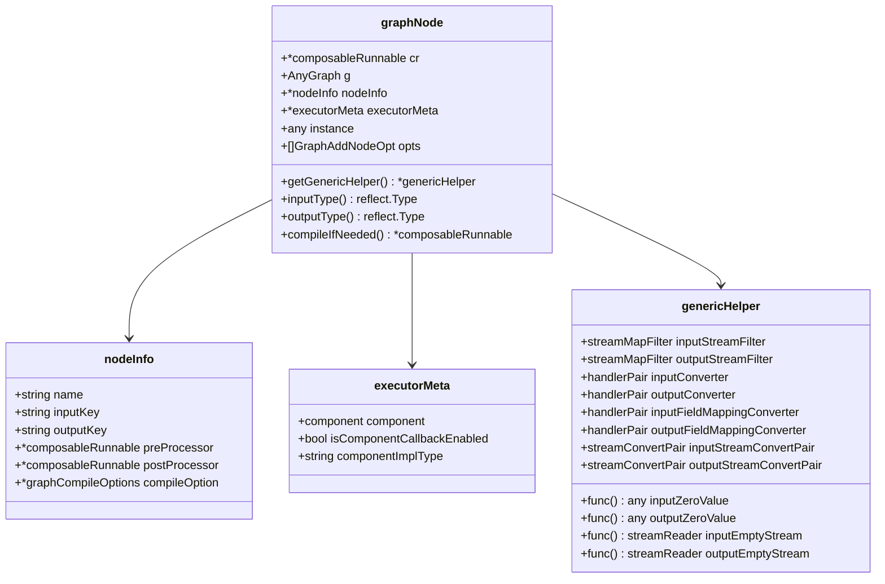
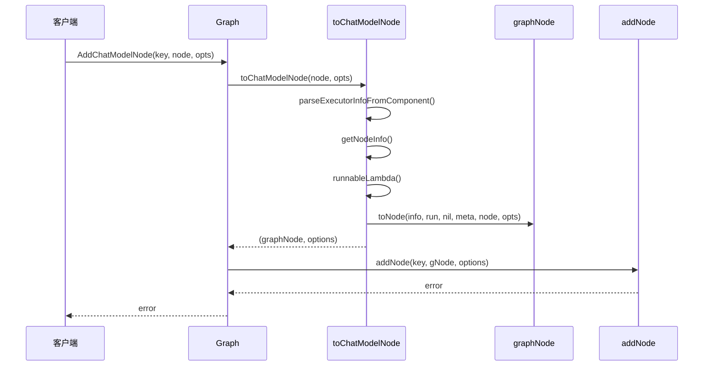
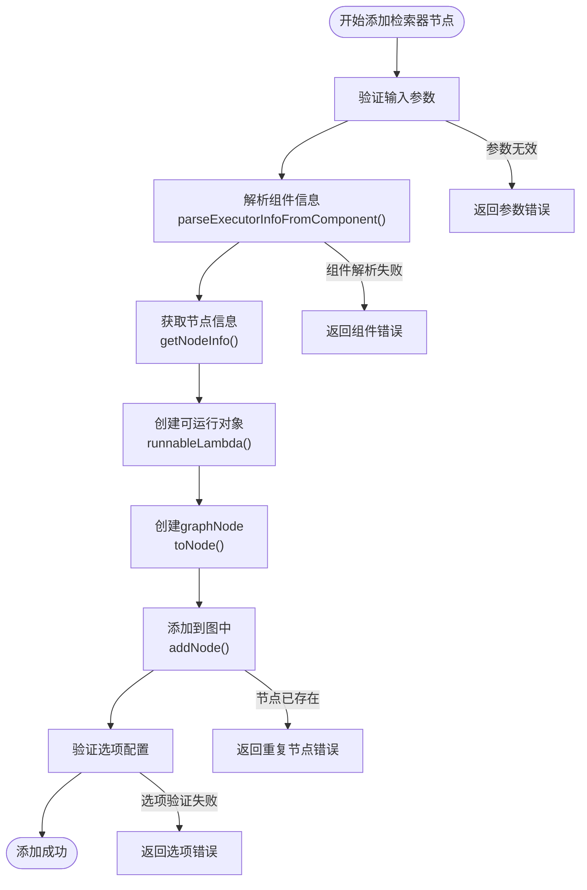
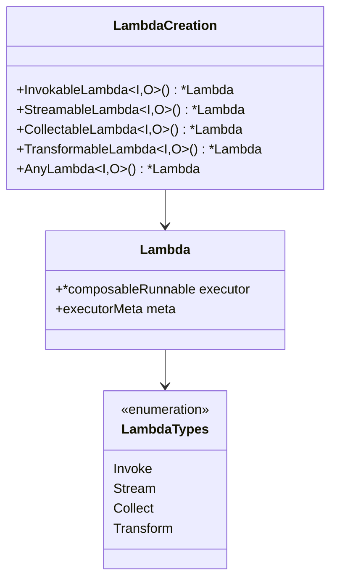
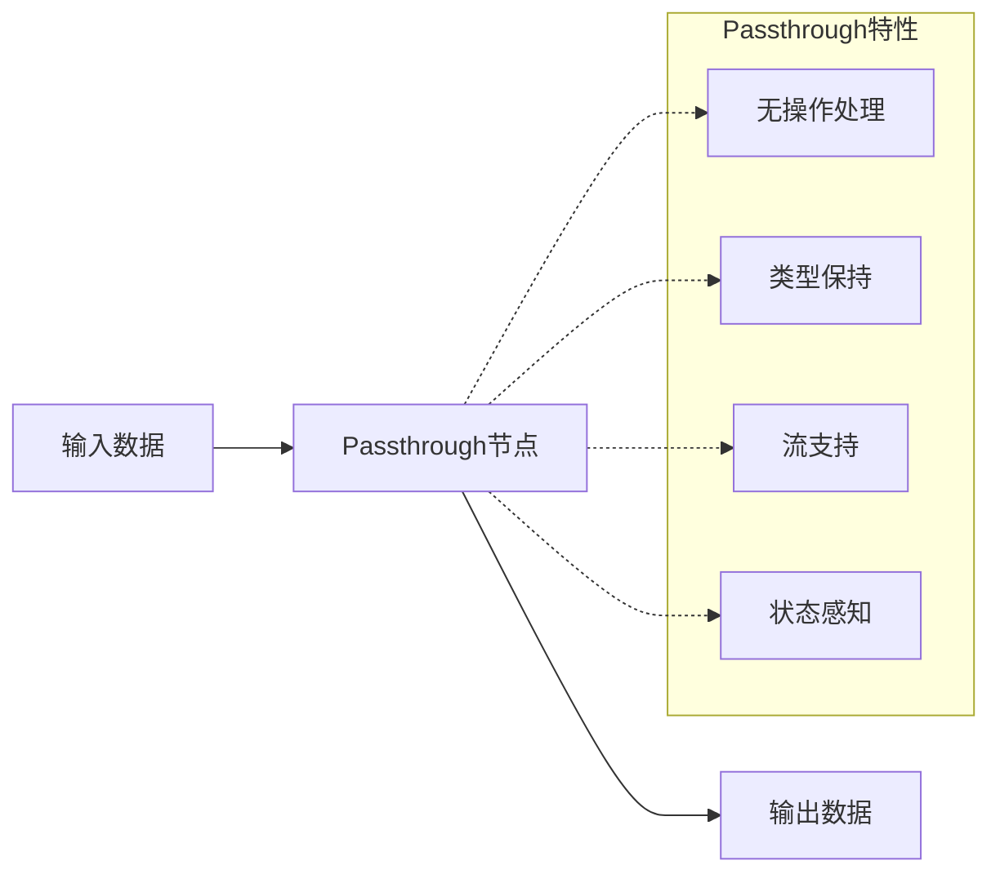
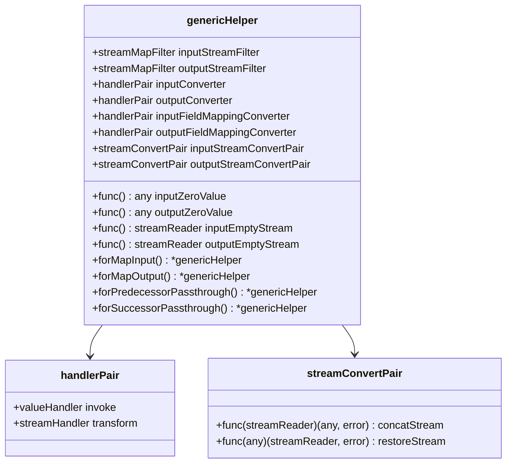
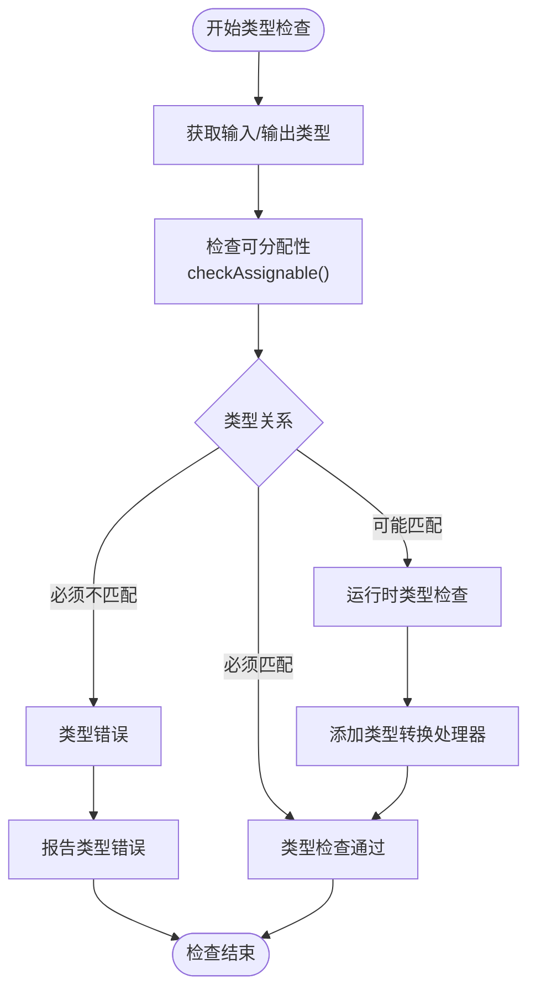
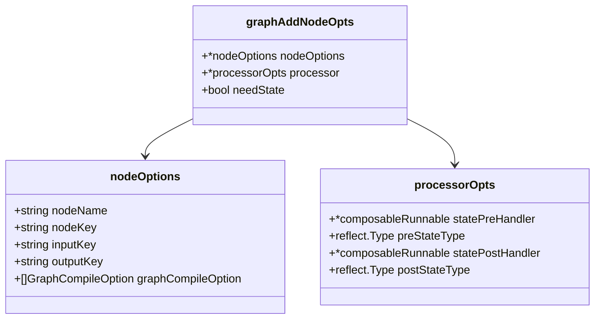

# 节点管理

<cite>
**本文档中引用的文件**
- [graph.go](file://compose/graph.go)
- [graph_node.go](file://compose/graph_node.go)
- [generic_helper.go](file://compose/generic_helper.go)
- [graph_add_node_options.go](file://compose/graph_add_node_options.go)
- [component_to_graph_node.go](file://compose/component_to_graph_node.go)
- [types_lambda.go](file://compose/types_lambda.go)
- [utils.go](file://compose/utils.go)
- [graph_test.go](file://compose/graph_test.go)
</cite>

## 目录
1. [简介](#简介)
2. [核心架构概述](#核心架构概述)
3. [graphNode结构体详解](#graphnode结构体详解)
4. [节点添加方法详解](#节点添加方法详解)
5. [泛型辅助系统](#泛型辅助系统)
6. [节点类型检查机制](#节点类型检查机制)
7. [选项配置系统](#选项配置系统)
8. [常见错误处理](#常见错误处理)
9. [实际应用示例](#实际应用示例)
10. [总结](#总结)

## 简介

Eino框架的Graph节点管理系统是一个高度灵活且类型安全的组件注册和管理机制。该系统通过统一的接口将不同类型的组件（如模型、检索器、函数式节点等）注册为图中的节点，并提供了强大的类型检查、泛型支持和配置选项功能。

## 核心架构概述

Eino的节点管理采用分层架构设计，主要包含以下核心组件：



**图表来源**
- [graph.go](file://compose/graph.go#L57-L90)
- [graph_node.go](file://compose/graph_node.go#L60-L70)
- [generic_helper.go](file://compose/generic_helper.go#L57-L69)

## graphNode结构体详解

`graphNode`是Eino框架中所有节点的核心封装结构体，它统一了不同类型节点的表示方式：



**图表来源**
- [graph_node.go](file://compose/graph_node.go#L60-L70)
- [graph_node.go](file://compose/graph_node.go#L45-L57)
- [graph_node.go](file://compose/graph_node.go#L28-L43)
- [generic_helper.go](file://compose/generic_helper.go#L57-L69)

### 核心字段说明

1. **cr字段**：composableRunnable类型的可执行对象，用于存储编译后的节点逻辑
2. **g字段**：AnyGraph类型的子图，支持嵌套图结构
3. **nodeInfo字段**：包含节点名称、键值映射、处理器等信息
4. **executorMeta字段**：执行器元数据，记录组件类型和回调状态
5. **instance字段**：原始组件实例，用于反射和类型识别
6. **opts字段**：节点配置选项列表

**段落来源**
- [graph_node.go](file://compose/graph_node.go#L60-L70)

## 节点添加方法详解

Eino框架提供了多种专门的方法来添加不同类型的节点到图中：

### AddChatModelNode方法

`AddChatModelNode`方法用于添加聊天模型节点，支持流式和非流式调用：



**图表来源**
- [graph.go](file://compose/graph.go#L342-L353)
- [component_to_graph_node.go](file://compose/component_to_graph_node.go#L88-L101)

### AddRetrieverNode方法

`AddRetrieverNode`方法专门处理检索器组件的节点添加：



**图表来源**
- [graph.go](file://compose/graph.go#L309-L318)
- [component_to_graph_node.go](file://compose/component_to_graph_node.go#L60-L68)

### AddLambdaNode方法

`AddLambdaNode`方法处理函数式节点的添加，支持多种Lambda类型：



**图表来源**
- [types_lambda.go](file://compose/types_lambda.go#L56-L66)
- [types_lambda.go](file://compose/types_lambda.go#L99-L162)

### AddPassthroughNode方法

`AddPassthroughNode`方法创建特殊的占位节点，主要用于复杂控制流：



**图表来源**
- [graph.go](file://compose/graph.go#L411-L419)
- [component_to_graph_node.go](file://compose/component_to_graph_node.go#L154-L158)

**段落来源**
- [graph.go](file://compose/graph.go#L309-L419)
- [component_to_graph_node.go](file://compose/component_to_graph_node.go#L29-L180)

## 泛型辅助系统

Eino的泛型辅助系统（genericHelper）是类型安全的核心保障，提供了完整的泛型支持：

### 泛型辅助结构



**图表来源**
- [generic_helper.go](file://compose/generic_helper.go#L57-L69)
- [generic_helper.go](file://compose/generic_helper.go#L158-L161)
- [generic_helper.go](file://compose/generic_helper.go#L163-L166)

### 泛型辅助方法

1. **forMapInput()**：为输入映射创建泛型辅助
2. **forMapOutput()**：为输出映射创建泛型辅助  
3. **forPredecessorPassthrough()**：为前驱传递创建泛型辅助
4. **forSuccessorPassthrough()**：为后继传递创建泛型辅助

这些方法允许节点在不同上下文中使用适当的类型转换策略。

**段落来源**
- [generic_helper.go](file://compose/generic_helper.go#L57-L151)

## 节点类型检查机制

Eino实现了严格的类型检查机制来确保节点间的数据兼容性：

### 类型检查流程



**图表来源**
- [graph.go](file://compose/graph.go#L556-L561)
- [utils.go](file://compose/utils.go#L1-L200)

### 可分配性检查

类型检查系统定义了三种类型关系：

1. **assignableTypeMust**：必须匹配，类型完全兼容
2. **assignableTypeMay**：可能匹配，需要运行时检查
3. **assignableTypeMustNot**：必须不匹配，类型冲突

**段落来源**
- [graph.go](file://compose/graph.go#L556-L561)
- [utils.go](file://compose/utils.go#L1-L200)

## 选项配置系统

Eino提供了丰富的选项配置系统来定制节点行为：

### 节点选项



**图表来源**
- [graph_add_node_options.go](file://compose/graph_add_node_options.go#L25-L30)
- [graph_add_node_options.go](file://compose/graph_add_node_options.go#L38-L47)
- [graph_add_node_options.go](file://compose/graph_add_node_options.go#L144-L149)

### 常用配置选项

1. **WithNodeName()**：设置节点显示名称
2. **WithInputKey()**：设置输入键值映射
3. **WithOutputKey()**：设置输出键值映射
4. **WithStatePreHandler()**：设置状态前置处理器
5. **WithStatePostHandler()**：设置状态后置处理器

**段落来源**
- [graph_add_node_options.go](file://compose/graph_add_node_options.go#L32-L169)

## 常见错误处理

### 重复添加节点错误

当尝试添加已经存在的节点时，系统会返回特定的错误信息：

```go
// 错误示例：节点已存在
err := graph.AddChatModelNode("model", chatModel)
if err != nil {
    if strings.Contains(err.Error(), "already present") {
        // 处理重复添加错误
        log.Printf("节点已存在: %s", "model")
    }
}
```

### 保留关键字冲突

系统禁止使用保留的关键字作为节点名称：

```go
// 错误示例：使用保留关键字
err := graph.AddChatModelNode("start", chatModel) // START是保留关键字
err := graph.AddChatModelNode("end", chatModel)   // END是保留关键字
```

### 类型不匹配错误

当节点间的输入输出类型不兼容时，系统会进行严格检查：

```go
// 错误示例：类型不匹配
type InputType struct{ Value string }
type OutputType struct{ Result int }

// 如果下游节点期望OutputType而上游提供InputType，则会报错
```

### 状态配置错误

当节点需要状态但图未启用状态时：

```go
// 错误示例：缺少状态配置
err := graph.AddChatModelNode("model", chatModel, 
    WithStatePreHandler(func(ctx context.Context, in string, state string) (string, error) {
        return in, nil
    }))
// 需要先启用状态：NewGraph[InputType, OutputType](WithGenLocalState())
```

**段落来源**
- [graph.go](file://compose/graph.go#L177-L183)
- [graph.go](file://compose/graph.go#L186-L190)

## 实际应用示例

### 基本节点添加示例

```go
// 创建图实例
graph := NewGraph[map[string]any, *schema.Message]()

// 添加聊天模板节点
template := prompt.FromMessages(schema.FString,
    schema.UserMessage("what's the weather in {location}?"),
)
err := graph.AddChatTemplateNode("prompt", template)

// 添加聊天模型节点
chatModel := &mockChatModel{}
err = graph.AddChatModelNode("model", chatModel, WithNodeName("OpenAI"))

// 添加边缘连接
err = graph.AddEdge(START, "prompt")
err = graph.AddEdge("prompt", "model")
err = graph.AddEdge("model", END)
```

### 使用AddPassthroughNode的复杂控制流

```go
// 创建复杂的控制流
graph := NewGraph[string, string]()

// 添加多个Passthrough节点
err := graph.AddPassthroughNode("passthrough1")
err = graph.AddPassthroughNode("passthrough2")

// 添加条件分支
condition := func(ctx context.Context, input string) (string, error) {
    if len(input) > 10 {
        return "path1", nil
    }
    return "path2", nil
}
branch := NewGraphBranch(condition, map[string]bool{"path1": true, "path2": true})
err = graph.AddBranch("passthrough1", branch)

// 连接节点
err = graph.AddEdge(START, "passthrough1")
err = graph.AddEdge("passthrough2", END)
```

### Lambda节点的应用

```go
// 创建自定义Lambda节点
parser := schema.NewMessageJSONParser[Person](&schema.MessageJSONParseConfig{
    ParseFrom: schema.MessageParseFromContent,
})

parserLambda := MessageParser(parser)
err = graph.AddLambdaNode("parser", parserLambda)

// 使用ToList转换单个输入为列表
toListLambda := ToList[*schema.Message]()
err = graph.AddLambdaNode("toList", toListLambda)
```

**段落来源**
- [graph_test.go](file://compose/graph_test.go#L37-L88)
- [types_lambda.go](file://compose/types_lambda.go#L238-L266)

## 总结

Eino框架的节点管理机制通过以下核心特性实现了强大而灵活的图构建能力：

1. **统一的节点封装**：`graphNode`结构体统一了不同类型节点的表示方式
2. **多样化的节点添加方法**：针对不同组件类型提供了专门的添加方法
3. **强大的泛型支持**：`genericHelper`系统确保了类型安全和灵活性
4. **严格的类型检查**：多层次的类型检查机制保证了节点间的兼容性
5. **丰富的配置选项**：灵活的选项系统支持各种定制需求
6. **完善的错误处理**：详细的错误信息帮助开发者快速定位问题

这种设计使得开发者能够以声明式的方式构建复杂的图结构，同时享受类型安全和运行时性能的双重保障。通过合理使用这些节点管理功能，可以构建出既高效又可靠的AI工作流系统。