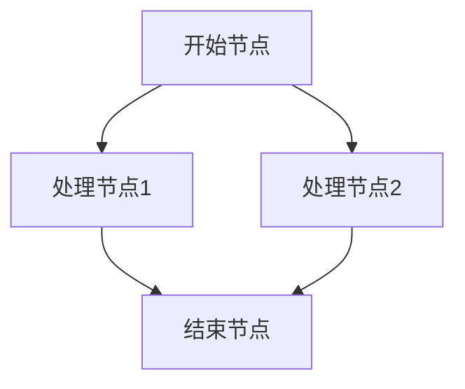
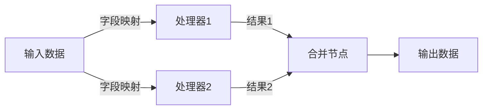
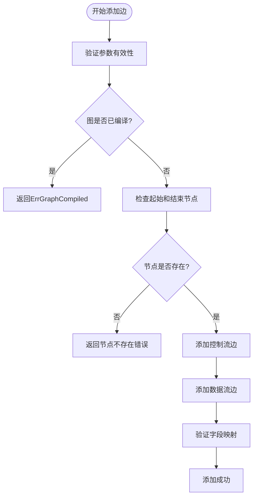
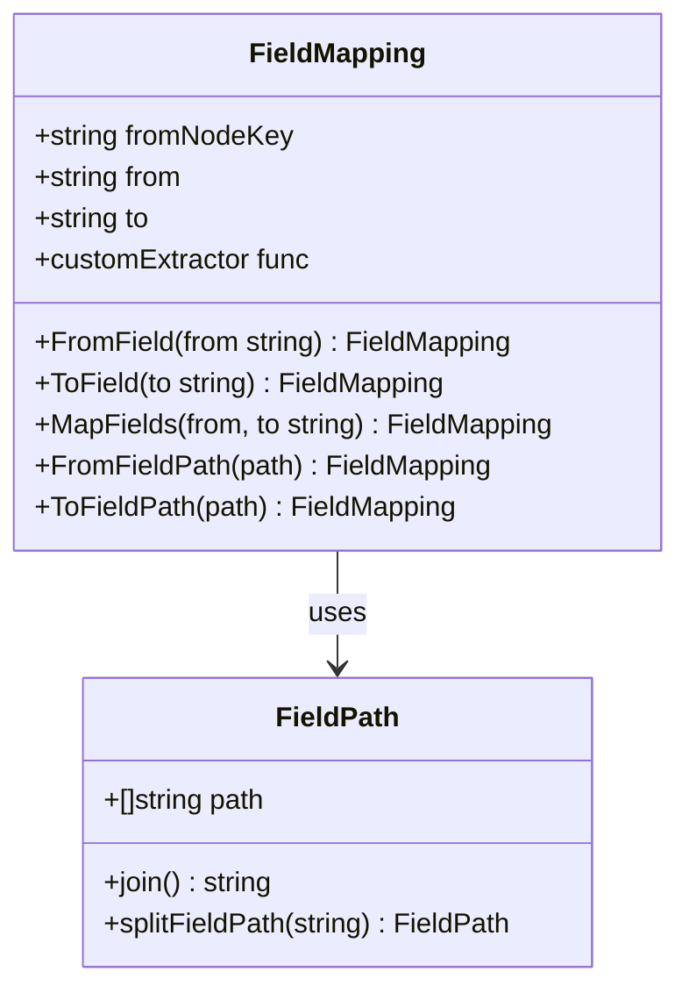
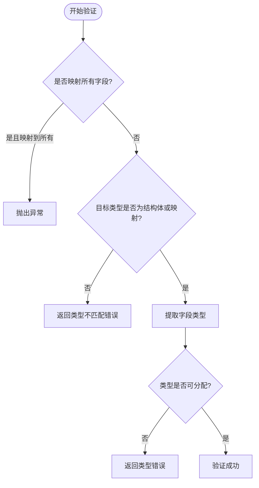
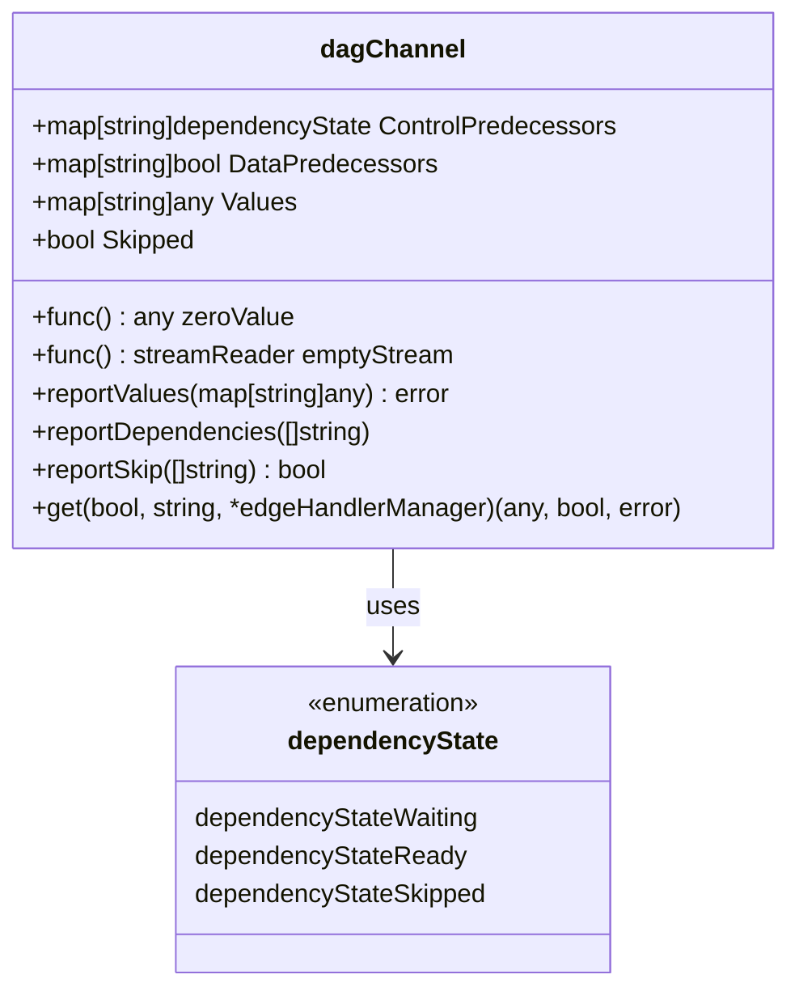
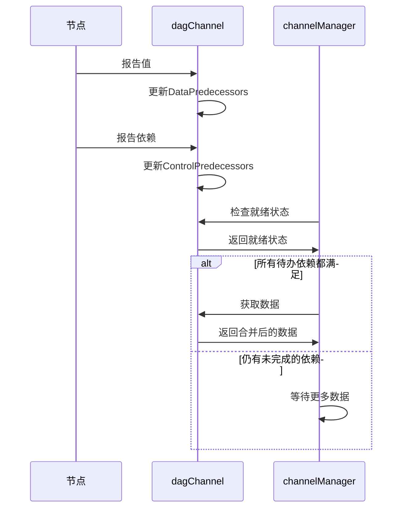
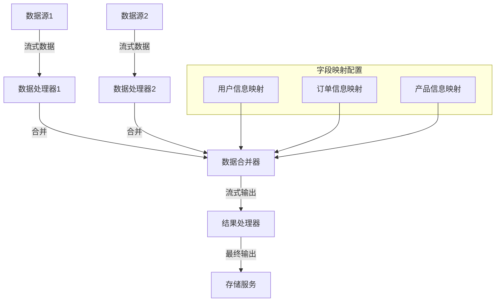

# 边与数据流

<cite>
**本文档引用的文件**
- [dag.go](file://compose/dag.go)
- [graph.go](file://compose/graph.go)
- [field_mapping.go](file://compose/field_mapping.go)
- [values_merge.go](file://compose/values_merge.go)
- [graph_manager.go](file://compose/graph_manager.go)
- [workflow.go](file://compose/workflow.go)
</cite>

## 目录
1. [概述](#概述)
2. [边的类型与作用](#边的类型与作用)
3. [AddEdge方法详解](#addege方法详解)
4. [字段级数据映射](#字段级数据映射)
5. [DAG运行模式下的数据流管理](#dag运行模式下的数据流管理)
6. [复杂数据流示例](#复杂数据流示例)
7. [性能优化与最佳实践](#性能优化与最佳实践)
8. [总结](#总结)

## 概述

Eino框架中的Graph系统通过边（Edge）建立了节点间的数据依赖关系，实现了复杂的工作流编排。边分为两种主要类型：控制流边（controlEdges）和数据流边（dataEdges），它们协同工作确保任务的正确执行顺序和数据的有效传递。

## 边的类型与作用

### 控制流边（ControlEdges）

控制流边定义了节点间的执行顺序关系，决定了哪些节点必须在其他节点之前完成执行。

**图表来源**
- [dag.go](file://compose/dag.go#L23-L39)

### 数据流边（DataEdges）

数据流边负责在节点间传递数据，支持复杂的字段级映射和数据转换。

**图表来源**
- [graph.go](file://compose/graph.go#L58-L68)

**节来源**
- [dag.go](file://compose/dag.go#L50-L60)
- [graph.go](file://compose/graph.go#L58-L68)

## AddEdge方法详解

`AddEdge`方法是建立节点间依赖关系的核心函数，它同时处理控制流和数据流边的添加。

### 方法签名与参数

**图表来源**
- [graph.go](file://compose/graph.go#L231-L293)

### 边添加流程

1. **参数验证**：检查图是否已编译、节点是否存在等
2. **控制流边添加**：更新controlEdges映射表
3. **数据流边添加**：更新dataEdges映射表并验证字段映射
4. **依赖关系建立**：维护startNodes和endNodes列表

**节来源**
- [graph.go](file://compose/graph.go#L231-L293)

## 字段级数据映射

### FieldMapping结构

字段映射允许在不同节点间进行精确的数据转换和重命名：

**图表来源**
- [field_mapping.go](file://compose/field_mapping.go#L31-L142)

### 映射类型

1. **FromField**：从特定字段映射到整个输入
2. **ToField**：从整个输出映射到特定字段  
3. **MapFields**：字段到字段的直接映射
4. **路径映射**：支持嵌套结构的复杂映射

### 类型验证机制

字段映射在编译时进行严格的类型检查：

**图表来源**
- [field_mapping.go](file://compose/field_mapping.go#L645-L774)

**节来源**
- [field_mapping.go](file://compose/field_mapping.go#L31-L142)
- [field_mapping.go](file://compose/field_mapping.go#L645-L774)

## DAG运行模式下的数据流管理

### dagChannel架构

DAG（有向无环图）运行模式使用专门的通道管理器来协调节点执行：

**图表来源**
- [dag.go](file://compose/dag.go#L50-L60)

### 依赖状态管理

DAG通道维护两种类型的依赖状态：

1. **ControlPredecessors**：控制流依赖的状态跟踪
2. **DataPredecessors**：数据流依赖的就绪状态

### 执行协调机制

**图表来源**
- [dag.go](file://compose/dag.go#L89-L151)
- [graph_manager.go](file://compose/graph_manager.go#L150-L200)

**节来源**
- [dag.go](file://compose/dag.go#L50-L196)
- [graph_manager.go](file://compose/graph_manager.go#L102-L200)

## 复杂数据流示例

### 合并与流式传递场景

考虑一个需要合并多个数据源并进行流式处理的复杂工作流：

### 实现要点

1. **流式数据处理**：支持实时数据流的合并和处理
2. **字段级映射**：精确控制数据结构的转换
3. **并行处理**：多个数据源可以并行处理
4. **错误恢复**：支持部分失败时的优雅降级

### 性能考量

1. **内存管理**：合理控制缓冲区大小
2. **背压处理**：防止下游处理不过来导致的内存溢出
3. **批处理优化**：适当批量处理以提高吞吐量

**节来源**
- [values_merge.go](file://compose/values_merge.go#L38-L83)

## 性能优化与最佳实践

### 边的设计原则

1. **最小化依赖**：只建立必要的控制流边
2. **合理的数据流**：避免不必要的数据复制
3. **并行友好**：设计支持并行执行的边结构

### 内存优化策略

1. **及时释放**：处理完的数据及时清理
2. **流式处理**：对于大数据集使用流式处理
3. **缓存策略**：合理利用缓存减少重复计算

### 错误处理机制

1. **优雅降级**：部分节点失败不影响整体流程
2. **重试机制**：关键操作支持自动重试
3. **监控告警**：实时监控边的健康状态

## 总结

Eino框架的边与数据流管理系统通过精心设计的控制流和数据流机制，实现了高效、可靠的分布式工作流处理。`AddEdge`方法提供了灵活的边添加能力，字段映射功能支持复杂的结构转换，而DAG运行模式则确保了正确的执行顺序和数据一致性。

这种设计不仅支持传统的线性工作流，还能处理复杂的并行和分支场景，为构建大规模分布式应用提供了强大的基础设施支持。通过合理的边设计和数据流管理，开发者可以构建出既高效又可靠的复杂业务逻辑处理系统。