# Workflow

<cite>
**本文档中引用的文件**
- [workflow.go](file://compose/workflow.go)
- [field_mapping.go](file://compose/field_mapping.go)
- [graph.go](file://compose/graph.go)
- [graph_node.go](file://compose/graph_node.go)
- [workflow_test.go](file://compose/workflow_test.go)
</cite>

## 目录
1. [简介](#简介)
2. [核心架构](#核心架构)
3. [WorkflowNode设计](#workflownode设计)
4. [FieldMapping机制](#fieldmapping机制)
5. [依赖管理](#依赖管理)
6. [WithNoDirectDependency选项](#withnodirectdependency选项)
7. [实际应用示例](#实际应用示例)
8. [性能考虑](#性能考虑)
9. [故障排除指南](#故障排除指南)
10. [总结](#总结)

## 简介

Workflow是Eino框架中基于`Graph`的高级编排模式，它在`Graph`的基础上提供了更高级的抽象，专注于字段级的数据映射和声明式依赖。Workflow通过`WorkflowNode`结构体封装`Graph`节点，并通过`AddInput`、`AddDependency`和`SetStaticValue`等方法实现声明式的依赖和数据流配置。

Workflow的核心特点包括：
- **字段级数据映射**：支持精确到字段级别的数据传递
- **声明式依赖管理**：通过方法链式调用配置节点间的依赖关系
- **强制AllPredecessor触发模式**：确保执行的确定性
- **灵活的分支处理**：通过`WithNoDirectDependency`选项处理复杂的分支场景

## 核心架构

Workflow采用分层架构设计，底层基于`Graph`组件，上层提供高级抽象。

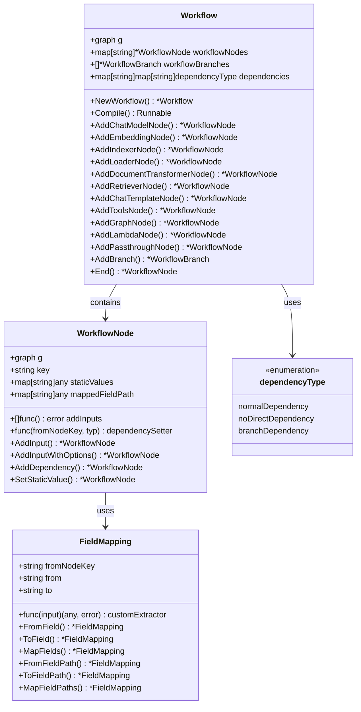

**图表来源**
- [workflow.go](file://compose/workflow.go#L33-L58)
- [field_mapping.go](file://compose/field_mapping.go#L31-L40)

**章节来源**
- [workflow.go](file://compose/workflow.go#L33-L84)

## WorkflowNode设计

`WorkflowNode`是Workflow的核心组件，它封装了`Graph`节点并提供了声明式的配置接口。

### 结构体定义

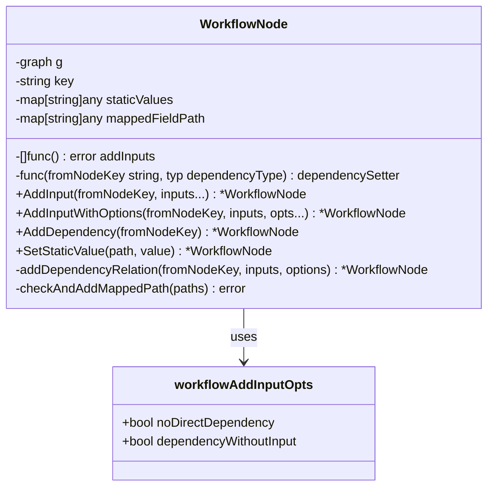

**图表来源**
- [workflow.go](file://compose/workflow.go#L33-L41)

### 初始化过程

WorkflowNode的初始化通过`initNode`方法完成，该方法创建节点实例并设置依赖关系管理器：

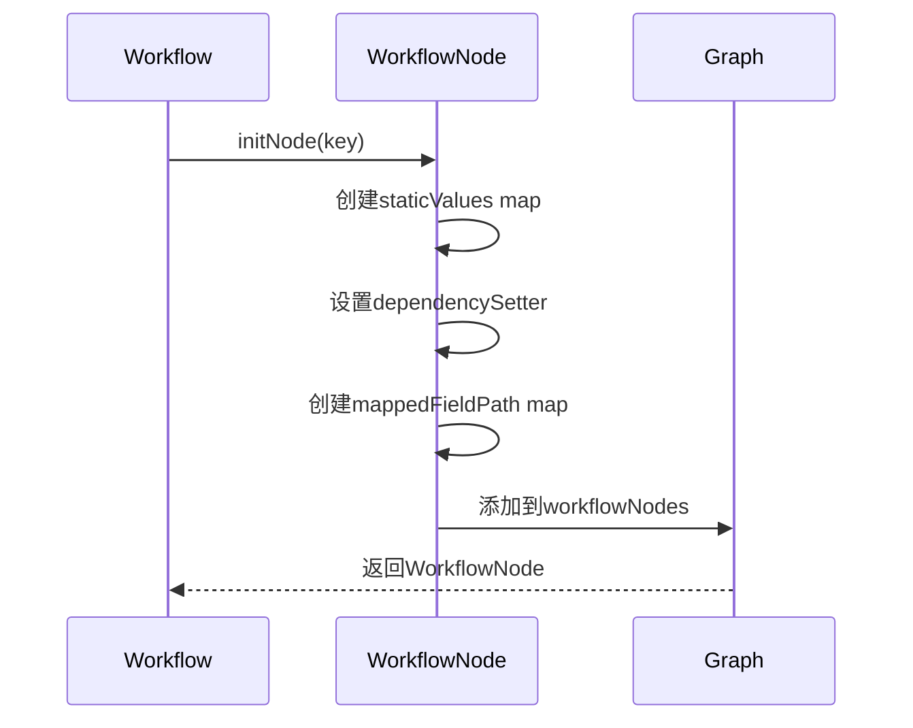

**图表来源**
- [workflow.go](file://compose/workflow.go#L480-L495)

**章节来源**
- [workflow.go](file://compose/workflow.go#L33-L41)
- [workflow.go](file://compose/workflow.go#L480-L495)

## FieldMapping机制

FieldMapping是Workflow中实现不同节点间数据结构灵活映射的核心机制。

### 映射类型

FieldMapping支持多种映射类型：

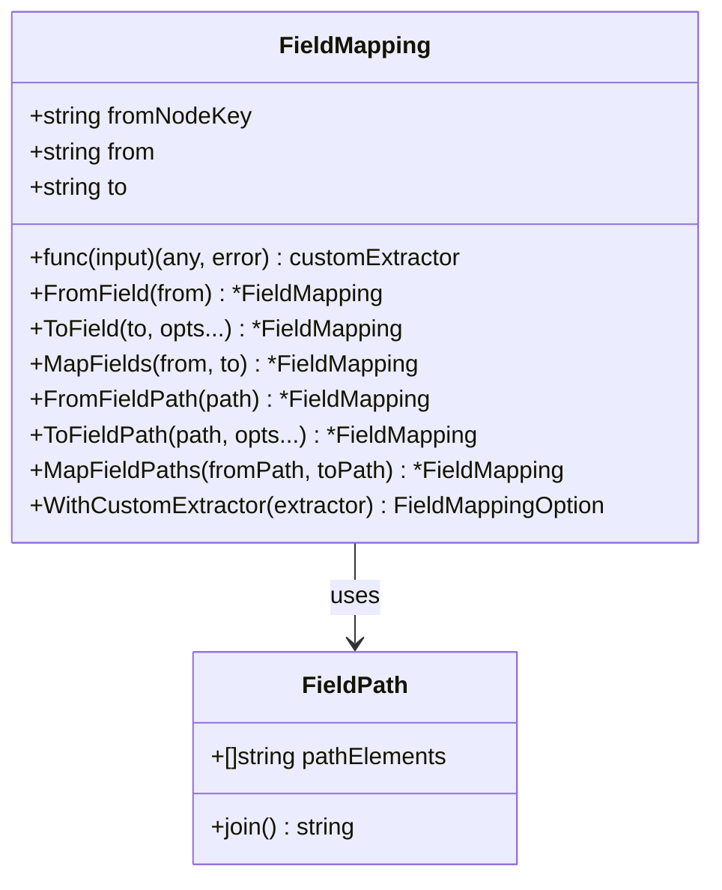

**图表来源**
- [field_mapping.go](file://compose/field_mapping.go#L31-L40)
- [field_mapping.go](file://compose/field_mapping.go#L116-L126)

### 字段路径处理

FieldMapping使用内部路径分隔符`\x1F`来处理嵌套字段：

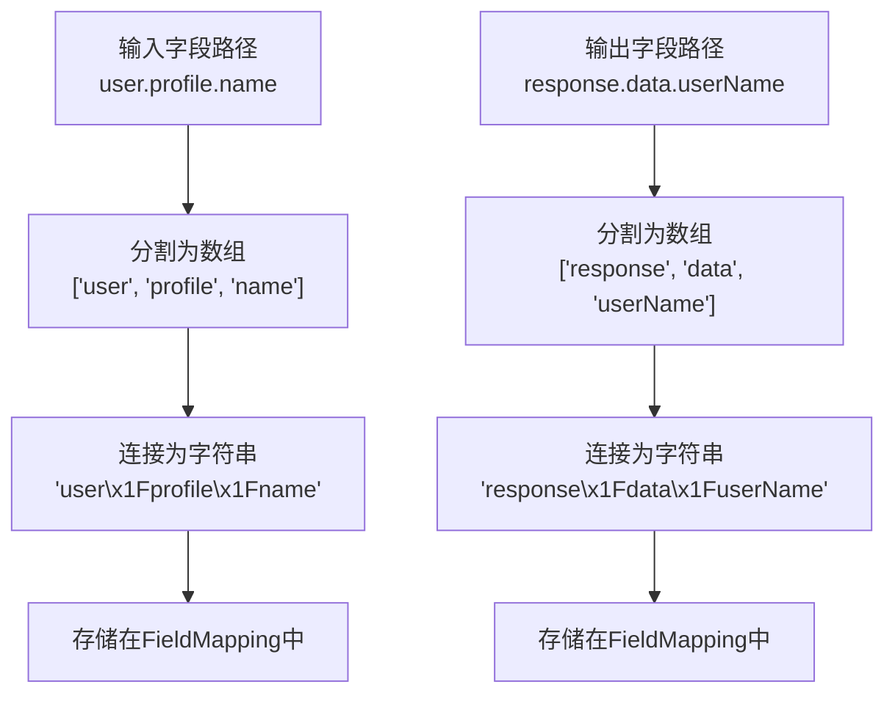

**图表来源**
- [field_mapping.go](file://compose/field_mapping.go#L127-L142)

### 类型验证机制

FieldMapping包含强大的类型验证功能，在编译时检查字段映射的合法性：

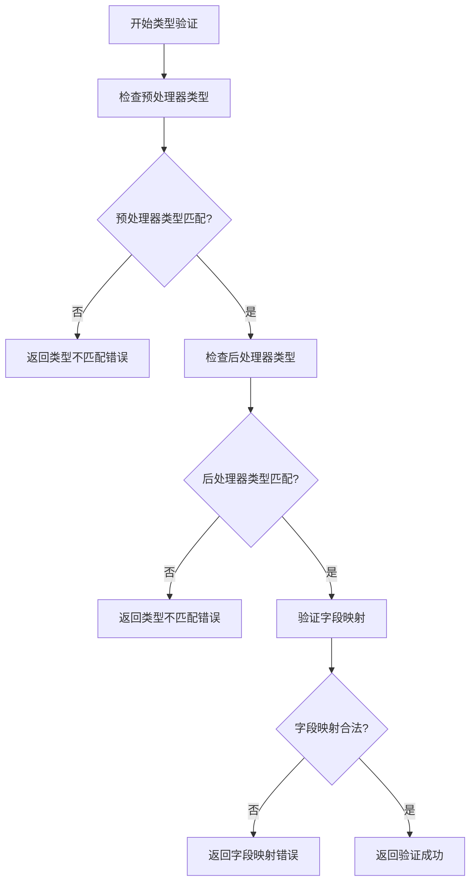

**图表来源**
- [field_mapping.go](file://compose/field_mapping.go#L645-L775)

**章节来源**
- [field_mapping.go](file://compose/field_mapping.go#L31-L40)
- [field_mapping.go](file://compose/field_mapping.go#L116-L126)
- [field_mapping.go](file://compose/field_mapping.go#L645-L775)

## 依赖管理

Workflow提供了三种类型的依赖关系管理：

### 依赖类型枚举

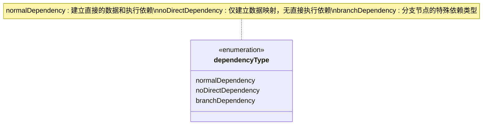

**图表来源**
- [workflow.go](file://compose/workflow.go#L52-L58)

### AddInput方法详解

`AddInput`方法是最常用的依赖配置方法，支持多种映射模式：

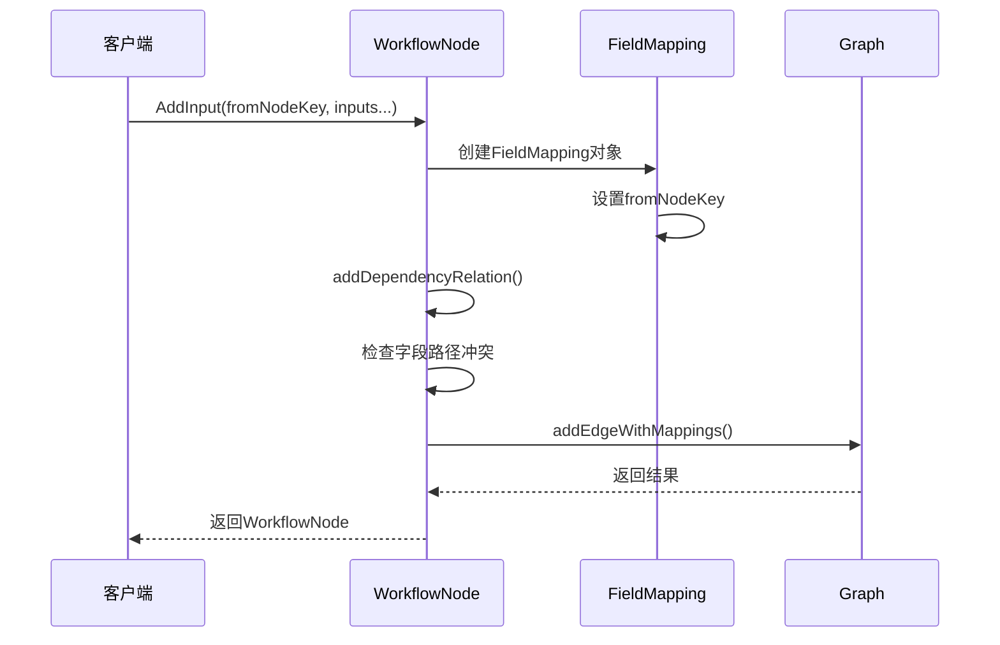

**图表来源**
- [workflow.go](file://compose/workflow.go#L167-L169)

### AddDependency方法

`AddDependency`方法用于建立仅执行依赖而不传递数据的关系：

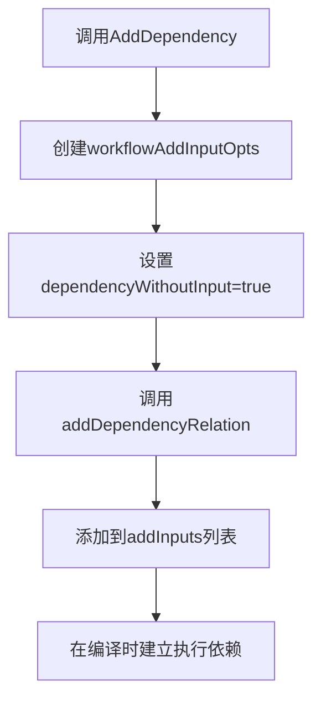

**图表来源**
- [workflow.go](file://compose/workflow.go#L269-L271)

**章节来源**
- [workflow.go](file://compose/workflow.go#L52-L58)
- [workflow.go](file://compose/workflow.go#L148-L271)

## WithNoDirectDependency选项

`WithNoDirectDependency`是Workflow中处理分支场景的关键选项，它允许在不同分支之间建立数据访问关系而不影响执行顺序。

### 工作原理

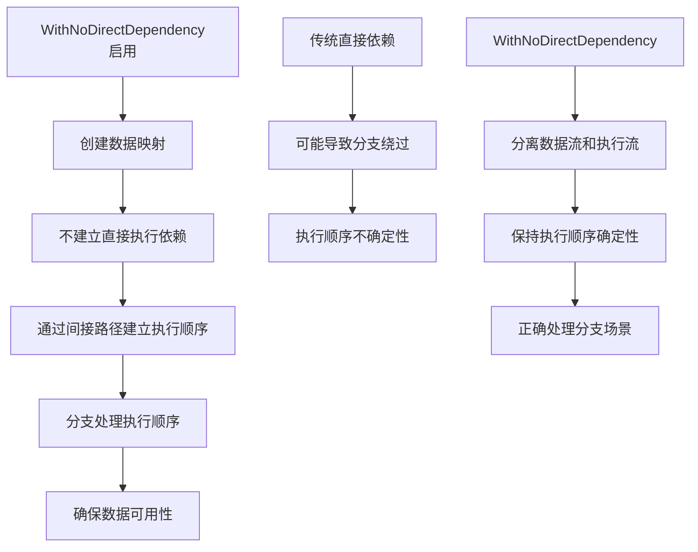

### 使用场景

1. **跨分支数据访问**：当需要从一个分支访问另一个分支的数据时
2. **避免冗余依赖**：当已有路径可以保证执行顺序时
3. **复杂分支逻辑**：在多分支场景中保持清晰的执行流程

### 验证规则

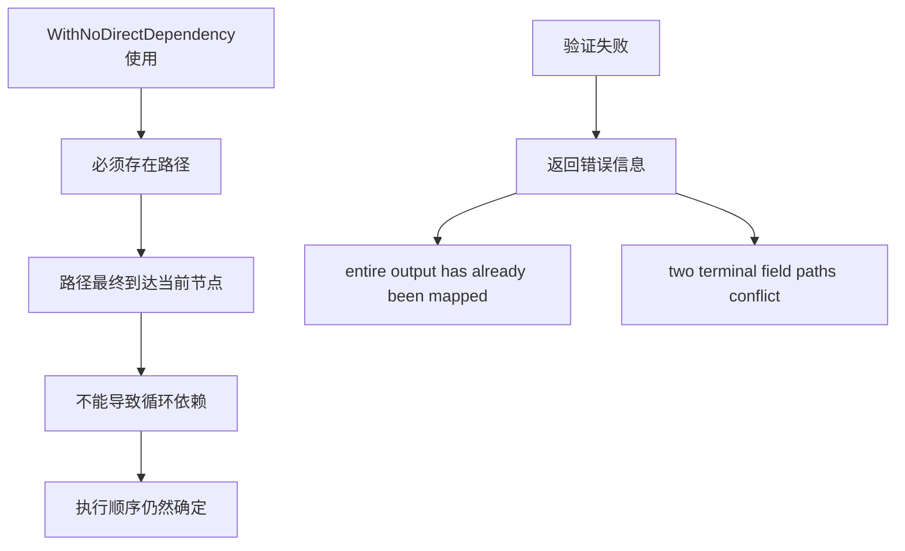

**图表来源**
- [workflow.go](file://compose/workflow.go#L196-L226)
- [workflow.go](file://compose/workflow.go#L338-L373)

**章节来源**
- [workflow.go](file://compose/workflow.go#L192-L242)
- [workflow.go](file://compose/workflow.go#L338-L373)

## 实际应用示例

以下是一个完整的复杂数据处理流程示例，展示了如何使用Workflow连接文档加载、切分、嵌入和索引的完整流程。

### 文档处理工作流

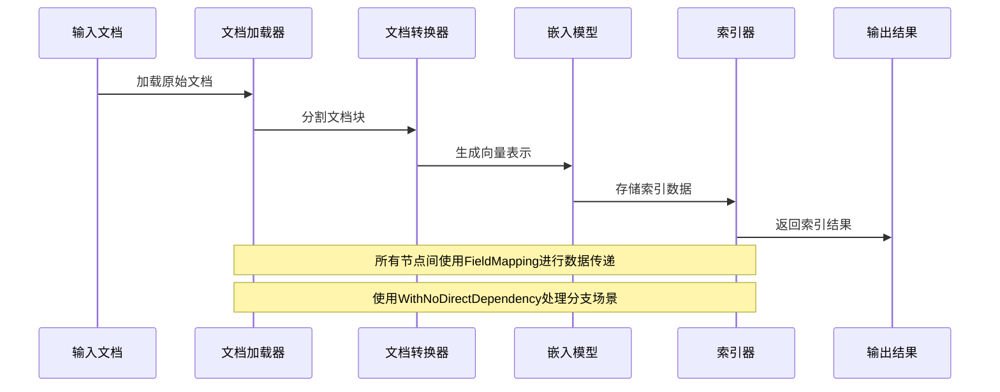

### 示例代码结构

基于测试代码，我们可以看到Workflow的实际使用模式：

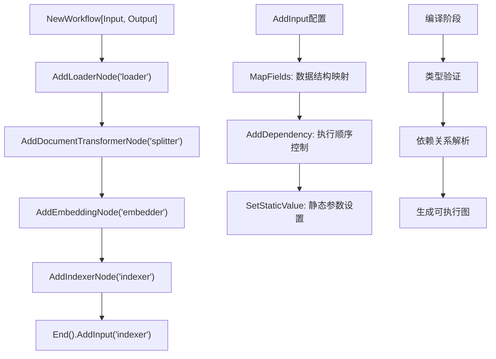

### 复杂分支处理示例

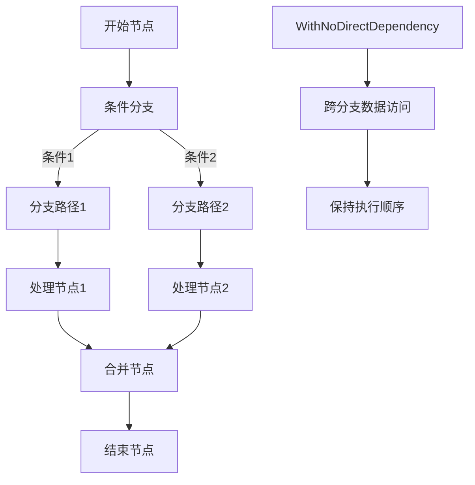

**章节来源**
- [workflow_test.go](file://compose/workflow_test.go#L231-L282)
- [workflow_test.go](file://compose/workflow_test.go#L1497-L1543)

## 性能考虑

Workflow在设计时充分考虑了性能优化：

### 编译时优化

1. **类型检查**：在编译时进行字段映射类型验证
2. **依赖解析**：提前解析所有依赖关系
3. **内存优化**：复用映射记录和处理器对

### 运行时优化

1. **延迟计算**：只有在需要时才执行字段映射
2. **流式处理**：支持流式数据处理减少内存占用
3. **缓存机制**：缓存已验证的映射关系

### 内存管理

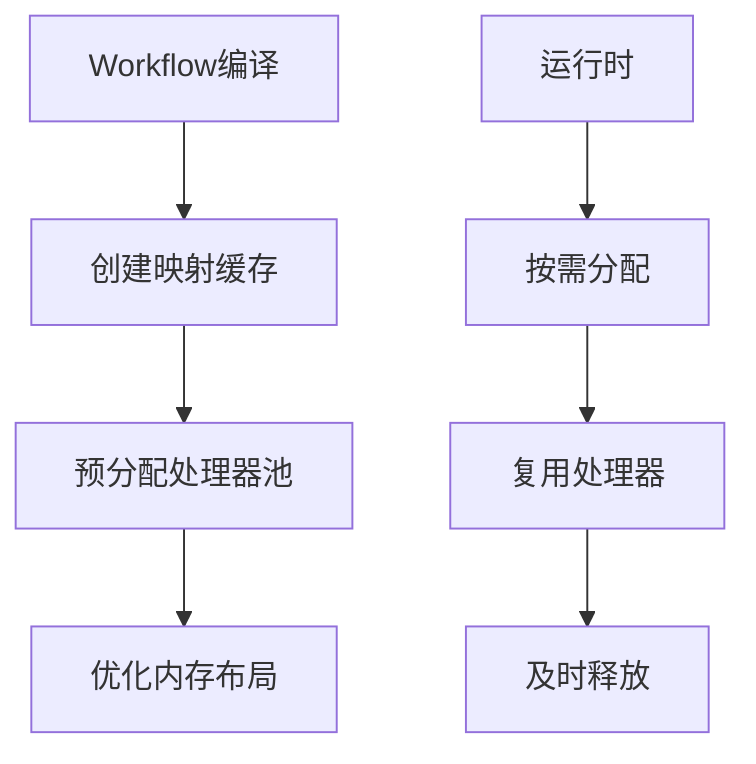

## 故障排除指南

### 常见错误及解决方案

1. **字段映射冲突**
   - 错误信息：`two terminal field paths conflict`
   - 解决方案：检查是否有多个映射目标相同的字段

2. **类型不匹配**
   - 错误信息：`field[<type>]-[<type>] is absolutely not assignable`
   - 解决方案：确保源字段和目标字段类型兼容

3. **循环依赖**
   - 错误信息：无法建立有效的执行顺序
   - 解决方案：重新设计依赖关系，使用`WithNoDirectDependency`

4. **静态值冲突**
   - 错误信息：`entire output has already been mapped`
   - 解决方案：避免同时使用静态值和全量映射

### 调试技巧

1. **启用详细日志**：在编译和运行时启用调试信息
2. **验证映射关系**：使用单元测试验证字段映射
3. **检查依赖图**：可视化依赖关系确保逻辑正确

**章节来源**
- [field_mapping.go](file://compose/field_mapping.go#L645-L775)
- [workflow.go](file://compose/workflow.go#L428-L480)

## 总结

Workflow作为Eino框架中的高级编排模式，通过以下特性实现了强大的数据流控制能力：

### 核心优势

1. **声明式配置**：通过方法链式调用简化依赖配置
2. **字段级映射**：精确控制数据在节点间的传递
3. **类型安全**：编译时类型验证确保运行时稳定性
4. **分支友好**：通过`WithNoDirectDependency`优雅处理复杂分支场景
5. **执行确定性**：强制使用`AllPredecessor`触发模式保证执行顺序

### 适用场景

- **复杂数据处理管道**：如文档处理、数据分析等
- **微服务编排**：协调多个服务间的调用顺序
- **业务流程自动化**：实现复杂的业务逻辑编排
- **AI工作流**：连接LLM、嵌入、检索等组件

### 最佳实践

1. **合理使用依赖类型**：根据需求选择合适的依赖关系
2. **避免过度复杂化**：保持工作流的简洁性和可维护性
3. **充分利用类型系统**：利用Go的类型系统进行早期错误检测
4. **测试驱动开发**：编写充分的单元测试验证工作流逻辑

Workflow的设计体现了Eino框架对复杂系统编排的深刻理解，通过提供高级抽象和强大工具，使得构建复杂的异步工作流变得简单而可靠。