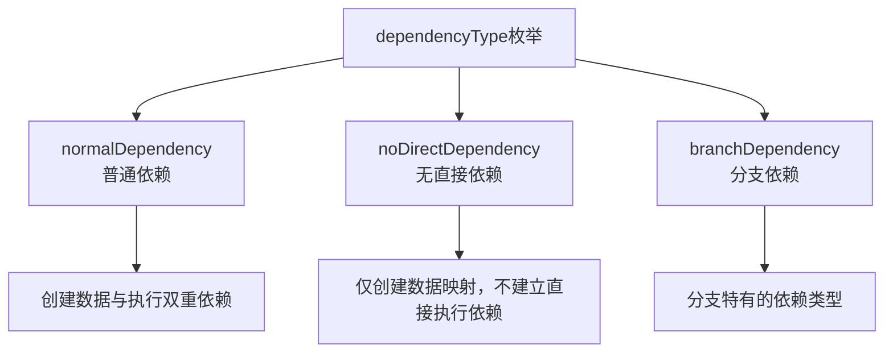
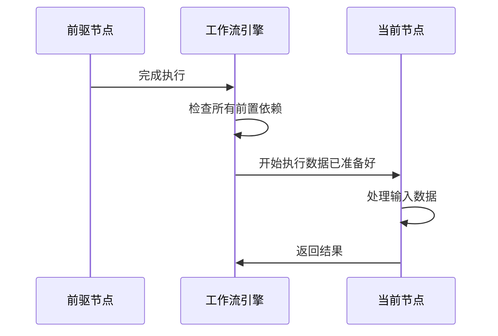
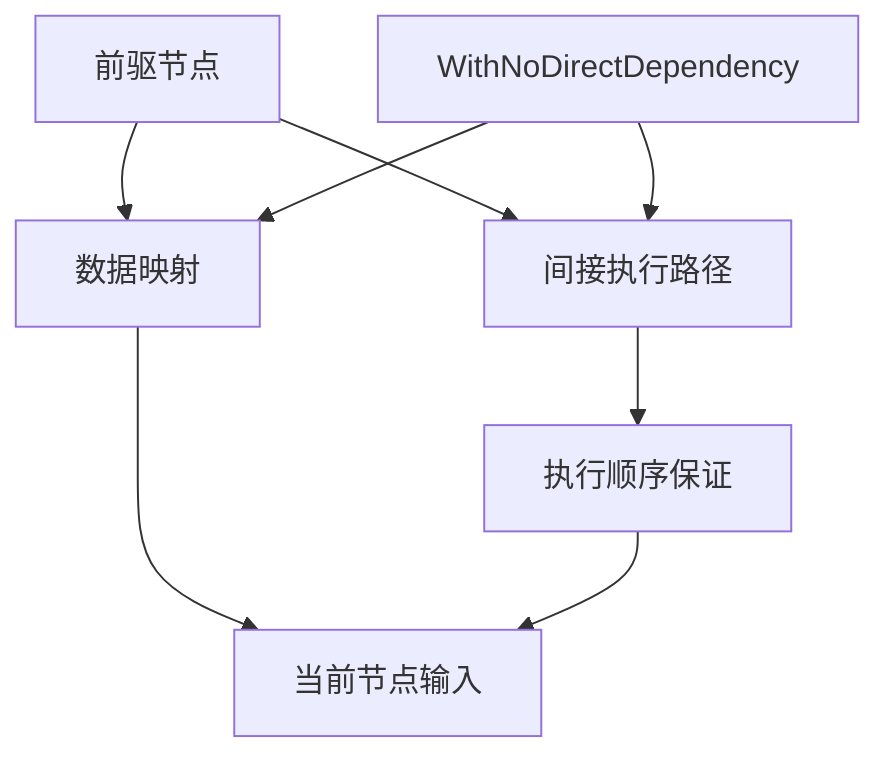
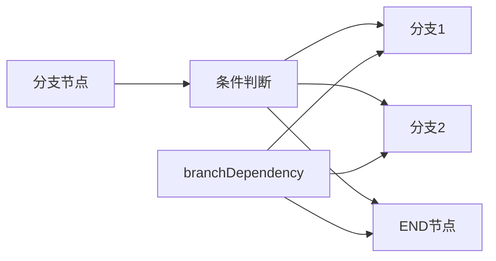
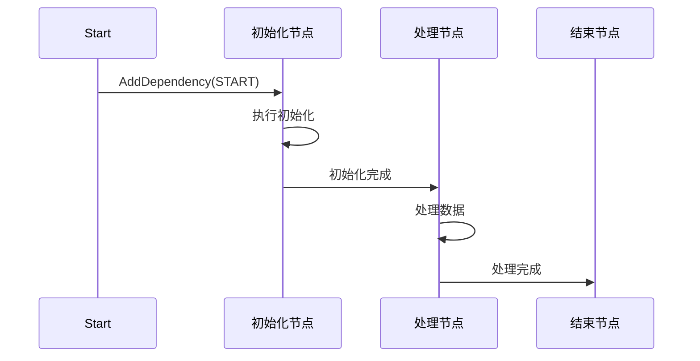
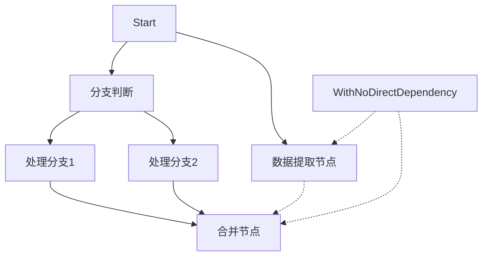
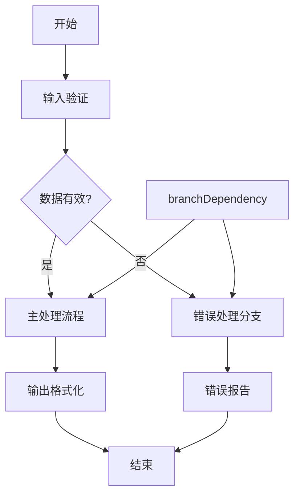

# 依赖类型

<cite>
**本文档中引用的文件**
- [workflow.go](file://compose/workflow.go)
- [workflow_test.go](file://compose/workflow_test.go)
- [field_mapping.go](file://compose/field_mapping.go)
- [graph.go](file://compose/graph.go)
</cite>

## 目录
1. [简介](#简介)
2. [依赖类型概述](#依赖类型概述)
3. [normalDependency（普通依赖）](#normaldependency普通依赖)
4. [noDirectDependency（无直接依赖）](#nodirectdependency无直接依赖)
5. [branchDependency（分支依赖）](#branchdependency分支依赖)
6. [依赖类型对比表](#依赖类型对比表)
7. [实际应用场景](#实际应用场景)
8. [最佳实践指南](#最佳实践指南)
9. [总结](#总结)

## 简介

Eino Workflow提供了一套灵活的依赖管理系统，通过三种不同的依赖类型来控制工作流中节点之间的执行顺序和数据流动。这种设计允许开发者精确控制工作流的行为，确保数据安全性和执行效率。

## 依赖类型概述

在Eino Workflow中，依赖类型通过`dependencyType`枚举定义，该枚举包含以下三种类型：

**图表来源**
- [workflow.go](file://compose/workflow.go#L52-L58)

**节来源**
- [workflow.go](file://compose/workflow.go#L52-L58)

## normalDependency（普通依赖）

### 定义与特性

`normalDependency`是最常见的依赖类型，它同时创建数据依赖和执行依赖。当使用`AddInput`方法时，默认使用这种依赖类型。

### 核心特性

1. **双重依赖**：同时建立数据流向和执行顺序
2. **数据传递**：前驱节点的数据会传递给当前节点
3. **执行阻塞**：当前节点必须等待前驱节点完成才能开始执行

### 使用场景

- 数据处理流水线：需要从前一个节点接收数据并进行处理
- 初始化任务：后续任务依赖于初始化任务的结果
- 串行处理：明确的步骤式处理流程

### 实现机制

**图表来源**
- [workflow.go](file://compose/workflow.go#L318-L332)

### 示例代码结构

[AddInput方法实现](file://compose/workflow.go#L167-L169)使用`normalDependency`作为默认配置，通过`workflowAddInputOpts`结构体控制依赖行为。

**节来源**
- [workflow.go](file://compose/workflow.go#L148-L170)
- [workflow.go](file://compose/workflow.go#L318-L332)

## noDirectDependency（无直接依赖）

### 定义与特性

`noDirectDependency`是一种特殊的依赖类型，它只创建数据映射而不建立直接的执行依赖关系。这是通过`WithNoDirectDependency()`选项实现的。

### 核心特性

1. **间接执行保证**：前驱节点仍然会在当前节点执行前完成
2. **数据映射**：建立从前驱节点到当前节点的数据映射
3. **路径依赖**：通过其他具有直接依赖的节点间接建立执行顺序
4. **分支友好**：特别适用于分支场景

### 使用场景

1. **跨分支数据访问**：连接不同分支侧的节点
2. **避免冗余依赖**：当已有路径可以保证执行顺序时
3. **数据共享**：多个节点需要访问相同的数据源
4. **条件执行**：基于分支结果决定是否执行某些操作

### 实现原理

**图表来源**
- [workflow.go](file://compose/workflow.go#L290-L305)

### 关键约束

1. **路径存在性**：必须存在一条从前驱节点到当前节点的路径
2. **分支兼容性**：在分支场景中必须使用此类型
3. **执行保证**：前驱节点必须通过其他方式完成

### 示例应用

在分支场景中，`WithNoDirectDependency`确保数据可以从分支的一侧传递到另一侧，同时让分支本身控制执行顺序。

**节来源**
- [workflow.go](file://compose/workflow.go#L192-L242)
- [workflow.go](file://compose/workflow.go#L290-L305)

## branchDependency（分支依赖）

### 定义与特性

`branchDependency`是专门为分支场景设计的依赖类型，由工作流编译器自动设置。

### 核心特性

1. **分支专用**：专门用于分支节点到结束节点的依赖
2. **动态路由**：根据分支条件决定执行路径
3. **灵活性**：支持复杂的分支逻辑

### 使用场景

1. **条件处理**：基于输入数据的不同分支处理
2. **错误处理**：异常情况下的特殊处理分支
3. **多路径选择**：根据业务逻辑选择不同执行路径

### 实现机制

**图表来源**
- [workflow.go](file://compose/workflow.go#L411-L422)

### 编译时处理

分支依赖在编译阶段由工作流系统自动设置，通过`compile`方法中的分支处理逻辑实现。

**节来源**
- [workflow.go](file://compose/workflow.go#L375-L396)
- [workflow.go](file://compose/workflow.go#L411-L422)

## 依赖类型对比表

| 特性 | normalDependency | noDirectDependency | branchDependency |
|------|------------------|-------------------|------------------|
| **数据依赖** | ✓ | ✓ | ✓ |
| **执行依赖** | ✓ | ✗ | ✓ |
| **间接执行保证** | ✗ | ✓ | ✓ |
| **分支兼容性** | ❌ | ✓ | ✓ |
| **典型用途** | 数据处理流水线 | 跨分支数据共享 | 条件分支处理 |
| **使用方法** | AddInput() | AddInputWithOptions(..., WithNoDirectDependency()) | 自动设置 |

## 实际应用场景

### 场景一：初始化任务等待

**图表来源**
- [workflow_test.go](file://compose/workflow_test.go#L1500-L1516)

在这个场景中，使用`AddDependency`创建执行依赖，确保初始化任务完成后才开始处理任务。

### 场景二：跨分支数据共享

**图表来源**
- [workflow_test.go](file://compose/workflow_test.go#L1518-L1557)

跨分支场景中，`WithNoDirectDependency`确保数据可以从分支的一侧传递到另一侧，同时让分支逻辑控制执行顺序。

### 场景三：复杂分支处理

**图表来源**
- [workflow_test.go](file://compose/workflow_test.go#L1016-L1049)

分支依赖在条件分支处理中发挥重要作用，根据输入数据自动选择执行路径。

**节来源**
- [workflow_test.go](file://compose/workflow_test.go#L1500-L1516)
- [workflow_test.go](file://compose/workflow_test.go#L1518-L1557)
- [workflow_test.go](file://compose/workflow_test.go#L1016-L1049)

## 最佳实践指南

### 选择依赖类型的原则

1. **明确需求**：根据是否需要数据传递和执行阻塞来选择
2. **避免冗余**：当已有路径可以保证执行顺序时使用`noDirectDependency`
3. **分支优先**：在分支场景中优先考虑`noDirectDependency`
4. **性能优化**：合理使用依赖类型减少不必要的等待时间

### 常见错误避免

1. **过度依赖**：不要为不需要数据传递的任务使用`normalDependency`
2. **路径冲突**：确保`noDirectDependency`场景中有有效的执行路径
3. **分支混淆**：在分支场景中正确使用相应的依赖类型

### 性能考虑

- `normalDependency`可能导致不必要的等待时间
- `noDirectDependency`可以提高并发执行能力
- `branchDependency`提供最优的分支处理性能

## 总结

Eino Workflow的三种依赖类型提供了灵活而强大的工作流控制机制：

- **normalDependency**适用于标准的数据处理流水线
- **noDirectDependency**提供了跨分支数据共享和路径优化的能力
- **branchDependency**专门处理复杂的分支逻辑

正确理解和使用这些依赖类型对于构建可靠、高效的Eino Workflow至关重要。通过合理组合这些依赖类型，开发者可以创建出既满足业务需求又具有良好性能的工作流系统。

理解依赖类型的选择原则和使用场景，能够帮助开发者更好地设计和优化工作流架构，确保系统的稳定性和可维护性。