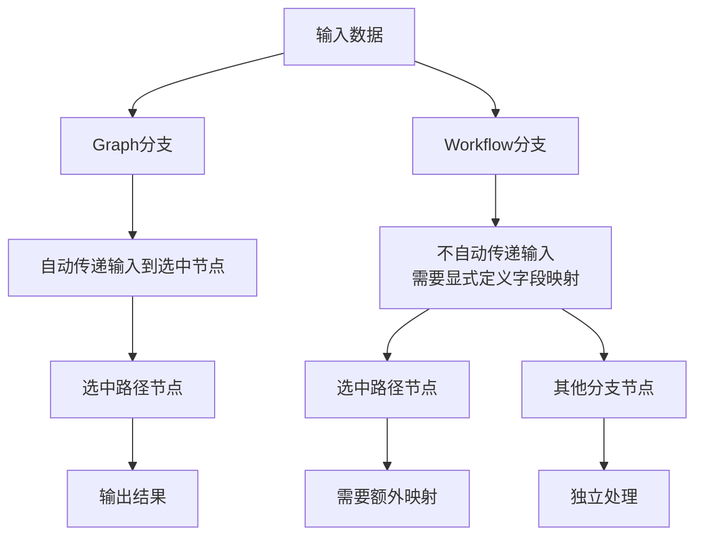
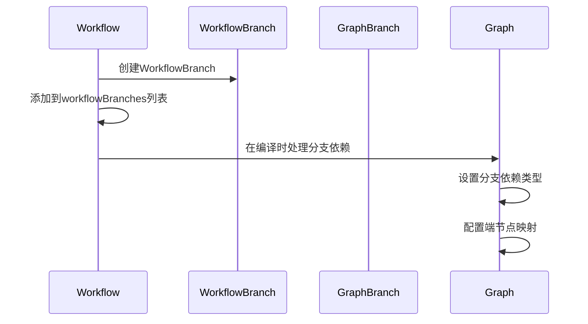
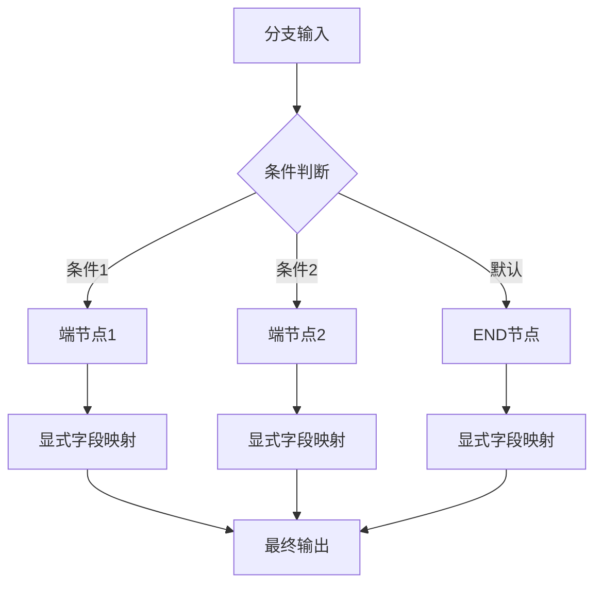
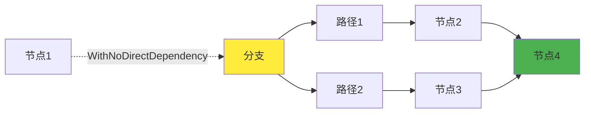
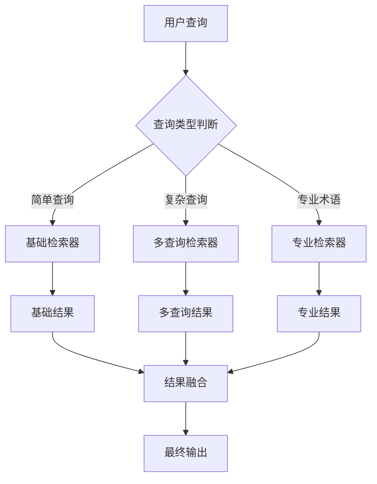

# 分支在Workflow中的特殊处理

<cite>
**本文档引用的文件**
- [adk/workflow.go](file://adk/workflow.go)
- [compose/workflow.go](file://compose/workflow.go)
- [compose/branch.go](file://compose/branch.go)
- [compose/field_mapping.go](file://compose/field_mapping.go)
- [flow/retriever/multiquery/multi_query.go](file://flow/retriever/multiquery/multi_query.go)
- [compose/workflow_test.go](file://compose/workflow_test.go)
</cite>

## 目录
1. [概述](#概述)
2. [Workflow分支与Graph分支的区别](#workflow分支与graph分支的区别)
3. [AddBranch方法详解](#addbranch方法详解)
4. [分支末端节点的字段映射要求](#分支末端节点的字段映射要求)
5. [WithNoDirectDependency选项的重要性](#withnodirectdependency选项的重要性)
6. [完整的条件分支示例](#完整的条件分支示例)
7. [最佳实践与注意事项](#最佳实践与注意事项)
8. [总结](#总结)

## 概述

在Eino的Workflow系统中，分支（Branch）是一种特殊的控制流结构，它允许工作流根据条件选择不同的执行路径。与传统的Graph分支相比，Workflow分支具有独特的设计原则和实现机制，特别是在字段映射和依赖关系管理方面。

## Workflow分支与Graph分支的区别

### 核心差异

Workflow分支与Graph分支在数据传递行为上存在关键区别：

**图表来源**
- [compose/workflow.go](file://compose/workflow.go#L380-L386)
- [compose/branch.go](file://compose/branch.go#L40-L50)

### 具体区别对比

| 特性 | Graph分支 | Workflow分支 |
|------|-----------|--------------|
| 输入传递 | 自动传递给选中节点 | 不自动传递，需显式映射 |
| 字段映射要求 | 可选 | 必须为每个端节点定义 |
| 执行逻辑 | 简单直接 | 更复杂的依赖管理 |
| 使用场景 | 基础条件分支 | 复杂的工作流控制 |

**章节来源**
- [compose/workflow.go](file://compose/workflow.go#L380-L386)

## AddBranch方法详解

### 方法签名与功能

`AddBranch`方法是Workflow中添加分支的核心函数，它将`GraphBranch`集成到Workflow中：

**图表来源**
- [compose/workflow.go](file://compose/workflow.go#L387-L395)

### fromNodeKey参数的作用

`fromNodeKey`参数指定了分支的起始节点，它在以下方面发挥关键作用：

1. **依赖关系建立**：确定分支的输入来源
2. **执行顺序控制**：确保分支在正确的时机启动
3. **数据流向定义**：指定分支接收的数据来源

**章节来源**
- [compose/workflow.go](file://compose/workflow.go#L387-L395)

## 分支末端节点的字段映射要求

### 显式字段映射的必要性

在Workflow中，分支的每个端节点（end node）都必须显式定义自己的字段映射，这是与Graph分支的重要区别：

**图表来源**
- [compose/workflow.go](file://compose/workflow.go#L380-L386)

### 字段映射冲突检测

Workflow系统会严格检查字段映射冲突，确保数据流向的清晰性：

**章节来源**
- [compose/workflow.go](file://compose/workflow.go#L346-L372)

## WithNoDirectDependency选项的重要性

### 避免分支执行逻辑破坏

当连接分支不同路径上的节点时，必须使用`WithNoDirectDependency`选项来避免破坏分支的执行逻辑：

**图表来源**
- [compose/workflow.go](file://compose/workflow.go#L210-L226)

### 使用场景分析

1. **跨分支数据访问**：当需要从一个分支路径访问另一个分支路径的数据时
2. **间接执行顺序**：通过其他节点建立间接的执行依赖关系
3. **复杂工作流控制**：在多个分支之间协调复杂的执行流程

**章节来源**
- [compose/workflow.go](file://compose/workflow.go#L210-L226)

## 完整的条件分支示例

### 多查询检索器的分支实现

以下是一个完整的示例，展示了如何根据查询类型选择不同的检索器：

**图表来源**
- [flow/retriever/multiquery/multi_query.go](file://flow/retriever/multiquery/multi_query.go#L160-L182)

### 实现要点

1. **条件判断逻辑**：使用`GraphBranchCondition`函数确定执行路径
2. **端节点映射**：为每个端节点配置适当的字段映射
3. **WithNoDirectDependency**：在连接不同分支路径时使用该选项
4. **错误处理**：确保分支条件判断的健壮性

**章节来源**
- [flow/retriever/multiquery/multi_query.go](file://flow/retriever/multiquery/multi_query.go#L160-L182)

## 最佳实践与注意事项

### 设计原则

1. **明确的分支条件**：确保分支条件清晰且可预测
2. **完整的端节点映射**：为所有端节点提供必要的字段映射
3. **合理的依赖关系**：避免不必要的直接依赖，优先使用间接依赖
4. **错误处理策略**：为分支条件判断提供适当的错误处理

### 常见陷阱

1. **忘记端节点映射**：导致编译或运行时错误
2. **过度使用直接依赖**：影响工作流的灵活性和性能
3. **分支条件冲突**：多个条件同时满足导致不可预测的行为
4. **数据类型不匹配**：字段映射中的类型转换问题

### 性能优化建议

1. **分支条件简化**：尽量使用简单的条件判断逻辑
2. **避免深层嵌套**：减少分支嵌套的深度
3. **合理使用缓存**：对重复的分支条件进行缓存
4. **监控执行路径**：跟踪分支的实际执行情况

## 总结

Eino的Workflow分支系统提供了强大而灵活的控制流能力，但同时也带来了额外的设计复杂度。关键要点包括：

1. **字段映射的显式要求**：与Graph分支相比，Workflow分支需要为每个端节点显式定义字段映射
2. **WithNoDirectDependency的重要性**：在连接分支不同路径时必须使用该选项
3. **灵活的条件判断**：支持多种类型的分支条件函数
4. **严格的依赖管理**：确保分支执行逻辑的正确性和一致性

通过遵循这些原则和最佳实践，开发者可以构建出既强大又可靠的分支控制逻辑，充分发挥Workflow系统的潜力。