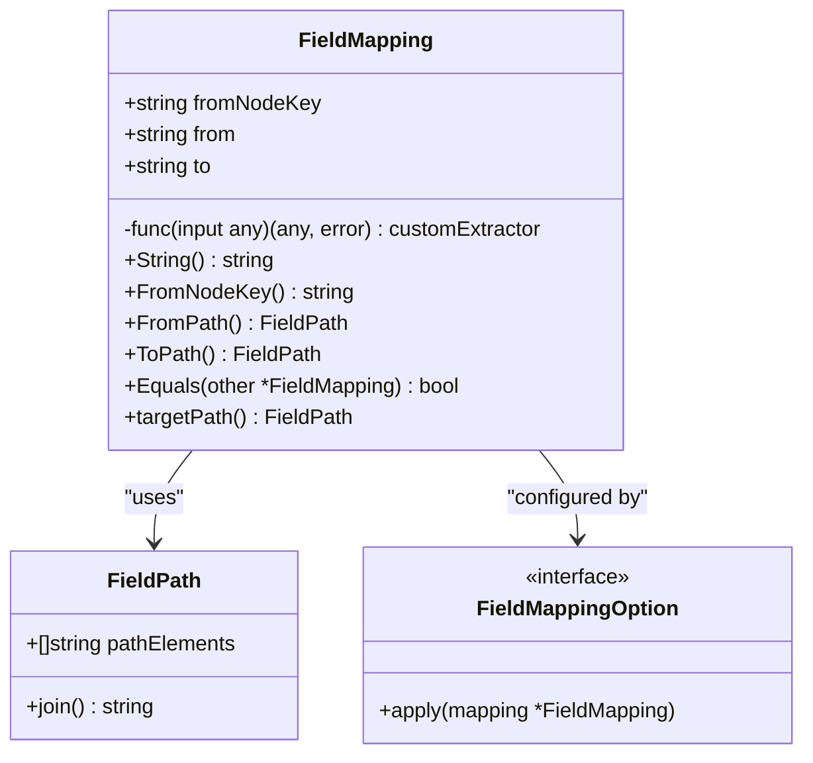
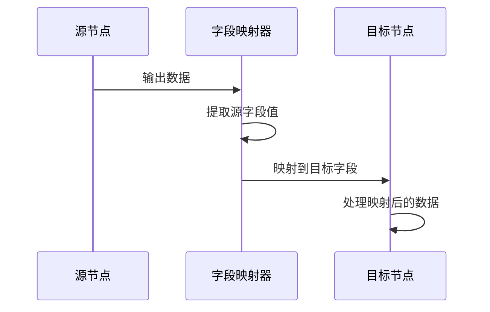
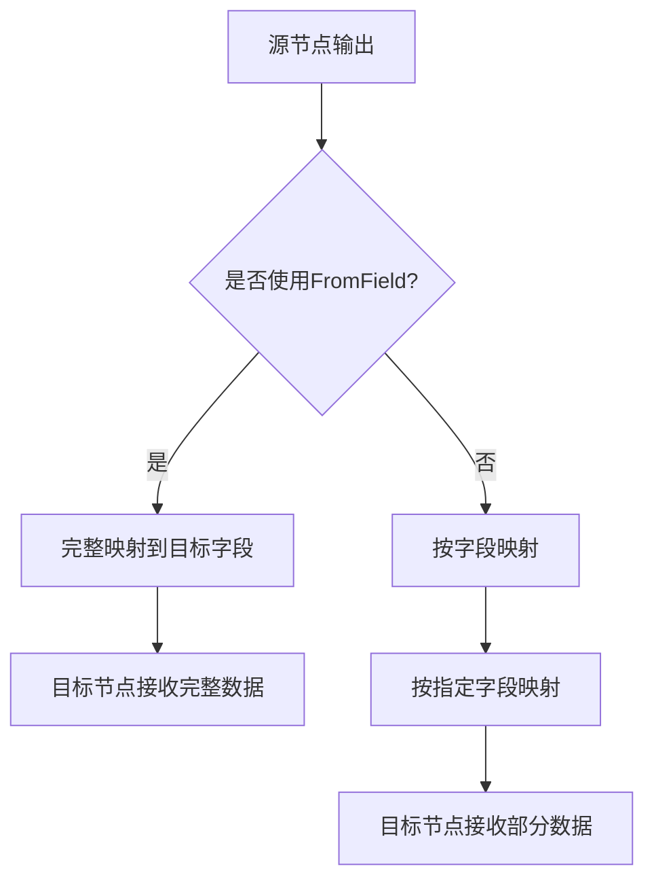
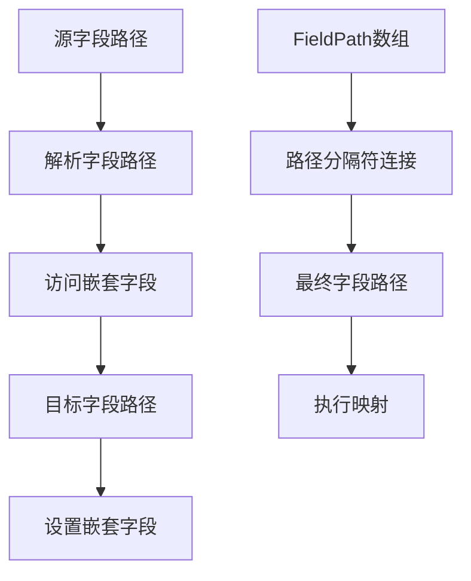
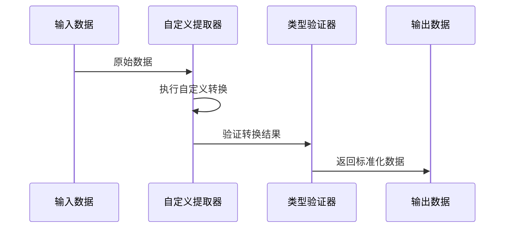
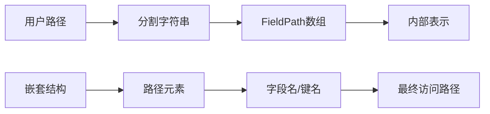
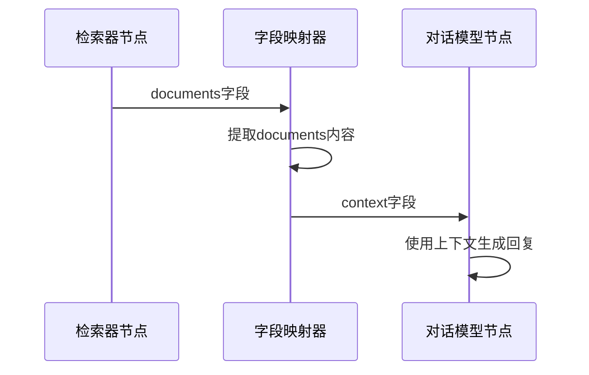
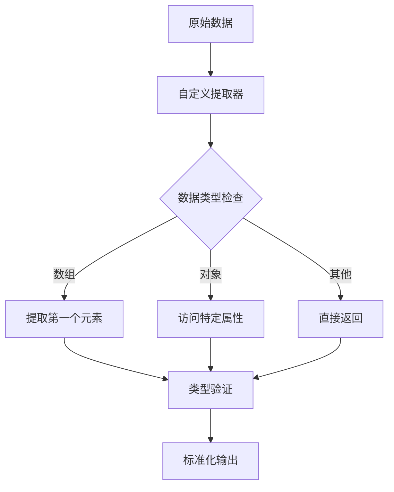
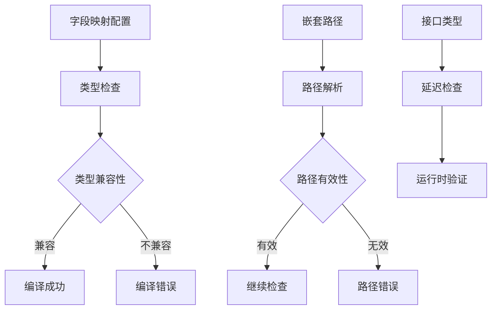

# 字段映射

<cite>
**本文档引用的文件**
- [field_mapping.go](file://compose/field_mapping.go)
- [workflow_test.go](file://compose/workflow_test.go)
- [workflow.go](file://compose/workflow.go)
- [graph.go](file://compose/graph.go)
</cite>

## 目录
1. [简介](#简介)
2. [核心结构体设计](#核心结构体设计)
3. [字段映射类型](#字段映射类型)
4. [自定义提取器](#自定义提取器)
5. [字段路径系统](#字段路径系统)
6. [实际应用示例](#实际应用示例)
7. [验证机制](#验证机制)
8. [性能考虑](#性能考虑)
9. [最佳实践](#最佳实践)
10. [总结](#总结)

## 简介

Eino框架的字段映射（Field Mapping）是Workflow模式中的核心机制，它实现了组件间输入输出结构的解耦和灵活数据流控制。通过字段映射，开发者可以精确地控制数据如何从一个节点流向另一个节点，支持复杂的嵌套结构访问和自定义数据转换。

字段映射系统提供了三种主要功能：
- **字段级映射**：将源节点的特定字段映射到目标节点的特定字段
- **结构体映射**：支持嵌套结构体字段的深度访问
- **自定义转换**：通过自定义提取器实现复杂的数据转换逻辑

## 核心结构体设计

### FieldMapping结构体

`FieldMapping`结构体是字段映射的核心数据结构，包含以下关键字段：

**图表来源**
- [field_mapping.go](file://compose/field_mapping.go#L31-L37)

#### 字段详解

1. **fromNodeKey**：源节点的标识符，指定数据来源
2. **from**：源字段路径，支持嵌套访问
3. **to**：目标字段路径，支持嵌套访问  
4. **customExtractor**：可选的自定义提取函数，用于复杂的数据转换

**章节来源**
- [field_mapping.go](file://compose/field_mapping.go#L31-L37)

## 字段映射类型

### 基础映射函数

Eino提供了多种创建字段映射的辅助函数：

#### MapFields - 基本字段映射
最常用的映射方式，直接将源字段映射到目标字段：

**图表来源**
- [field_mapping.go](file://compose/field_mapping.go#L84-L90)

#### FromField - 整体输入映射
将整个源节点输出映射为目标节点的单个字段：

**图表来源**
- [field_mapping.go](file://compose/field_mapping.go#L61-L69)

#### ToField - 整体输出映射
将整个源节点输出映射为目标节点的特定字段：

**章节来源**
- [field_mapping.go](file://compose/field_mapping.go#L61-L90)

### 高级映射函数

#### MapFieldPaths - 路径映射
支持嵌套结构的字段映射：

**图表来源**
- [field_mapping.go](file://compose/field_mapping.go#L178-L194)

#### FromFieldPath 和 ToFieldPath
专门用于处理嵌套结构的映射函数：

**章节来源**
- [field_mapping.go](file://compose/field_mapping.go#L144-L194)

## 自定义提取器

### WithCustomExtractor

自定义提取器允许开发者实现复杂的数据转换逻辑：

**图表来源**
- [field_mapping.go](file://compose/field_mapping.go#L199-L206)

### 使用场景

1. **数据格式转换**：将不同格式的数据统一化
2. **条件过滤**：根据业务规则筛选数据
3. **聚合操作**：合并多个字段或计算新值
4. **类型转换**：在不同类型间进行安全转换

**章节来源**
- [field_mapping.go](file://compose/field_mapping.go#L199-L206)
- [workflow_test.go](file://compose/workflow_test.go#L1467-L1498)

## 字段路径系统

### FieldPath设计

字段路径系统使用特殊的分隔符来处理嵌套结构：

**图表来源**
- [field_mapping.go](file://compose/field_mapping.go#L116-L143)

### 路径处理机制

1. **路径分割**：使用`\x1F`作为内部分隔符
2. **嵌套访问**：支持结构体字段和map键的深度访问
3. **类型检查**：运行时验证字段路径的有效性

**章节来源**
- [field_mapping.go](file://compose/field_mapping.go#L116-L143)

## 实际应用示例

### Retriever到ChatModel的映射

典型的RAG（检索增强生成）工作流中的字段映射：

**图表来源**
- [workflow_test.go](file://compose/workflow_test.go#L253-L260)

### 复杂数据转换示例

使用自定义提取器处理复杂数据结构：

**图表来源**
- [workflow_test.go](file://compose/workflow_test.go#L1467-L1498)

**章节来源**
- [workflow_test.go](file://compose/workflow_test.go#L253-L260)
- [workflow_test.go](file://compose/workflow_test.go#L1467-L1498)

## 验证机制

### 编译时验证

字段映射系统在编译阶段执行严格的类型检查：

**图表来源**
- [field_mapping.go](file://compose/field_mapping.go#L645-L775)

### 运行时验证

对于复杂或动态类型，系统提供运行时验证：

1. **类型分配检查**：确保源类型可以赋值给目标类型
2. **字段存在性检查**：验证字段路径的有效性
3. **导出字段检查**：确保访问的是导出字段

**章节来源**
- [field_mapping.go](file://compose/field_mapping.go#L645-L775)

## 性能考虑

### 数据流优化

字段映射系统采用多种优化策略：

1. **延迟计算**：只在需要时才执行字段访问
2. **类型缓存**：缓存类型信息减少反射开销
3. **路径预编译**：预先解析字段路径提高访问效率

### 内存管理

1. **零拷贝映射**：对于简单类型使用引用传递
2. **流式处理**：支持大数据集的流式映射
3. **内存复用**：重用中间结果减少GC压力

## 最佳实践

### 避免路径冲突

1. **唯一命名**：确保字段名称在整个结构中唯一
2. **层次清晰**：使用有意义的字段层次结构
3. **文档化**：为复杂映射添加注释说明

### 错误处理

1. **优雅降级**：处理字段不存在的情况
2. **类型安全**：始终进行类型检查
3. **错误传播**：正确处理映射过程中的错误

### 性能优化

1. **最小化映射**：只映射必要的字段
2. **批量处理**：对大量数据使用批量映射
3. **缓存策略**：缓存频繁访问的字段路径

## 总结

Eino框架的字段映射机制是一个强大而灵活的数据流控制系统。通过`FieldMapping`结构体的设计，它实现了：

1. **解耦组件**：通过字段映射实现组件间的松耦合
2. **灵活数据流**：支持复杂的嵌套结构访问和自定义转换
3. **类型安全**：提供编译时和运行时的双重类型检查
4. **高性能**：采用多种优化策略确保高效的数据处理

字段映射系统特别适用于构建复杂的AI工作流，如RAG系统、多模态处理管道等场景。通过合理使用字段映射，开发者可以构建出既灵活又可靠的分布式处理系统。