# Eino编排框架详细文档

<cite>
**本文档引用的文件**
- [compose/doc.go](file://compose/doc.go)
- [compose/graph.go](file://compose/graph.go)
- [compose/dag.go](file://compose/dag.go)
- [compose/state.go](file://compose/state.go)
- [compose/chain.go](file://compose/chain.go)
- [compose/workflow.go](file://compose/workflow.go)
- [compose/types.go](file://compose/types.go)
- [compose/graph_run.go](file://compose/graph_run.go)
- [compose/branch.go](file://compose/branch.go)
- [compose/chain_test.go](file://compose/chain_test.go)
- [compose/graph_test.go](file://compose/graph_test.go)
- [compose/workflow_test.go](file://compose/workflow_test.go)
</cite>

## 目录
1. [概述](#概述)
2. [核心架构](#核心架构)
3. [编排模式详解](#编排模式详解)
4. [Graph结构体深度分析](#graph结构体深度分析)
5. [DAG执行引擎](#dag执行引擎)
6. [状态管理系统](#状态管理系统)
7. [编排模式对比与选择](#编排模式对比与选择)
8. [实际应用示例](#实际应用示例)
9. [性能考量与最佳实践](#性能考量与最佳实践)
10. [总结](#总结)

## 概述

Eino的编排框架是其核心功能之一，提供了三种强大的编排模式：`Chain`（链式执行）、`Graph`（有向无环图）和`Workflow`（工作流）。这些模式为开发者提供了从简单到复杂的多种流程控制方案，满足不同场景下的业务需求。

编排框架的设计理念基于组件化和模块化原则，通过统一的接口和灵活的配置机制，实现了高度可扩展和可维护的流程控制系统。

## 核心架构

Eino编排框架采用分层架构设计，主要包含以下核心组件：

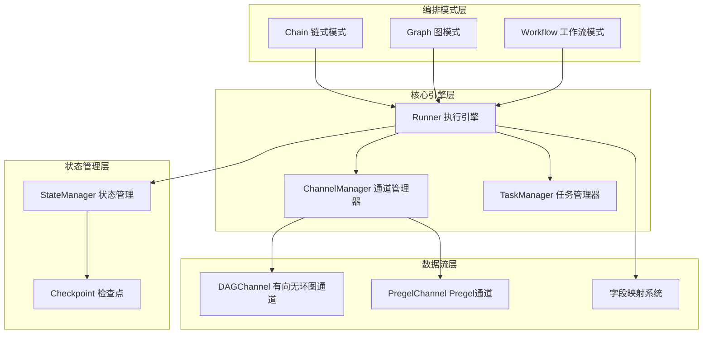

**图表来源**
- [compose/graph_run.go](file://compose/graph_run.go#L41-L82)
- [compose/dag.go](file://compose/dag.go#L23-L39)

**章节来源**
- [compose/doc.go](file://compose/doc.go#L1-L18)
- [compose/types.go](file://compose/types.go#L23-L46)

## 编排模式详解

### Chain（链式模式）

Chain是最简单的编排模式，适用于线性执行流程。它按照添加顺序依次执行各个节点，每个节点的输出作为下一个节点的输入。

#### 特点
- **线性执行**：节点按顺序执行，前一个节点完成才能执行后一个节点
- **简单易用**：适合简单的处理流程
- **支持分支和并行**：可以在链中插入分支和并行结构

#### 使用场景
- 文本处理流水线
- 数据转换管道
- 简单的业务流程

#### 核心实现

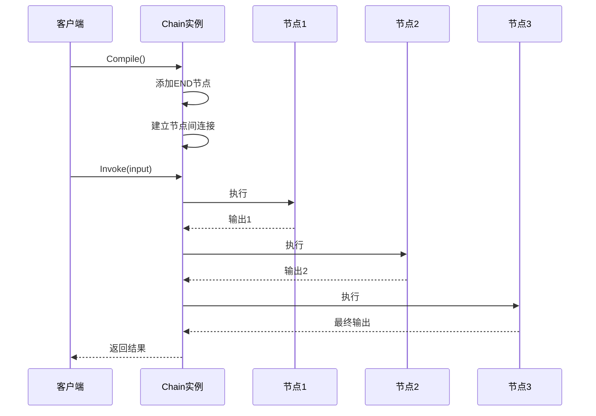

**图表来源**
- [compose/chain.go](file://compose/chain.go#L88-L94)
- [compose/chain.go](file://compose/chain.go#L96-L121)

**章节来源**
- [compose/chain.go](file://compose/chain.go#L36-L62)

### Graph（图模式）

Graph是最灵活的编排模式，支持复杂的有向无环图结构，可以实现分支、合并、循环等复杂流程控制。

#### 特点
- **灵活的图结构**：支持任意复杂的有向无环图
- **分支控制**：支持条件分支和多路分支
- **并行执行**：多个节点可以并行执行
- **状态共享**：支持节点间的状态共享

#### 运行模式

Graph支持两种运行模式：
- **Pregel模式**：支持循环，适用于大规模图处理任务
- **DAG模式**：严格的有向无环图，适用于确定性流程

#### 核心特性

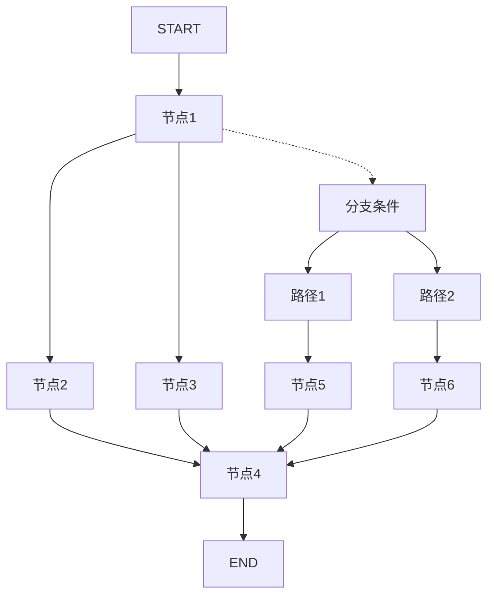

**图表来源**
- [compose/graph.go](file://compose/graph.go#L57-L64)
- [compose/types.go](file://compose/types.go#L40-L46)

**章节来源**
- [compose/graph.go](file://compose/graph.go#L162-L229)

### Workflow（工作流模式）

Workflow是最高级的编排模式，专注于字段级别的数据映射和依赖管理，提供了最精细的流程控制能力。

#### 特点
- **字段级映射**：精确控制数据在节点间的传递
- **依赖声明**：显式声明节点间的依赖关系
- **静态值设置**：支持预设静态值
- **灵活的依赖类型**：支持直接依赖、间接依赖和分支依赖

#### 核心概念

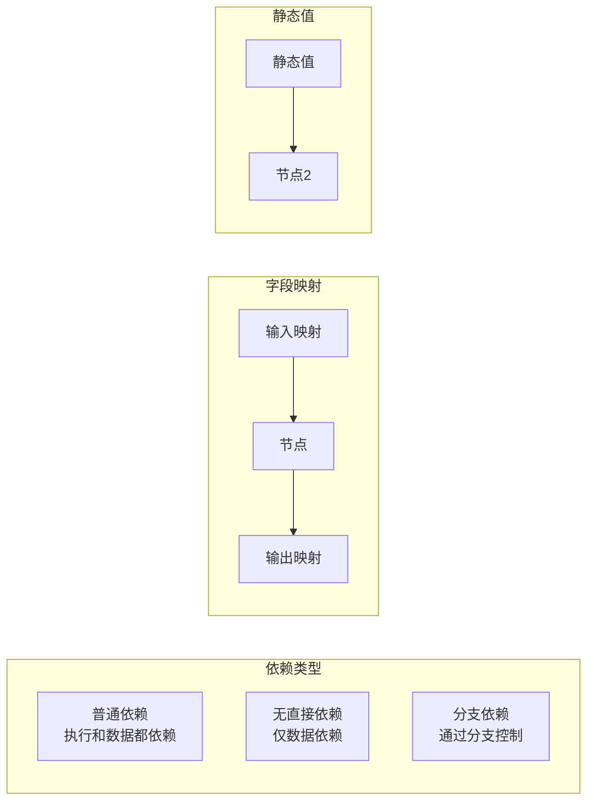

**图表来源**
- [compose/workflow.go](file://compose/workflow.go#L52-L58)
- [compose/workflow.go](file://compose/workflow.go#L167-L168)

**章节来源**
- [compose/workflow.go](file://compose/workflow.go#L51-L83)

## Graph结构体深度分析

`Graph`结构体是整个编排框架的核心，负责管理所有的节点、边和执行逻辑。

### 结构体定义

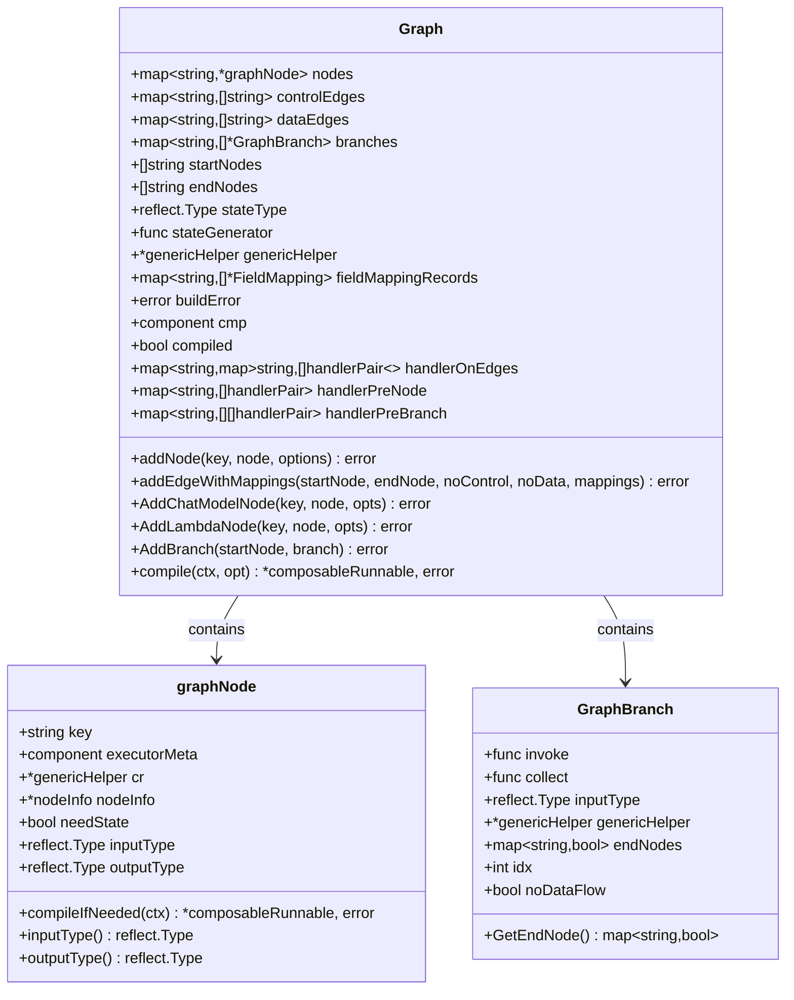

**图表来源**
- [compose/graph.go](file://compose/graph.go#L57-L89)
- [compose/graph.go](file://compose/graph.go#L162-L229)
- [compose/branch.go](file://compose/branch.go#L40-L50)

### 节点管理机制

Graph通过以下机制管理节点：

1. **节点注册**：通过`addNode`方法注册新节点
2. **类型检查**：验证节点输入输出类型的兼容性
3. **状态管理**：处理需要状态的节点
4. **处理器绑定**：为节点绑定前置和后置处理器

### 边管理机制

Graph维护两种类型的边：

1. **控制边（Control Edges）**：决定节点的执行顺序
2. **数据边（Data Edges）**：传递数据和字段映射

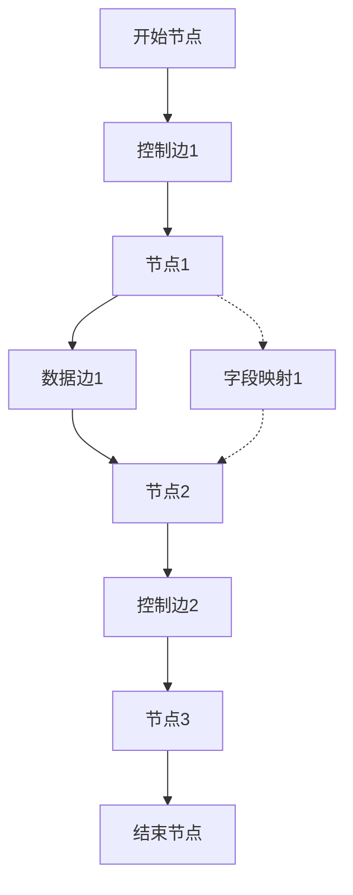

**图表来源**
- [compose/graph.go](file://compose/graph.go#L232-L294)
- [compose/graph.go](file://compose/graph.go#L517-L522)

**章节来源**
- [compose/graph.go](file://compose/graph.go#L162-L229)
- [compose/graph.go](file://compose/graph.go#L232-L294)

## DAG执行引擎

DAG（Directed Acyclic Graph）执行引擎是Graph模式的核心执行组件，负责管理节点的并发执行和依赖关系。

### 执行通道机制

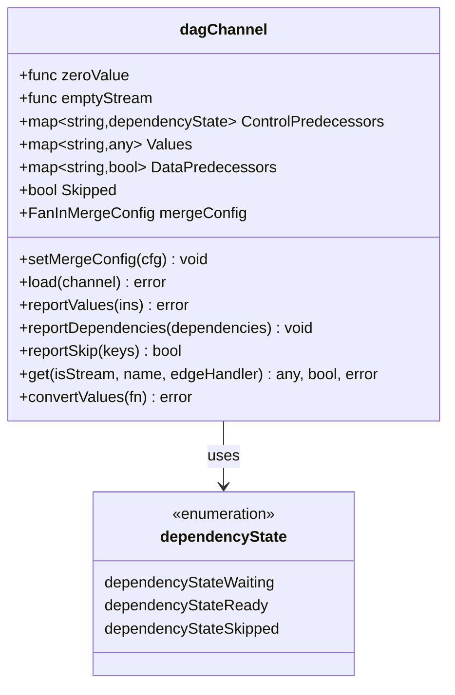

**图表来源**
- [compose/dag.go](file://compose/dag.go#L50-L60)
- [compose/dag.go](file://compose/dag.go#L42-L48)

### 依赖状态管理

DAG执行引擎通过三种依赖状态来管理节点的执行时机：

1. **dependencyStateWaiting**：等待所有前置依赖完成
2. **dependencyStateReady**：前置依赖已完成，准备执行
3. **dependencyStateSkipped**：前置依赖被跳过，该节点也被跳过

### 执行流程

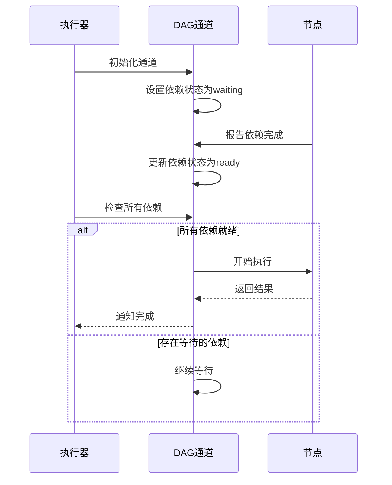

**图表来源**
- [compose/dag.go](file://compose/dag.go#L128-L191)

**章节来源**
- [compose/dag.go](file://compose/dag.go#L23-L196)

## 状态管理系统

状态管理系统为编排框架提供了全局状态共享的能力，支持复杂的业务逻辑和上下文管理。

### 状态结构设计

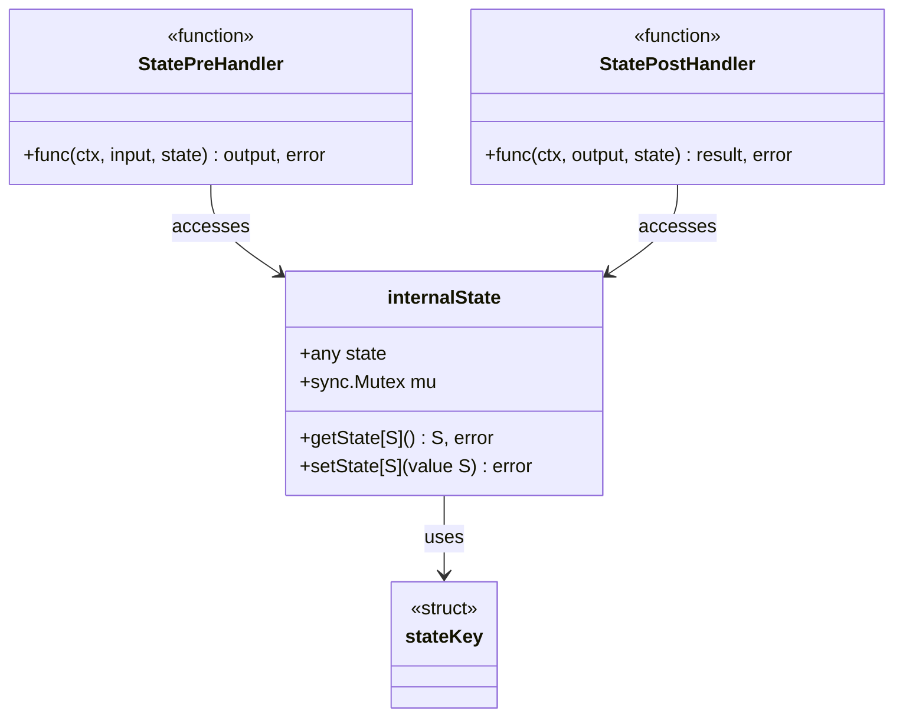

**图表来源**
- [compose/state.go](file://compose/state.go#L34-L37)
- [compose/state.go](file://compose/state.go#L32-L33)
- [compose/state.go](file://compose/state.go#L39-L45)

### 状态访问模式

状态管理系统提供了两种访问模式：

1. **同步访问**：通过`ProcessState`函数进行安全的状态访问
2. **异步访问**：通过处理器函数在节点执行前后访问状态

### 状态共享机制

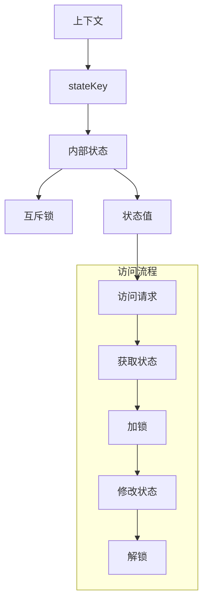

**图表来源**
- [compose/state.go](file://compose/state.go#L133-L141)
- [compose/state.go](file://compose/state.go#L143-L161)

**章节来源**
- [compose/state.go](file://compose/state.go#L29-L162)

## 编排模式对比与选择

### 功能对比表

| 特性 | Chain | Graph | Workflow |
|------|-------|-------|----------|
| 执行模式 | 线性 | 图形 | 字段映射 |
| 分支支持 | 是 | 是 | 是 |
| 并行支持 | 是 | 是 | 是 |
| 状态共享 | 是 | 是 | 是 |
| 字段映射 | 基础 | 基础 | 精确 |
| 复杂度 | 低 | 中 | 高 |
| 性能 | 高 | 中 | 中 |
| 易用性 | 高 | 中 | 低 |

### 选择指南

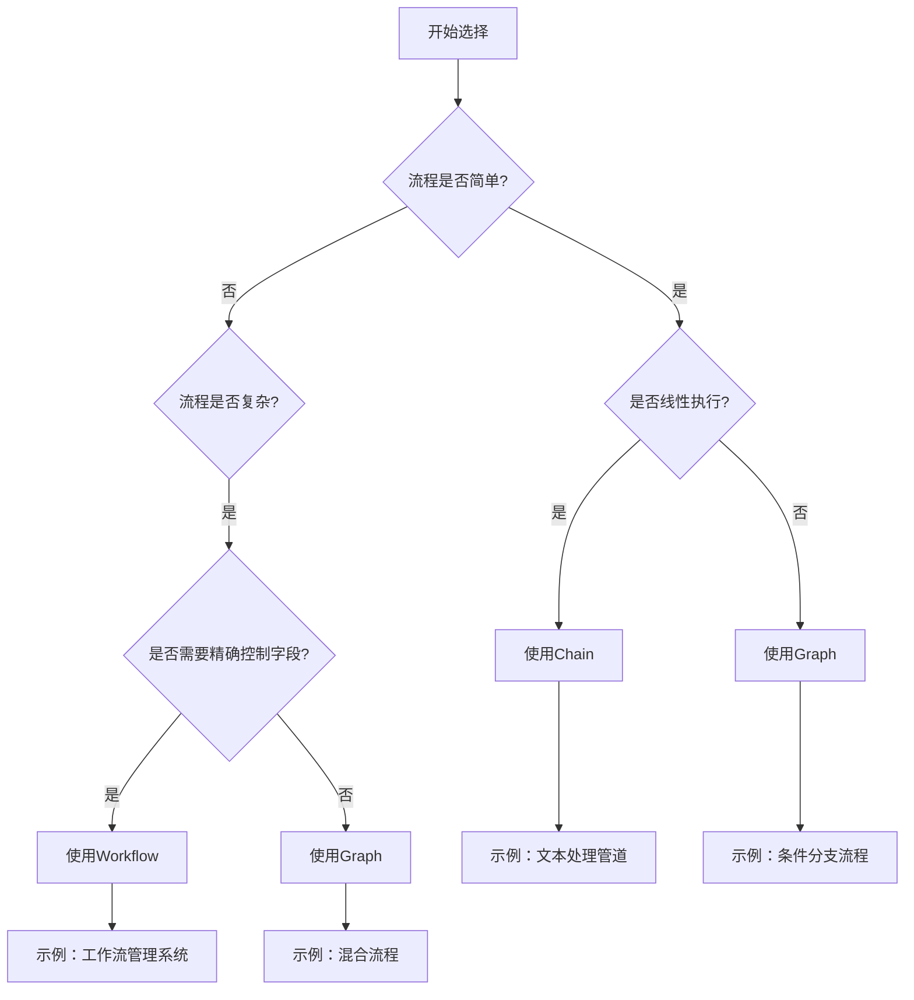

### 性能对比

| 模式 | 内存占用 | CPU开销 | 并发能力 | 可扩展性 |
|------|----------|---------|----------|----------|
| Chain | 低 | 低 | 有限 | 中等 |
| Graph | 中等 | 中等 | 高 | 高 |
| Workflow | 高 | 高 | 中等 | 中等 |

**章节来源**
- [compose/types.go](file://compose/types.go#L28-L35)

## 实际应用示例

### Chain模式示例

以下是一个典型的Chain模式应用场景：

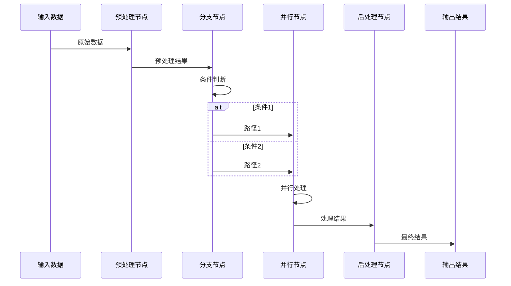

**图表来源**
- [compose/chain_test.go](file://compose/chain_test.go#L82-L100)

### Graph模式示例

Graph模式支持更复杂的流程结构：

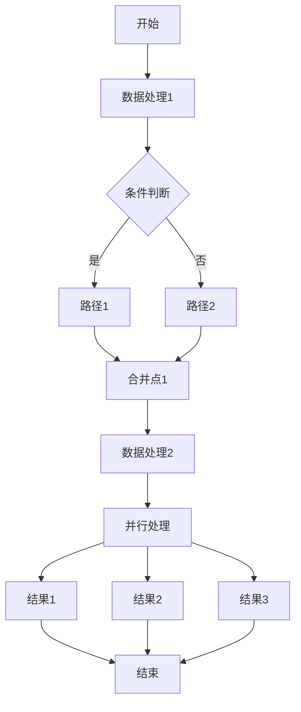

### Workflow模式示例

Workflow模式提供最精细的控制：

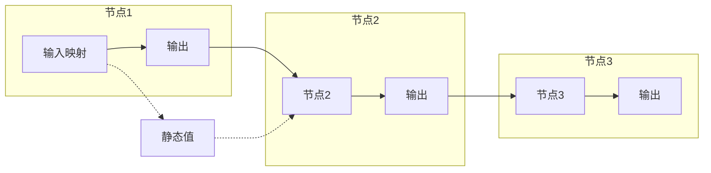

**章节来源**
- [compose/chain_test.go](file://compose/chain_test.go#L37-L109)
- [compose/graph_test.go](file://compose/graph_test.go#L37-L88)
- [compose/workflow_test.go](file://compose/workflow_test.go#L48-L110)

## 性能考量与最佳实践

### 性能优化策略

1. **合理选择编排模式**
   - 简单流程优先使用Chain
   - 复杂流程根据需要选择Graph或Workflow

2. **内存管理**
   - 及时释放不需要的数据
   - 使用流式处理减少内存占用

3. **并发控制**
   - 合理设置并行度
   - 避免过度并发导致资源竞争

4. **状态管理**
   - 最小化状态共享范围
   - 使用状态快照减少锁竞争

### 错误处理最佳实践

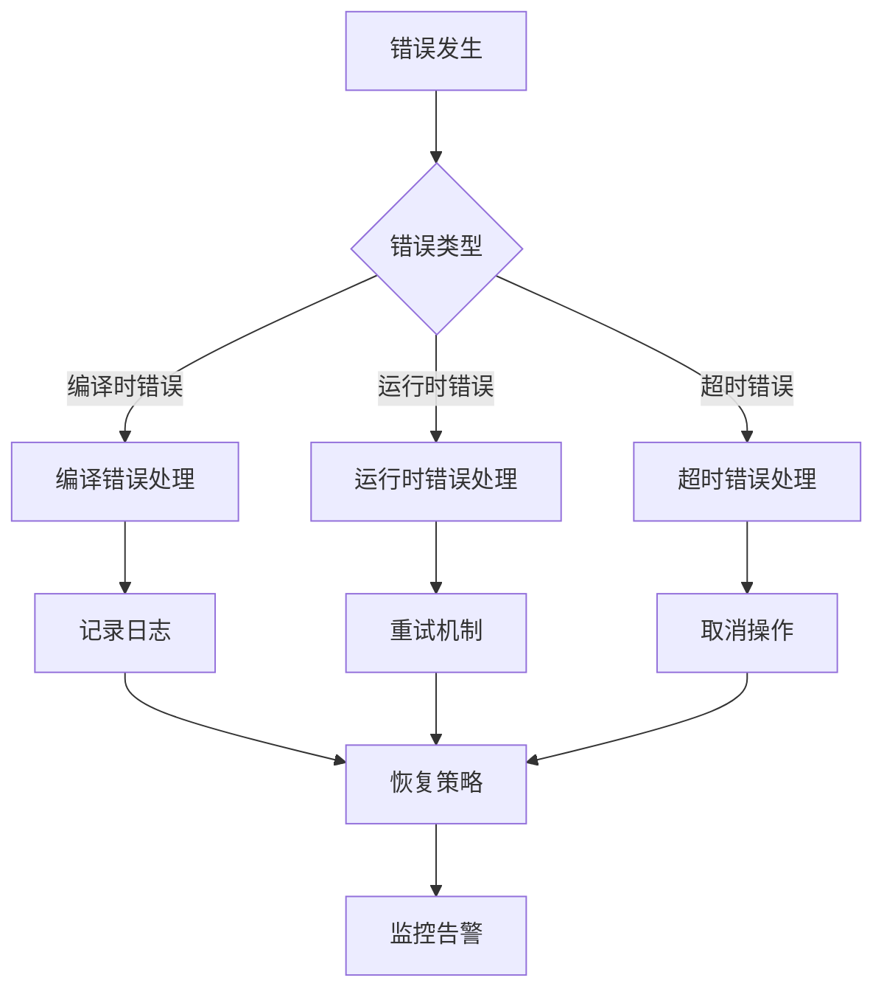

### 监控和调试

1. **执行跟踪**：记录每个节点的执行时间和状态
2. **性能指标**：监控吞吐量、延迟和资源使用率
3. **错误统计**：统计各类错误的发生频率和原因
4. **状态检查点**：定期保存执行状态用于故障恢复

**章节来源**
- [compose/graph_run.go](file://compose/graph_run.go#L107-L363)

## 总结

Eino的编排框架通过三种不同的编排模式，为开发者提供了从简单到复杂的完整流程控制解决方案：

1. **Chain模式**：适合线性执行流程，简单易用，性能优异
2. **Graph模式**：支持复杂的图形结构，灵活强大，适合大多数业务场景
3. **Workflow模式**：提供字段级别的精确控制，适合复杂的工作流管理

每种模式都有其特定的应用场景和优势，开发者应根据具体的业务需求选择合适的编排模式。同时，框架提供的状态管理和错误处理机制，确保了系统的稳定性和可靠性。

通过深入理解这些编排模式的原理和特点，开发者可以构建出高效、可维护的业务流程系统，充分发挥Eino框架的强大功能。