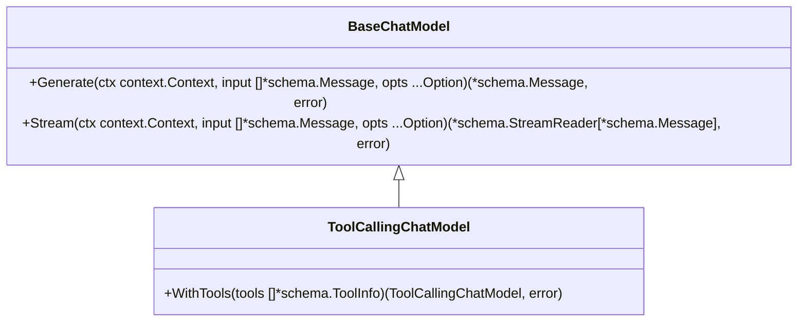
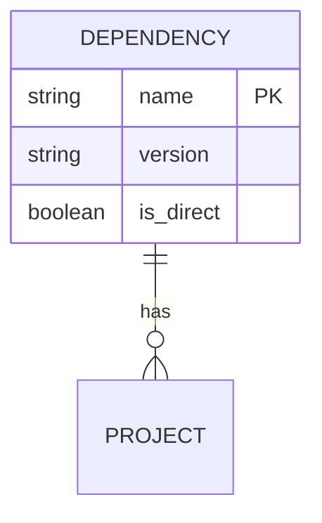
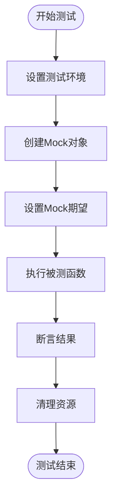
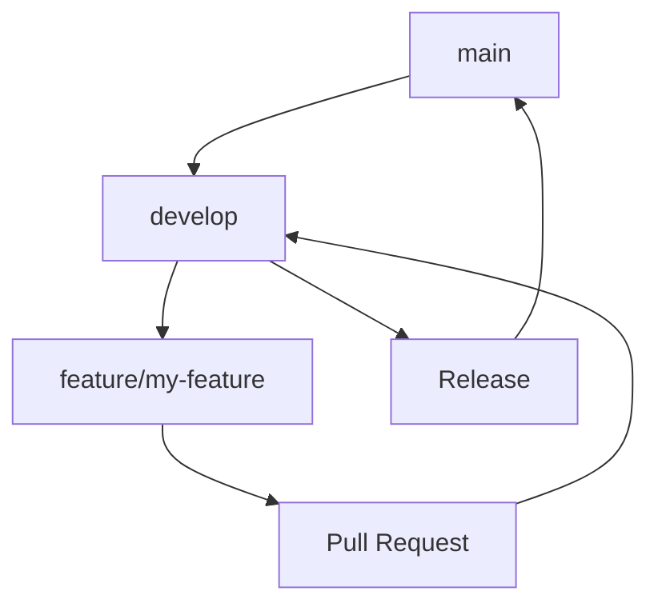
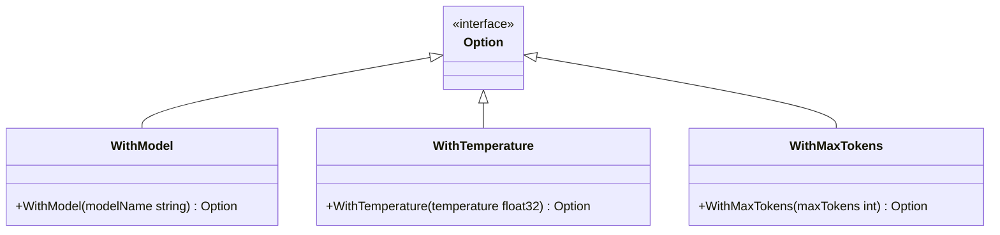
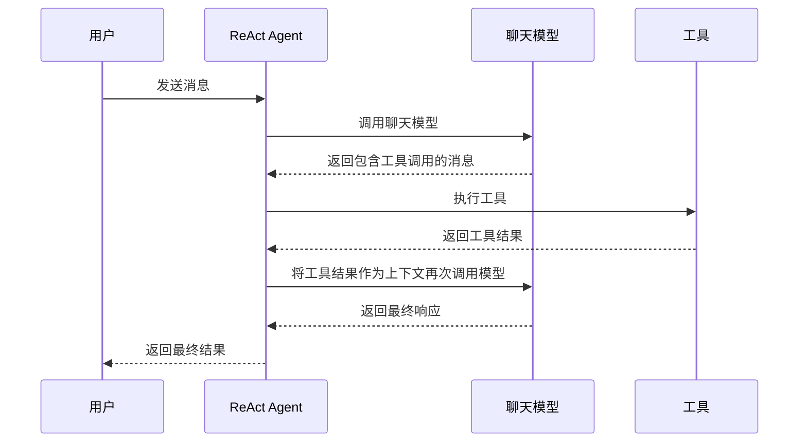

# 贡献指南

<cite>
**本文档中引用的文件**  
- [CONTRIBUTING.md](file://CONTRIBUTING.md)
- [CODE_OF_CONDUCT.md](file://CODE_OF_CONDUCT.md)
- [README.md](file://README.md)
- [doc.go](file://doc.go)
- [go.mod](file://go.mod)
- [adk/chatmodel.go](file://adk/chatmodel.go)
- [components/model/interface.go](file://components/model/interface.go)
- [compose/runnable.go](file://compose/runnable.go)
- [flow/agent/react/react.go](file://flow/agent/react/react.go)
- [adk/chatmodel_test.go](file://adk/chatmodel_test.go)
- [components/model/option_test.go](file://components/model/option_test.go)
</cite>

## 目录
1. [简介](#简介)
2. [代码风格与规范](#代码风格与规范)
3. [开发环境设置](#开发环境设置)
4. [编写与运行测试](#编写与运行测试)
5. [提交Pull Request](#提交pull-request)
6. [添加新组件](#添加新组件)
7. [添加新预定义流程](#添加新预定义流程)
8. [文档与测试覆盖率](#文档与测试覆盖率)
9. [社区行为准则](#社区行为准则)

## 简介

Eino是一个旨在成为Golang中终极LLM应用开发框架的项目。本贡献指南旨在为社区成员提供清晰的指导，帮助您为Eino项目做出贡献。我们将详细介绍代码风格、开发环境设置、测试编写、Pull Request提交流程，以及如何添加新组件和预定义流程。

**Section sources**
- [README.md](file://README.md#L1-L273)

## 代码风格与规范

Eino项目遵循Go语言的最佳实践和社区标准。代码风格和规范是确保代码质量和可维护性的关键。

### 命名约定

项目遵循Go语言的命名约定：
- 使用驼峰命名法（CamelCase）进行类型和函数命名
- 包名使用小写字母，简洁明了
- 导出的标识符（可从包外部访问）以大写字母开头
- 非导出的标识符以小写字母开头

### 注释要求

代码注释是理解代码意图的重要途径。Eino项目要求：
- 所有导出的类型、函数、方法和变量都必须有清晰的注释
- 注释应使用完整的句子，以句号结尾
- 使用`//go:generate`注释来标记代码生成指令
- 为复杂的算法或业务逻辑提供详细的解释



**Diagram sources**
- [components/model/interface.go](file://components/model/interface.go#L25-L57)

**Section sources**
- [components/model/interface.go](file://components/model/interface.go#L1-L57)

## 开发环境设置

为了顺利地为Eino项目贡献代码，您需要正确设置开发环境。

### 前提条件

在开始之前，请确保您的开发环境满足以下要求：
- Go 1.18或更高版本
- Git版本控制系统
- GitHub账户

### 安装依赖

Eino项目使用Go Modules进行依赖管理。要安装所有依赖，请执行以下命令：

```bash
go mod download
```

项目的主要依赖包括：
- github.com/bytedance/sonic：高性能JSON库
- github.com/getkin/kin-openapi：OpenAPI JSONSchema实现
- github.com/stretchr/testify：测试断言库
- go.uber.org/mock：mock生成工具



**Diagram sources**
- [go.mod](file://go.mod#L1-L53)

**Section sources**
- [go.mod](file://go.mod#L1-L53)
- [README.md](file://README.md#L253-L254)

## 编写与运行测试

测试是确保代码质量和功能正确性的关键。Eino项目要求所有新代码都必须有相应的测试覆盖。

### 测试文件结构

测试文件遵循Go的约定，与源文件同名，但以`_test.go`结尾。例如，`chatmodel.go`的测试文件是`chatmodel_test.go`。

### 编写测试

Eino项目使用`testing`包和`github.com/stretchr/testify/assert`进行测试断言。以下是一个测试示例：



**Diagram sources**
- [adk/chatmodel_test.go](file://adk/chatmodel_test.go#L34-L178)

### 运行测试

要运行所有测试，请使用以下命令：

```bash
go test ./...
```

要查看测试覆盖率，请使用：

```bash
go test -coverprofile=coverage.out ./...
go tool cover -html=coverage.out
```

**Section sources**
- [adk/chatmodel_test.go](file://adk/chatmodel_test.go#L1-L200)
- [components/model/option_test.go](file://components/model/option_test.go#L1-L111)

## 提交Pull Request

提交Pull Request是贡献代码的标准流程。请遵循以下步骤以确保您的贡献能够顺利被接受。

### 分支管理

Eino项目使用[git-flow](https://nvie.com/posts/a-successful-git-branching-model/)作为分支管理模型。请遵循以下流程：
1. Fork Eino仓库
2. 从`develop`分支创建新的功能分支
3. 在功能分支上进行开发
4. 提交Pull Request到`develop`分支



**Diagram sources**
- [CONTRIBUTING.md](file://CONTRIBUTING.md#L7-L8)

### Pull Request指南

在提交Pull Request之前，请确保：
- 搜索已有的Pull Request，避免重复工作
- 确保有相应的issue描述您要修复的问题或要添加的功能
- 提交的代码遵循项目的代码风格和规范
- 包含适当的测试用例
- 提交消息遵循[AngularJS Git提交消息约定](https://docs.google.com/document/d/1QrDFcIiPjSLDn3EL15IJygNPiHORgU1_OOAqWjiDU5Y/edit)

**Section sources**
- [CONTRIBUTING.md](file://CONTRIBUTING.md#L24-L42)

## 添加新组件

添加新组件是扩展Eino功能的重要方式。本节将指导您如何实现`components/model.ChatModel`接口并遵循选项模式。

### 实现ChatModel接口

要添加一个新的聊天模型组件，您需要实现`components/model`包中的`ChatModel`接口。该接口定义了基本的聊天功能：

```go
type BaseChatModel interface {
    Generate(ctx context.Context, input []*schema.Message, opts ...Option) (*schema.Message, error)
    Stream(ctx context.Context, input []*schema.Message, opts ...Option) (*schema.StreamReader[*schema.Message], error)
}
```

### 选项模式

Eino项目使用选项模式来配置组件。要实现选项模式，请遵循以下步骤：
1. 定义一个`Options`结构体来存储配置
2. 创建选项函数，这些函数返回一个可以修改`Options`的函数
3. 使用`GetCommonOptions`函数来合并和应用选项



**Diagram sources**
- [components/model/interface.go](file://components/model/interface.go#L25-L57)
- [components/model/option.go](file://components/model/option.go)

**Section sources**
- [components/model/interface.go](file://components/model/interface.go#L25-L57)
- [components/model/option.go](file://components/model/option.go)

## 添加新预定义流程

预定义流程是Eino框架中的高级功能，允许用户快速构建复杂的LLM应用。本节将指导您如何在`flow/`目录下创建新包。

### 创建新流程包

要在`flow/`目录下创建新的预定义流程，请遵循以下步骤：
1. 在`flow/`目录下创建一个新的子目录
2. 在新目录中创建`doc.go`文件，包含包的文档
3. 实现您的流程逻辑
4. 提供清晰的API接口

### ReAct Agent示例

Eino项目提供了一个完整的ReAct Agent实现作为示例。ReAct Agent是一个能够自主决定是否调用工具的智能代理。



**Diagram sources**
- [flow/agent/react/react.go](file://flow/agent/react/react.go#L1-L398)

**Section sources**
- [flow/agent/react/react.go](file://flow/agent/react/react.go#L1-L398)

## 文档与测试覆盖率

高质量的文档和充分的测试覆盖率是Eino项目的核心价值。所有新代码都必须有相应的文档和测试。

### 文档要求

为新代码编写文档时，请确保：
- 为所有导出的标识符提供清晰的注释
- 在包的`doc.go`文件中提供包级别的文档
- 为复杂的逻辑提供使用示例
- 更新项目的README.md文件以反映新功能

### 测试覆盖率

Eino项目要求所有新代码的测试覆盖率不低于80%。要确保您的代码满足这一要求：
- 为所有公共API编写单元测试
- 覆盖边界条件和错误情况
- 使用mock对象隔离外部依赖
- 定期运行`go test -cover`来检查覆盖率

**Section sources**
- [README.md](file://README.md#L3-L10)
- [adk/chatmodel_test.go](file://adk/chatmodel_test.go)
- [components/model/option_test.go](file://components/model/option_test.go)

## 社区行为准则

Eino项目致力于创建一个开放、包容、尊重的社区环境。所有贡献者都必须遵守《贡献者公约行为准则》。

### 我们的承诺

作为成员、贡献者和领导者，我们承诺：
- 使参与我们的社区成为每个人的无骚扰体验
- 无论年龄、体型、可见或不可见的残疾、民族、性别特征、性别认同和表达、经验水平、教育、社会经济地位、国籍、个人外貌、种族、宗教或性取向如何
- 以有助于开放、欢迎、多样、包容和健康的社区的方式行动和互动

### 不可接受的行为

不可接受的行为包括：
- 使用性化语言或图像，以及任何形式的性关注或性进展
- 嘲笑、侮辱或贬损性评论，以及人身或政治攻击
- 公开或私下骚扰
- 未经明确许可发布他人的私人信息，如物理或电子邮件地址
- 在专业环境中可能被视为不合适的其他行为

### 执行

如果您遇到滥用、骚扰或不可接受的行为，请报告给conduct@cloudwego.io。社区领导者将及时、公平地审查和调查所有投诉。

**Section sources**
- [CODE_OF_CONDUCT.md](file://CODE_OF_CONDUCT.md#L1-L129)