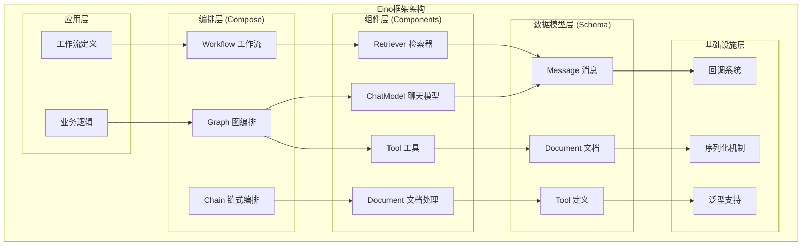
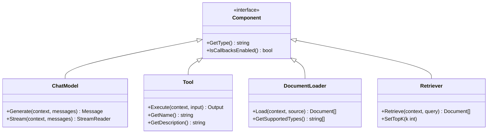
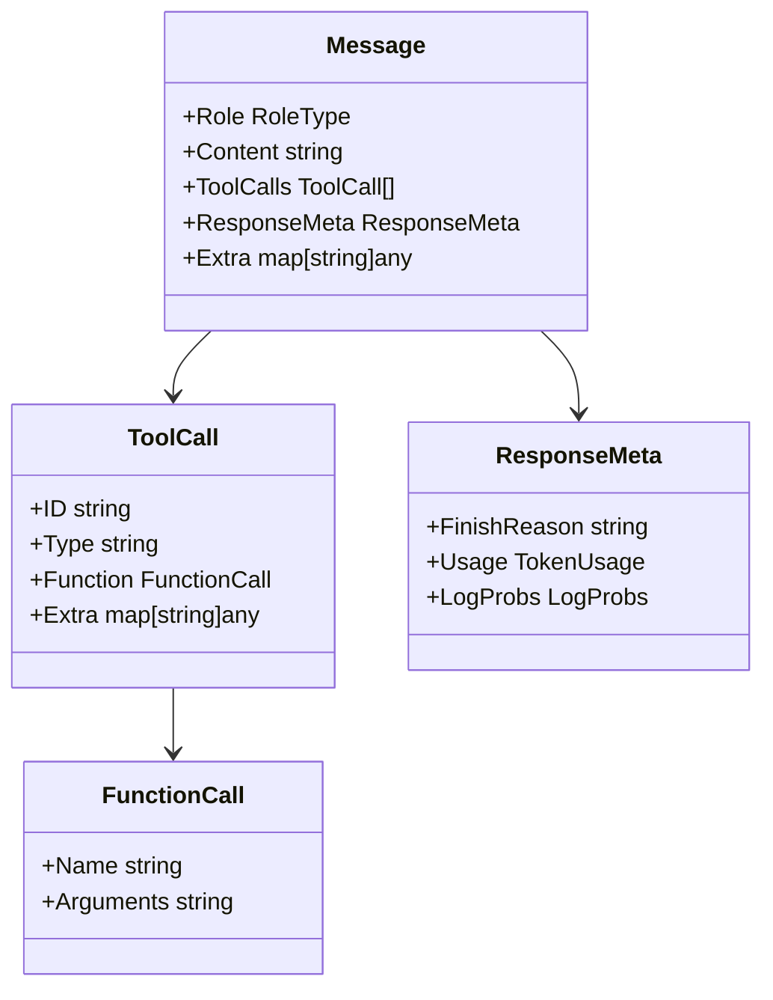
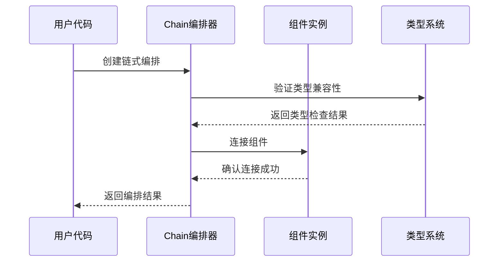
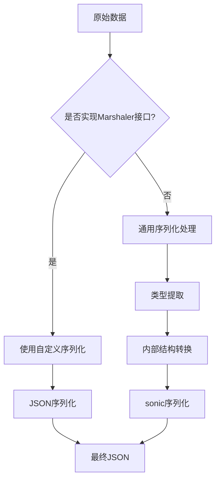
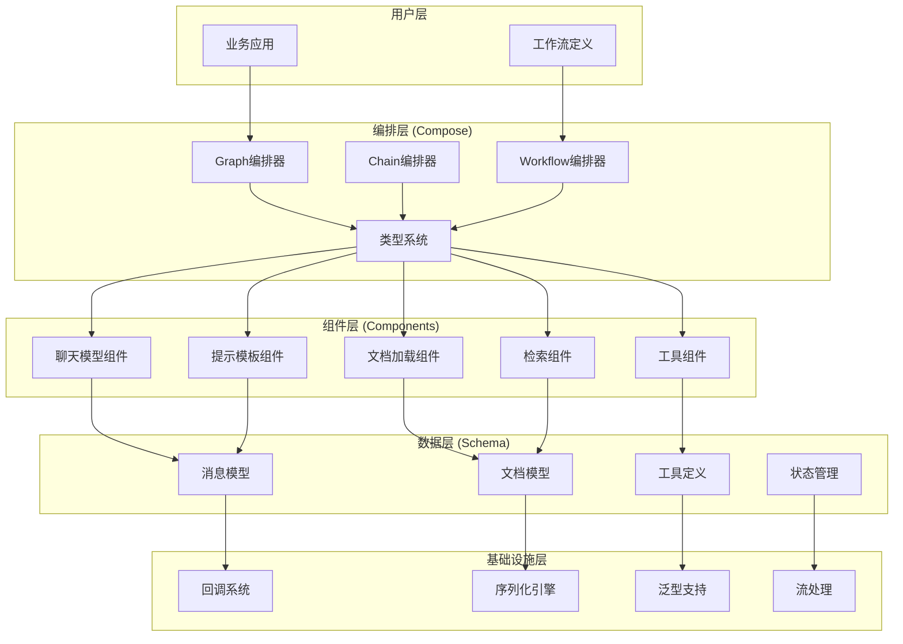

# Eino框架项目概述

<cite>
**本文档引用的文件**
- [README.md](file://README.md)
- [doc.go](file://doc.go)
- [go.mod](file://go.mod)
- [adk/flow.go](file://adk/flow.go)
- [compose/runnable.go](file://compose/runnable.go)
- [compose/graph.go](file://compose/graph.go)
- [compose/chain.go](file://compose/chain.go)
- [schema/message.go](file://schema/message.go)
- [components/types.go](file://components/types.go)
- [callbacks/interface.go](file://callbacks/interface.go)
- [internal/generic/generic.go](file://internal/generic/generic.go)
- [internal/serialization/serialization.go](file://internal/serialization/serialization.go)
</cite>

## 目录
1. [简介](#简介)
2. [框架定位与设计理念](#框架定位与设计理念)
3. [核心架构概览](#核心架构概览)
4. [四大核心层次](#四大核心层次)
5. [关键技术特性](#关键技术特性)
6. [微内核式架构设计](#微内核式架构设计)
7. [技术选型考量](#技术选型考量)
8. [与其他LLM框架的差异化](#与其他llm框架的差异化)
9. [架构图解](#架构图解)
10. [总结](#总结)

## 简介

Eino（发音类似于"I know"）是CloudWeGo团队开发的Go语言大型语言模型（LLM）应用开发终极解决方案。该框架汲取了开源社区中优秀LLM应用开发框架的精华，同时结合前沿研究和实际应用场景，为Go语言开发者提供了简洁、可扩展、可靠且高效的LLM应用开发框架。

Eino不仅仅是一个简单的工具包，而是一个完整的生态系统，涵盖了从组件抽象到编排能力，从API设计到最佳实践的全方位支持。它旨在标准化、简化和提升AI应用开发生命周期中不同阶段的效率。

**章节来源**
- [README.md](file://README.md#L16-L27)

## 框架定位与设计理念

### 设计目标

Eino的核心设计目标是成为Go语言中LLM应用开发的终极解决方案，强调以下四个维度：

1. **简洁性**：提供精心策划的组件抽象和实现，易于重用和组合
2. **可扩展性**：强大的编排框架，处理强类型检查、流处理、并发管理等复杂任务
3. **可靠性**：确保系统的稳定性和容错能力
4. **有效性**：提供最佳实践和示例，加速开发进程

### 核心价值主张

Eino为开发者提供的不仅仅是工具，而是一整套完整的解决方案：

- **精心策划的组件列表**：涵盖LLM应用开发所需的各类抽象和实现
- **强大的编排框架**：自动处理类型安全、并发管理、切面注入等复杂问题
- **简洁清晰的API设计**：专注于简单性和易用性
- **丰富的最佳实践集合**：包含预置的工作流和示例
- **完整的开发工具链**：从可视化开发调试到在线追踪评估

**章节来源**
- [README.md](file://README.md#L19-L26)

## 核心架构概览

Eino采用分层架构设计，将复杂的LLM应用开发分解为四个核心层次，每个层次都有明确的职责和边界：

**图表来源**
- [compose/runnable.go](file://compose/runnable.go#L28-L37)
- [adk/flow.go](file://adk/flow.go#L19-L28)

## 四大核心层次

### 1. 核心层 (Compose)

核心层是Eino框架的编排引擎，负责将各个组件连接成复杂的应用流程。它提供了三种主要的编排方式：

#### 编排类型对比

| API类型 | 特征和用途 |
|---------|------------|
| Chain | 简单的链式有向图，只能向前流动 |
| Graph | 支持循环或无环有向图的强大且灵活的编排 |
| Workflow | 支持结构字段级别数据映射的无环图 |

#### 核心编排能力

- **类型安全的编排**：通过Go泛型实现强类型检查
- **流处理能力**：自动处理流式响应的复杂性
- **并发管理**：内置并发安全机制
- **切面注入**：支持横切关注点的解耦
- **选项分配**：灵活的配置管理

**章节来源**
- [compose/runnable.go](file://compose/runnable.go#L28-L37)
- [compose/graph.go](file://compose/graph.go#L36-L50)

### 2. 组件层 (Components)

组件层提供了LLM应用开发所需的各种基础组件，每个组件都遵循统一的接口规范：

#### 组件分类

**图表来源**
- [components/types.go](file://components/types.go#L50-L62)

#### 组件特性

- **统一的接口规范**：所有组件都实现标准的输入输出类型
- **多种实现选择**：每种组件类型都有多个实现可供选择
- **嵌套和复杂业务逻辑**：支持复杂的业务场景
- **透明的使用方式**：多Agent等复杂组件可以像普通组件一样使用

**章节来源**
- [components/types.go](file://components/types.go#L17-L62)

### 3. 数据模型层 (Schema)

数据模型层定义了LLM应用中的核心数据结构，确保不同类型组件之间的数据兼容性：

#### 核心数据结构

**图表来源**
- [schema/message.go](file://schema/message.go#L433-L467)

#### 多模态支持

Eino支持文本和多模态内容的处理，包括：
- 文本内容（纯文本）
- 图像内容（URL/Base64编码）
- 音频内容（URL/Base64编码）
- 视频内容（URL/Base64编码）
- 文件内容（URL/Base64编码）

**章节来源**
- [schema/message.go](file://schema/message.go#L146-L240)

### 4. 预定义流程 (Flow)

预定义流程层提供了经过验证的最佳实践和完整的工作流实现：

#### 流程类型

- **ReAct Agent**：结合聊天模型和工具调用的智能代理
- **多查询检索器**：支持多个查询的检索策略
- **多Agent主机**：协调多个Agent的执行
- **Supervisor**：监督和管理其他组件

**章节来源**
- [adk/flow.go](file://adk/flow.go#L39-L49)

## 关键技术特性

### 1. 类型安全的编排

Eino利用Go泛型实现了类型安全的编排系统：

**图表来源**
- [compose/runnable.go](file://compose/runnable.go#L100-L150)

### 2. 选项模式（Option Pattern）

Eino广泛使用选项模式提供灵活的配置机制：

- **全局配置**：影响所有节点的配置
- **组件类型配置**：针对特定组件类型的配置
- **节点级配置**：针对特定节点的配置

### 3. 切面（Callbacks）系统

Eino的回调系统实现了横切关注点的解耦：

#### 回调时机

| 回调时机 | 描述 |
|----------|------|
| OnStart | 任务开始时触发 |
| OnEnd | 任务结束时触发 |
| OnError | 发生错误时触发 |
| OnStartWithStreamInput | 开始处理流式输入时触发 |
| OnEndWithStreamOutput | 结束处理流式输出时触发 |

**章节来源**
- [callbacks/interface.go](file://callbacks/interface.go#L68-L77)

## 微内核式架构设计

Eino采用微内核式架构，具有以下优势：

### 架构特点

1. **核心功能最小化**：只保留最核心的编排和类型系统
2. **插件化组件**：所有组件都是可插拔的
3. **统一的接口**：所有组件都遵循相同的接口规范
4. **灵活的编排**：支持多种编排模式

### 扩展性优势

- **易于添加新组件**：只需实现标准接口即可
- **灵活的编排策略**：可以根据需求选择不同的编排方式
- **可插拔的序列化**：支持多种序列化格式
- **可扩展的回调系统**：支持自定义回调处理器

**章节来源**
- [compose/runnable.go](file://compose/runnable.go#L42-L63)

## 技术选型考量

### 1. 使用sonic进行高性能JSON处理

Eino选择了Bytedance的sonic库作为JSON处理引擎，原因包括：

- **性能优势**：比标准库快数倍
- **内存效率**：更少的内存分配
- **稳定性**：经过大规模生产环境验证
- **兼容性**：完全兼容标准库API

#### 序列化机制

**图表来源**
- [internal/serialization/serialization.go](file://internal/serialization/serialization.go#L69-L76)

### 2. 使用gonja作为模板引擎

Eino集成了gonja（Jinja2的Go实现）用于模板渲染：

- **安全性**：禁用了危险的模板指令
- **功能丰富**：支持条件、循环、过滤器等
- **性能优化**：编译时优化模板
- **语法熟悉**：与Python Jinja2语法一致

### 3. 泛型支持

Eino充分利用Go 1.18+的泛型特性：

- **类型安全**：编译时类型检查
- **零成本抽象**：运行时无额外开销
- **代码复用**：减少重复代码
- **性能优化**：避免反射带来的性能损失

**章节来源**
- [internal/generic/generic.go](file://internal/generic/generic.go#L23-L50)

## 与其他LLM框架的差异化

### 1. Go语言原生优势

相比Python生态中的LangChain等框架，Eino具有以下优势：

- **性能优势**：Go的编译型特性和垃圾回收优化
- **并发优势**：原生的goroutine支持
- **类型安全**：强类型系统减少运行时错误
- **部署优势**：单体二进制文件，易于部署

### 2. 架构设计理念

- **微内核架构**：更灵活的扩展机制
- **组件化设计**：更清晰的职责分离
- **类型驱动**：编译时错误检测
- **流式处理**：原生支持流式数据处理

### 3. 生态系统完整性

- **完整的工具链**：从开发到部署的全流程支持
- **丰富的组件库**：涵盖各种LLM应用场景
- **最佳实践**：经过验证的工作流和模式
- **社区支持**：活跃的开源社区

## 架构图解

以下是Eino框架的整体架构图，展示了主要模块之间的数据流和控制流：

**图表来源**
- [compose/graph.go](file://compose/graph.go#L57-L90)
- [compose/chain.go](file://compose/chain.go#L72-L82)

### 数据流和控制流

#### 数据流

1. **输入处理**：从用户输入开始，经过组件处理
2. **组件串联**：通过编排器连接各个组件
3. **类型转换**：在组件间自动进行类型转换
4. **输出生成**：最终生成用户需要的结果

#### 控制流

1. **编排决策**：根据配置决定组件的执行顺序
2. **条件分支**：支持基于条件的流程控制
3. **异常处理**：统一的错误处理机制
4. **状态管理**：维护执行过程中的状态信息

## 总结

Eino框架代表了Go语言LLM应用开发的新高度，通过其独特的设计理念和技术选型，为开发者提供了一个既强大又易用的开发平台。其四大核心层次——核心层、组件层、数据模型层和预定义流程层——形成了一个完整而灵活的生态系统。

### 主要优势

1. **架构先进**：微内核式架构，高度可扩展
2. **类型安全**：利用Go泛型实现编译时类型检查
3. **性能优异**：选择高性能的sonic和gonja库
4. **功能完整**：涵盖从开发到部署的全流程
5. **社区活跃**：持续更新和改进

### 适用场景

- **企业级应用**：需要高性能和稳定性的场景
- **实时应用**：需要低延迟响应的应用
- **复杂业务流程**：需要精细控制执行流程的场景
- **多模态应用**：需要处理多种媒体类型的应用

Eino不仅仅是一个技术框架，更是Go语言在AI领域应用的一次重要探索。它证明了Go语言在现代软件开发中的强大潜力，特别是在需要高性能和高可靠性的场景中。随着AI技术的不断发展，Eino框架将继续演进，为更多的开发者提供优秀的开发体验。